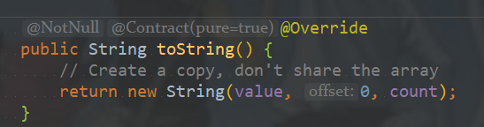
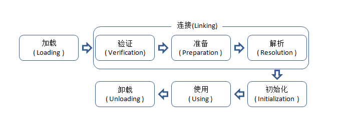
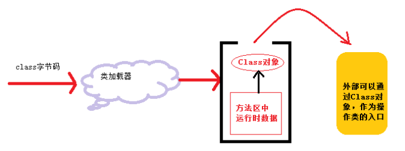
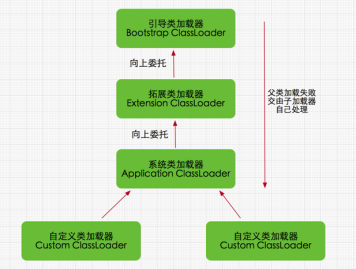

[TOC]

# 一、Java内存区域（JDK1.8）

Java虚拟机再执行Java程序的过程中会把它所管理的内存划分为若干个不同的数据区域。主要包含以下几个运行时数据区域：


## 1.1 程序计数器

**程序计数器是一块较小的内存空间，它可以看作是当前线程所执行的字节码的行号指示器。**

**由于Java虚拟机的多线程是通过线程轮流切换并分配处理器执行时间的方式来实现的**，一个处理器都只会执行一条线程中的指令。因此，为了线程切换后能恢复到正确的执行位置，每条线程都有一个独立的程序计数器，各个线程之间计数器互不影响，独立存储。称之为“线程私有”的内存。程序计数器内存区域是虚拟机中唯一没有规定OutOfMemoryError情况的区域。

## 1.2 Java虚拟机栈

java虚拟机也是线程私有的，它的生命周期和线程相同。**虚拟机栈描述的是Java方法执行的内存模型** ：**每个方法在执行的同时都会创建一个栈帧（Stack Frame）用于存储局部变量表、操作数栈、动态链接、方法出口等信息。**


咱们常说的堆内存、栈内存中，栈内存指的就是虚拟机栈。局部变量表存放了编译期可知的各种基本数据类型（8个基本数据类型）、对象引用（地址指针）、returnAddress类型。

局部变量表所需的内存空间在编译期间完成分配。在运行期间不会改变局部变量表的大小。

这个区域规定了两种异常状态：如果线程请求的栈深度大于虚拟机所允许的深度，则抛出StackOverflowError异常；如果虚拟机栈可以动态扩展，在扩展是无法申请到足够的内存，就会抛出OutOfMemoryError异常。

## 1.3 本地方法栈

本地方法栈与虚拟机栈所发挥作用非常相似，它们之间的区别不过是虚拟机栈为虚拟机执行Java方法（也就是字节码）服务，而本地方法栈则为虚拟机使用到的native方法服务。本地方法栈也是抛出两个异常。

## 1.4 Java堆

java堆是java虚拟机所管理的内存中最大的一块，是被所有线程共享的一块内存区域，在虚拟机启动时创建。此内存区域的唯一目的就是存放对象实例，这一点在Java虚拟机规范中的描述是：**所有的对象实例以及数组都要在堆上分配。**

java堆是垃圾收集器管理的主要区域，因此也被称为“GC堆”（Garbage Collected Heap）。从内存回收角度来看java堆可分为：新生代和老生代。从内存分配的角度看，线程共享的Java堆中可能划分出多个线程私有的分配缓冲区（Thread Local Allocation Buffer，TLAB）。无论怎么划分，都与存放内容无关，无论哪个区域，存储的都是对象实例，进一步的划分都是为了更好的回收内存，或者更快的分配内存。

根据Java虚拟机规范的规定，java堆可以处于物理上不连续的内存空间中。当前主流的虚拟机都是可扩展的（通过 -Xmx 和 -Xms 控制）。如果堆中没有内存完成实例分配，并且堆也无法再扩展时，将会抛出OutOfMemoryError异常。

## 1.5 方法区

方法区与java堆一样，是各个线程共享的内存区域，它用于存储已被虚拟机加载的类信息、常量、静态变量、即时编译器编译后的代码等数据。它有个别命叫Non-Heap（非堆）。当方法区无法满足内存分配需求时，抛出OutOfMemoryError异常。

**JDK1.7中将放在永久代中的常量池移出到Java堆中**

**符号引用(Symbols)转移到了native heap;**

**字面量(interned strings)转移到了java heap;**

**类的静态变量(class statics)转移到了java heap。**

**JDK1.8已经不存在永久代，使用元空间来实现方法区。**

**元数据区取代了1.7版本及以前的永久代。元数据区和永久代本质上都是方法区的实现。方法区存放虚拟机加载的类信息，静态变量，常量等数据。**  

**方法区和永久代的区别**：

什么是方法区？

方法区（Method Area）是**jvm规范**里面的运行时数据区的一个组成部分，jvm规范中的运行时数据区还包含了：pc寄存器、虚拟机栈、堆、方法区、运行时常量池、本地方法栈。

方法区存储东西？

主要用来存储class、运行时常量池、字段、方法、代码、JIT代码等。

注意：

（1）**运行时数据区跟内存不是一个概念**。

（2）**方法区是运行时数据区的一部分**

（3）方法区是jvm**规范**中的一部分，**并不是实际的实现**，切忌将规范跟实现[混为一谈](https://www.baidu.com/s?wd=%E6%B7%B7%E4%B8%BA%E4%B8%80%E8%B0%88&tn=24004469_oem_dg&rsv_dl=gh_pl_sl_csd)。

我们再来看下永久带（Perm区）：

永久带又叫Perm区，只存在于hotspot jvm中，并且只存在于jdk7和之前的版本中，jdk8中已经彻底移除了永久带，jdk8中引入了一个新的内存区域叫metaspace。

（1）并不是所有的jvm中都有永久带，[ibm](https://www.baidu.com/s?wd=ibm&tn=24004469_oem_dg&rsv_dl=gh_pl_sl_csd)的j9，[oracle](https://www.baidu.com/s?wd=oracle&tn=24004469_oem_dg&rsv_dl=gh_pl_sl_csd)的JRocket都没有永久带。

（2）永久带是**实现**层面的东西。

（3）永久带里面存的东西基本上就是方法区规定的那些东西。

**因此，我们可以说，永久带是方法区的一种实现，当然，在hotspot jdk8中metaspace可以看成是方法区的一种实现。**

下面我们来看下hotspot jdk8中移除了永久带以后的内存结构：


结论：

（1）方法区是规范层面的东西，规定了这一个区域要存放哪些东西

（2）永久带或者是metaspace是对方法区的不同实现，是实现层面的东西。

**JDK 8 中永久代向元空间的转换的原因：**

- 1、字符串存在永久代中，容易出现性能问题和内存溢出。
- 2、类及方法的信息等比较难确定其大小，因此对于永久代的大小指定比较困难，太小容易出现永久代溢出，太大则容易导致老年代溢出。
- 3、永久代会为 GC 带来不必要的复杂度，并且回收效率偏低。
- 4、Oracle 可能会将HotSpot 与 JRockit 合二为一。

## 1.6 运行时常量池

运行时常量池是方法区的一部分。Class文件中除了有类的版本、字段、方法、接口等描述信息外，还有一项信息是常量池，用于存放编译期生成的各种字面量和符号引用，这部分内容将在加载后进入方法区的运行时常量池中存放。

## 1.7 直接内存

直接内存不是虚拟机运行时数据区的一部分，也不是java虚拟机规范中定义的内存区域。但这部分区域也呗频繁使用，而且也可能导致OutOfMemoryError异常

在JDK1.4中新加入的NIO（New Input/Output）类，引入了一种基于通道（Channel）与缓冲区（Buffer）的I/O方式，它可以使用Native函数库直接分配堆外内存，然后通过一个存储在java堆中的DirectByteBuffer对象作为这块内存的引用进行操作。

# 二、OutOfMemoryError

## 2.1 Java堆溢出

Java堆用于存储对象实例，只要不断的创建对象，并且保证GC Roots到对象之间有可达路径来避免垃圾回收机制清楚这些对象，那么在对象数量达到最大堆的容量限制后就会产生内存溢出异常。

设置运行参数：`-Xms20m -Xmx20m -XX:+HeapDumpOnOutOfMemoryError`

将堆的最小值和最大值设置为一样可避免自动扩展，通过参数`-XX:+HeapDumpOnOutOfMemoryError`可以让虚拟机在出现内存溢出异常时Dump出当前的内存堆转储快照以便事后进行分析。

代码：

```java
package com.jvm.outofmemory;

import java.util.ArrayList;
import java.util.List;

/**
 * @Author: 98050
 * @Time: 2019-01-10 20:40
 * @Feature: Java堆溢出 -Xms20m -Xmx20m -XX:+HeapDumpOnOutOfMemoryError
 */
public class HeapOOM {
    static class OOMObject{
    }

    public static void main(String[] args) {
        List<OOMObject> list = new ArrayList<OOMObject>();
        while (true){
            list.add(new OOMObject());
        }
    }
}

```

结果：


## 2.2 虚拟机栈和本地方法栈溢出

**正常的方法调用（包括递归），栈的深度在1000~2000**

**局部变量表内容越多，栈帧越大，栈深度越小。**

当我们定义的方法参数和局部变量过多，字节过大，考虑到可能会导致栈深度多小，可能使程序出现错误。

这个时候就需要手动的增加栈的深度，避免出错。

由于在HotSpot虚拟机中并不区分虚拟机栈和本地方法栈，因此只能由-Xss参数设置栈容量。关于虚拟机栈和本地方法栈，在Java虚拟机中描述了两种异常：

- 如果线程请求的栈深度大于虚拟机所允许的最大深度，将抛出StackOverflowError异常
- 如果虚拟机在扩展栈时无法申请到足够的内存空间，则抛出OutOfMemory异常

```java
package com.jvm.outofmemory;

/**
 * @Author: 98050
 * @Time: 2019-01-10 21:05
 * @Feature: -Xss128k
 */
public class JavaVMStackSOF {

    private int stackLength = 1;

    public void stackLeak(){
        stackLength ++;
        stackLeak();
    }

    public static void main(String[] args) throws Throwable {
        JavaVMStackSOF oom = new JavaVMStackSOF();
        try{
            oom.stackLeak();
        }catch (Throwable e){
            System.out.println("stack length:" + oom.stackLength);
            throw e;
        }
    }
}

```

结果：

不设置栈容量：


设置栈容量为128k


单个线程下无论由于栈帧太大还是虚拟机容量太小，当内存无法分配的时候，虚拟机抛出的都是StackOverflowError异常。

```java
package com.jvm.outofmemory;

/**
 * @Author: 98050
 * @Time: 2019-01-10 21:15
 * @Feature: -Xss200M 创建线程导致内存溢出异常
 */
public class JavaVMStackOOM {
    private void dontStop(){
        while (true){

        }
    }

    public void stackLeakByThread(){
        while (true){
            Thread thread = new Thread(new Runnable() {
                public void run() {
                    dontStop();
                }
            });
            thread.start();
        }
    }

    public static void main(String[] args) {
        JavaVMStackOOM oom = new JavaVMStackOOM();
        oom.stackLeakByThread();
    }
}

```

## 2.3 方法区和运行时常量池溢出

运行时常量池是方法区的一部分。

JDK1.7之前方法区也叫永久代，使用`-XX:PermSize=2m -XX:MaxPermSize=2m` 来设置方法区的大小

JDK1.8使用元空间（Metaspace）替代了永久代（PermSize），因此使用`-XX:MetaspaceSize=2m -XX:MaxMetaspaceSize=2m`来设置元空间的大小

代码：

```java
package com.jvm.outofmemory;

import java.util.ArrayList;
import java.util.List;

/**
 * @Author: 98050
 * @Time: 2019-01-10 21:47
 * @Feature: JDK1.7之前:-XX:PermSize=10M -XX:MaxPermSize=10M     JDK1.8:-XX:MetaspaceSize=2m -XX:MaxMetaspaceSize=2m
 */
public class RuntimeConstantPoolOOM {
    public static void main(String[] args) {
        List<String> list = new ArrayList<String>();
        int i = 0;
        while (true){
            list.add(String.valueOf(i++).intern());
        }
    }
}

```

结果：


## 2.4 String.intern()引发的思考

String.intern()是一个Native方法，它的作用是：如果字符串常量池中已经包含一个等于此String对象的字符串，则返回代表池中这个字符串的String对象；否则，将此String对象包含的字符串添加到常量池中，并且返回此String对象的引用。

**知识点**

> JDK 1.7 和 1.8 将字符串常量由永久代转移到堆中。JDK 1.7以后的intern()实现不会再复制实例到永久代中，因为永久代已经被移除，用元空间来实现方法区。
>

> 字符串池里的内容是在类加载完成，经过验证，准备阶段之后在堆中生成字符串对象实例，然后将该字符串对象实例的引用值存到string pool中（记住：string pool中存的是引用值而不是具体的实例对象，具体的实例对象是在堆中开辟的一块空间存放的）。 
>

> 在HotSpot VM里实现的string pool功能的是一个StringTable类，它是一个哈希表，里面存的是驻留字符串(也就是我们常说的用双引号括起来的)的引用（而不是驻留字符串实例本身），也就是说在堆中的某些字符串实例被这个StringTable引用之后就等同被赋予了”驻留字符串”的身份。这个StringTable在每个HotSpot VM的实例只有一份，被所有的类共享。

> **JDK 1.7后，intern方法还是会先去查询常量池中是否有已经存在的字符串引用，如果存在，则返回常量池中的引用，这一点与之前没有区别，区别在于，如果在常量池找不到对应的字符串，则不会再将字符串拷贝到常量池，而只是在常量池中生成一个对原字符串的引用。简单的说，就是往常量池放的东西变了：原来在常量池中找不到时，复制一个副本放到常量池，1.7后则是将在堆上的地址引用复制到常量池。**

### 2.4.1 分析1
```java
String str3 = new String("hello");
System.out.println(str3.intern() == str3);

String str4 = new String("java");
System.out.println(str4.intern()  == str4);
```
运行结果都为false。为什么?

str3指向的是堆上的对象引用，str3.intern()返回的是常量池中"hello"的引用；str4同理。

```java
    String temp = new String("hello");
	temp.intern();
    String temp2 = "hello";
    System.out.println(temp == temp2);
```
返回false

### 2.4.2 分析2

```java
        String temp = new String("hello");
        String temp2 = "hello";
        System.out.println(temp == temp2);
        System.out.println(temp2 == temp.intern());
```

通过字面量赋值创建字符串时，会先在常量池中查找是否存在相同的字符串，若存在，则将栈中的引用直接指向该字符串；若不存在，则在常量池中生成一个字符串，再将栈中的引用指向该字符串。 

第一个返回结果是false，第二个是true。在直接赋值创建temp2时会扫描常量池中是否有"hello"，因为有第一步，所以在创建temp2的时候常量池中已经有“hello”了，那么temp2就返回"hello"的引用即可。所以第一个输出false，因为temp在堆上。temp2返回的是常量池中的引用，所以第二条输出就返回true了。

### 2.4.3 分析3

```java
 		String str5 = "hello";
        System.out.println(str5.intern() == str5);

        String str6 = "java";
        System.out.println(str6.intern() == str6);
```

运行结果都为true。这个就容易理解了，调用intern方法返回的是常量池中的引用，即指向同一个地址。

### 2.4.4 分析4

```java
        String str1 = new StringBuilder("he").append("llo").toString();
		System.out.println(str1.intern() == str1);

        String str2 = new StringBuilder("ja").append("va").toString();
        System.out.println(str2.intern() == str2);
```

第一个返回true，第二个返回false。

看一下SpringBuilder的源码：



所以其本质就是`String str1 = new String("hello")`，这条语句的执行原理是，先去字符串常量池中查找是否有“hello”，没有的话就新建一个，然后让堆上的str1指向它，所以`str1.intern()`和str1其实都是指向字符串常量池中的“hello”。

还有一个问题，为什么第二个会返回false。说明常量池中已经有“java”了，所以两个对象地址不同。

常量池中存放编译期生成的各种字面量和符合引用。

### 2.4.5 分析5

```java
        String str7 = new String("ja")+new String("va");
        System.out.println(str7 == str7.intern());

        String str8 = new String("he")+new String("llo");
        System.out.println(str8 == str8.intern());
```

第一个返回结果是false，第二个返回结果是true。为什么？关键在于“+”这个连接符，它的底层是调用StringBuilder实现的，所以一切就了然于胸了。

## 2.5 本机直接内存溢出

DirectMemory可以通过`-XX:MaxDirectMemorySize`指定，如果不指定，则与默认Java堆最大值(-Xmx)一样。

jdk1.4之后，引入nio概念，加入了通道，缓冲区。可以直接使用native方法库直接分配堆外内存。在某些场景下，可以避免，在堆中来回复制对象，而是直接通过DirectByteBuffer直接操作该ne内存区域，从而提高性能。直接内存溢出：是在程序使用了NIO后发生OutOfMemoryError 异常。

代码：

```java
package com.jvm.outofmemory;

import sun.misc.Unsafe;

import java.lang.reflect.Field;

/**
 * @Author: 98050
 * @Time: 2019-01-10 22:36
 * @Feature: 直接内存溢出 -Xmx20m -XX:MaxDirectMemorySize=10M
 */
public class DirectMemoryOOM {
     private static final int _1MB = 1024*1024;

    public static void main(String[] args) throws IllegalAccessException {
        Field unsafeField = Unsafe.class.getDeclaredFields()[0];
        unsafeField.setAccessible(true);
        Unsafe unsafe = (Unsafe) unsafeField.get(null);
        while (true){
            unsafe.allocateMemory(_1MB);
        }
    }
}

```

结果：


## 2.6 内存溢出和内存泄漏的区别

**Java内存泄漏**就是没有及时清理内存垃圾，导致系统无法再给你提供内存资源（内存资源耗尽）；

**Java内存溢出**就是你要求分配的内存超出了系统能给你的，系统不能满足需求，于是产生溢出。

内存溢出，这个好理解，说明存储空间不够大。就像倒水倒多了，从杯子上面溢出了来了一样。内存泄漏，原理是，使用过的内存空间没有被及时释放，长时间占用内存，最终导致内存空间不足，而出现内存溢出。

# 三、判断对象的生死

## 3.1 引用计数算法

给对象中添加一个引用计数器，每当有一个地方引用它时，计数器值加１；当引用失效时，计数器值减１.任何时刻计数器值为０的对象就是不可能再被使用的。但是它很难解决对象之间相互循环引用的问题。

## 3.2 可达性分析算法

其基本思路**就是通过一系列名为”GC Roots”的对象作为起始点**，从这些节点开始向下搜索，搜索所走过的路径称为引用链(Reference Chain)，当一个对象到GC Roots没有任何引用链相连时，则证明此对象是不可用的。


如何选取GC Roots对象呢？在Java语言中，可以作为GC Roots的对象包括下面几种：

**(1). 虚拟机栈（栈帧中的局部变量区，也叫做局部变量表）中引用的对象。**

**(2). 方法区中的类静态属性引用的对象。**

**(3). 方法区中常量引用的对象。**

**(4). 本地方法栈中JNI(Native方法)引用的对象。**

## 3.3 Java中的引用

### 3.3.1 强引用

只要强引用还存在，垃圾收集器永远不会回收掉被引用的对象

```java
package com.jvm.references;

/**
 * @Author: 98050
 * @Time: 2019-01-11 21:03
 * @Feature: 强引用
 */
public class Test {

    public static void main(String[] args) {
        //创建一个对象，new出来的对象都是分配在java堆中的
        Sample sample = new Sample();   //sample这个引用就是强引用

        sample = null;                  //将这个引用指向空指针,
        //那么上面那个刚new来的对象就没用任何其它有效的引用指向它了
        //也就说该对象对于垃圾收集器是符合条件的
        //因此在接下来某个时间点 GC进行收集动作的时候, 该对象将会被销毁，内存被释放
    }
}
class Sample{

}

```


### 3.3.2 软引用

软引用在java.lang.ref包中有与之对应的类java.lang.ref.SoftReference。 

**重点：**  被软引用指向的对象不会被垃圾收集器收集(即使该对象没有强引用指向它)，除非jvm使用内存不够了，才会对这类对象进行销毁，释放内存。举个简单的例子： 

```java
package com.jvm.references;

import java.lang.ref.SoftReference;

/**
 * @Author: 98050
 * @Time: 2019-01-11 21:08
 * @Feature: 软引用
 */
public class Test2 {

    public static void main(String[] args) {
        //创建一个对象，new出来的对象都是分配在java堆中的
        Sample sample = new Sample();   //sample这个引用就是强引用

        //创建一个软引用指向这个对象   那么此时就有两个引用指向Sample对象
        SoftReference<Sample> softRef = new SoftReference<Sample>(sample);

        //将强引用指向空指针 那么此时只有一个软引用指向Sample对象
        //注意：softRef这个引用也是强引用，它是指向SoftReference这个对象的
        //private T referent; 这个才是软引用， 只被jvm使用
        sample = null;

        //可以重新获得Sample对象，并用一个强引用指向它
        sample = softRef.get();
    }
}

```


测试一下当jvm内存不足的情况下，软引用的回收情况。 

```java
package com.jvm.references;

import java.lang.ref.SoftReference;
import java.util.ArrayList;
import java.util.List;

/**
 * @Author: 98050
 * @Time: 2019-01-11 21:08
 * @Feature: 软引用  -Xmx100m
 */
public class Test2 {

    private static final List<Object> TEST_DATA = new ArrayList<>();

    public static void main(String[] args) throws InterruptedException {
        //创建一个对象，new出来的对象都是分配在java堆中的
        Sample sample = new Sample();   //sample这个引用就是强引用

        //创建一个软引用指向这个对象   那么此时就有两个引用指向Sample对象
        SoftReference<Sample> softRef = new SoftReference<Sample>(sample);

        //将强引用指向空指针 那么此时只有一个软引用指向Sample对象
        //注意：softRef这个引用也是强引用，它是指向SoftReference这个对象的
        //private T referent; 这个才是软引用， 只被jvm使用
        sample = null;

        //可以重新获得Sample对象，并用一个强引用指向它
        sample = softRef.get();

        new Thread(new Runnable() {
            @Override
            public void run() {
                while (true) {
                    System.out.println(softRef.get());
                    try {
                        Thread.sleep(1000);
                    } catch (InterruptedException e) {
                        e.printStackTrace();
                    }
                    TEST_DATA.add(new byte[1024 * 1024 * 5]);
                }
            }
        }).start();
    }
}

```

```java
package com.jvm.references;

/**
 * @Author: 98050
 * @Time: 2019-01-11 21:20
 * @Feature:
 */
public class Sample {

    private final byte[] data;

    public Sample(){
        data = new byte[1024 * 1024 * 10];
    }
}

```

Java堆设置100M

结果：


当堆内存耗尽的时候，会将软引用回收（Sample对象大小为10M），那么就会输出两个null。（线程内分配内存大小为5M）

当然在创建软引用时，还可以传入ReferenceQueue，这个队列有啥用呢？ 当jvm回收某个软引用对象之后会将该SoftReference对象(例子中的softRef对象)添加进这个队列，因此就可以知道这个对象啥时候被回收了，可以做一些其它操作。

```java
package com.jvm.references;

import java.lang.ref.Reference;
import java.lang.ref.ReferenceQueue;
import java.lang.ref.SoftReference;
import java.util.ArrayList;
import java.util.List;

/**
 * @Author: 98050
 * @Time: 2019-01-11 21:08
 * @Feature: 软引用  -Xmx100m
 */
public class Test2 {

    private static final List<Object> TEST_DATA = new ArrayList<>();

    private static final ReferenceQueue<Sample> QUEUE = new ReferenceQueue<>();


    public static void main(String[] args) throws InterruptedException {
        //创建一个对象，new出来的对象都是分配在java堆中的
        Sample sample = new Sample();   //sample这个引用就是强引用

        //创建一个软引用指向这个对象   那么此时就有两个引用指向Sample对象
        SoftReference<Sample> softRef = new SoftReference<Sample>(sample,QUEUE);

        //将强引用指向空指针 那么此时只有一个软引用指向Sample对象
        //注意：softRef这个引用也是强引用，它是指向SoftReference这个对象的
        //那么这个软引用在哪呢？ 可以跟一下java.lang.Reference的源码
        //private T referent; 这个才是软引用， 只被jvm使用
        sample = null;

        //可以重新获得Sample对象，并用一个强引用指向它
        sample = softRef.get();

        new Thread(new Runnable() {
            @Override
            public void run() {
                while (true) {
                    System.out.println(softRef.get());
                    try {
                        Thread.sleep(1000);
                    } catch (InterruptedException e) {
                        e.printStackTrace();
                    }
                    TEST_DATA.add(new byte[1024 * 1024 * 5]);
                }
            }
        }).start();

        new Thread(){
            @Override
            public void run() {
                while (true) {
                    Reference<? extends Sample> poll = QUEUE.poll();
                    if (poll != null) {
                        System.out.println("--- 软引用对象被jvm回收了 ---- " + poll);
                        System.out.println("--- 回收对象 ---- " + poll.get());
                    }
                }
            }
        }.start();
    }
}

```

 运行结果：

### 3.3.3 弱引用

弱引用会被jvm忽略，也就说在GC进行垃圾收集的时候，如果一个对象只有弱引用指向它，那么和没有引用指向它是一样的效果，jvm都会对它就行果断的销毁，释放内存。其实这个特性是很有用的，jdk也提供了java.util.WeakHashMap这么一个key为弱引用的Map。比如某个资源对象你要释放(比如 db connection), 但是如果被其它map作为key强引用了，就无法释放，被jvm收集。

```java
WeakReference<Sample> softRef = new WeakReference<Sample>(sample,QUEUE);
```

结果：


### 3.3.4 虚引用

虚幻引用和弱引用的回收机制差不多，都是可以被随时回收的。但是不同的地方是，它的构造方法必须强制传入ReferenceQueue，因为在jvm回收前(重点： 对，就是回收前，软引用和弱引用都是回收后)，会将PhantomReference对象加入ReferenceQueue中; 还有一点就是PhantomReference.get()方法永远返回空，不管对象有没有被回收。

```java
package com.jvm.references;

import java.lang.ref.PhantomReference;
import java.lang.ref.Reference;
import java.lang.ref.ReferenceQueue;
import java.lang.ref.WeakReference;
import java.util.ArrayList;
import java.util.List;

/**
 * @Author: 98050
 * @Time: 2019-01-11 21:53
 * @Feature: 虚引用
 */
public class Test4 {
    private static final List<Object> TEST_DATA = new ArrayList<>();

    private static final ReferenceQueue<Sample> QUEUE = new ReferenceQueue<>();


    public static void main(String[] args) throws InterruptedException {
        //创建一个对象，new出来的对象都是分配在java堆中的
        Sample sample = new Sample();   //sample这个引用就是强引用

        //创建一个弱引用指向这个对象   那么此时就有两个引用指向Sample对象
        PhantomReference<Sample> softRef = new PhantomReference<Sample>(sample,QUEUE);

        //将强引用指向空指针 那么此时只有一个软引用指向Sample对象
        //注意：softRef这个引用也是强引用，它是指向SoftReference这个对象的
        //那么这个软引用在哪呢？ 可以跟一下java.lang.Reference的源码
        //private T referent; 这个才是软引用， 只被jvm使用
        sample = null;

        //可以重新获得Sample对象，并用一个强引用指向它
        sample = softRef.get();

        new Thread(new Runnable() {
            @Override
            public void run() {
                while (true) {
                    System.out.println(softRef.get());
                    try {
                        Thread.sleep(1000);
                    } catch (InterruptedException e) {
                        e.printStackTrace();
                    }
                    TEST_DATA.add(new byte[1024 * 1024 * 5]);
                }
            }
        }).start();

        new Thread(){
            @Override
            public void run() {
                while (true) {
                    Reference<? extends Sample> poll = QUEUE.poll();
                    if (poll != null) {
                        System.out.println("--- 虚幻引用对象被jvm回收了 ---- " + poll);
                        System.out.println(poll.isEnqueued());
                        System.out.println("--- 回收对象 ---- " + poll.get());
                    }
                }
            }
        }.start();
    }
}

```


## 3.4 真正的死亡

> Java技术使用finalize()方法在垃圾收集器将对象从内存中清除出去前，做必要的清理工作。这个方法是由垃圾收集器在确定这个对象没有被引用时对这个对象调用的。它是在Object类中定义的，因此所有的类都继承了它。子类覆盖finalize()方法以整理系统资源或者执行其他清理工作。finalize()方法是在垃圾收集器删除对象之前对这个对象调用的。

即使在可达性分析算法中的不可达对象，也并非式“非死不可”的。要真正宣告一个对象的死亡，至少要经历两次标记过程：

 标记的前提是对象在进行可达性分析后发现没有与GC Roots相连接的引用链。   

> 1)第一次标记并进行一次筛选     

筛选的条件是此对象是否有必要执行finalize()方法。当对象没有覆盖finalize方法，或者finalize方法已经被虚拟机调用过，虚拟机将这两种情况都视为“没有必要执行”。 

> 2)第二次标记     

如果这个对象被判定为有必要执行finalize（）方法，那么这个对象将会被放置在一个名为：F-Queue的队列之中，并在稍后由一条虚拟机自动建立的、低优先级的Finalizer线程去执行。这里所谓的“执行”是指虚拟机会触发这个方法，但并不承诺会等待它运行结束。这样做的原因是，如果一个对象finalize（）方法中执行缓慢，或者发生死循环（更极端的情况），将很可能会导致F-Queue队列中的其他对象永久处于等待状态，甚至导致整个内存回收系统崩溃。 

Finalize（）方法是对象脱逃死亡命运的最后一次机会，稍后GC将对F-Queue中的对象进行第二次小规模标记，如果对象要在finalize（）中成功拯救自己----只要重新与引用链上的任何的一个对象建立关联即可，譬如把自己赋值给某个类变量或对象的成员变量，那在第二次标记时它将移除出“即将回收”的集合。如果对象这时候还没逃脱，那基本上它就真的被回收了。 

**例子：**

```java
package com.jvm.finalize;

/**
 * @Author: 98050
 * @Time: 2019-01-11 22:19
 * @Feature: 1.对象可以在被GC时自我拯救  2. 自救的机会只有一次，因为一个对象的finalize()方法最多只会被系统自动调用一次
 */
public class FinalizeEscapeGC {

    public static FinalizeEscapeGC SAVE_HOOK = null;

    public void isAlive(){
        System.out.println("存活");
    }

    @Override
    protected void finalize() throws Throwable {
        super.finalize();
        System.out.println("finalize方法被执行");
        //自我拯救
        FinalizeEscapeGC.SAVE_HOOK = this;
    }

    public static void main(String[] args) throws InterruptedException {
        SAVE_HOOK = new FinalizeEscapeGC();

        //第一次拯救
        SAVE_HOOK = null;
        System.gc();
        //因为finalize方法优先级很低，所以暂停0.5秒
        Thread.sleep(500);
        if (SAVE_HOOK != null){
            SAVE_HOOK.isAlive();
        }else {
            System.out.println("死亡");
        }

        //第二次拯救
        SAVE_HOOK = null;
        System.gc();
        //因为finalize方法优先级很低，所以暂停0.5秒
        Thread.sleep(500);
        if (SAVE_HOOK != null){
            SAVE_HOOK.isAlive();
        }else {
            System.out.println("死亡");
        }
    }
}

```

结果：


任何一个对象的finalize()方法都只会被系统自动调用一次。

## 3.5 回收方法区

方法区的垃圾回收“性价比”比较低，在堆中，尤其是在新生代中，常规应用进行一次垃圾收集一般可以回收70%~95%的空间。

永久代主要回收两部分内容：**废弃常量**和**无用类**。

废弃常量的判定：没有任何String对象引用常量池中的常量

无用类的判定：

- 该类所有实例都已经被回收，即在Java堆中不存在该类的任何实例
- 加载该类的ClassLoader已经被回收
- 该类对应的java.long.Class对象没有在任何地方被引用，无法在任何地方通过反射访问该类的方法

在大量使用反射，动态代理，CGLIB等ByteCode框架、动态生成JSP以及OSGI这类频繁自定义ClassLoader的场景都需要虚拟机具备类卸载的功能，以保证永久代不会溢出。

**垃圾回收不会发生在永久代，如果永久代满了或者是超过了临界值，会触发完全垃圾回收(Full GC)。如果你仔细查看垃圾收集器的输出信息，就会发现永久代也是被回收的。这就是为什么正确的永久代大小对避免Full GC是非常重要的原因。**

请参考下Java8：从永久代到元数据区(注：Java8中已经移除了永久代，新加了一个叫做元数据区的native内存区)

# 四、垃圾回收算法

## 4.1 Java堆的划分

Java 中的堆是 JVM 所管理的最大的一块内存空间，主要用于存放各种类的实例对象。

在 Java 中，堆被划分成两个不同的区域：新生代 ( Young )、老年代 ( Old )。新生代 ( Young ) 又被划分为三个区域：Eden、From Survivor、To Survivor。

这样划分的目的是为了使 JVM 能够更好的管理堆内存中的对象，包括内存的分配以及回收。

堆的内存模型大致为：


默认的，新生代 ( Young ) 与老年代 ( Old ) 的比例的值为 1:2 ( 该值可以通过参数 –XX:NewRatio 来指定 )，即：新生代 ( Young ) = 1/3 的堆空间大小。老年代 ( Old ) = 2/3 的堆空间大小。

其中，新生代 ( Young ) 被细分为 Eden 和 两个 Survivor 区域，这两个 Survivor 区域分别被命名为 from 和 to，以示区分。默认的，Eden : from : to = 8 : 1 : 1 ( 可以通过参数 –XX:SurvivorRatio 来设定 )，即： Eden = 8/10 的新生代空间大小，from = to = 1/10 的新生代空间大小。

根据垃圾回收机制的不同，Java堆有可能拥有不同的结构，最为常见的就是将整个Java堆分为

新生代和老年代。其中**新生带存放新生的对象或者年龄不大的对象，老年代则存放老年对象**。

新生代分为den区、s0区、s1区，s0和s1也被称为from和to区域，他们是两块大小相等并且可以互相角色的空间。

绝大多数情况下，对象首先分配在eden区，在新生代回收后，如果对象还存活，则进入s0或s1区，之后每经过一次

新生代回收，如果对象存活则它的年龄就加1，对象达到一定的年龄后，则进入老年代。

可以通过配置以下参数改变整个JVM堆的配置比例：

```java
-Xmx20m -Xms20m 
```
**为什么 Survivor 分区不能是 0 个？**

如果 Survivor 是 0 的话，也就是说新生代只有一个 Eden 分区，每次垃圾回收之后，存活的对象都会进入老生代，这样老年代的内存空间很快就被占满了，从而触发最耗时的 Full GC ，显然这样的收集器的效率是我们完全不能接受的。

**为什么 Survivor 分区不能是 1 个？**

如果 Survivor 分区是 1 个的话，假设我们把两个区域分为 1:1，那么任何时候都有一半的内存空间是闲置的，显然空间利用率太低不是最佳的方案。

但如果设置内存空间的比例是 8:2 ，只是看起来似乎“很好”，假设新生代的内存为 100 MB（ Survivor 大小为 20 MB ），现在有 70 MB 对象进行垃圾回收之后，剩余活跃的对象为 15 MB 进入 Survivor 区，这个时候新生代可用的内存空间只剩了 5 MB，这样很快又要进行垃圾回收操作，显然这种垃圾回收器最大的问题就在于，需要频繁进行垃圾回收。

**为什么 Survivor 分区是 2 个？**

如果 Survivor 分区有 2 个分区，我们就可以把 Eden、From Survivor、To Survivor 分区内存比例设置为 8:1:1 ，那么任何时候新生代内存的利用率都 90% ，这样空间利用率基本是符合预期的。再者就是虚拟机的大部分对象都符合“朝生夕死”的特性，所以每次新对象的产生都在空间占比比较大的 Eden 区，垃圾回收之后再把存活的对象方法存入 Survivor 区，如果是 Survivor 区存活的对象，那么“年龄”就 +1 ，当年龄增长到 15 （可通过 -XX:+MaxTenuringThreshold 设定）对象就升级到老生代。

**总结**

根据上面的分析可以得知，当新生代的 Survivor 分区为 2 个的时候，不论是空间利用率还是程序运行的效率都是最优的，所以这也是为什么 Survivor 分区是 2 个的原因了。

## 4.2 垃圾回收算法

### 4.2.1 标记-清除算法

**概念**

该算法有两个阶段。 

1. 标记阶段：标记出所有需要回收的对象
2. 清除阶段：统一回收所有被标记的对象

**应用场景**

该算法一般应用于老年代,因为老年代的对象生命周期比较长。

**优缺点**

标记清除算法的优点和缺点 

1. 优点 
   - 是可以解决循环引用的问题 
   - 必要时才回收(内存不足时) 
2. 缺点
   - 回收时，应用需要挂起，也就是stop the world。 
   - 标记和清除的效率不高，尤其是要扫描的对象比较多的时候 。
   - 空间问题，标记清除后会产生大量不连续的内存碎片，空间碎片太多可能导致以后在程序运行过程中需要分配大对象时，无法找到足够的连续内存而不得不提前触发一次垃圾收集。

### 4.2.2 复制算法

**概念**

如果jvm使用了coping算法，一开始就会将可用内存分为两块，from域和to域， 每次只是使用from域，to域则空闲着。当from域内存不够了，开始执行GC操作，这个时候，会把from域存活的对象拷贝到to域,然后直接把from域进行内存清理。

**应用场景**

复制算法一般是使用在新生代中，因为新生代中的对象一般都是朝生夕死的，存活对象的数量并不多，这样使用复制算法进行拷贝时效率比较高。jvm将Heap 内存划分为新生代与老年代，又将新生代划分为Eden(伊甸园) 与2块Survivor Space(幸存者区) ,然后在Eden –>Survivor Space 以及From Survivor Space 与To Survivor Space 之间实行Copying 算法。 不过jvm在应用coping算法时，并不是把内存按照1:1来划分的，这样太浪费内存空间了。一般的jvm都是**8:1** 。**也就是每次新生代中可用空间为整个新生代容量的90%**。Eden区:From区:To区域的比例是 8:1:1

**始终有90%的空间是可以用来创建对象的,而剩下的10%用来存放回收后存活的对象。**


1、当Eden区满的时候,会触发第一次young gc,把还活着的对象拷贝到Survivor From区；当Eden区再次触发young gc的时候,会扫描Eden区和From区域,对两个区域进行垃圾回收,经过这次回收后还存活的对象,则直接复制到To区域,并将Eden和From区域清空（90%）。 

2、当后续Eden又发生young gc的时候,会对Eden和To区域进行垃圾回收,存活的对象复制到From区域,并将Eden和To区域清空。 

3、可见部分对象会在From和To区域中复制来复制去,如此交换15次(**由JVM参数MaxTenuringThreshold决定,这个参数默认是15**),最终如果还是存活,就存入到老年代

**注意: 万一存活对象数量比较多，那么To域的内存可能不够存放，这个时候会借助老年代的空间。**

**优缺点**

优点:在存活对象不多的情况下，性能高，能解决内存碎片和java垃圾回收算法之-标记清除 中导致的**引用更新**问题。

缺点: 会造成一部分的内存浪费。不过可以根据实际情况，将内存块大小比例适当调整；**如果存活对象的数量比较大，coping的性能会变得很差**。

### 4.3.3 标记-整理算法

标记清除算法和标记整理算法非常相同，但是标记整理算法在标记清除算法之上解决内存碎片化

**概念**

 

**整理算法简单介绍**

任意顺序 : 即不考虑原先对象的排列顺序，也不考虑对象之间的引用关系，随意移动对象；

线性顺序 : 考虑对象的引用关系，例如a对象引用了b对象，则尽可能将a和b移动到一块；

滑动顺序 : 按照对象原来在堆中的顺序滑动到堆的一端。

**优缺点**

优点:解决内存碎片问题

缺点：压缩阶段，由于移动了可用对象，**需要去更新引用**。

> 知识点

到底什么是堆？

### 4.3.4 分代收集算法

**新生代：复制算法（每次垃圾回收时都会发现大量对象死亡，只有少量存活，所以可以用过开辟from和to区进行内存回收）**

**老年代：标记整理、标记清除（对象存活率高，每次GC的时候只有少数对象死亡，那么使用标记整理或者标记清除算法效率比较高）**

## 4.3 Minor GC和Full GC区别

**新生代 GC（Minor GC）** ：指发生在新生代的垃圾收集动作，因为 Java 对象大多都具备朝生夕灭的特性，所以 Minor GC 非常频繁，一般回收速度也比较快。

**老年代 GC（Major GC  / Full GC）** ：指发生在老年代的 GC，出现了 Major GC，经常会伴随至少一次的 Minor GC（但非绝对的，在 ParallelScavenge 收集器的收集策略里就有直接进行 Major GC 的策略选择过程） 。MajorGC 的速度一般会比 Minor GC 慢 10倍以上。

**Minor GC触发机制** ：==当年轻代满时就会触发Minor GC，**这里的年轻代满指的是Eden代满，Survivor满不会引发GC**==  。

**Full GC触发机制** ：

==**当年老代满时会引发Full GC，Full GC将会同时回收年轻代、年老代，当永久代满时也会引发Full GC，会导致Class、Method元信息的卸载其中Minor GC **== 

虚拟机给每个对象定义了一个对象年龄（Age）计数器。如果对象在 Eden 出生并经过第一次 Minor GC 后仍然存活，并且能被 Survivor 容纳的话，将被移动到 Survivor 空间中，并将对象年龄设为 1。对象在 Survivor 区中每熬过一次 Minor GC，年龄就增加 1 岁，当它的年龄增加到一定程度（默认为 15 岁）时，就会被晋升到老年代中。对象晋升老年代的年龄阈值，可以通过参数 -XX:MaxTenuring**Threshold** (阈值)来设置。 


## 4.4 Client模式和Server模式下的GC算法区别

client模式下，新生代选择的是串行gc，老年代选择的是串行gc
 server模式下，新生代选择的是并行回收gc，老年代选择的是并行gc

# 五、JVM参数配置

## 5.1 常见参数配置

```java
-XX:+PrintGC           每次触发GC的时候打印相关日志
-XX:+UseSerialGC       串行回收
-XX:+PrintGCDetails    更详细的GC日志
-Xms                   堆初始值
-Xmx                   堆最大可用值
-Xmn                   新生代堆最大可用值
-XX:SurvivorRatio      用来设置新生代中eden空间和from/to空间的比例.
    //-XX:SurvivorRatio=eden/from=eden/to
-XX:NewRatio           配置新生代与老年代占比
```
总结:在实际工作中，可以直接将初始的堆大小与最大堆大小相等，这样的好处是可以减少程序运行时垃圾回收次数，从而提高效率。

## 5.2 堆内存大小配置

```java
-Xmx20m -Xms5m            当下Java应用最大可用内存为20M， 初始内存为5M
```
```java
package com.jvm.propertysetting;

/**
 * @Author: 98050
 * @Time: 2019-01-14 19:28
 * @Feature: 堆内存大小配置
 * -Xmx20m -Xms5m 
 */
public class Heap {
    public static void main(String[] args) {
        System.out.print("最大内存");
        System.out.println(Runtime.getRuntime().maxMemory() / 1024 / 1024 + "M");
        System.out.print("可用内存");
        System.out.println(Runtime.getRuntime().freeMemory() / 1024 / 1024 + "M");
        System.out.print("已经使用内存");
        System.out.println(Runtime.getRuntime().totalMemory() / 1024 / 1024 + "M");
    }
}
```


存在一点误差。

## 5.3 设置新生代比例参数

```java
-Xms20m -Xmx20m -Xmn1m -XX:SurvivorRatio=2 -XX:+PrintGCDetails -XX:+UseSerialGC
//说明：堆内存初始化值20m,堆内存最大值20m，新生代最大值可用1m，eden空间和from/to空间的比例为2/1
//-XX:SurvivorRatio=2 		Survior:Eden = 2:2
```

```java
package com.jvm.propertysetting;

/**
 * @Author: 98050
 * @Time: 2019-01-14 19:44
 * @Feature: 设置新生代比例参数
 * -Xms20m -Xmx20m -Xmn1m -XX:SurvivorRatio=2 -XX:+PrintGCDetails -XX:+UseSerialGC
 */
public class Young {
    public static void main(String[] args) {
        byte[] b = null;
        for (int i = 0; i < 10; i++) {
            b = new byte[1 * 1024 * 1024];
        }
    }
}

```


## 5.4 设置新生代与老年代比例参数

```java
-Xms20m -Xmx20m -XX:SurvivorRatio=2 -XX:+PrintGCDetails -XX:+UseSerialGC
-XX:NewRatio=2
//说明：堆内存初始化值20m,堆内存最大值20m，新生代最大值可用1m，eden空间和from/to空间的比例为2/1，新生代和老年代的占比为1/2
//-XX:NewRatio=2 			新生代:老年代=1:2，新生代占堆的1/3
```
```java
package com.jvm.propertysetting;

/**
 * @Author: 98050
 * @Time: 2019-01-14 20:09
 * @Feature: 设置新生代与老年代比例参数
 *  -Xms20m -Xmx20m -XX:SurvivorRatio=2 -XX:+PrintGCDetails -XX:+UseSerialGC
 * -XX:NewRatio=2
 */
public class YoungVsOld {
    public static void main(String[] args) {
        byte[] b = null;
        for (int i = 0; i < 10; i++) {
            b = new byte[1 * 1024 * 1024];
        }
    }
}
```


# 六、垃圾收集器

> 知识点

串行回收: JDK1.5前的默认算法 缺点是只有一个线程，执行垃圾回收时程序停止的时间比较长

并行回收: 多个线程执行垃圾回收适合于吞吐量的系统，回收时系统会停止运行

## 6.1 Serial收集器

最基本、发展历史最悠久的收集器，是一个 **单线程** 收集器。进行垃圾收集时必须暂停其它所有工作线程，直到收集结束。

> **特点**

- 针对**新生代**；
- 采用**复制算法**；
- 单线程收集；
- 进行垃圾收集时，必须暂停所有工作线程，直到完成；          

> **应用场景**

依然是HotSpot在Client模式下默认的新生代收集器；

> **优点**

简单高效（与其他收集器的单线程相比）；

对于限定单个CPU的环境来说，Serial收集器没有线程交互（切换）开销，可以获得最高的单线程收集效率；

在用户的桌面应用场景中，可用内存一般不大（几十M至一两百M），可以在较短时间内完成垃圾收集（几十MS至一百多MS）,只要不频繁发生，这是可以接受的

> **设置参数**

**"-XX:+UseSerialGC"**：添加该参数来显式的使用串行垃圾收集器；

## 6.2 ParNew收集器

除了多线程外，其余的行为、特点和Serial收集器一样；如Serial收集器可用控制参数、收集算法、Stop The World、内存分配规则、回收策略等；两个收集器共用了不少代码；

> **特点**

- **多线程**
- **并行收集**

> **应用场景**

在Server模式下，ParNew收集器是一个非常重要的收集器，因为除Serial外，目前只有它**能与CMS收集器配合工作**；但在单个CPU环境中，不会比Serail收集器有更好的效果，因为存在线程交互开销。

> **设置参数**

  **"-XX:+UseConcMarkSweepGC"** ：指定使用CMS后，**会默认使用ParNew作为新生代收集器**；
  **"-XX:+UseParNewGC"** ：强制指定使用ParNew；    
  **"-XX:ParallelGCThreads"** ：指定垃圾收集的线程数量，ParNew默认开启的收集线程与CPU的数量相同；

## 6.3 Parallel Scavenge收集器

吞吐量优先收集器。Parallel Scavenge收集器的目标是达到一个可控制的吞吐量，所谓吞吐量就是CPU用于运行用户代码的时间与CPU总消耗时间的比值：吞吐量 = 运行用户代码时间 / (运行用户代码时间+垃圾收集时间)

> **特点**

- 针对新生代
- 使用复制算法
- **多线程**
- **并行收集**
- 关注吞吐量
- 自适应策略

> **应用场景**

- 主要适合在后台运算而不需要太多交互的任务

> **优点**

- 高效地利用CPU时间，尽快完成程序的运算任务

> **设置参数**

**-XX:MaxGCPauseMillis** : （大于0的毫秒数）**控制最大垃圾收集停顿时间**，收集器将尽可能地保证内存回收花费的时间不超过设定值。**GC停顿时间的缩短是以牺牲吞吐量和新生代空间换来的** 。

**-XX:GCTimeRatio** ：**设置吞吐量大小**（0~100）。垃圾收集时间占总时间的比率：1/（1+n）n为设置的参数

**-XX:+UseAdaptiveSizePolicy** ：是一个开关参数，当这个参数打开之后，就不需要手工指定新生代的大小（-Xmn）、Eden与Survivor区的比例（-XX:SurvivorRatio）、晋升老年代对象年龄（-XX:PretenureSizeThreshold）等细节参数了，虚拟机会根据当前系统的运行情况收集性能监控信息，动态调整这些参数以提供最合适的停顿时间或最大的吞吐量，这种调节方式称为GC自适应的调节策略（GC Ergonomics）。

## 6.4 Serial Old收集器

Serial收集器的老年代版本 

> **特点**

- **单线程**
- **并行收集**
- 使用标记-整理算法

> **应用场景**

- Client模式下的虚拟机使用
- Server模式下：在JDK1.5之前的版本中搭配Parallel Scavenge收集器使用；作为CMS收集器的后备预案，在并发收集发生Concurrent Mode Failure时使用。

## 6.5 Parallel Old收集器

Parallel Scavenge收集器的老年代版本

> **特点**

- **多线程**
- **并行收集**
- 使用标记-整理算法

> **应用场景**

- 注重吞吐量及CPU资源敏感的场合，可以优先考虑Parallel Scavenge + Parallel Old

> **优点**

- 吞吐量优先

> **设置参数**

**-XX:+UseParallelOldGC**

## 6.6 CMS收集器

CMS收集器是基于“**标记-清除**”算法实现的，它的运作过程相对于前面几种收集器来说要更复杂一些，整个过程分为4个步骤，包括： 

- 初始标记（CMS initial mark）
- 并发标记（CMS concurrent mark）
- 重新标记（CMS remark）
- 并发清除（CMS concurrent sweep）

​        其中初始标记、重新标记这两个步骤仍然需要“Stop The World”。初始标记仅仅只是标记一下GC Roots能直接关联到的对象，速度很快，并发标记阶段就是进行GC Roots Tracing的过程，而重新标记阶段则是为了修正并发标记期间，因用户程序继续运作而导致标记产生变动的那一部分对象的标记记录，这个阶段的停顿时间一般会比初始标记阶段稍长一些，但远比并发标记的时间短。 

​        由于整个过程中耗时最长的并发标记和并发清除过程中，收集器线程都可以与用户线程一起工作，所以总体上来说，CMS收集器的内存回收过程是与用户线程一起并发地执行。

​         **老年代收集器**（新生代使用ParNew） 

> **特点**

- 以获取最短回收停顿时间为目标
- **多线程**
- **并发收集**

> **应用场景**

- 网站
- B/S系统的服务端

> **缺点**

- CMS收集器对CPU资源非常敏感，并发阶段吞吐量会降低
- CMS收集器无法处理浮动垃圾，可能出现“Concurrent Mode Failure”失败导致Full GC的产生。
- 会产生大量碎片

> **设置参数**

**-XX:+UseConcMarkSweepGC**

**-XX:CMSInitiatingOccupancyFraction = 70** CMS收集器不能像其它收集器那样等到老年代几乎完全被填满了再进行收集，需要预留一部分空间提供并发收集时的程序运行使用。老年代使用70%后开始CMS收集。但是不能设置的太高，因为这样留给程序运行的内存就变少了，就会出现“Concurrent Mode Failure”，这时就会启用Serial Old进行老年代垃圾的回收，等待时间更长。

**-XX:CMSFullGCsBeforeCompaction** ：设置执行多少次不压缩的Full GC后，来一次带压缩的

## 6.7 G1收集器

运行步骤：

- 初始标记
- 并发标记
- 最终标记
- 筛选回收

> **特点**

- 并行与并发
  - 在主线程暂停的情况下，使用并行收集
  - 在主线程运行的情况下，使用并发收集
- 支持多CPU和垃圾回收线程
- 分代收集
- 空间整合：整体上基于标记-整理算法，Region之间基于复制算法
- 可预测的停顿：建立可预测的停顿时间模型，可以指定在一个长度为M毫秒的时间片段内，消耗在垃圾收集上的时间不得超过N毫秒。（G1跟踪各个Region里面的垃圾堆积价值大小，在后台维护一个优先列表，每次根据允许的收集时间，优先回收价值最大的Region）
- 将整个堆划分为多个大小相等的独立区域（Region）
- 支持很大的堆，高吞吐量

> **设置参数**

 **-XX:+UseG1GC**

# 七、内存分配策略

## 7.1 对象优先在Eden分配

大多数情况下，对象在新生代Eden区中分配。当Eden区没有足够空间进行分配时，虚拟机会发起一次Minor GC。

## 7.2 大对象直接进入老年代

通过-XX:PretenureSizeThreshold参数设置，令大于这个设置值的对象直接在老年代分配。避免在Eden区和两个Survivor区发生大量的内存复制。

这个参数只对Serial和ParNew两款收集器有效。

## 7.3 长期存活的对象将进入老年代

当对象年龄达到-XX:MaxTenuringThreshold设置的值时，就进入老年代，默认为15.

## 7.4 动态对象年龄判定

如果在Survivor空间中相同年龄所有对象大小的总合大于Survivor空间的一半，年龄大于或等于该年龄的对象可以直接进入老年代。

## 7.5 空间分配担保

发生Minor GC之前，虚拟机会先检查老年代最大可用的连续空间是否大于新生代所有对象总空间，如果这个条件成立，那么Minor GC可以确保是安全的。

如果不成立，则虚拟机会查看HandlePromotionFailure设置值是否允许担保失败。如果允许，那么会继续检查老年代最大可用的连续空间是否大于历次晋升到老年代对象的平均大小，如果大于，将尝试着进行一次Minor GC，尽管这次Minor GC是有风险的；如果小于，或者HandlePromotionFailure设置不允许冒险，那这时也要改为进行一次Full GC。

下面解释一下“冒险”是冒了什么风险，前面提到过，新生代使用复制收集算法，但为了内存利用率，只使用其中一个Survivor空间来作为轮换备份，因此当出现大量对象在Minor GC后仍然存活的情况（最极端的情况就是内存回收后新生代中所有对象都存活），就需要老年代进行分配担保，把Survivor无法容纳的对象直接进入老年代。与生活中的贷款担保类似，老年代要进行这样的担保，前提是老年代本身还有容纳这些对象的剩余空间，一共有多少对象会活下来在实际完成内存回收之前是无法明确知道的，所以只好取之前每一次回收晋升到老年代对象容量的平均大小值作为经验值，与老年代的剩余空间进行比较，决定是否进行Full GC来让老年代腾出更多空间。

取平均值进行比较其实仍然是一种动态概率的手段，也就是说，如果某次Minor GC存活后的对象突增，远远高于平均值的话，依然会导致担保失败（Handle Promotion Failure）。如果出现了HandlePromotionFailure失败，那就只好在失败后重新发起一次Full GC。虽然担保失败时绕的圈子是最大的，但大部分情况下都还是会将HandlePromotionFailure开关打开，避免Full GC过于频繁。

# 八、JDK命令行工具

**jconsole**

从Java 5开始 引入了 JConsole。JConsole 是一个内置 Java 性能分析器，可以从命令行或在 GUI shell 中运行。您可以轻松地使用 JConsole（或者，它更高端的 “近亲” VisualVM ）来监控 Java 应用程序性能和跟踪 Java 中的代码。

如果是从命令行启动，使 JDK 在 PATH 上，运行 jconsole 即可。

如果从 GUI shell 启动，找到 JDK 安装路径，打开 bin 文件夹，双击 jconsole 。

当分析工具弹出时（取决于正在运行的 Java 版本以及正在运行的 Java 程序数量），可能会出现一个对话框，要求输入一个进程的 URL 来连接，也可能列出许多不同的本地 Java 进程（有时包含 JConsole 进程本身）来连接。

visualVm

VisualVM 是一款免费的，集成了多个 JDK 命令行工具的可视化工具，它能为您提供强大的分析能力，对 Java 应用程序做性能分析和调优。这些**功能**包括生成和分析海量数据、跟踪内存泄漏、监控垃圾回收器、执行内存和 CPU 分析，同时它还支持在 MBeans 上进行浏览和操作。本文主要介绍如何使用 VisualVM 进行性能分析及调优。

# 九、字节码技术

# 十、类加载机制

## 10.1 类加载的时机

Java类从被加载到虚拟机内存中开始，到卸载出内存为止，它的整个生命周期包括：加载（Loading）、验证（Verification）、准备(Preparation)、解析(Resolution)、初始化(Initialization)、使用(Using) 和 卸载(Unloading)七个阶段。其中准备、验证、解析3个部分统称为连接（Linking）：



## 10.2 类加载过程

### 10.2.1 加载

加载阶段，虚拟机要完成3件事情：

- 通过一个类的全限定名来获取定义此类的二进制字节流
- 将这个字节流所代表的静态存储结构转化为方法区的运行时数据结构
- 在内存中生成一个代表这个类的java.lang.Class对象，作为方法区这个类的各种数据的访问入口

当系统运行时，**类加载器将.class文件的二进制数据从外部存储器（如光盘，硬盘）调入内存中**，CPU再从内存中读取指令和数据进行运算，并将运算结果存入内存中。内存在该过程中充当着"二传手"的作用，通俗的讲，如果没有内存，类加载器从外部存储设备调入.class文件二进制数据直接给CPU处理，而由于CPU的处理速度远远大于调入数据的速度，容易造成数据的脱节，所以需要内存起缓冲作用。

加载阶段完成后，虚拟机外部的二进制字节流就按照虚拟机所需的格式存储在**方法区**之中，方法区中的数据存储格式由虚拟机实现自行定义。然后在内存中实例化一个java.lang.Class类的对象（并没有明确规定是在Java堆中，对于HotSpot虚拟机而言，Class对象比较特殊，它虽然是对象，但是存放在方法区里面），这个对象将作为程序访问方法区中的这些类型数据的外部接口。

**类将.class文件加载至运行时的方法区后**，会在方法区中创建一个Java.lang.Class对象，用来封装类位于方法区内的数据结构，该Class对象是在加载类的过程中创建的，每个类都对应有一个Class类型的对象，Class类的构造方法是私有的，只有JVM能够创建。因此Class对象是反射的入口，使用该对象就可以获得目标类所关联的.class文件中具体的数据结构。



**类加载的最终产物就是位于方法区中的Class对象（注意不是目标类对象），该对象封装了类在方法区中的数据结构**，并且向用户提供了访问方法区数据结构的接口，即**Java反射的接口**。

### 10.2.2 连接过程

将java类的二进制代码合并到JVM的运行状态之中的过程

- 验证：确保加载的类信息符合JVM规范，没有安全方面的问题
- 准备：正式为类变量（static变量）分配内存并设置类变量初始值的阶段，这些内存都将在方法区中进行分配
- 解析：虚拟机常量池的符号引用替换为字节引用过程

### 10.2.3 初始化

类初始化阶段是类加载过程的最后一步，前面的类加载过程中，除了在加载阶段用户应用程序可以通过自定义类加载器参与之外，其余动作完全由虚拟机主导和控制。到了初始化阶段，才是真正开始执行类中定义的Java程序代码（字节码）。

初始化阶段是执行类构造器<clinit>（）方法的过程。类构造器<clinit>（）方法是由编译器自动收藏类中的所**有类变量的赋值动作和静态语句块(static块)中的语句合并产生，代码从上往下执行。**

当初始化一个类的时候，如果发现其父类还没有进行过初始化，则需要先触发其父类的初始化

**虚拟机会保证一个类的<clinit>（）方法在多线程环境中被正确加锁和同步**

当范围一个Java类的静态域时，只有真正声名这个域的类才会被初始化

类初始化的时机（5种），即对一个类进行主动引用

1. 遇到new、getstatic、putstatic或invokestatic这四条字节码指令（注意在新建数组的时候要注意，被动引用）时，如果类没有进行过初始化，则需要先对其进行初始化。生成这四条指令的最常见的Java代码场景是：
   - 使用new关键字实例化对象的时候
   - 读取或设置一个类的静态字段（被final修饰，已在编译器把结果放入常量池的静态字段除外）的时候
   - 调用一个类的静态方法的时候
2. 使用java.lang.reflect包的方法对类进行反射调用的时候，如果类没有进行过初始化，则需要先触发其初始化。
3. 当初始化一个类的时候，如果发现其父类还没有进行过初始化，则需要先触发其父类的初始化。
4. 当虚拟机启动时，用户需要指定一个要执行的主类（包含main()方法的那个类），虚拟机会先初始化这个主类。
5. 当使用jdk1.7动态语言支持时，如果一个java.lang.invoke.MethodHandle实例最后的解析结果REF_getstatic,REF_putstatic,REF_invokeStatic的方法句柄，并且这个方法句柄所对应的类没有进行初始化，则需要先出触发其初始化。

------

被动引用：

1. 通过子类引用父类的静态字段，不会导致子类初始化（对于静态字段，只有直接定义这个字段的类才会被初始化，因此通过其子类来引用父类种定义的静态字段，只会触发父类的初始化而不会触发子类的初始化）
2. 通过数组定义来引用类，不会触发此类的初始化（比如，new String[]只会直接触发String[]类的初始化，也就是触发对类[Ljava.lang.String的初始化，而直接不会触发String类的初始化）
3. 常量在编译阶段会进入常量池中，本质上并没有直接引用到定义常量的类，因此不会触发定义常量的类的初始化

### *10.2.4 类加载案例

```java
/**
 * @Author: 98050
 * @Time: 2019-04-21 16:22
 * @Feature:
 */
public class StaticTest {

    public static int k = 0;

    public static StaticTest t1 = new StaticTest("t1");

    public static StaticTest t2 = new StaticTest("t2");

    public static int i = print("i");

    public static int n = 99;

    public int j = print("j");

    {
        print("构造块");
    }

    public StaticTest(String str) {
        System.out.println((++k) + ":" + str + " i=" + i + " n=" + n);
        ++n;
        ++i;
    }

    public static int print(String str) {
        System.out.println((++k) + ":" + str + " i=" + i + " n=" + n);
        ++i;
        return ++n;
    }

    public static void main(String[] args) {
        StaticTest staticTest = new StaticTest("init");
    }
}
```

运行结果：

```
1:j i=0 n=0
2:构造块 i=1 n=1
3:t1 i=2 n=2
4:j i=3 n=3
5:构造块 i=4 n=4
6:t2 i=5 n=5
7:i i=6 n=6
8:j i=7 n=99
9:构造块 i=8 n=100
10:init i=9 n=101
```

一个类先加载、然后再实例化

加载过程：

- 首先加载所有的静态方法、但不执行
- 然后按照静态变量的顺序开始初始化
- 静态变量初始化完毕后执行静态构造块
- 类加载完成

实例化过程：

- 加载非静态方法
- 初始化非静态变量
- 执行构造代码块
- 执行构造函数
- 此时实例化完成

## 10.3 类加载器

比较两个类是否“相等”，只有在这两个类是由同一个类加载器加载的前提下才有意义，否则，即使这两个类来源于同一个Class文件，被同一个虚拟机加载，只要加载它们的类加载器不同，那么这两个类就一定不相等。这里说的相等包括代表类的Class对象的equals()方法、isAssignableFrom()方法、isInstance()方法的返回结果，也包括使用instanceof关键字做对象所属关系判读等情况。 

### 10.3.1 加载器分类

> **启动（Bootstrap）类加载器**

启动类加载器主要加载的是JVM自身需要的类，这个类加载使用C++语言实现的，是虚拟机自身的一部分，它负责将 <JAVA_HOME>/lib路径下的核心类库或-Xbootclasspath参数指定的路径下的jar包加载到内存中，注意必由于虚拟机是按照文件名识别加载jar包的，如rt.jar，如果文件名不被虚拟机识别，即使把jar包丢到lib目录下也是没有作用的(出于安全考虑，**Bootstrap启动类加载器只加载包名为java、javax、sun等开头的类**)。

> **扩展（Extension）类加载器**

扩展类加载器是指Sun公司(已被Oracle收购)实现的sun.misc.Launcher$ExtClassLoader类，由Java语言实现的，是Launcher的静态内部类，它负责加载<JAVA_HOME>/lib/ext目录下或者由系统变量-Djava.ext.dir指定位路径中的类库，开发者可以直接使用标准扩展类加载器。

> **应用程序（Application）类加载器**

也称应用程序加载器是指 Sun公司实现的sun.misc.Launcher$AppClassLoader。它负责加载系统类路径java -classpath或-D java.class.path 指定路径下的类库，也就是我们经常用到的classpath路径，开发者可以直接使用系统类加载器，一般情况下该类加载是程序中默认的类加载器，通过ClassLoader#getSystemClassLoader()方法可以获取到该类加载器。 如果程序中没有自定义过自己的类加载器，一般情况下这个就是程序中默认的类加载器。

------

在Java的日常应用程序开发中，类的加载几乎是由上述3种类加载器相互配合执行的，在必要时，我们还可以自定义类加载器，需要注意的是，Java虚拟机对class文件采用的是按需加载的方式，也就是说当需要使用该类时才会将它的class文件加载到内存生成class对象，而且加载某个类的class文件时，Java虚拟机采用的是双亲委派模式即把请求交由父类处理，它一种任务委派模式。

### 10.3.2 双亲委派模型



双亲委派模式是在Java 1.2后引入的，其工作原理的是，如果一个类加载器收到了类加载请求，它并不会自己先去加载，而是把这个请求委托给父类的加载器去执行，如果父类加载器还存在其父类加载器，则进一步向上委托，依次递归，请求最终将到达顶层的启动类加载器，如果父类加载器可以完成类加载任务，就成功返回，倘若父类加载器无法完成此加载任务，子加载器才会尝试自己去加载，这就是双亲委派模式，即每个儿子都很懒，每次有活就丢给父亲去干，直到父亲说这件事我也干不了时，儿子自己想办法去完成，这不就是传说中的实力坑爹啊？那么采用这种模式有啥用呢?

采用双亲委派模式的是好处是Java类随着它的类加载器一起具备了一种带有优先级的层次关系，**通过这种层级关可以避免类的重复加载**，当父亲已经加载了该类时，就没有必要子ClassLoader再加载一次。

其次是考虑到安全因素，java核心api中定义类型不会被随意替换，假设通过网络传递一个名为java.lang.Integer的类，通过双亲委托模式传递到启动类加载器，而启动类加载器在核心Java API发现这个名字的类，发现该类已被加载，并不会重新加载网络传递的过来的java.lang.Integer，而直接返回已加载过的Integer.class，这样便可以防止核心API库被随意篡改。可能你会想，如果我们在classpath路径下自定义一个名为java.lang.SingleInterge类(该类是胡编的)呢？该类并不存在java.lang中，经过双亲委托模式，传递到启动类加载器中，由于父类加载器路径下并没有该类，所以不会加载，将反向委托给子类加载器加载，最终会通过系统类加载器加载该类。但是这样做是不允许，因为java.lang是核心API包，需要访问权限，强制加载将会报出如下异常

java.lang.SecurityException: Prohibited package name: java.lang

### 10.3.3 破坏双亲委派

OSGi实现模块化热部署的关键则是它自定义的类加载器机制实现的。每一个程序模块都有一个自己的类加载器，当需要更换一个Bundle时，就把Bundle连同类加载器一起换掉以实现代码的热替换。

### 10.3.4 类加载器常用方法

> **loadClass(String)**

该方法加载指定名称（包括包名）的二进制类型，该方法在JDK1.2之后不再建议用户重写但用户可以直接调用该方法，loadClass()方法是ClassLoader类自己实现的，该方法中的逻辑就是双亲委派模式的实现，其源码如下，loadClass(String name, boolean resolve)是一个重载方法，resolve参数代   表是否生成class对象的同时进行解析相关操作。

正如loadClass方法所展示的，当类加载请求到来时，先从缓存中查找该类对象，如果存在直接返回，如果不存在则交给该类加载去的父加载器去加载，倘若没有父加载则交给顶级启动类加载器去加载，最后倘若仍没有找到，则使用findClass()方法去加载（关于findClass()稍后会进一步介绍）。从loadClass实现也可以知道如果不想重新定义加载类的规则，也没有复杂的逻辑，只想在运行时加载自己指定的类，那么我们可以直接使用this.getClass().getClassLoder.loadClass("className")，这样就可以直接调用ClassLoader的loadClass方法获取到class对象。

> **findClass(String)**

在JDK1.2之前，在自定义类加载时，总会去继承ClassLoader类并重写loadClass方法，从而实现自定义的类加载类，但是在JDK1.2之后已不再建议用户去覆盖loadClass()方法，而是建议把自定义的类加载逻辑写在findClass()方法中，从前面的分析可知，findClass()方法是在loadClass()方法中被调用的，当loadClass()方法中父加载器加载失败后，则会调用自己的findClass()方法来完成类加载，这样就可以保证自定义的类加载器也符合双亲委托模式。需要注意的是ClassLoader类中并没有实现findClass()方法的具体代码逻辑，取而代之的是抛出ClassNotFoundException异常，同时应该知道的是findClass方法通常是和defineClass方法一起使用的(稍后会分析)

> **defineClass(byte[] b, int off, int len)**

defineClass()方法是用来将byte字节流解析成JVM能够识别的Class对象(ClassLoader中已实现该方法逻辑)，通过这个方法不仅能够通过class文件实例化class对象，也可以通过其他方式实例化class对象，如通过网络接收一个类的字节码，然后转换为byte字节流创建对应的Class对象，defineClass()方法通常与findClass()方法一起使用，一般情况下，在自定义类加载器时，会直接覆盖ClassLoader的findClass()方法并编写加载规则，取得要加载类的字节码后转换成流，然后调用defineClass()方法生成类的Class对象

> **resolveClass(Class<?> c)**

使用该方法可以使用类的Class对象创建完成也同时被解析。前面我们说链接阶段主要是对字节码进行验证，为类变量分配内存并设置初始值同时将字节码文件中的符号引用转换为直接引用。

## 10.4 热部署

对于Java应用程序来说，热部署就是在运行时更新Java类文件。

### 10.4.1 热部署原理

想要知道热部署的原理，必须要了解java类的加载过程。一个java类文件到虚拟机里的对象，要经过如下过程：**首先通过java编译器，将java文件编译成class字节码，类加载器读取class字节码，再将类转化为实例，对实例newInstance就可以生成对象。**

类加载器ClassLoader功能，也就是将class字节码转换到类的实例。

在java应用中，所有的实例都是由类加载器，加载而来。

一般在系统中，类的加载都是由系统自带的类加载器完成，而且对于同一个全限定名的java类（如com.csiar.soc.HelloWorld），只能被加载一次，而且无法被卸载。

这个时候问题就来了，如果我们希望将java类卸载，并且替换更新版本的java类，该怎么做呢？

既然在类加载器中，java类只能被加载一次，并且无法卸载。那是不是可以直接把类加载器给换了？答案是可以的，我们可以自定义类加载器，并重写ClassLoader的findClass方法。想要实现热部署可以分以下三个步骤：

1、销毁该自定义ClassLoader

2、更新class类文件

3、创建新的ClassLoader去加载更新后的class类文件。

### 10.4.2 热部署与热加载

Java热部署与Java热加载的联系和区别

> **Java热部署与热加载的联系**

1.不重启服务器编译/部署项目

2.基于Java的类加载器实现

>  **Java热部署与热加载的区别**

- 部署方式

  - 热部署在服务器运行时重新部署项目
  - 热加载在运行时重新加载class

-  实现原理

   - 热部署直接重新加载整个应用

   - 热加载在运行时重新加载class

-  使用场景

   - 热部署更多的是在生产环境使用

   - 热加载则更多的实在开发环境使用

### 10.4.3 实现

目标加载类1.0：

```java
package com.example;

/**
 * @Author: 98050
 * @Time: 2019-02-22 15:27
 * @Feature:
 */
public class User {

    public void add(){
        System.out.println("user_______1.0");
    }
}
```

编译好的替换类2.0（.class文件，通过反编译工具查看）：

```java
package com.example;

import java.io.PrintStream;

public class User
{
  public void add()
  {
    System.out.println("user_______2.0");
  }
}
```

自定义类加载器：

```java
package com.example;

import java.io.IOException;
import java.io.InputStream;

/**
 * @Author: 98050
 * @Time: 2019-02-22 17:42
 * @Feature: 自定义类加载器
 */
public class MyClassLoader extends ClassLoader {

    @Override
    protected Class<?> findClass(String name) throws ClassNotFoundException {
        try {
            //文件名称
            String fileName = name.substring(name.lastIndexOf('.') + 1) + ".class";
            //获取文件输入流
            InputStream inputStream = this.getClass().getResourceAsStream(fileName);
            //读取字节
            byte[] bytes = new byte[inputStream.available()];
            inputStream.read(bytes);
            //将bytes解析成jvm可以识别的Class对象
            return defineClass(name, bytes, 0, bytes.length);
        } catch (IOException e) {
            e.printStackTrace();
        }
        return super.findClass(name);
    }
}
```

测试类：

```java
package com.example;

import java.lang.reflect.InvocationTargetException;
import java.lang.reflect.Method;

/**
 * @Author: 98050
 * @Time: 2019-02-22 17:39
 * @Feature:
 */
public class HotSwap {

    public static void main(String[] args) throws ClassNotFoundException, NoSuchMethodException, InvocationTargetException, InstantiationException, IllegalAccessException, InterruptedException {
//        User user = new User();
//        user.add();
        loadUser();
        Thread.sleep(10 * 1000);
        loadUser();
    }

    public static void loadUser() throws ClassNotFoundException, IllegalAccessException, InstantiationException, NoSuchMethodException, InvocationTargetException {
        MyClassLoader loader = new MyClassLoader();
        Class<?> loaderClass = loader.findClass("com.example.User");
        Object o = loaderClass.newInstance();
        Method method = loaderClass.getMethod("add");
        method.invoke(o);
        System.out.println(o.getClass());
        System.out.println(o.getClass().getClassLoader());
    }
}
```

在线程睡眠期间，将要替换的类替换target目录下的class文件

# 十一、JVM实操

