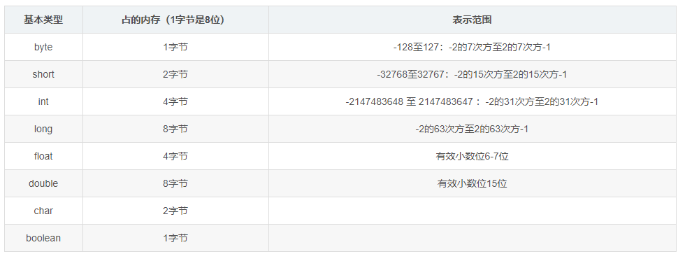

# 一、final、finally、finalize的区别

final：java中的关键字，修饰符。

A).如果一个类被声明为final，就意味着它不能再派生出新的子类，不能作为父类被继承。因此，一个类不能同时被声明为abstract抽象类的和final的类。
B).如果将变量或者方法声明为final，可以保证它们在使用中不被改变.
　　1)被声明为final的变量必须在声明时给定初值，而在以后的引用中只能读取，不可修改。 
　　2)被声明final的方法只能使用，不能重载。

finally：java的一种异常处理机制。

finally是对Java异常处理模型的最佳补充。finally结构使代码总会执行，而不管无异常发生。使用finally可以维护对象的内部状态，并可以清理非内存资源。特别是在关闭数据库连接这方面，如果程序员把数据库连接的close()方法放到finally中，就会大大降低程序出错的几率。

finalize：Java中的一个方法名。
Java技术使用finalize()方法在垃圾收集器将对象从内存中清除出去前，做必要的清理工作。这个方法是由垃圾收集器在确定这个对象没被引用时对这个对象调用的。它是在Object类中定义的，因此所的类都继承了它。子类覆盖finalize()方法以整理系统资源或者执行其他清理工作。**finalize()方法是在垃圾收集器删除对象之前对这个对象调用的。**

  **对象的销毁过程** 

在对象的销毁过程中，按照对象的finalize的执行情况，可以分为以下几种，系统会记录对象的对应状态：

-  unfinalized 没有执行finalize，系统也不准备执行。 
- finalizable 可以执行finalize了，系统会在随后的某个时间执行finalize。 
- finalized 该对象的finalize已经被执行了。 

GC怎么来保持对finalizable的对象的追踪呢。GC有一个Queue，叫做F-Queue，所有对象在变为finalizable的时候会加入到该Queue，然后等待GC执行它的finalize方法。 

这时我们引入了对对象的另外一种记录分类，系统可以检查到一个对象属于哪一种。 
reachable 从活动的对象引用链可以到达的对象。包括所有线程当前栈的局部变量，所有的静态变量等等。 
finalizer-reachable 除了reachable外，从F-Queue可以通过引用到达的对象。 
unreachable 其它的对象。 

1 首先，所有的对象都是从Reachable+Unfinalized走向死亡之路的。 

2 当从当前活动集到对象不可达时，对象可以从Reachable状态变到F-Reachable或者Unreachable状态。 

3 当对象为非Reachable+Unfinalized时，GC会把它移入F-Queue，状态变为F-Reachable+Finalizable。 

4 好了，关键的来了，任何时候，GC都可以从F-Queue中拿到一个Finalizable的对象，标记它为Finalized，然后执行它的finalize方法，由于该对象在这个线程中又可达了，于是该对象变成Reachable了（并且Finalized）。而finalize方法执行时，又有可能把其它的F-Reachable的对象变为一个Reachable的，这个叫做对象再生。 

5 当一个对象在Unreachable+Unfinalized时，如果该对象使用的是默认的Object的finalize，或者虽然重写了，但是新的实现什么也不干。为了性能，GC可以把该对象之间变到Reclaimed状态直接销毁，而不用加入到F-Queue等待GC做进一步处理。 

6 从状态图看出，不管怎么折腾，任意一个对象的finalize只至多执行一次，一旦对象变为Finalized，就怎么也不会在回到F-Queue去了。当然没有机会再执行finalize了。 

7 当对象处于Unreachable+Finalized时，该对象离真正的死亡不远了。GC可以安全的回收该对象的内存了。进入Reclaimed。 

# 二、Java中的String，StringBuilder，StringBuffer三者的区别

这三个类之间的区别主要是在两个方面，即运行速度和线程安全这两方面。

1. 首先说运行速度，或者说是执行速度，**在这方面运行速度快慢为：StringBuilder > StringBuffer > String**

　　**String最慢的原因：**

　　**String为字符串常量，而StringBuilder和StringBuffer均为字符串变量，即String对象一旦创建之后该对象是不可更改的，但后两者的对象是变量，是可以更改的。**以下面一段代码为例：

```java
1 String str="abc";
2 System.out.println(str);
3 str=str+"de";
4 System.out.println(str);
```

　　如果运行这段代码会发现先输出“abc”，然后又输出“abcde”，好像是str这个对象被更改了，其实，这只是一种假象罢了，JVM对于这几行代码是这样处理的，首先创建一个String对象str，并把“abc”赋值给str，然后在第三行中，其实JVM又创建了一个新的对象也名为str，然后再把原来的str的值和“de”加起来再赋值给新的str，而原来的str就会被JVM的垃圾回收机制（GC）给回收掉了，所以，str实际上并没有被更改，也就是前面说的String对象一旦创建之后就不可更改了。所以，**Java中对String对象进行的操作实际上是一个不断创建新的对象并且将旧的对象回收的一个过程，所以执行速度很慢。**

　　而StringBuilder和StringBuffer的对象是变量，对变量进行操作就是直接对该对象进行更改，而不进行创建和回收的操作，所以速度要比String快很多。

　　另外，有时候我们会这样对字符串进行赋值

```java
1 String str="abc"+"de";
2 StringBuilder stringBuilder=new StringBuilder().append("abc").append("de");
3 System.out.println(str);
4 System.out.println(stringBuilder.toString());
```

　　这样输出结果也是“abcde”和“abcde”，但是String的速度却比StringBuilder的反应速度要快很多，这是因为第1行中的操作和

　　String str="abcde";

　　是完全一样的，所以会很快，而如果写成下面这种形式

```
1 String str1="abc";
2 String str2="de";
3 String str=str1+str2;
```

　　那么JVM就会像上面说的那样，不断的创建、回收对象来进行这个操作了。速度就会很慢。

　　2. 再来说线程安全

　　**在线程安全上，StringBuilder是线程不安全的，而StringBuffer是线程安全的**

　　如果一个StringBuffer对象在字符串缓冲区被多个线程使用时，StringBuffer中很多方法可以带有synchronized关键字，所以可以保证线程是安全的，但StringBuilder的方法则没有该关键字，所以不能保证线程安全，有可能会出现一些错误的操作。所以如果要进行的操作是多线程的，那么就要使用StringBuffer，但是在单线程的情况下，还是建议使用速度比较快的StringBuilder。

　　3. 总结一下
　　**String：适用于少量的字符串操作的情况**

　　**StringBuilder：适用于单线程下在字符缓冲区进行大量操作的情况**

　　**StringBuffer：适用多线程下在字符缓冲区进行大量操作的情况**

# 三、Arrays.sort 实现原理和 Collections.sort 实现原理

```java
public static void sort(int[] a) {
    DualPivotQuicksort.sort(a, 0, a.length - 1, null, 0, 0);
}
```


# 四、Java中boolean占几个字节

JVM规范指出boolean当做int处理，也就是4字节，boolean数组当做byte数组处理，这样我们可以得出boolean类型占了单独使用是4个字节，在数组中是确定的1个字节。

# 五、Java基本类型所占的字节




# 六、Java的虚函数

**java类中普通成员函数就是虚函数。**

JAVA中的函数，除非声明为static或final，都可以看做是虚的，因为它们都是动态绑定的

会根据不同的类对象，调用其相应的函数，这个函数就是虚函数。

JAVA中的函数，除非声明为static或final，都可以看做是虚的，因为它们都是动态绑定的

会根据不同的类对象，调用其相应的函数，这个函数就是虚函数。

```java
package com.test2;

/**
 * @Author: 98050
 * @Time: 2019-03-12 20:24
 * @Feature:
 */
public interface Shape {
    void draw();
}


package com.test2;

/**
 * @Author: 98050
 * @Time: 2019-03-12 20:25
 * @Feature:
 */
public class Circle implements Shape {
    public void draw() {
        System.out.println("circle");
    }
}


package com.test2;

/**
 * @Author: 98050
 * @Time: 2019-03-12 20:25
 * @Feature:
 */
public class Square implements Shape {
    public void draw() {
        System.out.println("square");
    }
}


package com.test2;

/**
 * @Author: 98050
 * @Time: 2019-03-12 20:25
 * @Feature:
 */
public class Test {

    public static void main(String[] args) {
        Circle circle = new Circle();
        circle.draw();
        Square square = new Square();
        square.draw();

        Shape shape1 = circle;
        Shape shape2 = square;
        shape1.draw();
        shape2.draw();
    }
}
```

# 七、Object中的方法


# 八、Java中的对象拷贝

主要分为：浅拷贝(Shallow Copy)、深拷贝(Deep Copy)。

浅拷贝：复制引用

深拷贝：创建一个新的对象或数组，将原来的对象或数组的值拷贝过来

# 九、Java中的权限

​       1、私有权限（private）

　　private可以修饰数据成员，构造方法，方法成员，不能修饰类（此处指外部类，不考虑内部类）。被private修饰的成员，只能在定义它们的类中使用，在其他类中不能调用。

　　2、默认权限（default）

　　类，数据成员，构造方法，方法成员，都能够使用默认权限，**即不写任何关键字**。默认权限即同包权限，同包权限的元素只能在定义它们的类中，以及同包的类中被调用。

　　3、受保护权限（protected）

　　protected可以修饰数据成员，构造方法，方法成员，不能修饰类（此处指外部类，不考虑内部类）。被protected修饰的成员，能在定义它们的类中，同包的类中被调用。如果有不同包的类想调用它们，那么这个类必须是定义它们的类的子类。

　　4、公共权限（public）

　　public可以修饰类，数据成员，构造方法，方法成员。被public修饰的成员，可以在任何一个类中被调用，不管同包或不同包，是权限最大的一个修饰符。  

# 十、一个class文件中可以有几个类

可以有多个类，但是：

1.public 权限的类只能有一个（也可以一个都没有，但最多只有1个）
2.这个.java文件的文件名必须是public类的类名（一般的情况下，这里放置main方法是程序的入口。）
3.若这个文件中没有public的类，则文件名随便是一个类的名字即可
4.你用Javac 编译这个.java文件的时候，它会给每一个类生成一个.class文件

# 十一、Abstract类与接口类的区别，为什么有了接口类还要用抽象类

1.抽象类和接口类的对比：

|      **参数**      |                          **抽象类**                          |                           **接口**                           |
| :----------------: | :----------------------------------------------------------: | :----------------------------------------------------------: |
|   默认的方法实现   |                    它可以有默认的方法实现                    |           接口完全是抽象的。它根本不存在方法的实现           |
|        实现        | 子类使用**extends**关键字来继承抽象类。如果子类不是抽象类的话，它需要提供抽象类中所有声明的方法的实现。 | 子类使用关键字**implements**来实现接口。它需要提供接口中所有声明的方法的实现 |
|       构造器       |                      抽象类可以有构造器                      |                       接口不能有构造器                       |
| 与正常Java类的区别 |    除了你不能实例化抽象类之外，它和普通Java类没有任何区别    |                     接口是完全不同的类型                     |
|     访问修饰符     | 抽象方法可以有**public**、**protected**和**default**这些修饰符 |   接口方法默认修饰符是**public**。你不可以使用其它修饰符。   |
|      main方法      |           抽象方法可以有main方法并且我们可以运行它           |            接口没有main方法，因此我们不能运行它。            |
|       多继承       |             抽象方法可以继承一个类和实现多个接口             |               接口只可以继承一个或多个其它接口               |
|        速度        |                       它比接口速度要快                       |  接口是稍微有点慢的，因为它需要时间去寻找在类中实现的方法。  |
|     添加新方法     | 如果你往抽象类中添加新的方法，你可以给它提供默认的实现。因此你不需要改变你现在的代码。 |    如果你往接口中添加方法，那么你必须改变实现该接口的类。    |

2.什么时候使用抽象类和接口

- 如果你拥有一些方法并且想让它们中的一些有默认实现，那么使用抽象类吧。
- 如果你想实现多重继承，那么你必须使用接口。由于**Java不支持多继承**，子类不能够继承多个类，但可以实现多个接口。因此你就可以使用接口来解决它。
- 如果基本功能在不断改变，那么就需要使用抽象类。如果不断改变基本功能并且使用接口，那么就需要改变所有实现了该接口的类。

3.Java8的改进

接口中可以声明default方法。default方法是指，在接口内部包含了一些默认的方法实现（也就是接口中可以包含方法体，这打破了Java之前版本对接口的语法限制），从而使得接口在进行扩展的时候，不会破坏与接口相关的实现类代码。

如果一个类实现了两个接口（可以看做是“多继承”），这两个接口又同时都包含了一个名字相同的default方法，那么会发生什么情况？ 在这样的情况下，编译器会报错。让我用例子来解释一下：


# 十二、自然排序和定制排序

自然排序是通过实现了的Comparable来进行的

定制排序是实现Comparator

# 十四、equals和hashcode的区别以及联系

1.equals方法

自反性 ： x.equals(x) 结果应该返回true。

对称性 ： x.equals(y) 结果返回true当且仅当y.equals(x)也应该返回true。

传递性 ： x.equals(y) 返回true，并且y.equals(z) 返回true，那么x.equals(z) 也应该返回true。

一致性 ： x.equals(y)的第一次调用为true，那么x.equals(y)的第二次，第三次等多次调用也应该为true，但是前提条件是在进行比较之前，x和y都没有被修改。

x.equals(null) 应该返回false。

这个方法返回true当且仅当x和y指向了同样的对象(x==y)，这句话也就是说明了在默认情况下，**Object类中的equals方法默认比较的是对象的地址，因为只有是相同的地址才会相等(x == y)，如果没有重写equals方法，那么默认就是比较的是地址。**注意：**无论何时这个equals方法被重写那么都是有必要去重写hashCode方法，这个是因为为了维持hashCode的一种约定，相同的对象必须要有相同的hashCode值。**

2.hashcode

在同一次的java程序应用过程中，对应同样的对象多次调用hashCode方法，hashCode方法必须一致性的返回同样的一个地址值，前提是这个对象不能改变

两个对象相同是依据equals方法来的，那么其中的每一个对象调用hashCode方法都必须返回相同的一个integer值，也就是对象的地址。equals方法相等，那么hashCode方法也必须相等。

如果两个对象依据equals方法返回的结果不相等，那么对于其中的每一个对象调用hashCode方法返回的结果也不是一定必须得相等（也就是说，equals方法的结果为false，那么hashCode方法返回的结果可以相同也可以不相同），但是，对于我们开发者来说，针对两个对象的不相等如果生成相同的hashCode则可以提高应用程序的性能。

​         1.equal()相等的两个对象他们的hashCode()肯定相等，也就是用equal()对比是绝对可靠的。

​         2.hashCode()相等的两个对象他们的equal()不一定相等，也就是hashCode()不是绝对可靠的。

hashCode是jdk根据对象的地址或者字符串或者数字算出来的int类型的数值 

# 十五：自动装箱与拆箱

## 15.1 基本概念

装箱：将基本类型用他们对应的引用类型包装起来

拆箱：将包装类型转换为基本数据类型

如何实现?

拿Integer来举例说明：

```java
Integer integer = 10; //装箱

int i = integer; //拆箱
```

**装箱：主要调用的是Integer的valueOf(int)方法**

**拆箱：自动调用Integer的intValue方法**

装箱过程是通过调用包装器的valueOf方法实现的，而拆箱过程是通过调用包装器的 xxxValue方法实现的。（xxx代表对应的基本数据类型）。

1. int 和Integer在进行比较的时候，Integer会进行拆箱，转为int值与int进行比较。

2. **Integer与Integer比较的时候，由于直接赋值的时候会进行自动的装箱，那么这里就需要注意两个问题，一个是-128<= x<=127的整数，将会直接缓存在IntegerCache中，那么当赋值在这个区间的时候，不会创建新的Integer对象，而是从缓存中获取已经创建好的Integer对象。二：当大于这个范围的时候，直接new Integer来创建Integer对象。**

3. new Integer(1) 和Integer a = 1不同，前者会创建对象，存储在堆中，而后者因为在-128到127的范围内，不会创建新的对象，而是从IntegerCache中获取的。那么Integer a = 128, 大于该范围的话才会直接通过new Integer（128）创建对象，进行装箱。

## 15.2 实战

### 15.2.1 示例1

```java
package com.example.test;

/**
 * @Author: 98050
 * @Time: 2019-07-01 20:11
 * @Feature:
 */
public class Main {

    public static void main(String[] args) {
        Integer a = 100;
        Integer b = 100;
        Integer c = 200;
        Integer d = 200;

        System.out.println(a == b);
        System.out.println(c == d);
    }
}
```

返回结果为：

> true
> false

```java
public static Integer valueOf(int i) {
    if (i >= IntegerCache.low && i <= IntegerCache.high)
        return IntegerCache.cache[i + (-IntegerCache.low)];
    return new Integer(i);
}
```

```java
private static class IntegerCache {
    static final int low = -128;
    static final int high;
    static final Integer cache[];

    static {
        // high value may be configured by property
        int h = 127;
        String integerCacheHighPropValue =
            sun.misc.VM.getSavedProperty("java.lang.Integer.IntegerCache.high");
        if (integerCacheHighPropValue != null) {
            try {
                int i = parseInt(integerCacheHighPropValue);
                i = Math.max(i, 127);
                // Maximum array size is Integer.MAX_VALUE
                h = Math.min(i, Integer.MAX_VALUE - (-low) -1);
            } catch( NumberFormatException nfe) {
                // If the property cannot be parsed into an int, ignore it.
            }
        }
        high = h;

        cache = new Integer[(high - low) + 1];
        int j = low;
        for(int k = 0; k < cache.length; k++)
            cache[k] = new Integer(j++);

        // range [-128, 127] must be interned (JLS7 5.1.7)
        assert IntegerCache.high >= 127;
    }

    private IntegerCache() {}
}
```

### 15.2.2 示例2

```java
package com.example.test;

/**
 * @Author: 98050
 * @Time: 2019-07-01 20:11
 * @Feature:
 */
public class Main {

    public static void main(String[] args) {
        Double a = 100.0;
        Double b = 100.0;
        Double c = 200.0;
        Double d = 200.0;
        

        System.out.println(a == b);
        System.out.println(c == d);
    }
}
```

结果：

> false
> false

```java
public static Double valueOf(double d) {
    return new Double(d);
}
```

在这里只解释一下为什么Double类的valueOf方法会采用与Integer类的valueOf方法不同的实现。

很简单：**在某个范围内的整型数值的个数是有限的，而浮点数却不是**。

注意：

- Integer、Short、Byte、Character、Long这几个类的valueOf方法的实现是类似的。

```java
public static Short valueOf(short s) {
    final int offset = 128;
    int sAsInt = s;
    if (sAsInt >= -128 && sAsInt <= 127) { // must cache
        return ShortCache.cache[sAsInt + offset];
    }
    return new Short(s);
}
```

```java
public static Character valueOf(char c) {
    if (c <= 127) { // must cache
        return CharacterCache.cache[(int)c];
    }
    return new Character(c);
}
```

```java
public static Long valueOf(long l) {
    final int offset = 128;
    if (l >= -128 && l <= 127) { // will cache
        return LongCache.cache[(int)l + offset];
    }
    return new Long(l);
}
```

- Double、Float的valueOf方法的实现是类似的。

# 十六、equals和==

==：判断两个对象的地址是否相等，基本类型就是判断值是否相等

equals：类没有重写equals方法，等价于==；覆盖的话就是比较两个对象的内容

# 十七：Java闭包和回调

- **闭包**是指可以包含自由（未绑定到特定对象）变量的代码块；这些变量不是在这个代码块内或者任何全局上下文中定义的，而是在定义代码块的环境中定义（局部变量）。
- 是引用了自由变量的函数。这个函数通常被定义在另一个外部函数中，并且引用了外部函数中的变量。
- 是一个可调用的对象，它记录了一些信息，这些信息来自于创建它的作用域。

**闭包**能够将一个**方法**作为一个**变量**去存储，这个方法有能力去访问所在类的**自由变量**。

闭包的价值在于可以作为函数对象或者匿名函数，持有上下文数据，作为第一级对象进行传递和保存。闭包广泛用于回调函数、函数式编程中。

在Java中，闭包是 通过“接口与内部类实现的”

闭包（Closure）是一种能被调用的对象，它保存了创建它的作用域的信息。JAVA并不能显式地支持闭包，但是在JAVA中，闭包可以通过“接口+内部类”来实现，因为对于非静态内部类而言，它不仅记录了其外部类的详细信息，还保留了一个创建非静态内部类的引用，通过它可以访问外部类的私有成员，因此可以把非静态内部类当成面向对象领域的闭包。那么，通过这种仿闭包的非静态内部类可以很方便地实现回调，这是一种非常灵活的功能

```java
package com.example;

/**
 * @Author: 98050
 * @Time: 2019-03-13 20:47
 * @Feature: 测试闭包
 */
public class TestClosure {

    public static void main(String[] args) {
        Food food = new Food();
        food.getEat().eat();
        food.getNum();

        Food pub = new Food();
        Food.EatActive eatActive = pub.new EatActive();
        eatActive.eat();
        pub.getNum();
    }
}

class Food{
    public static final String name = "food";
    private static int num = 20;

    public Food(){
        System.out.println("my food");
    }

    public Active getEat(){
        return new EatActive();
    }

    public class EatActive implements Active{

        @Override
        public void eat() {
            if (num == 0){
                System.out.println("no");
            }
            num--;
            System.out.println("yes");
        }
    }

    public void getNum(){
        System.out.println(num);
    }
}


interface Active{
    void eat();
}
```

闭包(closure)是一个可调用的对象,它记录了一些信息,这些信息来自于创建它的作用域.

# 十八、hashCode

hashCode就是根据存储在一个对象实例中的所有数据，提取出一个**32**位的整数，该整数的目的是用来标示该实例的唯一性，有点类似于MD5码，每个文件都能通过MD5算法生成一个唯一的MD5码。

# 十九、Math.abs

Java的API文档中说，对abs(int a)运算，“如果参数等于 Integer.MIN_VALUE 的值(即能够表示的最小负 int 值)，那么结果与该值相同且为负。

# 二十、static关键字

static变量也称作静态变量，静态变量和非静态变量的区别是：静态变量被所有的对象所共享，在内存中只有一个副本，**它当且仅当在类初次加载时会被初始化**。**而非静态变量是对象所拥有的，在创建对象的时候被初始化，存在多个副本，各个对象拥有的副本互不影响**。

**static成员变量的初始化顺序按照定义的顺序进行初始化**。


# 二十一、Collection和Collections的区别

1、java.util.Collection 是一个**集合接口（集合类的一个顶级接口）**。它提供了对集合对象进行基本操作的通用接口方法。Collection接口在Java 类库中有很多具体的实现。Collection接口的意义是为各种具体的集合提供了最大化的统一操作方式，其直接继承接口有List与Set。

 Collection   
├List   
│├LinkedList   
│├ArrayList   
│└Vector   
│　└Stack   
└Set

2、Collections则是集合类的一个工具类/帮助类，其中提供了一系列静态方法，用于对集合中元素进行排序、搜索以及线程安全等各种操作。

# 二十二、Overload和Override的区别？

 Overload是重载的意思，Override是覆盖的意思，也就是重写。

​    重载Overload：在同一个类中，允许存在一个以上的同名函数，只要他们的参数个数或者参数类型不同即可。

​    重载的特点：与返回值类型无关，只看参数列表。

​    重写Override表示子类中的方法可以与父类中的某个方法的**名称和参数完全相同**，通过子类创建的实例对象调用这个方法时，将调用子类中定义的方法，这相当于把父类中定义的那个完全相同的方法给覆盖掉了，这也是面向对象编程的多态的一种表现。子类覆盖父类方法时只能抛出父类的异常或者异常的子类或者父类异常的子集，因为子类可以解决父类的一些问题，但不能比父类有更多的问题。还有，子类方法的访问权限只能比父类的更大，不能更小。如果父类的方法是private类型，则子类中根本不存在覆盖，即子类中和父类的private的同名的方法没有覆盖的关系，因为private的访问权限只限于同一类中，而子类就不会访问到private的方法，所以是子类中增加的一个全新的方法。

​    **重载overload的特点就是与返回值无关，只看参数列表，所以重载的方法是可以改变返回值类型的**。所以，如果两个方法的参数列表完全一样，是不能通过让他们的返回值类型不同来实现重载的。我们可以用反证法来说明这个问题，因为我们有时候调用一个方法时也可以不定义返回结果变量，即不要关心其返回结果，例如，我们调用map.remove(key)方法时，虽然remove方法有返回值，但是我们通常都不会定义接收返回结果的变量，这时候假设该类中有两个名称和参数列表完全相同的方法，仅仅是返回类型不同，java就无法确定编程者倒底是想调用哪个方法了，因为它无法通过返回结果类型来判断。

# 二十三、Java参数是值传递还是引用传递

**值传递**

**Java中其实还是值传递的，只不过对于对象参数，值的内容是对象的引用。**

# 二十四、final关键字对类、方法和成员变量的修饰

1. final修饰类 

被修饰的类不能被继承，也没有子类。假如随意创建这些类的子类，子类可能会错误的修改父类的实现细节、出于安全原因，类的实现细节不允许有任何改动、在创建对象模型的时候，确信这个类不会再被扩展。**注：如果对一个已经被final修饰的类进行继承操作，则会在编译的期间直接出现错误**

2. final修饰方法

final修饰的方法表示此方法已经是“最后的、最终的”含义，亦即此方法不能被重写，（但是可以载多个final修饰的方法）。

需要注意的一点是: 重写的前提是子类可以从父类中继承此方法，如果父类中final修饰的方法的访问权限是private，将会导致子类不能直接继承到此方法，这时候再在子类中定义相同的方法名和参数，不会产生重写与final之间出现的矛盾，而是在子类中定义了新的方法。

3. final修饰变量

final修饰的变量表示此变量是“最后的、最终的”,一旦定义了final变量，并在首次为其显示进行了初始化之后，final修饰的变量值不可被再修改。

final修饰的变量，无论是类属性、对象属性、形参还是局部变量，这些变量都是需要进行显示初始化（即为其显示指定初始值）。

**另外，无论对于基本数据类型还是引用数据类型，final修饰的变量都是首次初始化后值都不能修改。对于基本数据类型，很好理解。对于引用数据类型，引用变量指向的是实际的对象，但其存储的是所指向对象的地址，因此，其值不能修改并不意味着其所指向的对象不能修改。** 

# 二十五、整型转字符串

```java
Integer i = 1;
String string = String.valueOf(i);
String string2 = 1 + "";
String string3 = i.toString();
```

# 二十六、Java中的异常

Java有两种异常类型：受检查异常和运行时异常

检查异常：**这些异常从程序的角度来说是必须经过捕捉处理的，否则编译通不过，**比如IOException，SQLException。

运行时异常（不受检查异常）：Error和运行时异常

Error是程序无法处理的，如：OutOfMemmoryError，如果出现Error，Java虚拟机就会终止线程。

运行时异常：如RunTimeException，IndexOutOfBoundsException，NullPointerException，这些异常一般是由程序的逻辑错误引起的，解决此类异常应该仔细排查程序，不需要进行检查。

**两者的区别：**

非检查异常表示无法让程序恢复运行的异常，导致这种异常的原因通常是由于执行了错误的操作。一旦出现错误，建议让程序终止。

**受检查异常表示程序可以处理的异常。如果抛出异常的方法本身不处理或者不能处理它，那么方法的调用者就必须去处理该异常，否则调用会出错，连编译也无法通过。**

对于运行异常，建议不要用 try...catch...捕获处理，应该在程序开发调试的过程中尽量的避免，当然有一些必须要处理的，自己知道了那个部分会出现异常，而这种异常你要把它处理的你想要的结果，例如：空值处理。


1.Java中的所有不正常类都继承于Throwable类。Throwable主要包括两个大类，一个是Error类，另一个是Exception类；


2.其中Error类中包括虚拟机错误和线程死锁，一旦Error出现了，程序就彻底的挂了，被称为程序终结者；


3.Exception类，也就是通常所说的“异常”。主要指编码、环境、用户操作输入出现问题，Exception主要包括两大类，非检查异常（RuntimeException）和检查异常（其他的一些异常）


4.RuntimeException异常主要包括以下四种异常（其实还有很多其他异常，这里不一一列出）：空指针异常、数组下标越界异常、类型转换异常、算术异常。RuntimeException异常会由java虚拟机自动抛出并自动捕获**（就算我们没写异常捕获语句运行时也会抛出错误！！）**，此类异常的出现绝大数情况是代码本身有问题应该从逻辑上去解决并改进代码。


5.检查异常，引起该异常的原因多种多样，比如说文件不存在、或者是连接错误等等。跟它的“兄弟”RuntimeException运行异常不同，**该异常我们必须手动在代码里添加捕获语句来处理该异常**，这也是我们学习java异常语句中主要处理的异常对象。


# 二十七、Enum

### 27.1 什么是Enum

Enum是一个Java的关键字，用于表示一个固定的常用值。例如，每周的天数，每年的月数等。Enum是一种类型，就像Class和Interface可以用于定义一系列的Enum常量

### 27.2 Enum的特性

- Enum常量隐式的加上了static和final，一旦被创建就无法修改
- Enum提供了是类型安全的(type-safe)
- Enum隐式的加上了values()方法，返回一个数组包含所有的Enum常量
- 两个Enum常量可以使用 `==`或`equals()`方法比较
- Enum可以用在switch语句中，就像int，String。
- Enum有自己的名称空间
- Enum可以实现Java接口
- 可以在Enum中定义构造器

```java
package com.design.pattern.singleton;

/**
 * @Author: 98050
 * @Time: 2019-04-26 20:42
 * @Feature:
 */
public enum Singleton6 {

    INSTANCE;

    public void todo(){
        System.out.println("something");
    }
}
```

### 27.3 Enum面试问题

1. 说说Enum的继承
   所有的enums隐式的extend了java.lang.Enum类，因为一个类只能extend一个父亲，所以enum不能extend其它的类。但是Enum可以实现许多接口
2. Enum的values,ordinal,valueOf方法
   enums默认有values()，ordinal()和valueOf()方法。
   values()方法返回所有在enum中定义的常量值，以数组形式返回。
   ordinal()方法返回每个常量的索引下标，就像数组的下标
   valueOf()方法传入字符串参数，如果enum中存在对应字符串的常量值，则返回对应的enum常量

# 二十八、Java数组复制的方法

## 28.1 for循环

代码灵活，效率低

## 28.2 System.arraycopy()方法

通过源码可以看到，其为native方法，即原生态方法。自然效率更高

```java
* @param      src      the source array.
* @param      srcPos   starting position in the source array.
* @param      dest     the destination array.
* @param      destPos  starting position in the destination data.
* @param      length   the number of array elements to be copied.
```

```java
public static native void arraycopy(Object src,  int  srcPos,
                                    Object dest, int destPos,
                                    int length);
```

## 28.3 Arrays.copyOf()

实现还是基于System.arraycopy()，所以效率自然低于System.arraycpoy()。

```java
public static int[] copyOf(int[] original, int newLength) {
    int[] copy = new int[newLength];
    System.arraycopy(original, 0, copy, 0,
                     Math.min(original.length, newLength));
    return copy;
}
```

## 28.4 Object.clone()

从源码来看同样也是native方法，但返回为Object类型，所以赋值时将发生强转，所以效率不如之前两种。

```java
protected native Object clone() throws CloneNotSupportedException;
```

# 二十九、Java中的泛型

# 三十、Java中的迭代器

迭代器模式：就是提供一种方法对一个容器对象中的各个元素进行访问，而又不暴露该对象容器的内部细节。

Iterator遍历时不可以删除集合中的元素问题

# 三十一、Java中的内部类作用

**1.内部类可以很好的实现隐藏**

 **一般的非内部类，是不允许有 private 与protected权限的，但内部类可以**

**2.内部类拥有外围类的所有元素的访问权限**

**3.可是实现多重继承**

**4.可以避免修改接口而实现同一个类中两种同名方法的调用。**

如果，你的类要继承一个类，还要实现一个接口，可是你发觉你继承的类和接口里面有两个同名的方法怎么办？你怎么区分它们？？这就需要我们的内部类了。

# 三十二、如何解析JSON

# 三十三、不用中间变量交换两个数

a=a+b b=a-b a=a-b

a= a ^ b b = a ^ b a = a ^ b

# 三十四、Java中对象的大小

## 34.1 Java对象结构


1. Mark Word：存储对象运行时记录信息（**存储对象的HashCode、分代年龄和锁标记位**），占用内存大小与机器位数一样，即**32位机占4字节，64位机占8字节**
2. 元数据指针：指向描述类型的Klass对象（Java类的C++对等体）的指针，Klass对象包含了实例对象所属类型的元数据，因此该字段被称为元数据指针，JVM在运行时将频繁使用这个指针定位到位于方法区内的类型信息。占用内存大小与机器位数一样。
3. 数组长度：数组对象特有，4个字节
4. 实例数据：实例数据就是8大基本数据类型byte、short、int、long、float、double、char、boolean（对象类型也是由这8大基本数据类型复合而成），每种数据类型占多少字节就不一一例举了
5. 填充：不定，**HotSpot的对齐方式为8字节对齐，即一个对象必须为8字节的整数倍**，因此如果最后前面的数据大小为17则填充7，前面的数据大小为18则填充6，以此类推

为了保证效率，Java编译期在编译Java对象的时候，通过字段类型对Java对象的字段会进行排序，具体顺序如下表所示：


元数据指针的大小。元数据指针是一个引用类型，因此正常来说64位机元数据指针应当为8字节，32位机元数据指针应当为4字节，但是HotSpot中有一项优化是对元数据类型指针进行压缩存储，使用JVM参数：

- -XX:+UseCompressedOops开启压缩
- -XX:-UseCompressedOops关闭压缩

HotSpot默认是前者，即开启元数据指针压缩，当开启压缩的时候，64位机上的元数据指针将占据4个字节的大小。换句话说就是**当开启压缩的时候，64位机上的引用将占据4个字节，否则是正常的8字节**。

## 34.2 Java对象内存大小计算

首先是Object对象的大小：

1. 开启指针压缩时，8字节Mark Word + 4字节元数据指针 = 12字节，由于12字节不是8的倍数，因此填充4字节，对象Object占据16字节内存
2. 关闭指针压缩时，8字节Mark Word + 8字节元数据指针 = 16字节，由于16字节正好是8的倍数，因此不需要填充字节，对象Object占据16字节内存

接着是字符'a'的大小：

1. 开启指针压缩时，8字节Mark Word + 4字节元数据指针 + 1字节char = 13字节，由于13字节不是8的倍数，因此填充3字节，字符'a'占据16字节内存
2. 关闭指针压缩时，8字节Mark Word + 8字节元数据指针 + 1字节char = 17字节，由于17字节不是8的倍数，因此填充7字节，字符'a'占据24字节内存

接着是整型1的大小：

1. 开启指针压缩时，8字节Mark Word + 4字节元数据指针 + 4字节int = 16字节，由于16字节正好是8的倍数，因此不需要填充字节，整型1占据16字节内存
2. 关闭指针压缩时，8字节Mark Word + 8字节元数据指针 + 4字节int = 20字节，由于20字节正好是8的倍数，因此填充4字节，整型1占据24字节内存

接着是字符串"aaaaa"的大小，所有静态字段不需要管，只关注实例字段，String对象中实例字段有"char value[]"与"int hash"，由此可知：

1. 开启指针压缩时，8字节Mark Word + 4字节元数据指针 + 4字节引用 + 4字节int = 20字节，由于20字节不是8的倍数，因此填充4字节，字符串"aaaaa"占据24字节内存
2. 关闭指针压缩时，8字节Mark Word + 8字节元数据指针 + 8字节引用 + 4字节int = 28字节，由于28字节不是8的倍数，因此填充4字节，字符串"aaaaa"占据32字节内存

最后是长度为1的char型数组的大小：

1. 开启指针压缩时，8字节的Mark Word + 4字节的元数据指针 + 4字节的数组大小引用 + 1字节char = 17字节，由于17字节不是8的倍数，因此填充7字节，长度为1的char型数组占据24字节内存
2. 关闭指针压缩时，8字节的Mark Word + 8字节的元数据指针 + 8字节的数组大小引用 + 1字节char = 25字节，由于25字节不是8的倍数，因此填充7字节，长度为1的char型数组占据32字节内存

# 三十五、Class.forName()和ClassLoader.loadClass的区别

## 35.1 Java类的装载过程


1.装载：通过类的全限定名获取二进制字节流，将二进制字节流转换成方法区中的运行时数据结构，在内存中生成Java.lang.class对象； 

2.链接：执行下面的校验、准备和解析步骤，其中解析步骤是可以选择的； 

- 校验：检查导入类或接口的二进制数据的正确性；（文件格式验证，元数据验证，字节码验证，符号引用验证） 
- 准备：给类的静态变量分配并初始化存储空间； 
- 解析：将常量池中的符号引用转成直接引用； 

3.初始化：激活类的静态变量的初始化Java代码和静态Java代码块，并初始化程序员设置的变量值。

## 35.2 **Class.forName()和ClassLoader.loadClass**

Class.forName(className)方法，内部实际调用的方法是  Class.forName(className,true,classloader);

第2个boolean参数表示类是否需要初始化，  Class.forName(className)默认是需要初始化。

一旦初始化，就会触发目标对象的 static块代码执行，static参数也也会被再次初始化。

​    

ClassLoader.getSystemClassLoader().loadClass(className)方法，内部实际调用的方法是  ClassLoader.getSystemClassLoader().loadClass(className,false);

第2个 boolean参数，表示目标对象是否进行链接，false表示不进行链接，由上面介绍可以，

不进行链接意味着不进行包括初始化等一些列步骤，那么静态块和静态对象就不会得到执行

## 35.3 为什么数据库连接要使用Class.forName(className)

JDBC  Driver源码如下,因此使用Class.forName(classname)才能在反射回去类的时候执行static块。

```java
static {
    try {
        java.sql.DriverManager.registerDriver(new Driver());
    } catch (SQLException E) {
        throw new RuntimeException("Can't register driver!");
    }
}
```

# 三十六、序列化版本号serialVersionUID的作用

Java中序列化，实现Serializable接口

serialVersionUID的主要作用有以下两个：

1、能够成功反序列化

2、版本控制

- 在某些场合，希望类的不同版本对序列化兼容，因此需要确保类的不同版本具有相同的serialVersionUID；在某些场合，不希望类的不同版本对序列化兼容，因此需要确保类的不同版本具有不同的serialVersionUID。 
- 当你序列化了一个类实例后，希望更改一个字段或添加一个字段，不设置serialVersionUID，所做的任何更改都将导致无法反序化旧有实例，并在反序列化时抛出一个异常。如果你添加了serialVersionUID，在反序列旧有实例时，新添加或更改的字段值将设为初始化值（对象为null，基本类型为相应的初始默认值），字段被删除将不设置。 

# 三十七、MVC和MVVM

MVC，Model View Controller，是软件架构中最常见的一种框架，简单来说就是通过controller的控制去操作model层的数据，并且返回给view层展示。


