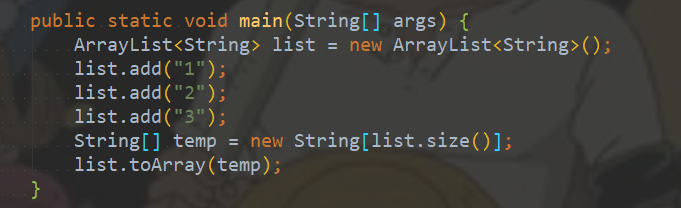

# 一、介绍

1. ArrayList 是一个**数组队列**，相当于 **动态数组**。与Java中的数组相比，它的容量能动态增长。它继承于AbstractList，实现了List, RandomAccess, Cloneable, java.io.Serializable这些接口。
2. ArrayList 继承了AbstractList，实现了List。它是一个数组队列，提供了相关的添加、删除、修改、遍历等功能。
   ArrayList 实现了RandmoAccess接口，即提供了随机访问功能。RandmoAccess是Java中用来被List实现，为List提供快速访问功能的。
3. 在ArrayList中，可以通过元素的序号快速获取元素对象；这就是快速随机访问。稍后，会比较List的“快速随机访问”和“通过Iterator迭代器访问”的效率。
4. ArrayList 实现了Cloneable接口，即覆盖了函数clone()，能被克隆。
5. ArrayList 实现java.io.Serializable接口，这意味着ArrayList支持序列化，能通过序列化去传输。
6. **ArrayList中的操作不是线程安全的**！所以，建议在单线程中才使用ArrayList，而在多线程中可以选择Vector或者CopyOnWriteArrayList。


## 1.1 ArrayList构造函数

```java
// 默认构造函数
ArrayList()

// capacity是ArrayList的默认容量大小。当由于增加数据导致容量不足时，容量会添加上一次容量大小的一半。
ArrayList(int capacity)

// 创建一个包含collection的ArrayList
ArrayList(Collection<? extends E> collection)
```

## 1.2 ArrayList API

```java
// Collection中定义的API
boolean             add(E object)
boolean             addAll(Collection<? extends E> collection)
void                clear()
boolean             contains(Object object)
boolean             containsAll(Collection<?> collection)
boolean             equals(Object object)
int                 hashCode()
boolean             isEmpty()
Iterator<E>         iterator()
boolean             remove(Object object)
boolean             removeAll(Collection<?> collection)
boolean             retainAll(Collection<?> collection)
int                 size()
<T> T[]             toArray(T[] array)
Object[]            toArray()
// AbstractCollection中定义的API
void                add(int location, E object)
boolean             addAll(int location, Collection<? extends E> collection)
E                   get(int location)
int                 indexOf(Object object)
int                 lastIndexOf(Object object)
ListIterator<E>     listIterator(int location)
ListIterator<E>     listIterator()
E                   remove(int location)
E                   set(int location, E object)
List<E>             subList(int start, int end)
// ArrayList新增的API
Object               clone()
void                 ensureCapacity(int minimumCapacity)
void                 trimToSize()
void                 removeRange(int fromIndex, int toIndex)
```

# 二、数据结构

## 2.1 ArrayList的继承关系


## 2.2 ArrayList与Collection的关系


ArrayList包含了两个重要的对象：elementData 和 size。

1. elementData 是"Object[]类型的数组"，它保存了添加到ArrayList中的元素。实际上，elementData是个动态数组，可以通过构造函数 ArrayList(int initialCapacity)来执行它的初始容量为initialCapacity；如果通过不含参数的构造函数ArrayList()来创建ArrayList，则elementData的容量默认是10。elementData数组的大小会根据ArrayList容量的增长而动态的增长，具体的增长方式，请参考源码分析中的ensureCapacity()函数。
2. size 则是动态数组的实际大小。

# 三、源码分析(JDK 1.8)

## 3.1 ArrayList使用的存储结构

从源码中我们可以发现，ArrayList使用的存储的数据结构是Object的对象数组。 


我想大家一定对这里出现的transient（禁止序列化）关键字很疑惑，我们都知道ArrayList对象是可序列化的，但这里为什么要用transient关键字修饰它呢？**查看源码，发现ArrayList实现了自己的readObject和writeObject方法，所以这保证了ArrayList的可序列化。**

##  3.2 ArrayList的初始化

ArrayList提供了三个构造函数，依次分析。

> public ArrayList(int initialCapacity)


这里的EMPTY_ELEMENTDATA 实际上就是一个共享的空的Object数组对象。 


> public ArrayList() 


其中DEFAULTCAPACITY_EMPTY_ELEMENTDATA 定义为 ：


**注释中解释的很清楚，就是说刚初始化的时候，会是一个共享的类变量，也就是一个Object空数组，当第一次add的时候，这个数组就会被初始化一个大小为10的数组。** 

> public ArrayList(Collection<? extends E> c)  

如果想要初始化一个list，这个list包含另外一个特定的collection的元素，那么我们就可以调用这个构造函数。 

源码：


首先调用给定的collection的toArray方法将其转换成一个Array。 然后根据这个array的大小进行判断，如果不为0，就调用Arrays的copyOf的方法，复制到Object数组中，完成初始化，如果为0，就直接初始化为空的Object数组。 

## 3.3 ArrayList动态增长

当向一个ArrayList中添加数组的时候，首先会先检查数组中是不是有足够的空间来存储这个新添加的元素。如果有的话，那就什么都不用做，直接添加。如果空间不够用了，那么就根据原始的容量增加原始容量的一半。 源码中是如此实现的： 


ensureCapacityInternal的实现如下： 


调用calculateCapacity方法：


DEFAULT_CAPACITY为： 


如果elementData是默认的共享数组（DEFAULTCAPACITY_EMPTY_ELEMENTDATA  ），那么就会返回DEFAULT_CAPACITY和minCapacity的最大值10。这也就实现了当我们不指定初始化大小的时候，添加第一个元素的时候，数组会扩容为10. 

紧接着看一下ensureExplicitCapacity方法：


这个方法判断是否需要扩容，如果需要就调用grow方法扩容 ：


初始化时，minCapacity的值为10，oladCapacity的值为0，那么newCapacity的值就为10。

如果List中已经放了10个元素了，再次调用add方法时就会扩容，**扩容的大小是原来的1.5倍**。

如果此时List的容量已经超过MAX_ARRAY_SIZE（最大可分配长度，超过的话可能导致内存不足）


就需要调用hugeCapacity方法：


## 3.4 add操作

```java
public boolean add(E e) {
    ensureCapacityInternal(size + 1);  // Increments modCount!!
    elementData[size++] = e;
    return true;
}
```

**时间复杂度O(1)**

```java
public void add(int index, E element) {
    rangeCheckForAdd(index);

    ensureCapacityInternal(size + 1);  // Increments modCount!!
    System.arraycopy(elementData, index, elementData, index + 1,
                     size - index);
    elementData[index] = element;
    size++;
}
```

**时间复杂度O(n)**

## 3.5 get操作

```java
public E get(int index) {
	rangeCheck(index);

	return elementData(index);
}
```

**时间复杂度O(1)**

## 3.5 remove操作

移除元素的时候，有两种方法，一是指定下标，二是指定对象 ：

```java
list.remove(3);//index
list.remove("aaa");//object
```

> public E remove(int index)


对于数组的元素删除算法我们应该很熟悉，删除一个数组元素，需要将这个元素后面的元素全部向前移动，并将size减1. 我们看到源码中，首先检查下标是否在可用范围内。然后调用System.arrayCopy方法将右边的数组向左移动，将最后一个元素置为null，size减一。 

> public boolean remove(Object o)


我们可以看到，**这个remove方法会移除数组中第一个符合的给定对象**，如果不存在就什么也不做，如果存在多个只移除第一个。 fastRemove方法如下 ：


相当于再次调用remove(index)

**时间复杂度O(n)**

# 四、遍历方式

## 4.1 通过迭代器

```java
Integer value = null;
Iterator iter = list.iterator();
while (iter.hasNext()) {
    value = (Integer)iter.next();
}
```

## 4.2 随机访问，通过索引值去遍历

```Java
Integer value = null;
int size = list.size();
for (int i=0; i<size; i++) {
    value = (Integer)list.get(i);        
}
```

## 4.3 for循环

```java
Integer value = null;
for (Integer integ:list) {
    value = integ;
}
```

## 4.4 三种方式速度比较

```java
package com.util.arraylist;

import java.util.ArrayList;
import java.util.Iterator;
import java.util.List;

/**
 * @Author: 98050
 * @Time: 2018-12-21 19:12
 * @Feature: 遍历方式
 */
public class Test2 {

    public static void main(String[] args) {
        List<Integer> list = new ArrayList<Integer>();
        for (int i = 0; i < 1000000; i++) {
            list.add(i);
        }
        RandomAccess(list);
        ThroughIterator(list);
        ThroughFor(list);
    }

    public static void RandomAccess(List list){
        long start,end;
        start = System.currentTimeMillis();
        for (int i = 0; i < list.size(); i++) {
            list.get(i);
        }
        end = System.currentTimeMillis();
        System.out.println("随机访问耗时：" + (end - start));
    }

    public static void ThroughIterator(List list){
        long start,end;
        start = System.currentTimeMillis();
        Iterator iterator = list.iterator();
        while (iterator.hasNext()){
            iterator.next();
        }

        end = System.currentTimeMillis();
        System.out.println("使用迭代器耗时：" + (end - start));
    }

    public static void ThroughFor(List list){
        long start,end;
        start = System.currentTimeMillis();
        for (Object o : list){
            ;
        }
        end = System.currentTimeMillis();
        System.out.println("使用For耗时：" + (end - start));
    }
}
```


总体来说使用随机访问还是比较快一点。

# 五、toArray异常

源码：


调用 toArray() 函数会抛出“java.lang.ClassCastException”异常，但是调用 toArray(T[] contents) 能正常返回 T[]。

toArray() 会抛出异常是因为 toArray() 返回的是 Object[] 数组，将 Object[] 转换为其它类型(如如，将Object[]转换为的Integer[])则会抛出“java.lang.ClassCastException”异常，因为**Java不支持向下转型**。
解决该问题的办法是调用 <T> T[] toArray(T[] contents) ， 而不是 Object[] toArray()。

示例：


结果：


修改后就不报错了



# 六、查看ArrayList的容量

```java
package com.util.arraylist;

import java.lang.reflect.Field;
import java.util.ArrayList;
import java.util.List;

/**
 * @Author: 98050
 * @Time: 2018-12-21 14:31
 * @Feature: 查看容量
 */
public class Test {

    public static void main(String[] args) throws NoSuchFieldException, IllegalAccessException {
        List<String> list = new ArrayList<String>();
        for (int i = 0; i < 11; i++) {
            list.add(i+"");
        }
        Class<List> calss = (Class<List>) list.getClass();
        Field field = calss.getDeclaredField("elementData");
        field.setAccessible(true);
        Object[] objects = (Object[]) field.get(list);
        System.out.println(objects.length);
    }

}
```

# 七、ArrayList为什么不是线程安全的

主要是针对add的时候：


由此看到add元素时，实际做了两个大的步骤：

1. 判断elementData数组容量是否满足需求
2. 在elementData对应位置上设置值

这样也就出现了第一个导致线程不安全的隐患，在多个线程进行add操作时可能会导致elementData数组越界。具体逻辑如下：

1. 列表大小为9，即size=9

2. 线程A开始进入add方法，这时它获取到size的值为9，调用ensureCapacityInternal方法进行容量判断。
3. 线程B此时也进入add方法，它获取到size的值也为9，也开始调用ensureCapacityInternal方法。
4. 线程A发现需求大小为10，而elementData的大小就为10，可以容纳。于是它不再扩容，返回。
5. 线程B也发现需求大小为10，也可以容纳，返回。
6. 线程A开始进行设置值操作， elementData[size++] = e 操作。此时size变为10。
7. 线程B也开始进行设置值操作，它尝试设置elementData[10] = e，而elementData没有进行过扩容，它的下标最大为9。于是此时会报出一个数组越界的异常ArrayIndexOutOfBoundsException.

另外第二步 elementData[size++] = e 设置值的操作同样会导致线程不安全。从这儿可以看出，这步操作也不是一个原子操作，它由如下两步操作构成：

1. elementData[size] = e;

2. size = size + 1;

在单线程执行这两条代码时没有任何问题，但是当多线程环境下执行时，可能就会发生一个线程的值覆盖另一个线程添加的值，具体逻辑如下：

1. 列表大小为0，即size=0
2. 线程A开始添加一个元素，值为A。此时它执行第一条操作，将A放在了elementData下标为0的位置上。
3. 接着线程B刚好也要开始添加一个值为B的元素，且走到了第一步操作。此时线程B获取到size的值依然为0，于是它将B也放在了elementData下标为0的位置上。
4. 线程A开始将size的值增加为1
5. 线程B开始将size的值增加为2

这样线程AB执行完毕后，理想中情况为size为2，elementData下标0的位置为A，下标1的位置为B。而实际情况变成了size为2，elementData下标为0的位置变成了B，下标1的位置上什么都没有。并且后续除非使用set方法修改此位置的值，否则将一直为null，因为size为2，添加元素时会从下标为2的位置上开始。

**验证：**

```java
package com.util.arraylist;

import java.lang.reflect.Field;
import java.util.ArrayList;
import java.util.List;

/**
 * @Author: 98050
 * @Time: 2018-12-21 20:48
 * @Feature: ArrayList非线程安全
 */
public class Test4 {

    public static void main(String[] args) throws InterruptedException, NoSuchFieldException, IllegalAccessException {

         final List<String> list = new ArrayList<String>();

        /**
         * 线程1将0——9填充到list中
         */
        new Thread(new Runnable() {
            @Override
            public void run() {
                for (int i = 0; i < 10; i++) {
                    try {
                        Thread.sleep(10);
                    } catch (InterruptedException e) {
                        e.printStackTrace();
                    }
                    list.add(Thread.currentThread().getName() + "添加:" + i);
                }
            }
        }).start();


        /**
         * 线程2将10——19填充到list中
         */
        new Thread(new Runnable() {
            @Override
            public void run() {
                for (int i = 10; i < 20; i++) {
                    try {
                        Thread.sleep(10);
                    } catch (InterruptedException e) {
                        e.printStackTrace();
                    }
                    list.add(Thread.currentThread().getName() + "添加:" + i);
                }
            }
        }).start();

        Thread.sleep(1000);

        Class<List> calss = (Class<List>) list.getClass();
        Field field = calss.getDeclaredField("elementData");
        field.setAccessible(true);
        Object[] objects = (Object[]) field.get(list);
        System.out.println("list的容量：" + objects.length);
        for (int i = 0; i < objects.length; i++) {
            System.out.println(objects[i]);
        }
    }
}
```

这里面为了直观的说明问题，不直接输出list中的内容，而是进入ArrayList的内部，将elementData输出，使用反射访问：

运行结果1：


运行结果2（越界）：


**参考**：http://www.cnblogs.com/skywang12345/p/3308556.html

# 八、什么时候使用ArrayList

当遇到访问元素比插入或者删除元素更加频繁的时候，应该使用ArrayList。

插入和删除比较频繁，使用LinkedList

# 九、ArrayList的拷贝

使用clone方法 浅拷贝

使用ArrayList的构造方法  浅拷贝

Collection的copy方法 深拷贝

