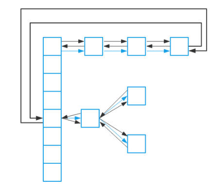
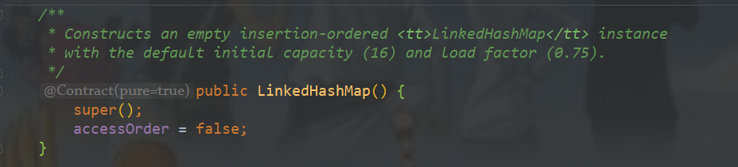

# 一、介绍

 LinkedHashMap是Map接口的哈希表和链接列表实现，具有可预知的迭代顺序。此实现提供所有可选的映射操作，并允许使用null值和null键。此类不保证映射的顺序，特别是它不保证该顺序恒久不变。
   LinkedHashMap实现与HashMap的不同之处在于，后者维护着一个运行于所有条目的双重链接列表。此链接列表定义了迭代顺序，该迭代顺序可以是插入顺序或者是访问顺序。
   注意，此实现不是同步的。如果多个线程同时访问链接的哈希映射，而其中至少一个线程从结构上修改了该映射，则它必须保持外部同步。

# 二、数据结构

## 2.1 LinkedHashMap的数据结构



可以从上图中看到，LinkedHashMap数据结构相比较于HashMap来说，添加了双向指针，分别指向前一个节点——**before**和后一个节点——**after**，从而将所有的节点已链表的形式串联一起来，从名字上来看LinkedHashMap与HashMap有一定的联系，实际上也确实是这样，LinkedHashMap继承了HashMap，重写了HashMap的一部分方法，从而加入了链表的实现。让我们来看一下它们的继承关系。

## 2.2 继承关系


Entry作为基本的节点，可以看到LinkedHashMap的Entry继承自HashMap的Node，在其基础上加上了before和after两个指针，而TreeNode作为HashMap和LinkedHashMap的树节点，继承自LinkedHahsMap的Entry，并且加上了树节点的相关指针，另外提一点：before和parent的两个概念是不一样的，before是相对于链表来的，parent是相对于树操作来的，所以要分两个。


# 三、源码解析

## 3.1 成员变量


## 3.2 构造方法



跟HashMap类似的构造方法，里面唯一的区别就是添加了前面提到的accessOrder，默认赋值为false——按照插入顺序来排列。

## 3.3 链表的建立过程

链表的建立过程是在插入键值对节点时开始的，初始情况下，让 LinkedHashMap 的 head 和 tail 引用同时指向新节点，链表就算建立起来了。**随后不断有新节点插入，通过将新节点接在 tail 引用指向节点的后面，即可实现链表的更新。**

Map 类型的集合类是通过 put(K,V) 方法插入键值对，LinkedHashMap 本身并没有覆写父类的 put 方法，而是直接使用了父类的实现。但在 HashMap 中，put 方法插入的是 HashMap 内部类 Node 类型的节点，该类型的节点并不具备与 LinkedHashMap 内部类 Entry 及其子类型节点组成链表的能力。那么，LinkedHashMap 是怎样建立链表的呢？在展开说明之前，我们先看一下 LinkedHashMap 插入操作相关的代码：

先关注HashMap的putVal方法


新建节点使用newNode方法，在HashMap中的实现如下：

```java
// Create a regular (non-tree) node
Node<K,V> newNode(int hash, K key, V value, Node<K,V> next) {
    return new Node<>(hash, key, value, next);
}
```

在LinkedHashMap中进行了重写：

```java
Node<K,V> newNode(int hash, K key, V value, Node<K,V> e) {
    LinkedHashMap.Entry<K,V> p =
        new LinkedHashMap.Entry<K,V>(hash, key, value, e);
    //将Entry接在双向链表的尾部
    linkNodeLast(p);
    return p;
}
```

```java
private void linkNodeLast(LinkedHashMap.Entry<K,V> p) {
    LinkedHashMap.Entry<K,V> last = tail;
    tail = p;
    if (last == null)
        head = p;
    else {
        p.before = last;
        last.after = p;
    }
}
```

将节点插入到双向链表的尾部！

在HashMap中有三个回调方法：


**这三个方法的用途是在增删查等操作后，通过回调的方式，让 LinkedHashMap 有机会做一些后置操作。**


## 3.4 链表节点删除的过程

与插入操作一样，LinkedHashMap 删除操作相关的代码也是直接用父类的实现。在删除节点时，父类的删除逻辑并不会修复 LinkedHashMap 所维护的双向链表，这不是它的职责。那么删除及节点后，被删除的节点该如何从双链表中移除呢？先看HashMap中删除节点的方法，`removeNode`：


在删除及节点后，回调方法 `afterNodeRemoval` 会被调用。LinkedHashMap 覆写该方法，并在该方法中完成了移除被删除节点的操作。

```java
void afterNodeRemoval(Node<K,V> e) { // unlink
    LinkedHashMap.Entry<K,V> p =
        (LinkedHashMap.Entry<K,V>)e, b = p.before, a = p.after;
    p.before = p.after = null;
    if (b == null)
        head = a;
    else
        b.after = a;
    if (a == null)
        tail = b;
    else
        a.before = b;
}
```

## 3.5 访问顺序的维护过程

默认情况下，LinkedHashMap 是按插入顺序维护链表。不过可以在初始化 LinkedHashMap，指定 accessOrder 参数为 true，即可让它按访问顺序维护链表。访问顺序的原理上并不复杂，当调用`get/getOrDefault/replace`等方法时，**只需要将这些方法访问的节点移动到链表的尾部即可**。

LinkedHashMap中的get方法：/

```java
public V get(Object key) {
    Node<K,V> e;
    if ((e = getNode(hash(key), key)) == null)
        return null;
    if (accessOrder)
        afterNodeAccess(e);
    return e.value;
}
```

其中先调用HashMap中的getNode方法获取value，然后执行回调方法：

```java
void afterNodeAccess(Node<K,V> e) { // move node to last
    LinkedHashMap.Entry<K,V> last;
    if (accessOrder && (last = tail) != e) {
        LinkedHashMap.Entry<K,V> p =
            (LinkedHashMap.Entry<K,V>)e, b = p.before, a = p.after;
        p.after = null;
        if (b == null)
            head = a;
        else
            b.after = a;
        if (a != null)
            a.before = b;
        else
            last = b;
        if (last == null)
            head = p;
        else {
            p.before = last;
            last.after = p;
        }
        tail = p;
        ++modCount;
    }
}
```

实现的操作就是将当前节点插入到链表的末尾，通过判断`accessOrder` 的值来判断是否执行此操作！！

## 3.6 基于LinkedHashMap实现缓存

HashMap中提供了三个回调函数，还有一个没有介绍：`afterNodeInsertion`


在HashMap中的putVal方法里面调用

```java
void afterNodeInsertion(boolean evict) { // possibly remove eldest
    LinkedHashMap.Entry<K,V> first;
    //根据条件判断是否移除最近最少被访问的节点
    if (evict && (first = head) != null && removeEldestEntry(first)) {
        K key = first.key;
        removeNode(hash(key), key, null, false, true);
    }
}
```

```java
// 移除最近最少被访问条件之一，通过覆盖此方法可实现不同策略的缓存
protected boolean removeEldestEntry(Map.Entry<K,V> eldest) {
    return false;
}
```

**面的源码的核心逻辑在一般情况下都不会被执行。**

**LinkedHashMap 实现缓存时，通过覆写`removeEldestEntry`方法可以实现自定义策略的 LRU 缓存。比如可以根据节点数量判断是否移除最近最少被访问的节点，或者根据节点的存活时间判断是否移除该节点等。**

# 四、实现LRU

## 4.1 基于LinkedHashMap实现LRU

页面访问序列：4，7，0，7，1，0，1，2，1，2，6

进程分配的物理块大小为：5

```java
package com.test;

import java.util.LinkedHashMap;
import java.util.Map;

/**
 * @Author: 98050
 * @Time: 2019-05-22 20:22
 * @Feature:
 */
public class SimpleCache<K,V> extends LinkedHashMap<K,V> {

    private static final int MAX_NODE_NUM = 20;

    private int limit;

    public SimpleCache(){
        super(MAX_NODE_NUM);
    }

    public SimpleCache(int limit){
        super(limit, (float) 0.75,true);
        this.limit = limit;
    }

    public V save(K key,V value){
        return put(key, value);
    }

    public V getOne(K key){
        return get(key);
    }

    public boolean exists(K key){
        return containsKey(key);
    }

    @Override
    protected boolean removeEldestEntry(Map.Entry<K, V> eldest) {
        return size() > limit;
    }
}
```

测试：

```java
package com.test;

import java.util.*;

/**
 * @Author: 98050
 * @Time: 2019-05-22 17:37
 * @Feature:
 */
public class Test2 {

    public static void main(String[] args) {
        SimpleCache<Integer,Integer> cache = new SimpleCache<Integer, Integer>(5);
        List<Integer> list = Arrays.asList(4,7,0,7,1,0,1,2,1,2,6);
        for (int i : list){
            if (cache.exists(i)){
                cache.getOne(i);
            }else {
                cache.save(i, i * i);
            }
            System.out.println("-------------------------------");
            for (int j : cache.keySet()){
                System.out.printf("%5d",j);
            }
            System.out.println();
        }
    }
}
```

运行结果：


对比：


## 4.2 基于双向链表实现LRU

1、节点数据结构

```java
package com.example.lru;

/**
 * @Author: 98050
 * @Time: 2019-07-19 19:31
 * @Feature:
 */
public class LinkedNode {

    String key;
    Object value;
    LinkedNode pre;
    LinkedNode next;
}
```

2、实现

思路：

1、构建一个双向链表，为了提供查询速度，使用一个HashMap来保存每个节点

2、构造函数中初始化头尾节点，计数器，缓存容量

4、提供removeNode方法，删除链表中的任一节点

3、提供moveHead方法，将链表中的任一节点移动到链表头部

4、提供get方法，从map中查询到节点，然后把该节点移动到头部

4、提供set方法，如果key值在map中不存在，那么就构造节点，然后将该节点放入到map中并且往链接头部插入一个新节点；如果key值在map中存在，那么就把对应节点移动到链接头部

```java
package com.example.lru;

import java.util.*;

/**
 * @Author: 98050
 * @Time: 2019-07-19 19:32
 * @Feature:
 */
public class LRUCache {

    private HashMap<String,LinkedNode> map = new HashMap<String, LinkedNode>();

    private int count;
    private int capacity;
    private LinkedNode head,tail;

    public LRUCache(int capacity) {
        this.capacity = capacity;
        this.count = 0;
        head = new LinkedNode();
        head.pre = null;
        tail = new LinkedNode();
        tail.next = null;
        head.next = tail;
        tail.pre = head;
    }

    public Object get(String key){
        LinkedNode node = map.get(key);
        if (node == null){
            return -1;
        }
        this.moveHead(node);
        return node.value;
    }

    public void set(String key, Object o){
        LinkedNode node = map.get(key);
        if (node == null){
            LinkedNode insertNode = new LinkedNode();
            insertNode.value = o;
            insertNode.key = key;
            this.map.put(key, insertNode);
            this.addNode(insertNode);
            this.count++;
            if (count > capacity){
                LinkedNode tail = this.popTail();
                this.map.remove(tail.key);
                this.count--;
            }
        }else {
            node.value = o;
            this.moveHead(node);
        }
    }

    private LinkedNode popTail() {
        LinkedNode node = tail.pre;
        this.removeNode(node);
        return node;
    }

    private void removeNode(LinkedNode node) {
        LinkedNode pre = node.pre;
        LinkedNode next = node.next;
        pre.next = next;
        next.pre = pre;
    }

    private void addNode(LinkedNode node) {
        node.pre = head;
        node.next = head.next;
        head.next.pre = node;
        head.next = node;
    }

    private void moveHead(LinkedNode node) {
        this.removeNode(node);
        this.addNode(node);
    }

    public List<String> keySet(){
        List<String> result = new ArrayList<String>();
        if (this.count != 0) {
            LinkedNode p = this.head.next;
            while (p != tail) {
                result.add(p.key);
                p = p.next;
            }
        }
        return result;
    }


    public boolean exists(String key){
        return this.map.containsKey(key);
    }
}
```

3、测试

```java
package com.example.lru;

import java.util.Arrays;
import java.util.List;

/**
 * @Author: 98050
 * @Time: 2019-07-19 20:20
 * @Feature:
 */
public class Test {

    public static void main(String[] args) {
        LRUCache cache = new LRUCache(5);
        List<Integer> list = Arrays.asList(4,7,0,7,1,0,1,2,1,2,6);
        for (int i : list){
            if (cache.exists(i + "")){
                cache.get(i + "");
            }else {
                cache.set(i + "", i * i);
            }
            System.out.println("-------------------------------");
            for (String j : cache.keySet()){
                System.out.printf("%5s",j);
            }
            System.out.println();
        }
    }
}
```

4、结果

