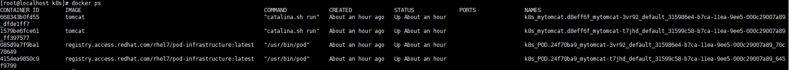

# 一、Kubernetes快速入门

使用Kubernetes创建Tomcat容器的步骤：

1 、定义服务的RC文件（RepliactionController）

2、将定义好的RC文件发布到k8s集群中

3、创建一个当前服务于kubernetes service关联的SVC文件

4、将定义好的SVC文件发布到k8s集群中 

## 1.1 环境准备

1、关闭CentOS防火墙

```bash
systemctl disable firewalld
systemctl stop firewalld
```

2、更新yum

```bash
yum update
```

3、安装etcd和kubernets

etcd是一个高可用的分布式键值(key-value)数据库，etcd内部采用raft协议作为一致性算法，etcd基于Go语言实现。 

```bash
yum install -y etcd kubernets
```

4、启动服务

```bash
systemctl start etcd 
systemctl start docker
systemctl start kube-apiserver
systemctl start kube-controller-manager
systemctl start kube-scheduler
systemctl start kubelet
systemctl start kube-proxy
```

如果docker启动失败，请参考(vi /etc/sysconfig/selinux 把selinux后面的改为disabled，重启 

一波机器，再重启docker就可以了) 

## 1.2 创建发布RC

1、创建Tomcat对应的RC文件，命名为mytomcat-rc.yaml

```yaml
apiVersion: v1 
kind: ReplicationController 
metadata: 
  name: mytomcat 
spec: 
  replicas: 2 
  selector: 
    app: mytomcat 
  template: 
    metadata: 
      labels: 
        app: mytomcat 
    spec: 
      containers: 
        - name: mytomcat 
          image: tomcat:7-jre7
          ports: 
          - containerPort: 8080
```

2、将创建好的RC文件发布到k8s集群中

```bash
kubectl create -f mytomcat-rc.yaml 
```

然后通过以下命令查看RC的状态信息

```bash
kubectl get rc
```

结果如下，表示创建成功

```
NAME      DESIRED   CURRENT   READY     AGE
mytomcat    1         1         1         1d
```

结果如下，表示创建失败

```
NAME      DESIRED   CURRENT   READY     AGE
mytomcat    1         0         0         1d
```

创建失败的话，解决方案如下：

- 编辑 /etc/kubernetes/apiserver 配置文件中 KUBE_ADMISSION_CONTROL 配置项，删除 SecurityContextDeny,ServiceAccount 这两个配置参数，然后保存配置文件

- 重启kube-apiserver

```bash
systemctl restart kube-apiserver
```

- 删除已创建RC

```bash
kubectl delete -f mytomcat-rc.yaml
```

- 重新创建RC

```bash
kubectl create -f mytomcat-rc.yaml
```

如果输出结果如下所示，而且一直都保持这样状态的话，则说明RC创建完成，但是创建Pod的过程异常

```
NAME      DESIRED   CURRENT   READY     AGE
mytomcat    1         1         0/1       1d
```

出现该情况的话通过下面的命令来查看Pod的启动情况

```bash
kubectl get pods
```

如果输出的结果如下所示，则进一步表明是Pod创建过程异常造成的 

```
NAME             READY     STATUS              RESTARTS   AGE
mytomcat-3vr92   0/1       ContainerCreating   0          24m
mytomcat-t7jhd   0/1       ContainerCreating   0          24m
```

出现该问题的处理方法如下所示： 

1、通过如下命令查看Pod启动的详细情况和异常情况

```bash
kubectl describe pod mytomcat-3vr92
```

如果异常提示是由于缺失 /etc/docker/certs.d/registry.access.redhat.com/redhat-ca.crt 文件造成的 registry.access.redhat.com/rhel7/pod-infrastructure:latest 镜像无法拉取到的话，只需要如下的处理

2、通过yum命令安装缺失文件依赖的服务python-rhsm-certificates，安装命令如下：

```bash
yum install -y *rhsm*
```

3、通过docker命令手动拉取registry.access.redhat.com/rhel7/pod-infrastructure:latest 镜像，命令如下

```bash
docker pull registry.access.redhat.com/rhel7/pod-infrastructure:latest
```

当镜像下载完成，Pod会自动进入Running状态

```bash
http://mirror.centos.org/centos/7/os/x86_64/Packages/python-rhsm-certificates-1.19.10-1.el7_4.x86_64.rpm
rpm2cpio python-rhsm-certificates-1.19.10-1.el7_4.x86_64.rpm | cpio -iv --to-stdout ./etc/rhsm/ca/redhat-uep.pem | tee /etc/rhsm/ca/redhat-uep.pem
docker pull registry.access.redhat.com/rhel7/pod-infrastructure:latest
```

解决 kubectl get pods时No resources found问题 

1、vim /etc/kubernetes/apiserver 

2、找到”KUBE_ADMISSION_CONTROL="- 

admission_control=NamespaceLifecycle,NamespaceExists,LimitRanger,SecurityContextDeny,Servi 

ceAccount,ResourceQuota"，去掉ServiceAccount，保存退出。

3、systemctl restart kube-apiserver 

重启此服务

## 1.3 创建发布SVC

1、创建对应的Service服务，命名为mytomcat-svc.yaml 

```yaml
apiVersion: v1 
kind: Service 
metadata: 
  name: mytomcat 
spec: 
  type: NodePort
  ports:
    - port: 8080
      nodePort: 30002
  selector:
    app: mytomcat
```

2、将定义好的SVC文件发布到k8s集群中，命令如下：

```bash
kubectl create -f mytomcat-svc.yaml
```

3、查看SVC文件启动情况命令如下：

```bash
kubectl describe svc mytomcat
```

输出结果如下：

```bash
Name:				mytomcat
Namespace:			default
Labels:				<none>
Selector:			app=mytomcat
Type:				NodePort
IP:					10.254.72.123
Port:				<unset>	8080/TCP
NodePort:			<unset>	30002/TCP
Endpoints:			172.17.0.2:8080,172.17.0.3:8080
Session Affinity:	None
No events.
```

## 1.4 查看容器运行情况



## 1.5 访问测试

访问地址： http://192.168.19.121:30002/ 

结果如下则表示服务创建成功


如果出现下面的结果，则表示tomcat出现问题：


1、进入创建的Tomcat容器当中

```bash
docker exec -it 668343b0fd55(容器id) /bin/bash
```

2、查看当前目录文件，并且进入webapps文件夹中

```bash
ls -l
```

显示total 0，问题就出在这里，webapps文件夹下没有东西

3、将 webapps.dist文件夹下的内容复制到给webapps文件夹 

```bash
mv webapps.dist webapps
```

4、重新访问tomcat，成功

# 二、Kubernetes基本架构

Kubernetes集群包含有节点代理kubelet和Master组件(APIs，scheduler，etc)，一切都基于分布式存储系统，下面给出了Kubernetes的架构图。


在这张系统架构图中，我们把服务分为**运行在工作节点上的服务**和**组成集群级别控制板的服务**。 

Kubernetes节点有运行应用容器必备的服务，而这些都是受Master的控制。 

每次个节点上都要运行Docker，Docker来负责所有具体的映像下载和容器运行。 

Kubernetes主要由以下几个核心组件组成： 

- etcd保存了整个集群的状态； 
- apiserver提供了资源操作的唯一入口，并提供认证、授权、访问控制、API注册和发现等机制； 
- controller manager负责维护集群的状态，比如故障检测、自动扩展、滚动更新等； 
- scheduler负责资源的调度，按照预定的调度策略将Pod调度到相应的机器上； 
- kubelet负责维护容器的生命周期，同时也负责Volume（CVI）和网络（CNI）的管理； 
- Container runtime负责镜像管理以及Pod和容器的真正运行（CRI）； 
- kube-proxy负责为Service提供cluster内部的服务发现和负载均衡； 

除了核心组件，还有一些推荐的Add-ons： 

- kube-dns负责为整个集群提供DNS服务 
- Ingress Controller为服务提供外网入口 
- Heapster提供资源监控 
- Dashboard提供GUI 
- Federation提供跨可用区的集群 
- Fluentd-elasticsearch提供集群日志采集、存储与查询

Kubernetes设计理念和功能其实就是一个类似Linux的分层架构

- 核心层：Kubernetes最核心的功能，对外提供API构建高层的应用，对内提供插件式应用执行环境 
- 应用层：部署（无状态应用、有状态应用、批处理任务、集群应用等）和路由（服务发现、DNS解析等） 
- 管理层：系统度量（如基础设施、容器和网络的度量），自动化（如自动扩展、动态Provision等）以及策略管理（RBAC、Quota、PSP、NetworkPolicy等） 
- 接口层：kubectl命令行工具、客户端SDK以及集群联邦 
- 生态系统：在接口层之上的庞大容器集群管理调度的生态系统，可以划分为两个范畴 

  - Kubernetes外部：日志、监控、配置管理、CI、CD、Workflflow、FaaS、OTS应用、ChatOps等 

  - Kubernetes内部：CRI、CNI、CVI、镜像仓库、Cloud Provider、集群自身的配置和管理等 

## 2.1 Cluster

Cluster是计算、存储和网络资源的集合，Kubernetes利用这些资源运行各种基于容器的应用. 

Kubernetes Cluster由Master和Node组成，节点上运行着若干Kubernetes服务 

## 2.2 Master

Master主要职责是调度，即决定将应用放在哪运行。Master运行Linux系统，可以是物理机或虚拟机。

Master是 Kubernetes Cluster的大脑，运行着的Daemon服务包括kube-apiserver、kube-scheduler、kuber-controller-manager、etcd和Pod网络 

- API Serer(kube-apiserver) ：API Server 提供HTTP/HTTPS RESTful API，即Kubernetes API。是Kubernetes里所有资源的CRUD等操作的唯一入口，也是集群控制的入口进程 。
- Scheduler(kube-scheduler) ：Scheduler负责资源调度的里程，简单说，它决定将Pod放在哪个Node上运行 。
- Controller Manager(kube-controller-manager) ：所有资源对象的自动化控制中心。Controller Manager负责管理Cluster各种资源，保证资源处于预期的状态。Controller Manager有多种，如replication controller、endpoints controller、namespace controller、serviceaccounts controller等。不同的controller管理不同的资源，如replication controller管理Deployment、StatefulSet、DaemonSet的生命周期，namespace controller管理Namespace资源 
- etcd：etcd负责保存Kubernetes Cluster的配置信息和各种资源的状态信息。当数据发生变化时，etcd会快速地通知Kubernetes相关组件（etcd是一个高可用的分布式键值(key-value)数据库，etcd内部采用raft协议作为一致性算法，etcd基于Go语言实现）。
- Pod网络：Pod要能够相互通信，Kubernetes Cluster必须部署Pod网络，**flannel**是其中一个可选方案。

## 2.3 Node

除了Master，Kubernetes集群中的其它机器被称为Node节点。Node职责是运行容器应用，Node由Master管理，Node负责监控并汇报容器的状态，同时根据Master的要求管理容器的生命周期。Node也运行在Linux系统，可以是物理机或虚拟机。 

每个Node节点上都运行着以下一组关键进程 

- kubelet：负责Pod对应的容器的创建、启动等任务，同时与Master节点密切协作，实现集群管理的基本功能 
- kube-proxy：实现Kubernetes Service的通信与负载均衡机制的重要组件 
- Docker Enginer：Docker引擎，负责本机的容器创建和管理工作

## 2.4 Pod

Pod是Kubernetes的最小单元，也是最重要和最基本的概念。每一个Pod包含一个或多个容器，Pod的容器会作为一个整体被Master调度到一个Node上运行。Kubenetes为每个Pod都分配了唯一的IP地址，称为PodIP，一个Pod里的多个容器共享PodIP地址。**在Kubernetes里，一个Pod里的容器与另外主机上的Pod容器能够直接通信。**

## 2.5 Service

Kubernetes Service定义了外界访问一组特定Pod的方式，Service有自己的IP和端口，Service为Pod提供了负载均衡。它也是Kubernetes最核心的资源对象之一，每个Service其实就是我们经常提起的微服务架构中的一个"微服务"。

## 2.6 Replication Controller

Replication Controller(简称RC)是Kubernetes系统中的核心概念之一，它其实是定义了一个期望的场景，即声明某种Pod的副本数量在任意时刻都符合某个预期值，所以RC的定义包括如下几个部分 

- Pod期待的副本数(replicas) 
- 用于筛选目标Pod的Label Selector 
- 当Pod的副本数量小于预期数量时，用于创建新Pod的Pod模板(template) 

以下是总结的RC的一些特性与作用

- 在大多数情况下，我们通过定义一个RC实现Pod的创建过程及副本数量的自动控制 
- RC里包括完整的Pod定义模板 
- RC通过Label Selector机制实现对Pod副本的自动控制 
- 通过改变RC里的Pod副本数量，可以实现Pod的扩容或缩容功能 
- 通过改变RC里Pod模板中镜像版本，可以实现Pod的滚动升级功能 

# 三、Kubernetes集群

Kubernetes用于协调高度可用的计算机集群，这些计算机群集被连接作为单个单元工作。Kubernetes 在一个集群上以更有效的方式自动分发和调度容器应用程序。Kubernetes集群由两种类型的资源组成： 

- Master是集群的调度节点 
- Nodes是应用程序实际运行的工作节点 

接下来为大家讲解一下如何快速部署一套Kubernetes集群，K8S集群部署有几种方式：kubeadm、minikube和二进制包。前两者属于自动部署，简化部署操作，我们这里强烈推荐初学者使用二进制包部署，因为自动部署屏蔽了很多细节，使得对各个模块感知很少，非常不利用学习。 

## 3.1 环境准备与规划

- 推荐配置2核2G

Docker version 17.05.0-ce

| 角色   | IP             | 组件                                                         |
| ------ | -------------- | ------------------------------------------------------------ |
| master | 192.168.19.122 | etcd、kube-apiserver、kube-controller-manager、kube-scheduler、docker |
| node01 | 192.168.19.123 | kube-proxy、kublete、docker                                  |
| node02 | 192.168.19.124 | kube-proxy、kublete、docker                                  |

- 查看默认防火墙状态(关闭后显示not running ,开启后显示 running)

```bash
firewall-cmd --state 
```

- 关闭防火墙 

```bash
systemctl stop firewalld.service 
```

- 禁止firewall开机启动 

```bash
systemctl disable firewalld.service
```

- 获取Kubernetes二进制包 

 https://github.com/kubernetes/kubernetes/blob/master/CHANGELOG/CHANGELOG-1.19.md 


页面表格中找到Server Binaries中的kubernetes-server-linux-amd64.tar.gz文件，下载到本地。 

该压缩包中包括了k8s需要运行的全部服务程序文件 

## 3.2 Master安装

### 3.2.1 Docker安装

1、更新yum源

```
yum update
```

2、安装需要的软件包，yum-util 提供yum-config-manager功能，另外两个是devicemapper驱动依赖的

```bash
yum install -y yum-utils device-mapper-persistent-data lvm2
```

3、设置yum源（二选一）

```bash
yum-config-manager --add-repo http://download.docker.com/linux/centos/docker-ce.repo（中央仓库）

yum-config-manager --add-repo http://mirrors.aliyun.com/docker-ce/linux/centos/docker-ce.repo（阿里仓库）
```

4、 可以查看所有仓库中所有docker版本，并选择特定版本安装 

```bash
yum list docker-ce --showduplicates | sort -r
```

5、安装docker

```bash
#yum install docker-ce-版本号 
yum install docker-ce-18.03.0.ce
```

6、查看docker版本

```bash
docker -v
```

### 3.2.2 etcd服务

etcd做为Kubernetes集群的主要服务，在安装Kubernetes各服务前需要首先安装和启动。 

1、下载etcd二进制文件

 https://github.com/etcd-io/etcd/releases 


2、上传到master，解压

```bash
tar -zxvf etcd-v3.3.9-linux-amd64.tar.gz
```

3、进入etcd文件夹中，将etcd和etcdctl文件复制到/usr/bin目录 

```bash
cd etcd-v3.3.9-linux-amd64
cp etcd etcdctl /usr/bin
```

4、配置systemd服务文件 /usr/lib/systemd/system/etcd.service

```bash
[Unit]
Description=Etcd Server
After=network.target
[Service]
Type=simple
EnvironmentFile=-/etc/etcd/etcd.conf
WorkingDirectory=/var/lib/etcd/
ExecStart=/usr/bin/etcd
Restart=on-failure
[Install]
WantedBy=multi-user.target
```

创建文件夹

```bash
mkdir -p /var/lib/etcd/
```

5、启动与测试etcd服务

```bash
systemctl daemon-reload 
systemctl enable etcd.service
systemctl start etcd.service 
systemctl status etcd
etcdctl cluster-health
```

### 3.2.3 kube-apiserver服务

1、上传Kubernetes的二进制包，解压

```
tar -zxvf kubernetes-server-linux-amd64.tar.gz
```

2、解压后进入kubernetes目录，将kube-apiserver、kube-controller-manager、kube-scheduler以及管理要使用的kubectl二进制命令文件放到/usr/bin目录，即完成这几个服务的安装。

```bash
cd kubernetes/server/bin/

cp kube-apiserver kube-controller-manager kube-scheduler kubectl /usr/bin/
```

3、对kube-apiserver服务进行配置，编辑systemd服务文件 

```bash
vi /usr/lib/systemd/system/kube-apiserver.service 
```

```bash
[Unit] 
Description=Kubernetes API Server Documentation=https://github.com/kubernetes/kubernetes 
After=etcd.service 
Wants=etcd.service 
[Service]
EnvironmentFile=/etc/kubernetes/apiserver 
ExecStart=/usr/bin/kube-apiserver $KUBE_API_ARGS 
Restart=on-failure 
Type=notify 
[Install] 
WantedBy=multi-user.target
```

4、配置文件 

创建目录：

```bash
mkdir /etc/kubernetes 
```

```bash
vi /etc/kubernetes/apiserver
```

```bash
KUBE_API_ARGS="--storage-backend=etcd3 --etcd-servers=http://127.0.0.1:2379 --insecure-bind-address=0.0.0.0 --insecure-port=8080 --service-cluster-ip-range=169.169.0.0/16 --service-node-port-range=1-65535 --admission-control=NamespaceLifecycle,NamespaceExists,LimitRanger,SecurityContextDeny,ServiceAccount,DefaultStorageClass,ResourceQuota --logtostderr=true --log-dir=/var/log/kubernetes --v=2"
```

### 3.2.4 kube-controller-manager服务

kube-controller-manager服务依赖于kube-apiserver服务： 

配置systemd服务文件：

```bash
vi /usr/lib/systemd/system/kube-controller-manager.service
```

```bash
[Unit]
Description=Kubernetes Controller Manager Documentation=https://github.com/GoogleCloudPlatform/kubernetes 
After=kube-apiserver.service 
Requires=kube-apiserver.service 

[Service]
EnvironmentFile=-/etc/kubernetes/controller-manager 
ExecStart=/usr/bin/kube-controller-manager $KUBE_CONTROLLER_MANAGER_ARGS Restart=on-failure 
LimitNOFILE=65536 
[Install] WantedBy=multi-user.target
```

配置文件 

```bash
vi /etc/kubernetes/controller-manager
```

```bash
KUBE_CONTROLLER_MANAGER_ARGS="--master=http://192.168.19.122:8080 --logtostderr=true --log- dir=/var/log/kubernetes --v=2"
```

### 3.2.5 kube-scheduler服务

kube-scheduler服务也依赖于kube-apiserver服务。 

配置systemd服务文件：

```bash
vi /usr/lib/systemd/system/kube-scheduler.service 
```

```bash
[Unit]
Description=Kubernetes Scheduler Documentation=https://github.com/GoogleCloudPlatform/kubernetes
After=kube-apiserver.service
Requires=kube-apiserver.service
[Service]
EnvironmentFile=-/etc/kubernetes/scheduler
ExecStart=/usr/bin/kube-scheduler $KUBE_SCHEDULER_ARGS
Restart=on-failure
LimitNOFILE=65536
[Install]
WantedBy=multi-user.target
```

配置文件：

```bash
vi /etc/kubernetes/scheduler 
```

```bash
KUBE_SCHEDULER_ARGS="--master=http://192.168.19.122:8080 --logtostderr=true --log-dir=/var/log/kubernetes --v=2"
```

### 3.2.6 启动服务

完成以上配置后，按顺序启动服务

```bash
systemctl daemon-reload
systemctl enable kube-apiserver.service
systemctl start kube-apiserver.service
systemctl enable kube-controller-manager.service
systemctl start kube-controller-manager.service
systemctl enable kube-scheduler.service
systemctl start kube-scheduler.service
```

检查每个服务的健康状态：

```bash
systemctl status kube-apiserver.service
systemctl status kube-controller-manager.service
systemctl status kube-scheduler.service
```


## 3.3 Node1安装

在Node1节点上，以同样的方式把从压缩包中解压出的二进制文件kubelet kube-proxy放到/usr/bin目录中。 

```bash
cd kubernetes/server/bin/

cp kubelet kube-proxy /usr/bin
```

在Node1节点上需要预先安装docker,请参考Master上Docker的安装，并启动Docker 

### 3.3.1 kubelet服务

配置systemd服务文件：

```bash
vi /usr/lib/systemd/system/kubelet.service
```

```bash
[Unit]
Description=Kubernetes Kubelet Server
Documentation=https://github.com/GoogleCloudPlatform/kubernetes After=docker.service
Requires=docker.service

[Service]
WorkingDirectory=/var/lib/kubelet
EnvironmentFile=-/etc/kubernetes/kubelet
ExecStart=/usr/bin/kubelet $KUBELET_ARGS
Restart=on-failure
KillMode=process
[Install]
WantedBy=multi-user.target
```

创建文件夹：

```bash
mkdir -p /var/lib/kubelet 
```

配置文件：

```bash
vi /etc/kubernetes/kubelet 
```

```bash
KUBELET_ARGS="--kubeconfig=/etc/kubernetes/kubeconfig --hostname-override=192.168.19.123 --logtostderr=true --log-dir=/var/log/kubernetes --v=2 --fail-swap-on=false"
```

用于kubelet连接Master Apiserver的配置文件 

```bash
vi /etc/kubernetes/kubeconfig
```

```yaml
apiVersion: v1 
kind: Config 
clusters: 
 - cluster:
     server: http://192.168.19.122:8080 
   name: local
contexts: 
 - context:
     cluster: local
   name: mycontext
current-context: mycontext
```

### 3.3.2 kube-proxy服务

kube-proxy服务依赖于network服务，所以一定要保证network服务正常，如果network服务启动失败，常见解决方案有以下几中：

```bash
1.和 NetworkManager 服务有冲突，这个好解决，直接关闭 NetworkManger 服务就好了， service NetworkManager stop，并且禁止开机启动 chkconfig NetworkManager off 。之后重启就好了 
2.和配置文件的MAC地址不匹配，这个也好解决，使用ip addr（或ifconfig）查看mac地址， 将/etc/sysconfig/network-scripts/ifcfg-xxx中的HWADDR改为查看到的mac地址 
3.设定开机启动一个名为NetworkManager-wait-online服务，命令为： systemctl enable NetworkManager-wait-online.service 
4.查看/etc/sysconfig/network-scripts下，将其余无关的网卡位置文件全删掉，避免不必要的影响，即只留一个以 ifcfg开头的文件
```

配置systemd服务文件：

```bash
vi /usr/lib/systemd/system/kube-proxy.service
```

```bash
[Unit]
Description=Kubernetes Kube-proxy Server Documentation=https://github.com/GoogleCloudPlatform/kubernetes After=network.service
Requires=network.service
[Service]
EnvironmentFile=/etc/kubernetes/proxy
ExecStart=/usr/bin/kube-proxy $KUBE_PROXY_ARGS
Restart=on-failure
LimitNOFILE=65536
KillMode=process
[Install]
WantedBy=multi-user.target
```

配置文件：

```bash
vi /etc/kubernetes/proxy
```

```bash
KUBE_PROXY_ARGS="--master=http://192.168.19.122:8080 --hostname-override=192.168.19.123 --logtostderr=true --log-dir=/var/log/kubernetes --v=2"
```

### 3.3.3 启动

启动服务并查看服务运行状态

```bash
systemctl daemon-reload
systemctl enable kubelet
systemctl start kubelet
systemctl status kubelet
systemctl enable kube-proxy
systemctl start kube-proxy
systemctl status kube-proxy
```


## 3.4 Node2安装

与Node1一样，注意修改配置文件中的ip地址

服务器启动


## 3.5 健康检查与示例测试

### 3.5.1 查看集群状态

```bash
kubectl get nodes
```


### 3.5.2 查看master集群组件状态

```bash
kubectl get cs
```


### 3.5.3 创建Nginx服务

1、创建发布RC，nginx-rc.yaml 

```yaml
apiVersion: v1
kind: ReplicationController
metadata: 
  name: nginx 
spec: 
  replicas: 3 
  selector: 
    app: nginx 
  template:
    metadata: 
      labels: 
        app: nginx 
    spec: 
      containers: 
      - name: nginx 
        image: nginx
        ports: 
        - containerPort: 80
```

```bash
kubectl create -f nginx-rc.yaml
```

2、创建发布SVC，nginx-svc.yaml

```yaml
apiVersion: v1
kind: Service 
metadata: 
  name: nginx 
spec: 
  type: NodePort 
  ports: 
    - port: 80 
      nodePort: 33333 
  selector: 
    app: nginx
```

```bash
kubectl create -f nginx-svc.yaml
```

3、查看pod


4、查看pod详情

```bash
kubectl describe pod nginx-btf84
```


## 3.6 K8S集群搭建常见问题

- 解决 kubectl get pods时No resources found问题

  1、vim /etc/kubernetes/apiserver
  2、找到”KUBE_ADMISSION_CONTROL="-   	admission_control=NamespaceLifecycle,NamespaceExists,LimitRanger,SecurityContextDeny,ServiceAccount,ResourceQuota"，去掉ServiceAccount，保存退出。
  3、systemctl restart kube-apiserver  重启此服务

- pull 失败

  - 解决方案1

    1、yum install *rhsm* -y

    2、docker pull registry.access.redhat.com/rhel7/pod-infrastructure:latest

    如果以上两步解决问题了，那么就不需要在执行下面操作

    3、docker search pod-infrastructure

    4、docker pull docker.io/tianyebj/pod-infrastructure

    5、docker tag tianyebj/pod-infrastructure 192.168.126.143:5000/pod-infrastructure  

    6、docker push 192.168.126.143:5000/pod-infrastructure

    7、vi /etc/kubernetes/kubelet 

    修改 KUBELET_POD_INFRA_CONTAINER="--pod-infra-container-image=192.168.126.143:5000/pod-	infrastructure:latest"

    8、重启服务

    systemctl restart kube-apiserver
    systemctl restart kube-controller-manager
    systemctl restart kube-scheduler
    systemctl restart kubelet
    systemctl restart kube-proxy

  - 解决方案2

    1、docker pull kubernetes/pause

    2、docker tag docker.io/kubernetes/pause:latest 192.168.126.143:5000/google_containers/pause-amd64.3.0

    3、docker push 192.168.126.143:5000/google_containers/pause-amd64.3.0

    4、vi /etc/kubernetes/kubelet配置为

    	KUBELET_ARGS="--pod_infra_container_image=192.168.126.143:5000/google_containers/pause-amd64.3.0"

    5、重启kubelet服务   systemctl restart kubelet

  ```
  私有仓库搭建
  docker pull registry
  docker run -di --name=registry -p 5000:5000 registry
  修改vi /etc/docker/daemon.json {"insecure-registries":["192.168.19.124:5000"]}
  重启docker服务 systemctl restart docker
  ```

## 3.7 常用命令

- 获取当前命名空间下的容器

  kubectl get pods

- 获取所有容器l列表

  kubectl get  all

- 创建 容器

  kubectl create -f kubernate-pvc.yaml

- 删除容器

  kubectl delete pods/test-pd  或者 kubectl delete -f rc-nginx.yaml

- 查看指定pod跑在哪个node上

  kubectl get pod /test-pd -o wide 

- 查看容器日志

  Kubectl logs nginx-8586cf59-mwwtc

- 进入容器终端命令

  kubectl exec -it nginx-8586cf59-mwwtc /bin/bash

- 一个Pod里含有多个容器 用--container or -c 参数。

  例如:假如这里有个Pod名为my-pod,这个Pod有两个容器,分别名为main-app 和 helper-app,下面的命令将打开到main-app的shell的容器里。

  kubectl exec -it my-pod --container main-app -- /bin/bash

- 容器详情列表

  kubectl *describe* pod/mysql- m8rbl

- 查看容器状态

  kubectl get svc

## 3.8 总结


### 3.8.1 Master

- Kubernetes API Server

  作为Kubernetes系统的入口，其封装了核心对象的增删改查操作，以RESTful API接口方式提供给外部客户和内部组件调用。维护的REST对象持久化到Etcd中存储。

- Kubernetes Scheduler
  为新建立的Pod进行节点(node)选择(即分配机器)，负责集群的资源调度。组件抽离，可以方便替换成其他调度器。

- Kubernetes Controller

  负责执行各种控制器，目前已经提供了很多控制器来保证Kubernetes的正常运行。

- Replication Controller

  管理维护Replication Controller，关联Replication Controller和Pod，保证Replication Controller定义的副本数量与实际运行Pod数量一致。

### 3.8.2 Node

- Kubelet

  负责管控容器，Kubelet会从Kubernetes API Server接收Pod的创建请求，启动和停止容器，监控容器运行状态并汇报给Kubernetes API Server。


- Kubernetes Proxy

  负责为Pod创建代理服务，Kubernetes Proxy会从Kubernetes API Server获取所有的Service信息，并根据Service的信息创建代理服务，实现Service到Pod的请求路由和转发，从而实现Kubernetes层级的虚拟转发网络。


- Docker  

  Node上需要运行容器服务

