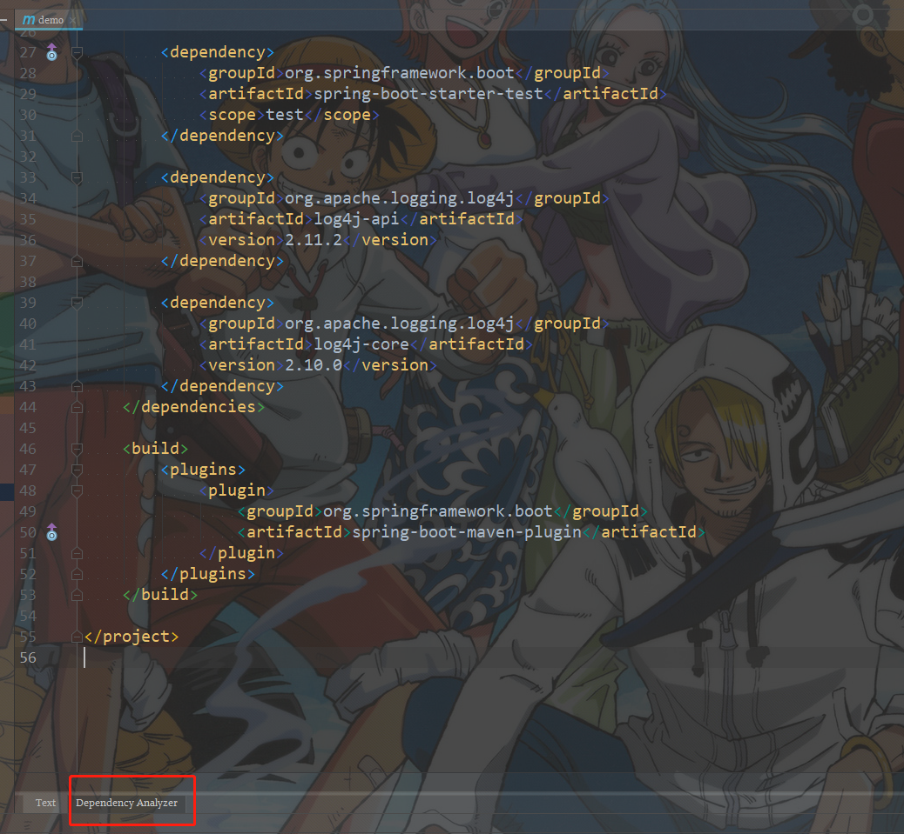
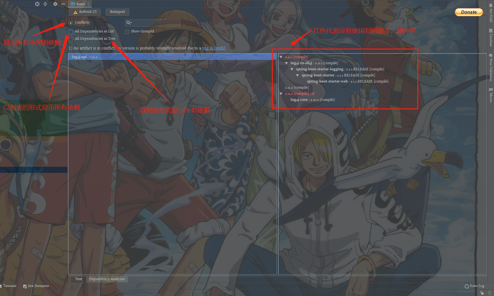
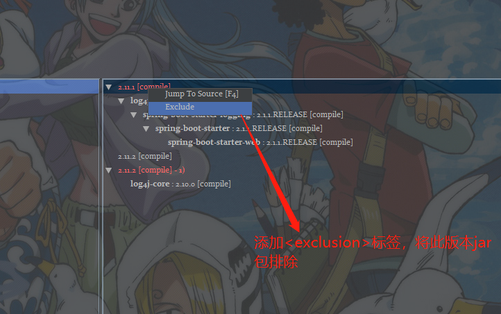
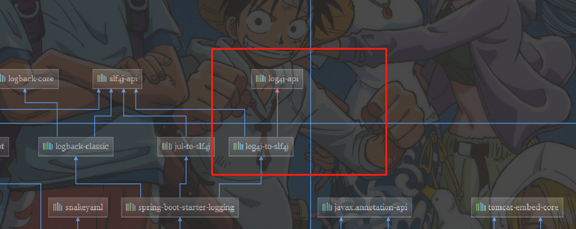

# 一、Maven构建生命周期

Maven 构建生命周期定义了一个项目构建跟发布的过程。

一个典型的 Maven 构建（build）生命周期是由以下几个阶段的序列组成的：


|     阶段      |   处理   |                           描述                           |
| :-----------: | :------: | :------------------------------------------------------: |
| 验证 validate | 验证项目 |          验证项目是否正确且所有必须信息是可用的          |
| 编译 compile  | 执行编译 |                  源代码编译在此阶段完成                  |
|   测试 Test   |   测试   |      使用适当的单元测试框架（例如JUnit）运行测试。       |
| 包装 package  |   打包   |         创建JAR/WAR包如在 pom.xml 中定义提及的包         |
|  检查 verify  |   检查   |         对集成测试的结果进行检查，以保证质量达标         |
| 安装 install  |   安装   |        安装打包的项目到本地仓库，以供其他项目使用        |
|  部署 deploy  |   部署   | 拷贝最终的工程包到远程仓库中，以共享给其他开发人员和工程 |

为了完成 default 生命周期，这些阶段（包括其他未在上面罗列的生命周期阶段）将被按顺序地执行。

Maven 有以下三个标准的生命周期：

- **clean**：项目清理的处理
- **default(或 build)**：项目部署的处理
- **site**：项目站点文档创建的处理

## 1.1 Clean生命周期

当我们执行 mvn post-clean 命令时，Maven 调用 clean 生命周期，它包含以下阶段：

- pre-clean：执行一些需要在clean之前完成的工作
- clean：移除所有上一次构建生成的文件
- post-clean：执行一些需要在clean之后立刻完成的工作

mvn clean 中的 clean 就是上面的 clean，在一个生命周期中，运行某个阶段的时候，它之前的所有阶段都会被运行，也就是说，如果执行 mvn clean 将运行以下两个生命周期阶段：

```
pre-clean, clean
```

可以理解为删除target目录

## 1.2 Default生命周期

这是 Maven 的主要生命周期，被用于构建应用，包括下面的 23 个阶段：

| 生命周期阶段          | 描述                                                         |
| :-------------------- | :----------------------------------------------------------- |
| validate              | 检查工程配置是否正确，完成构建过程的所有必要信息是否能够获取到。 |
| initialize            | 初始化构建状态，例如设置属性。                               |
| generate-sources      | 生成编译阶段需要包含的任何源码文件。                         |
| process-sources       | 处理源代码，例如，过滤任何值（filter any value）。           |
| generate-resources    | 生成工程包中需要包含的资源文件。                             |
| process-resources     | 拷贝和处理资源文件到目的目录中，为打包阶段做准备。           |
| compile               | 编译工程源码。                                               |
| process-classes       | 处理编译生成的文件，例如 Java Class 字节码的加强和优化。     |
| generate-test-sources | 生成编译阶段需要包含的任何测试源代码。                       |
| process-test-sources  | 处理测试源代码，例如，过滤任何值（filter any values)。       |
| test-compile          | 编译测试源代码到测试目的目录。                               |
| process-test-classes  | 处理测试代码文件编译后生成的文件。                           |
| test                  | 使用适当的单元测试框架（例如JUnit）运行测试。                |
| prepare-package       | 在真正打包之前，为准备打包执行任何必要的操作。               |
| package               | 获取编译后的代码，并按照可发布的格式进行打包，例如 JAR、WAR 或者 EAR 文件。 |
| pre-integration-test  | 在集成测试执行之前，执行所需的操作。例如，设置所需的环境变量。 |
| integration-test      | 处理和部署必须的工程包到集成测试能够运行的环境中。           |
| post-integration-test | 在集成测试被执行后执行必要的操作。例如，清理环境。           |
| verify                | 运行检查操作来验证工程包是有效的，并满足质量要求。           |
| install               | 安装工程包到本地仓库中，该仓库可以作为本地其他工程的依赖。   |
| deploy                | 拷贝最终的工程包到远程仓库中，以共享给其他开发人员和工程。   |

## 1.3 Site生命周期

Maven Site 插件一般用来创建新的报告文档、部署站点等。

- pre-site：执行一些需要在生成站点文档之前完成的工作
- site：生成项目的站点文档
- post-site： 执行一些需要在生成站点文档之后完成的工作，并且为部署做准备
- site-deploy：将生成的站点文档部署到特定的服务器上

这里经常用到的是site阶段和site-deploy阶段，用以生成和发布Maven站点，这可是Maven相当强大的功能，Manager比较喜欢，文档及统计数据自动生成，很好看。 在下面的例子中，我们将 maven-antrun-plugin:run 目标添加到 Site 生命周期的所有阶段中。这样我们可以显示生命周期的所有文本信息。

# 二、Maven排查jar包冲突

## 2.1 冲突原理

Maven是个很好用的依赖管理工具，但是再好的东西也不是完美的。Maven的依赖机制会导致Jar包的冲突。举个例子，现在你的项目中，使用了两个Jar包，分别是A和B。现在A需要依赖另一个Jar包C，B也需要依赖C。但是A依赖的C的版本是1.0，B依赖的C的版本是2.0。这时候，Maven会将这1.0的C和2.0的C都下载到你的项目中，这样你的项目中就存在了不同版本的C，这时Maven会依据**依赖路径最短优先原则**，来决定使用哪个版本的Jar包，而另一个无用的Jar包则未被使用，这就是所谓的**依赖冲突**。

在大多数时候，依赖冲突可能并不会对系统造成什么异常，因为Maven始终选择了一个Jar包来使用。但是，不排除在某些特定条件下，会出现类似**找不到类的异常**，所以，只要存在依赖冲突，在我看来，最好还是解决掉，不要给系统留下隐患。

## 2.2 解决方法

解决依赖冲突的方法，就是使用Maven提供的**<exclusion>**标签，**<exclusion>**标签需要放在**<exclusions>**标签内部，就像下面这样：

```xml
<dependency>
    <groupId>org.apache.logging.log4j</groupId>
    <artifactId>log4j-core</artifactId>
    <version>2.10.0</version>
    <exclusions>
        <exclusion>
        <artifactId>log4j-api</artifactId>
        <groupId>org.apache.logging.log4j</groupId>
        </exclusion>
    </exclusions>
</dependency>
```

`log4j-core`本身是依赖了`log4j-api`的，但是因为一些其他的模块也依赖了`log4j-api`，并且两个`log4j-api`版本不同，所以我们使用**<exclusion>**标签排除掉`log4j-core`所依赖的`log4j-api`，这样Maven就不会下载`log4j-core`所依赖的`log4j-api`了，也就保证了我们的项目中只有一个版本的`log4j-api`。

## 2.3 示例

```xml
<?xml version="1.0" encoding="UTF-8"?>
<project xmlns="http://maven.apache.org/POM/4.0.0" xmlns:xsi="http://www.w3.org/2001/XMLSchema-instance"
         xsi:schemaLocation="http://maven.apache.org/POM/4.0.0 http://maven.apache.org/xsd/maven-4.0.0.xsd">
    <modelVersion>4.0.0</modelVersion>
    <parent>
        <groupId>org.springframework.boot</groupId>
        <artifactId>spring-boot-starter-parent</artifactId>
        <version>2.1.1.RELEASE</version>
        <relativePath/> <!-- lookup parent from repository -->
    </parent>
    <groupId>com.example</groupId>
    <artifactId>demo</artifactId>
    <version>0.0.1-SNAPSHOT</version>
    <name>demo</name>
    <description>Demo project for Spring Boot</description>

    <properties>
        <java.version>1.8</java.version>
    </properties>

    <dependencies>
        <dependency>
            <groupId>org.springframework.boot</groupId>
            <artifactId>spring-boot-starter-web</artifactId>
        </dependency>

        <dependency>
            <groupId>org.springframework.boot</groupId>
            <artifactId>spring-boot-starter-test</artifactId>
            <scope>test</scope>
        </dependency>

        <dependency>
            <groupId>org.apache.logging.log4j</groupId>
            <artifactId>log4j-api</artifactId>
            <version>2.11.2</version>
        </dependency>

        <dependency>
            <groupId>org.apache.logging.log4j</groupId>
            <artifactId>log4j-core</artifactId>
            <version>2.10.0</version>
        </dependency>
    </dependencies>

    <build>
        <plugins>
            <plugin>
                <groupId>org.springframework.boot</groupId>
                <artifactId>spring-boot-maven-plugin</artifactId>
            </plugin>
        </plugins>
    </build>

</project>
```

## 2.4 使用Maven Helper

安装好Maven Helper后，在pom.xml文件底部会出现一个**Dependency Analyzer**选项



打开



解决方法：



修改完的pom.xml

```xml
<?xml version="1.0" encoding="UTF-8"?>
<project xmlns="http://maven.apache.org/POM/4.0.0" xmlns:xsi="http://www.w3.org/2001/XMLSchema-instance"
         xsi:schemaLocation="http://maven.apache.org/POM/4.0.0 http://maven.apache.org/xsd/maven-4.0.0.xsd">
    <modelVersion>4.0.0</modelVersion>
    <parent>
        <groupId>org.springframework.boot</groupId>
        <artifactId>spring-boot-starter-parent</artifactId>
        <version>2.1.1.RELEASE</version>
        <relativePath/> <!-- lookup parent from repository -->
    </parent>
    <groupId>com.example</groupId>
    <artifactId>demo</artifactId>
    <version>0.0.1-SNAPSHOT</version>
    <name>demo</name>
    <description>Demo project for Spring Boot</description>

    <properties>
        <java.version>1.8</java.version>
    </properties>

    <dependencies>
        <dependency>
            <groupId>org.springframework.boot</groupId>
            <artifactId>spring-boot-starter-web</artifactId>
            <exclusions>
                <exclusion>
                    <artifactId>log4j-api</artifactId>
                    <groupId>org.apache.logging.log4j</groupId>
                </exclusion>
            </exclusions>
        </dependency>

        <dependency>
            <groupId>org.springframework.boot</groupId>
            <artifactId>spring-boot-starter-test</artifactId>
            <scope>test</scope>
        </dependency>

        <dependency>
            <groupId>org.apache.logging.log4j</groupId>
            <artifactId>log4j-api</artifactId>
            <version>2.11.2</version>
        </dependency>

        <dependency>
            <groupId>org.apache.logging.log4j</groupId>
            <artifactId>log4j-core</artifactId>
            <version>2.10.0</version>
            <exclusions>
                <exclusion>
                    <artifactId>log4j-api</artifactId>
                    <groupId>org.apache.logging.log4j</groupId>
                </exclusion>
            </exclusions>
        </dependency>
    </dependencies>

    <build>
        <plugins>
            <plugin>
                <groupId>org.springframework.boot</groupId>
                <artifactId>spring-boot-maven-plugin</artifactId>
            </plugin>
        </plugins>
    </build>

</project>
```

## 2.5 技巧

除了使用Maven Helper查看依赖冲突，也可以使用IDEA提供的方法——Maven依赖结构图，打开Maven窗口，选择Dependencies，然后点击那个图标（Show Dependencies）或者使用快捷键（Ctrl+Alt+Shift+U），即可打开Maven依赖关系结构图

在图中，我们可以看到有一些红色的实线，这些红色实线就是依赖冲突，蓝色实线则是正常的依赖。

