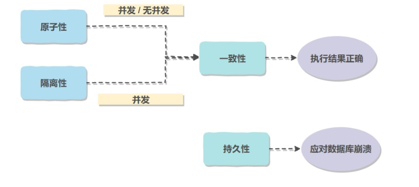
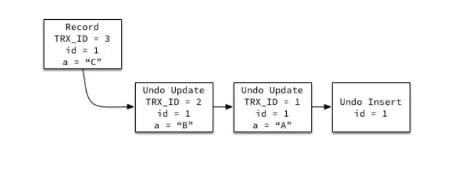
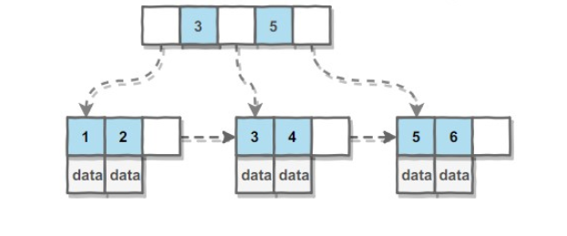
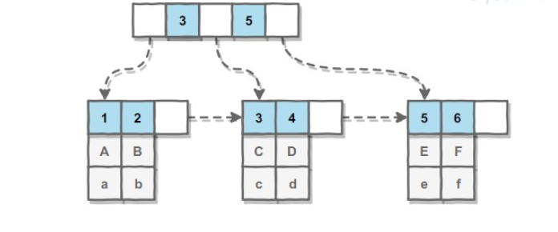
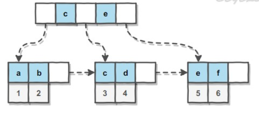
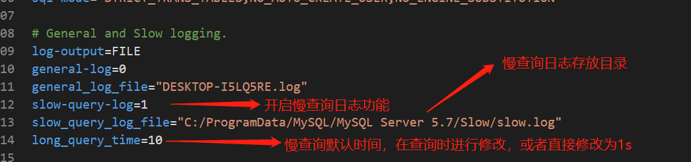
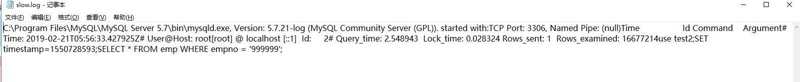
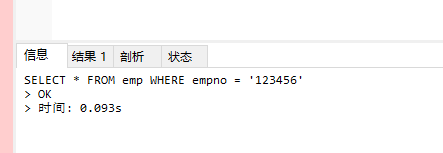
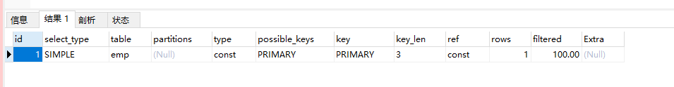

# 一、数据库事务

事务指的是满足 ACID 特性的一组操作，可以通过 Commit 提交一个事务，也可以使用 Rollback 进行回滚。

**首先介绍事务，什么是事务，事务就是DBMS当中用户程序的任何一次执行，事务是DBMS能看到的基本修改单元。**

**事务是指对系统进行的一组操作，为了保证系统的完整性，事务需要具有ACID特性**

ACID里的AID都是数据库的特征,也就是依赖数据库的具体实现.而唯独这个C,实际上它依赖于应用层,也就是依赖于开发者.这里的一致性是指系统从一个正确的状态,迁移到另一个正确的状态.什么叫正确的状态呢?就是当前的状态满足预定的约束就叫做正确的状态.而事务具备ACID里C的特性是说通过事务的AID来保证我们的一致性.

**ACID** 

### 1.1 原子性（Atomicity）

事务被视为不可分割的最小单元，事务的所有操作要么全部提交成功，要么全部失败回滚。

回滚可以用回滚日志来实现，回滚日志记录着事务所执行的修改操作，在回滚时反向执行这些修改操作即可。

### 1.2 一致性（Consistency）

数据库在事务执行前后都保持一致性状态。在一致性状态下，所有事务对一个数据的读取结果都是相同的。

一致性是指数据处于一种语义上的有意义且正确的状态。一致性是对数据可见性的约束，保证在一个事务中的多次操作的数据中间状态对其他事务不可见的。因为这些中间状态，是一个过渡状态，与事务的开始状态和事务的结束状态是不一致的。
举个栗子，张三给李四转账100元。事务要做的是从张三账户上减掉100元，李四账户上加上100元。一致性的含义是其他事务要么看到张三还没有给李四转账的状态，要么张三已经成功转账给李四的状态，而对于张三少了100元，李四还没加上100元这个中间状态是不可见的。

原子性和一致性的的侧重点不同：原子性关注状态，要么全部成功，要么全部失败，不存在部分成功的状态。而一致性关注数据的可见性，中间状态的数据对外部不可见，只有最初状态和最终状态的数据对外可见。

在未提交读的隔离级别下，会造成脏读，这就是因为一个事务读到了另一个事务操作内部的数据。ACID中是的一致性描述的是一个最理想的事务应该怎样的，是一个强一致性状态，如果要做到这点，需要使用排它锁把事务排成一队，即Serializable的隔离级别，这样性能就大大降低了。现实是骨感的，所以使用隔离性的不同隔离级别来破坏一致性，来获取更好的性能。

### 1.3 隔离性（Isolation）

一个事务所做的修改在最终提交以前，对其它事务是不可见的。

### 1.4 持久性（Durability）

一旦事务提交，则其所做的修改将会永远保存到数据库中。即使系统发生崩溃，事务执行的结果也不能丢失。

使用重做日志来保证持久性。

------

一致性是指事务必须使数据库从一个一致性状态变换到另一个一致性状态，也就是说一个事务执行之前和执行之后都必须处于一致性状态。
数据库状态如何变化？每一次数据变更就会导致数据库的状态迁移。如果数据库的初始状态是C0，第一次事务T1的提交就会导致系统生成一个SYSTEM CHANGE NUMBER（SCN），这是数据库状态从C0转变成C1。执行第二个事务T2的时候数据库状态从T1变成T2，以此类推，执行第Tn次事务的时候数据库状态由C(n-1)变成Cn。
一致性可以从一致读和一致写两个方面来理解。

- **一致读** 事务读取数据只能从一个状态中读取，不能从2个或者2个以上状态读取。也就是T(n)只能从C(n-1），C(n-2)... C(1)中的一个状态读取数据，不能一部分数据读取自C(n-1)，而另一部分数据读取自C(n-2)。
- **一致写** 事务执行的数据变更只能基于上一个一致的状态，且只能体现在一个状态中。T(n)的变更结果只能基于C(n-1)，C(n-2), ...C(1)状态，且只能体现在C(n)状态中。也就是说，一个状态只能有一个事务变更数据，不允许有2个或者2个以上事务在一个状态中变更数据。至于具体一致写基于哪个状态，需要判断T(n)事务是否和T(n-1)，T(n-2),...T(1)有依赖关系。

------

事务的 ACID 特性概念简单，但不是很好理解，主要是因为这几个特性不是一种平级关系：

- 只有满足一致性，事务的执行结果才是正确的。
- 在无并发的情况下，事务串行执行，隔离性一定能够满足。此时只要能满足原子性，就一定能满足一致性。
- 在并发的情况下，多个事务并行执行，事务不仅要满足原子性，还需要满足隔离性，才能满足一致性。
- 事务满足持久化是为了能应对数据库崩溃的情况。



事务的提交和回滚

程序中发生异常，才能进行回滚

事务本身发生异常那么就不会做回滚，直接抛出异常：创建事务失败、提交事务失败（数据库宕机）

Do not call rollback on a transaction if commit threw an exception.

# 二、数据库并发一致性问题

在并发环境下，事务的隔离性很难保证，因此会出现很多并发一致性问题。

### 2.1 丢失修改

T1 和 T2 两个事务都对一个数据进行修改，T1 先修改，T2 随后修改，T2 的修改覆盖了 T1 的修改。

### 2.2 读脏数据

T1 修改一个数据，T2 随后读取这个数据。如果 T1 撤销了这次修改，那么 T2 读取的数据是脏数据。

### 2.3 不可重复读

T2 读取一个数据，T1 对该数据做了修改。如果 T2 再次读取这个数据，此时读取的结果和第一次读取的结果不同。

### 2.4 幻影读

T1 读取某个范围的数据，T2 在这个范围内插入新的数据，T1 再次读取这个范围的数据，此时读取的结果和和第一次读取的结果不同。

------

**产生并发不一致性问题主要原因是破坏了事务的隔离性，解决方法是通过并发控制来保证隔离性。并发控制可以通过封锁来实现，但是封锁操作需要用户自己控制，相当复杂。数据库管理系统提供了事务的隔离级别，让用户以一种更轻松的方式处理并发一致性问题。**

-  `不可重复读` 主要是说多次读取一条记录, 发现该记录中某些列值被修改过。
-  `幻读` 主要是说多次读取一个范围内的记录(包括直接查询所有记录结果或者做聚合统计), 发现结果不一致(标准档案一般指记录增多, 记录的减少应该也算是幻读)。

# 三、封锁

### 3.1 封锁的粒度

- 表级锁：开销小，加锁快；不会出现死锁；锁定粒度大，发生锁冲突的概率最高,并发度最低。
- 行级锁：开销大，加锁慢；会出现死锁；锁定粒度最小，发生锁冲突的概率最低,并发度也最高。
-  页面锁：开销和加锁时间界于表锁和行锁之间；会出现死锁；锁定粒度界于表锁和行锁之间，并发度一般。

### 3.2 封锁的类型

#### 3.2.1 读写锁（行级锁）

- 排它锁（Exclusive），简写为 X 锁，又称写锁。
- 共享锁（Shared），简写为 S 锁，又称读锁。

有以下两个规定：

- 一个事务对数据对象 A 加了 X 锁，就可以对 A 进行读取和更新。加锁期间其它事务不能对 A 加任何锁。
- 一个事务对数据对象 A 加了 S 锁，可以对 A 进行读取操作，但是不能进行更新操作。加锁期间其它事务能对 A 加 S 锁，但是不能加 X 锁。

锁的兼容关系如下：

| -    | X    | S    |
| ---- | ---- | ---- |
| X    | ×    | ×    |
| S    | ×    | √    |

#### 3.2.2 意向锁

使用意向锁（Intention Locks）可以更容易地支持多粒度封锁。

在存在行级锁和表级锁的情况下，事务 T 想要对表 A 加 X 锁，就需要先检测是否有其它事务对表 A 或者表 A 中的任意一行加了锁，那么就需要对表 A 的每一行都检测一次，这是非常耗时的。

意向锁在原来的 X/S 锁之上引入了 IX/IS，**IX/IS 都是表锁**，用来表示一个事务想要在表中的某个数据行上加 X 锁或 S 锁。有以下两个规定：

- **一个事务在获得某个数据行对象的 S 锁之前，必须先获得表的 IS 锁或者更强的锁；**
- **一个事务在获得某个数据行对象的 X 锁之前，必须先获得表的 IX 锁。**

通过引入意向锁，事务 T 想要对表 A 加 X 锁，只需要先检测是否有其它事务对表 A 加了 X/IX/S/IS 锁，如果加了就表示有其它事务正在使用这个表或者表中某一行的锁，因此事务 T 加 X 锁失败。

各种锁的兼容关系如下：

| -    | X    | IX   | S    | IS   |
| ---- | ---- | ---- | ---- | ---- |
| X    | ×    | ×    | ×    | ×    |
| IX   | ×    | √    | ×    | √    |
| S    | ×    | ×    | √    | √    |
| IS   | ×    | √    | √    | √    |

解释如下：

- 任意 IS/IX 锁之间都是兼容的，因为它们只是表示想要对表加锁，而不是真正加锁；
- S 锁只与 S 锁和 IS 锁兼容，也就是说事务 T 想要对数据行加 S 锁，其它事务可以已经获得对表或者表中的行的 S 锁。

#### 3.3.3 行级锁的实现方式

**InnoDB行锁是通过给索引上的索引项加锁来实现的**。**所以，只有通过索引条件检索数据，InnoDB才使用行级锁，否则，InnoDB将使用表锁**。其他注意事项：

- 在不通过索引条件查询的时候，InnoDB使用的是表锁，而不是行锁。
- 由于MySQL的行锁是针对索引加的锁，不是针对记录加的锁，所以即使是访问不同行的记录，如果使用了相同的索引键，也是会出现锁冲突的。
- 当表有多个索引的时候，不同的事务可以使用不同的索引锁定不同的行，另外，不论是使用主键索引、唯一索引或普通索引，InnoDB都会使用行锁来对数据加锁。
- 即便在条件中使用了索引字段，但具体是否使用索引来检索数据是由MySQL通过判断不同执行计划的代价来决定的，如果MySQL认为全表扫描效率更高，比如对一些很小的表，它就不会使用索引，这种情况下InnoDB将使用表锁，而不是行锁。因此，在分析锁冲突时，别忘了检查SQL的执行计划，以确认是否真正使用了索引。

### 3.3 封锁示例

#### 3.3.1 行级锁

**隐式加锁**

- InnoDB会自动加意向锁
- 对于insert、update、delete，InnoDB会自动给涉及的数据加排他锁（X）
- 对于一般的Select语句，InnoDB不会加任何锁

**显式加锁**

- 共享锁：SELECT ... LOCK IN SHARE MODE;
- 排他锁：SELECT ... FOR UPDATE;

#### 3.3.2 表级锁

在用 LOCK TABLES对InnoDB表加锁时要注意，要将AUTOCOMMIT设为0，否则MySql不会给表加锁；

事务结束前，不要用UNLOCK TABLES释放表锁，**因为UNLOCK TABLES会隐含地提交事务**；

COMMIT或ROLLBACK并不能释放用LOCK TABLES加的表级锁，必须用UNLOCK TABLES释放表锁。

### 3.4 封锁协议

#### 3.4.1 三级封锁协议

**一级封锁协议**

事务 T 要修改数据 A 时必须加 X 锁，直到 T 结束才释放锁。

|     T1      |     T2      |
| :---------: | :---------: |
|  lock-x(A)  |             |
|  read A=20  |             |
|             |  lock-x(A)  |
|             |    wait     |
| write A=19  |      .      |
|   commit    |      .      |
| unlock-x(A) |      .      |
|             |   obtain    |
|             |  read A=19  |
|             | write A=21  |
|             |   commit    |
|             | unlock-x(A) |

可以解决丢失修改问题，因为不能同时有两个事务对同一个数据进行修改，那么事务的修改就不会被覆盖。

**二级封锁协议**

在一级的基础上，要求读取数据 A 时必须加 S 锁，读取完马上释放 S 锁。

|     T1      |     T2      |
| :---------: | :---------: |
|  lock-x(A)  |             |
|  read A=20  |             |
| write A=19  |             |
|             |  lock-s(A)  |
|             |    wait     |
|  rollback   |      .      |
|    A=20     |      .      |
| unlock-x(A) |      .      |
|             |   obtain    |
|             |  read A=20  |
|             | unlock-s(A) |
|             |   commit    |

可以解决读脏数据问题，因为如果一个事务在对数据 A 进行修改，根据 1 级封锁协议，会加 X 锁，那么就不能再加 S 锁了，也就是不会读入数据。

**三级封锁协议**

在二级的基础上，要求读取数据 A 时必须加 S 锁，直到事务结束了才能释放 S 锁。

|     T1      |     T2      |
| :---------: | :---------: |
|  lock-s(A)  |             |
|  read A=20  |             |
|             |  lock-x(A)  |
|             |    wait     |
|  read A=20  |      .      |
|   commit    |      .      |
| unlock-s(A) |      .      |
|             |   obtain    |
|             |  read A=20  |
|             | write A=19  |
|             |   commit    |
|             | unlock-X(A) |

可以解决不可重复读的问题，因为读 A 时，其它事务不能对 A 加 X 锁，从而避免了在读的期间数据发生改变。

#### 3.4.2 两段锁协议

加锁和解锁分为两个阶段进行。

------

可串行化调度是指，通过并发控制，使得并发执行的事务结果与某个串行执行的事务结果相同。

事务遵循两段锁协议是保证可串行化调度的充分条件。例如以下操作满足两段锁协议，它是可串行化调度。

```
lock-x(A)...lock-s(B)...lock-s(C)...unlock(A)...unlock(C)...unlock(B)
```

但不是必要条件，例如以下操作不满足两段锁协议，但是它还是可串行化调度。

```
lock-x(A)...unlock(A)...lock-s(B)...unlock(B)...lock-s(C)...unlock(C)
```

# 四、隔离级别

### 4.1 未提交读（READ UNCOMMITTED）

事务中的修改，即使没有提交，对其它事务也是可见的。

### 4.2 提交读（READ COMMITTED）

一个事务只能读取已经提交的事务所做的修改。换句话说，一个事务所做的修改在提交之前对其它事务是不可见的。

### 4.3 可重复读（REPEATABLE READ）

保证在同一个事务中多次读取同样数据的结果是一样的。

### 4.4 可串行化（SERIALIZABLE）

强制事务串行执行。

------

| 隔离级别 | 脏读 | 不可重复读 | 幻影读 | 加锁读 |
| -------- | ---- | ---------- | ------ | ------ |
| 未提交读 | √    | √          | √      | ×      |
| 提交读   | ×    | √          | √      | ×      |
| 可重复读 | ×    | ×          | √      | ×      |
| 可串行化 | ×    | ×          | ×      | √      |

# 五、多版本并发控制

版本是指数据库中数据对象的一个快照，记录了数据对象某个时刻的状态。

多版本并发控制（Multi-Version Concurrency Control, MVCC）是 MySQL 的 InnoDB 存储引擎实现隔离级别的一种具体方式，用于实现提交读和可重复读这两种隔离级别。而未提交读隔离级别总是读取最新的数据行，无需使用 MVCC。可串行化隔离级别需要对所有读取的行都加锁，单纯使用 MVCC 无法实现。

### 5.1 版本号

- 系统版本号：是一个递增的数字，每开始一个新的事务，系统版本号就会自动递增。
- 事务版本号：事务开始时的系统版本号。

### 5.2 隐藏的列

MVCC 在每行记录后面都保存着两个隐藏的列，用来存储两个版本号：

- 创建版本号：指示创建一个数据行的快照时的系统版本号；
- 删除版本号：如果该快照的删除版本号大于当前事务版本号或者为空表示该快照有效，否则表示该快照已经被删除了。（删除版本号 大于 当前事务版本号，就是说删除操作是在当前事务启动之后做的）

### 5.3 Undo日志

MVCC 使用到的快照存储在 Undo 日志中，该日志通过回滚指针把一个数据行（Record）的所有快照连接起来。



### 5.4 实现过程

以下实现过程针对可重复读隔离级别。

当开始新一个事务时，该事务的版本号肯定会大于当前所有数据行快照的创建版本号，理解这一点很关键。

#### 5.4.1 SELECT

**多个事务必须读取到同一个数据行的快照**，并且这个快照是距离现在最近的一个有效快照。但是也有例外，如果有一个事务正在修改该数据行，那么它可以读取事务本身所做的修改，而不用和其它事务的读取结果一致。

把没有对一个数据行做修改的事务称为 T，**T 所要读取的数据行快照的创建版本号必须小于 T 的版本号，因为如果大于或者等于 T 的版本号，那么表示该数据行快照是其它事务的最新修改，因此不能去读取它**。除此之外，T 所要读取的数据行快照的删除版本号必须大于 T 的版本号或者为空，因为如果小于等于 T 的版本号，那么表示该数据行快照是已经被删除的，不应该去读取它。

#### 5.4.2 INSERT

将当前系统版本号作为数据行快照的创建版本号。

#### 5.4.3 DELETE

将当前系统版本号作为数据行快照的删除版本号。

#### 5.4.4 UPDATE

将当前系统版本号作为更新前的数据行快照的删除版本号，并将当前系统版本号作为更新后的数据行快照的创建版本号。可以理解为先执行 DELETE 后执行 INSERT。

### 5.5 快照读和当前读

#### 5.5.1 快照读

读取的是记录数据的可见版本（可能是过期的数据），不用加锁。

简单的select操作(不包括 select ... lock in share mode, select ... for update)

**当执行select的时候，innodb默认会执行快照读**，相当于就是给你目前的状态找了一张照片，以后执行select 的时候就会返回当前照片里面的数据，当其他事务提交了也对你不造成影响，和你没关系，这就实现了可重复读了，那这个照片是什么时候生成的呢？不是开启事务的时候，是当你第一次执行select的时候，也就是说，当A开启了事务，然后没有执行任何操作，这时候B insert了一条数据然后commit,这时候A执行 select，那么返回的数据中就会有B添加的那条数据......之后无论再有其他事务commit都没有关系，因为照片已经生成了，而且不会再生成了，以后都会参考这张照片。

**RR下，某个事务首次read记录的时间为T，未来不会读取到T时间之后已提交事务写入的记录，以保证连续相同的read读到相同的结果集**

#### 5.5.2 当前读

读取的是最新的数据，需要加锁。以下第一个语句需要加 S 锁，其它都需要加 X 锁。

select ... lock in share mode

select ... for update

insert

update

delete

------

**在RR级别下，快照读是通过MVVC(多版本控制)和undo log来实现的，当前读是通过加record lock(记录锁)和gap lock(间隙锁)来实现的。**

### 5.6 总结

**快照读**(Snapshot Read)

MySQL数据库，InnoDB存储引擎，为了提高并发，使用MVCC机制，在并发事务时，通过读取数据行的历史数据版本，不加锁，来提高并发的一种不加锁一致性读(Consistent Nonlocking Read)。

**读提交**(Read Committed)

· 数据库领域，事务隔离级别的一种，简称RC

· 它解决“读脏”问题，保证读取到的数据行都是已提交事务写入的

· 它可能存在“读幻影行”问题，同一个事务里，连续相同的read可能读到不同的结果集

**可重复读**(Repeated Read)

· 数据库领域，事务隔离级别的一种，简称RR

· 它不但解决“读脏”问题，还解决了“读幻影行”问题，同一个事务里，连续相同的read读到相同的结果集

在**读提交**(RC)，**可重复读**(RR)两个不同的事务的隔离级别下，**快照读**有什么不同呢？

先说**结论**：

· 事务总能够读取到，自己写入(update /insert /delete)的行记录

· RC下，快照读总是能读到最新的行数据快照，当然，必须是已提交事务写入的

· RR下，某个事务首次read记录的时间为T，未来不会读取到T时间之后已提交事务写入的记录，以保证连续相同的read读到相同的结果集

*画外音：可以看到*

*(1)和并发事务的开始时间没关系，和事务首次read的时间有关；*

*(2)由于不加锁，和互斥关系也不大；*

InnoDB表：

t(id PK, name);
 表中有三条记录：
1, shenjian
2, zhangsan
3, lisi

------

**case 1**，两个并发事务A，B执行的时间序列如下（A先于B开始，B先于A结束）：

A1: start transaction;
         B1: start transaction;
A2: select * from t;
         B2: insert into t values (4, wangwu);
A3: select * from t;
         B3: commit;
A4: select * from t;

**提问1**：假设事务的隔离级别是可重复读RR，事务A中的三次查询，A2, A3, A4分别读到什么结果集？

**回答**：RR下

(1)A2读到的结果集肯定是{1, 2, 3}，这是事务A的第一个read，假设为时间T；

(2)A3读到的结果集也是{1, 2, 3}，因为B还没有提交；

(3)A4读到的结果集还是{1, 2, 3}，因为事务B是在时间T之后提交的，A4得读到和A2一样的记录；

**提问2**：假设事务的隔离级别是读提交RC，A2, A3, A4又分别读到什么结果集呢？

**回答**：RC下

(1)A2读到的结果集是{1, 2, 3}；

(2)A3读到的结果集也是{1, 2, 3}，因为B还没有提交；

(3)A4读到的结果集还是{1, 2, 3, 4}，因为事务B已经提交；

------

**case 2**，仍然是上面的两个事务，只是A和B开始时间稍有不同（B先于A开始，B先于A结束）：
         B1: start transaction;

A1: start transaction;

A2: select * from t;
         B2: insert into t values (4, wangwu);
A3: select * from t;
         B3: commit;
A4: select * from t;

**提问3**：假设事务的隔离级别是可重复读RR，事务A中的三次查询，A2, A3, A4分别读到什么结果集？
**提问4**：假设事务的隔离级别是读提交RC，A2, A3, A4的结果集又是什么呢？
**回答**：事务的开始时间不一样，不会影响“快照读”的结果，所以结果集和case 1一样。

------

**case 3**，仍然是并发的事务A与B（A先于B开始，B先于A结束）：

A1: start transaction;
         B1: start transaction;
         B2: insert into t values (4, wangwu);
         B3: commit;
A2: select * from t;

**提问5**：假设事务的隔离级别是可重复读RR，事务A中的A2查询，结果集是什么？
**提问6**：假设事务的隔离级别是读提交RC，A2的结果集又是什么呢？

**回答**：在RR下，

A2是事务A的第一个read，假设为时间T，它能读取到T之前提交事务写入的数据行，故结果集为{1, 2, 3, 4}。在RC下，没有疑问，一定是{1, 2, 3, 4}。

------

**case 4**，事务开始的时间再换一下（B先于A开始，B先于A结束）：

​         B1: start transaction;

A1: start transaction;

​         B2: insert into t values (4, wangwu);
​         B3: commit;
A2: select * from t;

**提问7**：假设事务的隔离级别是可重复读RR，事务A中的A2查询，结果集是什么？
**提问8**：假设事务的隔离级别是读提交RC，A2的结果集又是什么呢？

**回答**：事务的开始时间不一样，不会影响“快照读”的结果，所以结果集和case 3一样。

------

啰嗦说了这么多，用一句话**总结**：

**· RR下，事务在第一个Read操作时，会建立Read View**

**· RC下，事务在每次Read操作时，都会建立Read View**

# 六、Next-Key Locks

Next-Key Locks 是 MySQL 的 InnoDB 存储引擎的一种锁实现。

MVCC 不能解决幻读的问题，Next-Key Locks 就是为了解决这个问题而存在的。在可重复读（REPEATABLE READ）隔离级别下，使用 MVCC + Next-Key Locks 可以解决幻读问题。

### 6.1 Record Locks

锁定一个记录上的索引，而不是记录本身。

如果表没有设置索引，InnoDB 会自动在主键上创建隐藏的聚簇索引，因此 Record Locks 依然可以使用。

### 6.2 Gap Locks

锁定索引之间的间隙，但是不包含索引本身。例如当一个事务执行以下语句，其它事务就不能在 t.c 中插入 15。

```
SELECT c FROM t WHERE c BETWEEN 10 and 20 FOR UPDATE;
```

### 6.3 Next-Key Locks

它是 Record Locks 和 Gap Locks 的结合，不仅锁定一个记录上的索引，也锁定索引之间的间隙。例如一个索引包含以下值：10, 11, 13, and 20，那么就需要锁定以下区间：

```
(negative infinity, 10]
(10, 11]
(11, 13]
(13, 20]
(20, positive infinity)
```

### 6.4 测试

默认RR级别

```mysql
root@localhost : test 10:56:10>create table t(a int,key idx_a(a))engine =innodb;
Query OK, 0 rows affected (0.20 sec)

root@localhost : test 10:56:13>insert into t values(1),(3),(5),(8),(11);
Query OK, 5 rows affected (0.00 sec)
Records: 5  Duplicates: 0  Warnings: 0

root@localhost : test 10:56:15>select * from t;
+------+
| a    |
+------+
|    1 |
|    3 |
|    5 |
|    8 |
|   11 |
+------+
rows in set (0.00 sec)

section A:

root@localhost : test 10:56:27>start transaction;
Query OK, 0 rows affected (0.00 sec)

root@localhost : test 10:56:29>select * from t where a = 8 for update;
+------+
| a    |
+------+
|    8 |
+------+
row in set (0.00 sec)


section B:
root@localhost : test 10:54:50>begin;
Query OK, 0 rows affected (0.00 sec)

root@localhost : test 10:56:51>select * from t;
+------+
| a    |
+------+
|    1 |
|    3 |
|    5 |
|    8 |
|   11 |
+------+
rows in set (0.00 sec)

root@localhost : test 10:56:54>insert into t values(2);
Query OK, 1 row affected (0.00 sec)

root@localhost : test 10:57:01>insert into t values(4);
Query OK, 1 row affected (0.00 sec)

++++++++++
root@localhost : test 10:57:04>insert into t values(6);

root@localhost : test 10:57:11>insert into t values(7);

root@localhost : test 10:57:15>insert into t values(9);

root@localhost : test 10:57:33>insert into t values(10);
++++++++++
上面全被锁住，阻塞住了

root@localhost : test 10:57:39>insert into t values(12);
Query OK, 1 row affected (0.00 sec)
```

**问题：**

**为什么section B上面的插入语句会出现锁等待的情况**？InnoDB是行锁，在section A里面锁住了a=8的行，其他应该不受影响。why？

**分析：**

**因为InnoDB对于行的查询都是采用了Next-Key Lock的算法**，锁定的不是单个值，而是一个范围（GAP）。上面索引值有1，3，5，8，11，其记录的GAP的区间如下：是一个**左开右闭**的空间（原因是默认主键的有序自增的特性，结合后面的例子说明）

（-∞,1]，(1,3]，(3,5]，(5,8]，(8,11]，(11,+∞）

特别需要注意的是，InnoDB存储引擎还会对辅助索引下一个键值加上gap lock。如上面分析，那就可以解释了。

```mysql
root@localhost : test 10:56:29>select * from t where a = 8 for update;
+------+
| a    |
+------+
|    8 |
+------+
row in set (0.00 sec)
```

该SQL语句锁定的范围是（5,8]，下个下个键值范围是（8,11]，所以插入5~11之间的值的时候都会被锁定，要求等待。即：插入5，6，7，8，9，10 会被锁住。插入非这个范围内的值都正常。

**因为例子里没有主键，所以要用隐藏的ROWID来代替，数据根据Rowid进行排序。而Rowid是有一定顺序的（自增），所以其中11可以被写入，5不能被写入。**  

### 6.5 总结

1. innodb对于行的查询使用next-key lock
2. Next-locking keying为了解决Phantom Problem幻读问题
3. 当查询的索引含有唯一属性时，将next-key lock降级为record key
4. Gap锁设计的目的是为了阻止多个事务将记录插入到同一范围内，而这会导致幻读问题的产生
5. 有两种方式显式关闭gap锁：（除了外键约束和唯一性检查外，其余情况仅使用record lock） A. 将事务隔离级别设置为RC B. 将参数innodb_locks_unsafe_for_binlog设置为1

# 七、MySQL索引

### 7.1 B+ 树

#### 7.1.1 数据结构

B Tree 指的是 Balance Tree，也就是平衡树。平衡树是一颗查找树，并且所有叶子节点位于同一层。

B+ Tree 是基于 B Tree 和叶子节点顺序访问指针进行实现，它具有 B Tree 的平衡性，并且通过顺序访问指针来提高区间查询的性能。

在 B+ Tree 中，一个节点中的 key 从左到右非递减排列，如果某个指针的左右相邻 key 分别是 key（i） 和 key（i+1），且不为 null，则该指针指向节点的所有 key 大于等于 keyi 且小于等于 keyi+1。



#### 7.1.2 操作

进行查找操作时，首先在根节点进行二分查找，找到一个 key 所在的指针，然后递归地在指针所指向的节点进行查找。直到查找到叶子节点，然后在叶子节点上进行二分查找，找出 key 所对应的 data。

插入删除操作会破坏平衡树的平衡性，因此在插入删除操作之后，需要对树进行一个分裂、合并、旋转等操作来维护平衡性。

#### 7.1.3 与红黑树的比较

红黑树等平衡树也可以用来实现索引，但是文件系统及数据库系统普遍采用 B+ Tree 作为索引结构，主要有以下两个原因：

（一）更少的查找次数

平衡树查找操作的时间复杂度和树高 h 相关，O(h)=O(logdN)，其中 d 为每个节点的出度。

红黑树的出度为 2，而 B+ Tree 的出度一般都非常大，所以红黑树的树高 h 很明显比 B+ Tree 大非常多，查找的次数也就更多。

（二）利用磁盘预读特性

为了减少磁盘 I/O 操作，磁盘往往不是严格按需读取，而是每次都会预读。预读过程中，磁盘进行顺序读取，顺序读取不需要进行磁盘寻道，并且只需要很短的旋转时间，速度会非常快。

**操作系统一般将内存和磁盘分割成固定大小的块，每一块称为一页，内存与磁盘以页为单位交换数据。数据库系统将索引的一个节点的大小设置为页的大小，使得一次 I/O 就能完全载入一个节点。并且可以利用预读特性，相邻的节点也能够被预先载入。**

二叉查找树进化品种的红黑树等数据结构也可以用来实现索引，但是文件系统及数据库系统普遍采用B-/+Tree作为索引结构。

一般来说，索引本身也很大，不可能全部存储在内存中，因此**索引往往以索引文件的形式存储的磁盘上**。这样的话，**索引查找过程中就要产生磁盘I/O消耗**，相对于内存存取，**I/O存取的消耗要高几个数量级**，所以评价一个数据结构作为索引的优劣最重要的指标就是在查找过程中磁盘I/O操作次数的渐进复杂度。换句话说，索引的结构组织要尽量减少查找过程中磁盘I/O的存取次数。为什么使用B-/+Tree，还跟磁盘存取原理有关。

​       **局部性原理与磁盘预读**

　　由于存储介质的特性，磁盘本身存取就比主存慢很多，再加上机械运动耗费，磁盘的存取速度往往是主存的几百分分之一，因此为了提高效率，要尽量减少磁盘I/O。为了达到这个目的，**磁盘往往不是严格按需读取，而是每次都会预读，即使只需要一个字节，磁盘也会从这个位置开始，顺序向后读取一定长度的数据放入内存**。这样做的理论依据是计算机科学中著名的局部性原理：

　　**当一个数据被用到时，其附近的数据也通常会马上被使用。**

　　程序运行期间所需要的数据通常比较集中。

　　由于磁盘顺序读取的效率很高（不需要寻道时间，只需很少的旋转时间），因此对于具有局部性的程序来说，预读可以提高I/O效率。

　　**预读的长度一般为页（page）的整倍数**。页是计算机管理存储器的逻辑块，硬件及操作系统往往将主存和磁盘存储区分割为连续的大小相等的块，每个存储块称为一页（在许多操作系统中，页得大小通常为**4k**），**主存和磁盘以页为单位交换数据**。当程序要读取的数据不在主存中时，会触发一个缺页异常，此时系统会向磁盘发出读盘信号，磁盘会找到数据的起始位置并向后连续读取一页或几页载入内存中，然后异常返回，程序继续运行。

​      我们上面分析B-/+Tree检索一次最多需要访问节点：

​     **h =**

​    

​      **数据库系统巧妙利用了磁盘预读原理，将一个节点的大小设为等于一个页，这样每个节点只需要一次I/O就可以完全载入。**为了达到这个目的，在实际实现B- Tree还需要使用如下技巧：

​      **每次新建节点时，直接申请一个页的空间，这样就保证一个节点物理上也存储在一个页里，加之计算机存储分配都是按页对齐的，就实现了一个node只需一次I/O。**

　　B-Tree中一次检索最多需要h-1次I/O（根节点常驻内存），渐进复杂度为O（h）=O（logmN）。一般实际应用中，m是非常大的数字，通常超过100，因此h非常小（通常不超过3）。

　　综上所述，用B-Tree作为索引结构效率是非常高的。

　　而红黑树这种结构，**h**明显要深的多。由于逻辑上很近的节点（父子）物理上可能很远，无法利用局部性，所以红黑树的I/O渐进复杂度也为O（h），效率明显比B-Tree差很多。

> **注意： ** **数据库的字段长度会对索引产生影响，因为数据页和索引页是固定的8K，字段越长，一个页面存放的数据越少，索引的层次就越多，查找范围也越大。一般建议使用“窄索引”，即使用字段长度小的索引。**

#### 7.1.4 为什么说B+树比B树更适合数据库索引

**1、B+树的磁盘读写代价更低：B+树的内部节点并没有指向关键字具体信息的指针，因此其内部节点相对B树更小，如果把所有同一内部节点的关键字存放在同一盘块中，那么盘块所能容纳的关键字数量也越多，一次性读入内存的需要查找的关键字也就越多，相对IO读写次数就降低了。**B+树更适合外部存储(一般指磁盘存储),由于内节点(非叶子节点)不存储data，所以一个节点可以存储更多的内节点，每个节点能索引的范围更大更精确。也就是说使用B+树单次磁盘IO的信息量相比较B树更大，IO效率更高。

**2、B+树的查询效率更加稳定：由于非终结点并不是最终指向文件内容的结点，而只是叶子结点中关键字的索引。所以任何关键字的查找必须走一条从根结点到叶子结点的路。所有关键字查询的路径长度相同，导致每一个数据的查询效率相当。**

**3、由于B+树的数据都存储在叶子结点中，分支结点均为索引，方便扫库，只需要扫一遍叶子结点即可，但是B树因为其分支结点同样存储着数据，我们要找到具体的数据，需要进行一次中序遍历按序来扫，所以B+树更加适合在区间查询的情况，所以通常B+树用于数据库索引。**

**4、mysql是关系型数据库，经常会按照区间来访问某个索引列，B+树的叶子节点间按顺序建立了链指针，加强了区间访问性，所以B+树对索引列上的区间范围查询很友好。而B树每个节点的key和data在一起，无法进行区间查找。**

### 7.2 索引分类

索引是在存储引擎层实现的，而不是在服务器层实现的，所以不同存储引擎具有不同的索引类型和实现。

#### 7.2.1 B+ 树索引

是大多数 MySQL 存储引擎的默认索引类型。因为不再需要进行全表扫描，只需要对树进行搜索即可，所以查找速度快很多。

除了用于查找，还可以用于排序和分组。

可以指定多个列作为索引列，多个索引列共同组成键。

适用于全键值、键值范围和键前缀查找，其中键前缀查找只适用于最左前缀查找。如果不是按照索引列的顺序进行查找，则无法使用索引。

**InnoDB 的 B+Tree 索引分为主索引和辅助索引。主索引的叶子节点 data 域记录着完整的数据记录，这种索引方式被称为聚簇索引。因为无法把数据行存放在两个不同的地方，所以一个表只能有一个聚簇索引。**



**辅助索引的叶子节点的 data 域记录着主键的值，因此在使用辅助索引进行查找时，需要先查找到主键值，然后再到主索引中进行查找。**



#### 7.2.2 哈希索引

哈希索引能以 O(1) 时间进行查找，但是失去了有序性：

- 无法用于排序与分组；
- 只支持精确查找，无法用于部分查找和范围查找。

InnoDB 存储引擎有一个特殊的功能叫“自适应哈希索引”，当某个索引值被使用的非常频繁时，会在 B+Tree 索引之上再创建一个哈希索引，这样就让 B+Tree 索引具有哈希索引的一些优点，比如快速的哈希查找。

#### 7.2.3 全文索引

MyISAM 存储引擎支持全文索引，用于查找文本中的关键词，而不是直接比较是否相等。

查找条件使用 MATCH AGAINST，而不是普通的 WHERE。

全文索引使用倒排索引实现，它记录着关键词到其所在文档的映射。

InnoDB 存储引擎在 MySQL 5.6.4 版本中也开始支持全文索引。

#### 7.2.4 空间数据索引

MyISAM 存储引擎支持空间数据索引（R-Tree），可以用于地理数据存储。空间数据索引会从所有维度来索引数据，可以有效地使用任意维度来进行组合查询。

必须使用 GIS 相关的函数来维护数据。

#### 7.2.5 聚簇索引和非聚簇索引

> **聚簇索引**

数据库表的索引从**数据存储方式**上可以分为聚簇索引和非聚簇索引（又叫二级索引）两种。Innodb的聚簇索引在同一个B-Tree中保存了索引列和具体的数据，在聚簇索引中，实际的数据保存在叶子页中，中间的节点页保存指向下一层页面的指针。“聚簇”的意思是数据行被按照一定顺序一个个紧密地排列在一起存储。**一个表只能有一个聚簇索引，因为在一个表中数据的存放方式只有一种**。

**聚簇索引并不是一种单独的索引类型，而是一种数据存储方式，具体的细节依赖于其实现方式。**

每个 InnoDB 表都有一个称为 「 聚簇索引 」 的特殊索引，通常情况下，这个聚簇索引就是 「 主键 」( primary key ) 。Innodb 使用它存储表中每一行的数据。

如果想要从**查询**，**插入**和其它数据库操作中获得最佳性能，那么我们就必须了解 InnoDB 如何使用 **聚簇索引**来优化每个表的最常见检索和 DML 操作方式

- 当我们在一个 Innodb 表上定义了一个主键，InnoDB 会默认的使用它作为聚簇索引。

  使用 InnoDB 存储引擎时，建议为每个表都添加一个主键。如果该表没有一个逻辑唯一且非空列或列集合，那么可以添加一个带有 [AUTO_INCREMENT](https://www.twle.cn/c/yufei/innodb/innodb-basic-auto_increment.html) 约束的自增列作为主键，InnoDB 会自动填充该列。

- 如果某个 InnoDB 表并没有定义主键。那么 InnoDB 会查找第一个 「 唯一索引 」( UNIQUE Index ) ，因为唯一索引的所有键 ( key ) 都是 `NOT` ，因此可以用来作为聚簇索引

- 如果某个 InnoDB 表既没有定义主键，也没有一个合适的唯一索引。InnoDB 会在内部生成一个名为 `GEN_CLUST_INDEX` 的隐式的聚簇索引

  该聚簇索引的键 ( key ) 会包含一个自动为行生成的 ID 值 ( 行号 ) 。

  该表中的所有行会按 InnoDB 分配给此类表中的行的 ID 排序。

  行 ID 是一个 **6** 字节的字段，在插入新行时会单调自增。

  因此，可以认为物理上的行保存顺序就是该行 ID 排序的排序顺序

通过聚簇索引访问行很快，因为索引搜索直接指向包含所有行数据页 ( data page )。

如果表很大，与那种索引页与数据页分离的 MyISAM 存储引擎相比， 聚簇索引体系结构通常可以节省磁盘 I/O 操作。

> **非聚簇索引**

非聚簇索引，通常也称之为 「 二级索引 」 ( Secondary Indexes ) 或 「 辅助索引 」 ，一般是指聚簇索引之外的所有其它的索引。

在 InnoDB 中，每个辅助索引中的每条记录都会包含该行的主键列 ( 也就是聚簇索引的键 ) ，以及为辅助索引指定的列。InnoDB 使用此主键值来搜索聚簇索引中的行

如果主键很长，那么辅助索引就会占用更多空间，因此使用短主键是有利的，也是我们所推荐的。

> **聚簇索引和非聚簇索引的区别**

1. 首先，我们要认识到聚簇索引和非聚簇索引的划分依据是什么 ？

   **答案就是 InnoDB 会使用聚簇索索引来保存数据，而非聚簇索引的目的仅仅是加快查询速度**

2. 在第一点认知基础上，我们就可以知道

   - 聚簇索引是唯一的，一个 InnoDB 表只有一个聚簇索引，而且一定会有一个聚簇索引，如果不存在，Innodb 存储引擎会自动添加一个
   - 非聚簇所以可以有多个，而且只能由用户自己添加，InnoDB 默认并不会创建任何非聚簇索引。

3. 非聚簇索引中一定包含了聚簇索引的列值，但反过来却不存在。

   因此，使用非聚簇索引查询数据一定会用到聚簇索引，但反过来却不存在。

#### 7.2.6 主键索引

**在InnoDB中，表数据文件本身就是按B+Tree组织的一个索引结构，这棵树的叶节点data域保存了完整的数据记录**。这个索引的key是数据表的主键，因此InnoDB表数据文件本身就是主索引。**聚集索引**即为主键索引，它是按照每张表的主键构造的一颗B+树，该B+树的叶子节点中存放的是整行记录的数据。由于聚集索引是按照主键的顺序进行排列，所以一张表中只能有一个聚集索引。


(图inndb主键索引）是InnoDB主索引（同时也是数据文件）的示意图，可以看到叶节点包含了完整的数据记录。这种索引叫做**聚集索引**。**因为InnoDB的数据文件本身要按主键聚集**，所以InnoDB要求表必须有主键（MyISAM可以没有），如果没有显式指定，则MySQL系统会自动选择一个可以唯一标识数据记录的列作为主键，如果不存在这种列，则MySQL自动为InnoDB表生成一个隐含字段作为主键，这个字段长度为6个字节，类型为长整形。

### 7.3 B+ 树索引

#### 7.3.1 单列索引

一个索引只包含单个列，但一个表中可以有多个单列索引

- 普通索引：MySQL中基本索引类型，没有什么限制，允许在定义索引的列中插入重复值和空值，纯粹为了查询数据更快一点。
- 唯一索引：索引列中的值必须是唯一的，但是允许为空值，
- 主键索引：是一种特殊的唯一索引，不允许有空值。

#### 7.3.2 组合索引

在表中的多个字段组合上创建的索引，只有在查询条件中使用了这些字段的左边字段时，索引才会被使用，使用组合索引时遵循最左前缀集合。

**最左前缀匹配原则，非常重要的原则，mysql会一直向右匹配直到遇到范围查询(>、<、between、like)就停止匹配，比如a = 1 and b = 2 and c > 3 and d = 4 如果建立(a,b,c,d)顺序的索引，d是用不到索引的，如果建立(a,b,d,c)的索引则都可以用到，a,b,d的顺序可以任意调整。**

**=和in可以乱序，比如a = 1 and b = 2 and c = 3 建立(a,b,c)索引可以任意顺序，mysql的查询优化器会帮你优化成索引可以识别的形式**

  一棵树  

如果是单列，就按这列数据进行排序

如果是多列，就按多列数据排序，例如有（1,1） （2,2） （2,1） （1,2）

那在索引中的叶子节点的数据顺序就是（1,1）（1,2）（2,1）（2,2）

这也是为什么查询复合索引的前缀是可以用到索引的原因  

### 7.4 索引优化

#### 7.4.1 独立的列

**在进行查询时，索引列不能是表达式的一部分，也不能是函数的参数，否则无法使用索引。**

例如下面的查询不能使用 actor_id 列的索引：

```mysql
SELECT actor_id FROM sakila.actor WHERE actor_id + 1 = 5;
```

#### 7.4.2 多列索引

在需要使用多个列作为条件进行查询时，使用多列索引比使用多个单列索引性能更好。例如下面的语句中，最好把 actor_id 和 film_id 设置为多列索引。

```mysql
SELECT film_id, actor_ id FROM sakila.film_actor
WHERE actor_id = 1 AND film_id = 1;
```

#### 7.4.3 索引列的顺序

**让选择性最强的索引列放在前面。**

索引的选择性是指：**不重复的索引值和记录总数的比值。最大值为 1，此时每个记录都有唯一的索引与其对应。选择性越高，查询效率也越高。**

例如下面显示的结果中 customer_id 的选择性比 staff_id 更高，因此最好把 customer_id 列放在多列索引的前面。

```mysql
SELECT COUNT(DISTINCT staff_id)/COUNT(*) AS staff_id_selectivity,
COUNT(DISTINCT customer_id)/COUNT(*) AS customer_id_selectivity,
COUNT(*)
FROM payment;
   staff_id_selectivity: 0.0001
customer_id_selectivity: 0.0373
               COUNT(*): 16049
```

#### 7.4.4 前缀索引

对于 BLOB、TEXT 和 VARCHAR 类型的列，必须使用前缀索引，只索引开始的部分字符。

对于前缀长度的选取需要根据索引选择性来确定。

#### 7.4.5 覆盖索引

**索引包含所有需要查询的字段的值。**

具有以下优点：

- 索引通常远小于数据行的大小，只读取索引能大大减少数据访问量。
- 一些存储引擎（例如 MyISAM）在内存中只缓存索引，而数据依赖于操作系统来缓存。因此，只访问索引可以不使用系统调用（通常比较费时）。
- 对于 InnoDB 引擎，若辅助索引能够覆盖查询，则无需访问主索引。

### 7.5 索引的优点

- 大大减少了服务器需要扫描的数据行数。
- 帮助服务器避免进行排序和分组，以及避免创建临时表（B+Tree 索引是有序的，可以用于 ORDER BY 和 GROUP BY 操作。临时表主要是在排序和分组过程中创建，因为不需要排序和分组，也就不需要创建临时表）。
- 将随机 I/O 变为顺序 I/O（B+Tree 索引是有序的，会将相邻的数据都存储在一起）。

### 7.6 索引的缺点

占用磁盘空间

对DML(update、delete、insert)语句的效率影响

**增删改会对索引影响，因为索引要重新整理。**

### 7.7 索引的使用条件

- 对于非常小的表、大部分情况下简单的全表扫描比建立索引更高效；
- 对于中到大型的表，索引就非常有效；
- 但是对于特大型的表，建立和维护索引的代价将会随之增长。这种情况下，需要用到一种技术可以直接区分出需要查询的一组数据，而不是一条记录一条记录地匹配，例如可以使用分区技术。

查询作为查询条件字段应该创建索引

唯一性太差的字段不适合单独创建索引,即使频繁 `select * from emp where sex=’男’`

频繁更新字段，也不要定义索引。

不会出现在where语句的字段不要创建索引

### 7.8 索引失效的情况

**1.索引不存储null值**

更准确的说，**单列索引不存储null值，复合索引不存储全为null的值**。索引不能存储Null，所以对这列采用is null条件时，因为索引上根本没Null值，不能利用到索引，只能全表扫描。

为什么索引列不能存Null值？

**将索引列值进行建树，其中必然涉及到诸多的比较操作。Null值的特殊性就在于参与的运算大多取值为null。**

**这样的话，null值实际上是不能参与进建索引的过程。也就是说，null值不会像其他取值一样出现在索引树的叶子节点上。**

**2.不适合键值较少的列（重复数据较多的列）**

假如索引列TYPE有5个键值，如果有1万条数据，那么 WHERE TYPE = 1将访问表中的2000个数据块。

再加上访问索引块，一共要访问大于2000个的数据块。

如果全表扫描，假设10条数据一个数据块，那么只需访问1000个数据块，既然全表扫描访问的数据块

少一些，肯定就不会利用索引了。

**3.前导模糊查询不能利用索引(like '%XX'或者like '%XX%')**

假如有这样一列code的值为'AAA','AAB','BAA','BAB' ,如果where code like '%AB'条件，由于前面是

模糊的，所以不能利用索引的顺序，必须一个个去找，看是否满足条件。这样会导致全索引扫描或者全表扫

描。如果是这样的条件where code like 'A % '，就可以查找CODE中A开头的CODE的位置，当碰到B开头的

数据时，就可以停止查找了，因为后面的数据一定不满足要求。这样就可以利用索引了。

**4.索引失效的几种情况**

**1.如果条件中有or，即使其中有条件带索引也不会使用(这也是为什么尽量少用or的原因)**

**要想使用or，又想让索引生效，只能将or条件中的每个列都加上索引**

**2.对于多列索引，不是使用的第一部分，则不会使用索引**

**3.like查询以%开头**

**4.如果列类型是字符串，那一定要在条件中将数据使用引号引用起来,否则不使用索引**

**5.如果mysql估计使用全表扫描要比使用索引快,则不使用索引**

**5.MySQL主要提供2种方式的索引：B-Tree索引，Hash索引**

B树索引具有**范围查找和前缀查找的能力，对于有N节点的B树，检索一条记录的复杂度为O(LogN)。相当于二分查找。**

哈希索引只能做等于查找，但是无论多大的Hash表，查找复杂度都是O(1)。

显然，如果值的差异性大，并且以等值查找（=、 <、>、in）为主，Hash索引是更高效的选择，它有O(1)的查找复杂度。

如果值的差异性相对较差，并且以范围查找为主，B树是更好的选择，它支持范围查找。

### 7.9 查询索引的使用率

`show status like 'handler_read%';`

handler_read_key:这个值越高越好，越高表示使用索引查询到的次数。

handler_read_rnd_next:这个值越高，说明查询低效。

#  八、存储引擎

### 8.1 InnoDB

是 MySQL 默认的事务型存储引擎，只有在需要它不支持的特性时，才考虑使用其它存储引擎。

实现了四个标准的隔离级别，默认级别是可重复读（REPEATABLE READ）。在可重复读隔离级别下，通过多版本并发控制（MVCC）+ 间隙锁（Next-Key Locking）防止幻影读。

主索引是聚簇索引，在索引中保存了数据，从而避免直接读取磁盘，因此对查询性能有很大的提升。

内部做了很多优化，包括从磁盘读取数据时采用的可预测性读、能够加快读操作并且自动创建的自适应哈希索引、能够加速插入操作的插入缓冲区等。

支持真正的在线热备份。其它存储引擎不支持在线热备份，要获取一致性视图需要停止对所有表的写入，而在读写混合场景中，停止写入可能也意味着停止读取。

### 8.2 MyISAM

设计简单，数据以紧密格式存储。对于只读数据，或者表比较小、可以容忍修复操作，则依然可以使用它。

提供了大量的特性，包括压缩表、空间数据索引等。

不支持事务。

不支持行级锁，只能对整张表加锁，读取时会对需要读到的所有表加共享锁，写入时则对表加排它锁。但在表有读取操作的同时，也可以往表中插入新的记录，这被称为并发插入（CONCURRENT INSERT）。

可以手工或者自动执行检查和修复操作，但是和事务恢复以及崩溃恢复不同，可能导致一些数据丢失，而且修复操作是非常慢的。

如果指定了 DELAY_KEY_WRITE 选项，在每次修改执行完成时，不会立即将修改的索引数据写入磁盘，而是会写到内存中的键缓冲区，只有在清理键缓冲区或者关闭表的时候才会将对应的索引块写入磁盘。这种方式可以极大的提升写入性能，但是在数据库或者主机崩溃时会造成索引损坏，需要执行修复操作。

### 8.3 比较

- 事务：InnoDB 是事务型的，可以使用 Commit 和 Rollback 语句。
- 并发：MyISAM 只支持表级锁，而 InnoDB 还支持行级锁。
- 外键：InnoDB 支持外键。
- 备份：InnoDB 支持在线热备份。
- 崩溃恢复：MyISAM 崩溃后发生损坏的概率比 InnoDB 高很多，而且恢复的速度也更慢。
- 其它特性：MyISAM 支持压缩表和空间数据索引。

1).MyISAM是非事务安全型的，而InnoDB是事务安全型的。

2).MyISAM锁的粒度是表级，而InnoDB支持行级锁定。

3).MyISAM支持全文类型索引，而InnoDB不支持全文索引。

4).MyISAM相对简单，所以在效率上要优于InnoDB，小型应用可以考虑使用MyISAM。

5).MyISAM表是保存成文件的形式，在跨平台的数据转移中使用MyISAM存储会省去不少的麻烦。

6).InnoDB表比MyISAM表更安全，可以在保证数据不会丢失的情况下，切换非事务表到事务表（alter table tablename type=innodb）。

1、MyISAM：默认表类型，它是基于传统的ISAM类型，ISAM是Indexed Sequential Access Method (有索引的顺序访问方法) 的缩写，它是存储记录和文件的标准方法。不是事务安全的，而且不支持外键，如果执行大量的select，insert MyISAM比较适合。

2、InnoDB：支持事务安全的引擎，支持外键、行锁、事务是他的最大特点。如果有大量的update和insert，建议使用InnoDB，特别是针对多个并发和QPS较高的情况。

# 九、MySQL优化

- 表的设计合理化(符合3NF)
- 添加适当索引(index) [四种: 普通索引、主键索引、唯一索引unique、全文索引]
- SQL语句优化
- 分表技术(水平分割、垂直分割)
- 读写[写: update/delete/add]分离
- 存储过程 [模块化编程，可以提高速度]
- 对mysql配置优化 [配置最大并发数my.ini, 调整缓存大小 ]
- mysql服务器硬件升级
- 定时的去清除不需要的数据,定时进行碎片整理(MyISAM)

### 9.1 数据库设计

#### 9.1.1 什么是数据库范式

为了建立冗余较小、结构合理的数据库，设计数据库时必须遵循一定的规则。在关系型数据库中这种规则就称为范式。范式是符合某一种设计要求的总结。要想设计一个结构合理的关系型数据库，必须满足一定的范式。

#### 9.1.2 数据库三大范式

第一范式：1NF是对属性的原子性约束，要求属性(列)具有原子性，不可再分解；(只要是关系型数据库都满足1NF)

第二范式：2NF是对记录的惟一性约束，表中的记录是唯一的, 就满足2NF, 通常我们设计一个主键来实现，主键不能包含业务逻辑。（在满足第一范式的基础上，实体的每个非主键属性完全函数依赖于主键属性）

第三范式：3NF是对字段冗余性的约束，它要求字段没有冗余。 没有冗余的数据库设计可以做到。（在满足第二范式的基础上，在实体中不存在非主键属性传递函数依赖于主键属性）

但是，没有冗余的数据库未必是最好的数据库，有时为了提高运行效率，就必须降低范式标准，适当保留冗余数据。具体做法是： 在概念数据模型设计时遵守第三范式，降低范式标准的工作放到物理数据模型设计时考虑。降低范式就是增加字段，允许冗余。

### 9.2 分表分库

#### 9.2.1 垂直拆分

垂直拆分就是要把表按模块划分到不同**数据库**表中（当然原则还是不破坏第三范式），这种拆分在大型网站的演变过程中是很常见的。当一个网站还在很小的时候，只有小量的人来开发和维护，各模块和表都在一起，当网站不断丰富和壮大的时候，也会变成多个子系统来支撑，这时就有按模块和功能把表划分出来的需求。其实，相对于垂直切分更进一步的是服务化改造，说得简单就是要把原来强耦合的系统拆分成多个弱耦合的服务，通过服务间的调用来满足业务需求看，因此表拆出来后要通过服务的形式暴露出去，而不是直接调用不同模块的表，淘宝在架构不断演变过程，最重要的一环就是服务化改造，把用户、交易、店铺、宝贝这些核心的概念抽取成独立的服务，也非常有利于进行局部的优化和治理，保障核心模块的稳定性

垂直拆分用于分布式场景。

#### 9.2.2 水平拆分

上面谈到垂直切分只是把表按模块划分到不同数据库，但没有解决单表大数据量的问题，而水平切分就是要把一个表按照某种规则把数据划分到不同表或数据库里。例如像计费系统，通过按时间来划分表就比较合适，因为系统都是处理某一时间段的数据。而像SaaS应用，通过按用户维度来划分数据比较合适，因为用户与用户之间的隔离的，一般不存在处理多个用户数据的情况，简单的按user_id范围来水平切分

通俗理解：水平拆分行，行数据拆分到不同表中， 垂直拆分列，表数据拆分到不同表中

### 9.3 SQL优化

#### 9.3.1 定位慢查询

> MySQL默认10秒内没有响应SQL结果,则为慢查询
>
> 可以通过`show status like 'slow_queries'`显示慢查询的次数
>
> `show variables like 'long_query_time'`查询慢查询的默认时间
>
> 修改MySQL慢查询默认时间：`set long_query_time=1`

#### 9.3.2 建立索引

> **准备工作**

一张员工表，插入4000万条数据

```mysql
/*员工表*/
CREATE TABLE emp
(empno  MEDIUMINT UNSIGNED  NOT NULL  DEFAULT 0, /*编号*/
ename VARCHAR(20) NOT NULL DEFAULT "", /*名字*/
job VARCHAR(9) NOT NULL DEFAULT "",/*工作*/
mgr MEDIUMINT UNSIGNED NOT NULL DEFAULT 0,/*上级编号*/
hiredate DATE NOT NULL,/*入职时间*/
sal DECIMAL(7,2)  NOT NULL,/*薪水*/
comm DECIMAL(7,2) NOT NULL,/*红利*/
deptno MEDIUMINT UNSIGNED NOT NULL DEFAULT 0 /*部门编号*/
)ENGINE=MyISAM DEFAULT CHARSET=utf8 ;
```

创建两个辅助函数：

```mysql
create function rand_string(n INT) 
returns varchar(255) #该函数会返回一个字符串
begin 
#chars_str定义一个变量 chars_str,类型是 varchar(100),默认值'abcdefghijklmnopqrstuvwxyzABCDEFJHIJKLMNOPQRSTUVWXYZ';
 declare chars_str varchar(100) default
   'abcdefghijklmnopqrstuvwxyzABCDEFJHIJKLMNOPQRSTUVWXYZ';
 declare return_str varchar(255) default '';
 declare i int default 0;
 while i < n do 
   set return_str =concat(return_str,substring(chars_str,floor(1+rand()*52),1));
   set i = i + 1;
   end while;
  return return_str;
end 

create FUNCTION rand_num()
RETURNS int(5)
BEGIN
 DECLARE i int default 0;
 set i =floor(10+RAND()*500);
 return i;
END
```

创建存储过程：

```mysql
delimiter $$
create procedure insert_emp(in start int(10),in max_num int(10))
begin
declare i int default 0; 
#set autocommit =0 把autocommit设置成0
 set autocommit = 0;  
 repeat
 set i = i + 1;
 insert into emp values ((start+i) ,rand_string(6),'SALESMAN',0001,curdate(),2000,400,rand_num());
  until i = max_num
 end repeat;
   commit;
end $$
```

> 存储过程（Stored Procedure）是在大型数据库系统中，一组为了完成特定功能的SQL 语句集，存储在数据库中，经过第一次编译后调用不需要再次编译，用户通过指定存储过程的名字并给出参数（如果该存储过程带有参数）来执行它。存储过程是数据库中的一个重要对象。

执行存储过程：

```mysql
call insert_emp (100001,40000000); 
```

插了一个小时emmmmmmmmmm

修改默认慢查询时间为1s

```mysql
set long_query_time=1
```

修改MySQL的配置文件：



配置完成后重启MySQL服务。

> **查询**

```mysql
SELECT * FROM emp WHERE empno = '999999'
```


使用`show status like 'slow_queries'`显示慢查询的次数


查看日志：



定位到慢查询，接下来进行优化。建立索引

> **索引建立**

查询语句：`SELECT * FROM emp WHERE empno = '123456'`

第一次查询结果：


在empno字段上建立主键索引：`ALTER TABLE emp ADD PRIMARY KEY(empno);`


再次查询：



#### 9.3.3 执行计划

使用explain查询sql的执行计划

例子：`EXPLAIN SELECT * FROM emp WHERE empno = '123456'`



EXPLAIN列的解释

> **id**

- **id相同**：执行顺序由上至下；
- **id不同**：如果是子查询，id的序号会递增，id值越大优先级越高，越先被执行 
- **id相同又不同（两种情况同时存在）**：id如果相同，可以认为是一组，从上往下顺序执行；在所有组中，id值越大，优先级越高，越先执行 

> **select_type**

查询的类型，主要是用于区分普通查询、联合查询、子查询等复杂的查询

1、SIMPLE：简单的select查询，查询中不包含子查询或者union 
2、PRIMARY：查询中包含任何复杂的子部分，最外层查询则被标记为primary 
3、SUBQUERY：在select 或 where列表中包含了子查询 
4、DERIVED：在from列表中包含的子查询被标记为derived（衍生），mysql或递归执行这些子查询，把结果放在零时表里 
5、UNION：若第二个select出现在union之后，则被标记为union；若union包含在from子句的子查询中，外层select将被标记为derived 

6、UNION RESULT：从union表获取结果的select 

> **type**

访问类型，sql查询优化中一个很重要的指标，结果值从好到坏依次是：

system > const > eq_ref > ref > fulltext > ref_or_null > index_merge > unique_subquery > index_subquery > range > index > ALL

一般来说，好的sql查询至少达到range级别，最好能达到ref

**const**：表示通过索引一次就找到了，const用于比较primary key 或者 unique索引。因为只需匹配一行数据，所有很快。如果将主键置于where列表中，mysql就能将该查询转换为一个const 

**range**：只检索给定范围的行，使用一个索引来选择行。key列显示使用了那个索引。一般就是在where语句中出现了bettween、<、>、in等的查询。这种索引列上的范围扫描比全索引扫描要好。只需要开始于某个点，结束于另一个点，不用扫描全部索引 

**eq_ref**：唯一性索引扫描，对于每个索引键，表中只有一条记录与之匹配。常见于主键 或 唯一索引扫描。 

**ALL**：Full Table Scan，遍历全表以找到匹配的行 

> **possible_keys**

查询涉及到的字段上存在索引，则该索引将被列出，但不一定被查询实际使用

> **key**

实际使用的索引，如果为NULL，则没有使用索引。 

> **key_len**

表示索引中使用的字节数，查询中使用的索引的长度（最大可能长度），并非实际使用长度，理论上长度越短越好。key_len是根据表定义计算而得的，不是通过表内检索出的

> **rows**

扫描的行数

#### 9.3.4 SQL语句优化

**① 使用group by 分组查询是，默认分组后，还会排序，可能会降低速度，**

在group by 后面增加 order by null 就可以防止排序.

explain select * from emp  group by deptno order by null;

**② 有些情况下，可以使用连接来替代子查询。因为使用join，MySQL不需要在内存中创建临时表。**

select * from dept, emp where dept.deptno=emp.deptno; [简单处理方式]

select * from dept left join emp on dept.deptno=emp.deptno;  [左外连接，更ok!]

**③ 对查询进行优化，要尽量避免全表扫描，首先应考虑在 where 及 order by 涉及的列上建立索引**

应尽量避免在 where 子句中对字段进行 null 值判断，否则将导致引擎放弃使用索引而进行全表扫描，如：

select id from t where num is null

最好不要给数据库留 NULL，尽可能的使用 NOT NULL 填充数据库.

备注、描述、评论之类的可以设置为 NULL，其他的，最好不要使用 NULL。

不要以为 NULL 不需要空间，比如：char(100) 型，在字段建立时，空间就固定了， 不管是否插入值（NULL 也包含在内），都是占用 100 个字符的空间的，如果是 varchar 这样的变长字段， null 不占用空间。

可以在 num 上设置默认值 0，确保表中 num 列没有 null 值，然后这样查询：

select id from t where num = 0

# 十、复制

### 10.1 主从复制

主要涉及三个线程：binlog线程、I/O线程和SQL线程

binlog线程：负责将主服务器上的数据更改写入二进制日志（Binary log）中

I/O线程：负责从主服务器上读取二进制日志，并写入从服务器的中继日志（Relay log）中。

SQL线程：负责读取中继日志，解析出主服务器已经执行的数据更改并在从服务器中执行。


### 10.2 读写分离

主服务器处理写操作以及实时性要求比较高的读操作，而从服务器处理读操作。

读写分离能提高性能的原因在于：

- 主从服务器负责各自的读和写，极大程度缓解了锁的争用；
- 从服务器可以使用 MyISAM，提升查询性能以及节约系统开销；
- 增加冗余，提高可用性。

读写分离常用代理方式来实现，代理服务器接收应用层传来的读写请求，然后决定转发到哪个服务器。

# 十一、Mysql基本语句

### 11.1 创建数据库

```mysql
create database staffer
```

### 11.2 创建表

```mysql
create table department(
	字段名称 数据类型
)
```

### 11.3 索引

**CREATE [索引类型] INDEX 索引名称 ON 表名(列名)**

索引类型：

**唯一索引(UNIQUE)**：不允许两行具有相同的索引值（创建了唯一约束，系统将自动创建唯一索引）
主键索引：主键索引要求主键中的每个值是唯一的，（创建主键自动创建主键索引）
**聚簇索引(CLUSTERED)**：表中各行的物理顺序与键值的逻辑（索引）顺序相同，表中只能包含一个聚集索引，主键列默认为聚集索引
**非聚集索引(NONCLUSTERED)**：表中各行的物理顺序与键值的逻辑（索引）顺序不匹配，表中可以有249个非聚集索引

### 11.4 设置主键

```mysql
PRIMARY KEY(id)
```

### 11.5 设置外键

```mysql
FOREIGN KEY tbl_emp(deptId) REFERENCES tbl_dept(id)
```

# 十二、视图的概念

**视图是一个虚拟表，其内容由查询定义。同真实的表一样，视图包含一系列带有名称的列和行数据。但是，视图并不在数据库中以存储的数据值集形式存在。行和列数据来自由定义视图的查询所引用的表，并且在引用视图时动态生成。**

对其中所引用的基础表来说，视图的作用类似于筛选。定义视图的筛选可以来自当前或其它数据库的一个或多个表，或者其它视图。通过视图进行查询没有任何限制，通过它们进行数据修改时的限制也很少。

视图是存储在数据库中的查询的SQL 语句，它主要出于两种原因：安全原因， 视图可以隐藏一些数据，如：社会保险基金表，可以用视图只显示姓名，地址，而不显示社会保险号和工资数等，另一原因是可使复杂的查询易于理解和使用。这个视图就像一个“窗口”，从中只能看到你想看的数据列。这意味着你可以在这个视图上使用SELECT *，而你看到的将是你在视图定义里给出的那些数据列。

既然视图的定义是基于基本表的，哪为什么还要定义视图呢？这是因为合理地使用视图能够带来许多好处：

1、 视图能简化用户操作

视图机制使用户可以将注意力集中在所关心地数据上。如果这些数据不是直接来自基本表，则可以通过定义视图，使数据库看起来结构简单、清晰，并且可以简化用户的的数据查询操作。例如，那些定义了若干张表连接的视图，就将表与表之间的连接操作对用户隐藏起来了。换句话说，用户所作的只是对一个虚表的简单查询，而这个虚表是怎样得来的，用户无需了解。

2、 视图使用户能以多种角度看待同一数据

视图机制能使不同的用户以不同的方式看待同一数据，当许多不同种类的用户共享同一个数据库时，这种灵活性是非常必要的。

3、 视图对重构数据库提供了一定程度的逻辑独立性

数据的物理独立性是指用户的应用程序不依赖于数据库的物理结构。数据的逻辑独立性是指当数据库重构造时，如增加新的关系或对原有的关系增加新的字段，用户的应用程序不会受影响。层次数据库和网状数据库一般能较好地支持数据的物理独立性，而对于逻辑独立性则不能完全的支持。
在关许数据库中，数据库的重构造往往是不可避免的。重构数据库最常见的是将一个基本表“垂直”地分成多个基本表。例如：将学生关系Student（Sno，Sname，Ssex，Sage，Sdept），
分为SX（Sno，Sname，Sage）和SY（Sno，Ssex，Sdept）两个关系。这时原表Student为SX表和SY表自然连接的结果。如果建立一个视图Student：

```sql
CREATE VIEW Student（Sno，Sname，Ssex，Sage，Sdept）AS SELECT SX.Sno，SX.Sname，SY.Ssex，SX.Sage，SY.Sdept FROM SX，SY WHERE SX.Sno=SY.Sno
```

4、视图能够对机密数据提供安全保护

有了视图机制，就可以在设计数据库应用系统时，对不同的用户定义不同的视图，使机密数据不出现在不应该看到这些数据的用户视图上。这样视图机制就自动提供了对机密数据的安全保护功能。例如，Student表涉及全校15个院系学生数据，可以在其上定义15个视图，每个视图只包含一个院系的学生数据，并只允许每个院系的主任查询和修改本原系学生视图。

5、适当的利用视图可以更清晰地表达查询

例如经常需要执行这样的查询“对每个学生找出他获得最高成绩的课程号”。可以先定义一个视图，求出每个同学获得的最高成绩：

```mysql
CREATE VIEW VMGRADE
AS
SELECT Sno，MAX(Grade) Mgrade
FROM SC
GROUP BY Sno
```

然后用如下的查询语句完成查询：

```mysql
SELECT SC.Sno，Cno FROM SC，VMGRADE WHERE SC.Sno = VMGRADE.Sno AND SC.Grade = VMGRADE.Mgrade；
```

# 十三、数据库回滚、提交的底层原理

