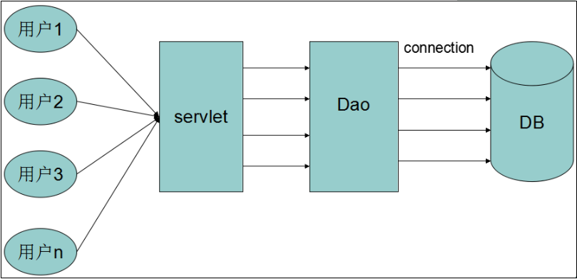
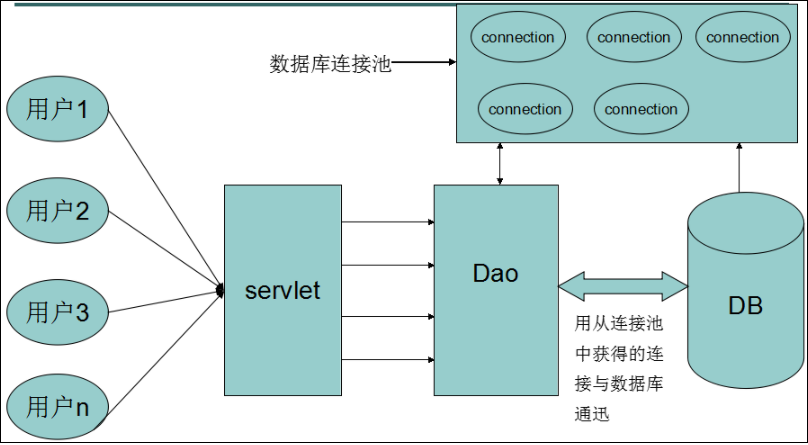
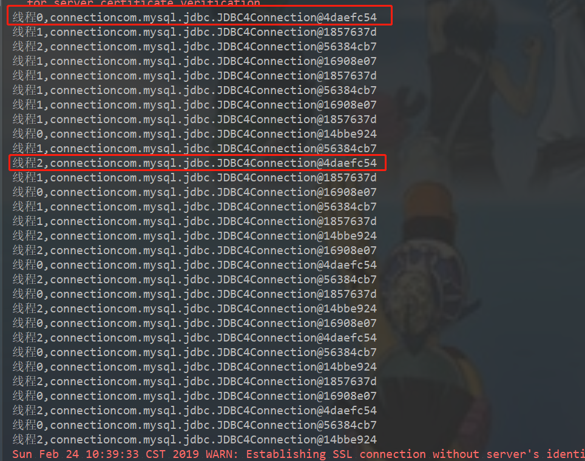

## 一、应用程序直接获取数据库连接的缺点

用户每次请求都需要向数据库获得链接，而数据库创建连接通常需要消耗相对较大的资源，创建时间也较长。假设网站一天10万访问量，数据库服务器就需要创建10万次连接，极大的浪费数据库的资源，并且极易造成数据库服务器内存溢出、拓机。如下图所示：



## 二、使用数据库连接池优化程序性能

数据库连接是一种关键的有限的昂贵的资源,这一点在多用户的网页应用程序中体现的尤为突出.对数据库连接的管理能显著影响到整个应用程序的伸缩性和健壮性,影响到程序的性能指标.数据库连接池正式针对这个问题提出来的.**数据库连接池负责分配,管理和释放数据库连接,它允许应用程序重复使用一个现有的数据库连接,而不是重新建立一个**。如下图所示：



数据库连接池在初始化时将创建一定数量的数据库连接放到连接池中, 这些数据库连接的数量是由最小数据库连接数来设定的。**无论这些数据库连接是否被使用,连接池都将一直保证至少拥有这么多的连接数量**。连接池的最大数据库连接数量限定了这个连接池能占有的最大连接数，当应用程序向连接池请求的连接数超过最大连接数量时,这些请求将被加入到等待队列中.

数据库连接池的最小连接数和最大连接数的设置要考虑到以下几个因素:

1. **最小连接数**：是连接池一直保持的数据库连接,所以如果应用程序对数据库连接的使用量不大,将会有大量的数据库连接资源被浪费.
2. **最大连接数**：是连接池能申请的最大连接数,如果数据库连接请求超过次数,后面的数据库连接请求将被加入到等待队列中,这会影响以后的数据库操作
3. 如果最小连接数与最大连接数相差很大：那么最先连接请求将会获利,之后超过最小连接数量的连接请求等价于建立一个新的数据库连接。不过，**这些大于最小连接数的数据库连接在使用完不会马上被释放,他将被放到连接池中等待重复使用或是空间超时后被释放.**

## 三、数据库池的作用

**资源重用**

由于数据库连接得到重用，避免了频繁创建、释放连接引起的大量性能开销。在减少系统消耗的基础上，增进了系统环境的平稳性（减少内存碎片以级数据库临时进程、线程的数量）

**更快的系统响应速度**

数据库连接池在初始化过程中，往往已经创建了若干数据库连接置于池内备用。此时连接池的初始化操作均已完成。对于业务请求处理而言，直接利用现有可用连接，避免了数据库连接初始化和释放过程的时间开销，从而缩减了系统整体响应时间。

**新的资源分配手段**

对于多应用共享同一数据库的系统而言，可在应用层通过数据库连接的配置，实现数据库连接技术。

**统一的连接管理，避免数据库连接泄露**

在较为完备的数据库连接池实现中，可根据预先的连接占用超时设定，强制收回被占用的连接，从而避免了常规数据库连接操作中可能出现的资源泄露

## 四、常用的数据库连接池

Druid、C3P0、DBCP、HikariCP

## 五、手写数据库连接池

### 5.1 思路分析

> **初始化**

- 连接池容器（空闲连接容器、活动连接容器）
- 根据配置文件中的初始化连接数大小，创建数据库连接

> **获取连接**

- 判断现有的连接数是否大于最大连接数，如果大于的话就等待，小于的话走下一步
- 判断空闲连接数是否大于0，大于0的话直接获取一个连接，然后放入到活动连接容器中；小于0的话那就创建新连接

> **释放连接**

- 判断空闲连接数是否小于最大空闲连接数，小于的话，将该连接回收到空闲连接容器中；大于的话就直接关闭
- 将该连接从活动容器中删除

### 5.2 准备工作

数据库配置类：

```java
package com.example.jdbcpool.config;

/**
 * @Author: 98050
 * @Time: 2019-02-23 20:59
 * @Feature:
 */
public class DbConfig {
    /**
     * 链接属性
     */
    private String driverName = "com.mysql.jdbc.Driver";

    private String url = "jdbc:mysql://localhost:3306/test2";

    private String userName = "root";

    private String password = "123456";

    /**
     * 连接池名字
     */
    private String poolName = "thread01";

    /**
     * 空闲池，最小连接数
     */
    private int minConnections = 1;

    /**
     * 空闲池，最大连接数
     */
    private int maxConnections = 10;

    /**
     * 初始化连接数
     */
    private int initConnections = 5;

    /**
     * 重复获得连接的频率
     */
    private long connTimeOut = 1000;

    /**
     * 最大允许的连接数，和数据库对应
     */
    private int maxActiveConnections = 100;

    /**
     * 连接超时时间，默认20分钟
     */
    private long connectionTimeOut = 1000 * 60 * 20;

	//省略get和set
}
```

创建数据库连接池接口：

```java
package com.example.jdbcpool;

import java.sql.Connection;
import java.sql.SQLException;

/**
 * @Author: 98050
 * @Time: 2019-02-23 21:04
 * @Feature: 数据库连接池 接口
 */
public interface MyConnectionPool {

    /**
     * 获取连接（重复利用机制）
     * @return
     * @throws InterruptedException
     */
    Connection getConnection() throws InterruptedException;

    /**
     * 释放连接（可回收机制）
     * @param connection
     * @throws SQLException
     */
    void releaseConnection(Connection connection) throws SQLException;
}
```

### 5.3 接口实现

框架：

```java
package com.example.jdbcpool;

import java.sql.Connection;
import java.sql.SQLException;

/**
 * @Author: 98050
 * @Feature:
 */
public class MyConnectionPoolImpl implements MyConnectionPool {
    
    
    public Connection getConnection() throws InterruptedException {
        return null;
    }

    public void releaseConnection(Connection connection) throws SQLException {

    }
}
```

> **容器准备**

因为要实现连接的重复利用和回收，所以要准备两个容器：空闲连接和活动连接

```java
/**
 * 使用线程安全的集合 空闲连接容器 没有被使用的连接
 */
private List<Connection> freeConnection = new Vector<Connection>();
/**
 * 使用线程安全的集合 活动连接容器 正在使用的连接
 */
private List<Connection> activeConnection = new Vector<Connection>();
```

> **计数器准备**

统计当前已经创建的可用连接数：

```java
private AtomicInteger currentConnectionNum = new AtomicInteger(0);
```

> **加载配置**

通过构造函数加载配置，并且调用init方法，对容器进行初始化

```java
public MyConnectionPoolImpl(DbConfig dbConfig) throws Exception {
    this.dbConfig = dbConfig;
    init();
}
```

> **init方法**

- 获取配置文件中设置的初试连接数
- 创建Connection连接，将创建好的连接放入空闲连接容器中

```java
/**
 * 初始化线程池
 */
public void init() throws Exception {
    if (dbConfig == null){
        throw new Exception("未配置数据库连接池");
    }
    //1.获取设置的初始连接数量
    int initConnections = dbConfig.getInitConnections();
    //2.创建Connection连接
    for (int i = 0; i < initConnections; i++) {
        Connection connection = createConnection();
        if (connection != null){
            //3.创建好的连接放入空闲连接容器中
            freeConnection.add(connection);
        }
    }
}
```

- createConnection方法

```java
private Connection createConnection() throws Exception {
    if (dbConfig == null){
        throw new Exception("未配置数据库连接池");
    }
    Class.forName(dbConfig.getDriverName());
    Connection connection = DriverManager.getConnection(dbConfig.getUrl(),dbConfig.getUserName(),dbConfig.getPassword());
    currentConnectionNum.incrementAndGet();
    return connection;
}
```

每创建一个新的连接，原子计数器就会自增

> **getConnection方法**

- 判断当前已经创建的连接数是否小于线程池所允许创建的最大连接数
  - 小于：
     - 判断空闲连接容器中是否有空闲连接，有的话直接返回一个，没有的话就新建一个连接
     - 判断获取到的连接是否可用：
        - 可用，放入活动连接池
        - 不可用，连接计数器自减，然后再重新获取连接 
  - 大于：根据配置的连接获取间隔，进行等待，然后再重新获取连接

```java
/**
 * 获取连接
 * @return
 */
public synchronized Connection getConnection() throws InterruptedException {
    Connection connection = null;
    //判断当前已创建的连接数是否小于最大连接数
    if (currentConnectionNum.intValue() < dbConfig.getMaxActiveConnections()){
        //1.小于最大连接数
        if (freeConnection.size() > 0){
            connection = freeConnection.remove(0);
        }else {
            try {
                //1.1 创建新连接
                connection = createConnection();
            } catch (Exception e) {
                e.printStackTrace();
            }
        }
        //1.2 判断连接是否可用
        boolean tag = isAvailable(connection);
        if (tag){
            //1.3 可用，放入活动连接池
            activeConnection.add(connection);
        }else {
            //1.4 不可用，重试————递归
            currentConnectionNum.decrementAndGet();
            connection = getConnection();
        }
    }else {
        //2.大于最大连接数，等待1秒，然后重新获取连接
        wait(dbConfig.getConnTimeOut());
        connection = getConnection();
    }
    return connection;
}
```

加synchronized保证线程安全，用wait和notify解决线程之间通讯问题

判断获取到的连接是否可用：

```java
private synchronized boolean isAvailable(Connection connection) {
    try {
        if (connection == null || connection.isClosed()){
            return false;
        }
    } catch (SQLException e) {
        e.printStackTrace();
    }
    return true;
}
```

> **releaseConnection方法**

首先判断当前要释放的连接是否可用，可用的话再判断当前空闲线程容器中存放的空闲连接是否小于配置的最大空闲连接数；小于的话就可以把当前连接放入空闲连接容器中等待复用，大于的话就之间将该连接关闭即可；最后将该连接从活动线程池中移除，连接计数器自减，使用notifyAll通知其它等待线程，继续获取连接。

```java
public synchronized void releaseConnection(Connection connection) throws SQLException {
    // 判断连接是否可用
    if (isAvailable(connection)){
        // 判断空闲线程是否大于最大空闲线程数
        if (freeConnection.size() < dbConfig.getMaxConnections()){
            //空闲线程没有满
            freeConnection.add(connection);
        }else {
            //空闲线程满了
            connection.close();
        }
        //从活动线程池中将该连接移除
        activeConnection.remove(connection);
        currentConnectionNum.decrementAndGet();
        notifyAll();
    }
}
```

> **创建线程池管理类**

```java
package com.example.jdbcpool;

import com.example.jdbcpool.config.DbConfig;

import java.sql.Connection;
import java.sql.SQLException;

/**
 * @Author: 98050
 * @Time: 2019-02-23 22:36
 * @Feature: 管理线程池
 */
public class MyConnectionPoolManager {

    private static DbConfig dbConfig = new DbConfig();

    private static MyConnectionPoolImpl myConnectionPool;

    static {
        try {
            myConnectionPool = new MyConnectionPoolImpl(dbConfig);
        } catch (Exception e) {
            e.printStackTrace();
        }
    }

    public static Connection getConnection() throws InterruptedException {
        return myConnectionPool.getConnection();
    }

    public static void releaseConnection(Connection connection) throws SQLException {
        myConnectionPool.releaseConnection(connection);
    }
}
```

### 5.4 测试

```java
package com.example.jdbcpool;

import java.sql.Connection;
import java.sql.SQLException;

/**
 * @Author: 98050
 * @Time: 2019-02-23 20:58
 * @Feature:
 */
public class Test {

    public static void main(String[] args) {
        for (int i = 0; i < 3; i++) {
            new Thread(new ThreadConnection(),"线程" + i).start();
        }
    }
}

class ThreadConnection implements Runnable{

    public void run() {
        for (int i = 0; i < 10; i++) {
            try {
                Connection connection = MyConnectionPoolManager.getConnection();
                System.out.println(Thread.currentThread().getName() + ",connection" + connection);
                MyConnectionPoolManager.releaseConnection(connection);
            } catch (InterruptedException e) {
                e.printStackTrace();
            } catch (SQLException e) {
                e.printStackTrace();
            }
        }
    }
}
```

结果：



### 5.5 修改

使用阻塞队列（存在问题）

```java
package com.example.jdbcpool;

import com.example.jdbcpool.config.DbConfig;

import java.sql.Connection;
import java.sql.DriverManager;
import java.sql.SQLException;
import java.util.List;
import java.util.Vector;
import java.util.concurrent.LinkedBlockingQueue;
import java.util.concurrent.TimeUnit;
import java.util.concurrent.atomic.AtomicInteger;

/**
 * @Author: 98050
 * @Time: 2019-02-23 21:08
 * @Feature: 数据库连接池实现
 */
public class MyConnectionPoolImpl2 implements MyConnectionPool {

    /**
     * 阻塞队列 空闲
     */
    private LinkedBlockingQueue<Connection> free;

    /**
     * 阻塞队列 活动
     */
    private LinkedBlockingQueue<Connection> active = new LinkedBlockingQueue<Connection>();

    private DbConfig dbConfig;

    private AtomicInteger currentConnectionNum = new AtomicInteger(0);

    public MyConnectionPoolImpl2(DbConfig dbConfig) throws Exception {
        this.dbConfig = dbConfig;
        this.free = new LinkedBlockingQueue<Connection>(dbConfig.getMaxConnections());
        init();
    }

    /**
     * 获取连接
     * @return
     */
    public Connection getConnection() throws InterruptedException {
        Connection connection = null;
        //判断当前已创建的连接数是否小于最大连接数
        if (currentConnectionNum.intValue() < dbConfig.getMaxActiveConnections()){
            //1.小于最大连接数
            if (free.size() > 0){
                connection = free.take();
            }else {
                try {
                    //1.1 创建新连接
                    connection = createConnection();
                } catch (Exception e) {
                    e.printStackTrace();
                }
            }
            //1.2 判断连接是否可用
            boolean tag = isAvailable(connection);
            if (tag){
                //1.3 可用，放入活动连接池
                active.put(connection);
            }else {
                //1.4 不可用，重试————递归
                currentConnectionNum.decrementAndGet();
                connection = free.take();
            }
        }else {
            //2.大于最大连接数，等待1秒，然后重新获取连接
            connection = getConnection();
        }
        return connection;
    }

    private  boolean isAvailable(Connection connection) {
        try {
            if (connection == null || connection.isClosed()){
                return false;
            }
        } catch (SQLException e) {
            e.printStackTrace();
        }
        return true;
    }

    public void releaseConnection(Connection connection) throws SQLException, InterruptedException {
        // 判断连接是否可用
        if (isAvailable(connection)){

            // 判断空闲线程是否大于最大空闲线程数
            if (free.size() < dbConfig.getMaxConnections()){
                //空闲线程没有满
                free.add(connection);
            }else {
                //空闲线程满了,阻塞
                free.put(connection);
            }
            //从活动线程池中将该连接移除
            active.remove(connection);
            currentConnectionNum.decrementAndGet();
        }
    }

    /**
     * 初始化线程池
     */
    public void init() throws Exception {
        if (dbConfig == null){
            throw new Exception("未配置数据库连接池");
        }
        //1.获取设置的初始连接数量
        int initConnections = dbConfig.getInitConnections();
        //2.创建Connection连接
        for (int i = 0; i < initConnections; i++) {
            Connection connection = createConnection();
            if (connection != null){
                //3.创建好的连接放入空闲连接容器中
                free.put(connection);
            }
        }
    }

    private Connection createConnection() throws Exception {
        if (dbConfig == null){
            throw new Exception("未配置数据库连接池");
        }
        Class.forName(dbConfig.getDriverName());
        Connection connection = DriverManager.getConnection(dbConfig.getUrl(),dbConfig.getUserName(),dbConfig.getPassword());
        currentConnectionNum.incrementAndGet();
        return connection;
    }
}

```

## 六、连接池配置

```
#最大连接数量：连接池在同一时间能够分配的最大活动连接的数量,如果设置为非正数则表示不限制，默认值8
maxActive=15
#最小空闲连接：连接池中容许保持空闲状态的最小连接数量，低于这个数量将创建新的连接，如果设置为0则不创建，默认值0
minIdle=5
#最大空闲连接：连接池中容许保持空闲状态的最大连接数量，超过的空闲连接将被释放，如果设置为负数表示不限制，默认值8
maxIdle=10
#初始化连接数：连接池启动时创建的初始化连接数量，默认值0
initialSize=5
#连接被泄露时是否打印
logAbandoned=true
#是否自动回收超时连接
removeAbandoned=true 
#超时时间(以秒数为单位)
removeAbandonedTimeout=180
# 最大等待时间:当没有可用连接时，连接池等待连接被归还的最大时间(以毫秒计数)，超过时间则抛出异常，如果设置为-1表示无限等待，默认值无限
maxWait=3000
#在空闲连接回收器线程运行期间休眠的时间值(以毫秒为单位).
timeBetweenEvictionRunsMillis=10000
#在每次空闲连接回收器线程(如果有)运行时检查的连接数量
numTestsPerEvictionRun=8
#连接在池中保持空闲而不被空闲连接回收器线程
minEvictableIdleTimeMillis=10000
#用来验证从连接池取出的连接
validationQuery=SELECT 1
#指明是否在从池中取出连接前进行检验
testOnBorrow=true
#testOnReturn  false  指明是否在归还到池中前进行检验
testOnReturn=true
#设置为true后如果要生效,validationQuery参数必须设置为非空字符串
testWhileIdle
```

