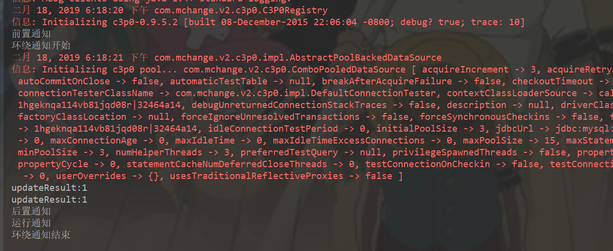
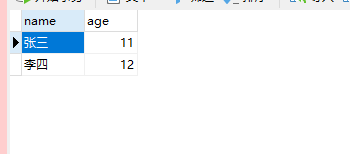
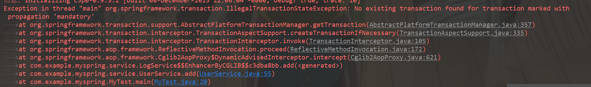
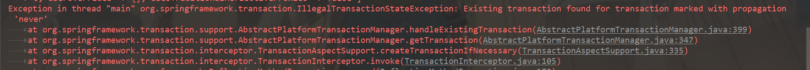
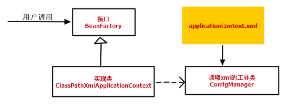
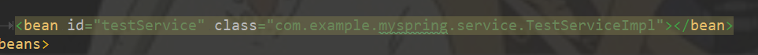
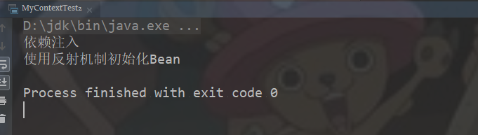

# 一、AOP编程

AOP: Aspect Oriented Programming 面向切面编程。
　　面向切面编程(也叫面向方面)：Aspect Oriented Programming(AOP),是目前软件开发中的一个热点。利用AOP可以对业务逻辑的各个部分进行隔离，从而使得业务逻辑各部分之间的耦合度降低，提高程序的可重用性，同时提高了开发的效率。
　　AOP是OOP的延续，是（Aspect Oriented Programming）的缩写，意思是面向切面（方面）编程。
　　主要的功能是：**日志记录，性能统计，安全控制，事务处理，异常处理**等等。
　　主要的意图是：将日志记录，性能统计，安全控制，事务处理，异常处理等代码从业务逻辑代码中划分出来，通过对这些行为的分离，我们希望可以将它们独立到非指导业务逻辑的方法中，进而改  变这些行为的时候不影响业务逻辑的代码。

　　可以通过预编译方式和运行期动态代理实现在不修改源代码的情况下给程序动态统一添加功能的一种技术。AOP实际是GoF设计模式的延续，设计模式孜孜不倦追求的是调用者和被调用者之间的解耦，AOP可以说也是这种目标的一种实现。

假设把应用程序想成一个立体结构的话，OOP的利刃是纵向切入系统，把系统划分为很多个模块（如：用户模块，文章模块等等），而AOP的利刃是横向切入系统，提取各个模块可能都要重复操作的部分（如：权限检查，日志记录等等）。由此可见，AOP是OOP的一个有效补充。

注意：AOP不是一种技术，实际上是编程思想。凡是符合AOP思想的技术，都可以看成是AOP的实现。

# 二、知识点

**1.通知（Advice）**

　　 切面的工作被称为通知。通知定义了切面是什么以及何时使用。除了描述切面要完成的工作， 通知还解决了何时执行这个工作的问题。它应该应用在某个方法被调 用之前？之后？之前和之后都调                    用？还是只在方法抛出异常时调用？　

Spring切面可以应用5种类型的通知：

- 前置通知（Before）：在目标方法被调用之前调用通知功能；
- 后置通知（After）：在目标方法完成之后调用通知，此时不会关 心方法的输出是什么；
- 返回通知（After-returning）：在目标方法成功执行之后调用通 知；
- 异常通知（After-throwing）：在目标方法抛出异常后调用通知；
- 环绕通知（Around）hfgjklsd：通知包裹了被通知的方法，在被通知的方 法调用之前和调用之后执行自定义的s行为。

**2.连接点（Join point）**

　　　连接点是在应用执行过程中能够插入切面的一个点。这个点可以是调用方法时、抛出异常时、甚至修改一个字段时。切面代码 可以利用这些点插入到应用的正常流程之中，并添加新的行为。

**3.切点（Poincut）**

　　　一个切面并不需要通知应用的所有连接点，切点有助于 缩小切面所通知的连接点的范围。切点的定义会匹配通知所要织入的一个或多个连接点。通常使用明确的类和方法名称，或是利用正则表达式定义所匹配的 类和方法名称来指定这些切点。

**4.切面（Aspect）**

　　切面是通知和切点的结合。通知和切点共同定义了切面的全部内容 。

**5.引入（Introduction）**

​         引入允许我们向现有的类添加新方法或属性。例如，我们可以创建一 个Auditable通知类，该类记录了对象最后一次修改时的状态。这 很简单，只需一个方法，setLastModified(Date)，和一个实例 变量来保存这个状态。然后，这个新方法和实例变量就可以被引入到 现有的类中，从而可以在无需修改这些现有的类的情况下，让它们具 有新的行为和状态。

**6.织入（Weaving）**

　　织入是把切面应用到目标对象并创建新的代理对象的过程。切面在指 定的连接点被织入到目标对象中。在目标对象的生命周期里有多个点 可以进行织入：

- 编译期：切面在目标类编译时被织入。这种方式需要特殊的编译 器。AspectJ的织入编译器就是以这种方式织入切面的。
- 类加载期：切面在目标类加载到JVM时被织入。这种方式需要特 殊的类加载器（ClassLoader），它可以在目标类被引入应用 之前增强该目标类的字节码。AspectJ 5的加载时织入                                         （load-time weaving，LTW）就支持以这种方式织入切面。
- 运行期：切面在应用运行的某个时刻被织入。一般情况下，在织 入切面时，AOP容器会为目标对象动态地创建一个代理对象。 Spring AOP就是以这种方式织入切面的。 

# 三、AOP底层实现原理

代理设计模式

### 3.1 静态代理

由程序员创建或工具生成代理类的源码，再编译代理类。所谓静态也就是在程序运行前就已经存在代理类的字节码文件，代理类和委托类的关系在运行前就确定了。

```java
package com.design.pattern.proxy;

/**
 * @Author: 98050
 * @Time: 2019-02-17 22:03
 * @Feature:
 */
public interface UserService {

    void add();
}
```

```java
package com.design.pattern.proxy;

/**
 * @Author: 98050
 * @Time: 2019-02-17 22:04
 * @Feature:
 */
public class UserServiceImpl implements UserService {

    @Override
    public void add() {
        System.out.println("添加数据");
    }
}
```

```java
package com.design.pattern.proxy;

/**
 * @Author: 98050
 * @Time: 2019-02-17 22:05
 * @Feature:
 */
public class UserServiceProxy {

    private UserService service;

    public UserServiceProxy(UserService service) {
        this.service = service;
    }

    public void add(){
        System.out.println("静态代理：开启事务");
        service.add();
        System.out.println("静态代理：提交事务");
    }
}
```

```java
package com.design.pattern.proxy;

import java.lang.reflect.Proxy;

/**
 * @Author: 98050
 * @Time: 2019-02-17 22:07
 * @Feature:
 */
public class Test {

    public static void main(String[] args) {
        /**
         * 静态代理
         */
        UserService userService = new UserServiceImpl();
        UserServiceProxy userServiceProxy = new UserServiceProxy(userService);
        userServiceProxy.add();
    }
}
```

### 3.2 动态代理

#### 3.2.1 JDK动态代理

```java
package com.design.pattern.proxy;

import java.lang.reflect.InvocationHandler;
import java.lang.reflect.Method;

/**
 * @Author: 98050
 * @Time: 2019-02-17 22:22
 * @Feature: JDK动态代理
 */
public class InvocationHandlerImpl implements InvocationHandler {

    private Object target;

    public InvocationHandlerImpl(Object target) {
        this.target = target;
    }

    @Override
    public Object invoke(Object proxy, Method method, Object[] args) throws Throwable {
        Object result = null;
        System.out.println("JDK动态代理 开启事务");
        result = method.invoke(target,args);
        System.out.println("JDK动态代理 提交事务");
        return result;
    }
}
```

```java
package com.design.pattern.proxy;

import java.lang.reflect.Proxy;

/**
 * @Author: 98050
 * @Time: 2019-02-17 22:07
 * @Feature:
 */
public class Test {

    public static void main(String[] args) {
       UserService userService = new UserServiceImpl();
        /**
         * 动态代理
         */
        InvocationHandlerImpl invocationHandler = new InvocationHandlerImpl(userService);
        ClassLoader loader = userService.getClass().getClassLoader();
        Class<?>[] interfaces = userService.getClass().getInterfaces();
        UserService newProxy = (UserService) Proxy.newProxyInstance(loader, interfaces, invocationHandler);
        newProxy.add();
    }
}
```

1)原理：是根据类加载器和接口创建代理类（此代理类是接口的实现类，所以必须使用接口 面向接口生成代理，位于java.lang.reflect包下） 

2)实现方式： 

- 通过实现InvocationHandler接口创建自己的调用处理器 IvocationHandler handler = new InvocationHandlerImpl(…); 
- 通过为Proxy类指定ClassLoader对象和一组interface创建动态代理类Class clazz = Proxy.getProxyClass(classLoader,new Class[]{…}); 
- 通过反射机制获取动态代理类的构造函数，其参数类型是调用处理器接口类型Constructor constructor = clazz.getConstructor(new Class[]{InvocationHandler.class}); 
- 通过构造函数创建代理类实例，此时需将调用处理器对象作为参数被传入Interface Proxy = (Interface)constructor.newInstance(new Object[] (handler));

初试科目

录取情况分析


#### 3.2.2 CGLIB动态代理

```java
package com.design.pattern.proxy;

import org.mockito.cglib.proxy.Enhancer;
import org.mockito.cglib.proxy.MethodInterceptor;
import org.mockito.cglib.proxy.MethodProxy;

import java.lang.reflect.Method;

/**
 * @Author: 98050
 * @Time: 2019-02-17 22:28
 * @Feature: CGLIB动态代理
 */
public class CglibProxy implements MethodInterceptor {

    /**
     * 这里的目标类型为Object，则可以接受任意一种参数作为被代理类，实现了动态代理
     */
    private Object targetObject;

    public Object getInstance(Object target) {
        // 设置需要创建子类的类
        this.targetObject = target;
        Enhancer enhancer = new Enhancer();
        enhancer.setSuperclass(target.getClass());
        enhancer.setCallback(this);
        return enhancer.create();
    }

    @Override
    public Object intercept(Object o, Method method, Object[] objects, MethodProxy methodProxy) throws Throwable {
        System.out.println("CGLIB动态代理开启事务");
        Object result = methodProxy.invoke(targetObject, objects);
        System.out.println("CGLIB动态代理提交事务");
        // 返回代理对象
        return result;
    }
}
```

```java
package com.design.pattern.proxy;

import java.lang.reflect.Proxy;

/**
 * @Author: 98050
 * @Time: 2019-02-17 22:07
 * @Feature:
 */
public class Test {

    public static void main(String[] args) {
        /**
         * CGLIB动态代理
         */
        CglibProxy cglibProxy = new CglibProxy();
        UserService userService1 = (UserService) cglibProxy.getInstance(new UserServiceImpl());
        userService1.add();
    }
}
```

# 四、AOP编程使用

### 4.1 搭建Spring框架

#### 4.1.1 spring.xml

```xml
<?xml version="1.0" encoding="UTF-8"?>
<beans xmlns="http://www.springframework.org/schema/beans"
      xmlns:xsi="http://www.w3.org/2001/XMLSchema-instance" xmlns:p="http://www.springframework.org/schema/p"
      xmlns:context="http://www.springframework.org/schema/context"
      xmlns:aop="http://www.springframework.org/schema/aop"
      xsi:schemaLocation="
        http://www.springframework.org/schema/beans
        http://www.springframework.org/schema/beans/spring-beans.xsd
        http://www.springframework.org/schema/context
        http://www.springframework.org/schema/context/spring-context.xsd
        http://www.springframework.org/schema/aop
        http://www.springframework.org/schema/aop/spring-aop.xsd ">
   <context:component-scan base-package="com.example"></context:component-scan>
   <aop:aspectj-autoproxy></aop:aspectj-autoproxy> <!-- 开启事物注解 -->

   <!-- 1. 数据源对象: C3P0连接池 -->
   <bean id="dataSource" class="com.mchange.v2.c3p0.ComboPooledDataSource">
      <property name="driverClass" value="com.mysql.jdbc.Driver"></property>
      <property name="jdbcUrl" value="jdbc:mysql://localhost:3306/test2"></property>
      <property name="user" value="root"></property>
      <property name="password" value="123456"></property>
   </bean>

   <!-- 2. JdbcTemplate工具类实例 -->
   <bean id="jdbcTemplate" class="org.springframework.jdbc.core.JdbcTemplate">
      <property name="dataSource" ref="dataSource"></property>
   </bean>

</beans>
```

#### 4.1.2 DAO层

```java
package com.example.myspring.dao;

import org.springframework.beans.factory.annotation.Autowired;
import org.springframework.jdbc.core.JdbcTemplate;
import org.springframework.stereotype.Repository;

/**
 * @Author: 98050
 * @Time: 2019-02-18 17:36
 * @Feature:
 */
@Repository
public class UserDao {

    @Autowired
    private JdbcTemplate jdbcTemplate;

    public void add(String name,Integer age){
        String sql = "INSERT INTO t_users(NAME, age) VALUES(?,?);";
        int updateResult = jdbcTemplate.update(sql, name, age);
        System.out.println("updateResult:" + updateResult);
    }
}
```

#### 4.1.3 Service层

```java
package com.example.myspring.service;

import com.example.myspring.dao.UserDao;
import org.springframework.beans.factory.annotation.Autowired;
import org.springframework.stereotype.Service;

/**
 * @Author: 98050
 * @Time: 2019-02-18 17:34
 * @Feature:
 */
@Service
public class UserService {

    @Autowired
    private UserDao userDao;


    public void add(){
        userDao.add("张三", 11);
        userDao.add("李四", 12);
    }
}
```

### 4.2 切面

```java
package com.example.myspring.aop;

import org.aspectj.lang.ProceedingJoinPoint;
import org.aspectj.lang.annotation.*;
import org.springframework.stereotype.Component;

/**
 * @Author: 98050
 * @Time: 2019-02-18 17:32
 * @Feature: 日志切面
 */
@Component
@Aspect
public class AopLog {

    /**
     *   前置通知
      */
   @Before("execution(* com.example.myspring.service.UserService.add(..))")
   public void begin() {
      System.out.println("前置通知");
   }

    /**
     * 后置通知
      */
   @After("execution(* com.example.myspring.service.UserService.add(..))")
   public void commit() {
      System.out.println("后置通知");
   }

    /**
     * 运行通知
     */
   @AfterReturning("execution(* com.example.myspring.service.UserService.add(..))")
   public void returning() {
      System.out.println("运行通知");
   }

    /**
     * 异常通知
     */
   @AfterThrowing("execution(* com.example.myspring.service.UserService.add(..))")
   public void afterThrowing() {
      System.out.println("异常通知");
   }

    /**
     * 环绕通知
     * @param proceedingJoinPoint
     * @throws Throwable
     */
   @Around("execution(* com.example.myspring.service.UserService.add(..))")
   public void around(ProceedingJoinPoint proceedingJoinPoint) throws Throwable {
      System.out.println("环绕通知开始");
      proceedingJoinPoint.proceed();
      System.out.println("环绕通知结束");
   }
}
```

切点就是UserService中的add方法。

在环绕通知中，如果代理方法发生异常，那么后面的代码就不会执行。

### 4.3 测试

```java
package com.example.myspring;

import com.example.myspring.service.UserService;
import org.springframework.context.support.ClassPathXmlApplicationContext;


/**
 * @Author: 98050
 * @Time: 2019-02-18 17:31
 * @Feature:
 */
public class MyTest {


    public static void main(String[] args) {
        ClassPathXmlApplicationContext applicationContext = new ClassPathXmlApplicationContext("spring.xml");
        UserService userService = (UserService) applicationContext.getBean("userService");
        userService.add();
    }
}
```



数据库中



# 五、Spring事务

### **5.1 编程式事务控制**

​	自己手动控制事务，就叫做编程式事务控制。

​	Jdbc代码：

​		Conn.setAutoCommite(false);  // 设置手动控制事务

​	Hibernate代码：

​		Session.beginTransaction();    // 开启一个事务

​	【细粒度的事务控制： 可以对指定的方法、指定的方法的某几行添加事务控制】

​	(比较灵活，但开发起来比较繁琐： 每次都要开启、提交、回滚.)

### **5.2 声明式事务控制**（注解方式）

​	Spring提供了对事务的管理, 这个就叫声明式事务管理。

​	Spring提供了对事务控制的实现。用户如果想用Spring的声明式事务管理，只需要在配置文件中配置即可； 不想使用时直接移除配置。这个实现了对事务控制的最大程度的解耦。

​	Spring声明式事务管理，核心实现就是基于Aop。

​	【粗粒度的事务控制： 只能给整个方法应用事务，不可以对方法的某几行应用事务。】

​	(因为aop拦截的是方法。)

​	Spring声明式事务管理器类：

​	Jdbc技术：DataSourceTransactionManager

​	Hibernate技术：HibernateTransactionManager

# 六、手写Spring事务框架

### 6.1 编程式事务实现

所谓编程式事务指的是通过编码方式实现事务，即类似于JDBC编程实现事务管理。管理使用TransactionTemplate或者直接使用底层的PlatformTransactionManager。对于编程式事务管理，spring推荐使用TransactionTemplate。

使用编程事务实现，手动事务 begin、commit、rollback

```java
package com.example.myspring.transaction;

import org.springframework.beans.factory.annotation.Autowired;
import org.springframework.jdbc.datasource.DataSourceTransactionManager;
import org.springframework.stereotype.Component;
import org.springframework.transaction.TransactionStatus;
import org.springframework.transaction.support.DefaultTransactionDefinition;

/**
 * @Author: 98050
 * @Time: 2019-02-18 19:24
 * @Feature:
 */
@Component
public class TransactionUtils {

    /**
     * 获取事务
     */
    @Autowired
    private DataSourceTransactionManager dataSourceTransactionManager;

    /**
     * 开启事务
     * @return
     */
    public TransactionStatus begin(){
        return dataSourceTransactionManager.getTransaction(new DefaultTransactionDefinition());
    }

    /**
     * 提交事务
     */
    public void commit(TransactionStatus transactionStatus){
        dataSourceTransactionManager.commit(transactionStatus);
    }

    /**
     * 回滚事务
     */
    public void rollback(TransactionStatus transactionStatus){
        dataSourceTransactionManager.rollback(transactionStatus);
    }

}
```

修改UserService中的add方法

```java
public void add(){
    TransactionStatus transactionStatus = null;
    try{
        //开启事务
        transactionStatus = transactionUtils.begin();
        userDao.add("张三", 11);
        //int i = 1 / 0;
        userDao.add("李四", 12);
        if (transactionStatus != null) {
            //提交事务
            transactionUtils.commit(transactionStatus);
        }
    }catch (Exception e){
        System.out.println(e.getMessage());
        if (transactionStatus != null){
            //事务回滚
            transactionUtils.rollback(transactionStatus);
        }
    }
}
```

### 6.2 AOP技术封装编程式事务

使用环绕通知和异常通知对编程式事务进行封装

```java
package com.example.myspring.aop;

import com.example.myspring.transaction.TransactionUtils;
import org.aspectj.lang.ProceedingJoinPoint;
import org.aspectj.lang.annotation.AfterThrowing;
import org.aspectj.lang.annotation.Around;
import org.aspectj.lang.annotation.Aspect;
import org.springframework.beans.factory.annotation.Autowired;
import org.springframework.stereotype.Component;
import org.springframework.transaction.TransactionStatus;
import org.springframework.transaction.interceptor.TransactionAspectSupport;

/**
 * @Author: 98050
 * @Time: 2019-02-18 19:46
 * @Feature:
 */
@Component
@Aspect
public class AopTransaction {

    @Autowired
    private TransactionUtils transactionUtils;

    /**
     * 环绕通知
     * @param proceedingJoinPoint
     * @throws Throwable
     */
    @Around("execution(* com.example.myspring.service.UserService.add(..))")
    public void around(ProceedingJoinPoint proceedingJoinPoint) throws Throwable {
        System.out.println("环绕通知开启事务");
        TransactionStatus transactionStatus = transactionUtils.begin();
        proceedingJoinPoint.proceed();
        System.out.println("环绕通知提交事务");
        transactionUtils.commit(transactionStatus);
    }
    /**
     * 异常通知
     */
   @AfterThrowing("execution(* com.example.myspring.service.UserService.add(..))")
   public void afterThrowing() {
      System.out.println("回滚事务");
      //获取当前事务直接回滚
        TransactionAspectSupport.currentTransactionStatus().setRollbackOnly();
   }
}
```

修改UserService中的add方法：

```java
public void add(){
    //将异常抛出给外层aop
    userDao.add("张三", 11);
    //int i = 1 / 0;
    userDao.add("李四", 12);
}
```

**注：不能使用try捕获异常，必须将异常抛出给外层的AOP进行处理**

**改进**：TransactionUtils不要实现为单例模式（Spring依赖注入使用**双重判断加锁** 的单例模式），可能会发生线程安全问题，避免本线程提交其它线程的事务。在TransactionUtils上加`@Scope("prototype")`注解。

------

**注意事项：**

事务是程序运行如果没有错误,会自动提交事物,如果程序运行发生异常,则会自动回滚。 

如果使用了try捕获异常时.一定要在catch里面手动回滚。

事务手动回滚代码

# 七、注解

Jdk1.5新增新技术，注解。很多框架为了简化代码，都会提供有些注解。可以理解为插件，是代码级别的插件，在类的方法上写：@XXX，就是在代码上插入了一个插件。

注解不会也不能影响代码的实际逻辑，仅仅起到辅助性的作用。

注解分类：内置注解（也称为元注解，JDK自带注解）、自定义注解（Spring框架）

### 7.1 内置注解

（1） @SuppressWarnings   再程序前面加上可以在javac编译中去除警告--阶段是SOURCE
（2） @Deprecated   带有标记的包，方法，字段说明其过时----阶段是SOURCE
（3）@Override   打上这个标记说明该方法是将父类的方法重写--阶段是SOURCE

### 7.2 自定义注解

元注解的作用就是负责注解其他注解。Java5.0定义了4个标准的meta-annotation类型，它们被用来提供对其它 annotation类型作说明。

#### 7.2.1 @Target

@Target说明了Annotation所修饰的对象范围：Annotation可被用于 packages、types（类、接口、枚举、Annotation类型）、类型成员（方法、构造方法、成员变量、枚举值）、方法参数和本地变量（如循环变量、catch参数）。在Annotation类型的声明中使用了target可更加明晰其修饰的目标。

1. CONSTRUCTOR:用于描述构造器

2. FIELD:用于描述域

3. LOCAL_VARIABLE:用于描述局部变量

4. METHOD:用于描述方法

5. PACKAGE:用于描述包

6. PARAMETER:用于描述参数

7. TYPE:用于描述类、接口(包括注解类型) 或enum声明

#### 7.2.2 @Retention

表示需要在什么级别保存该注释信息，用于描述注解的生命周期（即：被描述的注解在什么范围内有效）

- RetentionPolicy.SOURCE —— 这种类型的Annotations只在源代码级别保留,编译时就会被忽略 
- RetentionPolicy.CLASS —— 这种类型的Annotations编译时被保留,在class文件中存在,但JVM将会忽略 
- RetentionPolicy.RUNTIME —— 这种类型的Annotations将被JVM保留,所以他们能在运行时被JVM或其他使用反射机制的代码所读取和使用.

#### 7.2.3 @Documented

Documented 注解表明这个注解应该被 javadoc工具记录. 默认情况下,javadoc是不包括注解的.

#### 7.2.4 @Inherited

使用@interface 定义注解。

# 八、手写Spring事务注解

自定义注解，实现类似@Transactional一样的功能

### 8.1 思路

- 定义事务注解
- 封装编程事务
- AOP拦截方法，使用反射机制判断方法上是否有事务注解，然后再决定事务是否开启

### 8.2 实现

#### 8.2.1 定义事务注解

```java
package com.example.myspring.myannotation;

import java.lang.annotation.*;

/**
 * @Author: 98050
 * @Time: 2019-02-19 15:07
 * @Feature: 自定义事务注解：设置传播行为
 */
@Target({ElementType.METHOD, ElementType.TYPE})
@Retention(RetentionPolicy.RUNTIME)
@Inherited
@Documented
public @interface MyTransactionAnnotation {
}
```

#### 8.2.2 封装编程事务

```java
package com.example.myspring.transaction;

import org.springframework.beans.factory.annotation.Autowired;
import org.springframework.context.annotation.Scope;
import org.springframework.jdbc.datasource.DataSourceTransactionManager;
import org.springframework.stereotype.Component;
import org.springframework.transaction.TransactionStatus;
import org.springframework.transaction.support.DefaultTransactionDefinition;

/**
 * @Author: 98050
 * @Time: 2019-02-18 19:24
 * @Feature:
 */
@Component
/**
 *  每个事务都是新的实例，解决transactionStatus线程不安全问题  一个实例提交一个事务
 */
@Scope("prototype")
public class TransactionUtils {

    /**
     * 获取事务
     */
    @Autowired
    private DataSourceTransactionManager dataSourceTransactionManager;

    /**
     * 全局事务状态
     */
    private TransactionStatus transactionStatus;

    /**
     * 开启事务
     * @return
     */
    public TransactionStatus begin(){
        System.out.println("开启事务");
        transactionStatus = dataSourceTransactionManager.getTransaction(new DefaultTransactionDefinition());
        return transactionStatus;
    }

    /**
     * 提交事务
     */
    public void commit(TransactionStatus transactionStatus){
        System.out.println("提交事务");
        dataSourceTransactionManager.commit(transactionStatus);
    }

    /**
     * 回滚事务
     */
    public void rollback(){
        System.out.println("回滚事务");
        dataSourceTransactionManager.rollback(transactionStatus);
    }

}
```

**注意：将TransactionUtils实现方式改为原型模式（多例，Spring默认单例），保证线程安全**

#### 8.2.3 AOP

```java
package com.example.myspring.aop;

import com.example.myspring.myannotation.MyTransactionAnnotation;
import com.example.myspring.transaction.TransactionUtils;
import org.aspectj.lang.ProceedingJoinPoint;
import org.aspectj.lang.annotation.AfterThrowing;
import org.aspectj.lang.annotation.Around;
import org.aspectj.lang.annotation.Aspect;
import org.aspectj.lang.reflect.MethodSignature;
import org.springframework.beans.factory.annotation.Autowired;
import org.springframework.stereotype.Component;
import org.springframework.transaction.TransactionStatus;
import org.springframework.transaction.interceptor.TransactionAspectSupport;

import java.lang.annotation.Annotation;
import java.lang.reflect.Method;

/**
 * @Author: 98050
 * @Time: 2019-02-19 15:54
 * @Feature:
 */
@Component
@Aspect
public class MyTransactionAnnotationAOP {

    @Autowired
    private TransactionUtils transactionUtils;

    /**
     * 异常通知
     */
   @AfterThrowing("execution(* com.example.myspring.service.*.*(..))")
   public void afterThrowing() {
      //获取当前事务直接回滚
//        TransactionAspectSupport.currentTransactionStatus().setRollbackOnly();
        //判断下异常方法是否有事务注解，如果有就进行事务回滚
        transactionUtils.rollback();
   }

    /**
     * 环绕通知
     * @param proceedingJoinPoint
     * @throws Throwable
     */
    @Around("execution(* com.example.myspring.service.*.*(..))")
    public void around(ProceedingJoinPoint proceedingJoinPoint) throws Throwable {
        TransactionStatus transactionStatus = null;
        
        //1.判断方法上是否有事务注解
        Annotation declaredAnnotation = getMethodTransactionAnnotation(proceedingJoinPoint);
        //2.开启事务
        transactionStatus = begin(declaredAnnotation);
        //3.调用目标代理对象
        proceedingJoinPoint.proceed();
        //4.提交事务
        commit(transactionStatus);
    }

    private void commit(TransactionStatus transactionStatus) {
        if (transactionStatus != null){
            transactionUtils.commit(transactionStatus);
        }
    }

    private TransactionStatus begin(Annotation declaredAnnotation) {
        if (declaredAnnotation == null){
            return null;
        }
        return  transactionUtils.begin();
    }

    /**
     * 获取事务注解，使用反射机制
     * @param proceedingJoinPoint
     * @return
     * @throws NoSuchMethodException
     */
    private Annotation getMethodTransactionAnnotation(ProceedingJoinPoint proceedingJoinPoint) throws NoSuchMethodException {
        //1.1 获取方法名
        String methodName = proceedingJoinPoint.getSignature().getName();
        //1.2 获取目标对象
        Class<?> targetClass = proceedingJoinPoint.getTarget().getClass();
        //1.3 获取目标对象类型
        Class<?>[] parameter = ((MethodSignature)proceedingJoinPoint.getSignature()).getParameterTypes();
        //1.4 获取目标对象方法
        Method method = targetClass.getMethod(methodName,parameter);
        return method.getDeclaredAnnotation(MyTransactionAnnotation.class);
    }
}
```

### 8.3 测试

修改UserService中的add方法，添加自定义注解：

```java
@MyTransactionAnnotation
public void add(){
    userDao.add("张三", 11);
    //int i = 1 / 0;
    userDao.add("李四", 12);
}
```

去掉注释的话，产生异常，事务回滚~

# 九、Spring事务传播行为

### 9.1 基本概念

**Spring在TransactionDefinition接口中规定了7种类型的事务传播行为，它们规定了事务方法和事务方法发生嵌套调用时事务如何进行传播,即协调已经有事务标识的方法之间的发生调用时的事务上下文的规则（是否要有独立的事务隔离级别和锁）**

Spring中事务的定义：

Propagation（key属性确定代理应该给哪个方法增加事务行为。这样的属性最重要的部份是传播行为。）有以下选项可供使用：

- PROPAGATION_REQUIRED：如果当前有事务，就用当前事务，如果当前没有事务，就新建一个事务。这是最常见的选择。
- PROPAGATION_SUPPORTS：支持当前事务，如果当前没有事务，就以非事务方式执行。
- PROPAGATION_MANDATORY：支持当前事务，如果当前没有事务，就抛出异常。 
- PROPAGATION_REQUIRES_NEW：新建事务，如果当前存在事务，把当前事务挂起。 
- PROPAGATION_NOT_SUPPORTED：以非事务方式执行操作，如果当前存在事务，就把当前事务挂起。
- PROPAGATION_NEVER：以非事务方式执行，如果当前存在事务，则抛出异常。
- PROPAGATION_NESTED：如果当前存在事务，则在嵌套事务内执行。如果当前没有事务，则执行与PROPAGATION_REQUIRED类似的操作。

### 9.2 测试

前提说明：

两个Service：UserService和LogService（负责日志打印），在UserService的add方法中调用LogService的add方法，产生事务嵌套调用。

在UserService中的add方法上设置`@Transactional`

```java
@Transactional
public void add(){
    logService.add();
    //将异常抛出给外层aop
    userDao.add("张三", 11);
    int i = 1 / 0;
    userDao.add("李四", 12);
}
```

#### 9.2.1 REQUIRED

在LogService中的add方法上设置`@Transactional(propagation = Propagation.REQUIRED)`

```java
@Transactional(propagation = Propagation.REQUIRED)
public void add(){
    logDao.add("log_name", "log_info");
}
```

此时执行测试，那么此时发生错误，全部执行回滚，导致日志无法插入，此时logService.add使用的是外层add方法上的事务。

#### 9.2.2 REQUIRES_NEW

```java
@Transactional(propagation = Propagation.REQUIRES_NEW)
public void add(){
    logDao.add("log_name", "log_info");
}
```

此时执行，日志可以顺利插入，但是userDao会回滚。

#### 9.2.3 SUPPORTS

```java
@Transactional(propagation = Propagation.SUPPORTS)
public void add(){
    logDao.add("log_name", "log_info");
}
```

执行测试，数据全部回滚；如果去掉UserService中add方法上的`@Transactional`注解，那么add就会以非事务的方式执行。

#### 9.2.4 NOT_SUPPORTED

```java
@Transactional(propagation = Propagation.NOT_SUPPORTED)
public void add(){
    logDao.add("log_name", "log_info");
    int i = 1 / 0;
}
```

执行测试，日志会插入

#### 9.2.5 MANDATORY

```java
@Transactional(propagation = Propagation.MANDATORY)
public void add(){
    logDao.add("log_name", "log_info");
}
```

如果UserService中的add方法上不设置`@Transactional`，就会报异常



#### 9.2.6 NEVER

与MANDATORY刚好相反



#### 9.2.7 NESTED

```java
@Transactional(propagation = Propagation.NESTED)
public void add(){
    logDao.add("log_name", "log_info");
}
```

# 十、Spring事务隔离级别

ISOLATION_DEFAULT 这是一个PlatfromTransactionManager默认的隔离级别，使用数据库默认的事务隔离级别，另外四个与JDBC的隔离级别相对应。

**ISOLATION_READ_UNCOMMITTED** 
这是事务最低的隔离级别，它充许别外一个事务可以看到这个事务未提交的数据。 
这种隔离级别会产生脏读，不可重复读和幻像读。

**ISOLATION_READ_COMMITTED** 
保证一个事务修改的数据提交后才能被另外一个事务读取。另外一个事务不能读取该事务未提交的数据。 
这种事务隔离级别可以避免脏读出现，但是可能会出现不可重复读和幻像读。

**ISOLATION_REPEATABLE_READ** 
这种事务隔离级别可以防止脏读，不可重复读。但是可能出现幻像读。 
它除了保证一个事务不能读取另一个事务未提交的数据外，还保证了避免下面的情况产生(不可重复读)。

**ISOLATION_SERIALIZABLE** 
这是花费最高代价但是最可靠的事务隔离级别。事务被处理为顺序执行。 

除了防止脏读，不可重复读外，还避免了幻像读。

# 十一、手写Spring IOC容器

Spring IOC指的是控制反转，IOC容器负责实例化、定位、配置应用程序中的对象及建立这些对象间的依赖。交由Spring来管理这些，实现解耦

```java
public static void main(String[] args) {
        ClassPathXmlApplicationContext applicationContext = new ClassPathXmlApplicationContext("spring.xml");
        UserService userService = (UserService) applicationContext.getBean("userService");
        userService.add();
    }
```

这是Spring原生的IOC容器，通过一个图理解一下：



- 程序中所有的Bean之间的依赖关系是放在一个xml文件中进行维护的,就是**applicationContext.xml**　　

- **ConfigManager**类完成的功能是读取xml，并将所有读取到有用的信息封装到我们创建的一个Map<String,Bean>集合中,用来在初始化容器时创建bean对象.

- 定义一个**BeanFactory**的接口,接口中有一个getBean(String name)方法,用来返回你想要创建的那个对象。

- 然后定义一个该接口的实现类**ClassPathXmlApplicationContext**.就是在这个类的构造方法中,初始化容器,通过调用ConfigManager的方法返回的Map集合，通过反射和内省一一创建bean对象。

  这里需要注意,对象的创建有两个时间点,这取决与bean标签中scope属性的值:

  - 　**如果scope="singleton",那么对象在容器初始化时就已创建好,用的时候只需要去容器中取即可.**
  - 　**如果scope="prototype",那么容器中不保存这个bean的实例对象,每次开发者需要使用这个对象时再进行创建.**

### 11.1 XML版本

#### 11.1.1 思路分析

**步骤：**

- 解析spring的配置文件
- 根据传入的beanId查找配置文件中是否存在与其一致的bean
- 如果有，通过class属性获取到类的具体位置，然后使用Java反射机制进行类的初始化

#### 11.1.2 实现

```java
package com.example.myspring.ioc;

import org.apache.commons.lang.StringUtils;
import org.dom4j.Document;
import org.dom4j.Element;
import org.dom4j.io.SAXReader;

import java.io.InputStream;
import java.util.List;

/**
 * @Author: 98050
 * @Time: 2019-02-20 16:23
 * @Feature: 上下文加载器
 */
public class MyClassPathXmlApplicationContext {

    //1.解析xml
    //2.使用方法参数bean的id查找配置文件中是否存在与其一致的bean
    //3.获取class信息地址，使用反射机制进行类的初始化
    private String xmlPath;

    public MyClassPathXmlApplicationContext(String xmlPath) {
        this.xmlPath = xmlPath;
    }

    public Object getBean(String beanId) throws Exception {
        //1.读取配置文件，获取配置文件中的子元素（bean）
        List<Element> elements = readXml();
        if (elements == null){
            throw new Exception("没有配置bean");
        }
        //2.根据传入的beanId进行匹配，查找bean的地址
        String beanClassPath = findBeanClassPath(elements,beanId);
        if (StringUtils.isEmpty(beanClassPath)){
            throw new Exception("未设置class路径");
        }
        //3.使用反射机制进行初始化
        return getBeanClass(beanClassPath);
    }

    private Object getBeanClass(String beanClassPath) throws ClassNotFoundException, IllegalAccessException, InstantiationException {
        Class<?> name = Class.forName(beanClassPath);
        return name.newInstance();
    }

    private String findBeanClassPath(List<Element> elements, String beanId) throws Exception {
        for (Element element : elements){
            String value = element.attributeValue("id");
            if (value != null && value.equals(beanId)){
                String path = element.attributeValue("class");
                if (!StringUtils.isEmpty(path)){
                    return path;
                }
            }
        }
        return null;
    }

    private List<Element> readXml() throws Exception {
        SAXReader saxReader = new SAXReader();
        if (StringUtils.isEmpty(xmlPath)){
            throw new Exception("xml路径为空");
        }
        Document read = saxReader.read(getXmlPath(xmlPath));
        //1.获取根节点的信息
        Element root = read.getRootElement();
        //2.获取根节点下的所有子节点
        List<Element> list = root.elements();
        if (list == null || list.isEmpty()){
            return null;
        }
        return list;
    }

    private InputStream getXmlPath(String name) {
        return this.getClass().getClassLoader().getResourceAsStream(name);
    }
}
```

- 通过构造函数获取到spring配置文件的名字
- 在readXml方法中进行xml文件的解析，将xml文件中所有的子元素放入到list中返回
- 当拿到所有的子元素后，根据传入的beanId进行匹配，找到具体的类路径，在findBeanClassPath方法中完成
- 获取到类的具体地址后，使用Java反射机制对类进行初始化，在getBeanClass中完成

#### 11.1.3 测试

spring.xml中配置bean：



bean实现：

```java
package com.example.myspring.service;

import com.example.myspring.myannotation.MyResourceAnnotation;
import com.example.myspring.myannotation.MyServiceAnnotation;

/**
 * @Author: 98050
 * @Time: 2019-02-20 16:54
 * @Feature:
 */
public class TestServiceImpl implements TestService {
    @Override
    public void add(){
        System.out.println("使用反射机制初始化Bean");
    }
}
```

测试：

```java
package com.example.myspring;

import com.example.myspring.ioc.MyClassPathXmlApplicationContext;
import com.example.myspring.service.TestServiceImpl;

/**
 * @Author: 98050
 * @Time: 2019-02-20 16:54
 * @Feature:
 */
public class MyContextTest {

    public static void main(String[] args) throws Exception {
        MyClassPathXmlApplicationContext myClassPathXmlApplicationContext = new MyClassPathXmlApplicationContext("spring.xml");
        TestServiceImpl service = (TestServiceImpl) myClassPathXmlApplicationContext.getBean("testService");
        service.add();
    }
}
```

结果：


#### 11.1.4 总结

XML版本的IOC容器思路比较简单，实现起来也不是太复杂，这里面没有实现依赖注入，即在XML文件中配置类的属性，其实原理还是一样的，到匹配到对应的子元素后，再将其包含的子元素（属性）扫描到，根据Java反射机制实现依赖注入。具体实现在注解版本中完成。

### 11.2 注解版本

在Service层上的类加上注解后，就可以获取到该类的实例，参考`@Service`

#### 11.2.1 思路分析

步骤：

- 定义注解
- 将包名当作参数传入，然后使用Java反射机制进行扫包，获取当前包下所有类
- 对类进行过滤，判断类上是否有自定义注解
- 有的话就进行初始化，将初始化后的类放入一个bean容器中（map），单例模式
- 然后再对容器中的bean进行依赖注入

注意：

Spring通过解析XML文件中的`<context:component-scan base-package="com.example" />`

来支持注解的使用，为了方便就不去解析XML文件了，直接将扫包范围当作参数传入。

#### 11.2.2 实现

> **定义注解**

类比@Service

```java
package com.example.myspring.myannotation;

import java.lang.annotation.*;

/**
 * @Author: 98050
 * @Time: 2019-02-20 17:19
 * @Feature:
 */
@Target(ElementType.TYPE)
@Retention(RetentionPolicy.RUNTIME)
@Inherited
@Documented
public @interface MyServiceAnnotation {
}
```

类比@Resource，实现依赖注入

```java
package com.example.myspring.myannotation;

import java.lang.annotation.*;

/**
 * @Author: 98050
 * @Time: 2019-02-21 09:33
 * @Feature:
 */
@Target({ElementType.FIELD})
@Retention(RetentionPolicy.RUNTIME)
@Inherited
@Documented
public @interface MyResourceAnnotation {
}
```

> **实现**

```java
package com.example.myspring.ioc;

import com.example.myspring.myannotation.MyResourceAnnotation;
import com.example.myspring.myannotation.MyServiceAnnotation;
import com.example.myspring.utils.ClassUtil;

import java.lang.annotation.Annotation;
import java.lang.reflect.Field;
import java.util.ArrayList;
import java.util.List;
import org.apache.commons.lang.StringUtils;

import java.awt.*;
import java.util.concurrent.ConcurrentHashMap;

/**
 * @Author: 98050
 * @Time: 2019-02-20 21:07
 * @Feature:
 */
public class MyClassPathAnnotationApplicationContext {

    /**
     * IOC注解实现
     * 1.使用Java反射机制扫包，获取当前包下所有类
     * 2.判断类上是否存在注入bean的注解
     * 3.使用java反射机制进行初始化
     */

    /**
     * 依赖注入的原理
     * 1.使用Java反射机制获取当前类的所有属性
     * 2.判断当前类的属性是否存在注解
     * 3.默认使用属性名称查找bean
     */

    /**
     * 扫包的范围
     */
    private String packageName;

    /**
     * 传说中的bean容器
     */
    private ConcurrentHashMap<String,Object> beans;


    public MyClassPathAnnotationApplicationContext(String packageName) throws Exception {
        this.packageName = packageName;
        //1.使用反射机制获取该包下所有存在bean注解的类
        List<Class<?>> annotationList = findClassMyServiceAnnotation();
        //2.初始化bean
        beans = initBean(annotationList);
        //3.依赖注入
        initBeanField(beans);
    }

    private void initBeanField(ConcurrentHashMap<String, Object> beans) throws IllegalAccessException {
        for (String key : beans.keySet()){
            attributeDi(beans.get(key));
        }
    }

    public Object getBean(String beanId) throws IllegalAccessException {
        //4.使用beanId查找对象
        Object object = beans.get(beanId);
        return object;
    }

    private ConcurrentHashMap<String, Object> initBean(List<Class<?>> annotationList) throws IllegalAccessException, InstantiationException {
        ConcurrentHashMap<String, Object> result = new ConcurrentHashMap<>();
        for (Class c : annotationList){
            //1.初始化对象
            Object object = c.newInstance();
            //2.获取父类名称，将首字母变成小写
            String name = toLowerCaseFirstOne(c.getSimpleName());
            result.put(name, object);
        }
        return result;
    }

    private String toLowerCaseFirstOne(String simpleName) {
        String first = (simpleName.charAt(0)+"").toLowerCase();
        String rest = simpleName.substring(1);
        return new StringBuffer(first).append(rest).toString();
    }

    private List<Class<?>> findClassMyServiceAnnotation() throws Exception {
        if (StringUtils.isEmpty(packageName)){
            throw new Exception("扫包地址不能为空");
        }
        //1.使用反射机制获取该包下所有的类
        List<Class<?>> list = ClassUtil.getClasses(packageName);
        //2.筛选类上有bean注解的类
        List<Class<?>> annotations = new ArrayList<>();
        for (Class c : list){
            MyServiceAnnotation myServiceAnnotation = (MyServiceAnnotation) c.getAnnotation(MyServiceAnnotation.class);
            if (myServiceAnnotation != null){
                annotations.add(c);
            }
        }
        if (annotations.isEmpty()){
            throw new Exception("该包下的类没有加注解");
        }
        return annotations;
    }


    /**
     * 依赖注入，通过Java反射机制
     * @param object
     */
    public void attributeDi(Object object) throws IllegalAccessException {
        Class<?> classInfo = object.getClass();
        Field[] declaredFields = classInfo.getDeclaredFields();
        for (Field field : declaredFields){
            //1.判断属性上是否有注解
            MyResourceAnnotation fieldAnnotation = field.getAnnotation(MyResourceAnnotation.class);
            if (fieldAnnotation != null) {
                //2.获取属性名称
                String name = field.getName();
                //3.使用属性名称在bean容器中查找,并初始化
                Object annotationObj = beans.get(name);
                if (annotationObj != null) {
                    field.setAccessible(true);
                    //参数1 当前对象
                    //参数2 给当前对象的属性赋值
                    field.set(object, annotationObj);
                }
            }
        }
    }


}
```

- 根据传入的包名，得到该包下的所有类，使用工具类ClassUtil里的getClasses方法，返回一个list。然后遍历，判断类上是否有自定义注解`@MyServiceAnnotation`，满足条件的类放入另一个list中返回，在findClassMyServiceAnnotation方法中完成上述两步。
- 初始化带注解的类，使用Java反射机制进行初始化，将初始化好的类放入ConcurrentHashMap（保证线程安全）容器中，方便根据beanId进行查询，map中的key使用的是类名（第一个字母小写），在initBean方法中完成。
- 初始化好带注解的bean后，就需要处理依赖注入。那么直接扫描容器中的每一个类，使用Java反射机制获取类的所有属性，然后再判断属性上是否存在自定义注解`@MyResourceAnnotation`，如果有的话就去容器中查找需要注入的类，然后通过set函数给属性赋值。

#### 11.2.3 测试

```java
package com.example.myspring.service;

import com.example.myspring.myannotation.MyResourceAnnotation;
import com.example.myspring.myannotation.MyServiceAnnotation;

/**
 * @Author: 98050
 * @Time: 2019-02-20 16:54
 * @Feature:
 */
@MyServiceAnnotation
public class TestServiceImpl implements TestService {

    @MyResourceAnnotation
    private TestService2 testService2;


    @Override
    public void add(){
        testService2.test();
        System.out.println("使用反射机制初始化Bean");
    }
}
```

```java
package com.example.myspring.service;

import com.example.myspring.myannotation.MyServiceAnnotation;

/**
 * @Author: 98050
 * @Time: 2019-02-21 10:02
 * @Feature:
 */
@MyServiceAnnotation
public class TestService2 {
    public void test(){
        System.out.println("依赖注入");
    }
}
```

在TestServiceImpl中注入TestService2

```java
package com.example.myspring;

import com.example.myspring.ioc.MyClassPathAnnotationApplicationContext;
import com.example.myspring.service.TestService;
import com.example.myspring.service.TestServiceImpl;

/**
 * @Author: 98050
 * @Time: 2019-02-20 16:54
 * @Feature:
 */
public class MyContextTest2 {

    public static void main(String[] args) throws Exception {
        MyClassPathAnnotationApplicationContext myClassPathXmlApplicationContext = new MyClassPathAnnotationApplicationContext("com.example.myspring.service");
        TestService service = (TestService) myClassPathXmlApplicationContext.getBean("testServiceImpl");
        service.add();
    }
}
```

结果：



#### 11.2.4 总结

注解版本的IOC容器重点就在类的筛选上，如何获取一个包下的所有类？然后再分析类上的注解，以及类中属性上的注解。还有就是注意线程安全问题，所以使用ConcurrentHashMap当作容器。

------

工具类：

```java
package com.example.myspring.utils;

import java.io.File;
import java.io.FileFilter;
import java.io.IOException;
import java.net.JarURLConnection;
import java.net.URL;
import java.net.URLDecoder;
import java.util.ArrayList;
import java.util.Enumeration;
import java.util.List;
import java.util.jar.JarEntry;
import java.util.jar.JarFile;

public class ClassUtil {

   /**
    * 取得某个接口下所有实现这个接口的类
    */
   public static List<Class> getAllClassByInterface(Class c) {
      List<Class> returnClassList = null;

      if (c.isInterface()) {
         // 获取当前的包名
         String packageName = c.getPackage().getName();
         // 获取当前包下以及子包下所以的类
         List<Class<?>> allClass = getClasses(packageName);
         if (allClass != null) {
            returnClassList = new ArrayList<Class>();
            for (Class classes : allClass) {
               // 判断是否是同一个接口
               if (c.isAssignableFrom(classes)) {
                  // 本身不加入进去
                  if (!c.equals(classes)) {
                     returnClassList.add(classes);
                  }
               }
            }
         }
      }

      return returnClassList;
   }

   /*
    * 取得某一类所在包的所有类名 不含迭代
    */
   public static String[] getPackageAllClassName(String classLocation, String packageName) {
      // 将packageName分解
      String[] packagePathSplit = packageName.split("[.]");
      String realClassLocation = classLocation;
      int packageLength = packagePathSplit.length;
      for (int i = 0; i < packageLength; i++) {
         realClassLocation = realClassLocation + File.separator + packagePathSplit[i];
      }
      File packeageDir = new File(realClassLocation);
      if (packeageDir.isDirectory()) {
         String[] allClassName = packeageDir.list();
         return allClassName;
      }
      return null;
   }

   /**
    * 从包package中获取所有的Class
    * 
    * @param packageName
    * @return
    */
   public static List<Class<?>> getClasses(String packageName) {

      // 第一个class类的集合
      List<Class<?>> classes = new ArrayList<Class<?>>();
      // 是否循环迭代
      boolean recursive = true;
      // 获取包的名字 并进行替换
      String packageDirName = packageName.replace('.', '/');
      // 定义一个枚举的集合 并进行循环来处理这个目录下的things
      Enumeration<URL> dirs;
      try {
         dirs = Thread.currentThread().getContextClassLoader().getResources(packageDirName);
         // 循环迭代下去
         while (dirs.hasMoreElements()) {
            // 获取下一个元素
            URL url = dirs.nextElement();
            // 得到协议的名称
            String protocol = url.getProtocol();
            // 如果是以文件的形式保存在服务器上
            if ("file".equals(protocol)) {
               // 获取包的物理路径
               String filePath = URLDecoder.decode(url.getFile(), "UTF-8");
               // 以文件的方式扫描整个包下的文件 并添加到集合中
               findAndAddClassesInPackageByFile(packageName, filePath, recursive, classes);
            } else if ("jar".equals(protocol)) {
               // 如果是jar包文件
               // 定义一个JarFile
               JarFile jar;
               try {
                  // 获取jar
                  jar = ((JarURLConnection) url.openConnection()).getJarFile();
                  // 从此jar包 得到一个枚举类
                  Enumeration<JarEntry> entries = jar.entries();
                  // 同样的进行循环迭代
                  while (entries.hasMoreElements()) {
                     // 获取jar里的一个实体 可以是目录 和一些jar包里的其他文件 如META-INF等文件
                     JarEntry entry = entries.nextElement();
                     String name = entry.getName();
                     // 如果是以/开头的
                     if (name.charAt(0) == '/') {
                        // 获取后面的字符串
                        name = name.substring(1);
                     }
                     // 如果前半部分和定义的包名相同
                     if (name.startsWith(packageDirName)) {
                        int idx = name.lastIndexOf('/');
                        // 如果以"/"结尾 是一个包
                        if (idx != -1) {
                           // 获取包名 把"/"替换成"."
                           packageName = name.substring(0, idx).replace('/', '.');
                        }
                        // 如果可以迭代下去 并且是一个包
                        if ((idx != -1) || recursive) {
                           // 如果是一个.class文件 而且不是目录
                           if (name.endsWith(".class") && !entry.isDirectory()) {
                              // 去掉后面的".class" 获取真正的类名
                              String className = name.substring(packageName.length() + 1, name.length() - 6);
                              try {
                                 // 添加到classes
                                 classes.add(Class.forName(packageName + '.' + className));
                              } catch (ClassNotFoundException e) {
                                 e.printStackTrace();
                              }
                           }
                        }
                     }
                  }
               } catch (IOException e) {
                  e.printStackTrace();
               }
            }
         }
      } catch (IOException e) {
         e.printStackTrace();
      }

      return classes;
   }

   /**
    * 以文件的形式来获取包下的所有Class
    * 
    * @param packageName
    * @param packagePath
    * @param recursive
    * @param classes
    */
   public static void findAndAddClassesInPackageByFile(String packageName, String packagePath, final boolean recursive,
         List<Class<?>> classes) {
      // 获取此包的目录 建立一个File
      File dir = new File(packagePath);
      // 如果不存在或者 也不是目录就直接返回
      if (!dir.exists() || !dir.isDirectory()) {
         return;
      }
      // 如果存在 就获取包下的所有文件 包括目录
      File[] dirfiles = dir.listFiles(new FileFilter() {
         // 自定义过滤规则 如果可以循环(包含子目录) 或则是以.class结尾的文件(编译好的java类文件)
         @Override
            public boolean accept(File file) {
            return (recursive && file.isDirectory()) || (file.getName().endsWith(".class"));
         }
      });
      // 循环所有文件
      for (File file : dirfiles) {
         // 如果是目录 则继续扫描
         if (file.isDirectory()) {
            findAndAddClassesInPackageByFile(packageName + "." + file.getName(), file.getAbsolutePath(), recursive,
                  classes);
         } else {
            // 如果是java类文件 去掉后面的.class 只留下类名
            String className = file.getName().substring(0, file.getName().length() - 6);
            try {
               // 添加到集合中去
               classes.add(Class.forName(packageName + '.' + className));
            } catch (ClassNotFoundException e) {
               e.printStackTrace();
            }
         }
      }
   }
}
```

### 11.3 @Resource和@Autowired

**@Resource注解与@Autowired很相似 通过 by-name 方式自动注入**

**@Resource的装配顺序**

**(1)、@Resource后面没有任何内容，默认通过name属性去匹配bean，找不到再按type去匹配**
**(2)、指定了name或者type则根据指定的类型去匹配bean**
**(3)、指定了name和type则根据指定的name和type去匹配bean，任何一个不匹配都将报错**

**@Resource注解与@Autowired注解区别**

**(1)、@Autowired默认按照byType方式进行bean匹配，@Resource默认按照byName方式进行bean匹配**
**(2)、@Autowired是Spring的注解，@Resource是J2EE的注解，这个看一下导入注解的时候这两个注解的包名就一清二楚了**
**Spring属于第三方的，J2EE是Java自己的东西，因此，建议使用@Resource注解，以减少代码和Spring之间的耦合。**

# 十二、InitializingBean接口

```java
//
// Source code recreated from a .class file by IntelliJ IDEA
// (powered by Fernflower decompiler)
//

package org.springframework.beans.factory;

public interface InitializingBean {
    void afterPropertiesSet() throws Exception;
}
```

InitializingBean接口为bean提供了初始化方法的方式，它只包括afterPropertiesSet方法，凡是继承该接口的类，在Bean属性都设置完毕后调用afterPropertiesSet()方法做一些初始化的工作

# 十三、DisposableBean接口

```java
//
// Source code recreated from a .class file by IntelliJ IDEA
// (powered by Fernflower decompiler)
//

package org.springframework.beans.factory;

public interface DisposableBean {
    void destroy() throws Exception;
}
```

在Bean生命周期结束前调用destory()方法做一些收尾工作。

# 十四、IOC注入方式

