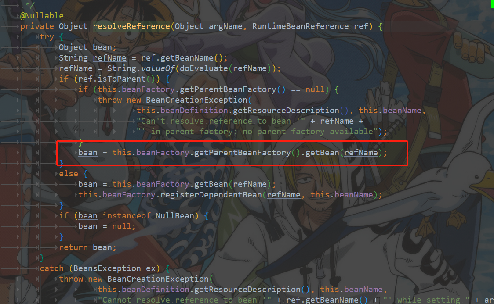

# 一、Spring IoC容器的设计

Inversion of Control


第一条接口设计主线：从接口BeanFactory到HierarchicalBeanFactory，再到ConfigurableBeanFactory、

> 通过HierarchicalBeanFactory接口，Spring的IoC容器可以建立父子层级关联的容器体系，子容器可以访问父容器中的Bean，但父容器不能访问子容器的Bean。
>
> 在容器内，Bean的id必须是唯一的，但子容器可以拥有一个和父容器id相同的Bean。父子容器层级体系增强了Spring容器架构的扩展性和灵活性，因为第三方可以通过编程的方式，为一个已经存在的容器添加一个或多个特殊用途的子容器，以提供一些额外的功能。 
>
> Spring使用父子容器实现了很多功能，比如在Spring MVC中，展现层Bean位于一个子容器中，而业务层和持久层的Bean位于父容器中。这样，展现层Bean就可以引用业务层和持久层的Bean，而业务层和持久层的Bean则看不到展现层的Bean。

第二条接口设计主线：是以ApplicationContext应用上下文接口为核心的接口设计

## 1.1 BeanFactory

### 1.1.1 BeanFactory源码

```java
//
// Source code recreated from a .class file by IntelliJ IDEA
// (powered by Fernflower decompiler)
//

package org.springframework.beans.factory;

import org.springframework.beans.BeansException;

public interface BeanFactory {
    String FACTORY_BEAN_PREFIX = "&";
	//根据名字获取Bean
    Object getBean(String var1) throws BeansException;

    <T> T getBean(String var1, Class<T> var2) throws BeansException;

    <T> T getBean(Class<T> var1) throws BeansException;

    Object getBean(String var1, Object... var2) throws BeansException;
	//判断容器中是否含有指定名字的Bean
    boolean containsBean(String var1);
	//检查Bean是否是单例的
    boolean isSingleton(String var1) throws NoSuchBeanDefinitionException;
	//检查Bean是否是原型
    boolean isPrototype(String var1) throws NoSuchBeanDefinitionException;
	//用来查询指定了名字的Bean的Class类型是否是特定的Class类型
    boolean isTypeMatch(String var1, Class var2) throws NoSuchBeanDefinitionException;
	//获取指定名字的Bean的Class类型
    Class<?> getType(String var1) throws NoSuchBeanDefinitionException;
	//查询指定了名字的Bean的所有别名，这个别名是在BeanDefinition中定义的
    String[] getAliases(String var1);
}
```

### 1.1.2 BeanFactory容器设计原理

以XmlBeanFactory的实现为例：它只提供最基本的IoC容器的功能。

BeanFactory是实现IoC容器的基本形式

DefaultListableBeanFactory是一个默认的功能完整的IoC容器

XmlBeanFactory的功能是建立在DefaultListableBeanFactory这个基本容器的基础上的，并在这个容器的基础上实现了诸如XML读取的附加功能。

```java
/*
 * Copyright 2002-2018 the original author or authors.
 *
 * Licensed under the Apache License, Version 2.0 (the "License");
 * you may not use this file except in compliance with the License.
 * You may obtain a copy of the License at
 *
 *      https://www.apache.org/licenses/LICENSE-2.0
 *
 * Unless required by applicable law or agreed to in writing, software
 * distributed under the License is distributed on an "AS IS" BASIS,
 * WITHOUT WARRANTIES OR CONDITIONS OF ANY KIND, either express or implied.
 * See the License for the specific language governing permissions and
 * limitations under the License.
 */

package org.springframework.beans.factory.xml;

import org.springframework.beans.BeansException;
import org.springframework.beans.factory.BeanFactory;
import org.springframework.beans.factory.support.DefaultListableBeanFactory;
import org.springframework.core.io.Resource;

/**
 * Convenience extension of {@link DefaultListableBeanFactory} that reads bean definitions
 * from an XML document. Delegates to {@link XmlBeanDefinitionReader} underneath; effectively
 * equivalent to using an XmlBeanDefinitionReader with a DefaultListableBeanFactory.
 *
 * <p>The structure, element and attribute names of the required XML document
 * are hard-coded in this class. (Of course a transform could be run if necessary
 * to produce this format). "beans" doesn't need to be the root element of the XML
 * document: This class will parse all bean definition elements in the XML file.
 *
 * <p>This class registers each bean definition with the {@link DefaultListableBeanFactory}
 * superclass, and relies on the latter's implementation of the {@link BeanFactory} interface.
 * It supports singletons, prototypes, and references to either of these kinds of bean.
 * See {@code "spring-beans-3.x.xsd"} (or historically, {@code "spring-beans-2.0.dtd"}) for
 * details on options and configuration style.
 *
 * <p><b>For advanced needs, consider using a {@link DefaultListableBeanFactory} with
 * an {@link XmlBeanDefinitionReader}.</b> The latter allows for reading from multiple XML
 * resources and is highly configurable in its actual XML parsing behavior.
 *
 * @author Rod Johnson
 * @author Juergen Hoeller
 * @author Chris Beams
 * @since 15 April 2001
 * @see org.springframework.beans.factory.support.DefaultListableBeanFactory
 * @see XmlBeanDefinitionReader
 * @deprecated as of Spring 3.1 in favor of {@link DefaultListableBeanFactory} and
 * {@link XmlBeanDefinitionReader}
 */
@Deprecated
@SuppressWarnings({"serial", "all"})
public class XmlBeanFactory extends DefaultListableBeanFactory {

   private final XmlBeanDefinitionReader reader = new XmlBeanDefinitionReader(this);


   /**
    * Create a new XmlBeanFactory with the given resource,
    * which must be parsable using DOM.
    * @param resource the XML resource to load bean definitions from
    * @throws BeansException in case of loading or parsing errors
    */
   public XmlBeanFactory(Resource resource) throws BeansException {
      this(resource, null);
   }

   /**
    * Create a new XmlBeanFactory with the given input stream,
    * which must be parsable using DOM.
    * @param resource the XML resource to load bean definitions from
    * @param parentBeanFactory parent bean factory
    * @throws BeansException in case of loading or parsing errors
    */
   public XmlBeanFactory(Resource resource, BeanFactory parentBeanFactory) throws BeansException {
      super(parentBeanFactory);
      this.reader.loadBeanDefinitions(resource);
   }

}
```

编程式使用IoC容器：

```java
ClassPathResource resource = new ClassPathResource("spring.xml");
DefaultListableBeanFactory factory = new DefaultListableBeanFactory();
XmlBeanDefinitionReader reader = new XmlBeanDefinitionReader(factory);
reader.loadBeanDefinitions(resource);
```

## 1.2 ApplicationContext

### 1.2.1 ApplicationContext源码


ApplicationContext提供了BeanFactory不具备的新特性：

- 支持不同的信息源
- 访问资源
- 支持应用事件
- 在ApplicationContext中提供附加服务

### 1.2.2 ApplicationContext容器设计原理

以FileSystemXmlApplicationContext的实现为例：

```java
public FileSystemXmlApplicationContext(
      String[] configLocations, boolean refresh, @Nullable ApplicationContext parent)
      throws BeansException {

   super(parent);
   setConfigLocations(configLocations);
   if (refresh) {
      refresh();
   }
}
```

其中refresh()过程会涉及到IoC容器启动的一系列复杂操作

```java
@Override
protected Resource getResourceByPath(String path) {
   if (path.startsWith("/")) {
      path = path.substring(1);
   }
   return new FileSystemResource(path);
}
```

另一个功能是与FileSystemXmlApplicationContext设计具体相关的功能，这部分与怎样从文件系统中加载XML的Bean定义资源有关。通过这个过程，可以为在文件系统中读取以XML形式存在的BeanDefinitionzuo做准备，因为不同的应用上下文实现对应着不同的读取BeanDefinition的方式。

# 二、IoC容器的初始化过程

通过调用refresh()方法来启动整个初始化过程：BeanDefinition的Resouce定位、载入和注册。

Resource定位过程：这个Resource定位指的是BeanDefinition的资源定位，它由ResourceLoader通过统一的Resource接口来完成，这个Resource对各种形式的BeanDefinition的使用都提供了统一的接口。

BeanDefinition的载入：把用户定义好的Bean表示成IoC容器内部的数据结构，这个是数据结构就是BeanDefinition。

注册过程：向IoC容器中注册这些BeanDefinition的过程，在这个过程中，一般不包含Bean依赖注入的实现。Bean定义的载入和依赖注入是两个独立的过程。依赖注入一般发生在应用第一次通过getBean向容器索取Bean的时候（预实例化配置：lazyinit，注入在容器初始化的时候就完成）

## 2.1 BeanDefinition的Resouce定位

```java
//
// Source code recreated from a .class file by IntelliJ IDEA
// (powered by Fernflower decompiler)
//

package org.springframework.context.support;

import org.springframework.beans.BeansException;
import org.springframework.context.ApplicationContext;
import org.springframework.core.io.FileSystemResource;
import org.springframework.core.io.Resource;

public class FileSystemXmlApplicationContext extends AbstractXmlApplicationContext {
    public FileSystemXmlApplicationContext() {
    }

    public FileSystemXmlApplicationContext(ApplicationContext parent) {
        super(parent);
    }
	//configLocation就是配置文件(BeanDefinition)的路径
    public FileSystemXmlApplicationContext(String configLocation) throws BeansException {
        this(new String[]{configLocation}, true, (ApplicationContext)null);
    }
	//包含多个配置文件
    public FileSystemXmlApplicationContext(String... configLocations) throws BeansException {
        this(configLocations, true, (ApplicationContext)null);
    }
	//允许指定双亲IOC容器
    public FileSystemXmlApplicationContext(String[] configLocations, ApplicationContext parent) throws BeansException {
        this(configLocations, true, parent);
    }

    public FileSystemXmlApplicationContext(String[] configLocations, boolean refresh) throws BeansException {
        this(configLocations, refresh, (ApplicationContext)null);
    }
	//在对象的初始化过程中，调用refresh方法载入BeanDefinition
    public FileSystemXmlApplicationContext(String[] configLocations, boolean refresh, ApplicationContext parent) throws BeansException {
        super(parent);
        this.setConfigLocations(configLocations);
        if (refresh) {
            this.refresh();
        }

    }
	//系统中BeanDefinition的路径，在BeanDefinitionReader的loadBeanDefintion中被调用
    protected Resource getResourceByPath(String path) {
        if (path != null && path.startsWith("/")) {
            path = path.substring(1);
        }

        return new FileSystemResource(path);
    }
}
```

定位BeanDefinition的位置

## 2.2 BeanDefinition的载入和解析

```java
@Override
public void refresh() throws BeansException, IllegalStateException {
   synchronized (this.startupShutdownMonitor) {
      // Prepare this context for refreshing.
      prepareRefresh();
      //这里是在子类中启动refreshBeanFactory()的地方
      // Tell the subclass to refresh the internal bean factory.
      ConfigurableListableBeanFactory beanFactory = obtainFreshBeanFactory();

      // Prepare the bean factory for use in this context.
      prepareBeanFactory(beanFactory);

      try {
         // 设置BeanFactory的后置处理器
         // Allows post-processing of the bean factory in context subclasses.
         postProcessBeanFactory(beanFactory);
         // 调用BeanFactory的后置处理器，这些处理器是在Bean定义中向容器注册的
         // Invoke factory processors registered as beans in the context.
         invokeBeanFactoryPostProcessors(beanFactory);
         // 注册Bean的后置处理器，在Bean创建过程中调用
         // Register bean processors that intercept bean creation.
         registerBeanPostProcessors(beanFactory);
         //对上下文中的消息源进行初始化
         // Initialize message source for this context.
         initMessageSource();
         // 初始化上下文中的事件机制
         // Initialize event multicaster for this context.
         initApplicationEventMulticaster();
         //初始化其他特殊Bean
         // Initialize other special beans in specific context subclasses.
         onRefresh();
         // 检查监听Bean，并且将这些Bean向容器注册
         // Check for listener beans and register them.
         registerListeners();

         // 这里是对lazy-init属性进行 处理的地方
         // Instantiate all remaining (non-lazy-init) singletons.
         finishBeanFactoryInitialization(beanFactory);

         // Last step: publish corresponding event.
         finishRefresh();
      }

      catch (BeansException ex) {
         if (logger.isWarnEnabled()) {
            logger.warn("Exception encountered during context initialization - " +
                  "cancelling refresh attempt: " + ex);
         }

         // Destroy already created singletons to avoid dangling resources.
         destroyBeans();

         // Reset 'active' flag.
         cancelRefresh(ex);

         // Propagate exception to caller.
         throw ex;
      }

      finally {
         // Reset common introspection caches in Spring's core, since we
         // might not ever need metadata for singleton beans anymore...
         resetCommonCaches();
      }
   }
}
```

重点关注obtainFreshBeanFactory()方法：

```java
protected ConfigurableListableBeanFactory obtainFreshBeanFactory() {
   refreshBeanFactory();
   return getBeanFactory();
}
```

```java
@Override
protected final void refreshBeanFactory() throws BeansException {
   if (hasBeanFactory()) {
      destroyBeans();
      closeBeanFactory();
   }
   try {
      DefaultListableBeanFactory beanFactory = createBeanFactory();
      beanFactory.setSerializationId(getId());
      customizeBeanFactory(beanFactory);
      loadBeanDefinitions(beanFactory);
      synchronized (this.beanFactoryMonitor) {
         this.beanFactory = beanFactory;
      }
   }
   catch (IOException ex) {
      throw new ApplicationContextException("I/O error parsing bean definition source for " + getDisplayName(), ex);
   }
}
```

在loadBeanDefinitions方法中完成BeanDefinitions的载入：

首先通过调用XML解析器得到document对象，然后再按照Spring的Bean规则进行解析，在documentReader中完成的。

```java
public int registerBeanDefinitions(Document doc, Resource resource) throws BeanDefinitionStoreException {
   BeanDefinitionDocumentReader documentReader = createBeanDefinitionDocumentReader();
   int countBefore = getRegistry().getBeanDefinitionCount();
   documentReader.registerBeanDefinitions(doc, createReaderContext(resource));
   return getRegistry().getBeanDefinitionCount() - countBefore;
}
```

通过解析，在XML中定义的BeanDefinition就被整个载入到IoC容器中，并在容器中建立了数据映射

## 2.3 BeanDefinition在IoC容器中的注册

DefaultListableBeanFactory中通过一个HashMap来持有载入的BeanDefinition

```java
/** Map of bean definition objects, keyed by bean name. */
private final Map<String, BeanDefinition> beanDefinitionMap = new ConcurrentHashMap<>(256);
```

具体注册实现在DefaultListableBeanFactory中的registerBeanDefinition方法中完成的

```java
@Override
public void registerBeanDefinition(String beanName, BeanDefinition beanDefinition)
      throws BeanDefinitionStoreException {

   Assert.hasText(beanName, "Bean name must not be empty");
   Assert.notNull(beanDefinition, "BeanDefinition must not be null");

   if (beanDefinition instanceof AbstractBeanDefinition) {
      try {
         ((AbstractBeanDefinition) beanDefinition).validate();
      }
      catch (BeanDefinitionValidationException ex) {
         throw new BeanDefinitionStoreException(beanDefinition.getResourceDescription(), beanName,
               "Validation of bean definition failed", ex);
      }
   }

   BeanDefinition existingDefinition = this.beanDefinitionMap.get(beanName);
   if (existingDefinition != null) {
      if (!isAllowBeanDefinitionOverriding()) {
         throw new BeanDefinitionOverrideException(beanName, beanDefinition, existingDefinition);
      }
      else if (existingDefinition.getRole() < beanDefinition.getRole()) {
         // e.g. was ROLE_APPLICATION, now overriding with ROLE_SUPPORT or ROLE_INFRASTRUCTURE
         if (logger.isInfoEnabled()) {
            logger.info("Overriding user-defined bean definition for bean '" + beanName +
                  "' with a framework-generated bean definition: replacing [" +
                  existingDefinition + "] with [" + beanDefinition + "]");
         }
      }
      else if (!beanDefinition.equals(existingDefinition)) {
         if (logger.isDebugEnabled()) {
            logger.debug("Overriding bean definition for bean '" + beanName +
                  "' with a different definition: replacing [" + existingDefinition +
                  "] with [" + beanDefinition + "]");
         }
      }
      else {
         if (logger.isTraceEnabled()) {
            logger.trace("Overriding bean definition for bean '" + beanName +
                  "' with an equivalent definition: replacing [" + existingDefinition +
                  "] with [" + beanDefinition + "]");
         }
      }
      this.beanDefinitionMap.put(beanName, beanDefinition);
   }
   else {
      if (hasBeanCreationStarted()) {
         // Cannot modify startup-time collection elements anymore (for stable iteration)
         synchronized (this.beanDefinitionMap) {
            this.beanDefinitionMap.put(beanName, beanDefinition);
            List<String> updatedDefinitions = new ArrayList<>(this.beanDefinitionNames.size() + 1);
            updatedDefinitions.addAll(this.beanDefinitionNames);
            updatedDefinitions.add(beanName);
            this.beanDefinitionNames = updatedDefinitions;
            removeManualSingletonName(beanName);
         }
      }
      else {
         // Still in startup registration phase
         this.beanDefinitionMap.put(beanName, beanDefinition);
         this.beanDefinitionNames.add(beanName);
         removeManualSingletonName(beanName);
      }
      this.frozenBeanDefinitionNames = null;
   }

   if (existingDefinition != null || containsSingleton(beanName)) {
      resetBeanDefinition(beanName);
   }
}
```

## 2.4 IoC容器完成依赖注入

**依赖注入发生在用户第一次向IoC容器索要Bean的时候**

从DefaultListableBeanFactory的基类AbstractBeanFactory入手去理解getBean的实现：


```java
protected <T> T doGetBean(final String name, @Nullable final Class<T> requiredType,
      @Nullable final Object[] args, boolean typeCheckOnly) throws BeansException {

   final String beanName = transformedBeanName(name);
   Object bean;
   //先从缓存中取得bean，处理那些已经被创建过的单例模式的Bean，对这种Bean的请求不需要重复创建
   // Eagerly check singleton cache for manually registered singletons.
   Object sharedInstance = getSingleton(beanName);
   if (sharedInstance != null && args == null) {
      if (logger.isTraceEnabled()) {
         if (isSingletonCurrentlyInCreation(beanName)) {
            logger.trace("Returning eagerly cached instance of singleton bean '" + beanName +
                  "' that is not fully initialized yet - a consequence of a circular reference");
         }
         else {
            logger.trace("Returning cached instance of singleton bean '" + beanName + "'");
         }
      }
      //这里的getObjectForBeanInstance完成的是FactoryBean的相关处理，以取得FactoryBean的生产结果
      bean = getObjectForBeanInstance(sharedInstance, name, beanName, null);
   }

   else {
      // Fail if we're already creating this bean instance:
      // We're assumably within a circular reference.
      if (isPrototypeCurrentlyInCreation(beanName)) {
         throw new BeanCurrentlyInCreationException(beanName);
      }
      /**
       * 这里对IoC容器中的BeanDefinition是否存在进行检查，检查是否能在当前BeanFactory中取到需要的Bean
       * 如果取不到，则取双亲BeanFactory中去取，
       * 如果当前双亲工厂取不到，那么就顺着BeanFactory链一直向上查找
       */
      // Check if bean definition exists in this factory.
      BeanFactory parentBeanFactory = getParentBeanFactory();
      if (parentBeanFactory != null && !containsBeanDefinition(beanName)) {
         // Not found -> check parent.
         String nameToLookup = originalBeanName(name);
         if (parentBeanFactory instanceof AbstractBeanFactory) {
            return ((AbstractBeanFactory) parentBeanFactory).doGetBean(
                  nameToLookup, requiredType, args, typeCheckOnly);
         }
         else if (args != null) {
            // Delegation to parent with explicit args.
            return (T) parentBeanFactory.getBean(nameToLookup, args);
         }
         else if (requiredType != null) {
            // No args -> delegate to standard getBean method.
            return parentBeanFactory.getBean(nameToLookup, requiredType);
         }
         else {
            return (T) parentBeanFactory.getBean(nameToLookup);
         }
      }

      if (!typeCheckOnly) {
         markBeanAsCreated(beanName);
      }

      try {
         //根据Bean的名字取到BeanDefinition
         final RootBeanDefinition mbd = getMergedLocalBeanDefinition(beanName);
         checkMergedBeanDefinition(mbd, beanName, args);
         /**
          * 获取当前Bean所有依赖的Bean，这样会触发getBean的递归调用，直到取到一个没有任何依赖的Bean为止
          */
         // Guarantee initialization of beans that the current bean depends on.
         String[] dependsOn = mbd.getDependsOn();
         if (dependsOn != null) {
            for (String dep : dependsOn) {
               if (isDependent(beanName, dep)) {
                  throw new BeanCreationException(mbd.getResourceDescription(), beanName,
                        "Circular depends-on relationship between '" + beanName + "' and '" + dep + "'");
               }
               registerDependentBean(dep, beanName);
               try {
                  getBean(dep);
               }
               catch (NoSuchBeanDefinitionException ex) {
                  throw new BeanCreationException(mbd.getResourceDescription(), beanName,
                        "'" + beanName + "' depends on missing bean '" + dep + "'", ex);
               }
            }
         }
         /**
          * 这里通过调用createBean方法创建Singleton bean的实例，这里有一个回调函数getObject，会在getSingleton
          * 中调用createBean
          */
         // Create bean instance.
         if (mbd.isSingleton()) {
            sharedInstance = getSingleton(beanName, () -> {
               try {
                  return createBean(beanName, mbd, args);
               }
               catch (BeansException ex) {
                  // Explicitly remove instance from singleton cache: It might have been put there
                  // eagerly by the creation process, to allow for circular reference resolution.
                  // Also remove any beans that received a temporary reference to the bean.
                  destroySingleton(beanName);
                  throw ex;
               }
            });
            bean = getObjectForBeanInstance(sharedInstance, name, beanName, mbd);
         }

         else if (mbd.isPrototype()) {
            // It's a prototype -> create a new instance.
            Object prototypeInstance = null;
            try {
               beforePrototypeCreation(beanName);
               prototypeInstance = createBean(beanName, mbd, args);
            }
            finally {
               afterPrototypeCreation(beanName);
            }
            bean = getObjectForBeanInstance(prototypeInstance, name, beanName, mbd);
         }

         else {
            String scopeName = mbd.getScope();
            final Scope scope = this.scopes.get(scopeName);
            if (scope == null) {
               throw new IllegalStateException("No Scope registered for scope name '" + scopeName + "'");
            }
            try {
               Object scopedInstance = scope.get(beanName, () -> {
                  beforePrototypeCreation(beanName);
                  try {
                     return createBean(beanName, mbd, args);
                  }
                  finally {
                     afterPrototypeCreation(beanName);
                  }
               });
               bean = getObjectForBeanInstance(scopedInstance, name, beanName, mbd);
            }
            catch (IllegalStateException ex) {
               throw new BeanCreationException(beanName,
                     "Scope '" + scopeName + "' is not active for the current thread; consider " +
                     "defining a scoped proxy for this bean if you intend to refer to it from a singleton",
                     ex);
            }
         }
      }
      catch (BeansException ex) {
         cleanupAfterBeanCreationFailure(beanName);
         throw ex;
      }
   }

   // Check if required type matches the type of the actual bean instance.
   if (requiredType != null && !requiredType.isInstance(bean)) {
      try {
         T convertedBean = getTypeConverter().convertIfNecessary(bean, requiredType);
         if (convertedBean == null) {
            throw new BeanNotOfRequiredTypeException(name, requiredType, bean.getClass());
         }
         return convertedBean;
      }
      catch (TypeMismatchException ex) {
         if (logger.isTraceEnabled()) {
            logger.trace("Failed to convert bean '" + name + "' to required type '" +
                  ClassUtils.getQualifiedName(requiredType) + "'", ex);
         }
         throw new BeanNotOfRequiredTypeException(name, requiredType, bean.getClass());
      }
   }
   return (T) bean;
}
```

### 2.4.1 createBean

先关注createBean方法：

```java
@Override
protected Object createBean(String beanName, RootBeanDefinition mbd, @Nullable Object[] args)
      throws BeanCreationException {

   if (logger.isTraceEnabled()) {
      logger.trace("Creating instance of bean '" + beanName + "'");
   }
   RootBeanDefinition mbdToUse = mbd;

   /**
    * 判断需要创建的Bean是否可以实例化，这个类是否可以通过类装载器来载入
    */
   // Make sure bean class is actually resolved at this point, and
   // clone the bean definition in case of a dynamically resolved Class
   // which cannot be stored in the shared merged bean definition.
   Class<?> resolvedClass = resolveBeanClass(mbd, beanName);
   if (resolvedClass != null && !mbd.hasBeanClass() && mbd.getBeanClassName() != null) {
      mbdToUse = new RootBeanDefinition(mbd);
      mbdToUse.setBeanClass(resolvedClass);
   }

   // Prepare method overrides.
   try {
      mbdToUse.prepareMethodOverrides();
   }
   catch (BeanDefinitionValidationException ex) {
      throw new BeanDefinitionStoreException(mbdToUse.getResourceDescription(),
            beanName, "Validation of method overrides failed", ex);
   }

   try {
      // 如果bean配置了PostProcessor，那么这里返回一个代理对象
      // Give BeanPostProcessors a chance to return a proxy instead of the target bean instance.
      Object bean = resolveBeforeInstantiation(beanName, mbdToUse);
      if (bean != null) {
         return bean;
      }
   }
   catch (Throwable ex) {
      throw new BeanCreationException(mbdToUse.getResourceDescription(), beanName,
            "BeanPostProcessor before instantiation of bean failed", ex);
   }

   try {
      // 创建Bean
      Object beanInstance = doCreateBean(beanName, mbdToUse, args);
      if (logger.isTraceEnabled()) {
         logger.trace("Finished creating instance of bean '" + beanName + "'");
      }
      return beanInstance;
   }
   catch (BeanCreationException | ImplicitlyAppearedSingletonException ex) {
      // A previously detected exception with proper bean creation context already,
      // or illegal singleton state to be communicated up to DefaultSingletonBeanRegistry.
      throw ex;
   }
   catch (Throwable ex) {
      throw new BeanCreationException(
            mbdToUse.getResourceDescription(), beanName, "Unexpected exception during bean creation", ex);
   }
}
```

主要方法doCreateBean：

```java
protected Object doCreateBean(final String beanName, final RootBeanDefinition mbd, final @Nullable Object[] args)
      throws BeanCreationException {

   // Instantiate the bean.
   BeanWrapper instanceWrapper = null;
   if (mbd.isSingleton()) {
      instanceWrapper = this.factoryBeanInstanceCache.remove(beanName);
   }
   //创建bean
   if (instanceWrapper == null) {
      instanceWrapper = createBeanInstance(beanName, mbd, args);
   }
   final Object bean = instanceWrapper.getWrappedInstance();
   Class<?> beanType = instanceWrapper.getWrappedClass();
   if (beanType != NullBean.class) {
      mbd.resolvedTargetType = beanType;
   }

   // Allow post-processors to modify the merged bean definition.
   synchronized (mbd.postProcessingLock) {
      if (!mbd.postProcessed) {
         try {
            applyMergedBeanDefinitionPostProcessors(mbd, beanType, beanName);
         }
         catch (Throwable ex) {
            throw new BeanCreationException(mbd.getResourceDescription(), beanName,
                  "Post-processing of merged bean definition failed", ex);
         }
         mbd.postProcessed = true;
      }
   }
   /**
    * 提前曝光到三级缓存SingletonFactories当中
    */
   // Eagerly cache singletons to be able to resolve circular references
   // even when triggered by lifecycle interfaces like BeanFactoryAware.
   boolean earlySingletonExposure = (mbd.isSingleton() && this.allowCircularReferences &&
         isSingletonCurrentlyInCreation(beanName));
   if (earlySingletonExposure) {
      if (logger.isTraceEnabled()) {
         logger.trace("Eagerly caching bean '" + beanName +
               "' to allow for resolving potential circular references");
      }
      addSingletonFactory(beanName, () -> getEarlyBeanReference(beanName, mbd, bean));
   }
   //对bean的初始化，依赖注入在这里发生，exposedObject作为依赖注入完成后的bean
   // Initialize the bean instance.
   Object exposedObject = bean;
   try {
      populateBean(beanName, mbd, instanceWrapper);
      /**
       * 在完成对Bean的生成和依赖注入后，开始对Bean进行初始化，这个初始化过程包含了对后置处理器postProcessAfterInitialization
       * 的回调
       */
      exposedObject = initializeBean(beanName, exposedObject, mbd);
   }
   catch (Throwable ex) {
      if (ex instanceof BeanCreationException && beanName.equals(((BeanCreationException) ex).getBeanName())) {
         throw (BeanCreationException) ex;
      }
      else {
         throw new BeanCreationException(
               mbd.getResourceDescription(), beanName, "Initialization of bean failed", ex);
      }
   }

   if (earlySingletonExposure) {
      Object earlySingletonReference = getSingleton(beanName, false);
      if (earlySingletonReference != null) {
         if (exposedObject == bean) {
            exposedObject = earlySingletonReference;
         }
         else if (!this.allowRawInjectionDespiteWrapping && hasDependentBean(beanName)) {
            String[] dependentBeans = getDependentBeans(beanName);
            Set<String> actualDependentBeans = new LinkedHashSet<>(dependentBeans.length);
            for (String dependentBean : dependentBeans) {
               if (!removeSingletonIfCreatedForTypeCheckOnly(dependentBean)) {
                  actualDependentBeans.add(dependentBean);
               }
            }
            if (!actualDependentBeans.isEmpty()) {
               throw new BeanCurrentlyInCreationException(beanName,
                     "Bean with name '" + beanName + "' has been injected into other beans [" +
                     StringUtils.collectionToCommaDelimitedString(actualDependentBeans) +
                     "] in its raw version as part of a circular reference, but has eventually been " +
                     "wrapped. This means that said other beans do not use the final version of the " +
                     "bean. This is often the result of over-eager type matching - consider using " +
                     "'getBeanNamesOfType' with the 'allowEagerInit' flag turned off, for example.");
            }
         }
      }
   }

   // Register bean as disposable.
   try {
      registerDisposableBeanIfNecessary(beanName, bean, mbd);
   }
   catch (BeanDefinitionValidationException ex) {
      throw new BeanCreationException(
            mbd.getResourceDescription(), beanName, "Invalid destruction signature", ex);
   }

   return exposedObject;
}
```

主要步骤：

1、创建Bean `createBeanInstance`

```java
protected BeanWrapper createBeanInstance(String beanName, RootBeanDefinition mbd, @Nullable Object[] args) {
   // Make sure bean class is actually resolved at this point.
   Class<?> beanClass = resolveBeanClass(mbd, beanName);

   if (beanClass != null && !Modifier.isPublic(beanClass.getModifiers()) && !mbd.isNonPublicAccessAllowed()) {
      throw new BeanCreationException(mbd.getResourceDescription(), beanName,
            "Bean class isn't public, and non-public access not allowed: " + beanClass.getName());
   }

   Supplier<?> instanceSupplier = mbd.getInstanceSupplier();
   if (instanceSupplier != null) {
      return obtainFromSupplier(instanceSupplier, beanName);
   }
   //使用工厂方法对Bean进行实例化
   if (mbd.getFactoryMethodName() != null) {
      return instantiateUsingFactoryMethod(beanName, mbd, args);
   }

   // Shortcut when re-creating the same bean...
   boolean resolved = false;
   boolean autowireNecessary = false;
   if (args == null) {
      synchronized (mbd.constructorArgumentLock) {
         if (mbd.resolvedConstructorOrFactoryMethod != null) {
            resolved = true;
            autowireNecessary = mbd.constructorArgumentsResolved;
         }
      }
   }
   if (resolved) {
      if (autowireNecessary) {
         return autowireConstructor(beanName, mbd, null, null);
      }
      else {
         return instantiateBean(beanName, mbd);
      }
   }
   // 使用构造函数进行实例化
   // Candidate constructors for autowiring?
   Constructor<?>[] ctors = determineConstructorsFromBeanPostProcessors(beanClass, beanName);
   if (ctors != null || mbd.getResolvedAutowireMode() == AUTOWIRE_CONSTRUCTOR ||
         mbd.hasConstructorArgumentValues() || !ObjectUtils.isEmpty(args)) {
      return autowireConstructor(beanName, mbd, ctors, args);
   }

   // Preferred constructors for default construction?
   ctors = mbd.getPreferredConstructors();
   if (ctors != null) {
      return autowireConstructor(beanName, mbd, ctors, null);
   }
   // 使用默认的无参构造函数进行实例化
   // No special handling: simply use no-arg constructor.
   return instantiateBean(beanName, mbd);
}
```

```java
protected BeanWrapper instantiateBean(final String beanName, final RootBeanDefinition mbd) {
   try {
      Object beanInstance;
      final BeanFactory parent = this;
      if (System.getSecurityManager() != null) {
         beanInstance = AccessController.doPrivileged((PrivilegedAction<Object>) () ->
               getInstantiationStrategy().instantiate(mbd, beanName, parent),
               getAccessControlContext());
      }
      else {
         // 使用默认的实例化策略对Bean进行实例化，默认策略是使用CGLIB对Bean进行实例化
         beanInstance = getInstantiationStrategy().instantiate(mbd, beanName, parent);
      }
      BeanWrapper bw = new BeanWrapperImpl(beanInstance);
      initBeanWrapper(bw);
      return bw;
   }
   catch (Throwable ex) {
      throw new BeanCreationException(
            mbd.getResourceDescription(), beanName, "Instantiation of bean failed", ex);
   }
}
```

InstantiationStrategy是实例化Bean策略的接口，有以下两个实现类：


 两种实例化Bean的方式：JVM反射机制，CGLIB生成

**默认策略是使用CGLIB对Bean进行实例化**

### 2.4.2 提前曝光到三级缓存

addSingletonFactory方法

这样做的目的是为了解决注入时产生循环依赖

```java
protected void addSingletonFactory(String beanName, ObjectFactory<?> singletonFactory) {
   Assert.notNull(singletonFactory, "Singleton factory must not be null");
   synchronized (this.singletonObjects) {
      if (!this.singletonObjects.containsKey(beanName)) {
         this.singletonFactories.put(beanName, singletonFactory);
         this.earlySingletonObjects.remove(beanName);
         this.registeredSingletons.add(beanName);
      }
   }
}
```

Spring为了解决单例的循环依赖问题，使用了**三级缓存**。

这三级缓存分别指： 

- 三级缓存singletonFactories ： 单例对象工厂的cache 
- 二级缓存earlySingletonObjects ：提前暴光的单例对象的Cache 
- 一级缓存singletonObjects：单例对象的cache

回顾一下doGetBean中一开始的操作：


分析一下getSingleton方法：

```java
@Nullable
protected Object getSingleton(String beanName, boolean allowEarlyReference) {
   Object singletonObject = this.singletonObjects.get(beanName);
   if (singletonObject == null && isSingletonCurrentlyInCreation(beanName)) {
      synchronized (this.singletonObjects) {
         singletonObject = this.earlySingletonObjects.get(beanName);
         if (singletonObject == null && allowEarlyReference) {
            ObjectFactory<?> singletonFactory = this.singletonFactories.get(beanName);
            if (singletonFactory != null) {
               singletonObject = singletonFactory.getObject();
               this.earlySingletonObjects.put(beanName, singletonObject);
               this.singletonFactories.remove(beanName);
            }
         }
      }
   }
   return singletonObject;
}
```

在创建bean的时候，首先想到的是从一级缓存中获取这个单例的bean，这个缓存就是singletonObjects。如果获取不到，并且对象正在创建中，就再从二级缓存earlySingletonObjects中获取。如果还是获取不到且允许singletonFactories通过getObject()获取，就从三级缓存singletonFactory.getObject()(三级缓存)获取，如果获取到了则：从singletonFactories中移除，并放入earlySingletonObjects中。其实也就是从三级缓存移动到了二级缓存。

### 2.4.3 依赖注入

doCreateBean中的populateBean方法

```Java
protected void populateBean(String beanName, RootBeanDefinition mbd, @Nullable BeanWrapper bw) {
   if (bw == null) {
      if (mbd.hasPropertyValues()) {
         throw new BeanCreationException(
               mbd.getResourceDescription(), beanName, "Cannot apply property values to null instance");
      }
      else {
         // Skip property population phase for null instance.
         return;
      }
   }

   // Give any InstantiationAwareBeanPostProcessors the opportunity to modify the
   // state of the bean before properties are set. This can be used, for example,
   // to support styles of field injection.
   boolean continueWithPropertyPopulation = true;

   if (!mbd.isSynthetic() && hasInstantiationAwareBeanPostProcessors()) {
      for (BeanPostProcessor bp : getBeanPostProcessors()) {
         if (bp instanceof InstantiationAwareBeanPostProcessor) {
            InstantiationAwareBeanPostProcessor ibp = (InstantiationAwareBeanPostProcessor) bp;
            if (!ibp.postProcessAfterInstantiation(bw.getWrappedInstance(), beanName)) {
               continueWithPropertyPopulation = false;
               break;
            }
         }
      }
   }

   if (!continueWithPropertyPopulation) {
      return;
   }

   PropertyValues pvs = (mbd.hasPropertyValues() ? mbd.getPropertyValues() : null);
   //开始进行依赖注入过程，先处理autowire的注入
   int resolvedAutowireMode = mbd.getResolvedAutowireMode();
   if (resolvedAutowireMode == AUTOWIRE_BY_NAME || resolvedAutowireMode == AUTOWIRE_BY_TYPE) {
      MutablePropertyValues newPvs = new MutablePropertyValues(pvs);
      // 根据类型或者名字进行注入
      // Add property values based on autowire by name if applicable.
      if (resolvedAutowireMode == AUTOWIRE_BY_NAME) {
         autowireByName(beanName, mbd, bw, newPvs);
      }
      // Add property values based on autowire by type if applicable.
      if (resolvedAutowireMode == AUTOWIRE_BY_TYPE) {
         autowireByType(beanName, mbd, bw, newPvs);
      }
      pvs = newPvs;
   }

   boolean hasInstAwareBpps = hasInstantiationAwareBeanPostProcessors();
   boolean needsDepCheck = (mbd.getDependencyCheck() != AbstractBeanDefinition.DEPENDENCY_CHECK_NONE);

   PropertyDescriptor[] filteredPds = null;
   if (hasInstAwareBpps) {
      if (pvs == null) {
         pvs = mbd.getPropertyValues();
      }
      for (BeanPostProcessor bp : getBeanPostProcessors()) {
         if (bp instanceof InstantiationAwareBeanPostProcessor) {
            InstantiationAwareBeanPostProcessor ibp = (InstantiationAwareBeanPostProcessor) bp;
            PropertyValues pvsToUse = ibp.postProcessProperties(pvs, bw.getWrappedInstance(), beanName);
            if (pvsToUse == null) {
               if (filteredPds == null) {
                  filteredPds = filterPropertyDescriptorsForDependencyCheck(bw, mbd.allowCaching);
               }
               pvsToUse = ibp.postProcessPropertyValues(pvs, filteredPds, bw.getWrappedInstance(), beanName);
               if (pvsToUse == null) {
                  return;
               }
            }
            pvs = pvsToUse;
         }
      }
   }
   if (needsDepCheck) {
      if (filteredPds == null) {
         filteredPds = filterPropertyDescriptorsForDependencyCheck(bw, mbd.allowCaching);
      }
      checkDependencies(beanName, mbd, filteredPds, pvs);
   }

   if (pvs != null) {
      //对属性进行注入
      applyPropertyValues(beanName, mbd, bw, pvs);
   }
}
```

在Bean的创建和对象依赖注入的过程中，需要依据BeanDefinition中的信息来递归地完成依赖注入，这些递归都是以getBean为入口的：

1、在上下文中查找需要的Bean和创建Bean的递归调用

AbstractBeanFactory中doGetBean方法


2、在依赖注入的时候，通过递归调用getBean方法，得到当前Bean依赖的Bean，同时触发对依赖Bean的创建和注入

BeanDefinitionValueResolver中的resolveReference方法

