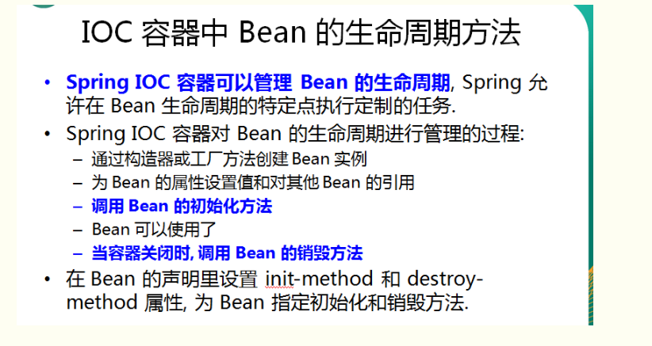
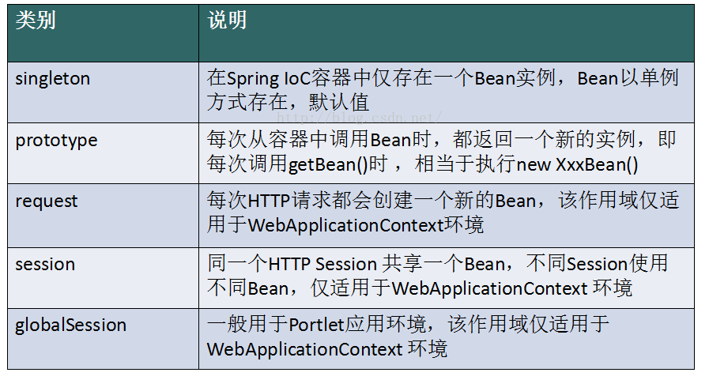

# 1、BeanFactory 和 FactoryBean？

区别：BeanFactory是个Factory，也就是IOC容器或对象工厂，FactoryBean是个Bean。在Spring中，**所有的Bean都是由BeanFactory(也就是IOC容器)来进行管理的**。但对FactoryBean而言，**这个Bean不是简单的Bean，而是一个能生产或者修饰对象生成的工厂Bean,它的实现与设计模式中的工厂模式和修饰器模式类似** 

> **BeanFactory**

BeanFactory，以Factory结尾，表示它是一个工厂类(接口)， **它负责生产和管理bean的一个工厂**。在Spring中，**BeanFactory是IOC容器的核心接口，它的职责包括：实例化、定位、配置应用程序中的对象及建立这些对象间的依赖。BeanFactory只是个接口，并不是IOC容器的具体实现，但是Spring容器给出了很多种实现，如 DefaultListableBeanFactory、XmlBeanFactory、ApplicationContext等，其中XmlBeanFactory就是常用的一个，该实现将以XML方式描述组成应用的对象及对象间的依赖关系**。

> **FactoryBean**

**一般情况下，Spring通过反射机制利用<bean>的class属性指定实现类实例化Bean，在某些情况下，实例化Bean过程比较复杂，如果按照传统的方式，则需要在<bean>中提供大量的配置信息。配置方式的灵活性是受限的，这时采用编码的方式可能会得到一个简单的方案。Spring为此提供了一个org.springframework.bean.factory.FactoryBean的工厂类接口，用户可以通过实现该接口定制实例化Bean的逻辑。FactoryBean接口对于Spring框架来说占用重要的地位，Spring自身就提供了70多个FactoryBean的实现**。

# 2、BeanFactory 和 ApplicationContext？

我们一般称 BeanFactory 为 IoC 容器，而称 ApplicationContext 为应用上下文或 Spring 容器 。

BeanFactory 是 Spring 框架的基础设施，面向 Spring 本身； ApplicationContext 面向使用 Spring 框架的开发者，几乎所有的应用场合都可以直接使用 ApplicationContext。

1.BeanFactroy采用的是延迟加载形式来注入Bean的，即只有在使用到某个Bean时(调用getBean())，才对该Bean进行加载实例化，这样，我们就不能发现一些存在的Spring的配置问题。而ApplicationContext则相反，它是在容器启动时，一次性创建了所有的Bean。这样，在容器启动时，我们就可以发现Spring中存在的配置错误。 相对于基本的BeanFactory，ApplicationContext 唯一的不足是占用内存空间。当应用程序配置Bean较多时，程序启动较慢。

BeanFacotry延迟加载,如果Bean的某一个属性没有注入，BeanFacotry加载后，直至第一次使用调用getBean方法才会抛出异常；而ApplicationContext则在初始化自身是检验，这样有利于检查所依赖属性是否注入；所以通常情况下我们选择使用 ApplicationContext。
应用上下文则会在上下文启动后预载入所有的单实例Bean。通过预载入单实例bean ,确保当你需要的时候，你就不用等待，因为它们已经创建好了。

2.BeanFactory和ApplicationContext都支持BeanPostProcessor、BeanFactoryPostProcessor的使用，但两者之间的区别是：BeanFactory需要手动注册，而ApplicationContext则是自动注册。（Applicationcontext比 beanFactory 加入了一些更好使用的功能。而且 beanFactory 的许多功能需要通过编程实现而 Applicationcontext 可以通过配置实现。比如后处理 bean ， Applicationcontext 直接配置在配置文件即可而 beanFactory 这要在代码中显示的写出来才可以被容器识别。 ）

3.beanFactory主要是面对与 spring 框架的基础设施，面对 spring 自己。而 Applicationcontex 主要面对与 spring 使用的开发者。基本都会使用 Applicationcontex 并非 beanFactory 。

# 3、Spring 如何保证 Controller 并发的安全？

Spring 多线程请求过来调用的Controller对象都是一个，而不是一个请求过来就创建一个Controller对象。

**并发的安全？**
 原因就在于Controller对象是单例的，那么如果不小心在类中定义了类变量，那么这个类变量是被所有请求共享的，这可能会造成多个请求修改该变量的值，出现与预期结果不符合的异常

**那有没有办法让Controller不以单例而以每次请求都重新创建的形式存在呢？**
 答案是当然可以，只需要在类上添加注解@Scope("prototype")即可，这样每次请求调用的类都是重新生成的（每次生成会影响效率）

虽然这样可以解决问题，但增加了时间成本，总让人不爽，还有其他方法么？答案是肯定的！

使用**ThreadLocal**来保存类变量，将类变量保存在线程的变量域中，让不同的请求隔离开来。

# 4、Spring Bean的生命周期

1. 实例化单例bean；
2. 注入依赖；
3. 重写相应的方法能够获取bean的名字；
4. 重写相应的方法能够获取beanfactory实例；
5. 重写相应的方法能够在bean定义前执行；
6. 重写相应的方法能够在bean定义时执行；
7. 重写相应的方法在bean定义后执行；
8. 重写相应的方法在bean销毁时执行；

# 5、Spring Bean的作用域

# 6、Spring 解决循环注入的原理？

Spring为了解决单例的循环依赖问题，使用了**三级缓存**。

这三级缓存分别指： 

- singletonFactories ： 单例对象工厂的cache 
- earlySingletonObjects ：提前暴光的单例对象的Cache 
- singletonObjects：单例对象的cache

在创建bean的时候，首先想到的是从cache中获取这个单例的bean，这个缓存就是singletonObjects。如果获取不到，并且对象正在创建中，就再从二级缓存earlySingletonObjects中获取。如果还是获取不到且允许singletonFactories通过getObject()获取，就从三级缓存singletonFactory.getObject()(三级缓存)获取，如果获取到了则：从singletonFactories中移除，并放入earlySingletonObjects中。其实也就是从三级缓存移动到了二级缓存。

从上面三级缓存的分析，我们可以知道，Spring解决循环依赖的诀窍就在于singletonFactories这个三级cache。这个cache的类型是ObjectFactory。这里就是解决循环依赖的关键，发生在createBeanInstance之后，也就是说单例对象此时已经被创建出来(调用了构造器)。这个对象已经被生产出来了，虽然还不完美（还没有进行初始化的第二步和第三步），但是已经能被人认出来了（根据对象引用能定位到堆中的对象），所以Spring此时将这个对象提前曝光出来让大家认识，让大家使用。

这样做有什么好处呢？让我们来分析一下“A的某个field或者setter依赖了B的实例对象，同时B的某个field或者setter依赖了A的实例对象”这种循环依赖的情况。A首先完成了初始化的第一步，并且将自己提前曝光到singletonFactories中，此时进行初始化的第二步，发现自己依赖对象B，此时就尝试去get(B)，发现B还没有被create，所以走create流程，B在初始化第一步的时候发现自己依赖了对象A，于是尝试get(A)，尝试一级缓存singletonObjects(肯定没有，因为A还没初始化完全)，尝试二级缓存earlySingletonObjects（也没有），尝试三级缓存singletonFactories，由于A通过ObjectFactory将自己提前曝光了，所以B能够通过ObjectFactory.getObject拿到A对象(虽然A还没有初始化完全，但是总比没有好呀)，B拿到A对象后顺利完成了初始化阶段1、2、3，完全初始化之后将自己放入到一级缓存singletonObjects中。此时返回A中，A此时能拿到B的对象顺利完成自己的初始化阶段2、3，最终A也完成了初始化，进去了一级缓存singletonObjects中，而且更加幸运的是，由于B拿到了A的对象引用，所以B现在hold住的A对象完成了初始化。

知道了这个原理时候，肯定就知道为啥Spring不能解决“A的构造方法中依赖了B的实例对象，同时B的构造方法中依赖了A的实例对象”这类问题了！**因为加入singletonFactories三级缓存的前提是执行了构造器，所以构造器的循环依赖没法解决。** 

