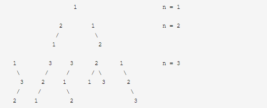

#  一、算法思想

## 1.1 双指针

### 1.1.1 Two Sum II - Input array is sorted（167）

```java
package com.problem167;

class Solution {
    public int[] twoSum(int[] numbers, int target) {
        int i = 0, j = numbers.length - 1;
        int[] result = new int[2];
        int temp;
        while (i < j){
            temp = numbers[i] + numbers[j];
            if (temp == target){
                result[0] = i + 1;
                result[1] = j + 1;
                break;
            }else if (temp < target){
                i++;
            }else{
                j--;
            }
        }
        return result;
    }
}
```

### 1.1.2 Sum of Square Numbers（633）

```java
package com.problem633;

class Solution {
    public boolean judgeSquareSum(int c) {
        int i = 0, j = (int) Math.sqrt(c);
        int temp;
        while (i <= j){
            temp = i * i + j * j;
            if (temp == c){
                return true;
            }else if (temp < c){
                i++;
            }else {
                j--;
            }
        }
        return false;
    }
}
```

### 1.1.3 Reverse String（344）

```java
package com.problem344;

class Solution {
    public void reverseString(char[] s) {
        int length = s.length;
        int i = 0, j = length - 1;
        char c;
        while (i < j){
            c = s[i];
            s[i] = s[j];
            s[j] = c;
            i++;
            j--;
        }
    }
}
```

### 1.1.4 Reverse Vowels of a String（345）

```java
package com.problem345;

import java.util.Arrays;
import java.util.List;

class Solution {
    public String reverseVowels(String s) {
        List<Character> list = Arrays.asList('a','e','i','o','u','A','E','I','O','U');
        char[] chars = s.toCharArray();
        int i = 0, j = s.length() - 1;
        char temp;
        while (i < j){
            if (list.contains(chars[i]) && list.contains(chars[j])){
                temp = chars[i];
                chars[i] = chars[j];
                chars[j] = temp;
                i++;j--;
            }else if (!list.contains(chars[j])){
                j--;
            }else if (!list.contains(chars[i])){
                i++;
            }
        }
        return new String(chars);
    }
}
```

### 1.1.5 Valid Palindrome（125）

```java
class Solution {
    public boolean isPalindrome(String s) {
       String string;
        StringBuilder sb = new StringBuilder();
        for (char c : s.toCharArray()){
            if ((c >= 'a' && c <= 'z') || (c >= 'A' && c <= 'Z')){
                string = String.valueOf(c);
                sb.append(string.toLowerCase());
            }else if (c >= '0' && c <= '9'){
                sb.append(c);
            }
        }
        s = sb.toString();
        int i = 0, j = s.length() - 1;
        while (i < j){
            if (s.charAt(i) != s.charAt(j)){
                return false;
            }else {
                i++;
                j--;
            }
        }
        return true;
    }
}
```

### 1.1.6 Valid Palindrome II（680）

**双指针，遇到不相等的字符就分别判断s[i,j-1]或s[i+1,j]是不是回文字符串**

```java
package com.problem680;


class Solution {

    public boolean validPalindrome(String s) {
        int i = 0, j = s.length() - 1;
        while (i < j){
            if (s.charAt(i) != s.charAt(j)){
                return judge(s,i,j - 1) || judge(s,i + 1,j);
            }
            i++;j--;
        }
        return true;
    }

    private boolean judge(String s, int i, int j) {
        while (i < j){
            if (s.charAt(i++) != s.charAt(j--)){
                return false;
            }
        }
        return true;
    }
}
```

### 1.1.8 *Merge Sorted Array（88）

```java
package com.problem88;

class Solution {

    public void merge(int[] nums1, int m, int[] nums2, int n) {
        int i = 0,j = 0;
        while (j < n && i < (m + n)){
            if (nums1[i] <= nums2[j] && i < m){
                i++;
            }else if (i > m){
                nums1[i] = nums2[j];
                i++;j++;
            }else {
                //插入nums2[j]
                if (m - i >= 0) {
                    System.arraycopy(nums1, i, nums1, i + 1, m - i);
                }
                nums1[i] = nums2[j];
                j++;
                m++;
            }
        }
    }
}
```

```java
class Solution {
    public void merge(int[] nums1, int m, int[] nums2, int n) {
        int index = m - 1;
        int index2 = n - 1;
        int total = m + n -1;
        while (index >= 0 || index2 >= 0){
            if (index < 0){
                nums1[total--] = nums2[index2--];
            }else if (index2 < 0){
                nums1[total--] = nums1[index--];
            }else if (nums1[index] < nums2[index2]){
                nums1[total--] = nums2[index2--];
            }else {
                nums1[total--] = nums1[index--];
            }
        }
    }
}
```

### 1.1.9 Linked List Cycle（141）

```java
public boolean hasCycle(ListNode head) {
    if (head == null || head.next == null){
        return false;
    }
    ListNode slow = head;
    ListNode fast = head;
    while (slow != null && fast != null){
        slow = slow.next;
        if (fast.next == null){
            return false;
        }
        fast = fast.next.next;
        if (slow == fast){
            return true;
        }
    }
    return false;
}
```

### 1.1.10 通过删除字母匹配到字典里最长单词

[524. Longest Word in Dictionary through Deleting](https://leetcode.com/problems/longest-word-in-dictionary-through-deleting/)

```java
package com.problem524;

import java.util.List;

class Solution {
    public String findLongestWord(String s, List<String> d) {
        String result = "";
        for (String s1 : d){
            int l1 = result.length();
            int l2 = s1.length();
            if (l1 > l2 || (l1 == l2 && s1.compareTo(result) < 0)){
                continue;
            }
            if (judge(s1,s)){
                result = s1;
            }
        }
        return result;
    }

    private boolean judge(String s1, String s) {
        int i = 0, j = 0;
        while (i < s1.length() && j < s.length()){
            if (s1.charAt(i) == s.charAt(j)){
                i++;
            }
            j++;
        }
        return i == s1.length();
    }
}
```

### 1.1.11 判断子序列

[392. Is Subsequence](https://leetcode.com/problems/is-subsequence/)

```java 
package com.problem392;

class Solution {
    public boolean isSubsequence(String s, String t) {
        int i = 0,j = 0;
        while (i < s.length() && j < t.length()){
            if (s.charAt(i) == t.charAt(j)){
                i++;
            }
            j++;
        }
        return i == s.length();
    }
}
```

### 1.1.12 三数之和

[15. 3Sum](https://leetcode.com/problems/3sum/)

> Given an array `nums` of *n* integers, are there elements *a*, *b*, *c* in `nums` such that *a* + *b* + *c* = 0? Find all unique triplets in the array which gives the sum of zero.
>
> **Note:**
>
> The solution set must not contain duplicate triplets.
>
> **Example:**
>
> ```
> Given array nums = [-1, 0, 1, 2, -1, -4],
> 
> A solution set is:
> [
>   [-1, 0, 1],
>   [-1, -1, 2]
> ]
> ```

```java
package com.problem15;

import java.util.*;

/**
 * @Author: 98050
 * @Time: 2019-09-06 22:19
 * @Feature:
 */
public class Solution2 {

    public List<List<Integer>> threeSum(int[] nums) {
        Arrays.sort(nums);
        Set<List<Integer>> res = new HashSet<>();
        for (int i = 0; i < nums.length; i++) {
            int sum = 0 - nums[i];
            int start = i + 1;
            int end = nums.length - 1;
            while (start < end){
                int temp = nums[start] + nums[end];
                if (temp == sum){
                    ArrayList<Integer> list = new ArrayList<>();
                    list.add(nums[i]);
                    list.add(nums[start]);
                    list.add(nums[end]);
                    res.add(list);

                    start++;
                    end--;
                }else if (temp < sum){
                    start++;
                }else {
                    end--;
                }
            }
        }
        List<List<Integer>> temp = new ArrayList<>();
        for (List list : res){
            temp.add(list);
        }
        return temp;
    }
}
```

## 1.2 排序

### 1.2.1 Kth Largest Element in an Array（215）

注：求解Kth Element问题，可以使用快排、堆、排序等方法来完成。

> **排序**

```java
public int findKthLargest(int[] nums, int k) {
    Arrays.sort(nums);
    return nums[nums.length - k];
}
```

时间复杂度为：O(nlogn)，空间复杂度O(1)。

> **堆**

```java
public static int findKthLargest3(int[] nums, int k) {
    //小顶堆
    PriorityQueue<Integer> heap = new PriorityQueue<>();
    for (int i : nums){
        heap.add(i);
        if (heap.size() > k){
            heap.poll();
        }
    }
    return heap.peek();
}
```

时间复杂度O(nlogk)，空间复杂度O(k)

> **快速排序**

因为快速排序每回都可以确定一个元素的最终位置，所以通过比较枢轴与length-k的位置大小来决定对哪一部分进行递归。

```java
private static void sort(int[] nums, int start, int end,int k) {
    int i = start;
    int j = end;
    if (start < end){
        int temp = nums[start];
        while (i != j){
            while (i < j && nums[j] >= temp){
                j--;
            }
            if (i < j){
                nums[i] = nums[j];
                i++;
            }
            while (i < j && nums[i] <= temp){
                i++;
            }
            if (i < j){
                nums[j] = nums[i];
                j--;
            }
        }
        nums[i] = temp;
        if (i == nums.length - k){
            return;
        }
        if (i > nums.length - k){
            sort(nums, start, i - 1, k);
        }
        if (i < nums.length - k) {
            sort(nums, i + 1, end, k);
        }
    }
}
```

时间复杂度O(n)，空间复杂度O(1)

### 1.2.2 Top K Frequent Elements（347）

桶排序

```java
package com.problem347;

import java.util.ArrayList;
import java.util.HashMap;
import java.util.List;

class Solution {
    public List<Integer> topKFrequent(int[] nums, int k) {
        List<Integer> list = new ArrayList<>();
        HashMap<Integer,Integer> map = new HashMap<>();
        for (int i : nums){
            map.put(i, map.getOrDefault(i, 0) + 1);
        }
        ArrayList<Integer>[] buckets = new ArrayList[nums.length + 1];
        for (int i : map.keySet()){
            int index = map.get(i);
            if (buckets[index] == null){
                buckets[index] = new ArrayList<>();
            }
            buckets[index].add(i);
        }
        for (int i = buckets.length - 1; i >= 0; i--) {
            if (buckets[i] != null){
                if (list.size() == k){
                    break;
                }
                if (buckets[i].size() <= (k - list.size())){
                    list.addAll(buckets[i]);
                }else {
                    list.addAll(buckets[i].subList(0, k - list.size()));
                }
            }
        }
        return list;
    }
}
```

### 1.2.3 Sort Characters By Frequency（451）

```java
package com.problem451;

import java.util.ArrayList;
import java.util.HashMap;
import java.util.List;

class Solution {
    
    public  String frequencySort(String s) {
        HashMap<Character,Integer> map = new HashMap<>();
        for (char c : s.toCharArray()){
            map.put(c, map.getOrDefault(c, 0) + 1);
        }
        List<Character>[] buckets = new ArrayList[s.length() + 1];
        for (char c : map.keySet()){
            int index = map.get(c);
            if (buckets[index] == null){
                buckets[index] = new ArrayList<>();
            }
            for (int i = 0; i < index; i++) {
                buckets[index].add(c);
            }
        }
        StringBuilder sb = new StringBuilder();
        for (int i = buckets.length - 1; i >= 0; i--) {
            if (buckets[i] != null){
                for (char c : buckets[i]) {
                    sb.append(c);
                }
            }
        }
        return sb.toString();
    }
}
```

### 1.2.4 Sort Colors（75）

思路：三向切分快速排序

快速排序在实际应用中会面对大量具有重复元素的数组。例如加入一个子数组全部为重复元素，则对于此数组排序就可以停止，但快排算法依然将其切分为更小的数组。这种情况下快排的性能尚可，但存在着巨大的改进潜力。（从O(nlgn)提升到O(n)）

  一个简单的想法就是将数组分为三部分：小于当前切分元素的部分，等于当前切分元素的部分，大于当前切分元素的部分。

  E.W.Dijlstra（对，就是Dijkstra最短路径算法的发明者）曾经提出一个与之相关的荷兰国旗问题（一个数组中有分别代表红白蓝三个颜色的三个主键值，将三个主键值排序，就得到了荷兰国旗的颜色排列）。

  他提出的算法是： 对于每次切分：从数组的左边到右边遍历一次，维护三个指针，其中lt指针使得元素（arr[0]-arr[lt-1]）的值均小于切分元素；gt指针使得元素（arr[gt+1]-arr[N-1]）的值均大于切分元素；i指针使得元素（arr[lt]-arr[i-1]）的值均等于切分元素，（arr[i]-arr[gt]）的元素还没被扫描，切分算法执行到i>gt为止。每次切分之后，位于gt指针和lt指针之间的元素的位置都已经被排定，不需要再去处理了。之后将（lo,lt-1）,（gt+1,hi）分别作为处理左子数组和右子数组的递归函数的参数传入，递归结束，整个算法也就结束。

三向切分的示意图：


```java
package com.problem75;

class Solution {
    public void sortColors(int[] nums) {
        sortBy3Way(nums,0,nums.length - 1);
    }

    private void sortBy3Way(int[] nums, int i, int j) {
        int low = i,high = j;
        int index = low + 1;
        if (i < j){
            int temp = nums[low];
            while (index <= j){
                if (nums[index] < temp){
                    swap(nums, low++, index++);
                }else if (nums[index] > temp){
                    swap(nums, index, high--);
                }else {
                    index++;
                }
            }
            sortBy3Way(nums, i, low - 1);
            sortBy3Way(nums, high + 1, j);
        }
    }

    private void swap(int[] nums, int i, int j) {
        int temp = nums[i];
        nums[i] = nums[j];
        nums[j] = temp;
    }
}
```

## 1.3 贪心

### 1.3.1 Assign Cookies（455）

[455. Assign Cookies](https://leetcode.com/problems/assign-cookies/)

> Assume you are an awesome parent and want to give your children some cookies. But, you should give each child at most one cookie. Each child i has a greed factor gi, which is the minimum size of a cookie that the child will be content with; and each cookie j has a size sj. If sj >= gi, we can assign the cookie j to the child i, and the child i will be content. Your goal is to maximize the number of your content children and output the maximum number.
>
> **Note:**
> You may assume the greed factor is always positive. 
> You cannot assign more than one cookie to one child.
>
> **Example 1:**
>
> ```
> Input: [1,2,3], [1,1]
> 
> Output: 1
> 
> Explanation: You have 3 children and 2 cookies. The greed factors of 3 children are 1, 2, 3. 
> And even though you have 2 cookies, since their size is both 1, you could only make the child whose greed factor is 1 content.
> You need to output 1.
> ```
>
> 
>
> **Example 2:**
>
> ```
> Input: [1,2], [1,2,3]
> 
> Output: 2
> 
> Explanation: You have 2 children and 3 cookies. The greed factors of 2 children are 1, 2. 
> You have 3 cookies and their sizes are big enough to gratify all of the children, 
> You need to output 2.
> ```

思路：首先将g和s排序，然后从大到小进行分配

```java
package com.problem455;

import java.util.Arrays;

class Solution {
    public int findContentChildren(int[] g, int[] s) {
        Arrays.sort(g);
        Arrays.sort(s);

        int i = g.length - 1;
        int j = s.length - 1;
        int count = 0;
        while (i >= 0 && j >= 0){
            if (g[i] <= s[j]){
                count++;
                j--;
            }
            i--;
        }
        return count;
    }
}
```

### 1.3.2 无重叠区间

[435. Non-overlapping Intervals](https://leetcode.com/problems/non-overlapping-intervals/)

和56题类似，只不过56题是对重叠区间进行合并：a=[1,3]，b=[2,4]，只要a[1]>=b[0]，那么就可以合并，所以取右边最大的值就可以得到最终的区间，先将`intervals`按第一列排序，然后进行合并。

[56. Merge Intervals](https://leetcode.com/problems/merge-intervals/)

> Given a collection of intervals, merge all overlapping intervals.
>
> **Example 1:**
>
> ```
> Input: [[1,3],[2,6],[8,10],[15,18]]
> Output: [[1,6],[8,10],[15,18]]
> Explanation: Since intervals [1,3] and [2,6] overlaps, merge them into [1,6].
> ```
>
> **Example 2:**
>
> ```
> Input: [[1,4],[4,5]]
> Output: [[1,5]]
> Explanation: Intervals [1,4] and [4,5] are considered overlapping.
> ```
>
> **NOTE:** input types have been changed on April 15, 2019. Please reset to default code definition to get new method signature.

```java
package com.problem56;

import com.exam.hashmap.Main;

import java.util.ArrayList;
import java.util.Arrays;
import java.util.List;

/**
 * @Author: 98050
 * @Time: 2019-08-16 10:30
 * @Feature:
 */
public class Solution {

    public int[][] merge(int[][] intervals) {
        List<int[]> list = new ArrayList<>();
        Arrays.sort(intervals,(o1,o2) ->{
            return o1[0] - o2[0];
        });
        int i = 0;
        int row = intervals.length;
        while (i < row){
            int left = intervals[i][0];
            int right = intervals[i][1];
            int j = i + 1;
            while (j < row && intervals[j][0] <= right){
                right = Math.max(right,intervals[j][1]);
                j++;
            }
            list.add(new int[]{left,right});
            i = j;
        }
        return list.toArray(new int[list.size()][]);
    }
}
```

这道题是删除最小的区间数，使剩下的区间不再重叠，那么每回就让右边取最小，统计可以合并的**最少**区间数即可。

```java
package com.problem435;

import java.util.Arrays;
import java.util.Comparator;

class Solution {
    public int eraseOverlapIntervals(int[][] intervals) {
        int row = intervals.length;
        int result = 0;
        Arrays.sort(intervals, Comparator.comparingInt(a -> a[0]));
        int i = 0;
        while (i < row){
            int right = intervals[i][1];
            int j = i + 1;
            while (j < row && intervals[j][0] < right){
                right = Math.min(right, intervals[j][1]);
                result++;
                j++;
            }
            i = j;
        }
        return result;
    }
}
```

贪心：

先计算**最多**能组成的不重叠区间个数，然后用区间总个数减去不重叠区间的个数。

在每次选择中，区间的结尾最为重要，选择的区间结尾越小，留给后面的区间的空间越大，那么后面能够选择的区间个数也就越大。

按区间的结尾进行排序，每次选择结尾最小，并且和前一个区间不重叠的区间。

```java
public int eraseOverlapIntervals2(int[][] intervals) {
    int row = intervals.length;
    if (row == 0){
        return 0;
    }
    Arrays.sort(intervals, Comparator.comparingInt(a -> a[1]));
    int result = 1;
    int right = intervals[0][1];
    for (int i = 1; i < row; i++) {
        if (intervals[i][0] < right){
            continue;
        }
        right = intervals[i][1];
        result++;
    }
    return row - result;
}
```

### 1.3.3 用最少数量的箭引爆气球

[452. Minimum Number of Arrows to Burst Balloons](https://leetcode.com/problems/minimum-number-of-arrows-to-burst-balloons/)

和无重叠区间一样，直接计算无重叠区间的个数，即为最少数量的箭，只不过这里边界值相等也算重叠！

```java
package com.problem452;

import java.util.Arrays;
import java.util.Comparator;

class Solution {
    public int findMinArrowShots(int[][] points) {
        int row = points.length;
        if (row == 0){
            return 0;
        }
        Arrays.sort(points, Comparator.comparingInt(a -> a[1]));
        int result = 1;
        int right = points[0][1];
        for (int i = 1; i < row; i++) {
            if (points[i][0] <= right){
                continue;
            }
            right = points[i][1];
            result++;
        }
        return result;
    }
}
```

### 1.3.4 根据身高重建队列

[406. Queue Reconstruction by Height](https://leetcode.com/problems/queue-reconstruction-by-height/)

为了使插入操作不影响后续的操作，身高较高的学生应该先做插入操作，否则身高较小的学生原先正确插入的第 k 个位置可能会变成第 k+1 个位置。

身高 h 降序、个数 k 值升序，然后将某个学生插入队列的第 k 个位置中。

```java
package com.problem406;

import java.util.ArrayList;
import java.util.Arrays;
import java.util.List;

class Solution {
    public int[][] reconstructQueue(int[][] people) {
        if (people == null || people.length == 0 || people[0].length == 0){
            return new int[0][0];
        }
        Arrays.sort(people, ((o1, o2) -> o1[0] == o2[0] ? o1[1] - o2[1] : o2[0] - o1[0]));
        List<int[]> list = new ArrayList<>();
        for (int[] p : people){
            list.add(p[1],p);
        }
        return list.toArray(new int[list.size()][]);
    }
}
```

### 1.3.5 买卖股票的最佳时机

[121. Best Time to Buy and Sell Stock](https://leetcode.com/problems/best-time-to-buy-and-sell-stock/)

> Say you have an array for which the *i*th element is the price of a given stock on day *i*.
>
> If you were only permitted to complete at most one transaction (i.e., buy one and sell one share of the stock), design an algorithm to find the maximum profit.
>
> Note that you cannot sell a stock before you buy one.
>
> **Example 1:**
>
> ```
> Input: [7,1,5,3,6,4]
> Output: 5
> Explanation: Buy on day 2 (price = 1) and sell on day 5 (price = 6), profit = 6-1 = 5.
>              Not 7-1 = 6, as selling price needs to be larger than buying price.
> ```
>
> **Example 2:**
>
> ```
> Input: [7,6,4,3,1]
> Output: 0
> Explanation: In this case, no transaction is done, i.e. max profit = 0.
> ```

要想收益最大，那么就需要找到数组中的最小值和最大值，且最大值的下标必须比最小值的下标大，这样就得到了最大收益。

```java
package com.problem121;

class Solution {
    public int maxProfit(int[] prices) {
        int result = 0;
        int length = prices.length;
        if (length == 0){
            return result;
        }
        int min = prices[0];
        for (int i : prices){
            min = Math.min(min, i);
            result = Math.max(result, i - min);
        }
        return result;
    }
}
```

### 1.3.6 买卖股票的最佳时机Ⅱ

[122. Best Time to Buy and Sell Stock II](https://leetcode.com/problems/best-time-to-buy-and-sell-stock-ii/)

> Say you have an array for which the *i*th element is the price of a given stock on day *i*.
>
> Design an algorithm to find the maximum profit. You may complete as many transactions as you like (i.e., buy one and sell one share of the stock multiple times).
>
> **Note:** You may not engage in multiple transactions at the same time (i.e., you must sell the stock before you buy again).
>
> **Example 1:**
>
> ```
> Input: [7,1,5,3,6,4]
> Output: 7
> Explanation: Buy on day 2 (price = 1) and sell on day 3 (price = 5), profit = 5-1 = 4.
>              Then buy on day 4 (price = 3) and sell on day 5 (price = 6), profit = 6-3 = 3.
> ```
>
> **Example 2:**
>
> ```
> Input: [1,2,3,4,5]
> Output: 4
> Explanation: Buy on day 1 (price = 1) and sell on day 5 (price = 5), profit = 5-1 = 4.
>              Note that you cannot buy on day 1, buy on day 2 and sell them later, as you are
>              engaging multiple transactions at the same time. You must sell before buying again.
> ```
>
> **Example 3:**
>
> ```
> Input: [7,6,4,3,1]
> Output: 0
> Explanation: In this case, no transaction is done, i.e. max profit = 0.
> ```

对于 [a, b, c, d]，如果有 a <= b <= c <= d ，那么最大收益为 d - a。而 d - a = (d - c) + (c - b) + (b - a) ，因此当访问到一个 prices[i] 且 prices[i] - prices[i-1] > 0，那么就把 prices[i] - prices[i-1] 添加到收益中。

```java
package com.problem122;

class Solution {
    public int maxProfit(int[] prices) {
        int result = 0;
        for (int i = 1; i < prices.length; i++) {
            if (prices[i] > prices[i - 1]){
                result += (prices[i] - prices[i - 1]);
            }
        }
        return result;
    }
}
```

### 1.3.7 种花问题

[605. Can Place Flowers](https://leetcode.com/problems/can-place-flowers/)

思路：找到所有满足条件的位置，然后判断是否大于等于n。

```java
package com.problem605;

class Solution {
    public boolean canPlaceFlowers(int[] flowerbed, int n) {
        int len = flowerbed.length;
        //找到所有满足条件的位置
        int count = 0;
        for (int i = 0; i < len; i++) {
            if (flowerbed[i] == 1){
                continue;
            }
            int pre = i == 0 ? 0 : flowerbed[i - 1];
            int next = i == len - 1 ? 0 : flowerbed[i + 1];
            if (pre == 0 && next == 0){
                count++;
                flowerbed[i] = 1;
            }
        }
        return count >= n;
    }
}
```

### 1.3.8 判断子序列

[392. Is Subsequence](https://leetcode.com/problems/is-subsequence/)

直接判断字符串s中的每个字符是否按顺序在字符串t中出现

```java
public boolean isSubsequence(String s, String t) {
    int index = -1;
    for (char c : s.toCharArray()){
        index = t.indexOf(c, index + 1);
        if (index == -1){
            return false;
        }
    }
    return true;
}
```

### 1.3.9 非递减数列

[665. Non-decreasing Array](https://leetcode.com/problems/non-decreasing-array/)

思路：在出现 nums[i] < nums[i - 1] 时，需要考虑的是应该修改数组的哪个数，使得本次修改能使 i 之前的数组成为非递减数组，并且 **不影响后续的操作** 。优先考虑令 nums[i - 1] = nums[i]，因为如果修改 nums[i] = nums[i - 1] 的话，那么 nums[i] 这个数会变大，就有可能比 nums[i + 1] 大，从而影响了后续操作。还有一个比较特别的情况就是 nums[i] < nums[i - 2]，修改 nums[i - 1] = nums[i] 不能使数组成为非递减数组，只能修改 nums[i] = nums[i - 1]。

[2，3，3，2，4]

[1，4，2，3]

```java
package com.problem665;

class Solution {
    public boolean checkPossibility(int[] nums) {
        int count = 0;
        if (nums.length <= 1){
            return true;
        }
        for (int i = 1; i < nums.length; i++) {
            if (nums[i] < nums[i - 1]){
                count++;
                if (i - 2 >= 0 && nums[i] < nums[i - 2]){
                    nums[i] = nums[i - 1];
                }else {
                    nums[i - 1] = nums[i];
                }
            }
        }
        return count <= 1;
    }
}
```

### 1.3.10 最大子序合

[53. Maximum Subarray](https://leetcode.com/problems/maximum-subarray/)

> Given an integer array `nums`, find the contiguous subarray (containing at least one number) which has the largest sum and return its sum.
>
> **Example:**
>
> ```
> Input: [-2,1,-3,4,-1,2,1,-5,4],
> Output: 6
> Explanation: [4,-1,2,1] has the largest sum = 6.
> ```
>
> **Follow up:**
>
> If you have figured out the O(*n*) solution, try coding another solution using the divide and conquer approach, which is more subtle.

```java
package com.problem53;

class Solution {
    public int maxSubArray(int[] nums) {
        int length = nums.length;
        if (length == 0){
            return 0;
        }
        int result = nums[0];
        int temp = 0;
        for (int num : nums) {
            if (temp > 0) {
                temp += num;
            } else {
                temp = num;
            }
            result = Math.max(result, temp);
        }
        return result;
    }
}
```

### *1.3.11 划分字母区间

[763. Partition Labels](https://leetcode.com/problems/partition-labels/)

思路：利用hashmap记录字符串中每个字母最后出现的位置，然后再对字符串进行遍历，设置指针right指向子串的结束位置，设置指针left指向子串的开始位置，那么最后分割的子串长度就为`right-left+1`，通过比较当前元素下标和right的大小来进行划分：

- 如果当前扫描的元素的最后一次出现的下标比right大，就说明子字符串还需要延长，就刷新right
- 如果当前扫描的元素的下标已经达到了right，就说明这个子字符串已经找到了

```java
package com.problem763;

import java.util.ArrayList;
import java.util.HashMap;
import java.util.List;

class Solution {
    public List<Integer> partitionLabels(String S) {
        HashMap<Character,Integer> map = new HashMap<>();
        List<Integer> list = new ArrayList<>();
        if (S.length() == 0){
            return list;
        }
        for (int i = 0; i < S.length(); i++) {
            map.put(S.charAt(i), i);
        }

        int right = map.get(S.charAt(0));
        int left = 0;
        for (int i = 0; i < S.length(); i++) {
            right = Math.max(right, map.get(S.charAt(i)));
            if (i >= right){
                list.add(right - left + 1);
                left = right + 1;
            }
        }
        return list;
    }
}
```

### 1.3.12 跳跃游戏

[55. Jump Game](https://leetcode.com/problems/jump-game/)

> Given an array of non-negative integers, you are initially positioned at the first index of the array.
>
> Each element in the array represents your maximum jump length at that position.
>
> Determine if you are able to reach the last index.
>
> **Example 1:**
>
> ```
> Input: [2,3,1,1,4]
> Output: true
> Explanation: Jump 1 step from index 0 to 1, then 3 steps to the last index.
> ```
>
> **Example 2:**
>
> ```
> Input: [3,2,1,0,4]
> Output: false
> Explanation: You will always arrive at index 3 no matter what. Its maximum
>              jump length is 0, which makes it impossible to reach the last index.
> ```

思路：使用贪心策略，即移动每个节点所代表的最大步长，然后找出能到达的最大位置，而且当前节点的位置一定不能大于所能到达的最大位置，最后比较最大值和数组长度的大小来进行判断

```java
class Solution {
    public boolean canJump(int[] nums) {
        int length = nums.length;
        if (length == 1){
            return true;
        }
        int start = 0;
        int end = 0;
        while (start <= end && end < length - 1){
            end = Math.max(end,start + nums[start]);
            start++;
        }
        return end >= length - 1;
    }
}
```

## 1.4 二分查找

### 1.4.1 x的平方根

[69. Sqrt(x)](https://leetcode.com/problems/sqrtx/)

> Implement `int sqrt(int x)`.
>
> Compute and return the square root of *x*, where *x* is guaranteed to be a non-negative integer.
>
> Since the return type is an integer, the decimal digits are truncated and only the integer part of the result is returned.
>
> **Example 1:**
>
> ```
> Input: 4
> Output: 2
> ```
>
> **Example 2:**
>
> ```
> Input: 8
> Output: 2
> Explanation: The square root of 8 is 2.82842..., and since 
>              the decimal part is truncated, 2 is returned.
> ```

思路一：二分

```java
package com.problem69;


class Solution {
    public  int mySqrt(int x) {
        if (x == 1 || x == 0){
            return x;
        }
        int end = x / 2;
        int start = 2;
        while (start <= end){
            int mid = (start + end) / 2;
            int temp = x / mid;
            if (temp == mid){
                return temp;
            }else if (temp < mid){
                end = mid - 1;
            }else {
                start = mid + 1;
            }
        }
        return end;
    }
}
```

思路二：牛顿插值法

```java
package com.problem69;

/**
 * @Author: 98050
 * @Time: 2019-08-28 16:58
 * @Feature:
 */
public class Solution4 {

    private double mySqrt(int num) {
        double x0 = num;

        double delta = 1e-12;
        int count = 0;
        while(x0*x0-num>delta) {
            count++;
            x0 = (x0*x0+num) / (2*x0);
        }
        x0 = Math.round(x0*1000)/1000.0;
        return x0;
    }
}
```

### 1.4.2 寻找比目标字母大的最小字母

[744. Find Smallest Letter Greater Than Target](https://leetcode.com/problems/find-smallest-letter-greater-than-target/)

```java
package com.problem744;

class Solution {
    public char nextGreatestLetter(char[] letters, char target) {
        int[] nums = new int[26];
        for (char c : letters){
            nums[c - 'a'] = 1;
        }
        int index = target - 'a';
        int start = index + 1;
        while (true){
            if (start >= nums.length){
                start = 0;
            }
            if (nums[start] != 0){
                return (char) ('a' + start);
            }
            start++;
        }
    }

    public char nextGreatestLetter2(char[] letters, char target) {
        int len = letters.length;
        int low = 0;
        int high = len - 1;
        while (low <= high){
            int mid = (low + high) / 2;
            if (letters[mid] <= target){
                low = mid + 1;
            }else {
                high = mid - 1;
            }
        }
        return high < len - 1 ? letters[high + 1] : letters[0];
    }
}
```

### *1.4.3 有序数组中的单一元素

[540. Single Element in a Sorted Array](https://leetcode.com/problems/single-element-in-a-sorted-array/)

> Given a sorted array consisting of only integers where every element appears exactly twice except for one element which appears exactly once. Find this single element that appears only once.
>
> **Example 1:**
>
> ```
> Input: [1,1,2,3,3,4,4,8,8]
> Output: 2
> ```
>
> **Example 2:**
>
> ```
> Input: [3,3,7,7,10,11,11]
> Output: 10
> ```
>
> **Note:** Your solution should run in O(log n) time and O(1) space.

如果没有时间复杂度要求的话可以用异或来做，时间复杂度为O(n)：

```java
package com.problem540;

class Solution {
    public int singleNonDuplicate(int[] nums) {
        int result = 0;
        for (int i : nums){
            result ^= i;
        }
        return result;
    }
}
```

既然有序，那么可以采用折半查找的方法，找到中间位置mid后，分别计算左右两边元素个数：

`left = mid - low，right = high - mid`，然后通过比较nums[mid]与nums[mid+1]、nums[mid-1]是否相等来确定折半查找的区间：

如果nums[mid]==nums[mid+1]，那么right需要自减一次，然后判断right是否为偶数：

- 如果right为偶数，那么说明出现一次的数只能在左半部分，则折半查找的区间在[low，mid-1]
- 如果right为奇数，那么说明出现一次的数就在右半部分，则折半查找的区间为[mid + 2，high]。为什么加2，因为nums[mid]与nums[mid+1]相等，所以要从mid+2开始查找。

同理，如果nums[mid]==nums[mid-1]，那么left需要自减一次，然后判断left是否为偶数：

- 如果left为偶数，那么说明出现一次的数只能在右半部分，则折半查找的区间在[mid-1，high]
- 如果left为奇数，那么说明出现一次的数就在左半部分，则折半查找的区间为[low，mid-2]。为什么减2，因为nums[mid]与nums[mid-1]相等，所以要从mid-2开始查找。

```java
public static int singleNonDuplicate(int[] nums) {
    int low = 0;
    int high = nums.length - 1;
    while (low < high){
        int mid = (low + high) / 2;
        int left = mid - low;
        int right = high - mid;
        if (nums[mid] == nums[mid + 1]){
            right--;
            if (right % 2 == 0){
                high = mid - 1;
            }else {
                low = mid + 2;
            }
        }else if (nums[mid] == nums[mid - 1]){
            left--;
            if (left % 2 == 0){
                low = mid + 1;
            }else {
                high = mid - 2;
            }
        }else {
            return nums[mid];
        }
    }
    return nums[low];
}
```

### *1.4.4 第一个错误版本

[278. First Bad Version](https://leetcode.com/problems/first-bad-version/)

> You are a product manager and currently leading a team to develop a new product. Unfortunately, the latest version of your product fails the quality check. Since each version is developed based on the previous version, all the versions after a bad version are also bad.
>
> Suppose you have `n` versions `[1, 2, ..., n]` and you want to find out the first bad one, which causes all the following ones to be bad.
>
> You are given an API `bool isBadVersion(version)` which will return whether `version` is bad. Implement a function to find the first bad version. You should minimize the number of calls to the API.
>
> **Example:**
>
> ```
> Given n = 5, and version = 4 is the first bad version.
> 
> call isBadVersion(3) -> false
> call isBadVersion(5) -> true
> call isBadVersion(4) -> true
> 
> Then 4 is the first bad version. 
> ```

思路：为了尽量减少isBadVersion的调用，所以采用折半查找的方式来解决，先判断mid是否错误，如果mid是错误版本，那么第一个错误版本的范围就是[low、mid]，为什么不是mid-1，因为有可能mid刚好是第一个错误版本，**所以，正因为这样也决定的循环条件为low < high，而不能low <= high**；如果mid不是错误版本，那么第一个错误版本的范围只能在[mid+1，high]，最终当low与high相等的时候就找到了第一个错误版本。

> 注：因为n的范围可能会很大，那么`mid = (low+high)/2`可能会越界，所以使用`mid = low + (high - low) / 2`

```java
package com.problem278;

public class Solution extends VersionControl{

    public int firstBadVersion(int n) {
        int low = 1;
        int high = n;
        while (low < high){
            int mid = low + (high - low) / 2;
            if (isBadVersion(mid)){
                high = mid;
            }else {
                low = mid + 1;
            }
        }
        return low;
    }
}
```

### 1.4.5 搜索旋转数组的最小值Ⅰ、Ⅱ

[153. Find Minimum in Rotated Sorted Array](https://leetcode.com/problems/find-minimum-in-rotated-sorted-array/)

[154. Find Minimum in Rotated Sorted Array II](https://leetcode.com/problems/find-minimum-in-rotated-sorted-array-ii/)

> Suppose an array sorted in ascending order is rotated at some pivot unknown to you beforehand.
>
> (i.e.,  `[0,1,2,4,5,6,7]` might become  `[4,5,6,7,0,1,2]`).
>
> Find the minimum element.
>
> You may assume no duplicate exists in the array.
> **Example 1:**
> ```
> Input: [3,4,5,1,2] 
> Output: 1
> ```
> **Example 2:**
>
> ```
> Input: [4,5,6,7,0,1,2]
> Output: 0
> ```

思路：通过比较mid与high位置元素的大小来判断最小值在哪个区间内：

如果nums[mid] > nums[high]，那么说明最小值肯定在[mid+1，high]这个区间内

如果nums[mid] == nums[high]，此时最小值无法判断在哪个区间，那么只能缩小high的值，以便下一次进行判断

如果nums[mid] < nums[high]，此时最小值只能存在于区间[low，mid]，为什么不是mid-1？

例如：[1，0，1]

```java
package com.problem153;

class Solution {
    public int findMin(int[] nums) {
        int low = 0;
        int high = nums.length - 1;
        while (low < high){
            int mid = (low + high) / 2;
            if (nums[mid] > nums[high]){
                low = mid + 1;
            }else if (nums[mid] == nums[high]){
                high--;
            }else {
                high = mid;
            }
        }
        return nums[low];
    }
}
```

### 1.4.6 在数组中查找元素的第一个和最后一个位置

[34. Find First and Last Position of Element in Sorted Array](https://leetcode.com/problems/find-first-and-last-position-of-element-in-sorted-array/)

> Given an array of integers `nums` sorted in ascending order, find the starting and ending position of a given `target` value.
>
> Your algorithm's runtime complexity must be in the order of *O*(log *n*).
>
> If the target is not found in the array, return `[-1, -1]`.
>
> **Example 1:**
>
> ```
> Input: nums = [5,7,7,8,8,10], target = 8
> Output: [3,4]
> ```
>
> **Example 2:**
>
> ```
> Input: nums = [5,7,7,8,8,10], target = 6
> Output: [-1,-1]
> ```

思路：采用折半查找的思路，找比目标值小的第一个元素和找比目标值大的第一个元素

```java
package com.problem34;

class Solution {

    public int[] searchRange(int[] nums, int target) {
        //折半查找第一个比target大的数字
        int[] result = new int[2];
        int length = nums.length;
        double temp = target + 0.5;
        int start = 0;
        int end = length - 1;
        while (start <= end){
            int mid = (start + end) / 2;
            if (nums[mid] > temp){
                end = mid - 1;
            }else if (nums[mid] <= temp){
                start = mid + 1;
            }
        }
        result[1] = end;
        //折半查找第一个比target小的数字
        temp = target - 0.5;
        start = 0;
        end = length - 1;
        while (start <= end){
            int mid = (start + end) / 2;
            if (nums[mid] <= temp){
                start = mid + 1;
            }else if (nums[mid] > temp){
                end = mid - 1;
            }
        }
        result[0] = start;

        if (result[1] >= result[0]){
            return result;
        }else {
            return new int[]{-1,-1};
        }
    }
}
```

### 1.4.7 搜索旋转排序数组

[33. Search in Rotated Sorted Array](https://leetcode.com/problems/search-in-rotated-sorted-array/)

> Suppose an array sorted in ascending order is rotated at some pivot unknown to you beforehand.
>
> (i.e., `[0,1,2,4,5,6,7]` might become `[4,5,6,7,0,1,2]`).
>
> You are given a target value to search. If found in the array return its index, otherwise return `-1`.
>
> You may assume no duplicate exists in the array.
>
> Your algorithm's runtime complexity must be in the order of *O*(log *n*).
>
> **Example 1:**
>
> ```
> Input: nums = [4,5,6,7,0,1,2], target = 0
> Output: 4
> ```
>
> **Example 2:**
>
> ```
> Input: nums = [4,5,6,7,0,1,2], target = 3
> Output: -1
> ```

```java
package com.problem33;

/**
 * @Author: 98050
 * @Time: 2019-09-16 11:05
 * @Feature:
 */
public class Solution {

    public int search(int[] nums, int target) {
        int low = 0, high = nums.length - 1;
        while (low <= high){
            int mid = (low + high) / 2;
            if (nums[mid] == target){
                return mid;
            }else if (nums[mid] < nums[high]){
                //后半部分有序
                if (target > nums[mid] && target <= nums[high]){
                    low = mid + 1;
                }else {
                    high = mid - 1;
                }
            }else {
                //前半部分有序
                if (target >= nums[low] && target < nums[mid]){
                    high = mid - 1;
                }else {
                    low = mid + 1;
                }
            }
        }
        return -1;
    }
}
```

### 1.4.8 搜索旋转排序数组Ⅱ

[81. Search in Rotated Sorted Array II](https://leetcode.com/problems/search-in-rotated-sorted-array-ii/)

> Suppose an array sorted in ascending order is rotated at some pivot unknown to you beforehand.
>
> (i.e., `[0,0,1,2,2,5,6]` might become `[2,5,6,0,0,1,2]`).
>
> You are given a target value to search. If found in the array return `true`, otherwise return `false`.
>
> **Example 1:**
>
> ```
> Input: nums = [2,5,6,0,0,1,2], target = 0
> Output: true
> ```
>
> **Example 2:**
>
> ```
> Input: nums = [2,5,6,0,0,1,2], target = 3
> Output: false
> ```

```java
package com.problem81;

class Solution {
    public boolean search(int[] nums, int target) {
        int low = 0,high = nums.length - 1;
        while (low <= high){
            int mid = (low + high) / 2;
            if (nums[mid] == target){
                return true;
            }
            if (nums[mid] == nums[high]){
                high--;
                continue;
            }
            if (nums[mid] < nums[high]){
                if (target > nums[mid] && target <= nums[high]){
                    low = mid + 1;
                }else {
                    high = mid - 1;
                }
            }else {
                if (target >= nums[low] && target < nums[mid]){
                    high = mid - 1;
                }else {
                    low = mid + 1;
                }
            }
        }
        return false;
    }
}
```

### 1.4.9 搜索插入位置

[35. Search Insert Position](https://leetcode.com/problems/search-insert-position/)

> Given a sorted array and a target value, return the index if the target is found. If not, return the index where it would be if it were inserted in order.
>
> You may assume no duplicates in the array.
>
> **Example 1:**
>
> ```
> Input: [1,3,5,6], 5
> Output: 2
> ```
>
> **Example 2:**
>
> ```
> Input: [1,3,5,6], 2
> Output: 1
> ```
>
> **Example 3:**
>
> ```
> Input: [1,3,5,6], 7
> Output: 4
> ```
>
> **Example 4:**
>
> ```
> Input: [1,3,5,6], 0
> Output: 0
> ```

```java
package com.problem35;

class Solution {
    public int searchInsert(int[] nums, int target) {
        int low = 0;
        int high = nums.length - 1;
        while (low <= high){
            int mid = (low + high) / 2;
            if (nums[mid] == target){
                return mid;
            }else if (nums[mid] > target){
                high = mid - 1;
            }else {
                low = mid + 1;
            }
        }
        return low;
    }
}
```

### 1.4.10 搜索二维矩阵

[74. Search a 2D Matrix](https://leetcode.com/problems/search-a-2d-matrix/)

> Write an efficient algorithm that searches for a value in an *m* x *n* matrix. This matrix has the following properties:
>
> - Integers in each row are sorted from left to right.
> - The first integer of each row is greater than the last integer of the previous row.
>
> **Example 1:**
>
> ```
> Input:
> matrix = [
>   [1,   3,  5,  7],
>   [10, 11, 16, 20],
>   [23, 30, 34, 50]
> ]
> target = 3
> Output: true
> ```
>
> **Example 2:**
>
> ```
> Input:
> matrix = [
>   [1,   3,  5,  7],
>   [10, 11, 16, 20],
>   [23, 30, 34, 50]
> ]
> target = 13
> Output: false
> ```

```java
package com.problem74;

class Solution {
    public boolean searchMatrix(int[][] matrix, int target) {
        int startX = matrix.length - 1;
        int startY = 0;
        while (startX >= 0 && startY < matrix[0].length){
            if (matrix[startX][startY] == target){
                return true;
            }else if (matrix[startX][startY] > target){
                startX--;
            }else {
                startY++;
            }
        }
        return false;
    }
}
```

### 1.4.11 长度最小的子数组

[209. Minimum Size Subarray Sum](https://leetcode.com/problems/minimum-size-subarray-sum/)

> Given an array of **n** positive integers and a positive integer **s**, find the minimal length of a **contiguous** subarray of which the sum ≥ **s**. If there isn't one, return 0 instead.
>
> **Example:** 
>
> ```
> Input: s = 7, nums = [2,3,1,2,4,3]
> Output: 2
> Explanation: the subarray [4,3] has the minimal length under the problem constraint.
> ```
>
> **Follow up:**
>
> If you have figured out the *O*(n ^ 2) solution, try coding another solution of which the time complexity is *O*(*n* log *n*). 

**时间复杂度O(n^2)**

```java
package com.problem209;

class Solution {

    public int minSubArrayLen(int s, int[] nums) {
        int len = nums.length;
        for (int i = 1; i < len; i++) {
            nums[i] += nums[i - 1];
        }
        for (int i = 1; i <= len; i++) {
            for (int j = len - 1; j + 1 >= i; j--) {
                int temp;
                if (j - i < 0){
                    temp = nums[j];
                }else {
                    temp = nums[j] - nums[j - i];
                }
                if (temp >= s){
                    return i;
                }
            }
        }
        return 0;
    }
}
```

**时间复杂度*O*(*n* log *n*)**

使用折半查找，累加完的数组是递增的，所以直接在累加完的数组中进行折半查找，查询的目标值为s+sums[i-1]，

```java
package com.problem209;

/**
 * @Author: 98050
 * @Time: 2019-10-16 11:12
 * @Feature:
 */
public class Solution2 {

    public int minSubArrayLen(int s, int[] nums) {
        int len = nums.length;
        int res = Integer.MAX_VALUE;
        int[] sums = new int[len + 1];
        for (int i = 1; i <= len; i++) {
            sums[i] = sums[i - 1] + nums[i - 1];
        }
        for (int i = 1; i <= len; i++) {
            int find = s + sums[i - 1];
            int index = binarySearch(sums,0,sums.length - 1,find);
            if (index != len + 1){
                res = Math.min(res, index - (i - 1));
            }
        }
        return res == Integer.MAX_VALUE ? 0 : res;
    }

    private int binarySearch(int[] sums, int start, int end,int target) {
        while (start <= end){
            int mid = (start + end);
            if (sums[mid] == target){
                return mid;
            }else if (sums[mid] < target){
                start = mid + 1;
            }else {
                end = mid - 1;
            }
        }
        return start;
    }
}
```

**时间复杂度O(n)**

```java
package com.problem209;

/**
 * @Author: 98050
 * @Time: 2019-10-16 12:54
 * @Feature:
 */
public class Solution3 {

    public int minSubArrayLen(int s, int[] nums) {
        int i = 0;
        int j = 0;
        int sum = 0;
        int res = Integer.MAX_VALUE;
        while (j < nums.length){
            if (sum + nums[j] < s){
                sum += nums[j];
                j++;
            }else {
                if (j - i < res){
                    res = j - i + 1;
                }
                sum -= nums[i];
                i++;
            }
        }
        return res != Integer.MAX_VALUE ? res : 0;
    }

}
```

## *1.5 分治

分治算法的基本思想是将一个规模为N的问题分解为K个规模较小的子问题，这些子问题相互独立且与原问题性质相同。求出子问题的解，就可得到原问题的解。即一种分目标完成程序算法，简单问题可用二分法完成。

当我们求解某些问题时，由于这些问题要处理的数据相当多，或求解过程相当复杂，使得直接求解法在时间上相当长，或者根本无法直接求出。对于这类问题，我们往往先把它分解成几个子问题，找到求出这几个子问题的解法后，再找到合适的方法，把它们组合成求整个问题的解法。如果这些子问题还较大，难以解决，可以再把它们分成几个更小的子问题，以此类推，直至可以直接求出解为止。这就是**分治策略**的基本思想。

分治法解题的一般步骤：

（1）分解，将要解决的问题划分成若干规模较小的同类问题；

（2）求解，当子问题划分得足够小时，用较简单的方法解决；

（3）合并，按原问题的要求，将子问题的解逐层合并构成原问题的解。

### 1.5.1 为运算表达式设计优先级

[241. Different Ways to Add Parentheses](https://leetcode.com/problems/different-ways-to-add-parentheses/)

> Given a string of numbers and operators, return all possible results from computing all the different possible ways to group numbers and operators. The valid operators are `+`, `-` and `*`.
>
> **Example 1:**
>
> ```
> Input: "2-1-1"
> Output: [0, 2]
> Explanation: 
> ((2-1)-1) = 0 
> (2-(1-1)) = 2
> ```
>
> **Example 2:**
>
> ```
> Input: "2*3-4*5"
> Output: [-34, -14, -10, -10, 10]
> Explanation: 
> (2*(3-(4*5))) = -34 
> ((2*3)-(4*5)) = -14 
> ((2*(3-4))*5) = -10 
> (2*((3-4)*5)) = -10 
> (((2*3)-4)*5) = 10
> ```

遇到运算符就将字符分割成两部分，直到划分的结果中不包含运算符，也就是找到了运算数，把该运算数返回，然后根据运算符计算表达式的结果，最后将结果返回到上一层递归。

```java
package com.problem241;

import java.util.ArrayList;
import java.util.List;

class Solution {
    public List<Integer> diffWaysToCompute(String input) {
        List<Integer> result = new ArrayList<>();
        for (int i = 0; i < input.length(); i++) {
            char c = input.charAt(i);
            if (c == '+' || c == '-' || c == '*'){
                List<Integer> left = diffWaysToCompute(input.substring(0, i));
                List<Integer> right = diffWaysToCompute(input.substring(i + 1));
                for (int num1 : left){
                    for (int num2 : right){
                        switch (c){
                            case '+':
                                result.add(num1 + num2);
                                break;
                            case '-':
                                result.add(num1 - num2);
                                break;
                            case '*':
                                result.add(num1 * num2);
                                break;
                        }
                    }
                }
            }
        }
        if (result.size() == 0){
            result.add(Integer.valueOf(input));
        }
        return result;
    }
}
```

### 1.5.2 不同的二叉搜索树

[95. Unique Binary Search Trees II](https://leetcode.com/problems/unique-binary-search-trees-ii/)

> Given an integer *n*, generate all structurally unique **BST's** (binary search trees) that store values 1 ... *n*.
>
> **Example:**
>
> ```
> Input: 3
> Output:
> [
>   [1,null,3,2],
>   [3,2,null,1],
>   [3,1,null,null,2],
>   [2,1,3],
>   [1,null,2,null,3]
> ]
> Explanation:
> The above output corresponds to the 5 unique BST's shown below:
> 
>    1         3     3      2      1
>     \       /     /      / \      \
>      3     2     1      1   3      2
>     /     /       \                 \
>    2     1         2                 3
> ```

```java
package com.problem95;

import com.TreeNode;

import java.util.ArrayList;
import java.util.List;

class Solution {
    public List<TreeNode> generateTrees(int n) {
        if (n < 1){
            return new ArrayList<>();
        }
        return solve(1, n);
    }

    public List<TreeNode> solve(int start, int end){
        if (start > end){
            result.add(null);
            return result;
        }
        List<TreeNode> result = new ArrayList<>();
        for (int i = start; i <= end; i++) {
            List<TreeNode> leftTree = solve(start, i - 1);
            List<TreeNode> rightTree = solve(i + 1, end);
            for (TreeNode left : leftTree){
                for (TreeNode right : rightTree){
                    TreeNode root = new TreeNode(i);
                    root.left = left;
                    root.right = right;
                    result.add(root);
                }
            }
        }
        return result;
    }
}
```

## 1.6 搜索

深度优先搜索和广度优先搜索广泛运用于树和图中，但是它们的应用远远不止如此。

### 1.6.1 BFS

每一层遍历的节点都与根节点距离相同。设 di 表示第 i 个节点与根节点的距离，推导出一个结论：

对于先遍历的节点 i 与后遍历的节点 j，有 di <= dj。利用这个结论，可以求解最短路径等

**最优解** 问题：第一次遍历到目的节点，其所经过的路径为最短路径。应该注意的是，使用 BFS 只能求解无权图的最短路径，无权图是指从一个节点到另一个节点的代价都记为 1。

#### 1.6.1.1 岛屿的个数

[200. Number of Islands](https://leetcode.com/problems/number-of-islands/)

> Given a 2d grid map of `'1'`s (land) and `'0'`s (water), count the number of islands. An island is surrounded by water and is formed by connecting adjacent lands horizontally or vertically. You may assume all four edges of the grid are all surrounded by water.
>
> **Example 1:**
>
> ```
> Input:
> 11110
> 11010
> 11000
> 00000
> 
> Output: 1
> ```
>
> **Example 2:**
>
> ```
> Input:
> 11000
> 11000
> 00100
> 00011
> 
> Output: 3
> ```

采用BFS的思路，先找到一个不为0的点，那么就找到了一个岛屿，然后遍历其四周，把四周都置为0，直到全部为0，则继续寻找下一个不为0的点。

```java
package com.problem200;


import java.util.LinkedList;

/**
 * @Author: 98050
 * @Time: 2019-09-08 20:37
 * @Feature:
 */
public class Solution {

    class Node{
        int x;
        int y;

        public Node(int x, int y) {
            this.x = x;
            this.y = y;
        }
    }

    public int numIslands(char[][] grid) {
        LinkedList<Node> queue = new LinkedList<>();
        int res = 0;
        for (int i = 0; i < grid.length; i++) {
            for (int j = 0; j < grid[0].length; j++) {
                if (grid[i][j] == '1'){
                    res++;
                    queue.addLast(new Node(i, j));
                    while (!queue.isEmpty()){
                        Node node = queue.pollFirst();
                        int x = node.x;
                        int y = node.y;
                        if (grid[x][y] == '0'){
                            continue;
                        }
                        grid[x][y] = '0';
                        Node top = new Node(x + 1, y);
                        Node bottom = new Node(x - 1, y);
                        Node left = new Node(x, y - 1);
                        Node right = new Node(x, y + 1);
                        if (inGrid(top,grid) && grid[top.x][top.y] == '1'){
                            queue.addLast(top);
                        }
                        if (inGrid(bottom,grid) && grid[bottom.x][bottom.y] == '1'){
                            queue.addLast(bottom);
                        }
                        if (inGrid(left,grid) && grid[left.x][left.y] == '1'){
                            queue.addLast(left);
                        }
                        if (inGrid(right,grid) && grid[right.x][right.y] == '1'){
                            queue.addLast(right);
                        }
                    }
                }
            }
        }
        return res;
    }

    private boolean inGrid(Node node, char[][] grid) {
        if (node.x < 0 || node.x == grid.length || node.y < 0 || node.y == grid[0].length){
            return false;
        }
        return true;
    }
}
```

#### *1.6.1.2 完全平方数

[279. Perfect Squares](https://leetcode.com/problems/perfect-squares/)

> Given a positive integer *n*, find the least number of perfect square numbers (for example, `1, 4, 9, 16, ...`) which sum to *n*.
>
> **Example 1:**
>
> ```
> Input: n = 12
> Output: 3 
> Explanation: 12 = 4 + 4 + 4.
> ```
>
> **Example 2:**
>
> ```
> Input: n = 13
> Output: 2
> Explanation: 13 = 4 + 9.
> ```

可以将每个整数看成图中的一个节点，如果两个整数之差为一个平方数，那么这两个整数所在的节点就有一条边。

要求解最小的平方数数量，就是求解从节点 n 到节点 0 的最短路径。

```java
package com.problem279;

import java.util.ArrayList;
import java.util.LinkedList;
import java.util.List;
import java.util.Queue;

/**
 * @Author: 98050
 * @Time: 2019-06-23 19:37
 * @Feature:
 * 采用BFS的思路来解决，可以将每个整数看成图中的一个节点，如果两个整数之差为一个平方数，那么这两个整数所在的节点就有一条边。
 * 要求解最小的平方数数量，就是求解从节点 n 到节点 0 的最短路径。
 */
public class Solution2 {

    public int numSquares(int n) {
        if (n <= 1){
            return n;
        }
        List<Integer> squareList = generateSquareList(n);
        LinkedList<Integer> queue = new LinkedList<>();
        boolean[] grid = new boolean[n + 1];
        queue.add(n);
        int count = 0;
        while (!queue.isEmpty()){
            int size = queue.size();
            count++;
            while (size-- > 0){
                int now = queue.poll();
                for (int num : squareList){
                    int temp = now - num;
                    if (temp < 0){
                        break;
                    }
                    if (temp == 0){
                        return count;
                    }
                    if (grid[temp]){
                        continue;
                    }
                    grid[temp] = true;
                    queue.add(temp);
                }
            }
        }
        return -1;
    }


    private List<Integer> generateSquareList(int n) {
        List<Integer> list = new ArrayList<>();
        for (int i = 1; i < n; i++) {
            if (i * i <= n){
                list.add(i * i);
            }else {
                break;
            }
        }
        return list;
    }
}
```

### 1.6.2 DFS

从一个节点出发，使用 DFS 对一个图进行遍历时，能够遍历到的节点都是从初始节点可达的，DFS 常用来求解这种 **可达性** 问题。

#### 1.6.2.1 岛屿的个数

[200. Number of Islands](https://leetcode.com/problems/number-of-islands/)

> Given a 2d grid map of `'1'`s (land) and `'0'`s (water), count the number of islands. An island is surrounded by water and is formed by connecting adjacent lands horizontally or vertically. You may assume all four edges of the grid are all surrounded by water.
>
> **Example 1:**
>
> ```
> Input:
> 11110
> 11010
> 11000
> 00000
> 
> Output: 1
> ```
>
> **Example 2:**
>
> ```
> Input:
> 11000
> 11000
> 00100
> 00011
> 
> Output: 3
> ```

采用DFS的思路，找到第一个不为0的点，开始进行深度优先遍历，也就是找到一个连通分量，遍历过程中把所有不为0的点，都变为0.

```java
package com.problem200;

/**
 * @Author: 98050
 * @Time: 2019-06-22 20:32
 * @Feature: 采用DFS来解决
 */
public class Solution2 {

    public int numIslands(char[][] grid) {
        int row = grid.length;
        if (row == 0){
            return 0;
        }
        int result = 0;
        int col = grid[0].length;
        for (int i = 0; i < row; i++) {
            for (int j = 0; j < col; j++) {
                if (grid[i][j] == '1'){
                    result++;
                    dfs(grid,i,j);
                }
            }
        }
        return result;
    }

    private void dfs(char[][] grid, int i, int j) {
        if (i < 0 || i >= grid.length || j < 0 || j >= grid[0].length || grid[i][j] == '0'){
            return;
        }
        grid[i][j] = '0';
        dfs(grid, i - 1, j);
        dfs(grid, i + 1, j);
        dfs(grid, i, j - 1);
        dfs(grid, i, j + 1);
    }

}
```

#### 1.6.2.2 岛屿的最大面积

[695. Max Area of Island](https://leetcode.com/problems/max-area-of-island/)

> Given a non-empty 2D array `grid` of 0's and 1's, an **island** is a group of `1`'s (representing land) connected 4-directionally (horizontal or vertical.) You may assume all four edges of the grid are surrounded by water.
>
> Find the maximum area of an island in the given 2D array. (If there is no island, the maximum area is 0.)
>
> **Example 1:**
>
> ```
> [[0,0,1,0,0,0,0,1,0,0,0,0,0],
>  [0,0,0,0,0,0,0,1,1,1,0,0,0],
>  [0,1,1,0,1,0,0,0,0,0,0,0,0],
>  [0,1,0,0,1,1,0,0,1,0,1,0,0],
>  [0,1,0,0,1,1,0,0,1,1,1,0,0],
>  [0,0,0,0,0,0,0,0,0,0,1,0,0],
>  [0,0,0,0,0,0,0,1,1,1,0,0,0],
>  [0,0,0,0,0,0,0,1,1,0,0,0,0]]
> ```
>
> Given the above grid, return 6. Note the answer is not 11, because the island must be connected 4-directionally.
>
> **Example 2:**
>
> ```
> [[0,0,0,0,0,0,0,0]]
> ```
>
> Given the above grid, return 0.
>
> **Note:** The length of each dimension in the given `grid` does not exceed 50.

```java
package com.problem695;

class Solution {
    public int maxAreaOfIsland(int[][] grid) {
        int row = grid.length;
        if (row == 0){
            return 0;
        }
        int col = grid[0].length;
        int result = 0;
        for (int i = 0; i < row; i++) {
            for (int j = 0; j < col; j++) {
                if (grid[i][j] == 1){
                    result = Math.max(result, dfs(grid,i,j));
                }
            }
        }
        return result;
    }

    private int dfs(int[][] grid, int i, int j) {
        if (i < 0 || i == grid.length || j < 0 || j == grid[0].length || grid[i][j] == 0){
            return 0;
        }
        grid[i][j] = 0;
        return dfs(grid, i - 1, j) + dfs(grid, i + 1, j) + dfs(grid, i, j - 1) + dfs(grid, i, j + 1) + 1;
    }
}
```

#### 1.6.3.3 朋友圈

[547. Friend Circles](https://leetcode.com/problems/friend-circles/)

> There are **N** students in a class. Some of them are friends, while some are not. Their friendship is transitive in nature. For example, if A is a **direct** friend of B, and B is a **direct** friend of C, then A is an **indirect** friend of C. And we defined a friend circle is a group of students who are direct or indirect friends.
>
> Given a **N\*N** matrix **M** representing the friend relationship between students in the class. If M[i][j] = 1, then the ith and jth students are **direct** friends with each other, otherwise not. And you have to output the total number of friend circles among all the students.
>
> **Example 1:**
>
> ```
> Input: 
> [[1,1,0],
>  [1,1,0],
>  [0,0,1]]
> Output: 2
> Explanation:The 0th and 1st students are direct friends, so they are in a friend circle. 
> The 2nd student himself is in a friend circle. So return 2.
> ```
>
> 
>
> **Example 2:**
>
> ```
> Input: 
> [[1,1,0],
>  [1,1,1],
>  [0,1,1]]
> Output: 1
> Explanation:The 0th and 1st students are direct friends, the 1st and 2nd students are direct friends, 
> so the 0th and 2nd students are indirect friends. All of them are in the same friend circle, so return 1.
> ```
>
> 
>
> **Note:**
>
> 1. N is in range [1,200].
> 2. `M[i][i]` = 1 for all students.
> 3. If `M[i][j]` = 1, then `M[j][i]` = 1.

思路：根据好友的传递性，那么通过一个同学，那么就可以把他的朋友圈都标记为0，那么朋友圈的个数就是dfs的次数。先从第一个同学开始，即`M[0][0]`，把`M[0][0]`置为0，然后开始遍历与他互为朋友的同学，例如找到一个朋友`M[0][k]`，那么就把`M[0][k]`，`M[k][0]`都置为0，接着继续从k同学开始dfs，最终就把朋友圈都标记为0。

```java
package com.problem547;

class Solution {
    public int findCircleNum(int[][] M) {
        int row = M.length;
        if (row == 0){
            return 0;
        }
        int result = 0;
        for (int i = 0; i < row; i++) {
            if (M[i][i] == 1){
                dfs(M, i, i);
                result++;
            }
        }
        return result;
    }

    private void dfs(int[][] m, int i, int j) {
        if (i < 0 || i >= m.length || j < 0 || j >= m[0].length || m[i][j] == 0){
            return;
        }
        m[i][j] = 0;
        for (int k = 0; k < m[0].length; k++) {
            if (m[i][k] == 1){
                m[i][k] = 0;
                m[k][i] = 0;
                dfs(m, k, k);
            }
        }
    }
}
```

#### *1.6.3.4 被围绕的区域

[130. Surrounded Regions](https://leetcode.com/problems/surrounded-regions/)

> Given a 2D board containing `'X'` and `'O'` (**the letter O**), capture all regions surrounded by `'X'`.
>
> A region is captured by flipping all `'O'`s into `'X'`s in that surrounded region.
>
> **Example:**
>
> ```
> X X X X
> X O O X
> X X O X
> X O X X
> ```
>
> After running your function, the board should be:
>
> ```
> X X X X
> X X X X
> X X X X
> X O X X
> ```
>
> **Explanation:**
>
> Surrounded regions shouldn’t be on the border, which means that any `'O'` on the border of the board are not flipped to `'X'`. Any `'O'` that is not on the border and it is not connected to an `'O'` on the border will be flipped to `'X'`. Two cells are connected if they are adjacent cells connected horizontally or vertically.

`思路：从边界上的“O”出发进行深度搜索，将图中所有与边界上的“O”连通的“O”（包括边界上的“O”）都用“*”替代，那么图中所有“*”组成的区域其实是无法被“X”包围的，那么图中剩余的“O”就完全被“X”包围了。所以在深度搜索完成后，将图中所有“*”的点用“O”替换，所有“O”的点用“X”替换。`

```java
package com.problem130;

class Solution {
    public void solve(char[][] board) {
        int row = board.length;
        if (row == 0){
            return;
        }
        int col = board[0].length;

        for (int i = 0; i < row; i++) {
            dfs(board,i,0);
            dfs(board,i,col - 1);
        }
        for (int i = 0; i < col; i++) {
            dfs(board,0,i);
            dfs(board,row - 1,i);
        }

        for (int i = 0; i < row; i++) {
            for (int j = 0; j < col; j++) {
                if (board[i][j] == 'O'){
                    board[i][j] = 'X';
                }
                if (board[i][j] == '*'){
                    board[i][j] = 'O';
                }
            }
        }
    }

    private void dfs(char[][] board, int i, int j) {
        if (i < 0 || i >= board.length || j < 0 || j >= board[0].length || board[i][j] != 'O'){
            return;
        }
        board[i][j] = '*';
        dfs(board, i - 1, j);
        dfs(board, i + 1, j);
        dfs(board, i, j - 1);
        dfs(board, i, j + 1);
    }


}
```

#### *1.6.3.5 太平洋大西洋水流问题

[417. Pacific Atlantic Water Flow](https://leetcode.com/problems/pacific-atlantic-water-flow/)

> Given an `m x n` matrix of non-negative integers representing the height of each unit cell in a continent, the "Pacific ocean" touches the left and top edges of the matrix and the "Atlantic ocean" touches the right and bottom edges.
>
> Water can only flow in four directions (up, down, left, or right) from a cell to another one with height equal or lower.
>
> Find the list of grid coordinates where water can flow to both the Pacific and Atlantic ocean.
>
> **Note:**
>
> 1. The order of returned grid coordinates does not matter.
> 2. Both *m* and *n* are less than 150.
>
>  
>
> **Example:**
>
> ```
> Given the following 5x5 matrix:
> 
>   Pacific ~   ~   ~   ~   ~ 
>        ~  1   2   2   3  (5) *
>        ~  3   2   3  (4) (4) *
>        ~  2   4  (5)  3   1  *
>        ~ (6) (7)  1   4   5  *
>        ~ (5)  1   1   2   4  *
>           *   *   *   *   * Atlantic
> 
> Return:
> 
> [[0, 4], [1, 3], [1, 4], [2, 2], [3, 0], [3, 1], [4, 0]] (positions with parentheses in above matrix).
> ```

思路：与`被围绕的区域`类似，从边界出发开始dfs+记忆搜索。用两个额外的boolean矩阵来标识可以到达太平洋和大西洋的位置，然后找两个矩阵中重合的点即为最终结果。

```java
package com.problem417;

import java.util.ArrayList;
import java.util.Arrays;
import java.util.List;

class Solution {
    public List<List<Integer>> pacificAtlantic(int[][] matrix) {
        List<List<Integer>> result = new ArrayList<>();
        int row = matrix.length;
        if (row == 0){
            return result;
        }
        int col = matrix[0].length;

        boolean[][] flagA = new boolean[row][col];
        boolean[][] flagB = new boolean[row][col];

        for (int i = 0; i < row; i++) {
            dfs(matrix,i,0,flagA);
            dfs(matrix,i,col - 1,flagB);
        }
        for (int i = 0; i < col; i++) {
            dfs(matrix,0,i,flagA);
            dfs(matrix,row - 1,i,flagB);
        }

        for (int i = 0; i < row; i++) {
            for (int j = 0; j < col; j++) {
                if (flagA[i][j] && flagB[i][j]){
                    result.add(Arrays.asList(i,j));
                }
            }
        }

        return result;
    }

    private void dfs(int[][] matrix, int i, int j, boolean[][] flag) {
        if (flag[i][j]){
            return;
        }
        flag[i][j] = true;
        if (i - 1 >= 0 && matrix[i][j] <= matrix[i - 1][j]){
            dfs(matrix, i - 1, j,flag);
        }
        if (i + 1 < matrix.length && matrix[i][j] <= matrix[i + 1][j]){
            dfs(matrix, i + 1, j,flag);
        }
        if (j - 1 >= 0 && matrix[i][j] <= matrix[i][j - 1]){
            dfs(matrix, i, j - 1,flag);
        }
        if (j + 1 < matrix[0].length && matrix[i][j] <= matrix[i][j + 1]){
            dfs(matrix, i, j + 1,flag);
        }
    }


}
```

### *1.6.3 回溯

回溯法属于DFS，普通DFS主要解决可达性问题，而回溯主要解决排列组合问题。

因为回溯不是立即返回，而要继续求解，因此在程序实现时，需要注意对元素的标记问题：

- 在访问一个新元素进入新的递归调用时，需要将新元素标记为已经访问，这样才能在继续递归调用时不用重复访问该元素；
- 但是在递归返回时，需要将元素标记为未访问，因为只需要保证在一个递归链中不同时访问一个元素，可以访问已经访问过但是不在当前递归链中的元素。

#### 1.6.3.1 字符串的全排列

> 剑指Offer

> 输入一个字符串,按字典序打印出该字符串中字符的所有排列。例如输入字符串abc,则打印出由字符a,b,c所能排列出来的所有字符串abc,acb,bac,bca,cab和cba。

注意：当添加一个元素的时候要判断这个字符是否等于前一个字符，如果等于且前一个字符还未访问，那么就跳过这个字符。

```java
package com.example.problem27;

import java.util.ArrayList;

/**
 * @Author: 98050
 * @Time: 2019-06-30 14:41
 * @Feature:
 */
public class Solution2 {

    public ArrayList<String> Permutation(String str) {
        ArrayList<String> result = new ArrayList<>();
        if (str.length() == 0){
            return result;
        }
        boolean[] tag = new boolean[str.length()];
        solve(str,new StringBuilder(),result,tag);
        return result;
    }

    private void solve(String str, StringBuilder sb, ArrayList<String> result, boolean[] tag) {
        if (sb.length() == str.length()){
            result.add(sb.toString());
            return;
        }
        for (int i = 0; i < tag.length; i++) {
            if ((i != 0 && str.charAt(i) == str.charAt(i - 1) && !tag[i - 1]) || tag[i]){
                continue;
            }
            tag[i] = true;
            sb.append(str.charAt(i));
            solve(str, sb, result, tag);
            sb.deleteCharAt(sb.length() - 1);
            tag[i] = false;
        }
    }
}
```

#### 1.6.3.2 数字键盘组合

[17. Letter Combinations of a Phone Number](https://leetcode.com/problems/letter-combinations-of-a-phone-number/)

> Given a string containing digits from `2-9` inclusive, return all possible letter combinations that the number could represent.
>
> A mapping of digit to letters (just like on the telephone buttons) is given below. Note that 1 does not map to any letters.
>
> 
>
> **Example:**
>
> ```
> Input: "23"
> Output: ["ad", "ae", "af", "bd", "be", "bf", "cd", "ce", "cf"].
> ```

```java
package com.problem17;

import java.util.ArrayList;
import java.util.Arrays;
import java.util.List;

/**
 * @Author: 98050
 * @Time: 2019-06-30 14:23
 * @Feature:
 */
public class Solution3 {
    public List<String> letterCombinations(String digits) {
        List<String> num = Arrays.asList("abc","def","ghi","jkl","mno","pqrs","tuv","wxyz");
        List<String> result = new ArrayList<>();
        if (digits.length() == 0){
            return result;
        }
        solve(result, new StringBuilder(),digits,num);
        return result;
    }

    private void solve(List<String> result, StringBuilder sb, String digits, List<String> num) {
        if (sb.length() == digits.length()){
            result.add(sb.toString());
            return;
        }
        int index = digits.charAt(sb.length()) - '0' - 2;
        String string = num.get(index);
        for (char c : string.toCharArray()){
            sb.append(c);
            solve(result, sb, digits, num);
            sb.deleteCharAt(sb.length() - 1);
        }
    }
}
```

#### *1.6.3.3 复原IP地址

[93. Restore IP Addresses](https://leetcode.com/problems/restore-ip-addresses/)

> Given a string containing only digits, restore it by returning all possible valid IP address combinations.
>
> **Example:**
>
> ```
> Input: "25525511135"
> Output: ["255.255.11.135", "255.255.111.35"]
> ```

思路：假设已经放置了一或两个点使得无法摆放其他点来生成有效IP地址。这时应该做什么？ 回溯。也就是说，回到之前，改变上一个摆放点的位置。并试着继续。如果依然不行，则继续回溯。 

注意：

- 每一次最多截取字符的长度为3，所以`i <= 2`

- 考虑字符串“010010”，不能出现010这种情况，所以在回溯的时候要进行判断

```java
package com.problem93;

import java.util.ArrayList;
import java.util.List;

class Solution {
    public List<String> restoreIpAddresses(String s) {
        List<String> result = new ArrayList<>();
        solve(0,new StringBuilder(),result,s);
        return result;
    }

    private void solve(int k, StringBuilder sb, List<String> result, String s) {
        if (k == 4 || s.length() == 0){
            if (k == 4 && s.length() == 0){
                result.add(sb.toString());
            }
            return;
        }
        for (int i = 0; i < s.length() && i <= 2; i++) {
            if (i != 0 && s.charAt(0) == '0'){
                break;
            }
            String temp = s.substring(0, i + 1);
            if (Integer.valueOf(temp) <= 255){
                if (sb.length() != 0){
                    temp = "." + temp;
                }
                sb.append(temp);
                solve(k + 1, sb, result, s.substring(i + 1));
                sb.delete(sb.length() - temp.length(), sb.length());
            }
        }
    }
}
```

#### 1.6.3.4 单词搜索

[79. Word Search](https://leetcode.com/problems/word-search/)

> Given a 2D board and a word, find if the word exists in the grid.
>
> The word can be constructed from letters of sequentially adjacent cell, where "adjacent" cells are those horizontally or vertically neighboring. The same letter cell may not be used more than once.
>
> **Example:**
>
> ```
> board =
> [
>   ['A','B','C','E'],
>   ['S','F','C','S'],
>   ['A','D','E','E']
> ]
> 
> Given word = "ABCCED", return true.
> Given word = "SEE", return true.
> Given word = "ABCB", return false.
> ```

思路：常见的dfs，但是因为每个字母只能使用一次，所以需要记忆搜索，同时再加回溯就可以解决问题

```java
package com.problem79;

class Solution {
    public boolean exist(char[][] board, String word) {
        int row = board.length;
        if (row == 0){
            return false;
        }
        int col = board[0].length;
        boolean[][] tag = new boolean[row][col];
        for (int i = 0; i < row; i++) {
            for (int j = 0; j < col; j++) {
                if (dfs(0,i,j,tag,board,word)){
                    return true;
                }
            }
        }
        return false;
    }

    private boolean dfs(int k, int i, int j, boolean[][] tag, char[][] board, String word) {
        if (k == word.length()){
            return true;
        }
        if (i < 0 || i >= board.length || j < 0 || j >= board[0].length || tag[i][j] || board[i][j] != word.charAt(k)){
            return false;
        }
        tag[i][j] = true;
        boolean result = dfs(k + 1, i - 1, j, tag, board, word) || dfs(k + 1, i + 1, j, tag, board, word) || dfs(k + 1, i, j - 1, tag, board, word) || dfs(k + 1, i, j + 1, tag, board, word);
        tag[i][j] = false;
        return result;
    }

}
```

#### *1.6.3.5 二叉树的所有路径

[257. Binary Tree Paths](https://leetcode.com/problems/binary-tree-paths/)

> Given a binary tree, return all root-to-leaf paths.
>
> **Note:** A leaf is a node with no children.
>
> **Example:**
>
> ```
> Input:
> 
>       1
>   /   \
> 2     3
>   \
>     5
> 
> Output: ["1->2->5", "1->3"]
> 
> Explanation: All root-to-leaf paths are: 1->2->5, 1->3
> ```

回溯法：

```java
package com.problem257;

import com.TreeNode;

import java.util.ArrayList;
import java.util.List;

/**
 * @Author: 98050
 * @Time: 2019-07-02 10:41
 * @Feature:
 */
public class Solution2 {

    public List<String> binaryTreePaths(TreeNode root) {
        List<String> result = new ArrayList<>();
        if (root == null){
            return result;
        }
        List<Integer> list = new ArrayList<>();
        dfs(root,list,result);
        return result;
    }

    private void dfs(TreeNode root, List<Integer> list, List<String> result) {
        if (root != null){
            list.add(root.val);
            if (root.left == null && root.right == null){
                result.add(build(list));
            }else {
                dfs(root.left, list, result);
                dfs(root.right, list, result);
            }
            list.remove(list.size() - 1);
        }
    }

    private String build(List<Integer> list) {
        StringBuilder sb = new StringBuilder();
        for (int i : list){
            sb.append(i).append("->");
        }
        sb.delete(sb.length() - 2, sb.length());
        return sb.toString();
    }
}
```

代码改进，使用String，直接省去最后删除节点的步骤

```java
package com.problem257;

import com.TreeNode;

import java.util.ArrayList;
import java.util.List;

class Solution {
    public List<String> binaryTreePaths(TreeNode root) {
        List<String> result = new ArrayList<>();
        if (root == null){
            return result;
        }
        dfs(root,"",result);
        return result;
    }


    private void dfs(TreeNode root, String string, List<String> result) {
        if (root != null) {
            string += root.val;
            if (root.left == null && root.right == null) {
                result.add(string);
                return;
            }else {
                string += "->";
                dfs(root.left, string, result);
                dfs(root.right, string, result);
            }
        }

    }
}
```

层次遍历：

```java
package com.problem257;

import com.TreeNode;

import java.util.ArrayList;
import java.util.LinkedList;
import java.util.List;

/**
 * @Author: 98050
 * @Time: 2019-07-02 10:52
 * @Feature:
 */
public class Solution3 {

    public List<String> binaryTreePaths(TreeNode root) {
        LinkedList<String> paths = new LinkedList();
        if (root == null) {
            return paths;
        }

        LinkedList<TreeNode> node_stack = new LinkedList();
        LinkedList<String> path_stack = new LinkedList();
        node_stack.add(root);
        path_stack.add(Integer.toString(root.val));
        TreeNode node;
        String path;
        while (!node_stack.isEmpty()) {
            node = node_stack.pollFirst();
            path = path_stack.pollFirst();
            if ((node.left == null) && (node.right == null)) {
                paths.add(path);
            }
            if (node.left != null) {
                node_stack.add(node.left);
                path_stack.add(path + "->" + node.left.val);
            }
            if (node.right != null) {
                node_stack.add(node.right);
                path_stack.add(path + "->" + node.right.val);
            }
        }
        return paths;
    }
}
```

#### *1.6.3.6 全排列

[46. Permutations](https://leetcode.com/problems/permutations/)

> Given a collection of **distinct** integers, return all possible permutations.
>
> **Example:**
>
> ```
> Input: [1,2,3]
> Output:
> [
>   [1,2,3],
>   [1,3,2],
>   [2,1,3],
>   [2,3,1],
>   [3,1,2],
>   [3,2,1]
> ]
> ```

需要注意的地方是，当满足输出条件的时候，一定要重新构list将其放入结果集中，否则到最后回溯完成就都为空了。

```java
package com.problem46;

import java.util.ArrayList;
import java.util.List;

/**
 * @Author: 98050
 * @Time: 2019-07-02 11:38
 * @Feature:
 */
public class Solution2 {

    public List<List<Integer>> permute(int[] nums) {
        List<List<Integer>> result = new ArrayList<>();
        if (nums.length == 0){
            return result;
        }
        boolean[] tag = new boolean[nums.length];
        solve(new ArrayList<>(),nums,result,tag);
        return result;
    }

    private void solve(ArrayList<Integer> integers, int[] nums, List<List<Integer>> result, boolean[] tag) {
        if (integers.size() == nums.length){
            result.add(new ArrayList<>(integers));
            return;
        }
        for (int i = 0; i < tag.length; i++) {
            if (tag[i]){
                continue;
            }
            tag[i] = true;
            integers.add(nums[i]);
            solve(integers, nums, result, tag);
            tag[i] = false;
            integers.remove(integers.size() - 1);
        }
    }

}
```

#### 1.6.3.7 含有相同元素的全排列

[47. Permutations II](https://leetcode.com/problems/permutations-ii/)

> Given a collection of numbers that might contain duplicates, return all possible unique permutations.
>
> **Example:**
>
> ```
> Input: [1,1,2]
> Output:
> [
>   [1,1,2],
>   [1,2,1],
>   [2,1,1]
> ]
> ```

因为重复的数字交换位置没有意义，所以可以先将nums先排序，然后再加一个判断条件，即：如果当前元素与前一个元素相同，并且前一个元素没有被访问

数组元素可能含有相同的元素，进行排列时就有可能出现重复的排列，要求重复的排列只返回一个。

在实现上，和 Permutations 不同的是要先排序，然后在添加一个元素时，判断这个元素是否等于前一个元素，如果等于，并且前一个元素还未访问，那么就跳过这个元素。


```java
package com.problem47;

import java.util.ArrayList;
import java.util.Arrays;
import java.util.List;

class Solution {
    public List<List<Integer>> permuteUnique(int[] nums) {
        List<List<Integer>> result = new ArrayList<>();
        Arrays.sort(nums);
        boolean[] visited = new boolean[nums.length];
        if (nums.length == 0){
            return result;
        }
        solve(new ArrayList<>(),nums,visited,result);
        return result;
    }

    private void solve(ArrayList<Integer> integers, int[] nums, boolean[] visited, List<List<Integer>> result) {
        if (integers.size() == nums.length){
            result.add(new ArrayList<>(integers));
            return;
        }
        for (int i = 0; i < visited.length; i++) {
            if ((i != 0 && nums[i] == nums[i - 1] && !visited[i - 1]) || visited[i]){
                continue;
            }
            visited[i] = true;
            integers.add(nums[i]);
            solve(integers, nums, visited, result);
            integers.remove(integers.size() - 1);
            visited[i] = false;
        }
    }
}
```

#### *1.6.3.8 组合

[77. Combinations](https://leetcode.com/problems/combinations/)

> Given two integers *n* and *k*, return all possible combinations of *k* numbers out of 1 ... *n*.
>
> **Example:**
>
> ```
> Input: n = 4, k = 2
> Output:
> [
>   [2,4],
>   [3,4],
>   [2,3],
>   [1,2],
>   [1,3],
>   [1,4],
> ]
> ```

因为求的是组合，所以在回溯的时候要进行剪枝，限定回溯的范围，所以每次递归要限定开始位置，返回的时候在原来的基础上继续递归，而不是从头开始


```java
package com.problem77;

import java.util.ArrayList;
import java.util.List;

class Solution {
    public List<List<Integer>> combine(int n, int k) {
        List<List<Integer>> result = new ArrayList<>();
        solve(1,n,k, new ArrayList<>(),result);
        return result;
    }

    private void solve(int start, int end, int k, ArrayList<Integer> integers, List<List<Integer>> result) {
        if (integers.size() == k){
            result.add(new ArrayList<>(integers));
            return;
        }
        for (int j = start; j <= end; j++) {
            integers.add(j);
            solve(j + 1, end, k, integers, result);
            integers.remove(integers.size() - 1);
        }
    }
}
```

#### 1.6.3.9 组合求和

[39. Combination Sum](https://leetcode.com/problems/combination-sum/)

> Given a **set** of candidate numbers (`candidates`) **(without duplicates)** and a target number (`target`), find all unique combinations in `candidates` where the candidate numbers sums to `target`.
>
> The **same** repeated number may be chosen from `candidates` unlimited number of times.
>
> **Note:**
>
> - All numbers (including `target`) will be positive integers.
> - The solution set must not contain duplicate combinations.
>
> **Example 1:**
>
> ```
> Input: candidates = [2,3,6,7], target = 7,
> A solution set is:
> [
>   [7],
>   [2,2,3]
> ]
> ```
>
> **Example 2:**
>
> ```
> Input: candidates = [2,3,5], target = 8,
> A solution set is:
> [
>   [2,2,2,2],
>   [2,3,3],
>   [3,5]
> ]
> ```

注意：可以重复使用元素，所以使用贪心策略，一个数先用到底，不满足条件的话再回溯。


```java
package com.problem39;

import java.util.ArrayList;
import java.util.List;

class Solution {
    

    public List<List<Integer>> combinationSum(int[] candidates, int target) {
        List<List<Integer>> result = new ArrayList<>();
        solve(new ArrayList<>(),candidates,0,target,result);
        return result;
    }

    private void solve(ArrayList<Integer> integers, int[] candidates, int start,int target, List<List<Integer>> result) {
        if (0 == target){
            result.add(new ArrayList<>(integers));
            return;
        }
        for (int i = start; i < candidates.length; i++) {
            if (candidates[i] <= target) {
                integers.add(candidates[i]);
                solve(integers, candidates, i, target - candidates[i], result);
                integers.remove(integers.size() - 1);
            }
        }
    }
}
```

#### 1.6.3.10 含有相同元素的组合求和

[40. Combination Sum II](https://leetcode.com/problems/combination-sum-ii/)

> Given a collection of candidate numbers (`candidates`) and a target number (`target`), find all unique combinations in `candidates` where the candidate numbers sums to `target`.
>
> Each number in `candidates` may only be used **once** in the combination.
>
> **Note:**
>
> - All numbers (including `target`) will be positive integers.
> - The solution set must not contain duplicate combinations.
>
> **Example 1:**
>
> ```
> Input: candidates = [10,1,2,7,6,1,5], target = 8,
> A solution set is:
> [
>   [1, 7],
>   [1, 2, 5],
>   [2, 6],
>   [1, 1, 6]
> ]
> ```
>
> **Example 2:**
>
> ```
> Input: candidates = [2,5,2,1,2], target = 5,
> A solution set is:
> [
>   [1,2,2],
>   [5]
> ]
> ```

```java
package com.problem40;

import java.util.ArrayList;
import java.util.Arrays;
import java.util.List;

class Solution {
    public List<List<Integer>> combinationSum2(int[] candidates, int target) {
        List<List<Integer>> result = new ArrayList<>();
        Arrays.sort(candidates);
        boolean[] tag = new boolean[candidates.length];
        solve(new ArrayList<>(),candidates,0,target,result,tag);
        return result;
    }

    private void solve(ArrayList<Integer> integers, int[] candidates, int start, int target, List<List<Integer>> result,boolean[] tag) {
        if (target == 0){
            result.add(new ArrayList<>(integers));
        }
        for (int i = start; i < candidates.length; i++) {
            if (i > 0 && candidates[i] == candidates[i - 1] && !tag[i - 1]){
                continue;
            }
            if (candidates[i] <= target){
                integers.add(candidates[i]);
                tag[i] = true;
                solve(integers, candidates, i + 1, target - candidates[i], result,tag);
                tag[i] = false;
                integers.remove(integers.size() - 1);
            }
        }
    }
}
```

#### 1.6.3.11 1~9数字的组合求和

[216. Combination Sum III](https://leetcode.com/problems/combination-sum-iii/)

> Find all possible combinations of ***k*** numbers that add up to a number ***n***, given that only numbers from 1 to 9 can be used and each combination should be a unique set of numbers.
>
> **Note:**
>
> - All numbers will be positive integers.
> - The solution set must not contain duplicate combinations.
>
> **Example 1:**
>
> ```
> Input: k = 3, n = 7
> Output: [[1,2,4]]
> ```
>
> **Example 2:**
>
> ```
> Input: k = 3, n = 9
> Output: [[1,2,6], [1,3,5], [2,3,4]]
> ```

```java
package com.problem216;

import java.util.ArrayList;
import java.util.List;

class Solution {
    public List<List<Integer>> combinationSum3(int k, int n) {
        List<List<Integer>> result = new ArrayList<>();
        solve(new ArrayList<>(),1,k,n,result);
        return result;
    }

    private void solve(ArrayList<Integer> integers, int start, int k, int target, List<List<Integer>> result) {
        if (integers.size() == k && target == 0){
            result.add(new ArrayList<>(integers));
            return;
        }
        for (int i = start; i <= 9; i++) {
            if (i <= target){
                integers.add(i);
                solve(integers, i + 1, k, target - i, result);
                integers.remove(integers.size() - 1);
            }
        }
    }
}
```

#### 1.6.3.12 子集

[78. Subsets](https://leetcode.com/problems/subsets/)

> Given a set of **distinct** integers, *nums*, return all possible subsets (the power set).
>
> **Note:** The solution set must not contain duplicate subsets.
>
> **Example:**
>
> ```
> Input: nums = [1,2,3]
> Output:
> [
>   [3],
>   [1],
>   [2],
>   [1,2,3],
>   [1,3],
>   [2,3],
>   [1,2],
>   []
> ]
> ```

```java
package com.problem78;

import java.util.ArrayList;
import java.util.List;

class Solution {
    public List<List<Integer>> subsets(int[] nums) {
        List<List<Integer>> result = new ArrayList<>();
        solve(new ArrayList<>(),0,nums,result);
        result.add(new ArrayList<>());
        return result;
    }

    private void solve(ArrayList<Integer> integers, int start, int[] nums, List<List<Integer>> result) {
        for (int i = start; i < nums.length; i++) {
            integers.add(nums[i]);
            result.add(new ArrayList<>(integers));
            solve(integers, i + 1, nums, result);
            integers.remove(integers.size() - 1);
        }
    }
}
```

#### 1.6.3.13 含有相同元素的子集

[90. Subsets II](https://leetcode.com/problems/subsets-ii/)

> Given a collection of integers that might contain duplicates, **nums**, return all possible subsets (the power set).
>
> **Note:** The solution set must not contain duplicate subsets.
>
> **Example:**
>
> ```
> Input: [1,2,2]
> Output:
> [
>   [2],
>   [1],
>   [1,2,2],
>   [2,2],
>   [1,2],
>   []
> ]
> ```

```java
package com.problem90;

import java.util.ArrayList;
import java.util.Arrays;
import java.util.List;

class Solution {
    public List<List<Integer>> subsetsWithDup(int[] nums) {
        List<List<Integer>> result = new ArrayList<>();
        Arrays.sort(nums);
        boolean[] tag = new boolean[nums.length];
        solve(new ArrayList<>(),nums,tag,0,result);
        result.add(new ArrayList<>());
        return result;
    }

    private void solve(ArrayList<Integer> integers, int[] nums, boolean[] tag, int start, List<List<Integer>> result) {
        for (int i = start; i < nums.length; i++) {
            if (i > 0 && nums[i - 1] == nums[i] && !tag[i - 1]){
                continue;
            }
            tag[i] = true;
            integers.add(nums[i]);
            result.add(new ArrayList<>(integers));
            solve(integers, nums, tag, i + 1, result);
            tag[i] = false;
            integers.remove(integers.size() - 1);
        }
    }


}
```

#### 1.6.3.14 划分为k个相等的子集

> Given an array of integers `nums` and a positive integer `k`, find whether it's possible to divide this array into `k` non-empty subsets whose sums are all equal.
>
>  
>
> **Example 1:**
>
> ```
> Input: nums = [4, 3, 2, 3, 5, 2, 1], k = 4
> Output: True
> Explanation: It's possible to divide it into 4 subsets (5), (1, 4), (2,3), (2,3) with equal sums.
> ```
>
>  
>
> **Note:**
>
> - `1 <= k <= len(nums) <= 16`.
> - `0 < nums[i] < 10000`.

```java
package com.problem698;

class Solution {

    public boolean canPartitionKSubsets(int[] nums, int k) {
        int sum = 0;
        for (int i : nums){
            sum += i;
        }
        if (sum % k != 0){
            return false;
        }
        int target = sum / k;
        boolean[] tag = new boolean[nums.length];
        return find(nums,0,0,k,target,tag);
    }

    private boolean find(int[] nums, int now, int start, int k, int target, boolean[] tag) {
        if (k == 0){
            return true;
        }
        if (now == target){
            return find(nums, 0, 0, k - 1, target, tag);
        }
        for (int i = start; i < nums.length; i++) {
            if (!tag[i] && now + nums[i] <= target){
                tag[i] = true;
                if (find(nums, now + nums[i], i + 1, k, target, tag)){
                    return true;
                }
                tag[i] = false;
            }
        }
        return false;
    }


}
```

#### 1.6.3.15 分割回文串

[131. Palindrome Partitioning](https://leetcode.com/problems/palindrome-partitioning/)

> Given a string *s*, partition *s* such that every substring of the partition is a palindrome.
>
> Return all possible palindrome partitioning of *s*.
>
> **Example:**
>
> ```
> Input: "aab"
> Output:
> [
>   ["aa","b"],
>   ["a","a","b"]
> ]
> ```

```java 
package com.problem131;

import java.util.ArrayList;
import java.util.List;

class Solution {
    public List<List<String>> partition(String s) {
        List<List<String>> result = new ArrayList<>();
        solve(s, new ArrayList<>(),result);
        return result;
    }

    private void solve(String s, ArrayList<String> strings, List<List<String>> result) {
        if (s.length() == 0){
            result.add(new ArrayList<>(strings));
            return;
        }
        for (int i = 0; i < s.length(); i++) {
            if (judge(s.substring(0, i + 1))){
                strings.add(s.substring(0, i + 1));
                solve(s.substring(i + 1), strings, result);
                strings.remove(strings.size() - 1);
            }
        }
    }

    private boolean judge(String substring) {
        StringBuilder sb = new StringBuilder(substring);
        return sb.reverse().toString().equals(substring);
    }
}
```

#### 1.6.3.16 路径总和Ⅱ

[113. Path Sum II](https://leetcode.com/problems/path-sum-ii/)

> Given a binary tree and a sum, find all root-to-leaf paths where each path's sum equals the given sum.
>
> **Note:** A leaf is a node with no children.
>
> **Example:**
>
> Given the below binary tree and `sum = 22`,
>
> ```
>       5
>      / \
>     4   8
>    /   / \
>   11  13  4
>  /  \    / \
> 7    2  5   1
> ```
>
> Return:
>
> ```
> [
>    [5,4,11,2],
>    [5,8,4,5]
> ]
> ```

```java
package com.problem113;

import com.TreeNode;

import java.util.ArrayList;
import java.util.List;

class Solution {
    public List<List<Integer>> pathSum(TreeNode root, int sum) {
        List<List<Integer>> result = new ArrayList<>();
        solve(root,sum, new ArrayList<>(),result);
        return result;
    }

    private void solve(TreeNode root, int sum, ArrayList<Integer> integers, List<List<Integer>> result) {
        if (root == null){
            return;
        }
        if (root.left == null && root.right == null){
            if (root.val == sum) {
                integers.add(root.val);
                result.add(new ArrayList<>(integers));
                integers.remove(integers.size() - 1);
                return;
            }
        }
        integers.add(root.val);
        solve(root.left, sum - root.val, integers, result);
        solve(root.right, sum - root.val, integers, result);
        integers.remove(integers.size() - 1);
    }
}
```

#### 1.6.3.17 求根到叶子节点数字之和

[129. Sum Root to Leaf Numbers](https://leetcode.com/problems/sum-root-to-leaf-numbers/submissions/)

> Given a binary tree containing digits from `0-9` only, each root-to-leaf path could represent a number.
>
> An example is the root-to-leaf path `1->2->3` which represents the number `123`.
>
> Find the total sum of all root-to-leaf numbers.
>
> **Note:** A leaf is a node with no children.
>
> **Example:**
>
> ```
> Input: [1,2,3]
>     1
>    / \
>   2   3
> Output: 25
> Explanation:
> The root-to-leaf path 1->2 represents the number 12.
> The root-to-leaf path 1->3 represents the number 13.
> Therefore, sum = 12 + 13 = 25.
> ```
>
> **Example 2:**
>
> ```
> Input: [4,9,0,5,1]
>     4
>    / \
>   9   0
>  / \
> 5   1
> Output: 1026
> Explanation:
> The root-to-leaf path 4->9->5 represents the number 495.
> The root-to-leaf path 4->9->1 represents the number 491.
> The root-to-leaf path 4->0 represents the number 40.
> Therefore, sum = 495 + 491 + 40 = 1026.
> ```

```java
package com.problem129;

import com.TreeNode;

class Solution {
    int result = 0;
    public int sumNumbers(TreeNode root) {
        solve(root,new StringBuilder());
        return result;
    }

    private void solve(TreeNode root, StringBuilder sb) {
        if (root == null){
            return;
        }
        sb.append(root.val);
        if (root.left == null && root.right == null){
            result += Integer.valueOf(sb.toString());
        }
        solve(root.left, sb);
        solve(root.right, sb);
        sb.deleteCharAt(sb.length() - 1);
    }
}
```

#### 1.6.3.18 下一个排列

[31. Next Permutation](https://leetcode.com/problems/next-permutation/)

> Implement **next permutation**, which rearranges numbers into the lexicographically next greater permutation of numbers.
>
> If such arrangement is not possible, it must rearrange it as the lowest possible order (ie, sorted in ascending order).
>
> The replacement must be **in-place** and use only constant extra memory.
>
> Here are some examples. Inputs are in the left-hand column and its corresponding outputs are in the right-hand column.
>
> ```
> 1,2,3 → 1,3,2
> 3,2,1 → 1,2,3
> 1,1,5 → 1,5,1
> ```

思路:

1.如果数组是逆序的,那么对数组直接进行反转即可.

2.**否则,从后向前扫描,找到第一个num[i]>num[i-1]的位置,然后需要做的工作就是,在[i+1,num.length-1]范围内,从后向前扫描找到第一个比num[i-1]大的数进行交换,此时num中[i,num.length-1]范围内的数字都是逆序存放的,最后将此范围内的数字逆序即可.**

```java
package com.problem31;

class Solution {

    public static void nextPermutation(int[] nums) {
        int index = nums.length - 1;
        while (index >= 1 && nums[index] <= nums[index - 1]){
            index--;
        }
        index--;
        if (index >= 0){
            int j = nums.length - 1;
            while (j >= 0 && nums[j] <= nums[index]){
                j--;
            }
            swap(nums, index, j);
        }
        reverse(nums, index + 1, nums.length - 1);
    }

    private static void swap(int[] nums, int i, int j) {
        if (i < j) {
            int a = nums[i];
            nums[i] = nums[j];
            nums[j] = a;
        }
    }

    private static void reverse(int[] nums, int i, int j) {
        while (i < j){
            swap(nums, i, j);
            i++;
            j--;
        }
    }


}
```

#### 1.6.3.19 正则表达式匹配

[ 10. Regular Expression Matching ](https://leetcode.com/problems/regular-expression-matching/)

> Given an input string (`s`) and a pattern (`p`), implement regular expression matching with support for `'.'` and `'*'`.
>
> ```
> '.' Matches any single character.
> '*' Matches zero or more of the preceding element.
> ```
>
> The matching should cover the **entire** input string (not partial).
>
> **Note:**
>
> - `s` could be empty and contains only lowercase letters `a-z`.
> - `p` could be empty and contains only lowercase letters `a-z`, and characters like `.` or `*`.
>
> **Example 1:**
>
> ```
> Input:
> s = "aa"
> p = "a"
> Output: false
> Explanation: "a" does not match the entire string "aa".
> ```
>
> **Example 2:**
>
> ```
> Input:
> s = "aa"
> p = "a*"
> Output: true
> Explanation: '*' means zero or more of the preceding element, 'a'. Therefore, by repeating 'a' once, it becomes "aa".
> ```
>
> **Example 3:**
>
> ```
> Input:
> s = "ab"
> p = ".*"
> Output: true
> Explanation: ".*" means "zero or more (*) of any character (.)".
> ```
>
> **Example 4:**
>
> ```
> Input:
> s = "aab"
> p = "c*a*b"
> Output: true
> Explanation: c can be repeated 0 times, a can be repeated 1 time. Therefore, it matches "aab".
> ```
>
> **Example 5:**
>
> ```
> Input:
> s = "mississippi"
> p = "mis*is*p*."
> Output: false
> ```

使用回溯法来解决这个问题，首先获取s和p的第一个字符的匹配情况：

```java
boolean firstMatch = (!s.isEmpty() && (s.charAt(0) == p.charAt(0) || p.charAt(0) == '.'));
```

然后再判断p中第二个字符是不是星号：

（一）如果第二个字符是星号，那么就可以分为两种情况进行判断：

那么就从s的下一个字符开始匹配，前提是s[0]和p[0]可以成功匹配：`firstMatch && isMatch(s.substring(1),p)`

直接将p中星号前面的部分忽略掉，例如：`s = "aab"`和`p = "c*a*b"`

`isMatch(s,p.substring(2))`

（二）如果第二个字符不是星号，那么就依次向后扫描即可：

```java
firstMatch && isMatch(s.substring(1), p.substring(1));
```

代码：

```java
package com.problem10;

class Solution {
    public boolean isMatch(String s, String p) {
        if (p.isEmpty()){
            return s.isEmpty();
        }
        boolean firstMatch = (!s.isEmpty() && (s.charAt(0) == p.charAt(0) || p.charAt(0) == '.'));
        if (p.length() >= 2 && p.charAt(1) == '*'){
            return isMatch(s,p.substring(2)) || (firstMatch && isMatch(s.substring(1),p));
        }else {
            return firstMatch && isMatch(s.substring(1), p.substring(1));
        }
    }
}
```

#### 1.6.3.20 第k个全排列

[60. 第k个排列](https://leetcode-cn.com/problems/permutation-sequence/)

> 给出集合 [1,2,3,…,n]，其所有元素共有 n! 种排列。
>
> 按大小顺序列出所有排列情况，并一一标记，当 n = 3 时, 所有排列如下：
>
> "123"
> "132"
> "213"
> "231"
> "312"
> "321"
> 给定 n 和 k，返回第 k 个排列。
>
> 说明：
>
> 给定 n 的范围是 [1, 9]。
> 给定 k 的范围是[1,  n!]。
> 示例 1:
>
> 输入: n = 3, k = 3
> 输出: "213"
> 示例 2:
>
> 输入: n = 4, k = 9
> 输出: "2314"·
>

```java
package com.problem60;

import java.util.ArrayList;

class Solution {
    int index = 0;
    public String getPermutation(int n, int k) {
        if (n == 0){
            return "0";
        }
        boolean[] tag = new boolean[n + 1];
        ArrayList<ArrayList<Integer>> res = new ArrayList<>();
        index = k;
        solve(n,res, new ArrayList<Integer>(), tag);
        StringBuilder sb = new StringBuilder();
        for (int i : res.get(res.size() - 1)){
            sb.append(i);
        }
        return sb.toString();
    }

    private void solve(int n, ArrayList<ArrayList<Integer>> res, ArrayList<Integer> s, boolean[] tag) {
        if (s.size() == n){
            index--;
            if (0 == index){
                res.add(new ArrayList<>(s));
                return;
            }
            return;
        }
        for (int i = 1; i <= n; i++) {
            if (tag[i]){
                continue;
            }
            tag[i] = true;
            s.add(i);
            solve(n, res, s, tag);
            s.remove(s.size() - 1);
            tag[i] = false;
        }

    }

}
```


## 1.7 动态规划

### 1.7.1 斐波那契数列

#### 1.7.1.1 爬楼梯

[70. Climbing Stairs](https://leetcode.com/problems/climbing-stairs/)

> ou are climbing a stair case. It takes *n* steps to reach to the top.
>
> Each time you can either climb 1 or 2 steps. In how many distinct ways can you climb to the top?
>
> **Note:** Given *n* will be a positive integer.
>
> **Example 1:**
>
> ```
> Input: 2
> Output: 2
> Explanation: There are two ways to climb to the top.
> 1. 1 step + 1 step
> 2. 2 steps
> ```
>
> **Example 2:**
>
> ```
> Input: 3
> Output: 3
> Explanation: There are three ways to climb to the top.
> 1. 1 step + 1 step + 1 step
> 2. 1 step + 2 steps
> 3. 2 steps + 1 step
> ```

思路：第 i 个楼梯可以从第 i-1 和 i-2 个楼梯再走一步到达，走到第 i 个楼梯的方法数为走到第 i-1 和第 i-2 个楼梯的方法数之和。
$$
dp[i] = dp[i - 1] + dp[i - 2]
$$

```java
package com.problem70;

class Solution {
    public int climbStairs(int n) {
        if (n <= 2){
            return n;
        }
        int[] result = new int[n + 1];
        result[0] = 0;
        result[1] = 1;
        result[2] = 2;
        for (int i = 3; i <= n; i++) {
            result[i] = result[i - 1] + result[i - 2];
        }
        return result[n];
    }
}
```

空间优化：

```java
public int climbStairs2(int n) {
    if (n <= 2){
        return n;
    }
    int a = 1;
    int b = 2;
    int temp;
    for (int i = 3; i <= n; i++) {
        temp = a + b;
        a = b;
        b = temp;
    }
    return b;
}
```

#### 1.7.1.2 变态爬楼梯

> **剑指offer**

> 一只青蛙一次可以跳上1级台阶，也可以跳上2级……它也可以跳上n级。求该青蛙跳上一个n级的台阶总共有多少种跳法。

dp方程：
$$
dp[i] = dp[i - 1] + dp[i - 2] + ... + dp[1] + dp[0]
$$

```java
public class Solution {
    public int JumpFloorII(int target) {
        int[] result = new int[target + 1];
        if(target < 3){
            return target;
        }
        result[0] = 1;
        result[1] = 1;
        result[2] = 2;
        for(int i = 3; i <= target;i++){
            for(int j = 0; j < i ; j ++){
                result[i] += result[j];
            }
        }
        return result[target];
    }
}
```

------

因为n级台阶，第一步有n种跳法：跳1级、跳2级、到跳n级

跳1级，剩下n-1级，则剩下跳法是f(n-1)

跳2级，剩下n-2级，则剩下跳法是f(n-2)

 所以f(n)=f(n-1)+f(n-2)+...+f(1)

 因为f(n-1)=f(n-2)+f(n-3)+...+f(1)

 所以f(n)=2*f(n-1)

```java
public class Solution {
    public int JumpFloorII(int target) {
        if (target < 3){
            return target;
        }
        return 2*JumpFloorII(target - 1);
    }
}
```

#### 1.7.1.3 使用最小花费爬楼梯

[746. Min Cost Climbing Stairs](https://leetcode.com/problems/min-cost-climbing-stairs/)

> On a staircase, the `i`-th step has some non-negative cost `cost[i]` assigned (0 indexed).
>
> Once you pay the cost, you can either climb one or two steps. You need to find minimum cost to reach the top of the floor, and you can either start from the step with index 0, or the step with index 1.
>
> **Example 1:**
>
> ```
> Input: cost = [10, 15, 20]
> Output: 15
> Explanation: Cheapest is start on cost[1], pay that cost and go to the top.
> ```
>
> 
>
> **Example 2:**
>
> ```
> Input: cost = [1, 100, 1, 1, 1, 100, 1, 1, 100, 1]
> Output: 6
> Explanation: Cheapest is start on cost[0], and only step on 1s, skipping cost[3].
> ```
>
> 
>
> **Note:**
>
> 1. `cost` will have a length in the range `[2, 1000]`.
> 2. Every `cost[i]` will be an integer in the range `[0, 999]`.

对于第i个台阶，有两种选择，要么从i - 1上来，要么从i-2上来，那么就可以得到转移方程：
$$
dp[i] = Math.min(dp[i - 1] + cost[i],dp[i - 2] + cost[i])
$$
但是对于最后一个台阶有所不同，因为可以从倒数第二个台阶直接跨两步，不经过最后一个台阶，所以转移方程如下：
$$
dp[i] = Math.min(dp[i - 1],dp[i- 2] + cost[i])
$$


```java
package com.problem746;

class Solution {
    public int minCostClimbingStairs(int[] cost) {
        int[] dp = new int[cost.length];
        dp[0] = cost[0];
        if (cost.length < 2){
            return dp[0];
        }
        dp[1] = Math.min(cost[0] + cost[1],cost[1]);
        for (int i = 2; i < cost.length; i++) {
            if (i == cost.length - 1){
                dp[i] = Math.min(dp[i - 1],dp[i - 2] + cost[i]);
            }else {
                dp[i] = Math.min(dp[i - 1] + cost[i],dp[i - 2] + cost[i]);
            }
        }
        return dp[cost.length - 1];
    }
}
```

#### 1.7.1.4 打家劫舍

[198. House Robber](https://leetcode.com/problems/house-robber/)

> You are a professional robber planning to rob houses along a street. Each house has a certain amount of money stashed, the only constraint stopping you from robbing each of them is that adjacent houses have security system connected and **it will automatically contact the police if two adjacent houses were broken into on the same night**.
>
> Given a list of non-negative integers representing the amount of money of each house, determine the maximum amount of money you can rob tonight **without alerting the police**.
>
> **Example 1:**
>
> ```
> Input: [1,2,3,1]
> Output: 4
> Explanation: Rob house 1 (money = 1) and then rob house 3 (money = 3).
>              Total amount you can rob = 1 + 3 = 4.
> ```
>
> **Example 2:**
>
> ```
> Input: [2,7,9,3,1]
> Output: 12
> Explanation: Rob house 1 (money = 2), rob house 3 (money = 9) and rob house 5 (money = 1).
>              Total amount you can rob = 2 + 9 + 1 = 12.
> ```

思路：定义dp数组来存储最高金额，每一个房间的状态有两种，抢或者不抢；如果不能抢当前房间，那么说明当前房间的前一个房间被抢了，同时也说明抢前一个房间的含金量比抢当前房间的含金量高：
$$
dp[i] = Math.max(dp[i - 2] + nums[i],dp[i - 1])
$$

```java
package com.problem198;

/**
 * @Author: 98050
 * @Time: 2019-07-10 10:47
 * @Feature:
 */
public class Solution {

    public int rob(int[] nums) {
        int result = 0;
        if (nums.length == 0){
            return result;
        }
        if (nums.length == 1){
            return nums[0];
        }
        int[] dp = new int[nums.length];
        dp[0] = nums[0];
        dp[1] = Math.max(nums[0],nums[1]);
        for (int i = 2; i < nums.length; i++) {
            if (nums[i] + dp[i - 2] > dp[i - 1]){
                dp[i] = nums[i] + dp[i - 2];
            }else {
                dp[i] = dp[i - 1];
            }
        }
        return dp[nums.length - 1];
    }
}
```

空间优化：

a代表i-2，b代表i-1

```java
public int rob2(int[] nums) {
    int a = 0;
    int b = 0;
    int temp = 0;
    for (int i = 0; i < nums.length; i++) {
        temp = Math.max(nums[i] + a,b);
        a = b;
        b = temp;
    }
    return temp;
}
```

#### 1.7.1.5 打家劫舍Ⅱ

[213. House Robber II](https://leetcode.com/problems/house-robber-ii/)

> You are a professional robber planning to rob houses along a street. Each house has a certain amount of money stashed. All houses at this place are **arranged in a circle.** That means the first house is the neighbor of the last one. Meanwhile, adjacent houses have security system connected and **it will automatically contact the police if two adjacent houses were broken into on the same night**.
>
> Given a list of non-negative integers representing the amount of money of each house, determine the maximum amount of money you can rob tonight **without alerting the police**.
>
> **Example 1:**
>
> ```
> Input: [2,3,2]
> Output: 3
> Explanation: You cannot rob house 1 (money = 2) and then rob house 3 (money = 2),
>              because they are adjacent houses.
> ```
>
> **Example 2:**
>
> ```
> Input: [1,2,3,1]
> Output: 4
> Explanation: Rob house 1 (money = 1) and then rob house 3 (money = 3).
>              Total amount you can rob = 1 + 3 = 4.
> ```

思路：需要额外考虑的问题就是是否抢第一个房间和最后一个房间，所以需要对两种情况进行计算，然后取最大值即可。

```java
package com.problem213;

class Solution {
    public int rob(int[] nums) {
        if (nums.length == 1){
            return nums[0];
        }
        return Math.max(solve(nums,0,nums.length - 2), solve(nums,1,nums.length - 1));
    }

    private int solve(int[] nums, int start, int end) {
        int a = 0,b = 0;
        int temp;
        for (int i = start; i <= end; i++) {
            temp = Math.max(a + nums[i],b);
            a = b;
            b = temp;
        }
        return b;
    }
}
```

### 1.7.2 矩阵路径

#### 1.7.2.1 最小路径和

[64. Minimum Path Sum](https://leetcode.com/problems/minimum-path-sum/)

> Given a *m* x *n* grid filled with non-negative numbers, find a path from top left to bottom right which *minimizes* the sum of all numbers along its path.
>
> **Note:** You can only move either down or right at any point in time.
>
> **Example:**
>
> ```
> Input:
> [
>   [1,3,1],
>   [1,5,1],
>   [4,2,1]
> ]
> Output: 7
> Explanation: Because the path 1→3→1→1→1 minimizes the sum.
> ```

思路：因为只能向右或者向下运动，那么转移方程如下：

当`i!=0&&j!=0`的时候：
$$
grid[i][j] = Math.min(grid[i][j] + grid[i - 1][j],grid[i][j] + grid[i][j - 1])
$$
当`i == 0`的时候：
$$
grid[i][j] = grid[i][j] + grid[i][j - 1]
$$
当`j == 0`的时候：
$$
grid[i][j] = grid[i][j] + grid[i - 1][j]
$$

```java
package com.problem64;

class Solution {
    public int minPathSum(int[][] grid) {
        int row = grid.length;
        if (row == 0){
            return 0;
        }
        int col = grid[0].length;
        for (int i = 0; i < row; i++) {
            for (int j = 0; j < col; j++) {
                if (i == 0 || j == 0){
                    if (i > 0){
                        grid[i][j] += grid[i - 1][j];
                    }
                    if (j > 0){
                        grid[i][j] += grid[i][j - 1];
                    }
                }else {
                    grid[i][j] = Math.min(grid[i][j] + grid[i - 1][j], grid[i][j] + grid[i][j - 1]);
                }
            }
        }
        return grid[row - 1][col - 1];
    }
}
```

#### 1.7.2.2 不同路径

[62. Unique Paths](https://leetcode.com/problems/unique-paths/)

> A robot is located at the top-left corner of a *m* x *n* grid (marked 'Start' in the diagram below).
>
> The robot can only move either down or right at any point in time. The robot is trying to reach the bottom-right corner of the grid (marked 'Finish' in the diagram below).
>
> How many possible unique paths are there?
>
> 
> Above is a 7 x 3 grid. How many possible unique paths are there?
>
> **Note:** *m* and *n* will be at most 100.
>
> **Example 1:**
>
> ```
> Input: m = 3, n = 2
> Output: 3
> Explanation:
> From the top-left corner, there are a total of 3 ways to reach the bottom-right corner:
> 1. Right -> Right -> Down
> 2. Right -> Down -> Right
> 3. Down -> Right -> Right
> ```
>
> **Example 2:**
>
> ```
> Input: m = 7, n = 3
> Output: 28
> ```

转移方程：

当`i == 0` 或者`j == 0`时，即第一行和第一列：
$$
dp[i][j] = 1
$$
当`i != 0` 且 `j != 0`时：
$$
dp[i][j] = dp[i - 1][j] + dp[i][j - 1]
$$

```java
package com.problem62;

class Solution {
    public int uniquePaths(int m, int n) {
        int[][] dp = new int[m][n];
        for (int i = 0; i < m; i++) {
            for (int j = 0; j < n; j++) {
                if (i == 0 || j == 0){
                    dp[i][j] = 1;
                }else {
                    dp[i][j] = dp[i - 1][j] + dp[i][j - 1];
                }
            }
        }
        return dp[m - 1][n - 1];
    }
}
```

#### 1.7.2.3 不同路径Ⅱ

[63. Unique Paths II](https://leetcode.com/problems/unique-paths-ii/)

> A robot is located at the top-left corner of a *m* x *n* grid (marked 'Start' in the diagram below).
>
> The robot can only move either down or right at any point in time. The robot is trying to reach the bottom-right corner of the grid (marked 'Finish' in the diagram below).
>
> Now consider if some **obstacles** are added to the grids. How many unique paths would there be?
>
> 
>
> An obstacle and empty space is marked as `1` and `0` respectively in the grid.
>
> **Note:** *m* and *n* will be at most 100.
>
> **Example 1:**
>
> ```
> Input:
> [
>   [0,0,0],
>   [0,1,0],
>   [0,0,0]
> ]
> Output: 2
> Explanation:
> There is one obstacle in the middle of the 3x3 grid above.
> There are two ways to reach the bottom-right corner:
> 1. Right -> Right -> Down -> Down
> 2. Down -> Down -> Right -> Right
> ```

注意，当边界中含有障碍物时，那么障碍物以后的位置都不可达，当矩阵内部遇到障碍物时，直接跳过即可。

```java
package com.problem63;

class Solution {

    public int uniquePathsWithObstacles(int[][] obstacleGrid) {
        int row = obstacleGrid.length;
        if (row == 0){
            return 0;
        }
        int col = obstacleGrid[0].length;
        if (obstacleGrid[0][0] == 1 || obstacleGrid[row - 1][col - 1] == 1){
            return 0;
        }
        int[][] dp = new int[row][col];
        for (int i = 0; i < col; i++) {
            if (obstacleGrid[0][i] == 1){
                break;
            }
            dp[0][i] = 1;
        }
        for (int i = 1; i < row; i++) {
            if (obstacleGrid[i][0] == 1){
                break;
            }
            dp[i][0] = 1;
        }
        for (int i = 1; i < row; i++) {
            for (int j = 1; j < col; j++) {
                if (obstacleGrid[i][j] == 1){
                    continue;
                }
                dp[i][j] = dp[i - 1][j] + dp[i][j - 1];
            }
        }
        return dp[row - 1][col - 1];
    }
}
```

### 1.7.3 数组区间

#### 1.7.3.1 区域和检索-数组不可变

[303. Range Sum Query - Immutable](https://leetcode.com/problems/range-sum-query-immutable/)

> Given an integer array *nums*, find the sum of the elements between indices *i* and *j* (*i* ≤ *j*), inclusive.
>
> **Example:**
>
> ```
> Given nums = [-2, 0, 3, -5, 2, -1]
> 
> sumRange(0, 2) -> 1
> sumRange(2, 5) -> -1
> sumRange(0, 5) -> -3
> ```
>
> 
>
> **Note:**
>
> 1. You may assume that the array does not change.
> 2. There are many calls to *sumRange* function.

因为要多次调用sumRange方法，所以要计算出每个位置到初始位置的总和，然后根据索引去计算区间和。

（2，5）=（0，5）-（0，1）

```java
package com.problem303;

class NumArray {

    private int[] dp;

    public NumArray(int[] nums) {
        dp = new int[nums.length];
        if (nums.length >= 1){
            dp[0] = nums[0];
            for (int i = 1; i < nums.length; i++) {
                dp[i] = nums[i] + dp[i - 1];
            }
        }
    }
    
    public int sumRange(int i, int j) {
        if (i != 0){
            return dp[j] - dp[i - 1];
        }else {
            return dp[j];
        }
    }
}
```

#### 1.7.3.2 区域和检索-矩阵不可变

[304. Range Sum Query 2D - Immutable](https://leetcode.com/problems/range-sum-query-2d-immutable/)

> Given a 2D matrix *matrix*, find the sum of the elements inside the rectangle defined by its upper left corner (*row*1, *col*1) and lower right corner (*row*2, *col*2).
>
> 
> The above rectangle (with the red border) is defined by (row1, col1) = **(2, 1)** and (row2, col2) = **(4, 3)**, which contains sum = **8**.
>
> **Example:**
>
> ```
> Given matrix = [
>   [3, 0, 1, 4, 2],
>   [5, 6, 3, 2, 1],
>   [1, 2, 0, 1, 5],
>   [4, 1, 0, 1, 7],
>   [1, 0, 3, 0, 5]
> ]
> 
> sumRegion(2, 1, 4, 3) -> 8
> sumRegion(1, 1, 2, 2) -> 11
> sumRegion(1, 2, 2, 4) -> 12
> ```
>
> 
>
> **Note:**
>
> 1. You may assume that the matrix does not change.
> 2. There are many calls to *sumRegion* function.
> 3. You may assume that *row*1 ≤ *row*2 and *col*1 ≤ *col*2.

```java
package com.problem304;

class NumMatrix {

    private int[][] dp;

    public NumMatrix(int[][] matrix) {
        int row = matrix.length;
        int col = 0;
        if (row != 0){
            col = matrix[0].length;
        }
        dp = new int[matrix.length][col];
        for (int i = 0; i < row; i++) {
            for (int j = 0; j < col; j++) {
                if (j == 0){
                    dp[i][j] = matrix[i][j];
                }else {
                    dp[i][j] = dp[i][j - 1] + matrix[i][j];
                }
            }
        }

        for (int i = 0; i < row; i++) {
            for (int j = 0; j < col; j++) {
                System.out.printf("%5d",matrix[i][j]);
            }
            System.out.println();
        }
    }
    
    public int sumRegion(int row1, int col1, int row2, int col2) {
        int result = 0;
        if (col1 == 0){
            for (int i = row1; i <= row2; i++) {
                result += dp[i][col2];
            }
        }else {
            for (int i = row1; i <= row2; i++) {
                result += dp[i][col2] - dp[i][col1 - 1];
            }
        }
        return result;
    }
}
```

#### 1.7.3.3 等差数列划分

[413. Arithmetic Slices](https://leetcode.com/problems/arithmetic-slices/)

> A sequence of number is called arithmetic if it consists of at least three elements and if the difference between any two consecutive elements is the same.
>
> For example, these are arithmetic sequence:
>
> ```
> 1, 3, 5, 7, 9
> 7, 7, 7, 7
> 3, -1, -5, -9
> ```
>
> The following sequence is not arithmetic.
>
> ```
> 1, 1, 2, 5, 7
> ```
>
> A zero-indexed array A consisting of N numbers is given. A slice of that array is any pair of integers (P, Q) such that 0 <= P < Q < N.
>
> A slice (P, Q) of array A is called arithmetic if the sequence:
> A[P], A[p + 1], ..., A[Q - 1], A[Q] is arithmetic. In particular, this means that P + 1 < Q.
>
> The function should return the number of arithmetic slices in the array A.
>
> **Example:**
>
> ```
> A = [1, 2, 3, 4]
> 
> return: 3, for 3 arithmetic slices in A: [1, 2, 3], [2, 3, 4] and [1, 2, 3, 4] itself.
> ```

### *1.7.1 不同的二叉搜索树

[96. Unique Binary Search Trees](https://leetcode.com/problems/unique-binary-search-trees/)

> Given *n*, how many structurally unique **BST's** (binary search trees) that store values 1 ... *n*?
>
> **Example:**
>
> ```
> Input: 3
> Output: 5
> Explanation:
> Given n = 3, there are a total of 5 unique BST's:
> 
>    1         3     3      2      1
>     \       /     /      / \      \
>      3     2     1      1   3      2
>     /     /       \                 \
>    2     1         2                 3
> ```



就跟斐波那契数列一样，我们把n = 0 时赋为1，因为空树也算一种二叉搜索树，那么n = 1时的情况可以看做是其左子树个数乘以右子树的个数，左右字数都是空树，所以1乘1还是1。那么n = 2时，由于1和2都可以为跟，分别算出来，再把它们加起来即可。n = 2的情况可由下面式子算出：

dp[2] =  dp[0] * dp[1]　　　(1为根的情况)

　　　　+ dp[1] * dp[0]　　  (2为根的情况)

同理可写出 n = 3 的计算方法：

dp[3] =  dp[0] * dp[2]　　　(1为根的情况)

　　　　+ dp[1] * dp[1]　　  (2为根的情况)

 　　　  + dp[2] * dp[0]　　  (3为根的情况)

```java
package com.problem96;

class Solution {
    
    public  int numTrees(int n) {
        int[] dp = new int[n + 1];
        dp[0] = 1;
        dp[1] = 1;

        for (int i = 2; i <= n; i++) {
            for (int j = 0; j < i; j++) {
                dp[i] += dp[j] * dp[i - 1 - j];
            }
        }
        return dp[n];
    }
}
```

### 1.7.4 分割整数

#### *1.7.4.1 整数拆分

[343. Integer Break](https://leetcode.com/problems/integer-break/)

> Given a positive integer *n*, break it into the sum of **at least** two positive integers and maximize the product of those integers. Return the maximum product you can get.
>
> **Example 1:**
>
> ```
> Input: 2
> Output: 1
> Explanation: 2 = 1 + 1, 1 × 1 = 1.
> ```
>
> **Example 2:**
>
> ```
> Input: 10
> Output: 36
> Explanation: 10 = 3 + 3 + 4, 3 × 3 × 4 = 36.
> ```

思路：

问题拆分，10 = 1 + 9；10 = 2 + 8； 10 = 3 + 7；10 = 4 + 6；10 = 5 + 5

那么就需要计算出1~9每个数字的组合最大乘积，然后就可以计算出10的组合最大乘积

所以状态转移方程为：

`2 <= i <= n，1 <= j < i`
$$
dp[i] = Math.max(dp[i],Math.max(dp[i - j] * j,j * (i - j)))
$$


```java
package com.problem343;

class Solution {
    public int integerBreak(int n) {
        int[] dp = new int[n + 1];
        dp[1] = 1;
        for (int i = 2; i <= n; i++) {
            for (int j = 1; j < i; j++) {
               dp[i] = Math.max(dp[i],Math.max(dp[i - j] * j,j * (i - j)));
            }
        }
        return dp[n];
    }
}
```


#### *1.7.4.2 解码方法

[91. Decode Ways](https://leetcode.com/problems/decode-ways/)

> A message containing letters from `A-Z` is being encoded to numbers using the following mapping:
>
> ```
> 'A' -> 1
> 'B' -> 2
> ...
> 'Z' -> 26
> ```
>
> Given a **non-empty** string containing only digits, determine the total number of ways to decode it.
>
> **Example 1:**
>
> ```
> Input: "12"
> Output: 2
> Explanation: It could be decoded as "AB" (1 2) or "L" (12).
> ```
>
> **Example 2:**
>
> ```
> Input: "226"
> Output: 3
> Explanation: It could be decoded as "BZ" (2 26), "VF" (22 6), or "BBF" (2 2 6).
> ```

思路：后一个字符与前缀若干个字符的组合可以通过公式
$$
dp[i] = dp[i - 1] + dp[ i - 2]  
$$
计算出来。原因很简单，如果后一个字符可以和前一个字符构成一个合法的字母序列，那么必存在两种情况：第一种情况下，仅选择当前字符生成字母，那么很明显组合数应当等于前一个字符的组合数 dp[i - 1]；

第二种情况，选择前一个字符和当前字符共通构成一个字母，那么其组合数应当等于上上个字符的组合数 dp[i - 2]。

```java
package com.problem91;

class Solution {

    public int numDecodings(String s) {
        int length = s.length();
        int[] dp = new int[length + 1];
        if (s.length() == 0){
            return 0;
        }
        dp[0] = 1;
        dp[1] = s.charAt(0) == '0' ? 0 : 1;
        for (int i = 2; i < length + 1; i++) {
            int t1 = s.charAt(i - 1) - '0';
            if (t1 != 0){
                dp[i] += dp[i - 1];
            }
            int t2 = Integer.valueOf(s.substring(i - 2, i));
            if (t2 >= 10 && t2 <= 26){
                dp[i] += dp[i - 2];
            }
        }
        return dp[length];
    }
}
```

### 1.7.5 子串和子序列

#### 1.7.5.1 最长公共子串

问题：有两个字符串str1和str2，求出两个字符串中最长公共子串长度。

例子：str1=acbcbcef，str2=abcbced，则str和str2的最长公共子串为bcbce，最长公共子串长度为5。

**思路：**

1、把两个字符串分别以行和列组成一个二维矩阵。

2、比较二维矩阵中每个点对应行列字符中否相等，相等的话值设置为1，否则设置为0。

3、通过查找出值为1的最长对角线就能找到最长公共子串。

矩阵：


从上图可以看到，str1和str2共有5个公共子串，但最长的公共子串长度为5。

为了进一步优化算法的效率，我们可以再计算某个二维矩阵的值的时候顺便计算出来当前最长的公共子串的长度，这样就避免了后续查找对角线长度的操作了。修改后的二维矩阵如下：


代码：

```java
package com.test;

/**
 * @Author: 98050
 * @Time: 2019-07-14 11:12
 * @Feature: 最长公共子串
 */
public class Solution2 {

    public static void main(String[] args) {
        String s1 = "acbcbcef";
        String s2 = "abcbced";
        System.out.println(findMaxLenSubStr(s1,s2));
    }

    private static String findMaxLenSubStr(String s1, String s2) {
        int row = s1.length();
        int col = s2.length();
        int[][] dp = new int[row][col];
        int start = 0;
        int len = 0;
        for (int i = 0; i < row; i++) {
            for (int j = 0; j < col; j++) {
                if (s1.charAt(i) == s2.charAt(j)){
                    if (i == 0 || j == 0){
                        dp[i][j] = 1;
                    }else {
                        dp[i][j] = dp[i - 1][j - 1] + 1;
                    }
                }
                if (dp[i][j] > len){
                    start = i - dp[i][j] + 1;
                    len = dp[i][j];
                }
            }
        }
        return s1.substring(start, start + len);
    }
}
```

#### 1.7.5.2 最长公共子序列

子序列和子串的不同之处在于子序列可以不连续，所以在状态转移方程上有所改变：


如果两个对应字符相等，那么依然是C[i-1,j-1]+1，如果不相同的话，为了保持上一个相同的状态，那么就需要复制上一个状态，上一个状态在哪里？就是在当前位置的**左侧和上侧**，这两个里面取最大的即可。


```java
private static int findSubSequence(String s1, String s2) {
        int row = s1.length() + 1;
        int col = s2.length() + 1;
        int[][] dp = new int[row][col];
        for (int i = 1; i < row; i++) {
            for (int j = 1; j < col; j++) {
                if (s1.charAt(i - 1) == s2.charAt(j - 1)){
                    dp[i][j] = dp[i - 1][j - 1] + 1;
                }else {
                    dp[i][j] = Math.max(dp[i - 1][j],dp[i][j - 1]);
                }
            }
        }
        return dp[row - 1][col - 1];
    }
```

#### *1.7.5.3 最长递增子序列

[300. Longest Increasing Subsequence](https://leetcode.com/problems/longest-increasing-subsequence/)

> Given an unsorted array of integers, find the length of longest increasing subsequence.
>
> **Example:**
>
> ```
> Input: [10,9,2,5,3,7,101,18]
> Output: 4 
> Explanation: The longest increasing subsequence is [2,3,7,101], therefore the length is 4. 
> ```
>
> **Note:**
>
> - There may be more than one LIS combination, it is only necessary for you to return the length.
> - Your algorithm should run in O(*n2*) complexity.
>
> **Follow up:** Could you improve it to O(*n* log *n*) time complexity?

```java
package com.problem300;

class Solution {
    public int lengthOfLIS(int[] nums) {
        if (nums.length == 0){
            return 0;
        }
        int[] dp = new int[nums.length];
        for (int i = 0; i < nums.length; i++) {
            int max = 1;
            for (int j = 0; j < i; j++) {
                if (nums[i] > nums[j]){
                    max = Math.max(max, dp[j] + 1);
                }
            }
            dp[i] = max;
        }
        int result = 0;
        for (int i : dp){
            result = Math.max(result,i);
        }
        return result;
    }
}
```

时间复杂度是O(n^2)，优化为O(nlogn)。

定义一个 tails 数组，其中 tails[i] 存储长度为 i + 1 的最长递增子序列的最后一个元素。对于一个元素 x，

- 如果它大于 tails 数组所有的值，那么把它添加到 tails 后面，表示最长递增子序列长度加 1；
- 如果 tails[i-1] < x <= tails[i]，那么更新 tails[i] = x。

例如对于数组 [4,3,6,5]，有：

```
tails      len      num
[]         0        4
[4]        1        3
[3]        1        6
[3,6]      2        5
[3,5]      2        null

```

可以看出 tails 数组保持有序，因此在查找 Si 位于 tails 数组的位置时就可以使用二分查找。

```java
package com.problem300;

/**
 * @Author: 98050
 * @Time: 2019-07-14 14:31
 * @Feature:
 */
public class Solution2 {
    public int lengthOfLIS(int[] nums) {
        int length = nums.length;
        int[] tail = new int[length];
        int len = 0;
        for (int i : nums){
            int index = binarySearch(tail,len,i);
            tail[index] = i;
            if (index == len){
                len++;
            }
        }
        return len;
    }

    private int binarySearch(int[] tail, int len, int key) {
        int low = 0;
        int high = len - 1;
        while (low <= high){
            int mid = (low + high) / 2;
            if (tail[mid] == key){
                return mid;
            }else if (tail[mid] > key){
                high = mid - 1;
            }else {
                low = mid + 1;
            }
        }
        return low;
    }
}
```

#### 1.7.5.4 最长的斐波那契子序列的长度

[873. Length of Longest Fibonacci Subsequence](https://leetcode.com/problems/length-of-longest-fibonacci-subsequence/)

> A sequence `X_1, X_2, ..., X_n` is *fibonacci-like* if:
>
> - `n >= 3`
> - `X_i + X_{i+1} = X_{i+2}` for all `i + 2 <= n`
>
> Given a **strictly increasing** array `A` of positive integers forming a sequence, find the **length** of the longest fibonacci-like subsequence of `A`.  If one does not exist, return 0.
>
> (*Recall that a subsequence is derived from another sequence A by deleting any number of elements (including none) from A, without changing the order of the remaining elements.  For example, [3, 5, 8] is a subsequence of [3, 4, 5, 6, 7, 8].*)
>
> 
>
> 
>
> **Example 1:**
>
> ```
> Input: [1,2,3,4,5,6,7,8]
> Output: 5
> Explanation:
> The longest subsequence that is fibonacci-like: [1,2,3,5,8].
> ```
>
> **Example 2:**
>
> ```
> Input: [1,3,7,11,12,14,18]
> Output: 3
> Explanation:
> The longest subsequence that is fibonacci-like:
> [1,11,12], [3,11,14] or [7,11,18].
> ```
>
> 
>
> **Note:**
>
> - `3 <= A.length <= 1000`
> - `1 <= A[0] < A[1] < ... < A[A.length - 1] <= 10^9`
> - *(The time limit has been reduced by 50% for submissions in Java, C, and C++.)*

思路一:暴力破解,先确定序列的前两个值,然后根据通项公式找出所有符合条件的值,最后取最大长度即可

```java
package com.problem873;

import java.util.HashSet;

class Solution {
	public int lenLongestFibSubseq(int[] A) {
        HashMap<Integer,Integer> map = new HashMap<>();
        for (int i = 0; i < A.length; i++) {
            map.put(A[i],i);
        }
        int res = 0;
        for (int i = 0; i < A.length; i++) {
            for (int j = i + 1; j < A.length; j++) {
                int a = A[i];
                int b = A[j];
                int sum = a + b;
                int len = 2;
                while (map.containsKey(sum)){
                    a = b;
                    b = sum;
                    sum = a + b;
                    res = Math.max(res, ++len);
                }
            }
        }
        return res;
    }
}
```

思路二:动态规划

```java
package com.problem873;

import java.util.HashMap;

/**
 * @Author: 98050
 * @Time: 2019-09-06 11:38
 * @Feature:
 */
public class Solution2 {

    public int lenLongestFibSubseq(int[] A) {
        HashMap<Integer,Integer> map = new HashMap<>();
        for (int i = 0; i < A.length; i++) {
            map.put(A[i],i);
        }
        int res = 0;
        HashMap<Integer,Integer> max = new HashMap<>();
        for (int i = 0; i < A.length; i++) {
            for (int j = 0; j < i; j++) {
                int index = map.getOrDefault(A[i] - A[j],-1);
                if (index >= 0 && index < j){
                    int len = max.getOrDefault(index * A.length + j, 2) + 1;
                    max.put(j * A.length + i, len);
                    res = Math.max(res, len);
                }
            }
        }
        return res;
    }
}
```

### 1.7.6 背包问题

#### 1.7.6.1 0-1背包

> **问题描述**

有编号分别为a,b,c,d的四件物品，它们的重量分别是2，3，4，5，它们的价值分别是3，4，5，6，每件物品数量只有一个，现在给你个承重为8的背包，如何让背包里装入的物品具有最大的价值总和？

|         | 1    | 2    | 3    | 4    |
| :------ | :--- | :--- | :--- | :--- |
| w(体积) | 2    | 3    | 4    | 5    |
| v(价值) | 3    | 4    | 5    | 6    |

> **代码**

```java
package com.packageproblem;

/**
 * @Author: 98050
 * @Time: 2019-07-16 10:31
 * @Feature: 0-1背包
 */
public class Test1 {

    public static void main(String[] args) {
        int[] w = new int[]{2,3,4,5};
        int[] v = new int[]{3,4,5,6};
        int capacity = 8;
        int result = 0;
        result = solve(w,v,capacity);
        System.out.println(result);
    }

    private static int solve(int[] w, int[] v, int capacity) {
        int row = w.length + 1;
        int col = capacity + 1;
        int[][] dp = new int[row][col];
        for (int i = 1; i < row; i++) {
            for (int j = 1; j < col; j++) {
                if (j < w[i - 1]){
                    dp[i][j] = dp[i - 1][j];
                }else {
                    dp[i][j] = Math.max(dp[i - 1][j - w[i - 1]] + v[i - 1],dp[i - 1][j]);
                }
            }
        }
        return dp[row - 1][col - 1];
    }
}
```

> **回溯法求解**

最优解保存在`dp[row-1][col-1]`中，解决方式：

1) dp(i,j)=dp(i-1,j)时，说明没有选择第i 个商品，则回到dp(i-1,j)；

2) dp(i,j)=dp(i-1,j-w(i - 1))+v(i - 1)时，说明装了第i个商品，该商品是最优解组成的一部分，随后我们得回到装该商品之前，即回到V(i-1,j-w(i - 1))；

3) 一直遍历到i＝1结束为止，所有解的组成都会找到。

**goods用来保存物品的选择结果**

```java
private static void find(int[][] dp, int[] w, int[] v,int[] goods, int i, int j) {
    if (i >= 1){
        if (j - w[i - 1] >= 0 && dp[i][j] == dp[i - 1][j - w[i - 1]] + v[i - 1]){
            goods[i - 1] = 1;
            find(dp, w, v, goods, i - 1, j - w[i - 1]);
        }else if (dp[i][j] == dp[i - 1][j]){
            goods[i - 1] = 0;
            find(dp, w, v, goods, i - 1, j);
        }
    }

}
```

> **空间优化**

**计算当前容量对应的价值时，需要上一行的状态，因此从后向前计算就可解决这一问题，如果从前往后计算的话，那么上一行的状态就被覆盖了。**

```java
private static int solve2(int[] w, int[] v, int capacity) {
    int length = capacity + 1;
    int[] dp = new int[length];
    for (int i = 0; i < w.length; i++) {
        for (int j = capacity; j >= 1; j--) {
            if (j - w[i] >= 0) {
                dp[j] = Math.max(dp[j], dp[j - w[i]] + v[i]);
            }
        }
    }
    return dp[capacity];
}
```

#### 1.7.6.2 完全背包

> **问题描述**

有编号分别为a,b,c,d的四件物品，它们的重量分别是2,3,4,7，它们的价值分别是1,3,5,9，每件物品数量无限个，现在给你个承重为10的背包，如何让背包里装入的物品具有最大的价值总和？

|             | 1    | 2    | 3    | 4    |
| ----------- | ---- | ---- | ---- | ---- |
| **w(体积)** | 2    | 3    | 4    | 7    |
| **v(价值)** | 1    | 3    | 5    | 9    |

> **代码**

```java
package com.packageproblem;

/**
 * @Author: 98050
 * @Time: 2019-07-16 11:34
 * @Feature: 多重背包
 */
public class Test2 {

    public static void main(String[] args) {
        int[] w = new int[]{2,3,4,7};
        int[] v = new int[]{1,3,5,9};
        int capacity = 10;
        int result = 0;
        result = solve(w,v,capacity);
        System.out.println(result);
    }

    private static int solve(int[] w, int[] v, int capacity) {
        int row = w.length + 1;
        int col = capacity + 1;
        int[][] dp = new int[row][col];
        for (int i = 1; i < row; i++) {
            for (int j = 1; j < col; j++) {
                if (j < w[i - 1]){
                    dp[i][j] = dp[i - 1][j];
                }else {
                    dp[i][j] = Math.max(dp[i][j - w[i - 1]] + v[i - 1],dp[i - 1][j]);
                }
            }
        }
        return dp[row - 1][col - 1];
    }
}
```

> **回溯法求解**

最优解保存在result[row-1][col-1]中，解决方式：

1)当`dp[i][j] == dp[i - 1][j]`，说明没有选择第i-1个物品

2)当`dp[i][j] == dp[i][j - w[i - 1]] + v[i - 1]`，说明选择了第i个物品，上一个状态在(i, j - w[i - 1])处

3) 一直遍历到i＝1结束为止，所有解的组成都会找到。

```java
private static void find(int[][] dp, int[] w, int[] v,int[] goods, int i, int j) {
    if (i >= 1){
        if (j - w[i - 1] >= 0 && dp[i][j] == dp[i][j - w[i - 1]] + v[i - 1]){
            goods[i] = 1;
            find(dp, w, v, goods, i, j - w[i - 1]);
        }else if (dp[i][j] == dp[i - 1][j]){
            goods[i - 1] = 0;
            find(dp, w, v, goods, i - 1, j);
        }
    }
}
```

> **空间优化**

```java
private static int solve2(int[] w, int[] v, int capacity) {
    //优化
    int length = capacity + 1;
    int[] result = new int[length];
 
    for (int i = 1; i < length; i++) {
        for (int j = 0; j < w.length; j++){
            if (i >= w[j]){
                result[i] = Math.max(result[i],result[i - w[j]] + v[j]);
            }
        }
    }
 
    return result[length-1];
}
```
#### 1.7.6.3 多重背包

> **问题描述**

有编号分别为a,b,c的三件物品，它们的重量分别是1，2，2，它们的价值分别是6，10，20，他们的数目分别是10，5，2，现在给你个承重为 8 的背包，如何让背包里装入的物品具有最大的价值总和？

|               | 1     | 2      | 3      |
| :------------ | :---- | :----- | :----- |
| **w(重量)**   | 1     | 2      | 3      |
| **v(价值)**   | **6** | **10** | **20** |
| **num(数量)** | 10    | 5      | 2      |

> **代码**

```java
package com.packageproblem;

/**
 * @Author: 98050
 * @Time: 2019-07-17 10:16
 * @Feature:
 */
public class Test3 {

    public static void main(String[] args) {
        int[] w = new int[]{1,2,3};
        int[] v = new int[]{6,10,20};
        int[] num = new int[]{10,5,2};
        int capacity = 8;
        int result = 0;
        result = solve(w,v,num,capacity);
        System.out.println(result);
    }

    private static int solve(int[] w, int[] v, int[] num, int capacity) {
        int row = w.length + 1;
        int col = capacity + 1;
        int[][] dp = new int[row][col];
        for (int i = 1; i < row; i++) {
            for (int j = 1; j < col; j++) {
                if (j < w[i - 1]){
                    dp[i][j] = dp[i - 1][j];
                }else {
                    int count = Math.min(num[i - 1],j / w[i - 1]);
                    dp[i][j] = Math.max(dp[i - 1][j - count * w[i - 1]] + count * v[i - 1],dp[i - 1][j]);
                }
            }
        }
        return dp[row - 1][col - 1];
    }

}
```

#### 1.7.6.4 分割等和子集

[416. Partition Equal Subset Sum](https://leetcode.com/problems/partition-equal-subset-sum/)

> Given a **non-empty** array containing **only positive integers**, find if the array can be partitioned into two subsets such that the sum of elements in both subsets is equal.
>
> **Note:**
>
> 1. Each of the array element will not exceed 100.
> 2. The array size will not exceed 200.
>
>  
>
> **Example 1:**
>
> ```
> Input: [1, 5, 11, 5]
> 
> Output: true
> 
> Explanation: The array can be partitioned as [1, 5, 5] and [11].
> ```
>
>  
>
> **Example 2:**
>
> ```
> Input: [1, 2, 3, 5]
> 
> Output: false
> 
> Explanation: The array cannot be partitioned into equal sum subsets.
> ```

可以看成一个背包大小为 sum/2 的 0-1 背包问题。然后物品的价值与物品重量相同，最后判断最大价值与sum/2是否相等。

```java
package com.problem416;

class Solution {

    public static boolean canPartition(int[] nums) {
        int sum = 0;
        for (int i : nums){
            sum += i;
        }
        int capacity = 0;
        if (sum % 2 == 0){
            capacity = sum / 2;
            int row = nums.length + 1;
            int col = capacity + 1;
            int[][] dp = new int[row][col];
            
            for (int i = 1; i < row; i++) {
                for (int j = 1; j < col; j++) {
                    if (j >= nums[i - 1]) {
                        dp[i][j] = Math.max(dp[i - 1][j - nums[i - 1]] + nums[i - 1],dp[i - 1][j]);
                    } else {
                        dp[i][j] = dp[i - 1][j];
                    }
                }
            }
            
            return dp[row - 1][col - 1] == capacity;
        }else {
            return false;
        }
    }
}
```

空间优化：

```java
public static boolean canPartition2(int[] nums) {
    int sum = 0;
    for (int i : nums){
        sum += i;
    }
    int capacity = 0;
    if (sum % 2 == 0){
        capacity = sum / 2;
        int row = nums.length;
        int col = capacity + 1;
        int[] dp = new int[col];
        for (int i = 0; i < row; i++) {
            for (int j = col - 1; j >= 1; j--) {
                if (j >= nums[i]) {
                    dp[j] = Math.max(dp[j],dp[j - nums[i]] + nums[i]);
                }
                if (i == row - 1){
                    break;
                }
            }
        }
        return dp[capacity] == capacity;
    }else {
        return false;
    }
```

#### *1.7.6.5 目标和

[494. Target Sum](https://leetcode.com/problems/target-sum/)

> You are given a list of non-negative integers, a1, a2, ..., an, and a target, S. Now you have 2 symbols `+` and `-`. For each integer, you should choose one from `+` and `-` as its new symbol.
>
> Find out how many ways to assign symbols to make sum of integers equal to target S.
>
> **Example 1:**
>
> ```
> Input: nums is [1, 1, 1, 1, 1], S is 3. 
> Output: 5
> Explanation: 
> 
> -1+1+1+1+1 = 3
> +1-1+1+1+1 = 3
> +1+1-1+1+1 = 3
> +1+1+1-1+1 = 3
> +1+1+1+1-1 = 3
> 
> There are 5 ways to assign symbols to make the sum of nums be target 3.
> ```
>
> 
>
> **Note:**
>
> 1. The length of the given array is positive and will not exceed 20.
> 2. The sum of elements in the given array will not exceed 1000.
> 3. Your output answer is guaranteed to be fitted in a 32-bit integer.

该问题可以转换为 Subset Sum 问题，从而使用 0-1 背包的方法来求解。

可以将这组数看成两部分，P 和 N，其中 P 使用正号，N 使用负号，有以下推导：

```html
sum(P) - sum(N) = target
sum(P) + sum(N) + sum(P) - sum(N) = target + sum(P) + sum(N)
2 * sum(P) = target + sum(nums)
sum(P) = （target + sum(nums)）/ 2
```

0-1背包：

用第i个数字：`dp[i - 1][j - nums[i - 1]]`

不用第i个数字：`dp[i - 1][j]`

组合数=用第i个数字 + 不用第i个数字


```java
package com.problem494;

class Solution {

    public int findTargetSumWays(int[] nums, int S) {
        int sum = 0;
        for (int i : nums){
            sum += i;
        }
        if (sum < S || (S + sum) % 2 != 0){
            return 0;
        }
        int capacity = (S + sum) / 2;
        int col = capacity + 1;
        int row = nums.length + 1;
        int[][] dp = new int[row][col];
        for (int i = 0; i < row; i++) {
            dp[i][0] = 1;
        }
        for (int i = 1; i < row; i++) {
            for (int j = 0; j < col; j++) {
                if (j < nums[i - 1]){
                    dp[i][j] = dp[i - 1][j];
                }else {
                    dp[i][j] = dp[i - 1][j] + dp[i - 1][j - nums[i - 1]];
                }
            }
        }

        return dp[nums.length][capacity];
    }

    public int findTargetSumWays2(int[] nums, int S) {
        int sum = 0;
        for (int i : nums){
            sum += i;
        }
        if (sum < S || (S + sum) % 2 != 0){
            return 0;
        }
        int capacity = (S + sum) / 2;
        int col = capacity + 1;
        int[] dp = new int[col];
        dp[0] = 1;
        for (int i : nums){
            for (int j = col - 1; j >= i; j--) {
                dp[j] = dp[j] + dp[j - i];
            }
        }
        return dp[capacity];
    }
}
```

DFS解法：

```java
package com.problem494;

/**
 * @Author: 98050
 * @Time: 2019-07-18 09:36
 * @Feature:
 */
public class Solution2 {

    public int findTargetSumWays(int[] nums, int S) {
        return find(nums, S, 0);
    }

    private int find(int[] nums, int s, int start) {
        if (start == nums.length){
            return s == 0 ? 1 : 0;
        }
        return find(nums, s + nums[start], start + 1) + find(nums, s - nums[start], start + 1);
    }
}
```

#### *1.7.6.6 一和零

[474. Ones and Zeroes](https://leetcode.com/problems/ones-and-zeroes/)

> In the computer world, use restricted resource you have to generate maximum benefit is what we always want to pursue.
>
> For now, suppose you are a dominator of **m** `0s` and **n** `1s` respectively. On the other hand, there is an array with strings consisting of only `0s` and `1s`.
>
> Now your task is to find the maximum number of strings that you can form with given **m** `0s` and **n** `1s`. Each `0` and `1`can be used at most **once**.
>
> **Note:**
>
> 1. The given numbers of `0s` and `1s` will both not exceed `100`
> 2. The size of given string array won't exceed `600`.
>
>  
>
> **Example 1:**
>
> ```
> Input: Array = {"10", "0001", "111001", "1", "0"}, m = 5, n = 3
> Output: 4
> 
> Explanation: This are totally 4 strings can be formed by the using of 5 0s and 3 1s, which are “10,”0001”,”1”,”0”
> ```
>
>  
>
> **Example 2:**
>
> ```
> Input: Array = {"10", "0", "1"}, m = 1, n = 1
> Output: 2
> 
> Explanation: You could form "10", but then you'd have nothing left. Better form "0" and "1".
> ```

相当于两个0-1背包，背包的**容量**分别为m和n，放入的物品的**重量**就是每个字符串0和1的个数

```java
package com.problem474;

class Solution {
    public int findMaxForm(String[] strs, int m, int n) {
        if (strs.length == 0){
            return 0;
        }
        int[][] dp = new int[m + 1][n + 1];
        for (String s :strs){
            int a = 0, b = 0;
            for (char c : s.toCharArray()){
                if (c == '0'){
                    a ++;
                }else {
                    b ++;
                }
            }
            for (int i = m; i >= a; i--) {
                for (int j = n; j >= b; j--) {
                    dp[i][j] = Math.max(dp[i][j],dp[i - a][j - b] + 1);
                }
            }
        }
        return dp[m][n];
    }
}
```

#### 1.7.6.7 零钱兑换

[322. Coin Change](https://leetcode.com/problems/coin-change/)

> You are given coins of different denominations and a total amount of money *amount*. Write a function to compute the fewest number of coins that you need to make up that amount. If that amount of money cannot be made up by any combination of the coins, return `-1`.
>
> **Example 1:**
>
> ```
> Input: coins = [1, 2, 5], amount = 11
> Output: 3 
> Explanation: 11 = 5 + 5 + 1
> ```
>
> **Example 2:**
>
> ```
> Input: coins = [2], amount = 3
> Output: -1
> ```
>
> **Note**:
> You may assume that you have an infinite number of each kind of coin.

转换为完全背包问题

物品：硬币

物品大小：硬币金额

物品价值：硬币数量

因为最后求的最小值，所以对dp数组的第一行初始化为col，最后通过判断`dp[row - 1][col - 1]`与col是否相等判断是否能兑换成功。

```java
package com.problem322;

/**
 * @Author: 98050
 * @Time: 2019-07-18 11:38
 * @Feature:
 */
public class Solution {
    
    public int coinChange(int[] coins, int amount) {
        int row = coins.length + 1;
        int col = amount + 1;
        int[][] dp = new int[row][col];
        for (int i = 0; i < row; i++) {
            for (int j = 0; j < col; j++) {
                if (j == 0){
                    dp[i][j] = 0;
                }else if (i == 0){
                    dp[i][j] = col;
                }else if (j < coins[i - 1]){
                    dp[i][j] = dp[i - 1][j];
                }else {
                    dp[i][j] = Math.min(dp[i - 1][j],dp[i][j - coins[i - 1]] + 1);
                }
            }
        }
        return dp[row - 1][col - 1] == col ? -1 : dp[row - 1][col - 1];
    }
}
```

#### 1.7.6.8 零钱兑换Ⅱ

[518. Coin Change 2](https://leetcode.com/problems/coin-change-2/)

> You are given coins of different denominations and a total amount of money. Write a function to compute the number of combinations that make up that amount. You may assume that you have infinite number of each kind of coin.
>
> **Example 1:**
>
>  ```
>Input: amount = 5, coins = [1, 2, 5]
> Output: 4
>Explanation: there are four ways to make up the amount:
> 5=5
> 5=2+2+1
> 5=2+1+1+1
> 5=1+1+1+1+1
> ```
> 
> **Example 2:**
> 
> ```
>Input: amount = 3, coins = [2]
> Output: 0
>Explanation: the amount of 3 cannot be made up just with coins of 2.
> ```
> 
> **Example 3:**
> 
> ```
>Input: amount = 10, coins = [10] 
> Output: 1
>```

完全背包：

用第i个硬币：`dp[i][j - coins[i - 1]]`

不用第i个硬币：`dp[i - 1][j]`

截止当前金额的组合数量=用第i个硬币 + 不用第i个硬币

```java
package com.problem518;


class Solution {

    public int change(int amount, int[] coins) {
        int row = coins.length + 1;
        int col = amount + 1;
        int[][] dp = new int[row][col];

        for (int i = 1; i < row; i++) {
            dp[i][0] = 1;
        }
        for (int i = 1; i < row; i++) {
            for (int j = 1; j < col; j++) {
                if (j < coins[i - 1]){
                    dp[i][j] = dp[i - 1][j];
                }else {
                    dp[i][j] = dp[i - 1][j] + dp[i][j - coins[i - 1]];
                }
            }
        }
        return dp[row - 1][col - 1];
    }

    public int change2(int amount, int[] coins) {

        int row = coins.length + 1;
        int col = amount + 1;
        int[] dp = new int[col];
        dp[0] = 1;

        for (int i = 1; i < row; i++) {
            for (int j = coins[i - 1]; j < col; j++) {
                dp[j] += dp[j - coins[i - 1]];
            }
        }
        return dp[amount];
    }
}
```

#### 1.7.6.9 单词拆分

[139. Word Break](https://leetcode.com/problems/word-break/)

> Given a **non-empty** string *s* and a dictionary *wordDict* containing a list of **non-empty** words, determine if *s* can be segmented into a space-separated sequence of one or more dictionary words.
>
> **Note:**
>
> - The same word in the dictionary may be reused multiple times in the segmentation.
> - You may assume the dictionary does not contain duplicate words.
>
> **Example 1:**
>
> ```
> Input: s = "leetcode", wordDict = ["leet", "code"]
> Output: true
> Explanation: Return true because "leetcode" can be segmented as "leet code".
> ```
>
> **Example 2:**
>
> ```
> Input: s = "applepenapple", wordDict = ["apple", "pen"]
> Output: true
> Explanation: Return true because "applepenapple" can be segmented as "apple pen apple".
>              Note that you are allowed to reuse a dictionary word.
> ```
>
> **Example 3:**
>
> ```
> Input: s = "catsandog", wordDict = ["cats", "dog", "sand", "and", "cat"]
> Output: false
> ```

```java
package com.problem139;

import java.util.List;

class Solution {

    public boolean wordBreak(String s, List<String> wordDict) {
        int n = s.length() + 1;
        boolean[] tag = new boolean[n];
        tag[0] = true;
        for (int i = 1; i < n; i++) {
            for (String temp : wordDict){
                int len = temp.length();
                if (len <= i && temp.equals(s.substring(i - temp.length(), i))){
                    tag[i] = tag[i] || tag[i - len];
                }
            }
        }
        return tag[s.length()];
    }
}
```

#### 1.7.6.10 单词拆分Ⅱ

[140. Word Break II](https://leetcode.com/problems/word-break-ii/)

> Given a **non-empty** string *s* and a dictionary *wordDict* containing a list of **non-empty** words, add spaces in *s* to construct a sentence where each word is a valid dictionary word. Return all such possible sentences.
>
> **Note:**
>
> - The same word in the dictionary may be reused multiple times in the segmentation.
> - You may assume the dictionary does not contain duplicate words.
>
> **Example 1:**
>
> ```
> Input:
> s = "catsanddog"
> wordDict = ["cat", "cats", "and", "sand", "dog"]
> Output:
> [
>   "cats and dog",
>   "cat sand dog"
> ]
> ```
>
> **Example 2:**
>
> ```
> Input:
> s = "pineapplepenapple"
> wordDict = ["apple", "pen", "applepen", "pine", "pineapple"]
> Output:
> [
>   "pine apple pen apple",
>   "pineapple pen apple",
>   "pine applepen apple"
> ]
> Explanation: Note that you are allowed to reuse a dictionary word.
> ```
>
> **Example 3:**
>
> ```
> Input:
> s = "catsandog"
> wordDict = ["cats", "dog", "sand", "and", "cat"]
> Output:
> []
> ```

回溯法（超时）

```java
package com.problem140;

import java.util.ArrayList;
import java.util.List;

class Solution {
    public List<String> wordBreak(String s, List<String> wordDict) {
        List<String> result = new ArrayList<>();
        solve(s,wordDict,result,new StringBuilder());
        return result;
    }

    private void solve(String s, List<String> wordDict, List<String> result, StringBuilder stringBuilder) {
        if (s.length() == 0){
            result.add(stringBuilder.toString().trim());
        }
        for (int i = 0; i < s.length(); i++) {
            if (wordDict.contains(s.substring(0, i + 1))){
                int len = s.substring(0, i + 1).length();
                stringBuilder.append(" ").append(s, 0, i + 1);
                solve(s.substring(i + 1), wordDict, result, stringBuilder);
                stringBuilder.delete(stringBuilder.length() - len - 1, stringBuilder.length());
            }
        }
    }
}
```

#### 1.7.6.11 完全平方数

[279. Perfect Squares](https://leetcode.com/problems/perfect-squares/)

> Given a positive integer *n*, find the least number of perfect square numbers (for example, `1, 4, 9, 16, ...`) which sum to *n*.
>
> **Example 1:**
>
> ```
> Input: n = 12
> Output: 3 
> Explanation: 12 = 4 + 4 + 4.
> ```
>
> **Example 2:**
>
> ```
> Input: n = 13
> Output: 2
> Explanation: 13 = 4 + 9.
> ```

思路：将小于n的所有完全平方数找出来，然后转换成完全背包问题

```java
package com.problem279;

import java.util.ArrayList;
import java.util.List;

class Solution {

    public int numSquares(int n) {
        if (n <= 1){
            return n;
        }
        List<Integer> squareList = generateSquareList(n);
        int[] dp = new int[n + 1];
        for (int i = 1; i <= n; i++) {
            for (int num : list){
                if (num <= i){
                    if (dp[i] == 0){
                        dp[i] = dp[i - num] +  1;
                    }else {
                        dp[i] = Math.min(dp[i], dp[i - num] + 1);
                    }
                }
            }
        }
        return dp[n];
    }

    private List<Integer> generateSquareList(int n) {
        List<Integer> list = new ArrayList<>();
        for (int i = 1; i < n; i++) {
            if (i * i <= n){
                list.add(i * i);
            }else {
                break;
            }
        }
        return list;
    }
}
```

#### 1.7.6.12 最长回文子串

[5. Longest Palindromic Substring](https://leetcode.com/problems/longest-palindromic-substring/)

> Given a string **s**, find the longest palindromic substring in **s**. You may assume that the maximum length of **s** is 1000.
>
> **Example 1:**
>
> ```
> Input: "babad"
> Output: "bab"
> Note: "aba" is also a valid answer.
> ```
>
> **Example 2:**
>
> ```
> Input: "cbbd"
> Output: "bb"
> ```

```java
package com.problem5;

/**
 * @Author: 98050
 * @Time: 2019-07-20 10:30
 * @Feature:
 */
public class Solution2 {

    public String longestPalindrome(String s) {
        int len = s.length();
        if (len == 0){
            return s;
        }
        boolean[][] dp = new boolean[len][len];
        int start = 0,maxLen = 0;
        for (int i = 0; i < len; i++) {
            dp[i][i] = true;
            if (i < len - 1 && s.charAt(i) == s.charAt(i + 1)){
                dp[i][i + 1] = true;
                start = i;
                maxLen = 2;
            }
        }
        for (int i = 3; i <= len; i++) {
            for (int j = 0; j <= len - i; j++) {
                int end = j + i - 1;
                if (dp[j + 1][end - 1] && s.charAt(j) == s.charAt(end)){
                    dp[j][end] = true;
                    start = j;
                    maxLen = i;
                }
            }
        }
        if (start == 0 && maxLen == 0){
            return s.charAt(s.length() - 1) + "";
        }else {
            return s.substring(start, start + maxLen);
        }
    }

}
```

## 1.8 数学

### 1.8.1 x的n次方

[50. Pow(x, n)](https://leetcode.com/problems/powx-n/)

> Implement [pow(*x*, *n*)](http://www.cplusplus.com/reference/valarray/pow/), which calculates *x* raised to the power *n* (xn).
>
> **Example 1:**
>
> ```
> Input: 2.00000, 10
> Output: 1024.00000
> ```
>
> **Example 2:**
>
> ```
> Input: 2.10000, 3
> Output: 9.26100
> ```
>
> **Example 3:**
>
> ```
> Input: 2.00000, -2
> Output: 0.25000
> Explanation: 2-2 = 1/22 = 1/4 = 0.25
> ```
>
> **Note:**
>
> - -100.0 < *x* < 100.0
> - *n* is a 32-bit signed integer, within the range [−231, 231 − 1]

```java
package com.problem50;

/**
 * @Author: 98050
 * @Time: 2019-09-06 22:03
 * @Feature:
 */
public class Solution2 {

    public double myPow(double x, int n) {
        boolean tag = false;
        if (n < 0){
            tag = true;
            n = - n;
        }
        double res = 1;
        for (int i = n; i != 0; i /= 2) {
            if (i % 2 != 0){
                res *= x;
            }
            x *= x;
        }
        if (tag){
            return 1 / res;
        }else {
            return res;
        }
    }

}
```

## 1.9 字符串

### 1.9.1 最长有效括号

[32. Longest Valid Parentheses](https://leetcode.com/problems/longest-valid-parentheses/)

> Given a string containing just the characters `'('` and `')'`, find the length of the longest valid (well-formed) parentheses substring.
>
> **Example 1:**
>
> ```
> Input: "(()"
> Output: 2
> Explanation: The longest valid parentheses substring is "()"
> ```
>
> **Example 2:**
>
> ```
> Input: ")()())"
> Output: 4
> Explanation: The longest valid parentheses substring is "()()"
> ```

思路一：截取所有子串，然后括号匹配（超时）

```java
package com.problem32;

import java.util.Stack;

class Solution {

    public int longestValidParentheses(String s) {
        int len = s.length();
        int max = 0;
        for (int i = 1; i <= len; i++) {
            for (int j = 0; j <= len - i; j++) {
                String temp = s.substring(j,j + i);
                System.out.println(temp);
                if (isValid(temp)){
                    max = Math.max(max, i);
                }
            }
        }
        return max;
    }

    private boolean isValid(String temp) {
        Stack<Character> stack = new Stack<>();
        for (char c : temp.toCharArray()){
            if (c == '('){
                stack.push(c);
            }else if (c == ')'){
                if (!stack.isEmpty() && stack.peek() == '('){
                    stack.pop();
                }else {
                    stack.push(c);
                }
            }
        }
        return stack.isEmpty();
    }
}
```

思路二：dp

因为有效的括号子串肯定是以`')'`结尾的，所以当`s.charAt(i) == ')'`的时候进行判断：

1、当`s.charAt(i - 1) == '('`，即有效括号子串的格式为`“...........()”`，那么状态转移方程为：
$$
dp[i] = dp[i - 2] + 2
$$
2、当`s.chartAt(i - 1) == ')'`，即有效括号子串的格式为`“............(((())))”`，那么就需要找到与`s.chartAt(i) == ')'`对应的`‘(’`，它的位置为`s.chartAt(i - dp[i - 1] - 1)`，那么状态转移方程为：
$$
dp[i] = dp[i - 1] + dp[i - dp[i - 1] - 2] + 2
$$
其中`dp[i-dp[i-1]-2]`是获取上一个有效括号子串的长度

```java
public int longestValidParentheses(String s) {
        int len = s.length();
        int[] dp = new int[len];
        int res = 0;
        for (int i = 1; i < len; i++) {
            if (s.charAt(i) == ')'){
                if (s.charAt(i - 1) == '('){
                    dp[i] = i >= 2 ? dp[i - 2] + 2 : 2;
                }else if (i - dp[i - 1] > 0 && s.charAt(i - dp[i - 1] - 1) == '('){
                   dp[i] = dp[i - 1] + 2 + (i - dp[i - 1] >= 2 ? dp[i - dp[i - 1] - 2] : 0);
                }
                res = Math.max(res, dp[i]);
            }
        }
        return res;
    }
```

### 1.9.2 正则表达式匹配

[ \10. Regular Expression Matching ](https://leetcode.com/problems/regular-expression-matching/)

> Given an input string (`s`) and a pattern (`p`), implement regular expression matching with support for `'.'` and `'*'`.
>
> ```
> '.' Matches any single character.
> '*' Matches zero or more of the preceding element.
> ```
>
> The matching should cover the **entire** input string (not partial).
>
> **Note:**
>
> - `s` could be empty and contains only lowercase letters `a-z`.
> - `p` could be empty and contains only lowercase letters `a-z`, and characters like `.` or `*`.
>
> **Example 1:**
>
> ```
> Input:
> s = "aa"
> p = "a"
> Output: false
> Explanation: "a" does not match the entire string "aa".
> ```
>
> **Example 2:**
>
> ```
> Input:
> s = "aa"
> p = "a*"
> Output: true
> Explanation: '*' means zero or more of the preceding element, 'a'. Therefore, by repeating 'a' once, it becomes "aa".
> ```
>
> **Example 3:**
>
> ```
> Input:
> s = "ab"
> p = ".*"
> Output: true
> Explanation: ".*" means "zero or more (*) of any character (.)".
> ```
>
> **Example 4:**
>
> ```
> Input:
> s = "aab"
> p = "c*a*b"
> Output: true
> Explanation: c can be repeated 0 times, a can be repeated 1 time. Therefore, it matches "aab".
> ```
>
> **Example 5:**
>
> ```
> Input:
> s = "mississippi"
> p = "mis*is*p*."
> Output: false
> ```

思路：

 `dp[i][j]` 表示 `s` 的前 i个是否能被 `p` 的前 j个匹配 

首先初始化`dp[0][0] = true`

如果`s[i]==p[j]或者p[j]=='.'`，那么 `dp[i][j] = dp[i-1][j-1]` 

如果p[j] == '*'，那么需要分情况来讨论：

1、如果`p[j-1]!=s[i]`，那么`dp[i][j]=dp[i][j-2]`，相当于把**p[j]和p[j-1]都去掉**

2、如果`p[j-1]==s[i]或者p[j-1]=='.'`，就得判断s[i]和p[j-2]前面的部分能否成功匹配，有以下几种情况：

``dp[i][j] = dp[i-1][j] // 多个字符匹配的情况`，例如：### 和 ###b * 是否匹配，一旦匹配，s 后面再添个 b 也不影响，因为有 * 在，也就是 ###b 和 ###b *也会匹配。
`dp[i][j] = dp[i][j-1] // 单个字符匹配的情况`，相当于去掉p[j]
`dp[i][j] = dp[i][j-2] // 没有匹配的情况`，相当于把**p[j]和p[j-1]都去掉**

初始化： 即s为空字符串的时候能否与p进行匹配，即要求如果`p[i]==*`并且`dp[0][i-1]==true`，那么`dp[0][i + 1]=true`，

代码如下：


```java
package com.problem10;

/**
 * @Author: 98050
 * @Time: 2019-11-05 16:01
 * @Feature:
 */
public class Solution2 {

    public boolean isMatch(String s, String p) {
        if (s == null || p == null) {
            return false;
        }
        int row = s.length();
        int col = p.length();
        boolean[][] dp = new boolean[row + 1][col + 1];
        dp[0][0] = true;
        for (int i = 0; i < col; i++) {
            if (p.charAt(i) == '*' && dp[0][i - 1]){
                dp[0][i + 1] = true;
            }
        }
        for (int i = 0; i < row; i++) {
            for (int j = 0; j < col; j++) {
                if (s.charAt(i) == p.charAt(j) || p.charAt(j) == '.'){
                    dp[i + 1][j + 1] = dp[i][j];
                }
                if (p.charAt(j) == '*'){
                    if (s.charAt(i) != p.charAt(j - 1) && p.charAt(j - 1) != '.'){
                        dp[i + 1][j + 1] = dp[i + 1][j - 1];
                    }else {
                        dp[i + 1][j + 1] = (dp[i + 1][j] || dp[i][j + 1] || dp[i + 1][j - 1]);
                    }
                }
            }
        }
        return dp[row][col];
    }
}
```


## 1.10 编辑距离

[ 72. Edit Distance ](https://leetcode.com/problems/edit-distance/)

> Given two words *word1* and *word2*, find the minimum number of operations required to convert *word1* to *word2*.
>
> You have the following 3 operations permitted on a word:
>
> 1. Insert a character
> 2. Delete a character
> 3. Replace a character
>
> **Example 1:**
>
> ```
> Input: word1 = "horse", word2 = "ros"
> Output: 3
> Explanation: 
> horse -> rorse (replace 'h' with 'r')
> rorse -> rose (remove 'r')
> rose -> ros (remove 'e')
> ```
>
> **Example 2:**
>
> ```
> Input: word1 = "intention", word2 = "execution"
> Output: 5
> Explanation: 
> intention -> inention (remove 't')
> inention -> enention (replace 'i' with 'e')
> enention -> exention (replace 'n' with 'x')
> exention -> exection (replace 'n' with 'c')
> exection -> execution (insert 'u')
> ```

> **思路：**

设置dp数组`dp[lenA+1][lenB+1]`，初始化第一行和第一列分别为对应字符串的长度，即当两个字符串中有一个为空的情况：

```java
		for (int i = 1; i <= len2; i++) {
            dp[0][i] = i;
        }
        for (int i = 1; i <= len1; i++) {
            dp[i][0] = i;
        }
```

然后从两个字符串的开始位置，即下标为0进行扫描

对于相同的字符，那么直接复制上一个状态即可，即：
$$
dp[i + 1][j + 1] = dp[i][j]
$$
对于不同字符的操作一共有三种：插入、删除、替换，考虑A串的第i个字符和B串的第j个字符

- 修改A串的第i个字符成B串的第j个字符，之后仅需要计算A[i+1...lenA]和B[j+1...lenB]的距离即可；
- 删除A串的第i个字符，之后仅需要计算A[i+1...lenA]和B[j...lenB]的距离即可；
- 把B串的第j个字符插入到A串的第i个字符之前，之后仅需要计算A[i...lenA]和B[j+1...lenB]的距离即可。

所以可以得到状态转移方程：
$$
dp[i+1][j+1]=Math.min(dp[i+1][j] + 1,dp[i][j] + 1,dp[i][j+1] + 1)
$$
其中：

- `dp[i][j]+1`表示修改A串的第i个字符成B串的第j个字符，

- `dp[i][j+1]+1`表示把B串的第j个字符插入到A串的第i个字符之前，

- `dp[i+1][j]+1`表示删除A串的第i个字符

其中删除和插入两个操作的对象可以互换

```java
package com.problem72;

class Solution {
    public int minDistance(String word1, String word2) {
        int len1 = word1.length();
        int len2 = word2.length();

        int[][] dp = new int[len1 + 1][len2 + 1];
        dp[0][0] = 0;
        for (int i = 1; i <= len2; i++) {
            dp[0][i] = i;
        }
        for (int i = 1; i <= len1; i++) {
            dp[i][0] = i;
        }

        for (int i = 0; i < len1; i++) {
            for (int j = 0; j < len2; j++) {
                if (word1.charAt(i) == word2.charAt(j)){
                    dp[i + 1][j + 1] = dp[i][j];
                }else {
                    int delete = dp[i][j + 1] + 1;
                    int replace = dp[i][j] + 1;
                    int insert = dp[i + 1][j] + 1;
                    dp[i + 1][j + 1] = Math.min(Math.min(delete, replace), insert);
                }
            }
        }
        return dp[len1][len2];
    }
}
```

## 1.11 青蛙过河

[ 403. Frog Jump ](https://leetcode.com/problems/frog-jump/)

> A frog is crossing a river. The river is divided into x units and at each unit there may or may not exist a stone. The frog can jump on a stone, but it must not jump into the water.
>
> Given a list of stones' positions (in units) in sorted ascending order, determine if the frog is able to cross the river by landing on the last stone. Initially, the frog is on the first stone and assume the first jump must be 1 unit.
>
> If the frog's last jump was *k* units, then its next jump must be either *k* - 1, *k*, or *k* + 1 units. Note that the frog can only jump in the forward direction.
>
> **Note:**
>
> - The number of stones is ≥ 2 and is < 1,100.
> - Each stone's position will be a non-negative integer < 231.
> - The first stone's position is always 0.
>
> 
>
> **Example 1:**
>
> ```
> [0,1,3,5,6,8,12,17]
> 
> There are a total of 8 stones.
> The first stone at the 0th unit, second stone at the 1st unit,
> third stone at the 3rd unit, and so on...
> The last stone at the 17th unit.
> 
> Return true. The frog can jump to the last stone by jumping 
> 1 unit to the 2nd stone, then 2 units to the 3rd stone, then 
> 2 units to the 4th stone, then 3 units to the 6th stone, 
> 4 units to the 7th stone, and 5 units to the 8th stone.
> ```
>
> 
>
> **Example 2:**
>
> ```
> [0,1,2,3,4,8,9,11]
> 
> Return false. There is no way to jump to the last stone as 
> the gap between the 5th and 6th stone is too large.
> ```

能否到达当前位置的条件就是上一次所处的位置+步长（通过上一次跳跃的步长来更新）

所以每个位置用一个集合来保存能到达当前位置的所有步长，这样最终只需判断最后一个位置的集合是否为空来判断能否到达。

使用一个map来保存所有位置的信息，key为当前位置stones[i]，value为每个位置的步长集合

只需要判断map中是否包含当前位置的key+步长所构成的值，来进行步长集合的更新

初始化，第一个位置中的步长为0。

```java
package com.problem403;

import java.util.HashMap;
import java.util.HashSet;
import java.util.Set;

class Solution {
    public boolean canCross(int[] stones) {
        int len = stones.length;
        HashMap<Integer, Set<Integer>> map = new HashMap<>();

        for (int i = 0; i < len; i++) {
            map.put(stones[i],new HashSet<Integer>());
        }
        map.get(0).add(0);
        for (int i = 0; i < len; i++) {
            for (int k : map.get(stones[i])){
                for (int j = k - 1; j <= k + 1; j++) {
                    if (j > 0 && map.containsKey(stones[i] + j)){
                        map.get(stones[i] + j).add(j);
                    }
                }
            }
        }
        return map.get(stones[len - 1]).size() > 0;
    }
}
```

# 二、数据结构

## 2.1 链表

### 2.1.1 相交链表

[160. Intersection of Two Linked Lists](https://leetcode.com/problems/intersection-of-two-linked-lists/)

> Write a program to find the node at which the intersection of two singly linked lists begins.
>
> For example, the following two linked lists:
>
> 
>
> 
>
> begin to intersect at node c1.
>
>  
>
> **Example 1:**
>
> 
>
> 
>
> ```
> Input: intersectVal = 8, listA = [4,1,8,4,5], listB = [5,0,1,8,4,5], skipA = 2, skipB = 3
> Output: Reference of the node with value = 8
> Input Explanation: The intersected node's value is 8 (note that this must not be 0 if the two lists intersect). From the head of A, it reads as [4,1,8,4,5]. From the head of B, it reads as [5,0,1,8,4,5]. There are 2 nodes before the intersected node in A; There are 3 nodes before the intersected node in B.
> ```
>
>  
>
> **Example 2:**
>
> 
>
> 
>
> ```
> Input: intersectVal = 2, listA = [0,9,1,2,4], listB = [3,2,4], skipA = 3, skipB = 1
> Output: Reference of the node with value = 2
> Input Explanation: The intersected node's value is 2 (note that this must not be 0 if the two lists intersect). From the head of A, it reads as [0,9,1,2,4]. From the head of B, it reads as [3,2,4]. There are 3 nodes before the intersected node in A; There are 1 node before the intersected node in B.
> ```
>
>  
>
> **Example 3:**
>
> 
>
> 
>
> ```
> Input: intersectVal = 0, listA = [2,6,4], listB = [1,5], skipA = 3, skipB = 2
> Output: null
> Input Explanation: From the head of A, it reads as [2,6,4]. From the head of B, it reads as [1,5]. Since the two lists do not intersect, intersectVal must be 0, while skipA and skipB can be arbitrary values.
> Explanation: The two lists do not intersect, so return null.
> ```
>
>  
>
> **Notes:**
>
> - If the two linked lists have no intersection at all, return `null`.
> - The linked lists must retain their original structure after the function returns.
> - You may assume there are no cycles anywhere in the entire linked structure.
> - Your code should preferably run in O(n) time and use only O(1) memory.

```java
public class Solution {
    public ListNode getIntersectionNode(ListNode headA, ListNode headB) {
        ListNode p1 = headA;
        ListNode p2 = headB;
        while (p1 != p2){
            p1 = p1 == null ? headB : p1.next;
            p2 = p2 == null ? headA : p2.next;
        }
        return p1;
    }
}
```

### *2.1.2 反转链表

[206. Reverse Linked List](https://leetcode.com/problems/reverse-linked-list/)

> Reverse a singly linked list.
>
> **Example:**
>
> ```
> Input: 1->2->3->4->5->NULL
> Output: 5->4->3->2->1->NULL
> ```
>
> **Follow up:**
>
> A linked list can be reversed either iteratively or recursively. Could you implement both?

非递归：头插法

```java
public class Solution {

    public ListNode reverseList(ListNode head) {
        ListNode newHead = new ListNode(0);
        newHead.next = null;
        ListNode temp;
        while (head != null){
            temp = head.next;
            head.next = newHead.next;
            newHead.next = head;
            head = temp;
        }
        return newHead.next;
    }
}
```

递归

```java
class Solution {
    public ListNode reverseList(ListNode head) {
        if (head == null || head.next == null){
            return head;
        }
        ListNode root = reverseList(head.next);
        head.next.next = head;
        head.next = null;
        return root;
    }
}
```

### 2.1.3 合并两个有序链表

[21. Merge Two Sorted Lists](https://leetcode.com/problems/merge-two-sorted-lists/)

> Merge two sorted linked lists and return it as a new list. The new list should be made by splicing together the nodes of the first two lists.
>
> **Example:**
>
> ```
> Input: 1->2->4, 1->3->4
> Output: 1->1->2->3->4->4
> ```

```java
package com.problem21;

import com.ListNode;

/**
 * @Author: 98050
 * @Time: 2019-07-20 11:47
 * @Feature:
 */
public class Solution {

    public ListNode mergeTwoLists(ListNode l1, ListNode l2) {
        if (l1 == null){
            return l2;
        }
        if (l2 == null){
            return l1;
        }
        ListNode root;
        if (l1.val < l2.val){
            root = l1;
            root.next = mergeTwoLists(l1.next, l2);
        }else {
            root = l2;
            root.next = mergeTwoLists(l1,l2.next);
        }
        return root;
    }
}
```

### 2.1.4 合并K个排序列表

[23. Merge k Sorted Lists](https://leetcode.com/problems/merge-k-sorted-lists/)

> Merge *k* sorted linked lists and return it as one sorted list. Analyze and describe its complexity.
>
> **Example:**
>
> ```
> Input:
> [
>   1->4->5,
>   1->3->4,
>   2->6
> ]
> Output: 1->1->2->3->4->4->5->6
> ```

思路一：堆排序，把每个链表的头节点入堆，构成一个小顶堆，然后将堆顶元素输出，将堆顶元素所在链表的下一个节点入堆。

```java
package com.problem23;

import com.ListNode;

import java.util.Comparator;
import java.util.PriorityQueue;

/**
 * @Author: 98050
 * @Time: 2019-07-23 10:01
 * @Feature:
 */
public class Solution2 {

    public ListNode mergeKLists(ListNode[] lists) {
        PriorityQueue<ListNode> heap = new PriorityQueue<>((Comparator.comparingInt(o -> o.val)));
        if (lists.length == 0){
            return null;
        }
        for (ListNode head : lists){
            if (head != null) {
                heap.add(head);
            }
        }
        ListNode newHead = new ListNode(0);
        ListNode p = newHead;
        ListNode temp;
        while (!heap.isEmpty()){
            temp = heap.poll();
            p.next = temp;
            if (temp.next != null){
                heap.add(temp.next);
            }
            p = p.next;
        }
        return newHead.next;
    }

}
```

思路二：采用归并排序的思路，先分割，然后两两合并。

```java
package com.problem23;

import com.ListNode;

/**
 * @Author: 98050
 * @Time: 2019-07-23 10:21
 * @Feature:
 */
public class Solution2 {

    public ListNode mergeKLists(ListNode[] lists) {
        if (lists.length == 0){
            return null;
        }
        return sort(lists,0,lists.length - 1);
    }

    private ListNode sort(ListNode[] lists, int start, int end) {
        if (start == end){
            return lists[start];
        }
        int mid = (start + end) / 2;
        ListNode left = sort(lists, start, mid);
        ListNode right = sort(lists, mid + 1, end);
        return merge(left,right);
    }

    private ListNode merge(ListNode l1, ListNode l2) {
        if (l1 == null){
            return l2;
        }
        if (l2 == null){
            return l1;
        }
        ListNode root;
        if (l1.val < l2.val){
            root = l1;
            root.next = merge(l1.next, l2);
        }else {
            root = l2;
            root.next = merge(l1, l2.next);
        }
        return root;
    }
}
```

### 2.1.5 删除排序列表中的重复元素

[83. Remove Duplicates from Sorted List](https://leetcode.com/problems/remove-duplicates-from-sorted-list/)

> Given a sorted linked list, delete all duplicates such that each element appear only *once*.
>
> **Example 1:**
>
> ```
> Input: 1->1->2
> Output: 1->2
> ```
>
> **Example 2:**
>
> ```
> Input: 1->1->2->3->3
> Output: 1->2->3
> ```

```java
package com.problem83;

import com.ListNode;

class Solution {

    public ListNode deleteDuplicates(ListNode head) {
        if (head == null || head.next == null){
            return head;
        }
        ListNode p = head;
        while (p != null){
            if (p.next != null && p.val == p.next.val){
                p.next = p.next.next;
            }else {
                p = p.next;
            }
        }
        return head;
    }
}
```

```java
public ListNode deleteDuplicates(ListNode head) {
    if (head == null || head.next == null){
        return head;
    }
    ListNode p1 = head;
    ListNode p2 = head.next;
    while (p2 != null){
        if (p1.val == p2.val){
            p1.next = p2.next;
        }else {
            p1 = p1.next;
        }
        p2 = p2.next;
    }
    return head;
}
```

### 2.1.6 删除排序列表中的重复元素Ⅱ

[82. Remove Duplicates from Sorted List II](https://leetcode.com/problems/remove-duplicates-from-sorted-list-ii/)

> Given a sorted linked list, delete all nodes that have duplicate numbers, leaving only *distinct* numbers from the original list.
>
> **Example 1:**
>
> ```
> Input: 1->2->3->3->4->4->5
> Output: 1->2->5
> ```
>
> **Example 2:**
>
> ```
> Input: 1->1->1->2->3
> Output: 2->3
> ```

```java
package com.problem82;

import com.ListNode;

class Solution {
    public ListNode deleteDuplicates(ListNode head) {
        if (head == null || head.next == null){
            return head;
        }
        ListNode node = new ListNode(0);
        node.next = head;
        ListNode pre = node;
        ListNode p1 = head;
        ListNode p2 = head.next;
        ListNode temp;
        while (p1 != null && p2 != null){
            if (p1.val == p2.val){
                temp = p2.next;
                while (temp != null && temp.val == p1.val){
                    temp = temp.next;
                }
                pre.next = temp;
                p1 = temp;
                if (temp != null) {
                    p2 = temp.next;
                }
            }else {
                pre = pre.next;
                p1= p1.next;
                p2 = p2.next;
            }
        }
        return node.next;
    }
}
```

### 2.1.7 删除链表的倒数第N个节点

[19. Remove Nth Node From End of List](https://leetcode.com/problems/remove-nth-node-from-end-of-list/)

> iven a linked list, remove the *n*-th node from the end of list and return its head.
>
> **Example:**
>
> ```
> Given linked list: 1->2->3->4->5, and n = 2.
> 
> After removing the second node from the end, the linked list becomes 1->2->3->5.
> ```
>
> **Note:**
>
> Given *n* will always be valid.
>
> **Follow up:**
>
> Could you do this in one pass?

思路：快慢指针，找到倒数第n+1个节点，然后直接删除倒数第n个节点

注意：当链表中只有一个节点的时候，那么就找不到第n + 1个节点了，所以直接返回`head.next`。

```java
package com.problem19;

import com.ListNode;

/**
 * @Author: 98050
 * @Time: 2019-07-22 16:22
 * @Feature:
 */
public class Solution {

    public ListNode removeNthFromEnd(ListNode head, int n) {
        ListNode slow = head;
        ListNode fast = head;
        int count = 0;
        while (fast != null){
            if (count < n + 1){
                count++;
                fast = fast.next;
            }else {
                fast = fast.next;
                slow = slow.next;
            }
        }
        if (count == n + 1){
            slow.next = slow.next.next;
            return head;
        }else {
            return head.next;
        }
    }
}
```

### *2.1.8 两两交换链表中的节点

[24. Swap Nodes in Pairs](https://leetcode.com/problems/swap-nodes-in-pairs/)

> Given a linked list, swap every two adjacent nodes and return its head.
>
> You may **not** modify the values in the list's nodes, only nodes itself may be changed.
>
>  
>
> **Example:**
>
> ```
> Given 1->2->3->4, you should return the list as 2->1->4->3.
> ```

非递归：设置两个指针p1,p2，然后按照要求重新构建链表


```java
package com.problem24;

import com.ListNode;

class Solution {
    public ListNode swapPairs(ListNode head) {
        if (head == null || head.next == null){
            return head;
        }
        ListNode newHead = new ListNode(0);
        ListNode index = newHead;
        ListNode p1 = head;
        ListNode p2 = head.next;
        ListNode temp1,temp2;
        while (p2 != null){
            temp1 = p2.next;
            temp2 = temp1 != null ? temp1.next : null;
            p2.next = p1;
            p1.next = null;
            index.next = p2;
            index = p1;
            p1= temp1;
            p2 = temp2;

        }
        if (p1 != null){
            index.next = p1;
            p1.next = null;
        }
        return newHead.next;
    }
}
```

递归：好吧，我想不出来~

```java
package com.problem24;

import com.ListNode;

/**
 * @Author: 98050
 * @Time: 2019-07-22 17:28
 * @Feature:
 */
public class Solution2 {

    public ListNode swapPairs(ListNode head) {
        if (head == null || head.next == null){
            return head;
        }
        ListNode next = head.next;
        head.next = swapPairs(next.next);
        next.next = head;
        return next;
    }
}
```

### 2.1.8 K个一组反转链表

[25. Reverse Nodes in k-Group](https://leetcode.com/problems/reverse-nodes-in-k-group/)

> Given a linked list, reverse the nodes of a linked list *k* at a time and return its modified list.
>
> *k* is a positive integer and is less than or equal to the length of the linked list. If the number of nodes is not a multiple of *k*then left-out nodes in the end should remain as it is.
>
> 
>
> **Example:**
>
> Given this linked list: `1->2->3->4->5`
>
> For *k* = 2, you should return: `2->1->4->3->5`
>
> For *k* = 3, you should return: `3->2->1->4->5`
>
> **Note:**
>
> - Only constant extra memory is allowed.
> - You may not alter the values in the list's nodes, only nodes itself may be changed.

思路：统计链表长度，计算反转次数，每次反转使用头插法构造一个长度为K的链表，然后接到新链表的后面。

```java
package com.problem25;

import com.ListNode;

class Solution {

    public ListNode reverseKGroup(ListNode head, int k) {
        ListNode newHead = new ListNode(0);
        ListNode index = newHead;
        ListNode p = head;
        int length = 0;
        while (p != null){
            p = p.next;
            length++;
        }
        p = head;
        int i = length / k;
        int count = 0;
        ListNode temp;
        ListNode temp2;
        ListNode temp3;
        while (i > 0){
            temp = new ListNode(0);
            temp.next = null;
            temp3 = p;
            while (count < k){
                temp2 = p.next;
                p.next = temp.next;
                temp.next = p;
                count++;
                p = temp2;
            }
            count = 0;
            index.next = temp.next;
            index = temp3;
            i--;
        }
        if (p != null){
            index.next = p;
        }
        return newHead.next;
    }
}
```

### *2.1.9 旋转链表

[61. Rotate List](https://leetcode.com/problems/rotate-list/)

> Given a linked list, rotate the list to the right by *k* places, where *k* is non-negative.
>
> **Example 1:**
>
> ```
> Input: 1->2->3->4->5->NULL, k = 2
> Output: 4->5->1->2->3->NULL
> Explanation:
> rotate 1 steps to the right: 5->1->2->3->4->NULL
> rotate 2 steps to the right: 4->5->1->2->3->NULL
> ```
>
> **Example 2:**
>
> ```
> Input: 0->1->2->NULL, k = 4
> Output: 2->0->1->NULL
> Explanation:
> rotate 1 steps to the right: 2->0->1->NULL
> rotate 2 steps to the right: 1->2->0->NULL
> rotate 3 steps to the right: 0->1->2->NULL
> rotate 4 steps to the right: 2->0->1->NULL
> ```

```java
package com.problem61;

import com.ListNode;

class Solution {
    public ListNode rotateRight(ListNode head, int k) {
        if (head == null || head.next == null){
            return head;
        }
        int length = 1;
        ListNode p = head;
        while (p.next != null){
            p = p.next;
            length++;
        }
        p.next = head;
        ListNode newTail = head;
        for (int i = 0; i < length - k % length - 1; i++) {
            newTail = newTail.next;
        }
        ListNode newHead = newTail.next;
        newTail.next = null;
        return newHead;
    }
}
```

### 2.1.10 分隔链表

[86. Partition List](https://leetcode.com/problems/partition-list/)

> Given a linked list and a value *x*, partition it such that all nodes less than *x* come before nodes greater than or equal to *x*.
>
> You should preserve the original relative order of the nodes in each of the two partitions.
>
> **Example:**
>
> ```
> Input: head = 1->4->3->2->5->2, x = 3
> Output: 1->2->2->4->3->5
> ```

```java
package com.problem86;

import com.ListNode;

/**
 * @Author: 98050
 * @Time: 2019-07-24 10:11
 * @Feature:
 */
public class Solution2 {

    public ListNode partition(ListNode head, int x) {
        ListNode head2 = new ListNode(0);
        ListNode head3 = new ListNode(0);

        ListNode p1 = head2;
        ListNode p2 = head3;
        ListNode temp;
        while (head != null){
            temp = head.next;
            if (head.val < x){
                p1.next = head;
                p1 = p1.next;
            }else {
                p2.next = head;
                p2 = p2.next;
            }
            head = temp;
        }
        p2.next = null;
        p1.next = head3.next;
        return head2.next;
    }
}
```

### 2.1.11 反转链表Ⅱ

[92. Reverse Linked List II](https://leetcode.com/problems/reverse-linked-list-ii/)

> Reverse a linked list from position *m* to *n*. Do it in one-pass.
>
> **Note:** 1 ≤ *m* ≤ *n* ≤ length of list.
>
> **Example:**
>
> ```
> Input: 1->2->3->4->5->NULL, m = 2, n = 4
> Output: 1->4->3->2->5->NULL
> ```

思路：构建3个链表，m之前和n之后使用尾插法，m到n之间的使用头插法，然后把三个链表连起来。注意，使用头插法构造链表的时候要记录最后一个节点。

```java
package com.problem92;

import com.ListNode;

/**
 * @Author: 98050
 * @Time: 2019-07-24 10:24
 * @Feature:
 */
public class Solution2 {

    public ListNode reverseBetween(ListNode head, int m, int n) {
        ListNode node1 = new ListNode(0);
        ListNode node2 = new ListNode(0);
        node2.next = null;
        ListNode node3 = new ListNode(0);
        ListNode p1 = node1;
        ListNode p3 = node3;

        int count = 0;
        ListNode temp;
        ListNode tail = null;
        while (head != null){
            count++;
            temp = head.next;
            if (count < m){
                p1.next = head;
                p1 = p1.next;
            }else if (count <= n){
                if (count == m){
                    tail = head;
                }
                head.next = node2.next;
                node2.next = head;
            }else {
                p3.next = head;
                p3 = p3.next;
            }
            head = temp;
        }
        p3.next = null;
        p1.next = node2.next;
        tail.next = node3.next;
        return node1.next;
    }
}
```

### 2.1.12 有序链表转换二叉搜索树

[109. Convert Sorted List to Binary Search Tree](https://leetcode.com/problems/convert-sorted-list-to-binary-search-tree/)

> Given a singly linked list where elements are sorted in ascending order, convert it to a height balanced BST.
>
> For this problem, a height-balanced binary tree is defined as a binary tree in which the depth of the two subtrees of *every*node never differ by more than 1.
>
> **Example:**
>
> ```
> Given the sorted linked list: [-10,-3,0,5,9],
> 
> One possible answer is: [0,-3,9,-10,null,5], which represents the following height balanced BST:
> 
>       0
>      / \
>    -3   9
>    /   /
>  -10  5
> ```

思路一：找到链表的中间节点，即找到了根节点，则左子树就是中间节点左边的链表，右子树是中间节点右边的链表，递归构建即可。时间复杂度为O(nlogn)，

```java
package com.problem109;

import com.ListNode;
import com.TreeNode;

class Solution {

    public TreeNode sortedListToBST(ListNode head) {
        if (head == null){
            return null;
        }
        ListNode mid = findMid(head);
        TreeNode root = new TreeNode(mid.val);
        if (head == mid){
            return root;
        }
        root.left = sortedListToBST(head);
        root.right = sortedListToBST(mid.next);
        return root;
    }

    private ListNode findMid(ListNode head) {
        //找到中间节点
        ListNode p1 = head;
        ListNode p2 = head;
        ListNode pre = null;
        while (p2 != null && p2.next != null){
            pre = p1;
            p1 = p1.next;
            p2 = p2.next.next;
        }
        if (pre != null) {
            pre.next = null;
        }
        return p1;
    }
}
```

思路二：转换成数组，然后构建平衡二叉树

```java
package com.problem109;

import com.ListNode;
import com.TreeNode;

import java.util.ArrayList;

/**
 * @Author: 98050
 * @Time: 2019-07-24 14:48
 * @Feature:
 */
public class Solution2 {

    public TreeNode sortedListToBST(ListNode head) {
        ArrayList<Integer> nums = new ArrayList<>();
        while (head != null){
            nums.add(head.val);
            head = head.next;
        }
        return solve(nums,0,nums.size() - 1);
    }

    private TreeNode solve(ArrayList<Integer> nums, int start, int end) {
        if (start > end){
            return null;
        }
        if (start == end){
            return new TreeNode(nums.get(start));
        }
        int mid = (start + end) / 2;
        TreeNode root = new TreeNode(nums.get(mid));
        root.left = solve(nums, start, mid - 1);
        root.right = solve(nums, mid + 1, end);
        return root;
    }
}
```

### 2.1.13 复制带随机指针的链表

[138. Copy List with Random Pointer](https://leetcode.com/problems/copy-list-with-random-pointer/)

> A linked list is given such that each node contains an additional random pointer which could point to any node in the list or null.
>
> Return a [**deep copy**](https://en.wikipedia.org/wiki/Object_copying#Deep_copy) of the list.
>
>  
>
> **Example 1:**
>
> ****
>
> ```
> Input:
> {"$id":"1","next":{"$id":"2","next":null,"random":{"$ref":"2"},"val":2},"random":{"$ref":"2"},"val":1}
> 
> Explanation:
> Node 1's value is 1, both of its next and random pointer points to Node 2.
> Node 2's value is 2, its next pointer points to null and its random pointer points to itself.
> ```
>
>  
>
> **Note:**
>
> 1. You must return the **copy of the given head** as a reference to the cloned list.

思路：

- 将每一个节点复制一份放在原节点的后面

- 然后根据原节点更新新节点的random指针

- 将链表进行拆分

```java
package com.problem138;

import com.Node;

class Solution {
    public Node copyRandomList(Node head) {
        if (head == null){
            return null;
        }

        //1.将每个节点复制一份放在原节点的后面
        Node p = head;
        Node temp;
        while (p != null){
            temp = p.next;
            p.next = new Node(p.val,p.next,null);
            p = temp;
        }
        //2.更新random节点
        p = head;
        while (p != null){
            if (p.random != null){
                p.next.random = p.random.next;
            }
            p = p.next.next;
        }
        //3.链表拆分
        p = head;
        Node result = p.next;
        while (p != null){
            temp = p.next;
            p.next = temp.next;
            temp.next = temp.next != null ? temp.next.next : null;
            p = p.next;
        }
        return result;
    }
}
```

### 2.1.14 环形链表

[141. Linked List Cycle](https://leetcode.com/problems/linked-list-cycle/)

> Given a linked list, determine if it has a cycle in it.
>
> To represent a cycle in the given linked list, we use an integer `pos` which represents the position (0-indexed) in the linked list where tail connects to. If `pos` is `-1`, then there is no cycle in the linked list.
>
>  
>
> **Example 1:**
>
> ```
> Input: head = [3,2,0,-4], pos = 1
> Output: true
> Explanation: There is a cycle in the linked list, where tail connects to the second node.
> ```
>
> 
>
> **Example 2:**
>
> ```
> Input: head = [1,2], pos = 0
> Output: true
> Explanation: There is a cycle in the linked list, where tail connects to the first node.
> ```
>
> 
>
> **Example 3:**
>
> ```
> Input: head = [1], pos = -1
> Output: false
> Explanation: There is no cycle in the linked list.
> ```
>
> 
>
>  
>
> **Follow up:**
>
> Can you solve it using *O(1)* (i.e. constant) memory?

```java
package com.problem141;

import com.ListNode;

/**
 * @Author: 98050
 * @Time: 2019-07-25 10:07
 * @Feature:
 */
public class Solution {

    public boolean hasCycle(ListNode head) {
        if (head == null || head.next == null){
            return false;
        }
        ListNode slow = head;
        ListNode fast = head;
        while (slow != null && fast != null){
            slow = slow.next;
            if (fast.next == null){
                return false;
            }
            fast = fast.next.next;
            if (slow == fast){
                return true;
            }
        }
        return false;
    }
}
```

### 2.1.15 环形链表Ⅱ

[142. Linked List Cycle II](https://leetcode.com/problems/linked-list-cycle-ii/)

> Given a linked list, return the node where the cycle begins. If there is no cycle, return `null`.
>
> To represent a cycle in the given linked list, we use an integer `pos` which represents the position (0-indexed) in the linked list where tail connects to. If `pos` is `-1`, then there is no cycle in the linked list.
>
> **Note:** Do not modify the linked list.
>
>  
>
> **Example 1:**
>
> ```
> Input: head = [3,2,0,-4], pos = 1
> Output: tail connects to node index 1
> Explanation: There is a cycle in the linked list, where tail connects to the second node.
> ```
>
> 
>
> **Example 2:**
>
> ```
> Input: head = [1,2], pos = 0
> Output: tail connects to node index 0
> Explanation: There is a cycle in the linked list, where tail connects to the first node.
> ```
>
> 
>
> **Example 3:**
>
> ```
> Input: head = [1], pos = -1
> Output: no cycle
> Explanation: There is no cycle in the linked list.
> ```
>
> 
>
>  
>
> **Follow-up**:
> Can you solve it without using extra space?

```java
package com.problem142;

import com.ListNode;

public class Solution {
    
    public ListNode detectCycle(ListNode head) {
        if (head == null || head.next == null){
            return null;
        }
        ListNode slow = head;
        ListNode fast = head;
        while (slow != null && fast != null){
            slow = slow.next;
            if (fast.next == null){
                break;
            }
            fast = fast.next.next;
            if (slow == fast){
                slow = head;
                while (slow != fast){
                    slow = slow.next;
                    fast = fast.next;
                }
                return slow;
            }
        }
        return null;
    }
}
```

### 2.1.16 重排列表

[143. Reorder List](https://leetcode.com/problems/reorder-list/)

> Given a singly linked list *L*: *L*0→*L*1→…→*L**n*-1→*L*n,
> reorder it to: *L*0→*L**n*→*L*1→*L**n*-1→*L*2→*L**n*-2→…
>
> You may **not** modify the values in the list's nodes, only nodes itself may be changed.
>
> **Example 1:**
>
> ```
> Given 1->2->3->4, reorder it to 1->4->2->3.
> ```
>
> **Example 2:**
>
> ```
> Given 1->2->3->4->5, reorder it to 1->5->2->4->3.
> ```

思路：

1、将链表从中间节点处断开

2、将后半部分链表反转

3、将反转后的链表逐一插入到前半部分链表中

```java
package com.problem143;

import com.ListNode;

class Solution {
    public void reorderList(ListNode head) {
        if (head == null || head.next == null){
            return;
        }
        //1.找到链表中间位置
        ListNode p1 = head;
        ListNode p2 = head;
        while (p2 != null && p2.next != null){
            p1 = p1.next;
            p2 = p2.next.next;
        }
        //2.将后半条链反转
        ListNode node = new ListNode(0);
        node.next = null;
        ListNode index = p1.next;
        ListNode temp;
        p1.next = null;
        while (index != null){
            temp = index.next;
            index.next = node.next;
            node.next = index;
            index = temp;
        }
        //3.将反转后的链表中的节点逐一插入到前半条链表中
        p1 = head;
        p2 = node.next;
        ListNode temp2,temp3;
        while (p1 != null && p2 != null){
            temp2 = p1.next;
            temp3 = p2.next;
            p2.next = p1.next;
            p1.next = p2;
            p1 = temp2;
            p2 = temp3;
        }
    }
}
```

### 2.1.17 对链表进行插入排序

[147. Insertion Sort List](https://leetcode.com/problems/insertion-sort-list/)

> Sort a linked list using insertion sort.
>
> 
>
> 
> A graphical example of insertion sort. The partial sorted list (black) initially contains only the first element in the list.
> With each iteration one element (red) is removed from the input data and inserted in-place into the sorted list
>
> 
>
> **Algorithm of Insertion Sort:**
>
> 1. Insertion sort iterates, consuming one input element each repetition, and growing a sorted output list.
> 2. At each iteration, insertion sort removes one element from the input data, finds the location it belongs within the sorted list, and inserts it there.
> 3. It repeats until no input elements remain.
>
> 
> **Example 1:**
>
> ```
> Input: 4->2->1->3
> Output: 1->2->3->4
> ```
>
> **Example 2:**
>
> ```
> Input: -1->5->3->4->0
> Output: -1->0->3->4->5
> ```

思路：以4->2->1->3为例进行说明

一开始pre指向4，p指向2，然后从2处断开，即原来的链表变成4和1->3两条链，然后从头扫描寻找插入p的位置，找到后插入节点p，则变为2->4，然后再把两条链连起来，变为2->4->1->3。

注意：

- 要在原来的链表上增加一个头节点，防止在头节点处插入而找不到前一个节点


- 因为每一次比较的是当前节点p和前一个节点pre的值的大小，如果`p.val < pre.val`，则在将p插入到合适的位置后，要将断开的链重新连接起来。所以一开始要保存p的下一个节点temp，最后让`pre.next = temp`，则链表就重新连起来了，最后再更新p指针即可。


```java
package com.problem147;

import com.ListNode;

class Solution {
    
    public ListNode insertionSortList(ListNode head) {
        if (head == null || head.next == null){
            return head;
        }
        ListNode node = new ListNode(0);
        node.next = head;
        ListNode pre = head;
        ListNode p = head.next;
        ListNode temp;
        while (p != null){
            if (p.val < pre.val){
                temp = p.next;
                //1.先断开节点
                pre.next = null;
                //插入排序
                ListNode pre2 = node;
                ListNode index = node.next;
                while (index.val < p.val){
                    index = index.next;
                    pre2 = pre2.next;
                }
                p.next = index;
                pre2.next = p;
				//重新将两条链连接
                pre.next = temp;
                p = temp;
            }else {
                pre = pre.next;
                p = pre.next;
            }
        }
        return node.next;
    }
}
```

### 2.1.18 排序链表

[148. Sort List](https://leetcode.com/problems/sort-list/)

> Sort a linked list in *O*(*n* log *n*) time using constant space complexity.
>
> **Example 1:**
>
> ```
> Input: 4->2->1->3
> Output: 1->2->3->4
> ```
>
> **Example 2:**
>
> ```
> Input: -1->5->3->4->0
> Output: -1->0->3->4->5
> ```

```java
package com.problem148;

import com.ListNode;

class Solution {

    public ListNode sortList(ListNode head) {
        if (head == null || head.next == null){
            return head;
        }
        return solve(head);
    }

    private ListNode solve(ListNode head) {
        if (head == null || head.next == null){
            return head;
        }
        ListNode mid = findMid(head);
        ListNode temp = mid.next;
        mid.next = null;
        ListNode left = solve(head);
        ListNode right = solve(temp);
        return merge(left,right);
    }

    private ListNode findMid(ListNode head) {
        ListNode p1 = head;
        ListNode p2 = head.next;
        while (p2 != null && p2.next != null){
            p1 = p1.next;
            p2 = p2.next.next;
        }
        return p1;
    }

    private ListNode merge(ListNode l1, ListNode l2) {
        if (l1 == null){
            return l2;
        }
        if (l2 == null){
            return l1;
        }
        ListNode node;
        if (l1.val < l2.val){
            node = l1;
            node.next = merge(l1.next, l2);
        }else {
            node = l2;
            node.next = merge(l1, l2.next);
        }
        return node;
    }
}
```

### 2.1.19 移除链表元素

[203. Remove Linked List Elements](https://leetcode.com/problems/remove-linked-list-elements/)

> Remove all elements from a linked list of integers that have value **val**.
>
> **Example:**
>
> ```
> Input:  1->2->6->3->4->5->6, val = 6
> Output: 1->2->3->4->5
> ```

```java
package com.problem203;

import com.ListNode;

class Solution {
    public ListNode removeElements(ListNode head, int val) {
        ListNode node = new ListNode(0);
        node.next = head;
        ListNode pre = node;
        ListNode p = node.next;
        ListNode temp;
        while (p != null){
            temp = p.next;
            if (p.val == val){
                pre.next = p.next;
            }else {
                pre = pre.next;
            }
            p = temp;

        }
        return node.next;
    }
}
```

### 2.1.20 回文链表

[234. Palindrome Linked List](https://leetcode.com/problems/palindrome-linked-list/)

> Given a singly linked list, determine if it is a palindrome.
>
> **Example 1:**
>
> ```
> Input: 1->2
> Output: false
> ```
>
> **Example 2:**
>
> ```
> Input: 1->2->2->1
> Output: true
> ```
>
> **Follow up:**
> Could you do it in O(n) time and O(1) space?

思路：将链表从中间位置断开，然后将后半部分反转，最后比较两个链表对应位置上的值是否相等。

```java
package com.problem234;

import com.ListNode;

/**
 * @Author: 98050
 * @Time: 2019-07-29 10:48
 * @Feature:
 */
public class Solution3 {

    public boolean isPalindrome(ListNode head) {
        if (head == null || head.next == null){
            return true;
        }

        //1.找中间节点
        ListNode mid = findMid(head);
        ListNode right = mid.next;
        mid.next = null;
        //2.反转链表
        ListNode l1 = reverse(right);
        //3.比较两个链表
        return compare(head,l1);
    }

    private boolean compare(ListNode l1, ListNode l2) {
        while (l1 != null && l2 != null){
            if (l1.val != l2.val){
                return false;
            }
            l1 = l1.next;
            l2 = l2.next;
        }
        return true;
    }

    private ListNode reverse(ListNode head) {
        if (head == null || head.next == null){
            return head;
        }
        ListNode root = reverse(head.next);
        head.next.next = head;
        head.next = null;
        return root;
    }

    private ListNode findMid(ListNode head) {
        ListNode p1 = head;
        ListNode p2 = head.next;
        while (p2 != null && p2.next != null){
            p1 = p1.next;
            p2 = p2.next.next;
        }
        return p1;
    }
}
```

### 2.1.21 删除链表中的节点

[237. Delete Node in a Linked List](https://leetcode.com/problems/delete-node-in-a-linked-list/)

> Write a function to delete a node (except the tail) in a singly linked list, given only access to that node.
>
> Given linked list -- head = [4,5,1,9], which looks like following:
>
> 
>
>  
>
> **Example 1:**
>
> ```
> Input: head = [4,5,1,9], node = 5
> Output: [4,1,9]
> Explanation: You are given the second node with value 5, the linked list should become 4 -> 1 -> 9 after calling your function.
> ```
>
> **Example 2:**
>
> ```
> Input: head = [4,5,1,9], node = 1
> Output: [4,5,9]
> Explanation: You are given the third node with value 1, the linked list should become 4 -> 5 -> 9 after calling your function.
> ```
>
>  
>
> **Note:**
>
> - The linked list will have at least two elements.
> - All of the nodes' values will be unique.
> - The given node will not be the tail and it will always be a valid node of the linked list.
> - Do not return anything from your function.

```java
package com.problem237;

import com.ListNode;

/**
 * @Author: 98050
 * @Time: 2019-07-26 19:47
 * @Feature:
 */
public class Solution2 {

    public void deleteNode(ListNode node) {
        ListNode pre = null;
        while (node.next != null){
            node.val = node.next.val;
            pre = node;
            node = node.next;
        }
        pre.next = null;
    }
}
```

### 2.1.22 奇偶链表

[328. Odd Even Linked List](https://leetcode.com/problems/odd-even-linked-list/)

> Given a singly linked list, group all odd nodes together followed by the even nodes. Please note here we are talking about the node number and not the value in the nodes.
>
> You should try to do it in place. The program should run in O(1) space complexity and O(nodes) time complexity.
>
> **Example 1:**
>
> ```
> Input: 1->2->3->4->5->NULL
> Output: 1->3->5->2->4->NULL
> ```
>
> **Example 2:**
>
> ```
> Input: 2->1->3->5->6->4->7->NULL
> Output: 2->3->6->7->1->5->4->NULL
> ```
>
> **Note:**
>
> - The relative order inside both the even and odd groups should remain as it was in the input.
> - The first node is considered odd, the second node even and so on ...

```java
package com.problem328;

import com.ListNode;

class Solution {
    public ListNode oddEvenList(ListNode head) {
        if (head == null || head.next == null){
            return head;
        }
        //奇数
        ListNode p1 = head;
        //偶数
        ListNode p2 = head.next;
        ListNode q1 = p1;
        ListNode q2 = p2;

        ListNode index = p2.next;
        ListNode temp;
        int count = 1;
        while (index != null){
            temp = index.next;
            if (count % 2 != 0){
                q1.next = index;
                q1 = q1.next;
            }else {
                q2.next = index;
                q2 = q2.next;
            }
            index.next = null;
            count++;
            index = temp;
        }
        q2.next = null;
        q1.next = p2;
        return p1;
    }
}
```

## 2.2 树

### 2.2.1 递归

#### 2.2.1.1 树的高度

[104. Maximum Depth of Binary Tree](https://leetcode.com/problems/maximum-depth-of-binary-tree/)

> Given a binary tree, find its maximum depth.
>
> The maximum depth is the number of nodes along the longest path from the root node down to the farthest leaf node.
>
> **Note:** A leaf is a node with no children.
>
> **Example:**
>
> Given binary tree `[3,9,20,null,null,15,7]`,
>
> ```
>     3
>    / \
>   9  20
>     /  \
>    15   7
> ```
>
> return its depth = 3.

```java
package com.problem104;

import com.TreeNode;

/**
 * @Author: 98050
 * @Time: 2019-07-29 11:19
 * @Feature:
 */
public class Solution {

    public int maxDepth(TreeNode root) {
        if (root == null){
            return 0;
        }
        return Math.max(maxDepth(root.left), maxDepth(root.right)) + 1;
    }
}
```

#### *2.2.1.2 平衡二叉树

[110. Balanced Binary Tree](https://leetcode.com/problems/balanced-binary-tree/)

> Given a binary tree, determine if it is height-balanced.
>
> For this problem, a height-balanced binary tree is defined as:
>
> > a binary tree in which the depth of the two subtrees of *every* node never differ by more than 1.
>
> **Example 1:**
>
> Given the following tree `[3,9,20,null,null,15,7]`:
>
> ```
>     3
>    / \
>   9  20
>     /  \
>    15   7
> ```
>
> Return true.
>
> **Example 2:**
>
> Given the following tree `[1,2,2,3,3,null,null,4,4]`:
>
> ```
>        1
>       / \
>      2   2
>     / \
>    3   3
>   / \
>  4   4
> ```
> Return false.

```java
package com.problem110;

import com.TreeNode;

class Solution {
    public boolean isBalanced(TreeNode root) {
        return judge(root) != -1;
    }

    private int judge(TreeNode root) {
        if (root == null){
            return 0;
        }
        int left = judge(root.left);
        if (left == -1){
            return -1;
        }
        int right = judge(root.right);
        if (right == -1){
            return -1;
        }
        return Math.abs(left - right) > 1 ? -1 : 1 + Math.max(left, right);
    }
}
```

#### *2.2.1.3 二叉树的直径

[543. Diameter of Binary Tree](https://leetcode.com/problems/diameter-of-binary-tree/)

> Given a binary tree, you need to compute the length of the diameter of the tree. The diameter of a binary tree is the length of the **longest** path between any two nodes in a tree. This path may or may not pass through the root.
>
> **Example:**
> Given a binary tree 
>
> ```
>           1
>          / \
>         2   3
>        / \     
>       4   5    
> ```
>
> 
>
> Return **3**, which is the length of the path [4,2,1,3] or [5,2,1,3].
>
> **Note:** The length of path between two nodes is represented by the number of edges between them.

**一个节点的最大直径 = 左树的高度 +  右树的高度**

```java
package com.problem543;

import com.TreeNode;

class Solution {
    int max;
    public int diameterOfBinaryTree(TreeNode root) {
        depth(root);
        return max;
    }

    private int depth(TreeNode root) {
        if (root == null){
            return 0;
        }
        int left = depth(root.left);
        int right = depth(root.right);
        max = Math.max(max, left + right);
        return Math.max(left,right) + 1;
    }
}
```

#### 2.2.1.4 反转二叉树

[226. Invert Binary Tree](https://leetcode.com/problems/invert-binary-tree/)

> Invert a binary tree.
>
> **Example:**
>
> Input:
>
> ```
>      4
>    /   \
>   2     7
>  / \   / \
> 1   3 6   9
> ```
>
> Output:
>
> ```
>      4
>    /   \
>   7     2
>  / \   / \
> 9   6 3   1
> ```

```java
package com.problem226;

import com.TreeNode;

class Solution {
    public TreeNode invertTree(TreeNode root) {
        if (root == null){
            return null;
        }
        invertTree(root.left);
        invertTree(root.right);
        TreeNode temp = root.left;
        root.left = root.right;
        root.right = temp;
        return root;
    }
}
```

#### *2.2.1.5 合并二叉树

[617. Merge Two Binary Trees](https://leetcode.com/problems/merge-two-binary-trees/)

> Given two binary trees and imagine that when you put one of them to cover the other, some nodes of the two trees are overlapped while the others are not.
>
> You need to merge them into a new binary tree. The merge rule is that if two nodes overlap, then sum node values up as the new value of the merged node. Otherwise, the NOT null node will be used as the node of new tree.
>
> **Example 1:**
>
> ```
> Input: 
> 	Tree 1                     Tree 2                  
>           1                         2                             
>          / \                       / \                            
>         3   2                     1   3                        
>        /                           \   \                      
>       5                             4   7                  
> Output: 
> Merged tree:
> 	     3
> 	    / \
> 	   4   5
> 	  / \   \ 
> 	 5   4   7
> ```
>
>  
>
> **Note:** The merging process must start from the root nodes of both trees.

**类比合并排序链表**

```java
package com.problem617;

import com.TreeNode;

class Solution {
    public TreeNode mergeTrees(TreeNode t1, TreeNode t2) {
        if (t1 == null && t2 == null){
            return null;
        }
        if (t1 == null){
            return t2;
        }
        if (t2 == null){
            return t1;
        }
        TreeNode root = new TreeNode(t1.val + t2.val);
        root.left = mergeTrees(t1.left, t2.left);
        root.right = mergeTrees(t1.right, t2.right);
        return root;
    }
}
```

#### 2.2.1.6 路径总合

[112. Path Sum](https://leetcode.com/problems/path-sum/)

> Given a binary tree and a sum, determine if the tree has a root-to-leaf path such that adding up all the values along the path equals the given sum.
>
> **Note:** A leaf is a node with no children.
>
> **Example:**
>
> Given the below binary tree and `sum = 22`,
>
> ```
>       5
>      / \
>     4   8
>    /   / \
>   11  13  4
>  /  \      \
> 7    2      1
> ```
>
> return true, as there exist a root-to-leaf path `5->4->11->2` which sum is 22.

```java
package com.problem112;

import com.TreeNode;

/**
 * @Author: 98050
 * @Time: 2019-07-30 11:02
 * @Feature:
 */
public class Solution {

    public boolean hasPathSum(TreeNode root, int sum) {
        if (root == null){
            return false;
        }
        if (root.left == null && root.right == null){
            return root.val == sum;
        }
        return hasPathSum(root.left, sum - root.val) || hasPathSum(root.right, sum - root.val);
    }
}
```

#### 2.2.1.7 路径总合Ⅱ

[113. Path Sum II](https://leetcode.com/problems/path-sum-ii/)

> Given a binary tree and a sum, find all root-to-leaf paths where each path's sum equals the given sum.
>
> **Note:** A leaf is a node with no children.
>
> **Example:**
>
> Given the below binary tree and `sum = 22`,
>
> ```
>       5
>      / \
>     4   8
>    /   / \
>   11  13  4
>  /  \    / \
> 7    2  5   1
> ```
>
> Return:
>
> ```
> [
>    [5,4,11,2],
>    [5,8,4,5]
> ]
> ```

思路：回溯法

```java
package com.problem113;

import com.TreeNode;

import java.util.ArrayList;
import java.util.List;

/**
 * @Author: 98050
 * @Time: 2019-07-30 11:21
 * @Feature:
 */
public class Solution2 {

    public List<List<Integer>> pathSum(TreeNode root, int sum) {
        List<List<Integer>> result = new ArrayList<>();
        solve(root,sum,new ArrayList<Integer>(),result);
        return result;
    }

    private void solve(TreeNode root, int sum, ArrayList<Integer> integers, List<List<Integer>> result) {
        if (root == null){
            return;
        }
        if (root.left == null && root.right == null){
            if (root.val == sum){
                integers.add(root.val);
                result.add(new ArrayList<>(integers));
                integers.remove(integers.size() - 1);
                return;
            }
        }
        integers.add(root.val);
        solve(root.left, sum - root.val, integers, result);
        solve(root.right, sum - root.val, integers, result);
        integers.remove(integers.size() - 1);
    }
}
```

#### *2.2.1.8 路径总合Ⅲ

[437. Path Sum III](https://leetcode.com/problems/path-sum-iii/)

> You are given a binary tree in which each node contains an integer value.
>
> Find the number of paths that sum to a given value.
>
> The path does not need to start or end at the root or a leaf, but it must go downwards (traveling only from parent nodes to child nodes).
>
> The tree has no more than 1,000 nodes and the values are in the range -1,000,000 to 1,000,000.
>
> **Example:**
>
> ```
> root = [10,5,-3,3,2,null,11,3,-2,null,1], sum = 8
> 
>       10
>      /  \
>     5   -3
>    / \    \
>   3   2   11
>  / \   \
> 3  -2   1
> 
> Return 3. The paths that sum to 8 are:
> 
> 1.  5 -> 3
> 2.  5 -> 2 -> 1
> 3. -3 -> 11
> ```

思路一：以每个节点为根节点，都算一遍路径和为sum的有几条，然后加起来

```java
package com.problem437;

import com.TreeNode;

class Solution {
    public int pathSum(TreeNode root, int sum) {
        if (root == null){
            return 0;
        }
        return solve(root,sum) + pathSum(root.left, sum) + pathSum(root.right, sum);
    }

    private int solve(TreeNode root, int sum) {
        if (root == null){
            return 0;
        }
        int count = 0;
        if (root.val == sum){
            count++;
        }
        count += (solve(root.left, sum - root.val) + solve(root.right, sum - root.val));
        return count;
    }
}
```

思路二：DFS+回溯

```java
package com.problem437;

import com.TreeNode;

import java.util.HashMap;

/**
 * @Author: 98050
 * @Time: 2019-08-01 10:34
 * @Feature:
 */
public class Solution2 {


    public int pathSum(TreeNode root, int sum) {
        HashMap<Integer,Integer> map = new HashMap<>();
        map.put(0, 1);
        return solve(root,map,sum,0);
    }

    private int solve(TreeNode root, HashMap<Integer, Integer> map, int sum, int pathSum) {
        int res = 0;
        if (root == null){
            return 0;
        }
        pathSum += root.val;
        res += map.getOrDefault(pathSum - sum, 0);
        map.put(pathSum, map.getOrDefault(pathSum, 0) + 1);
        res = solve(root.left, map, sum, pathSum) + solve(root.right, map, sum, pathSum) + res;
        map.put(pathSum, map.get(pathSum) - 1);
        return res;
    }
}
```

#### 2.2.1.9 另一个树的子树

[572. Subtree of Another Tree](https://leetcode.com/problems/subtree-of-another-tree/)

> Given two non-empty binary trees **s** and **t**, check whether tree **t** has exactly the same structure and node values with a subtree of **s**. A subtree of **s** is a tree consists of a node in **s** and all of this node's descendants. The tree **s** could also be considered as a subtree of itself.
>
> **Example 1:**
> Given tree s:
>
> ```
>      3
>     / \
>    4   5
>   / \
>  1   2
> ```
>
> Given tree t:
>
> ```
>    4 
>   / \
>  1   2
> ```
>
> Return **true**
>
> 
>
> **Example 2:**
> Given tree s:
>
> ```
>      3
>     / \
>    4   5
>   / \
>  1   2
>     /
>    0
> ```
>
> Given tree t:
>
> ```
>    4
>   / \
>  1   2
> ```
>
> Return **false**

```java
package com.problem572;

import com.TreeNode;

class Solution {
    public boolean isSubtree(TreeNode s, TreeNode t) {
        if (s == null){
            return false;
        }
        return solve(s, t) || isSubtree(s.left, t) || isSubtree(s.right, t);
    }

    private boolean solve(TreeNode s, TreeNode t) {
        if (s == null && t == null){
            return true;
        }
        if (s == null || t == null){
            return false;
        }
        return s.val == t.val && solve(s.left, t.left) && solve(s.right, t.right);
    }
}
```

**子树和子结构一定要区分清楚**

剑指offer第17题

> 输入两棵二叉树A，B，判断B是不是A的子结构。（ps：我们约定空树不是任意一个树的子结构）

```java
public class Solution {
    public boolean HasSubtree(TreeNode root1,TreeNode root2) {
        if(root1 == null || root2 == null){
            return false;
        }
        return compare(root1,root2) || HasSubtree(root1.left,root2) || HasSubtree(root1.right,root2);
    }

    private boolean compare(TreeNode root1, TreeNode root2) {
        if (root2 == null){
            return true;
        }
        if (root1 == null){
            return false;
        }
        if (root1.val != root2.val){
            return false;
        }
        return compare(root1.left, root2.left) && compare(root1.right, root2.right);
    }
}
```

#### 2.2.1.10 对称二叉树

[101. Symmetric Tree](https://leetcode.com/problems/symmetric-tree/)

> Given a binary tree, check whether it is a mirror of itself (ie, symmetric around its center).
>
> For example, this binary tree `[1,2,2,3,4,4,3]` is symmetric:
>
> ```
>        1
>       / \
>     2   2
>   / \ / \
> 3  4 4  3
> ```
>
>  
>
> But the following `[1,2,2,null,3,null,3]` is not:
>
> ```
>      1
>     / \
>   2   2
>     \   \
>     3    3
> ```
>
>  
>
> **Note:**
> Bonus points if you could solve it both recursively and iteratively.

```java
package com.problem101;

import com.TreeNode;

/**
 * @Author: 98050
 * @Time: 2019-08-01 12:05
 * @Feature:
 */
public class Solution {

    public boolean isSymmetric(TreeNode root) {
        if (root == null){
            return true;
        }
        return solve(root.left,root.right);
    }

    private boolean solve(TreeNode left, TreeNode right) {
        if (left == null && right == null){
            return true;
        }
        if (left == null || right == null){
            return false;
        }
        return left.val == right.val && solve(left.left, right.right) && solve(left.right, right.left);
    }
}
```

#### *2.2.1.11 二叉树的最小深度

[111. Minimum Depth of Binary Tree](https://leetcode.com/problems/minimum-depth-of-binary-tree/)

> Given a binary tree, find its minimum depth.
>
> The minimum depth is the number of nodes along the shortest path from the root node down to the nearest leaf node.
>
> **Note:** A leaf is a node with no children.
>
> **Example:**
>
> Given binary tree `[3,9,20,null,null,15,7]`,
>
> ```
>     3
>    / \
>   9  20
>     /  \
>    15   7
> ```
>
> return its minimum depth = 2.

```java
package com.problem111;

import com.TreeNode;

class Solution {
    public int minDepth(TreeNode root) {
        if (root == null){
            return 0;
        }
        if (root.left == null && root.right == null){
            return 1;
        }
        if (root.left == null){
            return minDepth(root.right) + 1;
        }
        if (root.right == null){
            return minDepth(root.left) + 1;
        }
        return Math.min(minDepth(root.left),minDepth(root.right) ) + 1;
    }
}
```

#### 2.2.1.12 左叶子之和

[404. Sum of Left Leaves](https://leetcode.com/problems/sum-of-left-leaves/)

> Find the sum of all left leaves in a given binary tree.
>
> **Example:**
>
> ```
>     3
>    / \
>   9  20
>     /  \
>    15   7
> 
> There are two left leaves in the binary tree, with values 9 and 15 respectively. Return 24.
> ```

```java
package com.problem404;

import com.TreeNode;

class Solution {
    int result = 0;
    public int sumOfLeftLeaves(TreeNode root) {
        solve(root);
        return result;
    }

    private void solve(TreeNode root) {
        if (root == null){
            return;
        }
        TreeNode left = root.left;
        if (left != null && left.left == null && left.right == null){
            result += left.val;
        }
        solve(root.left);
        solve(root.right);
    }
}
```

#### *2.2.1.13 最长同值路径

[687. Longest Univalue Path](https://leetcode.com/problems/longest-univalue-path/)

> Given a binary tree, find the length of the longest path where each node in the path has the same value. This path may or may not pass through the root.
>
> The length of path between two nodes is represented by the number of edges between them.
>
>  
>
> **Example 1:**
>
> **Input:**
>
> ```
>               5
>              / \
>             4   5
>            / \   \
>           1   1   5
> ```
>
> **Output:** 2
>
>  
>
> **Example 2:**
>
> **Input:**
>
> ```
>               1
>              / \
>             4   5
>            / \   \
>           4   4   5
> ```
>
> **Output:** 2
>
>  
>
> **Note:** The given binary tree has not more than 10000 nodes. The height of the tree is not more than 1000.

```java
package com.problem687;

import com.TreeNode;

class Solution {
    int result = 0;
    public int longestUnivaluePath(TreeNode root) {
        solve(root);
        return result;
    }

    private int solve(TreeNode root) {
        if (root == null){
            return 0;
        }
        int left = solve(root.left);
        int right = solve(root.right);
        int leftPath = root.left != null && root.left.val == root.val ? left + 1 : 0;
        int rightPath = root.right != null && root.right.val == root.val ? right + 1 : 0;
        result = Math.max(result, leftPath + rightPath);
        return Math.max(leftPath, rightPath);
    }
}
```

#### *2.2.1.14 打家劫舍Ⅲ

[337. House Robber III](https://leetcode.com/problems/house-robber-iii/)

> The thief has found himself a new place for his thievery again. There is only one entrance to this area, called the "root." Besides the root, each house has one and only one parent house. After a tour, the smart thief realized that "all houses in this place forms a binary tree". It will automatically contact the police if two directly-linked houses were broken into on the same night.
>
> Determine the maximum amount of money the thief can rob tonight without alerting the police.
>
> **Example 1:**
>
> ```
> Input: [3,2,3,null,3,null,1]
> 
>      3
>     / \
>    2   3
>     \   \ 
>      3   1
> 
> Output: 7 
> Explanation: Maximum amount of money the thief can rob = 3 + 3 + 1 = 7.
> ```
>
> **Example 2:**
>
> ```
> Input: [3,4,5,1,3,null,1]
> 
>      3
>     / \
>    4   5
>   / \   \ 
>  1   3   1
> 
> Output: 9
> Explanation: Maximum amount of money the thief can rob = 4 + 5 = 9.
> ```

思路：每个节点有两种状态，抢或者不抢，抢当前节点的话，那么它的左右孩子节点就不能抢了；不抢当前节点，那么就从左孩子和右孩子开始抢。

```java
package com.problem337;

import com.TreeNode;

class Solution {
    public int rob(TreeNode root) {
        if (root == null){
            return 0;
        }
        //抢当前节点
        int val = root.val;
        if (root.left != null){
            val += rob(root.left.left) + rob(root.left.right);
        }
        if (root.right != null){
            val += rob(root.right.left) + rob(root.right.right);
        }
        //不抢当前节点
        int temp = rob(root.left) + rob(root.right);
        return Math.max(val, temp);
    }
}
```

#### 2.2.1.15 二叉树中第二小的节点

[671. Second Minimum Node In a Binary Tree](https://leetcode.com/problems/second-minimum-node-in-a-binary-tree/)

> Given a non-empty special binary tree consisting of nodes with the non-negative value, where each node in this tree has exactly `two` or `zero` sub-node. If the node has two sub-nodes, then this node's value is the smaller value among its two sub-nodes. More formally, the property `root.val = min(root.left.val, root.right.val)` always holds.
>
> Given such a binary tree, you need to output the **second minimum** value in the set made of all the nodes' value in the whole tree.
>
> If no such second minimum value exists, output -1 instead.
>
> **Example 1:**
>
> ```
> Input: 
>     2
>    / \
>   2   5
>      / \
>     5   7
> 
> Output: 5
> Explanation: The smallest value is 2, the second smallest value is 5.
> ```
>
>  
>
> **Example 2:**
>
> ```
> Input: 
>     2
>    / \
>   2   2
> 
> Output: -1
> Explanation: The smallest value is 2, but there isn't any second smallest value.
> ```

```java
package com.problem671;

import com.TreeNode;

class Solution {

    long res = Long.MAX_VALUE;

    public int findSecondMinimumValue(TreeNode root) {
        int min = root.val;
        solve(root,min);
        if (res != Long.MAX_VALUE){
            return (int) res;
        }else {
            return -1;
        }
    }

    private void solve(TreeNode root, int min) {
        if (root == null){
            return;
        }
        if (root.val > min){
            res = Math.min(res, root.val);
        }
        solve(root.left, min);
        solve(root.right, min);
    }
}
```

### 2.2.2 层次遍历

#### 2.2.2.1 二叉树的层平均值

[637. Average of Levels in Binary Tree](https://leetcode.com/problems/average-of-levels-in-binary-tree/)

> Given a non-empty binary tree, return the average value of the nodes on each level in the form of an array.
>
> **Example 1:**
>
> ```
> Input:
>     3
>    / \
>   9  20
>     /  \
>    15   7
> Output: [3, 14.5, 11]
> Explanation:
> The average value of nodes on level 0 is 3,  on level 1 is 14.5, and on level 2 is 11. Hence return [3, 14.5, 11].
> ```
>
> 
>
> **Note:**
>
> 1. The range of node's value is in the range of 32-bit signed integer.

```java
package com.problem637;

import com.TreeNode;

import java.util.ArrayList;
import java.util.LinkedList;
import java.util.List;

class Solution {
    public List<Double> averageOfLevels(TreeNode root) {
        LinkedList<TreeNode> queue = new LinkedList<>();
        queue.addLast(root);
        List<Double> list = new ArrayList<>();
        TreeNode temp;
        while (!queue.isEmpty()){
            int size = queue.size();
            long sum = 0;
            int len = size;
            while (size > 0){
                temp = queue.pollFirst();
                if (temp.left != null){
                    queue.addLast(temp.left);
                }
                if (temp.right != null){
                    queue.addLast(temp.right);
                }
                sum += temp.val;
                size--;
            }
            list.add((sum / (double)len));
        }
        return list;
    }
}
```

#### 2.2.2.2 找树左下角的值

[513. Find Bottom Left Tree Value](https://leetcode.com/problems/find-bottom-left-tree-value/)

> Given a binary tree, find the leftmost value in the last row of the tree.
>
> **Example 1:**
>
> ```
> Input:
> 
>     2
>    / \
>   1   3
> 
> Output:
> 1
> ```
>
> 
>
> **Example 2:** 
>
> ```
> Input:
> 
>         1
>        / \
>       2   3
>      /   / \
>     4   5   6
>        /
>       7
> 
> Output:
> 7
> ```
>
> 
>
> **Note:** You may assume the tree (i.e., the given root node) is not **NULL**.

思路一：

```java
package com.problem513;

import com.TreeNode;

import java.util.LinkedList;

class Solution {
    public int findBottomLeftValue(TreeNode root) {
        int res = 0;
        LinkedList<TreeNode> queue = new LinkedList<>();
        queue.add(root);
        while (!queue.isEmpty()){
            int size = queue.size();
            res = queue.peekFirst().val;
            while (size > 0){
                TreeNode temp = queue.pollFirst();
                if (temp.left != null){
                    queue.add(temp.left);
                }
                if (temp.right != null){
                    queue.add(temp.right);
                }
                size--;
            }
        }
        return res;
    }
}
```

### 2.2.3 非递归遍历

#### 2.2.3.1 前序

[144. Binary Tree Preorder Traversal](https://leetcode.com/problems/binary-tree-preorder-traversal/)

> Given a binary tree, return the *preorder* traversal of its nodes' values.
>
> **Example:**
>
> ```
> Input: [1,null,2,3]
>    1
>     \
>      2
>     /
>    3
> 
> Output: [1,2,3]
> ```
>
> **Follow up:** Recursive solution is trivial, could you do it iteratively?

```java
package com.problem144;

import com.TreeNode;

import java.util.ArrayList;
import java.util.List;
import java.util.Stack;

/**
 * @Author: 98050
 * @Time: 2019-08-07 08:49
 * @Feature:
 */
public class Solution2 {

    public List<Integer> preorderTraversal(TreeNode root) {
        Stack<TreeNode> stack = new Stack<>();
        List<Integer> result = new ArrayList<>();
        if (root == null){
            return result;
        }
        stack.push(root);
        while (!stack.isEmpty()){
            TreeNode temp = stack.pop();
            result.add(temp.val);
            if (temp.right != null){
                stack.push(temp.right);
            }
            if (temp.left != null){
                stack.push(temp.left);
            }
        }
        return result;
    }
}
```

#### 2.2.3.2 中序

[94. Binary Tree Inorder Traversal](https://leetcode.com/problems/binary-tree-inorder-traversal/)

> Given a binary tree, return the *inorder* traversal of its nodes' values.
>
> **Example:**
>
> ```
> Input: [1,null,2,3]
>    1
>     \
>      2
>     /
>    3
> 
> Output: [1,3,2]
> ```
>
> **Follow up:** Recursive solution is trivial, could you do it iteratively?

```java
package com.problem94;

import com.TreeNode;

import java.util.ArrayList;
import java.util.List;
import java.util.Stack;

/**
 * @Author: 98050
 * @Time: 2019-08-07 08:59
 * @Feature:
 */
public class Solution2 {

    public List<Integer> inorderTraversal(TreeNode root) {
        List<Integer> result = new ArrayList<>();
        Stack<TreeNode> stack = new Stack<>();
        while (!stack.isEmpty() || root != null){
            if (root != null) {
                stack.push(root);
                root = root.left;
            }else {
                TreeNode temp = stack.pop();
                result.add(temp.val);
                root = temp.right;
            }

        }
        return result;
    }
}
```

#### 2.2.3.3 后序

[145. Binary Tree Postorder Traversal](https://leetcode.com/problems/binary-tree-postorder-traversal/)

> Given a binary tree, return the *postorder* traversal of its nodes' values.
>
> **Example:**
>
> ```
> Input: [1,null,2,3]
>    1
>     \
>      2
>     /
>    3
> 
> Output: [3,2,1]
> ```
>
> **Follow up:** Recursive solution is trivial, could you do it iteratively?

```java
package com.problem145;

import com.TreeNode;

import java.util.ArrayList;
import java.util.Collections;
import java.util.List;
import java.util.Stack;

/**
 * @Author: 98050
 * @Time: 2019-08-07 09:08
 * @Feature:
 */
public class Solution2 {

    public List<Integer> postorderTraversal(TreeNode root) {
        Stack<TreeNode> stack = new Stack<>();
        List<Integer> result = new ArrayList<>();
        if (root == null) {
            return result;
        }
        stack.push(root);
        while (!stack.isEmpty()){
            TreeNode temp = stack.pop();
            result.add(temp.val);
            if (temp.left != null){
                stack.push(temp.left);
            }
            if (temp.right != null){
                stack.push(temp.right);
            }
        }
        Collections.reverse(result);
        return result;
    }
}
```

### *2.2.4 BST

#### 2.2.4.1 修剪二叉搜索树

[669. Trim a Binary Search Tree](https://leetcode.com/problems/trim-a-binary-search-tree/)

> Given a binary search tree and the lowest and highest boundaries as `L` and `R`, trim the tree so that all its elements lies in `[L, R]` (R >= L). You might need to change the root of the tree, so the result should return the new root of the trimmed binary search tree.
>
> **Example 1:**
>
> ```
> Input: 
>     1
>    / \
>   0   2
> 
>   L = 1
>   R = 2
> 
> Output: 
>     1
>       \
>        2
> ```
>
> 
>
> **Example 2:**
>
> ```
> Input: 
>     3
>    / \
>   0   4
>    \
>     2
>    /
>   1
> 
>   L = 1
>   R = 3
> 
> Output: 
>       3
>      / 
>    2   
>   /
>  1
> ```

```java
package com.problem669;

import com.TreeNode;

class Solution {
    public TreeNode trimBST(TreeNode root, int L, int R) {
        if (root == null){
            return null;
        }
        if (root.val > R){
            return trimBST(root.left, L, R);
        }
        if (root.val < L){
            return trimBST(root.right, L, R);
        }
        root.left = trimBST(root.left, L, R);
        root.right = trimBST(root.right, L, R);
        return root;
    }
}
```

#### *2.2.4.2 二叉搜索树中第K小的元素

[230. Kth Smallest Element in a BST](https://leetcode.com/problems/kth-smallest-element-in-a-bst/)

> Given a binary search tree, write a function `kthSmallest` to find the **k**th smallest element in it.
>
> **Note:** 
> You may assume k is always valid, 1 ≤ k ≤ BST's total elements.
>
> **Example 1:**
>
> ```
> Input: root = [3,1,4,null,2], k = 1
>    3
>   / \
>  1   4
>   \
>    2
> Output: 1
> ```
>
> **Example 2:**
>
> ```
> Input: root = [5,3,6,2,4,null,null,1], k = 3
>        5
>       / \
>      3   6
>     / \
>    2   4
>   /
>  1
> Output: 3
> ```
>
> **Follow up:**
> What if the BST is modified (insert/delete operations) often and you need to find the kth smallest frequently? How would you optimize the kthSmallest routine?

中序遍历（非递归）

```java
package com.problem230;

import com.TreeNode;

import java.util.Stack;

class Solution {

    public int kthSmallest(TreeNode root, int k) {
        Stack<TreeNode> stack = new Stack<>();
        int count = 0;
        while (!stack.isEmpty() || root != null){
            if (root != null){
                stack.push(root);
                root = root.left;
            }else {
                count++;
                TreeNode node = stack.pop();
                if (count == k){
                    return node.val;
                }
                root = node.right;
            }
        }
        return 0;
    }

}
```

中序遍历（递归）

```java
package com.problem230;

import com.TreeNode;

/**
 * @Author: 98050
 * @Time: 2019-08-08 11:07
 * @Feature:
 */
public class Solution2 {

    int count = 0;
    int val = 0;

    public int kthSmallest(TreeNode root, int k) {
        solve(root,k);
        return val;
    }

    private void solve(TreeNode root, int k) {
        if (root == null){
            return;
        }
        solve(root.left, k);
        count++;
        if (count == k){
            val = root.val;
            return;
        }
        solve(root.right, k);
    }
}
```

#### 2.2.4.3 把二叉搜索树转换为累加树

[538. Convert BST to Greater Tree](https://leetcode.com/problems/convert-bst-to-greater-tree/description/)

> Given a Binary Search Tree (BST), convert it to a Greater Tree such that every key of the original BST is changed to the original key plus sum of all keys greater than the original key in BST.
>
> **Example:**
>
> ```
> Input: The root of a Binary Search Tree like this:
>               5
>             /   \
>            2     13
> 
> Output: The root of a Greater Tree like this:
>              18
>             /   \
>           20     13
> ```

```java
package com.problem538;

import com.TreeNode;

class Solution {
    public TreeNode convertBST(TreeNode root) {
        solve(root);
        return root;
    }
    int sum = 0;
    private void solve(TreeNode root) {
        if (root == null){
            return;
        }
        solve(root.right);
        sum += root.val;
        root.val = sum;
        solve(root.left);
    }
}
```

#### 2.2.4.4 二叉搜索树的最近公共祖先

[235. Lowest Common Ancestor of a Binary Search Tree](https://leetcode.com/problems/lowest-common-ancestor-of-a-binary-search-tree/)

> Given a binary search tree (BST), find the lowest common ancestor (LCA) of two given nodes in the BST.
>
> According to the [definition of LCA on Wikipedia](https://en.wikipedia.org/wiki/Lowest_common_ancestor): “The lowest common ancestor is defined between two nodes p and q as the lowest node in T that has both p and q as descendants (where we allow **a node to be a descendant of itself**).”
>
> Given binary search tree:  root = [6,2,8,0,4,7,9,null,null,3,5]
>
> 
>
> **Example 1:**
>
> ```
> Input: root = [6,2,8,0,4,7,9,null,null,3,5], p = 2, q = 8
> Output: 6
> Explanation: The LCA of nodes 2 and 8 is 6.
> ```
>
> **Example 2:**
>
> ```
> Input: root = [6,2,8,0,4,7,9,null,null,3,5], p = 2, q = 4
> Output: 2
> Explanation: The LCA of nodes 2 and 4 is 2, since a node can be a descendant of itself according to the LCA definition.
> ```
>
>  
>
> **Note:**
>
> - All of the nodes' values will be unique.
> - p and q are different and both values will exist in the BST.

思路：

如果 p 和 q 在 root 的两边，那么 root 就是 p 和 q 的最低的公共祖先，这种情况包含三种具体的情况：

- p 和 q 在 root 的两边；

- p 就是 root，q 在 root 的哪边不所谓；

- q 就是 root，p 在 root 的哪边不所谓；

如果不是上面的情况，p 和 q 要么全在 root 的左边，要么全在 root 的右边，这时只需递归的去 root 的左子树或右子树中找 p 和 q 的最低公共祖先；

```java
package com.problem235;

import com.TreeNode;

class Solution {
    public TreeNode lowestCommonAncestor(TreeNode root, TreeNode p, TreeNode q) {
        if (p.val < root.val && q.val < root.val){
            return lowestCommonAncestor(root.left, p, q);
        }
        if (p.val > root.val && q.val > root.val){
            return lowestCommonAncestor(root.right, p, q);
        }
        return root;
    }
}
```

#### 2.2.4.5 二叉树的最近公共祖先

[236. Lowest Common Ancestor of a Binary Tree](https://leetcode.com/problems/lowest-common-ancestor-of-a-binary-tree/)

> Given a binary tree, find the lowest common ancestor (LCA) of two given nodes in the tree.
>
> According to the [definition of LCA on Wikipedia](https://en.wikipedia.org/wiki/Lowest_common_ancestor): “The lowest common ancestor is defined between two nodes p and q as the lowest node in T that has both p and q as descendants (where we allow **a node to be a descendant of itself**).”
>
> Given the following binary tree:  root = [3,5,1,6,2,0,8,null,null,7,4]
>
> 
>
> **Example 1:**
>
> ```
> Input: root = [3,5,1,6,2,0,8,null,null,7,4], p = 5, q = 1
> Output: 3
> Explanation: The LCA of nodes 5 and 1 is 3.
> ```
>
> **Example 2:**
>
> ```
> Input: root = [3,5,1,6,2,0,8,null,null,7,4], p = 5, q = 4
> Output: 5
> Explanation: The LCA of nodes 5 and 4 is 5, since a node can be a descendant of itself according to the LCA definition.
> ```
>
>  
>
> **Note:**
>
> - All of the nodes' values will be unique.
> - p and q are different and both values will exist in the binary tree.

#### 2.2.4.6 有序数组转二叉搜索树

[108. Convert Sorted Array to Binary Search Tree](https://leetcode.com/problems/convert-sorted-array-to-binary-search-tree/)

> Given an array where elements are sorted in ascending order, convert it to a height balanced BST.
>
> For this problem, a height-balanced binary tree is defined as a binary tree in which the depth of the two subtrees of *every*node never differ by more than 1.
>
> **Example:**
>
> ```
> Given the sorted array: [-10,-3,0,5,9],
> 
> One possible answer is: [0,-3,9,-10,null,5], which represents the following height balanced BST:
> 
>       0
>      / \
>    -3   9
>    /   /
>  -10  5
> ```

```Java 
package com.problem108;

import com.TreeNode;

/**
 * @Author: 98050
 * @Time: 2019-08-08 12:13
 * @Feature:
 */
public class Solution2 {

    public TreeNode sortedArrayToBST(int[] nums) {
        return solve(nums,0,nums.length - 1);
    }

    private TreeNode solve(int[] nums, int low, int high) {
        if (low > high){
            return null;
        }
        int mid = (low + high) / 2;
        TreeNode root = new TreeNode(nums[mid]);
        root.left = solve(nums, low, mid - 1);
        root.right = solve(nums, mid + 1, high);
        return root;
    }
}
```

#### 2.2.4.7 有序链表转换二叉搜索树

[109. Convert Sorted List to Binary Search Tree](https://leetcode.com/problems/convert-sorted-list-to-binary-search-tree/)

> Given a singly linked list where elements are sorted in ascending order, convert it to a height balanced BST.
>
> For this problem, a height-balanced binary tree is defined as a binary tree in which the depth of the two subtrees of *every*node never differ by more than 1.
>
> **Example:**
>
> ```
> Given the sorted linked list: [-10,-3,0,5,9],
> 
> One possible answer is: [0,-3,9,-10,null,5], which represents the following height balanced BST:
> 
>       0
>      / \
>    -3   9
>    /   /
>  -10  5
> ```

```java
package com.problem109;

import com.ListNode;
import com.TreeNode;

/**
 * @Author: 98050
 * @Time: 2019-08-15 10:39
 * @Feature:
 */
public class Solution3 {

    public TreeNode sortedListToBST(ListNode head) {
        return solve(head);
    }

    private TreeNode solve(ListNode head) {
        if (head == null){
            return null;
        }
        //1.找链表的中间节点
        ListNode mid = findMid(head);
        TreeNode root = new TreeNode(mid.val);
        if (mid == head){
            return root;
        }
        root.left = solve(head);
        root.right = solve(mid.next);
        return root;
    }

    private ListNode findMid(ListNode head) {
        ListNode p1 = head;
        ListNode p2 = head;
        ListNode pre = null;
        while (p2 != null && p2.next != null){
            pre = p1;
            p1 = p1.next;
            p2 = p2.next.next;
        }
        if (pre != null) {
            pre.next = null;
        }
        return p1;
    }
}
```

#### 2.2.4.8 两数之和Ⅳ-输入BST

[653. Two Sum IV - Input is a BST](https://leetcode.com/problems/two-sum-iv-input-is-a-bst/)

> Given a Binary Search Tree and a target number, return true if there exist two elements in the BST such that their sum is equal to the given target.
>
> **Example 1:**
>
> ```
> Input: 
>     5
>    / \
>   3   6
>  / \   \
> 2   4   7
> 
> Target = 9
> 
> Output: True
> ```
>
>  
>
> **Example 2:**
>
> ```
> Input: 
>     5
>    / \
>   3   6
>  / \   \
> 2   4   7
> 
> Target = 28
> 
> Output: False
> ```

思路：先序遍历二叉树，然后在BST中查询目标值target。

```java
package com.problem653;

import com.TreeNode;

class Solution {
    public boolean findTarget(TreeNode root, int k) {
        TreeNode temp = root;
        return solve(root,k,temp);
    }

    private boolean solve(TreeNode root, int k, TreeNode temp) {
        if (root == null){
            return false;
        }
        int target = k - root.val;
        TreeNode node = find(temp,target);
        if (node != null && node != root){
            return true;
        }else {
            return solve(root.left, k, temp) || solve(root.right, k, temp);
        }
    }

    private TreeNode find(TreeNode root, int target) {
        if (root == null){
            return null;
        }
        if (root.val == target){
            return root;
        }else if (root.val > target){
            return find(root.left, target);
        }else {
            return find(root.right, target);
        }
    }
}
```

#### 2.2.4.9 二叉搜索树的最小绝对差

[530. Minimum Absolute Difference in BST](https://leetcode.com/problems/minimum-absolute-difference-in-bst/)

> Given a binary search tree with non-negative values, find the minimum [absolute difference](https://en.wikipedia.org/wiki/Absolute_difference) between values of any two nodes.
>
> **Example:**
>
> ```
> Input:
> 
>    1
>     \
>      3
>     /
>    2
> 
> Output:
> 1
> 
> Explanation:
> The minimum absolute difference is 1, which is the difference between 2 and 1 (or between 2 and 3).
> ```

```java
package com.problem530;

import com.TreeNode;

class Solution {

    int pre = -1;
    int result = Integer.MAX_VALUE;

    public int getMinimumDifference(TreeNode root) {
        if (root == null){
            return 0;
        }
        solve(root);
        return result;
    }

    private void solve(TreeNode root) {
        if (root == null){
            return;
        }
        solve(root.left);
        if (pre != -1){
            result = Math.min(result,Math.abs(root.val - pre));
        }
        pre = root.val;
        solve(root.right);
    }
}
```

#### 2.2.4.10 二叉搜索树中的众数

[501. Find Mode in Binary Search Tree](https://leetcode.com/problems/find-mode-in-binary-search-tree/)

> Given a binary search tree (BST) with duplicates, find all the [mode(s)](https://en.wikipedia.org/wiki/Mode_(statistics)) (the most frequently occurred element) in the given BST.
>
> Assume a BST is defined as follows:
>
> - The left subtree of a node contains only nodes with keys **less than or equal to** the node's key.
> - The right subtree of a node contains only nodes with keys **greater than or equal to** the node's key.
> - Both the left and right subtrees must also be binary search trees.
>
>  
>
> For example:
> Given BST `[1,null,2,2]`,
>
> ```
>    1
>     \
>      2
>     /
>    2
> ```
>
>  
>
> return `[2]`.
>
> **Note:** If a tree has more than one mode, you can return them in any order.
>
> **Follow up:** Could you do that without using any extra space? (Assume that the implicit stack space incurred due to recursion does not count).

```java
package com.problem501;

import com.TreeNode;

import java.util.ArrayList;
import java.util.List;

/**
 * Definition for a binary tree node.
 * public class TreeNode {
 *     int val;
 *     TreeNode left;
 *     TreeNode right;
 *     TreeNode(int x) { val = x; }
 * }
 */
class Solution {

    int count = 1;
    int max = 1;
    int pre = -1;

    public int[] findMode(TreeNode root) {
        List<Integer> list = new ArrayList<>();
        solve(root,list);
        int[] res = new int[list.size()];
        for (int i = 0; i < list.size(); i++) {
            res[i] = list.get(i);
        }
        return res;
    }

    private void solve(TreeNode root, List<Integer> list) {
        if (root == null){
            return;
        }
        solve(root.left, list);
        if (pre != -1){
            if (root.val == pre){
                count++;
            }else {
                count = 1;
            }
        }
        if (count > max){
            max = count;
            list.clear();
            list.add(root.val);
        }else if (count == max){
            list.add(root.val);
        }
        pre = root.val;
        solve(root.right, list);
    }
}
```

#### 2.2.4.11 从二叉搜索树到更大和树（同538）

[1038. Binary Search Tree to Greater Sum Tree](https://leetcode.com/problems/binary-search-tree-to-greater-sum-tree/)

> Given the root of a binary **search** tree with distinct values, modify it so that every `node` has a new value equal to the sum of the values of the original tree that are greater than or equal to `node.val`.
>
> As a reminder, a *binary search tree* is a tree that satisfies these constraints:
>
> - The left subtree of a node contains only nodes with keys **less than** the node's key.
> - The right subtree of a node contains only nodes with keys **greater than** the node's key.
> - Both the left and right subtrees must also be binary search trees.
>
>  
>
> **Example 1:**
>
> ****
>
> ```
> Input: [4,1,6,0,2,5,7,null,null,null,3,null,null,null,8]
> Output: [30,36,21,36,35,26,15,null,null,null,33,null,null,null,8]
> ```
>
>  
>
> **Note:**
>
> 1. The number of nodes in the tree is between `1` and `100`.
> 2. Each node will have value between `0` and `100`.
> 3. The given tree is a binary search tree.

```java
package com.problem1038;

import com.TreeNode;

/**
 * Definition for a binary tree node.
 * public class TreeNode {
 *     int val;
 *     TreeNode left;
 *     TreeNode right;
 *     TreeNode(int x) { val = x; }
 * }
 */
class Solution {
    int sum = 0;
    public TreeNode bstToGst(TreeNode root) {
        solve(root);
        return root;
    }

    private void solve(TreeNode root) {
        if (root == null){
            return;
        }
        solve(root.right);
        sum += root.val;
        root.val = sum;
        solve(root.left);
    }
}
```

### 2.2.5 二叉树展开为链表

> 给定一个二叉树，原地将它展开为链表。
>
> 例如，给定二叉树
>
>     1
>    / \
>   2   5
>  / \   \
> 3   4   6
> 将其展开为：
>
> 1
>  \
>   2
>    \
>     3
>      \
>       4
>        \
>         5
>          \
>           6

思路：

递归：

```java
package com.problem114;

import com.TreeNode;

/**
 * @Author: 98050
 * @Time: 2019-11-08 12:46
 * @Feature:
 */
public class Solution2 {

    TreeNode temp;
    public void flatten(TreeNode root) {
        if (root == null){
            return;
        }
        flatten(root.left);
        flatten(root.right);
        if (root.left != null) {
            temp = root.left;
            while (temp.right != null){
                temp = temp.right;
            }
            temp.right = root.right;
            root.right = root.left;
            root.left = null;
        }
    }
}
```

非递归：

```Java
package com.problem114;

import com.TreeNode;


class Solution {
    public void flatten(TreeNode root) {
        if (root == null){
            return;
        }
        TreeNode temp;
        TreeNode temp2;
        while (root != null){
            if (root.left != null){
                temp = root.left;
                temp2 = root.right;
                while (temp.right != null){
                    temp = temp.right;
                }
                root.right = root.left;
                temp.right = temp2;
                root.left = null;
            }
            root = root.right;
        }
    }
}
```

### 2.2.6 填充每个节点的下一个右侧节点指针

> 给定一个完美二叉树，其所有叶子节点都在同一层，每个父节点都有两个子节点。二叉树定义如下：
>
> struct Node {
>   int val;
>   Node *left;
>   Node *right;
>   Node *next;
> }
> 填充它的每个 next 指针，让这个指针指向其下一个右侧节点。如果找不到下一个右侧节点，则将 next 指针设置为 NULL。
>
> 初始状态下，所有 next 指针都被设置为 NULL。
>
>  
>
> 示例：
>
> 
>
> 输入：{"$id":"1","left":{"$id":"2","left":{"$id":"3","left":null,"next":null,"right":null,"val":4},"next":null,"right":{"$id":"4","left":null,"next":null,"right":null,"val":5},"val":2},"next":null,"right":{"$id":"5","left":{"$id":"6","left":null,"next":null,"right":null,"val":6},"next":null,"right":{"$id":"7","left":null,"next":null,"right":null,"val":7},"val":3},"val":1}
>
> 输出：{"$id":"1","left":{"$id":"2","left":{"$id":"3","left":null,"next":{"$id":"4","left":null,"next":{"$id":"5","left":null,"next":{"$id":"6","left":null,"next":null,"right":null,"val":7},"right":null,"val":6},"right":null,"val":5},"right":null,"val":4},"next":{"$id":"7","left":{"$ref":"5"},"next":null,"right":{"$ref":"6"},"val":3},"right":{"$ref":"4"},"val":2},"next":null,"right":{"$ref":"7"},"val":1}
>
> 解释：给定二叉树如图 A 所示，你的函数应该填充它的每个 next 指针，以指向其下一个右侧节点，如图 B 所示。
>
>
> 提示：
>
> 你只能使用常量级额外空间。
> 使用递归解题也符合要求，本题中递归程序占用的栈空间不算做额外的空间复杂度。

思路：层次遍历树，然后修改next指针，不能使用栈，但是可以通过已经修改好的next指针来对每一层进行遍历。

```java
package com.problem116;

class Solution {

    class Node {
        public int val;
        public Node left;
        public Node right;
        public Node next;

        public Node() {}

        public Node(int _val,Node _left,Node _right,Node _next) {
            val = _val;
            left = _left;
            right = _right;
            next = _next;
        }
    }

    public Node connect(Node root) {
        if (root == null){
            return null;
        }
        Node level = root,index = level;
        while (level.left != null){
            index.left.next = index.right;
            if (index.next == null){
                level = level.left;
                index = level;
            }else {
                index.right.next = index.next.left;
                index = index.next;
            }
        }
        return root;
    }
}
```

### 2.2.7 填充每个节点的下一个右侧节点指针Ⅱ

> 给定一个二叉树
>
> struct Node {
>   int val;
>   Node *left;
>   Node *right;
>   Node *next;
> }
> 填充它的每个 next 指针，让这个指针指向其下一个右侧节点。如果找不到下一个右侧节点，则将 next 指针设置为 NULL。
>
> 初始状态下，所有 next 指针都被设置为 NULL。
>
>  
>
> 示例：
>
> 
>
> 输入：{"$id":"1","left":{"$id":"2","left":{"$id":"3","left":null,"next":null,"right":null,"val":4},"next":null,"right":{"$id":"4","left":null,"next":null,"right":null,"val":5},"val":2},"next":null,"right":{"$id":"5","left":null,"next":null,"right":{"$id":"6","left":null,"next":null,"right":null,"val":7},"val":3},"val":1}
>
> 输出：{"$id":"1","left":{"$id":"2","left":{"$id":"3","left":null,"next":{"$id":"4","left":null,"next":{"$id":"5","left":null,"next":null,"right":null,"val":7},"right":null,"val":5},"right":null,"val":4},"next":{"$id":"6","left":null,"next":null,"right":{"$ref":"5"},"val":3},"right":{"$ref":"4"},"val":2},"next":null,"right":{"$ref":"6"},"val":1}
>
> 解释：给定二叉树如图 A 所示，你的函数应该填充它的每个 next 指针，以指向其下一个右侧节点，如图 B 所示。
>

问题核心：因为不是完全二叉树，那么在每一层中就可能出现空节点，所以关键就是如何找到每一层的第一个非空节点，还有就是如何将不相邻的节点连接。

问题一：如何定位每一层第一个节点，如下图所示：


当level指针指向2节点的时候，要找下一层的第一个非空节点，那么就可以根据下面的代码来寻找：

```java
while (level != null && level.left == null && level.right == null){
      level = level.next;
}
level = level.left != null ? level.left : level.right;
```

问题二：当找到每一层的第一个节点时，就开始对这一层的节点进行连接，使用一个中间节点index，跳过那些为空的节点。

```java
			Node index = null;
            for (Node i = level; i != null; i = i.next){
                if (i.left != null){
                    if (index != null){
                        index.next = i.left;
                    }
                    index = i.left;
                }
                if (i.right != null){
                    if (index != null){
                        index.next = i.right;
                    }
                    index = i.right;
                }
            }
```

最终代码：

```java
class Solution {
    public Node connect(Node root) {
        if (root == null){
            return null;
        }
        Node level = root;
        while (level != null){
            //1.先找到队首节点
            while (level != null && level.left == null && level.right == null){
                level = level.next;
            }
            if (level == null){
                break;
            }
            //2.然后开始遍历队列，更新子节点的next指针
            Node index = null;
            for (Node i = level; i != null; i = i.next){
                if (i.left != null){
                    if (index != null){
                        index.next = i.left;
                    }
                    index = i.left;
                }
                if (i.right != null){
                    if (index != null){
                        index.next = i.right;
                    }
                    index = i.right;
                }
            }
            //3.连接完成后再更新level指针的指向
            level = level.left == null ? level.right : level.left;
        }
        return root;
    }
}
```

## 2.3 栈和队列

### 2.3.1 用栈实现队列

[232. Implement Queue using Stacks](https://leetcode.com/problems/implement-queue-using-stacks/)

> Implement the following operations of a queue using stacks.
>
> - push(x) -- Push element x to the back of queue.
> - pop() -- Removes the element from in front of queue.
> - peek() -- Get the front element.
> - empty() -- Return whether the queue is empty.
>
> **Example:**
>
> ```
> MyQueue queue = new MyQueue();
> 
> queue.push(1);
> queue.push(2);  
> queue.peek();  // returns 1
> queue.pop();   // returns 1
> queue.empty(); // returns false
> ```
>
> **Notes:**
>
> - You must use *only* standard operations of a stack -- which means only `push to top`, `peek/pop from top`, `size`, and `is empty` operations are valid.
> - Depending on your language, stack may not be supported natively. You may simulate a stack by using a list or deque (double-ended queue), as long as you use only standard operations of a stack.
> - You may assume that all operations are valid (for example, no pop or peek operations will be called on an empty queue).

```java
package com.problem232;

import java.util.Stack;

class MyQueue {

    Stack<Integer> stack1;
    Stack<Integer> stack2;

    /** Initialize your data structure here. */
    public MyQueue() {
        stack1 = new Stack<>();
        stack2 = new Stack<>();
    }

    /** Push element x to the back of queue. */
    public void push(int x) {
        stack1.push(x);
    }

    /** Removes the element from in front of queue and returns that element. */
    public int pop() {
        judge();
        return stack2.isEmpty() ? 0 :stack2.pop();
    }

    /** Get the front element. */
    public int peek() {
        judge();
        return stack2.peek();
    }

    /** Returns whether the queue is empty. */
    public boolean empty() {
        return stack1.isEmpty() && stack2.isEmpty();
    }

    public void judge(){
        if (stack2.isEmpty()){
            while (!stack1.isEmpty()){
                stack2.push(stack1.pop());
            }
        }
    }
}
```

### 2.3.2 用队列实现栈

[225. Implement Stack using Queues](https://leetcode.com/problems/implement-stack-using-queues/)

> Implement the following operations of a stack using queues.
>
> - push(x) -- Push element x onto stack.
> - pop() -- Removes the element on top of the stack.
> - top() -- Get the top element.
> - empty() -- Return whether the stack is empty.
>
> **Example:**
>
> ```
> MyStack stack = new MyStack();
> 
> stack.push(1);
> stack.push(2);  
> stack.top();   // returns 2
> stack.pop();   // returns 2
> stack.empty(); // returns false
> ```
>
> **Notes:**
>
> - You must use *only* standard operations of a queue -- which means only `push to back`, `peek/pop from front`, `size`, and `is empty` operations are valid.
> - Depending on your language, queue may not be supported natively. You may simulate a queue by using a list or deque (double-ended queue), as long as you use only standard operations of a queue.
> - You may assume that all operations are valid (for example, no pop or top operations will be called on an empty stack).

```java
package com.problem225;

import java.util.LinkedList;

class MyStack {

    LinkedList<Integer> queue1;
    /** Initialize your data structure here. */
    public MyStack() {
        queue1 = new LinkedList<>();
    }
    
    /** Push element x onto stack. */
    public void push(int x) {
        queue1.addLast(x);
        int size = queue1.size();
        while (size > 1){
            queue1.addLast(queue1.pollFirst());
            size--;
        }
    }
    
    /** Removes the element on top of the stack and returns that element. */
    public int pop() {
        return queue1.isEmpty() ? 0 : queue1.pollFirst();
    }
    
    /** Get the top element. */
    public int top() {
        return queue1.isEmpty() ? 0 : queue1.peekFirst();
    }
    
    /** Returns whether the stack is empty. */
    public boolean empty() {
        return queue1.isEmpty();
    }
}

/**
 * Your MyStack object will be instantiated and called as such:
 * MyStack obj = new MyStack();
 * obj.push(x);
 * int param_2 = obj.pop();
 * int param_3 = obj.top();
 * boolean param_4 = obj.empty();
 */
```

### 2.3.3 最小栈

[155. Min Stack](https://leetcode.com/problems/min-stack/)

> Design a stack that supports push, pop, top, and retrieving the minimum element in constant time.
>
> - push(x) -- Push element x onto stack.
> - pop() -- Removes the element on top of the stack.
> - top() -- Get the top element.
> - getMin() -- Retrieve the minimum element in the stack.
>
>  
>
> **Example:**
>
> ```
> MinStack minStack = new MinStack();
> minStack.push(-2);
> minStack.push(0);
> minStack.push(-3);
> minStack.getMin();   --> Returns -3.
> minStack.pop();
> minStack.top();      --> Returns 0.
> minStack.getMin();   --> Returns -2.
> ```

注意：min的栈顶元素与x相等时也要把x压入min栈

```java
package com.problem155;

import java.util.Stack;

/**
 * @Author: 98050
 * @Time: 2019-08-17 11:21
 * @Feature:
 */
public class MinStack {

    Stack<Integer> stack;
    Stack<Integer> min;

    /** initialize your data structure here. */
    public MinStack() {
        stack = new Stack<>();
        min = new Stack<>();
    }

    public void push(int x) {
        stack.push(x);
        if (min.isEmpty()){
            min.push(x);
        }else {
            if (x < min.peek()) {
                min.push(x);
            }
        }
    }

    public void pop() {
        if (min.peek().equals(stack.pop())){
            min.pop();
        }
    }

    public int top() {
        return stack.peek();
    }

    public int getMin() {
        return min.peek();
    }
}
```

### 2.3.4 括号匹配

[20. Valid Parentheses](https://leetcode.com/problems/valid-parentheses/)

> Given a string containing just the characters `'('`, `')'`, `'{'`, `'}'`, `'['` and `']'`, determine if the input string is valid.
>
> An input string is valid if:
>
> 1. Open brackets must be closed by the same type of brackets.
> 2. Open brackets must be closed in the correct order.
>
> Note that an empty string is also considered valid.
>
> **Example 1:**
>
> ```
> Input: "()"
> Output: true
> ```
>
> **Example 2:**
>
> ```
> Input: "()[]{}"
> Output: true
> ```
>
> **Example 3:**
>
> ```
> Input: "(]"
> Output: false
> ```
>
> **Example 4:**
>
> ```
> Input: "([)]"
> Output: false
> ```
>
> **Example 5:**
>
> ```
> Input: "{[]}"
> Output: true
> ```

```java
package com.problem20;

import java.util.*;

/**
 * @Author: 98050
 * @Time: 2019-08-17 11:48
 * @Feature:
 */
public class Solution {

    public boolean isValid(String s) {
        Map<Character,Character> map = new HashMap<>();
        map.put('(',')');
        map.put('{','}');
        map.put('[',']');
        Stack<Character> stack = new Stack<>();
        for (char c : s.toCharArray()){
            if (map.keySet().contains(c)){
                stack.push(c);
            }else {
                if (stack.isEmpty()){
                    return false;
                }
                if (map.get(stack.peek()).equals(c)){
                    stack.pop();
                }else {
                    return false;
                }
            }
        }
        return stack.isEmpty();
    }
}
```


### *2.3.5 下一个更大元素Ⅰ

[496. Next Greater Element I](https://leetcode.com/problems/next-greater-element-i/)

> You are given two arrays **(without duplicates)** `nums1` and `nums2` where `nums1`’s elements are subset of `nums2`. Find all the next greater numbers for `nums1`'s elements in the corresponding places of `nums2`.
>
> The Next Greater Number of a number **x** in `nums1` is the first greater number to its right in `nums2`. If it does not exist, output -1 for this number.
>
> **Example 1:**
>
> ```
> Input: nums1 = [4,1,2], nums2 = [1,3,4,2].
> Output: [-1,3,-1]
> Explanation:
>     For number 4 in the first array, you cannot find the next greater number for it in the second array, so output -1.
>     For number 1 in the first array, the next greater number for it in the second array is 3.
>     For number 2 in the first array, there is no next greater number for it in the second array, so output -1.
> ```
>
> 
>
> **Example 2:**
>
> ```
> Input: nums1 = [2,4], nums2 = [1,2,3,4].
> Output: [3,-1]
> Explanation:
>     For number 2 in the first array, the next greater number for it in the second array is 3.
>     For number 4 in the first array, there is no next greater number for it in the second array, so output -1.
> ```
>
> 
>
> **Note:**
>
> 1. All elements in `nums1` and `nums2` are unique.
> 2. The length of both `nums1` and `nums2` would not exceed 1000.

```java
package com.problem496;

import java.util.HashMap;
import java.util.Stack;

/**
 * @Author: 98050
 * @Time: 2019-08-19 11:24
 * @Feature:
 */
public class Solution2 {

    public int[] nextGreaterElement(int[] nums1, int[] nums2) {
        Stack<Integer> stack = new Stack<>();
        int[] res = new int[nums1.length];
        HashMap<Integer,Integer> map = new HashMap<>();
        for (int i = nums2.length - 1; i >= 0; i--) {
            while (!stack.isEmpty() && stack.peek() < nums2[i]){
                stack.pop();
            }
            map.put(nums2[i],stack.isEmpty() ? -1 : stack.peek());
            stack.push(nums2[i]);
        }
        for (int i = 0; i < nums1.length; i++) {
            res[i] = map.get(nums1[i]);
        }
        return res;
    }
}
```

### *2.3.6 每日温度

[739. Daily Temperatures](https://leetcode.com/problems/daily-temperatures/)

> Given a list of daily temperatures `T`, return a list such that, for each day in the input, tells you how many days you would have to wait until a warmer temperature. If there is no future day for which this is possible, put `0` instead.
>
> For example, given the list of temperatures `T = [73, 74, 75, 71, 69, 72, 76, 73]`, your output should be `[1, 1, 4, 2, 1, 1, 0, 0]`.
>
> **Note:** The length of `temperatures` will be in the range `[1, 30000]`. Each temperature will be an integer in the range `[30, 100]`.

```java
package com.problem739;

import java.util.Stack;

/**
 * @Author: 98050
 * @Time: 2019-08-18 15:23
 * @Feature:
 */
public class Solution2 {
    public int[] dailyTemperatures(int[] T) {
        Stack<Integer> stack = new Stack<>();
        int[] result = new int[T.length];
        for (int i = 0; i < T.length; i++) {
            while (!stack.isEmpty() && T[stack.peek()] < T[i]){
                int pre = stack.pop();
                result[pre] = i - pre;
            }
            stack.push(i);
        }
        return result;
    }
}
```

### *2.3.7 下一个更大元素Ⅱ

[503. Next Greater Element II](https://leetcode.com/problems/next-greater-element-ii/)

> Given a circular array (the next element of the last element is the first element of the array), print the Next Greater Number for every element. The Next Greater Number of a number x is the first greater number to its traversing-order next in the array, which means you could search circularly to find its next greater number. If it doesn't exist, output -1 for this number.
>
> **Example 1:**
>
> ```
> Input: [1,2,1]
> Output: [2,-1,2]
> Explanation: The first 1's next greater number is 2; The number 2 can't find next greater number; The second 1's next greater number needs to search circularly, which is also 2.
> ```
>
> 
>
> **Note:** The length of given array won't exceed 10000.

```java
package com.problem503;

import java.util.Stack;

class Solution {

    public int[] nextGreaterElements(int[] nums) {
        int len = nums.length;
        int[] res = new int[nums.length];
        Stack<Integer> stack = new Stack<>();
        for (int i = 2 * len - 1; i >= 0; i--) {
            while (!stack.isEmpty() && stack.peek() <= nums[i % len]){
                stack.pop();
            }
            res[i % len] = stack.isEmpty() ? -1 : stack.peek();
            stack.push(nums[i % len]);

            for (int s : res){
                System.out.printf("%5d",s);
            }
            System.out.println();
        }
        return res;
    }
}
```

### 2.3.8 简化路径

[71. 简化路径](https://leetcode-cn.com/problems/simplify-path/)

> 以 Unix 风格给出一个文件的绝对路径，你需要简化它。或者换句话说，将其转换为规范路径。
>
> 在 Unix 风格的文件系统中，一个点（.）表示当前目录本身；此外，两个点 （..） 表示将目录切换到上一级（指向父目录）；两者都可以是复杂相对路径的组成部分。更多信息请参阅：Linux / Unix中的绝对路径 vs 相对路径
>
> 请注意，返回的规范路径必须始终以斜杠 / 开头，并且两个目录名之间必须只有一个斜杠 /。最后一个目录名（如果存在）不能以 / 结尾。此外，规范路径必须是表示绝对路径的最短字符串。
>
>  
>
> 示例 1：
>
> 输入："/home/"
> 输出："/home"
> 解释：注意，最后一个目录名后面没有斜杠。
> 示例 2：
>
> 输入："/../"
> 输出："/"
> 解释：从根目录向上一级是不可行的，因为根是你可以到达的最高级。
> 示例 3：
>
> 输入："/home//foo/"
> 输出："/home/foo"
> 解释：在规范路径中，多个连续斜杠需要用一个斜杠替换。
> 示例 4：
>
> 输入："/a/./b/../../c/"
> 输出："/c"
> 示例 5：
>
> 输入："/a/../../b/../c//.//"
> 输出："/c"
> 示例 6：
>
> 输入："/a//b////c/d//././/.."
> 输出："/a/b/c"

思路：将原来路径通过"/"进行分割，然后遍历，将目录名压入栈中，当碰到“.”时跳过，当碰到“..”时栈顶元素出栈，最后将栈中的元素用“/”连接起来，形成简化后的路径。

```java
 package com.problem71;

 import java.util.Stack;

 class Solution {

    public String simplifyPath(String path) {
        Stack<String> stack = new Stack<>();
        String[] split = path.split("/");
        for (String s : split){
            if (s.equals("..")){
                if (!stack.isEmpty()) {
                    System.out.println(stack.pop());
                }
            }else if (s.length() != 0 && !s.equals(".")){
                stack.push(s);
            }
        }
        if (stack.size() == 0){
            return "/";
        }
        StringBuilder sb = new StringBuilder();
        String[] res = new String[stack.size()];
        stack.toArray(res);
        for (String s : res){
            sb.append("/").append(s);
        }
        return sb.toString();
    }
}
```

## 2.4 哈希表

### 2.4.1 两数之和

[1. Two Sum](https://leetcode.com/problems/two-sum/)

> Given an array of integers, return **indices** of the two numbers such that they add up to a specific target.
>
> You may assume that each input would have **exactly** one solution, and you may not use the *same* element twice.
>
> **Example:**
>
> ```
> Given nums = [2, 7, 11, 15], target = 9,
> 
> Because nums[0] + nums[1] = 2 + 7 = 9,
> return [0, 1].
> ```

```java
package com.problem1;

import java.util.HashMap;

/**
 * @Author: 98050
 * @Time: 2019-08-20 14:31
 * @Feature:
 */
public class Solution {

    public int[] twoSum(int[] nums, int target) {
        HashMap<Integer,Integer> map = new HashMap<>();
        int[] res = new int[2];
        int temp;
        for (int i = 0; i < nums.length; i++) {
            temp = target - nums[i];
            if (map.containsKey(temp)){
                res[0] = i;
                res[1] = map.get(temp);
            }else {
                map.put(nums[i],i);
            }
        }
        return res;
    }
}
```

### 2.4.2 存在重复元素

[217. Contains Duplicate](https://leetcode.com/problems/contains-duplicate/)

> Given an array of integers, find if the array contains any duplicates.
>
> Your function should return true if any value appears at least twice in the array, and it should return false if every element is distinct.
>
> **Example 1:**
>
> ```
> Input: [1,2,3,1]
> Output: true
> ```
>
> **Example 2:**
>
> ```
> Input: [1,2,3,4]
> Output: false
> ```
>
> **Example 3:**
>
> ```
> Input: [1,1,1,3,3,4,3,2,4,2]
> Output: true
> ```

```java
package com.problem217;

import java.util.HashSet;
import java.util.Set;

/**
 * @Author: 98050
 * @Time: 2019-08-20 14:38
 * @Feature:
 */
public class Solution2 {

    public boolean containsDuplicate(int[] nums) {
        Set<Integer> set = new HashSet<>();
        for (int i : nums){
            set.add(i);
        }
        return set.size() < nums.length;
    }
}
```

### *2.4.3 最长和谐子序列

[594. Longest Harmonious Subsequence](https://leetcode.com/problems/longest-harmonious-subsequence/)

> We define a harmounious array as an array where the difference between its maximum value and its minimum value is **exactly** 1.
>
> Now, given an integer array, you need to find the length of its longest harmonious subsequence among all its possible [subsequences](https://en.wikipedia.org/wiki/Subsequence).
>
> **Example 1:**
>
> ```
> Input: [1,3,2,2,5,2,3,7]
> Output: 5
> Explanation: The longest harmonious subsequence is [3,2,2,2,3].
> ```
>
>  
>
> **Note:** The length of the input array will not exceed 20,000.

```java
package com.problem594;

import java.util.HashMap;

class Solution {
    public int findLHS(int[] nums) {
        HashMap<Integer,Integer> map = new HashMap<>();
        for (int i : nums){
            map.put(i, map.getOrDefault(i, 0) + 1);
        }
        int res = 0;
        for (int i : map.keySet()){
            if (map.containsKey(i + 1)){
                res = Math.max(res, map.get(i) + map.get(i + 1));
            }
        }
        return res;
    }
}
```

### *2.4.4 最长连续序列

[128. Longest Consecutive Sequence](https://leetcode.com/problems/longest-consecutive-sequence/)

```java
package com.problem128;

import java.util.HashMap;


class Solution {

    public int longestConsecutive(int[] nums) {
        HashMap<Integer,Integer> map = new HashMap<>();
        for (int i : nums){
            map.put(i, 1);
        }
        for (int i : nums){
            getIncrease(map,i);
        }
        return maxCount(map);
    }

    private int maxCount(HashMap<Integer, Integer> map) {
        int res = 0;
        for (int i : map.keySet()){
            res = Math.max(res, map.get(i));
        }
        return res;
    }

    private int getIncrease(HashMap<Integer, Integer> map, int i) {
        if (!map.containsKey(i)){
            return 0;
        }
        int count = map.get(i);
        if (count > 1){
            return count;
        }
        count = getIncrease(map, i + 1) + 1;
        map.put(i, count);
        return count;
    }
}
```

## 2.5 字符串

### 2.5.1 字符串循环移位包含

```
s1 = AABCD, s2 = CDAA
Return : true
```

给定两个字符串 s1 和 s2，要求判定 s2 是否能够被 s1 做循环移位得到的字符串包含。

s1 进行循环移位的结果是 s1s1 的子字符串，因此只要判断 s2 是否是 s1s1 的子字符串即可。

### 2.5.2 字符串循环移位

**剑指Offer：左旋转字符串**

> 汇编语言中有一种移位指令叫做循环左移（ROL），现在有个简单的任务，就是用字符串模拟这个指令的运算结果。对于一个给定的字符序列S，请你把其循环左移K位后的序列输出。例如，字符序列S=”abcXYZdef”,要求输出循环左移3位后的结果，即“XYZdefabc”。是不是很简单？OK，搞定它！

思路：以字符串”abcXYZdef“循环左移3位为例进行说明

第一步反转前3位：cbaXYZdef

第二步反转剩余字符：cbafedZYX

第三步反转整个字符串：XYZdefabc

```java
package com.example.problem43;

/**
 * @Author: 98050
 * @Time: 2019-08-21 10:34
 * @Feature:
 */
public class Solution2 {

    public String LeftRotateString(String str,int n) {
        char[] chars = str.toCharArray();
        if (chars.length == 0){
            return "";
        }
        reverse(chars,0,n - 1);
        reverse(chars,n,str.length() - 1);
        reverse(chars,0,str.length() - 1);
        return new String(chars);
    }

    private void reverse(char[] chars, int start, int end) {
        char c;
        while (start < end){
            c = chars[start];
            chars[start] = chars[end];
            chars[end] = c;
            start++;
            end--;
        }
    }
}
```

### 2.5.3 无重复字符的最长子串

[3. Longest Substring Without Repeating Characters](https://leetcode.com/problems/longest-substring-without-repeating-characters/)

> Given a string, find the length of the **longest substring** without repeating characters.
>
> **Example 1:**
>
> ```
> Input: "abcabcbb"
> Output: 3 
> Explanation: The answer is "abc", with the length of 3. 
> ```
>
> **Example 2:**
>
> ```
> Input: "bbbbb"
> Output: 1
> Explanation: The answer is "b", with the length of 1.
> ```
>
> **Example 3:**
>
> ```
> Input: "pwwkew"
> Output: 3
> Explanation: The answer is "wke", with the length of 3. 
>              Note that the answer must be a substring, "pwke" is a subsequence and not a substring.
> ```

思路：使用滑动窗口，利用HashMap直接跳过重复的字符。

```java
package com.problem3;

import org.junit.Test;

import java.util.HashMap;
import java.util.HashSet;
import java.util.Set;

/**
 * @Author: 98050
 * @Time: 2019-08-21 11:04
 * @Feature:
 */
public class Solution {

    public int lengthOfLongestSubstring(String s) {
        HashMap<Character,Integer> map = new HashMap<>();
        int res = 0;
        int i = 0;
        for (int j = 0; j < s.length(); j++) {
            if (map.containsKey(s.charAt(j))){
                i = Math.max(i, map.get(s.charAt(j)));
            }
            res = Math.max(res, j - i + 1);
            map.put(s.charAt(j), j + 1);
        }
        return res;
    }
}
```

### 2.5.4 有效的字母异或位

[242. Valid Anagram](https://leetcode.com/problems/valid-anagram/)

> Given two strings *s* and *t* , write a function to determine if *t* is an anagram of *s*.
>
> **Example 1:**
>
> ```
> Input: s = "anagram", t = "nagaram"
> Output: true
> ```
>
> **Example 2:**
>
> ```
> Input: s = "rat", t = "car"
> Output: false
> ```
>
> **Note:**
> You may assume the string contains only lowercase alphabets.
>
> **Follow up:**
> What if the inputs contain unicode characters? How would you adapt your solution to such case?

思路：可以使用HashMap进行统计，或者直接使用桶排序

```java
package com.problem242;

/**
 * @Author: 98050
 * @Time: 2019-08-21 11:33
 * @Feature:
 */
public class Solution2 {

    public boolean isAnagram(String s, String t) {
        if (s.length() != t.length()){
            return false;
        }
        int[] nums  = new int[26];
        for (int i = 0; i < s.length(); i++) {
            nums[s.charAt(i) - 'a']++;
            nums[t.charAt(i) - 'a']--;
        }
        for (int i : nums){
            if (i != 0){
                return false;
            }
        }
        return true;
    }
}
```

### 2.5.5 最长回文串

[409. Longest Palindrome](https://leetcode.com/problems/longest-palindrome/)

> Given a string which consists of lowercase or uppercase letters, find the length of the longest palindromes that can be built with those letters.
>
> This is case sensitive, for example `"Aa"` is not considered a palindrome here.
>
> **Note:**
> Assume the length of given string will not exceed 1,010.
>
> **Example:**
>
> ```
> Input:
> "abccccdd"
> 
> Output:
> 7
> 
> Explanation:
> One longest palindrome that can be built is "dccaccd", whose length is 7.
> ```

```java
package com.problem409;

class Solution {
    public int longestPalindrome(String s) {
        int[] nums = new int[128];
        for (char c : s.toCharArray()){
            nums[c]++;
        }
        int count = 0;
        for (int i : nums){
            count += (i / 2) * 2;
        }
        //如果count小于s的长度，那么说明还有单个字符可以使用，将其放在最中间
        if (count < s.length()){
            count++;
        }
        return count;
    }
}
```

### *2.5.6 同构字符串

[205. Isomorphic Strings](https://leetcode.com/problems/isomorphic-strings/)

> Given two strings **s** and **t**, determine if they are isomorphic.
>
> Two strings are isomorphic if the characters in **s** can be replaced to get **t**.
>
> All occurrences of a character must be replaced with another character while preserving the order of characters. No two characters may map to the same character but a character may map to itself.
>
> **Example 1:**
>
> ```
> Input: s = "egg", t = "add"
> Output: true
> ```
>
> **Example 2:**
>
> ```
> Input: s = "foo", t = "bar"
> Output: false
> ```
>
> **Example 3:**
>
> ```
> Input: s = "paper", t = "title"
> Output: true
> ```
>
> **Note:**
> You may assume both **s** and **t** have the same length.

思路：通过记录下标来判断两个字符串对应位置上的字符是否能被替换

aba和baa

ab和aa

```java
package com.problem205;

class Solution {
    public boolean isIsomorphic(String s, String t) {
        int[] s1 = new int[128];
        int[] s2 = new int[128];
        char c1,c2;
        for (int i = 0; i < s.length(); i++) {
            c1 = s.charAt(i);
            c2 = t.charAt(i);
            if (s1[c1] != s2[c2]){
                return false;
            }
            s1[c1] = i + 1;
            s2[c2] = i + 1;
        }
        return true;
    }
}
```

### 2.5.7 回文子串

[647. Palindromic Substrings](https://leetcode.com/problems/palindromic-substrings/)

> Given a string, your task is to count how many palindromic substrings in this string.
>
> The substrings with different start indexes or end indexes are counted as different substrings even they consist of same characters.
>
> **Example 1:**
>
> ```
> Input: "abc"
> Output: 3
> Explanation: Three palindromic strings: "a", "b", "c".
> ```
>
>  
>
> **Example 2:**
>
> ```
> Input: "aaa"
> Output: 6
> Explanation: Six palindromic strings: "a", "a", "a", "aa", "aa", "aaa".
> ```
>
>  
>
> **Note:**
>
> 1. The input string length won't exceed 1000.

思路：中心扩展法

```java
package com.problem647;

/**
 * @Author: 98050
 * @Time: 2019-08-22 15:50
 * @Feature:
 */
public class Solution {

    int count = 0;
    public int countSubstrings(String s) {
        for (int i = 0; i < s.length(); i++) {
            extendsStr(s,i,i);
            extendsStr(s,i,i + 1);
        }
        return count;
    }

    private void extendsStr(String s, int start, int end) {
        while (start >= 0 && end < s.length() && s.charAt(start) == s.charAt(end)){
            start--;
            end++;
            count++;
        }
    }
}
```

### 2.5.8 回文数字

[9. Palindrome Number](https://leetcode.com/problems/palindrome-number/)

> Determine whether an integer is a palindrome. An integer is a palindrome when it reads the same backward as forward.
>
> **Example 1:**
>
> ```
> Input: 121
> Output: true
> ```
>
> **Example 2:**
>
> ```
> Input: -121
> Output: false
> Explanation: From left to right, it reads -121. From right to left, it becomes 121-. Therefore it is not a palindrome.
> ```
>
> **Example 3:**
>
> ```
> Input: 10
> Output: false
> Explanation: Reads 01 from right to left. Therefore it is not a palindrome.
> ```
>
> **Follow up:**
>
> Coud you solve it without converting the integer to a string?

```java
package com.problem9;

class Solution {
    public boolean isPalindrome(int x) {
        if (x == 0){
            return true;
        }
        if (x < 0 || x % 10 == 0){
            return false;
        }
        int res = 0;
        while (x > res){
            res = res * 10 + x % 10;
            x /= 10;
        }
        return res == x || res / 10 == x;
    }

}
```

### *2.5.9 计算二进制子串

[696. Count Binary Substrings](https://leetcode.com/problems/count-binary-substrings/)

> Give a string `s`, count the number of non-empty (contiguous) substrings that have the same number of 0's and 1's, and all the 0's and all the 1's in these substrings are grouped consecutively.
>
> Substrings that occur multiple times are counted the number of times they occur.
>
> **Example 1:**
>
> ```
> Input: "00110011"
> Output: 6
> Explanation: There are 6 substrings that have equal number of consecutive 1's and 0's: "0011", "01", "1100", "10", "0011", and "01".
> Notice that some of these substrings repeat and are counted the number of times they occur.
> Also, "00110011" is not a valid substring because all the 0's (and 1's) are not grouped together.
> ```
>
> 
>
> **Example 2:**
>
> ```
> Input: "10101"
> Output: 4
> Explanation: There are 4 substrings: "10", "01", "10", "01" that have equal number of consecutive 1's and 0's.
> ```
>
> 
>
> **Note:**
>
> `s.length` will be between 1 and 50,000.
>
> `s` will only consist of "0" or "1" characters.

```java
package com.problem696;

class Solution {
    
    public int countBinarySubstrings(String s) {
        int count = 0,preLen = 0,curLen = 1;
        for (int i = 1; i < s.length(); i++) {
            if (s.charAt(i) == s.charAt(i - 1)){
                curLen++;
            }else {
                preLen = curLen;
                curLen = 1;
            }
            if (preLen >= curLen){
                count++;
            }
        }
        return count;
    }
}
```

### 2.5.10 最长特殊序列I

[521. Longest Uncommon Subsequence I](https://leetcode.com/problems/longest-uncommon-subsequence-i/)

> Given a group of two strings, you need to find the longest uncommon subsequence of this group of two strings. The longest uncommon subsequence is defined as the longest subsequence of one of these strings and this subsequence should not be **any** subsequence of the other strings.
>
> A **subsequence** is a sequence that can be derived from one sequence by deleting some characters without changing the order of the remaining elements. Trivially, any string is a subsequence of itself and an empty string is a subsequence of any string.
>
> The input will be two strings, and the output needs to be the length of the longest uncommon subsequence. If the longest uncommon subsequence doesn't exist, return -1.
>
> **Example 1:**
>
> ```
> Input: "aba", "cdc"
> Output: 3
> Explanation: The longest uncommon subsequence is "aba" (or "cdc"), because "aba" is a subsequence of "aba", but not a subsequence of any other strings in the group of two strings. 
> ```
>
> 
>
> **Note:**
>
> 1. Both strings' lengths will not exceed 100.
> 2. Only letters from a ~ z will appear in input strings.

```java
package com.problem521;

class Solution {

    public int findLUSlength(String a, String b) {
        if (a.equals(b)){
            return -1;
        }else {
            return Math.max(a.length(), b.length());
        }
    }
}
```

### 2.5.11 字符串相乘

[43. 字符串相乘](https://leetcode-cn.com/problems/multiply-strings/)

> 给定两个以字符串形式表示的非负整数 num1 和 num2，返回 num1 和 num2 的乘积，它们的乘积也表示为字符串形式。
>
> 示例 1:
>
> 输入: num1 = "2", num2 = "3"
> 输出: "6"
> 示例 2:
>
> 输入: num1 = "123", num2 = "456"
> 输出: "56088"
> 说明：
>
> num1 和 num2 的长度小于110。
> num1 和 num2 只包含数字 0-9。
> num1 和 num2 均不以零开头，除非是数字 0 本身。
> 不能使用任何标准库的大数类型（比如 BigInteger）或直接将输入转换为整数来处理。

思路一：列算式直接计算

```java
package com.problem43;

class Solution {
    public String multiply(String num1, String num2) {
        if (num1.equals("0") || num2.equals("0")){
            return "0";
        }
        char[] array = num2.toCharArray();
        int i = num2.length() - 1;
        StringBuilder sb = new StringBuilder();
        String res = "0";
        while (i >= 0){
            String temp = solve(num1, num2.charAt(i));
            for (int j = 0; j < num2.length() - 1 - i; j++) {
                temp += 0;
            }
            res = add(res, temp);
            i--;
        }
        return res;
    }

    public String solve(String s1,char s2){
        char[] array = s1.toCharArray();
        int i = s1.length() - 1;
        int pre = 0;
        StringBuilder sb = new StringBuilder();
        while (i >= 0){
            int a = array[i] - '0';
            int sum = a * (s2 - '0') + pre;
            if (sum >= 10){
                sb.append(sum % 10);
                pre = sum / 10;
            }else {
                sb.append(sum);
                pre = 0;
            }
            i--;
        }
        if (pre != 0){
            sb.append(pre);
        }
        return sb.reverse().toString();
    }

    public String add(String s1,String s2){
        StringBuilder sb = new StringBuilder();
        int i = s1.length() - 1;
        int j = s2.length() - 1;
        char[] array = s1.toCharArray();
        char[] array2 = s2.toCharArray();
        int pre = 0;
        while (i >= 0 || j >= 0){
            if (i >= 0 && j >= 0) {
                int a = array[i] - '0';
                int b = array2[j] - '0';
                int sum = a + b + pre;
                if (sum >= 10) {
                    pre = 1;
                    sb.append(sum - 10);
                } else {
                    pre = 0;
                    sb.append(sum);
                }
            }else {
                int temp;
                if (i < 0){
                    temp = pre + array2[j] - '0';
                }else{
                    temp = pre + array[i] - '0';
                }
                if (temp >= 10){
                    pre = 1;
                    sb.append(temp - 10);
                }else {
                    pre = 0;
                    sb.append(temp);
                }
            }

            i--;
            j--;
        }
        if (pre != 0){
            sb.append(pre);
        }
        return sb.reverse().toString();
    }
}
```

思路二：优化


indices[i+j+1]存储的是进位

indices[i+j]存储的是运算的结果值

```Java
package com.problem43;

/**
 * @Author: 98050
 * @Time: 2019-11-18 10:38
 * @Feature:
 */
public class Solution2 {

    public String multiply(String num1, String num2) {
        if (num1.equals("0") || num2.equals("0")){
            return "0";
        }
        int[] res = new int[num1.length() + num2.length()];
        //res[i + j + 1]中保存进位，res[i + j]保存结果
        for (int i = num2.length() - 1; i >= 0; i--) {
            int c1 = num2.charAt(i) - '0';
            for (int j = num1.length() - 1; j >= 0; j--) {
                int c2 = num1.charAt(j) - '0';
                int sum = c1 * c2 + res[i + j + 1];
                res[i + j + 1] = sum % 10;
                res[i + j] += sum / 10;
            }
        }
        StringBuilder sb = new StringBuilder();
        for (int i = 0; i < res.length; i++) {
            if (i == 0 && res[i] == 0){
                continue;
            }
            sb.append(res[i]);
        }
        return sb.toString();
    }
}
```

### 2.5.12 字符串相加

[415. 字符串相加](https://leetcode-cn.com/problems/add-strings/)

> 给定两个字符串形式的非负整数 num1 和num2 ，计算它们的和。
>
> 注意：
>
> num1 和num2 的长度都小于 5100.
> num1 和num2 都只包含数字 0-9.
> num1 和num2 都不包含任何前导零。
> 你不能使用任何內建 BigInteger 库， 也不能直接将输入的字符串转换为整数形式。

```java
package com.problem415;

class Solution {
    public String addStrings(String num1, String num2) {
        StringBuilder sb = new StringBuilder();
        int i = num1.length() - 1;
        int j = num2.length() - 1;
        char[] array = num1.toCharArray();
        char[] array2 = num2.toCharArray();
        int pre = 0;
        while (i >= 0 || j >= 0){
            if (i >= 0 && j >= 0) {
                int a = array[i] - '0';
                int b = array2[j] - '0';
                int sum = a + b + pre;
                if (sum >= 10) {
                    pre = 1;
                    sb.append(sum - 10);
                } else {
                    pre = 0;
                    sb.append(sum);
                }
            }else {
                int temp;
                if (i < 0){
                    temp = pre + array2[j] - '0';
                }else{
                    temp = pre + array[i] - '0';
                }
                if (temp >= 10){
                    pre = 1;
                    sb.append(temp - 10);
                }else {
                    pre = 0;
                    sb.append(temp);
                }
            }

            i--;
            j--;
        }
        if (pre != 0){
            sb.append(pre);
        }
        return sb.reverse().toString();
    }
}
```

### 2.5.13 二进制求和

[67. 二进制求和](https://leetcode-cn.com/problems/add-binary/)

> 给定两个二进制字符串，返回他们的和（用二进制表示）。
>
> 输入为非空字符串且只包含数字 1 和 0。
>
> 示例 1:
>
> 输入: a = "11", b = "1"
> 输出: "100"
> 示例 2:
>
> 输入: a = "1010", b = "1011"
> 输出: "10101"

```java
package com.problem67;

class Solution {
    public String addBinary(String a, String b) {
        int i = a.length() - 1;
        int j = b.length() - 1;
        int pre = 0;
        StringBuilder sb = new StringBuilder();
        while (i >= 0 || j >= 0){
            int sum = 0;
            if (i >= 0 && j >= 0){
                sum = (a.charAt(i) - '0') + (b.charAt(j) - '0') + pre;
            }else {
                if (i < 0){
                    sum += (b.charAt(j) - '0') + pre;
                }else {
                    sum += (a.charAt(i) - '0') + pre;
                }
            }
            if (sum >= 2){
                pre = 1;
                sb.append(sum - 2);
            }else {
                sb.append(sum);
                pre = 0;
            }
            i--;j--;
        }
        if (pre != 0){
            sb.append(pre);
        }
        return sb.reverse().toString();
    }
}
```


## 2.6 数组与矩阵

### 2.6.1 移动零

[283. Move Zeroes](https://leetcode.com/problems/move-zeroes/)

> Given an array `nums`, write a function to move all `0`'s to the end of it while maintaining the relative order of the non-zero elements.
>
> **Example:**
>
> ```
> Input: [0,1,0,3,12]
> Output: [1,3,12,0,0]
> ```
>
> **Note**:
>
> 1. You must do this **in-place** without making a copy of the array.
> 2. Minimize the total number of operations.

```java
package com.problem283;

/**
 * @Author: 98050
 * @Time: 2019-08-26 16:20
 * @Feature:
 */
public class Solution2 {

    public void moveZeroes(int[] nums) {
        int index = 0;
        for (int i = 0; i < nums.length; i++) {
            if (nums[i] != 0){
                nums[index] = nums[i];
                index++;
            }
        }
        for (int i = index; i < nums.length; i++) {
            nums[i] = 0;
        }
    }
}
```

### 2.6.2 重塑矩阵

[566. Reshape the Matrix](https://leetcode.com/problems/reshape-the-matrix/)

> In MATLAB, there is a very useful function called 'reshape', which can reshape a matrix into a new one with different size but keep its original data.
>
> You're given a matrix represented by a two-dimensional array, and two **positive** integers **r** and **c** representing the **row**number and **column** number of the wanted reshaped matrix, respectively.
>
> The reshaped matrix need to be filled with all the elements of the original matrix in the same **row-traversing** order as they were.
>
> If the 'reshape' operation with given parameters is possible and legal, output the new reshaped matrix; Otherwise, output the original matrix.
>
> **Example 1:**
>
> ```
> Input: 
> nums = 
> [[1,2],
>  [3,4]]
> r = 1, c = 4
> Output: 
> [[1,2,3,4]]
> Explanation:The row-traversing of nums is [1,2,3,4]. The new reshaped matrix is a 1 * 4 matrix, fill it row by row by using the previous list.
> ```
>
> 
>
> **Example 2:**
>
> ```
> Input: 
> nums = 
> [[1,2],
>  [3,4]]
> r = 2, c = 4
> Output: 
> [[1,2],
>  [3,4]]
> Explanation:There is no way to reshape a 2 * 2 matrix to a 2 * 4 matrix. So output the original matrix.
> ```
>
> 
>
> **Note:**
>
> 1. The height and width of the given matrix is in range [1, 100].
> 2. The given r and c are all positive.

```java
package com.problem566;

class Solution {
    public int[][] matrixReshape(int[][] nums, int r, int c) {
        int row = nums.length;
        int col = nums[0].length;
        if (row * col != r * c){
            return nums;
        }
        int[][] res = new int[r][c];
        int m = 0 , n = 0;
        for (int i = 0; i < row; i++) {
            for (int j = 0; j < col; j++) {
                if (n == c){
                    m++;
                    n = 0;
                }
                res[m][n] = nums[i][j];
                n++;
            }
        }
        return res;
    }
}
```

### 2.6.3 最大连续1的个数

[485. Max Consecutive Ones](https://leetcode.com/problems/max-consecutive-ones/)

> Given a binary array, find the maximum number of consecutive 1s in this array.
>
> **Example 1:**
>
> ```
> Input: [1,1,0,1,1,1]
> Output: 3
> Explanation: The first two digits or the last three digits are consecutive 1s.
>     The maximum number of consecutive 1s is 3.
> ```
>
> 
>
> **Note:**
>
> - The input array will only contain `0` and `1`.
> - The length of input array is a positive integer and will not exceed 10,000

```java
package com.problem485;

class Solution {
    public int findMaxConsecutiveOnes(int[] nums) {
        int res = 0;
        int count = 0;
        for (int i = 0; i < nums.length; i++) {
            if (nums[i] == 1){
                count++;
            }else {
                res = Math.max(res, count);
                count = 0;
            }
        }
        return Math.max(res, count);
    }
}
```

### 2.6.4 有序矩阵查找

[240. Search a 2D Matrix II](https://leetcode.com/problems/search-a-2d-matrix-ii/)

> Write an efficient algorithm that searches for a value in an *m* x *n* matrix. This matrix has the following properties:
>
> - Integers in each row are sorted in ascending from left to right.
> - Integers in each column are sorted in ascending from top to bottom.
>
> **Example:**
>
> Consider the following matrix:
>
> ```
> [
>   [1,   4,  7, 11, 15],
>   [2,   5,  8, 12, 19],
>   [3,   6,  9, 16, 22],
>   [10, 13, 14, 17, 24],
>   [18, 21, 23, 26, 30]
> ]
> ```
>
> Given target = `5`, return `true`.
>
> Given target = `20`, return `false`.

```java
package com.problem240;

class Solution {
    public boolean searchMatrix(int[][] matrix, int target) {

        int row = matrix.length;
        if (row == 0){
            return false;
        }
        int col = matrix[0].length;

        int i = row - 1;
        int j = 0;
        while (i >= 0 && j < col){
            if (matrix[i][j] == target){
                return true;
            }else if (matrix[i][j] < target){
                j++;
            }else {
                i--;
            }
        }
        return false;
    }
}
```

### 2.6.5 有序矩阵中第K小的元素

[378. Kth Smallest Element in a Sorted Matrix](https://leetcode.com/problems/kth-smallest-element-in-a-sorted-matrix/)

> Given a *n* x *n* matrix where each of the rows and columns are sorted in ascending order, find the kth smallest element in the matrix.
>
> Note that it is the kth smallest element in the sorted order, not the kth distinct element.
>
> **Example:**
>
> ```
> matrix = [
>    [ 1,  5,  9],
>    [10, 11, 13],
>    [12, 13, 15]
> ],
> k = 8,
> 
> return 13.
> ```
>
> 
>
> **Note:** 
> You may assume k is always valid, 1 ≤ k ≤ n2.

思路一：二分查找

```java
package com.problem378;

/**
 * @Author: 98050
 * @Time: 2019-08-26 18:50
 * @Feature:
 */
public class Solution {

    public int kthSmallest(int[][] matrix, int k) {
        int row = matrix.length;
        int col = matrix[0].length;
        long min = matrix[0][0],max = matrix[row - 1][col - 1];
        while (min <= max){
            long mid = (min + max) / 2;
            int count = 0;
            for (int i = 0; i < row; i++) {
                for (int j = 0; j < col && matrix[i][j] <= mid; j++) {
                    count++;
                }
            }
            if (count < k){
                min = mid + 1;
            }else {
                max = mid - 1;
            }
        }
        return (int) min;
    }
}
```

思路二：堆排序

```java
package com.problem378;

import java.util.PriorityQueue;

/**
 * @Author: 98050
 * @Time: 2019-08-26 19:06
 * @Feature:
 */
public class Solution2 {

    public int kthSmallest(int[][] matrix, int k) {
        int row = matrix.length;
        int col = matrix[0].length;
        int nums = row * col;
        int size = nums - k + 1;
        PriorityQueue<Integer> heap = new PriorityQueue<>();
        for (int i = 0; i < row; i++) {
            for (int j = 0; j < col; j++) {
                heap.add(matrix[i][j]);
                if (heap.size() > size){
                    heap.poll();
                }
            }
        }
        return heap.peek();
    }
}
```

### 2.6.6 错误的集合

[645. Set Mismatch](https://leetcode.com/problems/set-mismatch/)

> The set `S` originally contains numbers from 1 to `n`. But unfortunately, due to the data error, one of the numbers in the set got duplicated to **another** number in the set, which results in repetition of one number and loss of another number.
>
> Given an array `nums` representing the data status of this set after the error. Your task is to firstly find the number occurs twice and then find the number that is missing. Return them in the form of an array.
>
> **Example 1:**
>
> ```
> Input: nums = [1,2,2,4]
> Output: [2,3]
> ```
>
> 
>
> **Note:**
>
> 1. The given array size will in the range [2, 10000].
> 2. The given array's numbers won't have any order.

```java
package com.problem645;

class Solution {
    public int[] findErrorNums(int[] nums) {
        int[] res = new int[2];
        int temp = -1;
        int sum = 0;
        int[] dp = new int[nums.length + 1];
        for (int i : nums){
            sum += i;
            if (dp[i] == 0){
                dp[i] ++;
            }else {
                temp = i;
            }
        }
        res[0] = temp;
        res[1] = (1 + nums.length) * nums.length / 2 - sum + temp;
        return res;
    }
}
```

### 2.6.7 寻找重复的数

[287. Find the Duplicate Number](https://leetcode.com/problems/find-the-duplicate-number/)

> Given an array *nums* containing *n* + 1 integers where each integer is between 1 and *n* (inclusive), prove that at least one duplicate number must exist. Assume that there is only one duplicate number, find the duplicate one.
>
> **Example 1:**
>
> ```
> Input: [1,3,4,2,2]
> Output: 2
> ```
>
> **Example 2:**
>
> ```
> Input: [3,1,3,4,2]
> Output: 3
> ```
>
> **Note:**
>
> 1. You **must not** modify the array (assume the array is read only).
> 2. You must use only constant, *O*(1) extra space.
> 3. Your runtime complexity should be less than *O*(*n*2).
> 4. There is only one duplicate number in the array, but it could be repeated more than once.

思路一：排序

```java
package com.problem287;

import java.util.Arrays;

/**
 * @Author: 98050
 * @Time: 2019-08-28 11:10
 * @Feature:
 */
public class Solution2 {

    public int findDuplicate(int[] nums) {
        Arrays.sort(nums);
        for (int i = 0; i < nums.length - 1; i++) {
            if (nums[i] == nums[i + 1]){
                return nums[i];
            }
        }
        return 0;
    }

}
```

思路二：双指针，参考`环形链表Ⅱ`


```java
package com.problem287;

/**
 * @Author: 98050
 * @Time: 2019-08-28 16:21
 * @Feature:
 */
public class Solution3 {

    public int findDuplicate(int[] nums) {
        int i = nums[0];
        int j = nums[0];
        do {
            i = nums[i];
            j = nums[nums[j]];
        }while (i != j);

        int p1 = nums[0];
        int p2 = i;
        while (p1 != p2){
            p1 = nums[p1];
            p2 = nums[p2];
        }
        return p1;
    }
}
```

### 2.6.8 优美的排列

[526. Beautiful Arrangement](https://leetcode.com/problems/beautiful-arrangement/)

> Suppose you have **N** integers from 1 to N. We define a beautiful arrangement as an array that is constructed by these **N**numbers successfully if one of the following is true for the ith position (1 <= i <= N) in this array:
>
> 1. The number at the ith position is divisible by **i**.
> 2. **i** is divisible by the number at the ith position.
>
>  
>
> Now given N, how many beautiful arrangements can you construct?
>
> **Example 1:**
>
> ```
> Input: 2
> Output: 2
> Explanation: 
> 
> The first beautiful arrangement is [1, 2]:
> 
> Number at the 1st position (i=1) is 1, and 1 is divisible by i (i=1).
> 
> Number at the 2nd position (i=2) is 2, and 2 is divisible by i (i=2).
> 
> The second beautiful arrangement is [2, 1]:
> 
> Number at the 1st position (i=1) is 2, and 2 is divisible by i (i=1).
> 
> Number at the 2nd position (i=2) is 1, and i (i=2) is divisible by 1.
> ```
>
>  
>
> **Note:**
>
> 1. **N** is a positive integer and will not exceed 15.

思路：全排列的过程进行剪枝

```java
package com.problem526;

import java.util.ArrayList;

class Solution {

    int count = 0;

    public int countArrangement(int N) {

        boolean[] tag = new boolean[N];
        solve(N, new ArrayList<>(),tag);
        return count;
    }

    private void solve(int n, ArrayList<Integer> integers,boolean[] tag) {
        if (integers.size() == n){
            count++;
        }
        for (int i = 0; i < n; i++) {
            if (tag[i]){
                continue;
            }
            tag[i] = true;
            integers.add(i + 1);
            if ((i + 1) % (integers.size()) != 0 && (integers.size()) % (i + 1) != 0){
                tag[i] = false;
                integers.remove(integers.size() - 1);
                continue;
            }

            solve(n, integers, tag);
            integers.remove(integers.size() - 1);
            tag[i] = false;
        }
    }

}
```

### 2.6.9 优美的序列Ⅱ

[667. Beautiful Arrangement II](https://leetcode.com/problems/beautiful-arrangement-ii/)

> Given two integers `n` and `k`, you need to construct a list which contains `n` different positive integers ranging from `1`to `n` and obeys the following requirement: 
> Suppose this list is [a1, a2, a3, ... , an], then the list [|a1 - a2|, |a2 - a3|, |a3 - a4|, ... , |an-1 - an|] has exactly `k` distinct integers.
>
> If there are multiple answers, print any of them.
>
> **Example 1:**
>
> ```
> Input: n = 3, k = 1
> Output: [1, 2, 3]
> Explanation: The [1, 2, 3] has three different positive integers ranging from 1 to 3, and the [1, 1] has exactly 1 distinct integer: 1.
> ```
>
> 
>
> **Example 2:**
>
> ```
> Input: n = 3, k = 2
> Output: [1, 3, 2]
> Explanation: The [1, 3, 2] has three different positive integers ranging from 1 to 3, and the [2, 1] has exactly 2 distinct integers: 1 and 2.
> ```
>
> 
>
> **Note:**
>
> 1. The `n` and `k` are in the range 1 <= k < n <= 104.

思路：先构造一个1~n的数组，然后从第二开始对数组进行反转，每反转一次就会新增一个差值。

```java
package com.problem667;

class Solution {
    public int[] constructArray(int n, int k) {
        int[] res = new int[n];
        for (int i = 0; i < n; i++) {
            res[i] = i + 1;
        }
        int start = 1;
        for (int i = 0; i < k - 1; i++) {
            solve(res,start,n - 1);
            start++;
        }
        return res;
    }

    private void solve(int[] res, int start, int end) {
        while (start < end){
            int temp = res[start];
            res[start] = res[end];
            res[end] = temp;
            start++;
            end--;
        }
    }
}
```

### 2.6.10 数组的度

[697. Degree of an Array](https://leetcode.com/problems/degree-of-an-array/)

> Given a non-empty array of non-negative integers `nums`, the **degree** of this array is defined as the maximum frequency of any one of its elements.
>
> Your task is to find the smallest possible length of a (contiguous) subarray of `nums`, that has the same degree as `nums`.
>
> **Example 1:**
>
> ```
> Input: [1, 2, 2, 3, 1]
> Output: 2
> Explanation: 
> The input array has a degree of 2 because both elements 1 and 2 appear twice.
> Of the subarrays that have the same degree:
> [1, 2, 2, 3, 1], [1, 2, 2, 3], [2, 2, 3, 1], [1, 2, 2], [2, 2, 3], [2, 2]
> The shortest length is 2. So return 2.
> ```
>
> 
>
> **Example 2:**
>
> ```
> Input: [1,2,2,3,1,4,2]
> Output: 6
> ```
>
> 
>
> **Note:**
>
> `nums.length` will be between 1 and 50,000.
>
> `nums[i]` will be an integer between 0 and 49,999.

思路：先计算原数组的度，然后记录该度对应的数字，最后在原数组中统计包含该数字的开始和结束位置，保存最小值即可。

```java
package com.problem697;


import java.util.ArrayList;
import java.util.List;

class Solution {

    public int findShortestSubArray(int[] nums) {
        int pre = Integer.MAX_VALUE,last = 0;
        int max = 0;
        for (int i : nums){
            max = Math.max(max, i);
        }
        List<Integer> list = new ArrayList<>();
        int[] dp = new int[max + 1];
        int d = 0;
        for (int i : nums){
            dp[i]++;
            d = Math.max(d, dp[i]);
        }

        for (int i = 0; i < max + 1; i++) {
            if (dp[i] == d){
                list.add(i);
            }
        }
        int res = Integer.MAX_VALUE;
        for (int temp : list) {
            for (int i = 0; i < nums.length; i++) {
                if (nums[i] == temp) {
                    pre = Math.min(pre, i);
                    last = Math.max(last, i);
                }
            }
            res = Math.min(res, last - pre + 1);
            pre = Integer.MAX_VALUE;
            last = 0;
        }
        return res;
    }

}
```

### 2.6.11 托普利茨矩阵

[766. Toeplitz Matrix](https://leetcode.com/problems/toeplitz-matrix/)

> A matrix is *Toeplitz* if every diagonal from top-left to bottom-right has the same element.
>
> Now given an `M x N` matrix, return `True` if and only if the matrix is *Toeplitz*.
>  
>
> **Example 1:**
>
> ```
> Input:
> matrix = [
>   [1,2,3,4],
>   [5,1,2,3],
>   [9,5,1,2]
> ]
> Output: True
> Explanation:
> In the above grid, the diagonals are:
> "[9]", "[5, 5]", "[1, 1, 1]", "[2, 2, 2]", "[3, 3]", "[4]".
> In each diagonal all elements are the same, so the answer is True.
> ```
>
> **Example 2:**
>
> ```
> Input:
> matrix = [
>   [1,2],
>   [2,2]
> ]
> Output: False
> Explanation:
> The diagonal "[1, 2]" has different elements.
> ```
>
> 
> **Note:**
>
> 1. `matrix` will be a 2D array of integers.
> 2. `matrix` will have a number of rows and columns in range `[1, 20]`.
> 3. `matrix[i][j]` will be integers in range `[0, 99]`.
>
> 
> **Follow up:**
>
> 1. What if the matrix is stored on disk, and the memory is limited such that you can only load at most one row of the matrix into the memory at once?
> 2. What if the matrix is so large that you can only load up a partial row into the memory at once?

```java
class Solution {
    public boolean isToeplitzMatrix(int[][] matrix) {
        Set<Integer> set = new HashSet<>();
        int row = matrix.length;
        int col = matrix[0].length;

        int len = col + row - 1;
        int x;
        int y;
        for (int i = 0; i < len; i++) {
            y = i;
            x = row - 1;
            if (y >= col){
                y = col - 1;
                row--;
            }
            while (x >= 0 && y >= 0){
                set.add(matrix[x][y]);
                x--;
                y--;
            }
            if (set.size() != 1){
                return false;
            }else {
                set.clear();
            }
        }
        return true;
    }
}
```

### *2.6.12 使数组唯一的最小增量

[945. Minimum Increment to Make Array Unique](https://leetcode.com/problems/minimum-increment-to-make-array-unique/)

> Given an array of integers A, a *move* consists of choosing any `A[i]`, and incrementing it by `1`.
>
> Return the least number of moves to make every value in `A` unique.
>
>  
>
> **Example 1:**
>
> ```
> Input: [1,2,2]
> Output: 1
> Explanation:  After 1 move, the array could be [1, 2, 3].
> ```
>
> **Example 2:**
>
> ```
> Input: [3,2,1,2,1,7]
> Output: 6
> Explanation:  After 6 moves, the array could be [3, 4, 1, 2, 5, 7].
> It can be shown with 5 or less moves that it is impossible for the array to have all unique values.
> ```
>
>  
>
> **Note:**
>
> 1. `0 <= A.length <= 40000`
> 2. `0 <= A[i] < 40000`

思路：

将数组排完序后，我们对数组进行线性扫描，会有两种情况：

如果 A[i - 1] == A[i]，我们将操作次数减去 A[i]，并将重复的数的个数增加 1；

如果 A[i - 1] < A[i]，我们就可以将之前重复的数放入区间 (A[i - 1], A[i]) 中。设当前重复的数的个数为 taken，我们可以放入 give = min(taken, A[i] - A[i - 1] - 1) 个数，它们的和为

$$
A[i-1] * \mathrm{give} + (\sum_{k=1}^{\mathrm{give}})
$$
以1 1 2 2 3 7为例，在区间【3,7】内插入两个数，那么总合就是2 * 3 + (1+2)*2/2

```java
package com.problem945;

import java.util.Arrays;

/**
 * @Author: 98050
 * @Time: 2019-09-02 10:53
 * @Feature:
 */
public class Solution {

    public int minIncrementForUnique(int[] A) {
        Arrays.sort(A);
        int res = 0,taken = 0;
        for (int i = 1; i < A.length; i++) {
            if (A[i] == A[i - 1]){
                taken++;
                res -= A[i];
            }else {
                int give = Math.min(taken, A[i] - A[i - 1] - 1);
                res += (A[i - 1] * give) + (1 + give) * give / 2;
                taken -= give;
            }
        }
        if (taken > 0){
            res += (taken + 1) * taken / 2 + A[A.length - 1] * taken;
        }
        return res;
    }
}
```

### *2.6.13 数组嵌套

[565. Array Nesting](https://leetcode.com/problems/array-nesting/)

> A zero-indexed array A of length N contains all integers from 0 to N-1. Find and return the longest length of set S, where S[i] = {A[i], A[A[i]], A[A[A[i]]], ... } subjected to the rule below.
>
> Suppose the first element in S starts with the selection of element A[i] of index = i, the next element in S should be A[A[i]], and then A[A[A[i]]]… By that analogy, we stop adding right before a duplicate element occurs in S.
>
>  
>
> **Example 1:**
>
> ```
> Input: A = [5,4,0,3,1,6,2]
> Output: 4
> Explanation: 
> A[0] = 5, A[1] = 4, A[2] = 0, A[3] = 3, A[4] = 1, A[5] = 6, A[6] = 2.
> 
> One of the longest S[K]:
> S[0] = {A[0], A[5], A[6], A[2]} = {5, 6, 2, 0}
> ```
>
>  
>
> **Note:**
>
> 1. N is an integer within the range [1, 20,000].
> 2. The elements of A are all distinct.
> 3. Each element of A is an integer within the range [0, N-1].

```java
package com.problem565;

class Solution {

    public static int arrayNesting(int[] nums) {
        int res = 0;
        for (int i = 0; i < nums.length; i++) {
            int count = 0;
            for (int j = i; nums[j] != -1;) {
                count++;
                int t = nums[j];
                nums[j] = -1;
                j = t;
            }
            res = Math.max(res, count);
        }
        return res;
    }
}
```

### 2.6.14 最多能完成排序的块

[769. Max Chunks To Make Sorted](https://leetcode.com/problems/max-chunks-to-make-sorted/)

> Given an array `arr` that is a permutation of `[0, 1, ..., arr.length - 1]`, we split the array into some number of "chunks" (partitions), and individually sort each chunk.  After concatenating them, the result equals the sorted array.
>
> What is the most number of chunks we could have made?
>
> **Example 1:**
>
> ```
> Input: arr = [4,3,2,1,0]
> Output: 1
> Explanation:
> Splitting into two or more chunks will not return the required result.
> For example, splitting into [4, 3], [2, 1, 0] will result in [3, 4, 0, 1, 2], which isn't sorted.
> ```
>
> **Example 2:**
>
> ```
> Input: arr = [1,0,2,3,4]
> Output: 4
> Explanation:
> We can split into two chunks, such as [1, 0], [2, 3, 4].
> However, splitting into [1, 0], [2], [3], [4] is the highest number of chunks possible.
> ```
>
> **Note:**
>
> - `arr` will have length in range `[1, 10]`.
> - `arr[i]` will be a permutation of `[0, 1, ..., arr.length - 1]`.

思路：因为数组中存放的数字是0——arr.length-1，所以可以切分的依据就是max(arr[0~i])==i

```java
package com.problem769;

class Solution {
    public int maxChunksToSorted(int[] arr) {
        int res = 0;
        int max = 0;
        for (int i = 0; i < arr.length; i++) {
            max = Math.max(max, arr[i]);
            if (max == i){
                res++;
            }
        }
        return res;
    }
}
```

### 2.6.15 最接近的三数之和

[ 16. 3Sum Closest ](https://leetcode.com/problems/3sum-closest/)

> Given an array `nums` of *n* integers and an integer `target`, find three integers in `nums` such that the sum is closest to `target`. Return the sum of the three integers. You may assume that each input would have exactly one solution.
>
> **Example:**
>
> ```
> Given array nums = [-1, 2, 1, -4], and target = 1.
> 
> The sum that is closest to the target is 2. (-1 + 2 + 1 = 2).
> ```

```java
package com.problem16;

import java.util.Arrays;

class Solution {
    public int threeSumClosest(int[] nums, int target) {
        Arrays.sort(nums);
        int min = Integer.MAX_VALUE;
        int res = 0;
        for (int i = 0; i < nums.length; i++) {
            int temp = target - nums[i];
            int start = i + 1;
            int end = nums.length - 1;
            while (start < end){
                int sum = nums[start] + nums[end];
                if (sum < temp){
                    start++;
                }else {
                    end--;
                }
                if (Math.abs(sum - temp) < min){
                    min = Math.abs(sum - temp);
                    res = sum + nums[i];
                }
            }
        }
        return res;
    }
}
```

### 2.6.16 四数之和

[ 18. 4Sum ](https://leetcode.com/problems/4sum/)

> Given an array `nums` of *n* integers and an integer `target`, are there elements *a*, *b*, *c*, and *d* in `nums` such that *a* + *b* + *c* + *d* = `target`? Find all unique quadruplets in the array which gives the sum of `target`.
>
> **Note:**
>
> The solution set must not contain duplicate quadruplets.
>
> **Example:**
>
> ```
> Given array nums = [1, 0, -1, 0, -2, 2], and target = 0.
> 
> A solution set is:
> [
> [-1,  0, 0, 1],
> [-2, -1, 1, 2],
> [-2,  0, 0, 2]
> ]
> ```

思路：先固定一个数，然后采用三数之和的方法，关键是避免使用重复的数字，代码如下：

```java
package com.problem18;

import java.util.ArrayList;
import java.util.Arrays;
import java.util.List;

class Solution {

    public List<List<Integer>> fourSum(int[] nums, int target) {
        Arrays.sort(nums);
        List<List<Integer>> res = new ArrayList<>();
        for (int i = 0; i < nums.length - 3; i++) {
            //跳过重复元素
            if (i > 0 && nums[i] == nums[i - 1]){
                continue;
            }
            int temp = target - nums[i];
            for (int j = i + 1; j < nums.length - 2; j++) {
                //跳过重复元素
                if (j > i + 1 && nums[j] == nums[j - 1]){
                    continue;
                }
                int temp2 = temp - nums[j];
                int start = j + 1;
                int end = nums.length - 1;
                while (start < end){
                    int t = nums[start] + nums[end];
                    if (t == temp2){
                        res.add(Arrays.asList(nums[i],nums[j],nums[start],nums[end]));
                        while (start < end && nums[start] == nums[start + 1]){
                            start++;
                        }
                        while (start < end && nums[end] == nums[end - 1]){
                            end--;
                        }
                        start++;
                        end--;
                    }else if (t < temp2){
                        start++;
                    }else {
                        end--;
                    }
                }
            }
        }
        return res;
    }
}
```

### 2.6.17 螺旋矩阵

> 给定一个包含 m x n 个元素的矩阵（m 行, n 列），请按照顺时针螺旋顺序，返回矩阵中的所有元素。
>
> 示例 1:
>
> 输入:
> [
>  [ 1, 2, 3 ],
>  [ 4, 5, 6 ],
>  [ 7, 8, 9 ]
> ]
> 输出: [1,2,3,6,9,8,7,4,5]
> 示例 2:
>
> 输入:
> [
>   [1, 2, 3, 4],
>   [5, 6, 7, 8],
>   [9,10,11,12]
> ]
> 输出: [1,2,3,4,8,12,11,10,9,5,6,7]

首先统计矩阵有多少层：

```java
int row = matrix.length;
int col = matrix[0].length;
int layers = (Math.min(row, col) - 1) / 2 + 1;
```

然后按层(层数：i)进行遍历，每一层都包含四条边：

1、从左到右

```
for (int j = i; j < col - i; j++) {
    list.add(matrix[i][j]);
}
```

2、从右上到右下

```
for(int j = i + 1;j < row - i;j++){
	list.add(matrix[j][col - i - 1])
}
```

3、从右到左

```
for(int j = col - i - 2;j >= i && row - i - 1 != i;j--){
	list.add(matrix[row - i - 1][j])
}
```

其中`row - i - 1 != i`代表上下两条边不能重复。

4、从左下到左上

```
for(int j = row - i - 2;j > i && col - i - 1 != i;j--){
	list.add(matrix[j][i])
}
```

其中`col - i - 1 != i`代表左右两条边不能重复。

```java
package com.problem54;

import java.util.ArrayList;
import java.util.List;

/**
 * @Author: 98050
 * @Time: 2019-05-23 10:58
 * @Feature:
 */
public class Solution2 {

    public List<Integer> spiralOrder(int[][] matrix) {
        List<Integer> list = new ArrayList<>();
        int row = matrix.length;
        if (row == 0){
            return list;
        }
        int col = matrix[0].length;
        int layers = (Math.min(row, col) - 1) / 2 + 1;
        for (int i = 0; i < layers; i++) {
            //从左往右
            for (int j = i; j < col - i; j++) {
                list.add(matrix[i][j]);
            }
            //右上到右下
            for (int j = i + 1; j < row - i; j++) {
                list.add(matrix[j][col - i - 1]);
            }
            //右到左
            for (int j = col - i - 2; j >= i && row - i - 1 != i; j--) {
                list.add(matrix[row- i - 1][j]);
            }
            //左下到左上
            for (int j = row - i - 2; j > i && col- i - 1 != i ; j--) {
                list.add(matrix[j][i]);
            }
        }
        return list;
    }
}
```

### 2.6.18 螺旋矩阵Ⅱ

> 给定一个正整数 n，生成一个包含 1 到 n2 所有元素，且元素按顺时针顺序螺旋排列的正方形矩阵。
>
> 示例:
>
> 输入: 3
> 输出:
> [
>  [ 1, 2, 3 ],
>  [ 8, 9, 4 ],
>  [ 7, 6, 5 ]
> ]

```java
package com.problem59;


class Solution {
    public int[][] generateMatrix(int n) {
        int[][] res = new int[n][n];
        int layers = n / 2 + 1;
        int index = 1;
        for (int i = 0; i < layers; i++) {
            //从左往右
            for (int j = i; j < n - i; j++) {
                res[i][j] = index++;
            }
            //右上到右下
            for (int j = i + 1; j < n - i; j++) {
                res[j][n - i - 1] = index++;
            }
            //右到左
            for (int j = n - i - 2; j >= i && n - i - 1 != i; j--) {
                res[n- i - 1][j] = index++;
            }
            //左下到左上
            for (int j = n - i - 2; j > i && n- i - 1 != i ; j--) {
                res[j][i] = index++;
            }
        }
        return res;
    }
}
```

### 2.6.19 螺旋矩阵Ⅲ

### 2.6.20 矩阵置零

[73. 矩阵置零](https://leetcode-cn.com/problems/set-matrix-zeroes/)

> 给定一个 m x n 的矩阵，如果一个元素为 0，则将其所在行和列的所有元素都设为 0。请使用原地算法。
>
> 示例 1:
>
> 输入: 
> [
>   [1,1,1],
>   [1,0,1],
>   [1,1,1]
> ]
> 输出: 
> [
>   [1,0,1],
>   [0,0,0],
>   [1,0,1]
> ]
> 示例 2:
>
> 输入: 
> [
>   [0,1,2,0],
>   [3,4,5,2],
>   [1,3,1,5]
> ]
> 输出: 
> [
>   [0,0,0,0],
>   [0,4,5,0],
>   [0,3,1,0]
> ]
> 进阶:
>
> 一个直接的解决方案是使用  O(mn) 的额外空间，但这并不是一个好的解决方案。
> 一个简单的改进方案是使用 O(m + n) 的额外空间，但这仍然不是最好的解决方案。
> 你能想出一个常数空间的解决方案吗？

思路一：使用额外空间

```java
package com.problem73;

import java.util.ArrayList;
import java.util.List;

class Solution {

    class Node{
        public int i;
        public int j;

        public Node(int i, int j) {
            this.i = i;
            this.j = j;
        }
    }

    public void setZeroes(int[][] matrix) {
        int row = matrix.length;
        if (row == 0){
            return;
        }
        int col = matrix[0].length;
        List<Node> list = new ArrayList<>();
        for (int i = 0; i < row; i++) {
            for (int j = 0; j < col; j++) {
                if (matrix[i][j] == 0){
                    list.add(new Node(i,j));
                }
            }
        }
        for (Node nums : list){
            solve(matrix,nums.i,nums.j);
        }
    }

    private void solve(int[][] matrix, int i, int j) {
        for (int k = 0; k < matrix[0].length; k++) {
            matrix[i][k] = 0;
        }
        for (int k = 0; k < matrix.length; k++) {
            matrix[k][j] = 0;
        }
    }
}
```

思路二：不使用额外空间的暴力

```java
package com.problem73;

/**
 * @Author: 98050
 * @Time: 2019-11-19 11:49
 * @Feature:
 */
public class Solution2 {

    public void setZeroes(int[][] matrix) {
        int row = matrix.length;
        if (row == 0){
            return;
        }
        int col = matrix[0].length;
        for (int i = 0; i < row; i++) {
            for (int j = 0; j < col; j++) {
                if (matrix[i][j] == 0){
                    for (int k = 0; k < col; k++) {
                        if (matrix[i][k] != 0) {
                            matrix[i][k] = -10000;
                        }
                    }
                    for (int k = 0; k < row; k++) {
                        if (matrix[k][j] != 0) {
                            matrix[k][j] = -10000;
                        }
                    }
                }
            }
        }
        for (int i = 0; i < row; i++) {
            for (int j = 0; j < col; j++) {
                if (matrix[i][j] == -10000){
                    matrix[i][j] = 0;
                }
            }
        }
    }
}
```

思路三：时间复杂度O(n*m)，空间复杂度O(1)

用第一行和第一列来存储需要置0的行和列，然后再单独对第一行和第一列进行处理

```java 
package com.problem73;

/**
 * @Author: 98050
 * @Time: 2019-11-19 14:08
 * @Feature:
 */
public class Solution3 {

    public void setZeroes(int[][] matrix) {
        int row = matrix.length;
        if (row == 0){
            return;
        }
        int col = matrix[0].length;
        boolean tag1 = false;
        boolean tag2 = false;
        for (int i = 0; i < row; i++) {
            for (int j = 0; j < col; j++) {
                if (matrix[i][j] == 0){
                    if (i == 0){
                        tag1 = true;
                    }
                    if (j == 0){
                        tag2 = true;
                    }
                    matrix[i][0] = 0;
                    matrix[0][j] = 0;
                }
            }
        }
        for (int i = 1; i < row; i++) {
            for (int j = 1; j < col; j++) {
                if (matrix[i][0] == 0 || matrix[0][j] == 0){
                    matrix[i][j] = 0;
                }
            }
        }
        if (tag1){
            for (int i = 0; i < col; i++) {
                matrix[0][i] = 0;
            }
        }
        if (tag2){
            for (int i = 0; i < row; i++) {
                matrix[i][0] = 0;
            }
        }
    }
}
```

## *2.7 图

深度优先搜索的时间复杂度和广度优先搜索的时间复杂度是一样的，邻接矩阵存储为O(n^2)， 邻接表存储为O(n+e)。

### 2.7.1 二分图

如果可以用两种颜色对图中的节点进行着色，并且保证相邻的节点颜色不同，那么这个图就是二分图。

[785. Is Graph Bipartite?](https://leetcode.com/problems/is-graph-bipartite/)

> Given an undirected `graph`, return `true` if and only if it is bipartite.
>
> Recall that a graph is *bipartite* if we can split it's set of nodes into two independent subsets A and B such that every edge in the graph has one node in A and another node in B.
>
> The graph is given in the following form: `graph[i]` is a list of indexes `j` for which the edge between nodes `i` and `j`exists.  Each node is an integer between `0` and `graph.length - 1`.  There are no self edges or parallel edges: `graph[i]` does not contain `i`, and it doesn't contain any element twice.
>
> ```
> Example 1:
> Input: [[1,3], [0,2], [1,3], [0,2]]
> Output: true
> Explanation: 
> The graph looks like this:
> 0----1
> |    |
> |    |
> 3----2
> We can divide the vertices into two groups: {0, 2} and {1, 3}.
> Example 2:
> Input: [[1,2,3], [0,2], [0,1,3], [0,2]]
> Output: false
> Explanation: 
> The graph looks like this:
> 0----1
> | \  |
> |  \ |
> 3----2
> We cannot find a way to divide the set of nodes into two independent subsets.
> ```
>
>  
>
> **Note:**
>
> - `graph` will have length in range `[1, 100]`.
> - `graph[i]` will contain integers in range `[0, graph.length - 1]`.
> - `graph[i]` will not contain `i` or duplicate values.
> - The graph is undirected: if any element `j` is in `graph[i]`, then `i` will be in `graph[j]`.

思路：DFS

```java 
package com.problem785;

class Solution {
    int len = 100;
    boolean[] color = new boolean[len];
    boolean[] marked = new boolean[len];
    boolean tag = true;
    public boolean isBipartite(int[][] graph) {
        for (int i = 0; i < graph.length; i++) {
            if (!tag){
                break;
            }
            if (!marked[i]){
                dfs(graph,i);
            }
        }
        return tag;
    }

    private void dfs(int[][] graph, int i) {
        if (!tag){
            return;
        }
        marked[i] = true;
        for (int n : graph[i]){
            if (!marked[n]){
                color[n] = !color[i];
                dfs(graph, n);
            }else if (color[n] == color[i]){
                tag = false;
            }
        }
    }
}
```

BFS

注：题目没有说明图一定是连通的，所以需要对每个节点都要进行BFS染色

```java
package com.problem785;

import java.util.LinkedList;

/**
 * @Author: 98050
 * @Time: 2019-09-03 10:59
 * @Feature:
 */
public class Solution2 {

    public boolean isBipartite(int[][] graph) {
        LinkedList<Integer> list = new LinkedList<>();
        boolean[] marked = new boolean[100];
        boolean[] color = new boolean[100];
        boolean tag = true;
        for (int i = 0; i < graph.length; i++) {
            if (graph[i].length != 0 && !marked[i]){
                list.add(i);
                while (!list.isEmpty()){
                    if (!tag){
                        break;
                    }
                    int node = list.pollFirst();
                    if (!marked[node]) {
                        marked[node] = true;
                    }
                    for (int n : graph[node]){
                        if (!marked[n]) {
                            color[n] = !color[node];
                            list.add(n);
                        }else if (color[n] == color[node]){
                            tag = false;
                        }
                    }
                }
            }
        }
        return tag;
    }
}
```

### *2.7.2 拓扑排序

常用于在具有先序关系的任务规划中。

在一个有向图中找到一个拓扑排序的过程如下：

1）从有向图中找到一个没有前驱（入度为0）的顶点输出

2）删除1）中的顶点，并且删除从该顶点发出的全部边

3）重复上述两步，直到剩余的网中不存在没有前驱的顶点为止

#### 2.7.2.1 课程表

[207. Course Schedule](https://leetcode.com/problems/course-schedule/)

> There are a total of *n* courses you have to take, labeled from `0` to `n-1`.
>
> Some courses may have prerequisites, for example to take course 0 you have to first take course 1, which is expressed as a pair: `[0,1]`
>
> Given the total number of courses and a list of prerequisite **pairs**, is it possible for you to finish all courses?
>
> **Example 1:**
>
> ```
> Input: 2, [[1,0]] 
> Output: true
> Explanation: There are a total of 2 courses to take. 
>              To take course 1 you should have finished course 0. So it is possible.
> ```
>
> **Example 2:**
>
> ```
> Input: 2, [[1,0],[0,1]]
> Output: false
> Explanation: There are a total of 2 courses to take. 
>              To take course 1 you should have finished course 0, and to take course 0 you should
>              also have finished course 1. So it is impossible.
> ```
>
> **Note:**
>
> 1. The input prerequisites is a graph represented by **a list of edges**, not adjacency matrices. Read more about [how a graph is represented](https://www.khanacademy.org/computing/computer-science/algorithms/graph-representation/a/representing-graphs).
> 2. You may assume that there are no duplicate edges in the input prerequisites.

思路一：DFS判断图中是否有环

这里要使用逆邻接表。其实就是检测这个有向图中有没有环，只要存在环，这些课程就不能按要求学完。

具体方法是：

第 1 步：构建逆邻接表；

第 2 步：递归处理每一个还没有被访问的结点，具体做法很简单：对于一个结点来说，先输出指向它的所有顶点，再输出自己。

第 3 步：如果这个顶点还没有被遍历过，就递归遍历它，把所有指向它的结点都输出了，再输出自己。注意：当访问一个结点的时候，应当先递归访问它的前驱结点，直至前驱结点没有前驱结点为止。使用一个mark数组来表示节点的访问状态，如果marked[i] == 1，说明被重复访问；如果marked[i] == 2，说明该节点的前驱节点已经访问完了，且该访问过程中不存在环。

```java
package com.problem207;

import java.util.ArrayList;

class Solution {
    public boolean canFinish(int numCourses, int[][] prerequisites) {
        ArrayList[] graphic = new ArrayList[numCourses];
        for (int i = 0; i < numCourses; i++) {
            graphic[i] = new ArrayList<Integer>();
        }
        for (int[] temp : prerequisites){
            graphic[temp[0]].add(temp[1]);
        }

        int[] marked = new int[numCourses];
        for (int i = 0; i < numCourses; i++) {
            if (dfs(marked,graphic,i)){
                return false;
            }
        }
        return true;
    }

    private boolean dfs(int[] marked, ArrayList<Integer>[] graphic, int i) {
        if (marked[i] == 1){
            return true;
        }
        if (marked[i] == 2){
            return false;
        }
        marked[i] = 1;
        for (int node : graphic[i]){
            if (dfs(marked, graphic, node)){
                return true;
            }
        }
        marked[i] = 2;
        return false;
    }
}
```

时间复杂度：O(E+V)

空间复杂度：O(V)

思路二：拓扑排序（使用栈或者队列）

1、在开始排序前，扫描对应的存储空间（使用邻接表），将入度为 0 的结点放入队列。

2、只要队列非空，就从队首取出入度为 0 的结点，将这个结点输出到结果集中，并且将这个结点的所有邻接结点（它指向的结点）的入度减 1，在减 1 以后，如果这个被减 1的结点的入度为 0，就继续入队。

3、当队列为空的时候，检查结果集中的顶点个数是否和课程数相等即可。

在代码具体实现的时候，除了保存入度为 0 的队列，我们还需要两个辅助的数据结构：

1、邻接表：通过结点的索引，我们能够得到这个结点的后继结点；

2、入度数组：通过结点的索引，我们能够得到指向这个结点的结点个数。

这个两个数据结构在遍历题目给出的邻边以后就可以很方便地得到。

```java
package com.problem207;

import java.util.*;

/**
 * @Author: 98050
 * @Time: 2019-09-04 10:50
 * @Feature:
 */
public class Solution2 {

    public boolean canFinish(int numCourses, int[][] prerequisites) {
        if (numCourses <= 0){
            return false;
        }
        int[] d = new int[numCourses];
        for (int[] node : prerequisites){
            d[node[0]]++;
        }
        LinkedList<Integer> queue = new LinkedList<>();
        for (int i = 0; i < numCourses; i++) {
            if (d[i] == 0){
                queue.add(i);
            }
        }
        //拓扑排序的结果
        List<Integer> list = new ArrayList<>();
        while(!queue.isEmpty()){
            Integer num = queue.pollFirst();
            list.add(num);
            for (int[] node : prerequisites){
                if (node[1] == num){
                    d[node[0]]--;
                    if (d[node[0]] == 0){
                        queue.add(node[0]);
                    }
                }
            }
        }
        return list.size() == numCourses;
    }
}
```

#### 2.7.2.2 课程表Ⅱ

[210. Course Schedule II](https://leetcode.com/problems/course-schedule-ii/)

> There are a total of *n* courses you have to take, labeled from `0` to `n-1`.
>
> Some courses may have prerequisites, for example to take course 0 you have to first take course 1, which is expressed as a pair: `[0,1]`
>
> Given the total number of courses and a list of prerequisite **pairs**, return the ordering of courses you should take to finish all courses.
>
> There may be multiple correct orders, you just need to return one of them. If it is impossible to finish all courses, return an empty array.
>
> **Example 1:**
>
> ```
> Input: 2, [[1,0]] 
> Output: [0,1]
> Explanation: There are a total of 2 courses to take. To take course 1 you should have finished   
>              course 0. So the correct course order is [0,1] .
> ```
>
> **Example 2:**
>
> ```
> Input: 4, [[1,0],[2,0],[3,1],[3,2]]
> Output: [0,1,2,3] or [0,2,1,3]
> Explanation: There are a total of 4 courses to take. To take course 3 you should have finished both     
>              courses 1 and 2. Both courses 1 and 2 should be taken after you finished course 0. 
>              So one correct course order is [0,1,2,3]. Another correct ordering is [0,2,1,3] .
> ```
>
> **Note:**
>
> 1. The input prerequisites is a graph represented by **a list of edges**, not adjacency matrices. Read more about [how a graph is represented](https://www.khanacademy.org/computing/computer-science/algorithms/graph-representation/a/representing-graphs).
> 2. You may assume that there are no duplicate edges in the input prerequisites.

```java 
package com.problem210;

import java.util.ArrayList;
import java.util.List;
import java.util.Stack;

class Solution {
    public int[] findOrder(int numCourses, int[][] prerequisites) {
        int[] d = new int[numCourses];
        for (int[] temp : prerequisites){
            d[temp[0]]++;
        }
        Stack<Integer> stack = new Stack<>();
        for (int i = 0; i < numCourses; i++) {
            if (d[i] == 0){
                stack.push(i);
            }
        }
        int[] res = new int[numCourses];
        int index = 0;
        while (!stack.isEmpty()){
            int node = stack.pop();
            res[index++] = node;
            for (int[] temp : prerequisites){
                if (temp[1] == node){
                    d[temp[0]]--;
                    if (d[temp[0]] == 0){
                        stack.add(temp[0]);
                    }
                }
            }
        }
        if (index == numCourses) {
            return res;
        }else {
            return new int[0];
        }
    }
}
```

### 2.7.3 并查集

#### 2.7.3.1 基本概念

用于解决动态连通性问题，能动态连接两个点，并且判断两个点是否连通。


|              方法               |           描述            |
| :-----------------------------: | :-----------------------: |
|            UF(int N)            | 构造一个大小为 N 的并查集 |
|    void union(int p, int q)     |     连接 p 和 q 节点      |
|         int find(int p)         | 查找 p 所在的连通分量编号 |
| boolean connected(int p, int q) | 判断 p 和 q 节点是否连通  |

#### 2.7.3.2 模板方法

```java
public abstract class UF {

    protected int[] id;

    public UF(int N) {
        id = new int[N];
        for (int i = 0; i < N; i++) {
            id[i] = i;
        }
    }

    public boolean connected(int p, int q) {
        return find(p) == find(q);
    }

    public abstract int find(int p);

    public abstract void union(int p, int q);
}
```

> **Quick Find**

可以快速进行 find 操作，也就是可以快速判断两个节点是否连通。

需要保证同一连通分量的所有节点的 id 值相等，就可以通过判断两个节点的 id 值是否相等从而判断其连通性。

但是 union 操作代价却很高，需要将其中一个连通分量中的所有节点 id 值都修改为另一个节点的 id 值。


```java
public class QuickFindUF extends UF {

    public QuickFindUF(int N) {
        super(N);
    }


    @Override
    public int find(int p) {
        return id[p];
    }


    @Override
    public void union(int p, int q) {
        int pID = find(p);
        int qID = find(q);

        if (pID == qID) {
            return;
        }

        for (int i = 0; i < id.length; i++) {
            if (id[i] == pID) {
                id[i] = qID;
            }
        }
    }
}
```

> **Quick Union**

可以快速进行 union 操作，只需要修改一个节点的 id 值即可。

但是 find 操作开销很大，因为同一个连通分量的节点 id 值不同，id 值只是用来指向另一个节点。因此需要一直向上查找操作，直到找到最上层的节点。


```java 
public class QuickUnionUF extends UF {

    public QuickUnionUF(int N) {
        super(N);
    }


    @Override
    public int find(int p) {
        while (p != id[p]) {
            p = id[p];
        }
        return p;
    }


    @Override
    public void union(int p, int q) {
        int pRoot = find(p);
        int qRoot = find(q);

        if (pRoot != qRoot) {
            id[pRoot] = qRoot;
        }
    }
}
```

这种方法可以快速进行 union 操作，但是 find 操作和树高成正比，最坏的情况下树的高度为节点的数目。


> **加权Quick Union**

为了解决 quick-union 的树通常会很高的问题，加权 quick-union 在 union 操作时会让较小的树连接较大的树上面。

理论研究证明，加权 quick-union 算法构造的树深度最多不超过 logN。


```java
public class WeightedQuickUnionUF extends UF {

    // 保存节点的数量信息
    private int[] sz;


    public WeightedQuickUnionUF(int N) {
        super(N);
        this.sz = new int[N];
        for (int i = 0; i < N; i++) {
            this.sz[i] = 1;
        }
    }


    @Override
    public int find(int p) {
        while (p != id[p]) {
            p = id[p];
        }
        return p;
    }


    @Override
    public void union(int p, int q) {

        int i = find(p);
        int j = find(q);

        if (i == j) return;

        if (sz[i] < sz[j]) {
            id[i] = j;
            sz[j] += sz[i];
        } else {
            id[j] = i;
            sz[i] += sz[j];
        }
    }
}
```

| 算法                       | union      | find       |
| -------------------------- | ---------- | ---------- |
| Quick Find                 | N          | 1          |
| Quick Union                | 树高       | 树高       |
| 加权 Quick Union           | logN       | logN       |
| 路径压缩的加权 Quick Union | 非常接近 1 | 非常接近 1 |

#### 2.7.3.3 冗余连接

[684. Redundant Connection](https://leetcode.com/problems/redundant-connection/)

> In this problem, a tree is an **undirected** graph that is connected and has no cycles.
>
> The given input is a graph that started as a tree with N nodes (with distinct values 1, 2, ..., N), with one additional edge added. The added edge has two different vertices chosen from 1 to N, and was not an edge that already existed.
>
> The resulting graph is given as a 2D-array of `edges`. Each element of `edges` is a pair `[u, v]` with `u < v`, that represents an **undirected** edge connecting nodes `u` and `v`.
>
> Return an edge that can be removed so that the resulting graph is a tree of N nodes. If there are multiple answers, return the answer that occurs last in the given 2D-array. The answer edge `[u, v]` should be in the same format, with `u < v`.
>
> **Example 1:**
>
> ```
> Input: [[1,2], [1,3], [2,3]]
> Output: [2,3]
> Explanation: The given undirected graph will be like this:
>   1
>  / \
> 2 - 3
> ```
>
> 
>
> **Example 2:**
>
> ```
> Input: [[1,2], [2,3], [3,4], [1,4], [1,5]]
> Output: [1,4]
> Explanation: The given undirected graph will be like this:
> 5 - 1 - 2
>     |   |
>     4 - 3
> ```
>
> 
>
> **Note:**
>
> The size of the input 2D-array will be between 3 and 1000.
>
> Every integer represented in the 2D-array will be between 1 and N, where N is the size of the input array.

思路一：Quick Find

```java
package com.problem684;

import java.util.ArrayList;
import java.util.List;

class Solution {
    public int[] findRedundantConnection(int[][] edges) {
        int n = edges.length;
        int[] dp = new int[n];
        for (int i = 0; i < n; i++) {
            dp[i] = i;
        }
        List<int[]> res = new ArrayList<>();
        for (int[] temp : edges){
            int i = dp[temp[0] - 1];
            int j = dp[temp[1] - 1];

            if (i == j){
                res.add(temp);
            }else {
                for (int k = 0; k < n; k++) {
                    if (dp[k] == i){
                        dp[k] = j;
                    }
                }

            }
        }
        return res.get(res.size() - 1);
    }

}
```

思路二：Quick Union

```java
package com.problem684;

import java.util.ArrayList;
import java.util.List;

/**
 * @Author: 98050
 * @Time: 2019-09-05 11:31
 * @Feature:
 */
public class Solution2 {

    public int[] findRedundantConnection(int[][] edges) {
        int n = edges.length;
        int[] dp = new int[n];
        for (int i = 0; i < n; i++) {
            dp[i] = i;
        }
        List<int[]> res = new ArrayList<>();
        for (int[] temp : edges){
            int i = find(dp,temp[0] - 1);
            int j = find(dp,temp[1] - 1);

            if (i == j){
                res.add(temp);
            }else {
                dp[i] = j;
            }
        }
        return res.get(res.size() - 1);
    }

    private int find(int[] dp, int i) {
        while (dp[i] != i){
            i = dp[i];
        }
        return i;
    }
}
```


