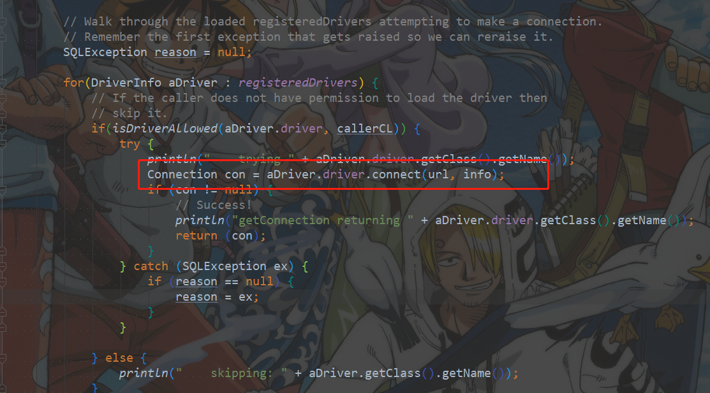
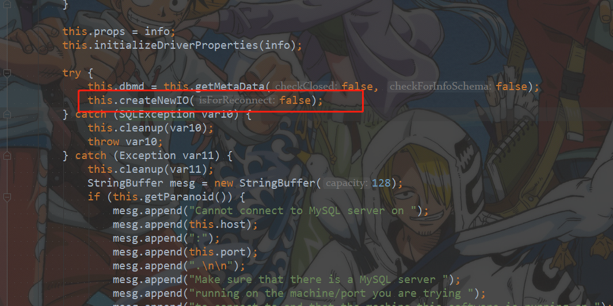

# 一、JDBC如何跟数据库通讯

首先解析传进去的url地址，然后通过UDP,DNS解析完后生成TCP三次握手连接，建立一个代理层，对数据库的所有查询都通过这个代理层实现。类似RPC

# 二、JDBC连接数据库

```java
import java.sql.Connection;
import java.sql.DriverManager;
import java.sql.Statement;
 
 
/*
 * JDBC操作数据库的步骤:
 * 1.注册驱动
 * 		告知JVM使用的是哪一个数据库的驱动
 * 2.获得连接
 * 		使用JDBC中的类,完成对mysql数据库的连接(TCP协议)
 * 3.获得语句执行平台
 * 		通过连接对象获取对SQL语句的执行者对象
 * 4.执行sql语句
 * 		使用执行者对象,向数据库执行SQL语句
 * 		获取数据库的执行后的结果
 * 5.处理结果
 * 6.释放资源
 * 		调用一堆close
 */
public class JDBCTest {
 
	public static void main(String[] args) throws Exception {
 
		// 1. 注册驱动
		// 使用java.sql.DriverManager类的静态方法registerDriver(Driver driver)
		// Driver是一个接口,参数传递:MySQL驱动程序的实现类
		// DriverManager.registerDriver(new Driver());
		// 查看驱动类源码,注册两次驱动,浪费资源
		Class.forName("com.mysql.jdbc.Driver");
		// 2. 获得连接
		// uri:数据库地址 jdbc:mysql://连接主机ip:端口号//数据库名字
		String url = "jdbc:mysql://localhost:3306/test";
		// static Connection getConnection(String url, String user, String password)
		// 返回值是java.sql.Connection接口的实现类,在MySQL驱动程序中
		Connection conn = DriverManager.getConnection(url, "root", "root");
		System.out.println(conn);// com.mysql.jdbc.JDBC4Connection@10d1f30
		// 3. 获得语句执行平台,通过数据库连接对象,获取到SQL语句的执行者对象
		//conn对象,调用方法 Statement createStatement() 获取Statement对象,将SQL语句发送到数据库
		//返回的是Statement接口的实现类对象,在MySQL驱动程序中
		Statement stat = conn.createStatement();
		System.out.println(stat);//com.mysql.jdbc.StatementImpl@137bc9
		// 4. 执行sql语句
		//通过执行者对象调用方法执行SQL语句,获取结果
		//int executeUpdate(String sql)  执行数据库中的SQL语句,仅限于insert,update,delete
		//返回值int,操作成功数据库的行数
		int row = stat.executeUpdate("INSERT INTO sort(sname,sprice,sdesc) VALUES('汽车用品',50000,'疯狂涨价')");
		System.out.println(row);
		// 5. 释放资源
		stat.close();
		conn.close();
	}
 
}

```

# 三、走进JDBC

## 3.1 Driver

```java
//
// Source code recreated from a .class file by IntelliJ IDEA
// (powered by Fernflower decompiler)
//

package com.mysql.jdbc;

import java.sql.DriverManager;
import java.sql.SQLException;

public class Driver extends NonRegisteringDriver implements java.sql.Driver {
    public Driver() throws SQLException {
    }

    static {
        try {
            DriverManager.registerDriver(new Driver());
        } catch (SQLException var1) {
            throw new RuntimeException("Can't register driver!");
        }
    }
}
```

## 3.2 DriverManager

重要方法：getConnection

```java
public static Connection getConnection(String url,
    String user, String password) throws SQLException {
    java.util.Properties info = new java.util.Properties();

    if (user != null) {
        info.put("user", user);
    }
    if (password != null) {
        info.put("password", password);
    }

    return (getConnection(url, info, Reflection.getCallerClass()));
}
```


```java
//  Worker method called by the public getConnection() methods.
private static Connection getConnection(
    String url, java.util.Properties info, Class<?> caller) throws SQLException {
    /*
     * When callerCl is null, we should check the application's
     * (which is invoking this class indirectly)
     * classloader, so that the JDBC driver class outside rt.jar
     * can be loaded from here.
     */
    ClassLoader callerCL = caller != null ? caller.getClassLoader() : null;
    synchronized(DriverManager.class) {
        // synchronize loading of the correct classloader.
        if (callerCL == null) {
            callerCL = Thread.currentThread().getContextClassLoader();
        }
    }

    if(url == null) {
        throw new SQLException("The url cannot be null", "08001");
    }

    println("DriverManager.getConnection(\"" + url + "\")");

    // Walk through the loaded registeredDrivers attempting to make a connection.
    // Remember the first exception that gets raised so we can reraise it.
    SQLException reason = null;

    for(DriverInfo aDriver : registeredDrivers) {
        // If the caller does not have permission to load the driver then
        // skip it.
        if(isDriverAllowed(aDriver.driver, callerCL)) {
            try {
                println("    trying " + aDriver.driver.getClass().getName());
                Connection con = aDriver.driver.connect(url, info);
                if (con != null) {
                    // Success!
                    println("getConnection returning " + aDriver.driver.getClass().getName());
                    return (con);
                }
            } catch (SQLException ex) {
                if (reason == null) {
                    reason = ex;
                }
            }

        } else {
            println("    skipping: " + aDriver.getClass().getName());
        }

    }

    // if we got here nobody could connect.
    if (reason != null)    {
        println("getConnection failed: " + reason);
        throw reason;
    }

    println("getConnection: no suitable driver found for "+ url);
    throw new SQLException("No suitable driver found for "+ url, "08001");
}
```



## 3.3 connect

```java
public Connection connect(String url, Properties info) throws SQLException {
    if (url != null) {
        if (StringUtils.startsWithIgnoreCase(url, "jdbc:mysql:loadbalance://")) {
            return this.connectLoadBalanced(url, info);
        }

        if (StringUtils.startsWithIgnoreCase(url, "jdbc:mysql:replication://")) {
            return this.connectReplicationConnection(url, info);
        }
    }

    Properties props = null;
    if ((props = this.parseURL(url, info)) == null) {
        return null;
    } else {
        try {
            com.mysql.jdbc.Connection newConn = ConnectionImpl.getInstance(this.host(props), this.port(props), props, this.database(props), url);
            return newConn;
        } catch (SQLException var6) {
            throw var6;
        } catch (Exception var7) {
            SQLException sqlEx = SQLError.createSQLException(Messages.getString("NonRegisteringDriver.17") + var7.toString() + Messages.getString("NonRegisteringDriver.18"), "08001");
            sqlEx.initCause(var7);
            throw sqlEx;
        }
    }
}
```

## 3.4 getInstance

```java
protected static Connection getInstance(String hostToConnectTo, int portToConnectTo, Properties info, String databaseToConnectTo, String url) throws SQLException {
    return (Connection)(!Util.isJdbc4() ? new ConnectionImpl(hostToConnectTo, portToConnectTo, info, databaseToConnectTo, url) : (Connection)Util.handleNewInstance(JDBC_4_CONNECTION_CTOR, new Object[]{hostToConnectTo, Constants.integerValueOf(portToConnectTo), info, databaseToConnectTo, url}));
}
```

## 3.5 ConnectionImpl



## 3.6 createNewIO

3.7 kill -9的原理