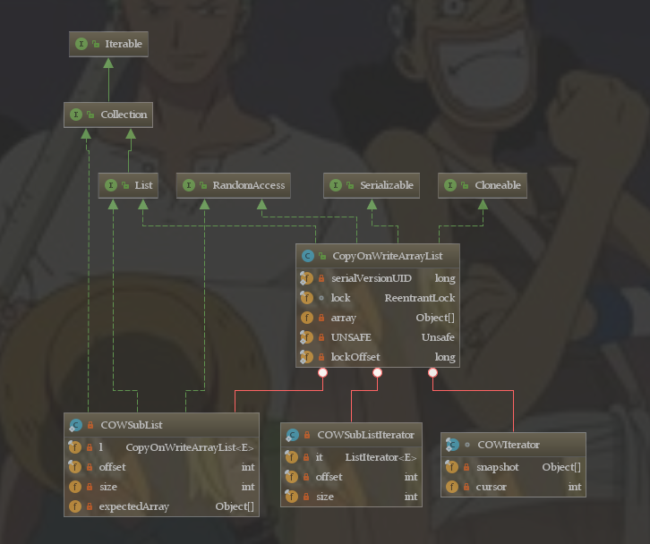
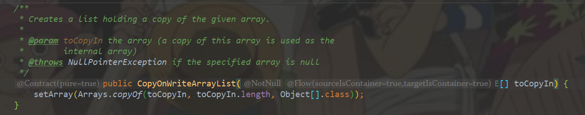
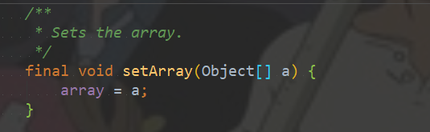
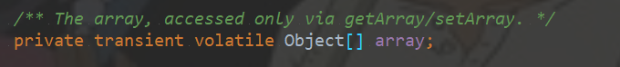
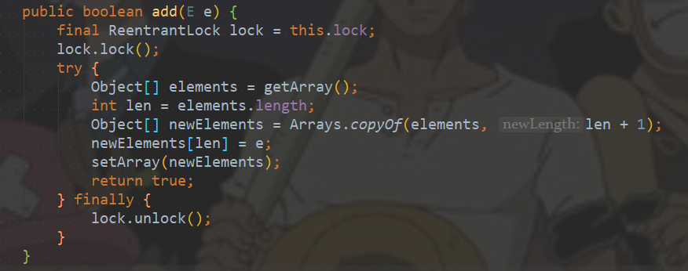
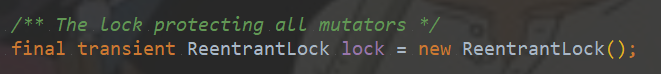
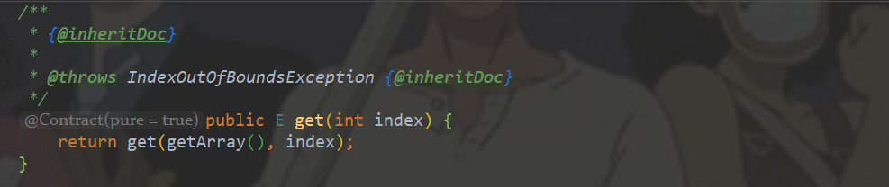
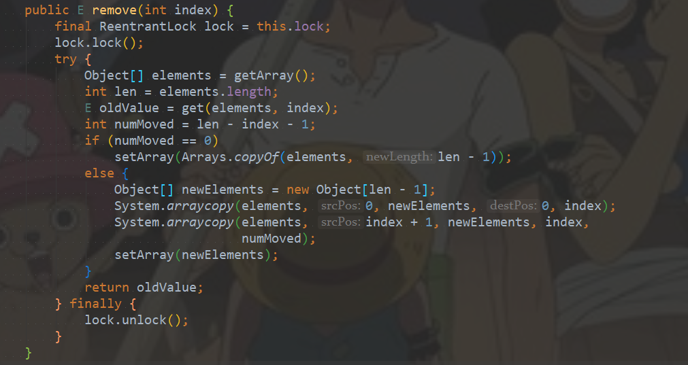

#### 一、介绍

它相当于线程安全的ArrayList。和ArrayList一样，它是个可变数组；但是和ArrayList不同的时，它具有以下特性： 

1. 它最适合于具有以下特征的应用程序：List 大小通常保持很小，只读操作远多于可变操作，需要在遍历期间防止线程间的冲突。
2. 它是线程安全的。 
3. 因为通常需要复制整个基础数组，所以可变操作（add()、set() 和 remove() 等等）的开销很大。
4. 迭代器支持hasNext(), next()等不可变操作，但不支持可变 remove()等操作。 
5. 使用迭代器进行遍历的速度很快，并且不会与其他线程发生冲突。在构造迭代器时，迭代器依赖于不变的数组快照。 

#### 二、原理和数据结构



**说明**： 

1. CopyOnWriteArrayList实现了List接口，因此它是一个队列。 
2. CopyOnWriteArrayList包含了成员lock。每一个CopyOnWriteArrayList都和一个互斥锁lock绑定，通过lock，实现了对CopyOnWriteArrayList的互斥访问。 
3. CopyOnWriteArrayList包含了成员array数组，这说明CopyOnWriteArrayList本质上通过数组实现的。 

**下面从“动态数组”和“线程安全”两个方面进一步对CopyOnWriteArrayList的原理进行说明。** 

1. **CopyOnWriteArrayList的“动态数组”机制** ：它内部有个“volatile数组”(array)来保持数据。在“添加/修改/删除”数据时，都会新建一个数组，并将更新后的数据拷贝到新建的数组中，最后再将该数组赋值给“volatile数组”。这就是它叫做CopyOnWriteArrayList的原因！CopyOnWriteArrayList就是通过这种方式实现的动态数组；不过正由于它在“添加/修改/删除”数据时，都会新建数组，**所以涉及到修改数据的操作，CopyOnWriteArrayList效率很 低**；**但是单单只是进行遍历查找的话，效率比较高**。

2. **CopyOnWriteArrayList的“线程安全”机制** -- 是通过volatile和互斥锁来实现的。
   ① CopyOnWriteArrayList是通过“volatile数组”来保存数据的。一个线程读取volatile数组时，总能看到其它线程对该volatile变量最后的写入；就这样，通过volatile提供了“读取到的数据总是最新的”这个机制的 保证。

   ②CopyOnWriteArrayList通过互斥锁来保护数据。在“添加/修改/删除”数据时，会先“获取互斥锁”，再修改完毕之后，先将数据更新到“volatile数组”中，然后再“释放互斥锁”；这样，就达到了保护数据的目的。  

#### 三、方法列表

```java
// 创建一个空列表。
CopyOnWriteArrayList()
// 创建一个按 collection 的迭代器返回元素的顺序包含指定 collection 元素的列表。
CopyOnWriteArrayList(Collection<? extends E> c)
// 创建一个保存给定数组的副本的列表。
CopyOnWriteArrayList(E[] toCopyIn)

// 将指定元素添加到此列表的尾部。
boolean add(E e)
// 在此列表的指定位置上插入指定元素。
void add(int index, E element)
// 按照指定 collection 的迭代器返回元素的顺序，将指定 collection 中的所有元素添加此列表的尾部。
boolean addAll(Collection<? extends E> c)
// 从指定位置开始，将指定 collection 的所有元素插入此列表。
boolean addAll(int index, Collection<? extends E> c)
// 按照指定 collection 的迭代器返回元素的顺序，将指定 collection 中尚未包含在此列表中的所有元素添加列表的尾部。
int addAllAbsent(Collection<? extends E> c)
// 添加元素（如果不存在）。
boolean addIfAbsent(E e)
// 从此列表移除所有元素。
void clear()
// 返回此列表的浅表副本。
Object clone()
// 如果此列表包含指定的元素，则返回 true。
boolean contains(Object o)
// 如果此列表包含指定 collection 的所有元素，则返回 true。
boolean containsAll(Collection<?> c)
// 比较指定对象与此列表的相等性。
boolean equals(Object o)
// 返回列表中指定位置的元素。
E get(int index)
// 返回此列表的哈希码值。
int hashCode()
// 返回第一次出现的指定元素在此列表中的索引，从 index 开始向前搜索，如果没有找到该元素，则返回 -1。
int indexOf(E e, int index)
// 返回此列表中第一次出现的指定元素的索引；如果此列表不包含该元素，则返回 -1。
int indexOf(Object o)
// 如果此列表不包含任何元素，则返回 true。
boolean isEmpty()
// 返回以恰当顺序在此列表元素上进行迭代的迭代器。
Iterator<E> iterator()
// 返回最后一次出现的指定元素在此列表中的索引，从 index 开始向后搜索，如果没有找到该元素，则返回 -1。
int lastIndexOf(E e, int index)
// 返回此列表中最后出现的指定元素的索引；如果列表不包含此元素，则返回 -1。
int lastIndexOf(Object o)
// 返回此列表元素的列表迭代器（按适当顺序）。
ListIterator<E> listIterator()
// 返回列表中元素的列表迭代器（按适当顺序），从列表的指定位置开始。
ListIterator<E> listIterator(int index)
// 移除此列表指定位置上的元素。
E remove(int index)
// 从此列表移除第一次出现的指定元素（如果存在）。
boolean remove(Object o)
// 从此列表移除所有包含在指定 collection 中的元素。
boolean removeAll(Collection<?> c)
// 只保留此列表中包含在指定 collection 中的元素。
boolean retainAll(Collection<?> c)
// 用指定的元素替代此列表指定位置上的元素。
E set(int index, E element)
// 返回此列表中的元素数。
int size()
// 返回此列表中 fromIndex（包括）和 toIndex（不包括）之间部分的视图。
List<E> subList(int fromIndex, int toIndex)
// 返回一个按恰当顺序（从第一个元素到最后一个元素）包含此列表中所有元素的数组。
Object[] toArray()
// 返回以恰当顺序（从第一个元素到最后一个元素）包含列表所有元素的数组；返回数组的运行时类型是指定数组的运行时类型。
<T> T[] toArray(T[] a)
// 返回此列表的字符串表示形式。
String toString()
```

#### 四、源码分析

从“**创建**，**添加**，**获取**，**删除**”这4个方面去分析CopyOnWriteArrayList的原理。 

##### 4.1 创建

CopyOnWriteArrayList共3个构造函数。它们的源码如下： 




这3个构造函数都调用了setArray()，setArray()的源码如下： 



setArray()的作用是给array赋值；其中，array是volatile transient Object[]类型，即array是“volatile数组”。



关于volatile关键字的作用就是让变量变得可见，即对一个volatile变量的读，总是能看到（任意线程）对这个volatile变量最后的写入。正在由于这种特性，每次更新了“volatile数组”之后，其它线程都能看到对它所做的更新。 关于transient关键字，它是在序列化中才起作用，transient变量不会被自动序列化。

##### 4.2 添加

以add(E e)为例，来对“CopyOnWriteArrayList的添加操作”进行说明。下面是add(E e)的代码： 



首先获取锁，然后获取原始"volatile数组"中的数据(elements)和长度(len)，紧接着新建一个数组(newElements)并且将elements拷贝进去，长度设置为len+1；准备工作完成后，将要添加的值e放入newElements中，并将newElements重新赋值给“volatile数组”，最后将锁释放。

这个过程中最重要的一点就是lock锁（可重入锁）的使用：



##### 4.3 获取

以get(int index)为例，来对“CopyOnWriteArrayList的获取操作”进行说明。下面是get(int index)的代码： 




##### 4.4 删除

以remove(int index)为例，来对“CopyOnWriteArrayList的删除操作”进行说明。下面是remove(int index)的代码： 



emove(int index)的作用就是将”volatile数组“中第index个元素删除。它的实现方式是，先获取锁，然后进行判断：如果被删除的是最后一个元素，则直接通过Arrays.copyOf()进行处理，而不需要新建数组；否则，新建数组，然后将”volatile数组中被删除元素之外的其它元素“拷贝到新数组中；最后，将新数组赋值给”volatile数组“，将锁释放。

#### 五、使用

```java
package com.juc.copyonwritearraylist;

import java.lang.reflect.Field;
import java.util.concurrent.CopyOnWriteArrayList;

/**
 * @Author: 98050
 * @Time: 2018-12-21 20:48
 * @Feature: CopyOnWriteArrayList的使用
 */
public class Test {

    public static void main(String[] args) throws InterruptedException, NoSuchFieldException, IllegalAccessException {

        final CopyOnWriteArrayList<String> list = new CopyOnWriteArrayList<String>();

        /**
         * 线程1将0——9填充到list中
         */
        new Thread(new Runnable() {
            @Override
            public void run() {
                for (int i = 0; i < 10; i++) {
                    try {
                        Thread.sleep(10);
                    } catch (InterruptedException e) {
                        e.printStackTrace();
                    }
                    list.add(Thread.currentThread().getName() + "添加:" + i);
                }
            }
        }).start();


        /**
         * 线程2将10——19填充到list中
         */
        new Thread(new Runnable() {
            @Override
            public void run() {
                for (int i = 10; i < 20; i++) {
                    try {
                        Thread.sleep(10);
                    } catch (InterruptedException e) {
                        e.printStackTrace();
                    }
                    list.add(Thread.currentThread().getName() + "添加:" + i);
                }
            }
        }).start();

        Thread.sleep(1000);


        Class<CopyOnWriteArrayList> calss = (Class<CopyOnWriteArrayList>) list.getClass();
        Field field = calss.getDeclaredField("array");
        field.setAccessible(true);
        Object[] objects = (Object[]) field.get(list);
        System.out.println("list的容量：" + objects.length);
        for (int i = 0; i < objects.length; i++) {
            System.out.println(objects[i]);
        }
    }
}
```

运行结果：


#### 六、缺点

CopyOnWrite容器有很多优点，但是同时也存在两个问题，即内存占用问题和数据一致性问题。所以在开发的时候需要注意一下。

##### 6.1 内存占用问题

因为CopyOnWrite的写时复制机制，所以在进行写操作的时候，内存里会同时驻扎两个对象的内存，旧的对象和新写入的对象（注意:在复制的时候只是复制容器里的引用，只是在写的时候会创建新对象添加到新容器里，而旧容器的对象还在使用，所以有两份对象内存）。如果这些对象占用的内存比较大，比如说200M左右，那么再写入100M数据进去，内存就会占用300M，那么这个时候很有可能造成频繁的Yong GC和Full GC。

针对内存占用问题，可以通过压缩容器中的元素的方法来减少大对象的内存消耗，比如，如果元素全是10进制的数字，可以考虑把它压缩成36进制或64进制。或者不使用CopyOnWrite容器，而使用其他的并发容器，如ConcurrentHashMap。

##### 6.2 数据一致性问题

CopyOnWrite容器只能保证数据的最终一致性，不能保证数据的实时一致性。所以如果你希望写入的的数据，马上能读到，请不要使用CopyOnWrite容器。

　　


**参考**：https://www.cnblogs.com/skywang12345/p/3498483.html 