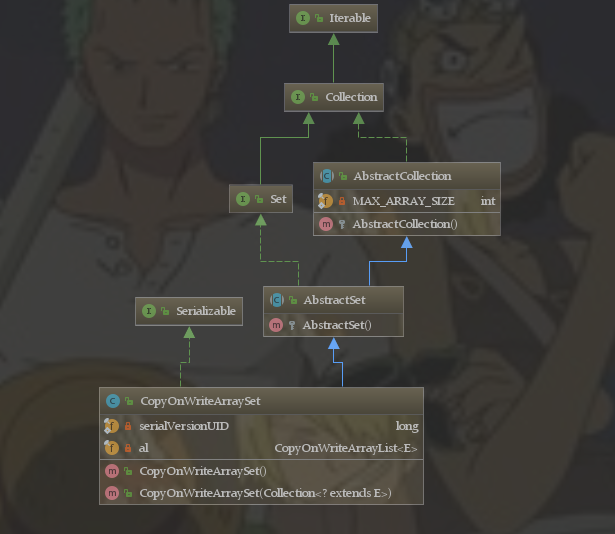
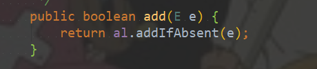
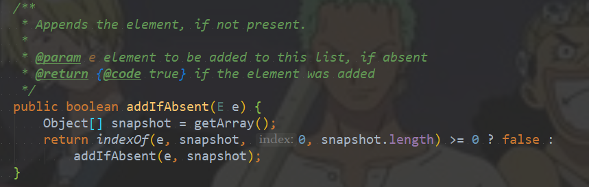
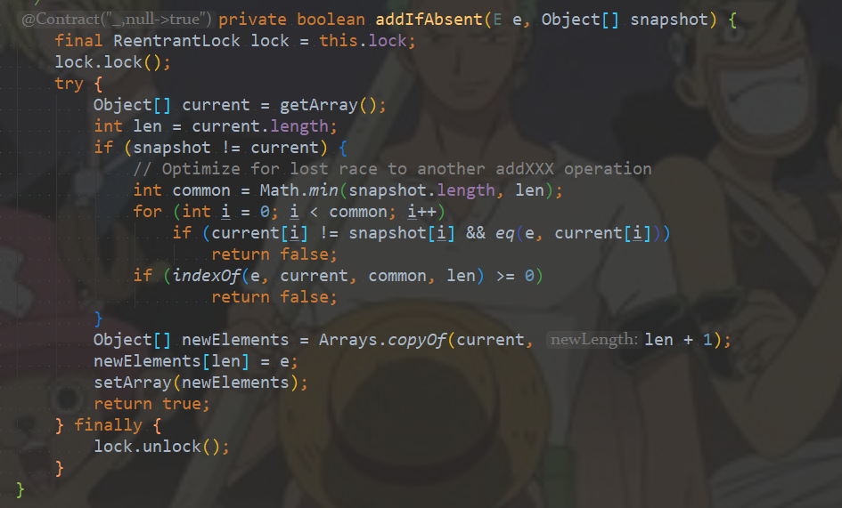

#### 一、介绍

CopyOnWriteArraySet它是线程安全的无序的集合，可以将它理解成线程安全的HashSet。CopyOnWriteArraySet和HashSet虽然都继承于共同的父类AbstractSet，但是，HashSet是通过散列表(HashMap)实现的，而CopyOnWriteArraySet则是通过动态数组(CopyOnWriteArrayList)实现的，并不是散列表。 和CopyOnWriteArrayList类似，CopyOnWriteArraySet具有以下特性： 

1. 它最适合于具有以下特征的应用程序：Set 大小通常保持很小，只读操作远多于可变操作，需要在遍历期间防止线程间的冲突。 
2. 它是线程安全的。 
3. 因为通常需要复制整个基础数组，所以可变操作（add()、set() 和 remove() 等等）的开销很大。
4. 迭代器支持hasNext(), next()等不可变操作，但不支持可变 remove()等 操作。
5. 使用迭代器进行遍历的速度很快，并且不会与其他线程发生冲突。在构造迭代器时，迭代器依赖于不变的数组快照。 

#### 二、原理和数据结构



**说明**：   

1. CopyOnWriteArraySet继承于AbstractSet，这就意味着它是一个集合。   
2. CopyOnWriteArraySet包含CopyOnWriteArrayList对象，它是通过CopyOnWriteArrayList实现的。而CopyOnWriteArrayList本质是个动态数组队列， **所以CopyOnWriteArraySet相当于通过通过动态数组实现的“集合”**！ CopyOnWriteArrayList中允许有重复的元素；但是，CopyOnWriteArraySet是一个集合，所以它不能有重复集合。因此，CopyOnWriteArrayList额外提供了**addIfAbsent()**和**addAllAbsent()**这两个添加元素的API，通过这些API来添加元素时，只有当元素不存在时才执行添加操作！
3. 至于CopyOnWriteArraySet的“线程安全”机制，和CopyOnWriteArrayList一样，是通过volatile和互斥锁来实现的。

#### 三、方法列表

```java
// 创建一个空 set。
CopyOnWriteArraySet()
// 创建一个包含指定 collection 所有元素的 set。
CopyOnWriteArraySet(Collection<? extends E> c)

// 如果指定元素并不存在于此 set 中，则添加它。
boolean add(E e)
// 如果此 set 中没有指定 collection 中的所有元素，则将它们都添加到此 set 中。
boolean addAll(Collection<? extends E> c)
// 移除此 set 中的所有元素。
void clear()
// 如果此 set 包含指定元素，则返回 true。
boolean contains(Object o)
// 如果此 set 包含指定 collection 的所有元素，则返回 true。
boolean containsAll(Collection<?> c)
// 比较指定对象与此 set 的相等性。
boolean equals(Object o)
// 如果此 set 不包含任何元素，则返回 true。
boolean isEmpty()
// 返回按照元素添加顺序在此 set 中包含的元素上进行迭代的迭代器。
Iterator<E> iterator()
// 如果指定元素存在于此 set 中，则将其移除。
boolean remove(Object o)
// 移除此 set 中包含在指定 collection 中的所有元素。
boolean removeAll(Collection<?> c)
// 仅保留此 set 中那些包含在指定 collection 中的元素。
boolean retainAll(Collection<?> c)
// 返回此 set 中的元素数目。
int size()
// 返回一个包含此 set 所有元素的数组。
Object[] toArray()
// 返回一个包含此 set 所有元素的数组；返回数组的运行时类型是指定数组的类型。
<T> T[] toArray(T[] a)
```

#### 四、源码分析

CopyOnWriteArraySet是通过CopyOnWriteArrayList实现的，它的API基本上都是通过调用CopyOnWriteArrayList的API来实现的。相信对CopyOnWriteArrayList了解的话，对CopyOnWriteArraySet的了解是水到渠成的事；所以，这里只看一下add方法是如何实现元素唯一的：



add方法中调用了addIfAbsent(E e)方法：



判断一下元素e在数组中是否存在，存在的话就返回false，不存在的话调用addIfAbsent(E e, Object[] snapshot)方法进行元素的添加：



首先获取锁，然后比较传过来的数组snapshot和"volatile数组"是否完全相同，因为此时可能有其它线程刚对"volatile数组"添加完元素e，使用"!="进行比较就是为了判断两个指针是否指向同一地址：

- 不相同的话，先得到两个数组长度的最小值，紧接着获取current里面改变后的元素，使用eq方法判断是否和e相等。对未比较过的元素执行indexof方法，要是有重复的话就返回false。
- 相同的话就新建一个数组，然后将元素e插入，将新数组赋值给"volatile数组"，最后再释放锁。

以上两个方法都是CopyOnWriteArrayList中的。

#### 五、使用

```java
package com.juc.copyonwritearrayset;

import java.lang.reflect.Field;
import java.util.concurrent.CopyOnWriteArrayList;
import java.util.concurrent.CopyOnWriteArraySet;

/**
 * @Author: 98050
 * @Time: 2018-12-22 16:50
 * @Feature: copyOnWriteArraySet的使用
 */
public class Test {

    public static void main(String[] args) throws InterruptedException, NoSuchFieldException, IllegalAccessException {

        final CopyOnWriteArraySet<Integer> list = new CopyOnWriteArraySet<Integer>();

        /**
         * 线程1将0——9填充到set中
         */
        new Thread(new Runnable() {
            @Override
            public void run() {
                for (int i = 0; i < 10; i++) {
                    try {
                        Thread.sleep(10);
                    } catch (InterruptedException e) {
                        e.printStackTrace();
                    }
                    list.add(i);
                }
            }
        }).start();


        /**
         * 线程2将10——19填充到set中
         */
        new Thread(new Runnable() {
            @Override
            public void run() {
                for (int i = 10; i < 20; i++) {
                    try {
                        Thread.sleep(10);
                    } catch (InterruptedException e) {
                        e.printStackTrace();
                    }
                    list.add(i);
                }
            }
        }).start();

        Thread.sleep(1000);


        Class<CopyOnWriteArraySet> calss = (Class<CopyOnWriteArraySet>) list.getClass();
        Field field = calss.getDeclaredField("al");
        field.setAccessible(true);
        CopyOnWriteArrayList copyOnWriteArrayList = (CopyOnWriteArrayList) field.get(list);

        Class<CopyOnWriteArrayList> calss2 = (Class<CopyOnWriteArrayList>) copyOnWriteArrayList.getClass();
        Field field2 = calss2.getDeclaredField("array");
        field2.setAccessible(true);
        Object[] objects = (Object[]) field2.get(copyOnWriteArrayList);

        System.out.println("list的容量：" + objects.length);
        for (int i = 0; i < objects.length; i++) {
            System.out.println("第"+(i+1)+"个元素：" + objects[i]);
        }
    }
}
```

结果：

