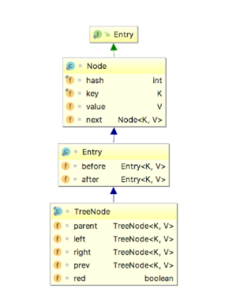
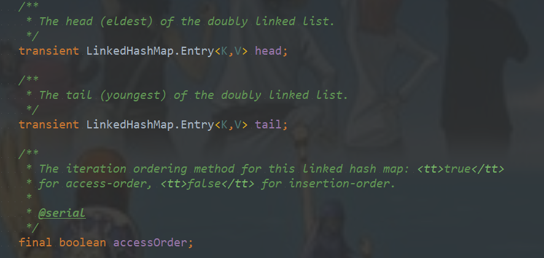

# 一、介绍

 LinkedHashMap是Map接口的哈希表和链接列表实现，具有可预知的迭代顺序。此实现提供所有可选的映射操作，并允许使用null值和null键。此类不保证映射的顺序，特别是它不保证该顺序恒久不变。
   LinkedHashMap实现与HashMap的不同之处在于，后者维护着一个运行于所有条目的双重链接列表。此链接列表定义了迭代顺序，该迭代顺序可以是插入顺序或者是访问顺序。
   注意，此实现不是同步的。如果多个线程同时访问链接的哈希映射，而其中至少一个线程从结构上修改了该映射，则它必须保持外部同步。

# 二、数据结构

## 2.1 LinkedHashMap的数据结构

可以从上图中看到，LinkedHashMap数据结构相比较于HashMap来说，添加了双向指针，分别指向前一个节点——**before**和后一个节点——**after**，从而将所有的节点已链表的形式串联一起来，从名字上来看LinkedHashMap与HashMap有一定的联系，实际上也确实是这样，LinkedHashMap继承了HashMap，重写了HashMap的一部分方法，从而加入了链表的实现。让我们来看一下它们的继承关系。

## 2.2 继承关系

Entry作为基本的节点，可以看到LinkedHashMap的Entry继承自HashMap的Node，在其基础上加上了before和after两个指针，而TreeNode作为HashMap和LinkedHashMap的树节点，继承自LinkedHahsMap的Entry，并且加上了树节点的相关指针，另外提一点：before和parent的两个概念是不一样的，before是相对于链表来的，parent是相对于树操作来的，所以要分两个。

# 三、源码解析

## 3.1 成员变量

## 3.2 构造方法

跟HashMap类似的构造方法，里面唯一的区别就是添加了前面提到的accessOrder，默认赋值为false——按照插入顺序来排列。

3.3 

# 四、遍历方式

# 五、示例