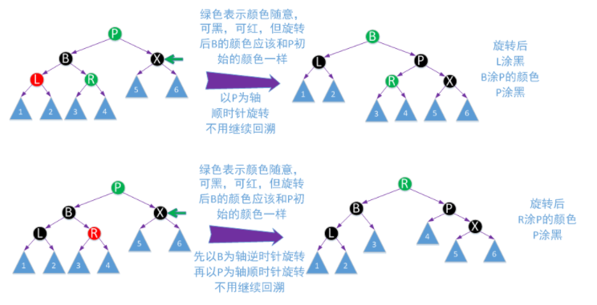

#### 一、BT

二叉树，略。

#### 二、BST

##### 2.1 定义

1. 若它的左子树不空，则左子树上的关键字的值均小于根关键字的值。
2. 若它的右子树不空，则右子树上的关键字的值均大于根关键字的值。
3. 左右子树又各是一棵二叉排序树

##### 2.2 查找

二叉排序树的查找从根节点开始，沿着某一个分支逐层向下比较。先和根节点比较，大于的话在又子树继续查找，小于的话在左子树查找。

##### 2.3 插入

在查找过程中，当树中不存在关键字等于给定值的节点时再进行插入

##### 2.4 删除

删除操作的实现有下面三种情况：

1. 如果被删除节点z是叶子节点，则直接删除。
2. 若节点z只有一棵左子树或右子树，则让z的子树成为z父节点的子树，替代z的位置。
3. 若节点z有左、右两棵子树，则令z的直接后继（或直接前驱）替代z，然后从二叉排序树中删除这个直接后继（或直接前驱），这样就转换为第一或第二种情况。

#### 三、AVL树

##### 3.1 定义

为了避免树的高度增长过快，降低二叉排序树的性能，规定在插入和删除二叉树节点时，要保证任意节点的左、右子树高度差的绝对值不超过1，就将这样的二叉树称为平衡二叉树。

##### 3.2 插入

平衡二叉树的插入过程种需要进行平衡调整，分为四种情况：LL型、RR型、LR型和RL型。通过例题来综合体会一下平衡二叉树的建立、平衡调整以及关键字的删除过程。

**例：一关键字序列{16，3，7，11，9，26，18，14，15}构造一棵AVL树，构造完成后删除节点16，15，11。**

> **建立二叉树**

1）插入节点16，3。

2）插入7后出现不平衡现象，此时失去平衡的最小子树根节点为16，进行LR型调整。

3）插入节点11。

4）插入9后出现不平衡现象，此时失去平衡的最小子树根节点为16，进行LL调整。

5）插入26后出现不平衡现象，此时失去平衡的最小子树根节点为7，进行RR调整。

6）插入18后出现不平衡现象，此时失去平衡的最小子树根节点为16，进行RL调整。

7）插入14。

8）插入15后出现不平衡现象，此时失去平衡的最小子树根节点为16，进行LR调整。

> **删除节点**

和普通BST删除的方式一样。

1）删除16

2）删除15

3）删除11

#### 四、B- 树

##### 4.1 概念

B-树中所有节点孩子节点个数的最大值称为B-树的阶，通常用m表示，从查找效率考虑，要求m≥3。一棵m阶的B-树或者是一棵空树，或者是满足以下要求的m叉树：

1） 每个节点最多有m个分支（子树）；而最少分支棵树要看是否为根节点，根节点至少有2个分支，非根节点至少有 **⌈m/2⌉** 个分支

2）有n（k≤n≤m）个分支节点有n-1个关键字，它们按递增顺序排列。k=2（根节点）或**⌈m/2⌉** （非根节点）

3）每个节点的结构为：

|  n   |  k1  |  k2  |  ……  |  kn  |
| :--: | :--: | :--: | :--: | :--: |
|  p0  |  p1  |  p2  |  ……  |  pn  |

其中：
$$
n为该节点中关键字的个数；
$$

$$
k_{i}（1≤i≤n）为该节点的关键字且满足k_{i} < k_{i+1};
$$

$$
p_{i}（0≤i≤n) 为该节点的孩子节点指针，且满足p_{i}（1≤i≤n-1）所指节点上的关键字大于k_{i}且小于k_{i+1}；
$$

$$
p_{0}所指节点上的关键字小于k_{1}；
$$

$$
p_{n}所指节点上的的关键字大于k_{n}
$$

4）节点内各关键字互不相等且从小到大排列。

5）各个底层节点是叶节点，它们处于同一层；叶节点下面是失败节点，是查找失败到达的位置。

##### 4.2 插入

对于关键字的插入，需要找到插入位置。在B-树的查找过程中，当遇到空指针时，则证明查找不成功，同时也找到了插入位置，即根据空指针可以确定在叶子节点中的插入位置。由此可见，**B-树的插入总是发生在叶子节点上**。

插入过程中可能破坏B-树的特性，当插入后的节点关键字个数大于m-1（每个查找成功节点的关键字个数都在【**⌈m/2⌉**  - 1 ， m - 1】之间），则需要进行分裂。具体的分裂方法为：原节点从中间位置将其中的关键字分为两部分，左部分包含的关键字防止原节点中，右部分包含的关键字放在新节点中，中间位置（**⌈m/2⌉**）的节点插入到原节点的父节点中。若此时导致 父节点的关键字个数也超出范围，那么父节点继续分裂即可。

对于m=3的B树，所有节点中关键字树最多为2，下图为3阶B树插入过程中溢出问题的解决方式：

##### 4.3 删除

删除过程中也可能破坏B-树的特性，比如旧关键字的删除可能使得节点中的关键字的个数少于规定个数，这时可能需要向其兄弟节点**借关键字**或者和其孩子节点进行**关键字交换**，也可能需要进行**节点的合并**。

> **当所删除的关键字k不在终端节点中时**

1）如果小于k的子树中关键字个数大于**⌈m/2⌉**-1，则找出k的前驱值k'，k'与k关键字互换，然后删除k'即可。

2）如果大于k的子树中关键字个数大于**⌈m/2⌉**-1，则找出k的后继值k'，k'与k关键字互换，然后删除k'即可。

3）如果前后两个子树的关键字个数均为**⌈m/2⌉**-1，则直接将两个子节点合并，直接删除k即可。

下图为4阶B-树的一部分：

> **当所删除的关键字k在终端节点中时**

1）直接删除关键字：若被删关键字所在节点的关键字个数大于**⌈m/2⌉**-1，则直接删除该关键字

2）兄弟够借：若被删关键字所在节点的关键字个数等于**⌈m/2⌉**-1，且与此节点相邻的左（右）兄弟节点的关键字个数大于等于**⌈m/2⌉**，需要调整该节点、左（右）兄弟节点以及其双亲节点（父子换位法），以达到平衡。

3）兄弟不够借：若被删关键字所在节点的关键字个数等于**⌈m/2⌉**-1，且与此节点相邻的左（右）兄弟节点的关键字个数等于**⌈m/2⌉**-1，则将关键字删除后与左（右）兄弟节点及双亲节点中的关键字进行合并。

在合并过程中，双亲节点中的关键字个数会减少。若其双亲节点是根节点并且关键字个数减少至0（根节点关键字个数为1，右两棵子树），则直接删除根节点，合并后的新节点成为根；若双亲节点不是根节点，且关键字个数减少到**⌈m/2⌉** - 2，又要与它自己的兄弟节点进行调整或合并操作，并重复上述步骤，直到符合B-树的要求为止。

**2-3树：3阶B-树**

**2-3-4树：4阶B-树**

#### 五、红黑树

##### 5.1 概念

红黑树是每个节点都带有颜色属性的平衡二叉查找树 ，颜色为红色或黑色。除了二叉查找树一般要求以外，对于任何有效的红黑树我们增加了如下的额外要求:

（1） 节点是要么红色或要么是黑色。

（2） 根一定是黑色节点。

（3） 每个叶子结点都带有两个空的黑色结点（称之为NIL节点，它又被称为黑哨兵）。

（4） 每个红色节点的两个子节点都是黑色（或者说从每个叶子到根的所有路径上不能有两个连续的红色节点）。

（5） 从任一节点到它所能到达得叶子节点的所有简单路径都包含相同数目的黑色节点。

这些性质保证了**根节点到任意叶子节点的路径长度，最多相差一半**（因为路径上的黑色节点相等，差别只是不能相邻的红色节点个数），所以红黑树是一个基本平衡的二叉搜索树，**它没有AVL树那么绝对平衡，但是同样的关键字组成的红黑树相比AVL旋转操作要少，而且删除操作也比AVL树效率更高，实际应用效果也比AVL树更出众。**

红黑树的这5个性质中，第3点是比较难理解的，但它却非常有必要。如上图所示，如果不使用黑哨兵，它完全满足红黑树性质，根结点5到两个叶结点1和叶结点9路径上的黑色结点数都为3个，且没有连续红色节点。

但如果加入黑哨兵后，叶结点的个数变为8个黑哨兵，根结点5到这8个叶结点路径上的黑高度就不一样了，所以它并不是一棵红黑树。

##### 5.2 2-3-4树和红黑树的等价关系

2-3-4树（4阶B-树）和红黑树是完全等价的，由于绝大多数编程语言直接实现2-3-4树会非常繁琐，所以一般是通过实现红黑树来实现替代2-3-4树，而红黑树本也同样保证在O(lgn)的时间内完成查找、插入和删除操作。

下图中所有红色节点都与其父节点构成3或4节点，其它节点为2节点。 

所以红黑树的每一类型操作都与2-3-4树一一对应。黑色节点的个数（或者说位置）对应2-3-4树中的节点个数（或者说位置），这样可以很好的理解性质4（从每个叶子到根的所有路径上不能有两个连续的红色节点）和性质5（从任一节点到它所能到达得叶子节点的所有简单路径都包含相同数目的黑色节点）以及**根节点到任意叶子节点的路径长度，最多相差一半**。

同时还需要明白的是，一颗红黑树对应唯一形态的2-3-4树，但是一颗2-3-4树可以对应多种形态的红黑树（主要是3节点可以对应两种不同的红黑树形态），上图中的2-3-4树还可以对应下图中的红黑树。我们在后面红黑树的删除操作中会利用这种情况。

##### 5.3 红黑树中的变色和旋转

变色：为了符合红黑树的规则，会把节点红变黑或者黑变红。

旋转：和平衡二叉树中LL、RR调整一样。

##### 5.4 插入

（1）如果红黑树中已存在待插入的值，那么插入操作失败，否则一定是在叶子节点进行插入操作。

（2）当我们插入一个新节点后，**我们会把该节点涂红**（涂红操作，从2-3-4树的的角度看来，就是向上层节点进位一个key），由于插入操作可能破坏了红黑树的平衡性，所以我们需要不断回溯，进行调整。调整过程就是颜色变换和旋转操作，而这些操作都可以从2-3-4树来理解。考虑到回溯的情况，从2-3-4树的角度，我们可以把X节点看成向上层进位的key。

插入新节点时，我们可能会遇到以下几种情况：

> **黑父**

插入后直接涂红，如果父亲节点是个黑色，插入结束。

绿色箭头表示插入的位置，上图中的虚线表示可以有该节点，也可以没有该节点，如果有，一定是红色。当然还有可能在对称的情况，即在右子支插入，操作方式都是一样的，由于不涉及到旋转操作，所以代码的实现方式也一样，不在赘述。

这个操作可以从2-3-4树来理解，相当于2-3-4树中待插入的叶子节点是个2节点（对应黑父没有孩子节点）或者3节点（黑父有孩子节点，孩子节点的颜色一定是红色）。在回溯调整的过程中也会遇到这个情况，回溯时X表示的是下一层向上进位的key，到这个时候就不需要继续回溯了。

> **红父黑叔**

上图中的U也可以为空。

这种情况还有对应的镜像情况，即P为G的右子支情况 ：

> **红父红叔**

如果G为根节点，那么就不变色，仍为黑色。

> **示例**

根据序列：{12，1，9，2，0，11，7，19，4，15，18，5，14，13，10，16，6，3，8，17}构造一棵红黑树。

1）插入12，根节点直接插入，涂黑。

2）插入1（黑父），直接涂红。

3）插入12（黑父），直接涂红。

4）插入2（红父红叔）

因为9是根节点，所以就不变色了，只把1和12涂黑。

5）插入0（黑父），直接涂红。

6）插入11（黑父），直接涂红

7）插入7（红父红叔）

8）插入19（黑父），直接涂红

9）插入4（红父黑叔（黑null）），相当于平衡二叉树中的RL调整

10）插入15（红父红叔），变色即可。

11）插入18（红父黑叔（黑null）），相当于平衡二叉树中的LR调整

12）插入5（红父红叔）

13）插入14（红父红叔）

14）插入13（红父黑叔（黑null）），相当于平衡二叉树中的RR调整

15）插入10（黑父）

16）插入16

<1> 红父红叔

<2>此时14和18都是红色，但是又不能把18改为黑色，所以要进行RL调整：

<3>将其余部分进行调整

17）插入6（红父黑叔（黑null）），类似于平衡二叉树中的LR调整

18）插入3（黑父），直接涂红

19）插入8（红父红叔），变色

20）插入17（红父黑叔（黑null）），类似于平衡二叉树中的RR调整

##### 5.5 删除

删除操作可以概括为以下几个步骤：

（1）查找要删除的值所在的节点，如果不存在，删除失败，否则执行步骤2

（2）如果要删除的节点不是叶子节点，用要删除节点的后继节点替换（只进行数据替换即可，颜色不变，此时也不需要调整结构），然后删除后继节点。

那么真正需要删除的节点有以下几种可能性：

> **被删节点为红色**

> **要删除节点为黑色，且有一个孩子节点，这个孩子节点必然为红色**

> **要删除的节点为黑色，孩子节点都是null**

这时，删除这个黑色节点后需要进行调整：

<1> 黑兄红侄

这种情况还有对应的镜像情况，即P为G的右子支情况 

上述两种情况大致对应2-3-4树删除操作中兄弟节点为3节点或4节点，父节点key下移，兄弟节点key上移动，但不完全一致。 

<2>黑兄黑侄红父

上述两种情况都对应2-3-4树删除操作中兄弟节点为2节点，父节点至少是个3节点，父节点key下移与兄弟节点合并。 

<3>黑兄黑侄黑父

对应2-3-4树删除操作中兄弟节点为2节点，父亲节点也为2节点，父节点key下移与兄弟节点合并，已父节点看成新的X，继续回溯。 

<4>红兄（黑侄黑父）

> **示例**

在上边构造好的红黑树中，按照序列{12，1，9，2，0，11，7，19，4，15，18，5，14，13，10，16，6，3，8，17}，依次删除节点。

1）删除12，12是红色，递补变色即可

2）删除1，红色，叶子节点，直接删除

3）删除9，黑色，根节点。找到9的直接前驱或者直接后继（必须颜色相同，所以这里面找的是10），交换后删除

4）删除2，红色，

5）删除0，红色，叶子节点，直接删除

6）删除11，黑色，可以直接使用13变色递补

7）删除7，直接使用8变色递补

8）删除19

9）删除4

10）删除15

11）删除18，黑色，叶子节点，直接删除

12）删除5

13）删除14

14）删除13

15）删除10

16）删除16

17）删除6

18）删除3

19）删除8

20）删除17

#### 六、总结

##### 6.1 红黑树的时间复杂度

O(log2 n)

##### 6.2 红黑树相比于BST和AVL树有什么优点？

红黑树是牺牲了严格的高度平衡的优越条件为代价，它只要求部分地达到平衡要求，降低了对旋转的要求，从而提高了性能。红黑树能够以O(log2 n)的时间复杂度进行搜索、插入、删除操作。此外，由于它的设计，**任何不平衡都会在三次旋转之内解决**。当然，还有一些更好的，但实现起来更复杂的数据结构能够做到一步旋转之内达到平衡，但红黑树能够给我们一个比较“便宜”的解决方案。

相比于BST，因为红黑树可以能确保树的最长路径不大于两倍的最短路径的长度，所以可以看出它的查找效果是有最低保证的。在最坏的情况下也可以保证O(logN)的，这是要好于二叉查找树的。因为二叉查找树最坏情况可以让查找达到O(N)。

红黑树的算法时间复杂度和AVL相同，但统计性能比AVL树更高，所以在插入和删除中所做的后期维护操作肯定会比红黑树要耗时好多，但是他们的查找效率都是O(logN)，所以红黑树应用还是高于AVL树的. 实际上插入 AVL 树和红黑树的速度取决于你所插入的数据.如果你的数据分布较好,则比较宜于采用 AVL树(例如随机产生系列数),但是如果你想处理比较杂乱的情况,则红黑树是比较快的

##### 6.3 应用

权衡三个因素: 查找速度, 数据量, 内存使用，可扩展性。
总体来说，hash查找速度会比map快，而且查找速度基本和数据量大小无关，属于常数级别;而map的查找速度是log(n)级别。并不一定常数就比log(n) 小，hash还有hash函数的耗时，明白了吧，如果你考虑效率，特别是在元素达到一定数量级时，考虑考虑hash。但若你对内存使用特别严格， 希望程序尽可能少消耗内存，那么一定要小心，hash可能会让你陷入尴尬，特别是当你的hash对象特别多时，你就更无法控制了，而且 hash的构造速度较慢。

红黑树并不适应所有应用树的领域。如果数据基本上是静态的，那么让他们待在他们能够插入，并且不影响平衡的地方会具有更好的性能。如果数据完全是静态的，例如，做一个哈希表，性能可能会更好一些。

在实际的系统中，例如，需要使用动态规则的防火墙系统，使用红黑树而不是散列表被实践证明具有更好的伸缩性。Linux内核在管理vm_area_struct时就是采用了红黑树来维护内存块的。

红黑树通过扩展节点域可以在不改变时间复杂度的情况下得到结点的秩。

[参考1]: http://www.cnblogs.com/nullzx/p/6128416.html	"从2-3-4树到红黑树（中）"
[参考2]: https://blog.csdn.net/v_JULY_v/article/details/6284050	"红黑树从头至尾插入和删除结点的全程演示图"

