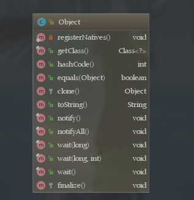

一、Java的虚函数

**java类中普通成员函数就是虚函数。**

JAVA中的函数，除非声明为static或final，都可以看做是虚的，因为它们都是动态绑定的

会根据不同的类对象，调用其相应的函数，这个函数就是虚函数。

二、Object中的方法

三、Java中的对象拷贝

主要分为：浅拷贝(Shallow Copy)、深拷贝(Deep Copy)。

浅拷贝：复制引用

深拷贝：创建一个新的对象或数组，将原来的对象或数组的值拷贝过来