# 一、概述

## 1.1 ISP

互联网服务提供商

## 1.2 主机之间的通信方式

- 客户-服务器（C/S）：客户是服务的请求方，服务器是服务的提供方。
- 对等（P2P）：不区分客户和服务器

## 1.3 电路交换和分组交换

### 1.3.1 电路交换

电路交换用于电话通信系统，两个用户要通信之前需要建立一条专用的物理链路，并且在整个通信过程中始终占用该链路。由于通信的过程中不可能一直在使用传输线路，因此电路交换对线路的利用率很低，往往不到 10%。

### 1.3.2 分组交换

每个分组都有首部和尾部，包含了源地址和目的地址等控制信息，在同一个传输线路上同时传输多个分组互相不会影响，因此在同一条传输线路上允许同时传输多个分组，也就是说分组交换不需要占用传输线路。

在一个邮局通信系统中，邮局收到一份邮件之后，先存储下来，然后把相同目的地的邮件一起转发到下一个目的地，这个过程就是存储转发过程，分组交换也使用了存储转发过程。

## 1.4 计算机网络体系结构

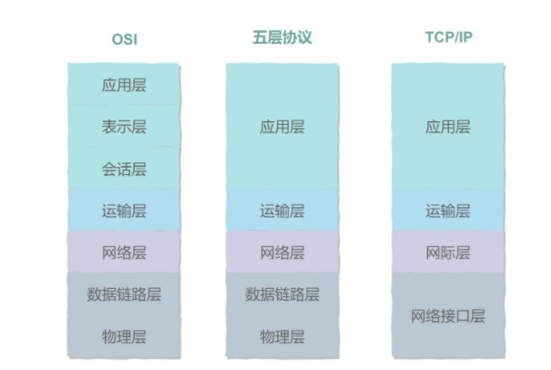

### 1.4.1 五层协议

- **应用层** ：为特定应用程序提供数据传输服务，例如 HTTP、DNS 等协议。数据单位为报文。
- **传输层** ：为进程提供通用数据传输服务。由于应用层协议很多，定义通用的传输层协议就可以支持不断增多的应用层协议。运输层包括两种协议：传输控制协议 TCP，提供面向连接、可靠的数据传输服务，数据单位为报文段；用户数据报协议 UDP，提供无连接、尽最大努力的数据传输服务，数据单位为用户数据报。TCP 主要提供完整性服务，UDP 主要提供及时性服务。
- **网络层** ：为主机提供数据传输服务。而传输层协议是为主机中的进程提供数据传输服务。网络层把传输层传递下来的报文段或者用户数据报封装成分组。
- **数据链路层** ：网络层针对的还是主机之间的数据传输服务，而主机之间可以有很多链路，链路层协议就是为同一链路的主机提供数据传输服务。数据链路层把网络层传下来的分组封装成帧。
- **物理层** ：考虑的是怎样在传输媒体上传输数据比特流，而不是指具体的传输媒体。物理层的作用是尽可能屏蔽传输媒体和通信手段的差异，使数据链路层感觉不到这些差异。

### 1.4.2 OSI

其中表示层和会话层用途如下：

- **表示层** ：数据压缩、加密以及数据描述，这使得应用程序不必关心在各台主机中数据内部格式不同的问题。
- **会话层** ：建立及管理会话。

五层协议没有表示层和会话层，而是将这些功能留给应用程序开发者处理。

### 1.4.3 TCP/IP

它只有四层，相当于五层协议中数据链路层和物理层合并为网络接口层。

TCP/IP 体系结构不严格遵循 OSI 分层概念，应用层可能会直接使用 IP 层或者网络接口层。

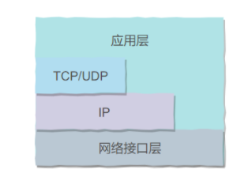

# 二、物理层

## 2.1 通信方式

根据信息在传输线上的传送方向，分为以下三种通信方式：

- 单工通信：单向传输
- 半双工通信：双向交替传输
- 全双工通信：双向同时传输

# 三、数据链路层

## 3.1 基本问题

封装成帧、透明传输、差错检验

## 3.2 CSMA/CD 协议

波监听多点接入 / 碰撞检测。

- **多点接入** ：说明这是总线型网络，许多主机以多点的方式连接到总线上。
- **载波监听** ：每个主机都必须不停地监听信道。在发送前，如果监听到信道正在使用，就必须等待。
- **碰撞检测** ：在发送中，如果监听到信道已有其它主机正在发送数据，就表示发生了碰撞。虽然每个主机在发送数据之前都已经监听到信道为空闲，但是由于电磁波的传播时延的存在，还是有可能会发生碰撞。

## 3.3 PPP 协议

互联网用户通常需要连接到某个 ISP 之后才能接入到互联网，PPP 协议是用户计算机和 ISP 进行通信时所使用的数据链路层协议。

## 3.4 MAC地址

MAC 地址是链路层地址，长度为 6 字节（48 位），用于唯一标识网络适配器（网卡）。

一台主机拥有多少个网络适配器就有多少个 MAC 地址。例如笔记本电脑普遍存在无线网络适配器和有线网络适配器，因此就有两个 MAC 地址。

# 四、网络层

使用 IP 协议，可以把异构的物理网络连接起来，使得在网络层看起来好像是一个统一的网络。

与 IP 协议配套使用的还有三个协议：

- 地址解析协议 ARP（Address Resolution Protocol）
- 网际控制报文协议 ICMP（Internet Control Message Protocol）
- 网际组管理协议 IGMP（Internet Group Management Protocol）

## 4.1 IP数据报格式

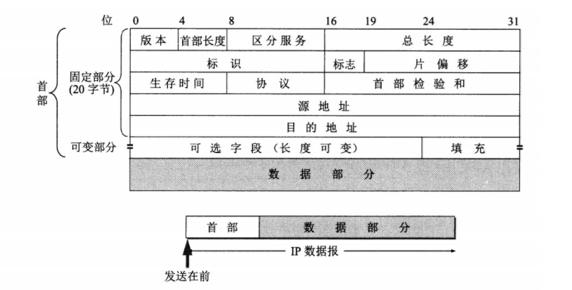

**版本** : 有 4（IPv4）和 6（IPv6）两个值；

**首部长度** : 占 4 位，因此最大值为 15。值为 1 表示的是 1 个 32 位字的长度，也就是 4 字节。因为首部固定长度为 20 字节，因此该值最小为 5。如果可选字段的长度不是 4 字节的整数倍，就用尾部的填充部分来填充。

**区分服务** : 用来获得更好的服务，一般情况下不使用。

**总长度** : 包括首部长度和数据部分长度。

**生存时间** ：TTL，它的存在是为了防止无法交付的数据报在互联网中不断兜圈子。以路由器跳数为单位，当 TTL 为 0 时就丢弃数据报。

**协议** ：**指出携带的数据应该上交给哪个协议进行处理**，例如 ICMP、TCP、UDP 等。

**首部检验和** ：因为数据报每经过一个路由器，都要重新计算检验和，因此检验和不包含数据部分可以减少计算的工作量。

**标识** : 在数据报长度过长从而发生分片的情况下，相同数据报的不同分片具有相同的标识符。

**片偏移** : 和标识符一起，用于发生分片的情况。片偏移的单位为 8 字节。

------

> **ipv4和ipv6的区别**

- 地址空间不同，IPv4中规定IP地址长度为32，而IPv6中IP地址的长度为128。
- 路由表大小不同，IPv6的路由表相比IPv4的更小。
- IPv6的组播支持以及对流的支持要强于IPv4。
- 安全性不同，IPv6的安全性更高，在使用IPv6的网络时，用户可对网络层的数据进行加密。
- 协议扩充不同，IPv6允许协议进行扩充而IPv4不允许。

## 4.2 IP 地址编址方式

IP 地址的编址方式经历了三个历史阶段：

- 分类
- 子网划分
- 无分类

## 4.3 地址解析协议ARP

网络层实现主机之间的通信，而链路层实现具体每段链路之间的通信。因此在通信过程中，IP 数据报的源地址和目的地址始终不变，而 MAC 地址随着链路的改变而改变。

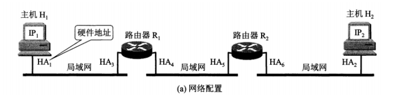

ARP 实现由 IP 地址得到 MAC 地址。

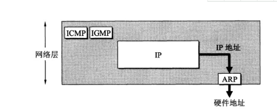

每个主机都有一个 ARP 高速缓存，里面有本局域网上的各主机和路由器的 IP 地址到 MAC 地址的映射表。

如果主机 A 知道主机 B 的 IP 地址，但是 ARP 高速缓存中没有该 IP 地址到 MAC 地址的映射，此时主机 A 通过广播的方式发送 ARP 请求分组，主机 B 收到该请求后会发送 ARP 响应分组给主机 A 告知其 MAC 地址，随后主机 A 向其高速缓存中写入主机 B 的 IP 地址到 MAC 地址的映射。

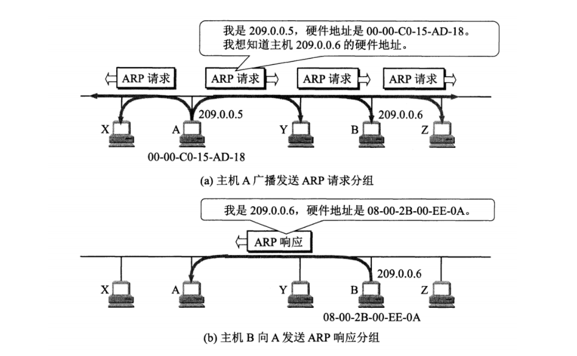

## 4.4 路由器分组转发流程

- 从数据报的首部提取目的主机的 IP 地址 D，得到目的网络地址 N。
- 若 N 就是与此路由器直接相连的某个网络地址，则进行直接交付；
- 若路由表中有目的地址为 D 的特定主机路由，则把数据报传送给表中所指明的下一跳路由器；
- 若路由表中有到达网络 N 的路由，则把数据报传送给路由表中所指明的下一跳路由器；
- 若路由表中有一个默认路由，则把数据报传送给路由表中所指明的默认路由器；
- 报告转发分组出错。

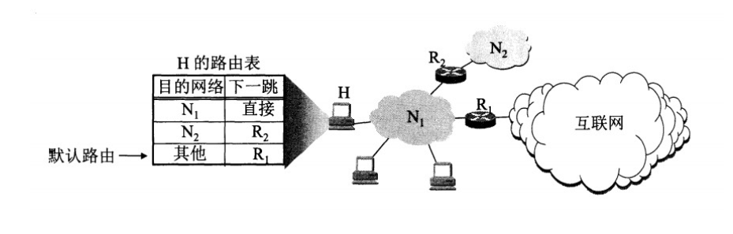

## 4.5 路由选择协议

### 4.5.1 内部网关协议RIP

RIP 是一种基于距离向量的路由选择协议。距离是指跳数，直接相连的路由器跳数为 1。跳数最多为 15，超过 15 表示不可达。

RIP 按固定的时间间隔仅和相邻路由器交换自己的路由表，经过若干次交换之后，所有路由器最终会知道到达本自治系统中任何一个网络的最短距离和下一跳路由器地址。

距离向量算法：

- 对地址为 X 的相邻路由器发来的 RIP 报文，先修改报文中的所有项目，把下一跳字段中的地址改为 X，并把所有的距离字段加 1；
- 对修改后的 RIP 报文中的每一个项目，进行以下步骤：
- 若原来的路由表中没有目的网络 N，则把该项目添加到路由表中；
- 否则：若下一跳路由器地址是 X，则把收到的项目替换原来路由表中的项目；否则：若收到的项目中的距离 d 小于路由表中的距离，则进行更新（例如原始路由表项为 Net2, 5, P，新表项为 Net2, 4, X，则更新）；否则什么也不做。
- 若 3 分钟还没有收到相邻路由器的更新路由表，则把该相邻路由器标为不可达，即把距离置为 16。

RIP 协议实现简单，开销小。但是 RIP 能使用的最大距离为 15，限制了网络的规模。并且当网络出现故障时，要经过比较长的时间才能将此消息传送到所有路由器。

### 4.5.2 内部网关协议OSPF

开放最短路径优先 OSPF，是为了克服 RIP 的缺点而开发出来的。

开放表示 OSPF 不受某一家厂商控制，而是公开发表的；最短路径优先表示使用了 Dijkstra 提出的最短路径算法 SPF。

OSPF 具有以下特点：

- 向本自治系统中的所有路由器发送信息，这种方法是洪泛法。
- 发送的信息就是与相邻路由器的链路状态，链路状态包括与哪些路由器相连以及链路的度量，度量用费用、距离、时延、带宽等来表示。
- 只有当链路状态发生变化时，路由器才会发送信息。

所有路由器都具有全网的拓扑结构图，并且是一致的。相比于 RIP，OSPF 的更新过程收敛的很快。

# 五、传输层

网络层只把分组发送到目的主机，但是真正通信的并不是主机而是主机中的进程。传输层提供了进程间的逻辑通信，传输层向高层用户屏蔽了下面网络层的核心细节，使应用程序看起来像是在两个传输层实体之间有一条端到端的逻辑通信信道。

## 5.1 UDP 和 TCP 的特点

- 用户数据报协议 UDP（User Datagram Protocol）是无连接的，尽最大可能交付，没有拥塞控制，面向报文（对于应用程序传下来的报文不合并也不拆分，只是添加 UDP 首部），支持一对一、一对多、多对一和多对多的交互通信。
- 传输控制协议 TCP（Transmission Control Protocol）是面向连接的，提供可靠交付，有流量控制，拥塞控制，提供全双工通信，面向字节流（把应用层传下来的报文看成字节流，把字节流组织成大小不等的数据块），每一条 TCP 连接只能是点对点的（一对一）。

## 5.2 UDP首部格式


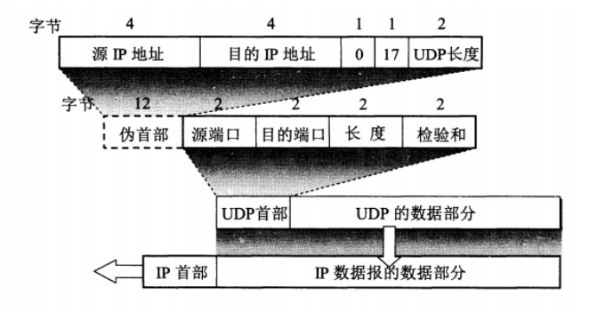

首部字段只有 8 个字节，包括源端口、目的端口、长度、检验和。12 字节的伪首部是为了计算检验和临时添加的。

## 5.3 TCP首部格式

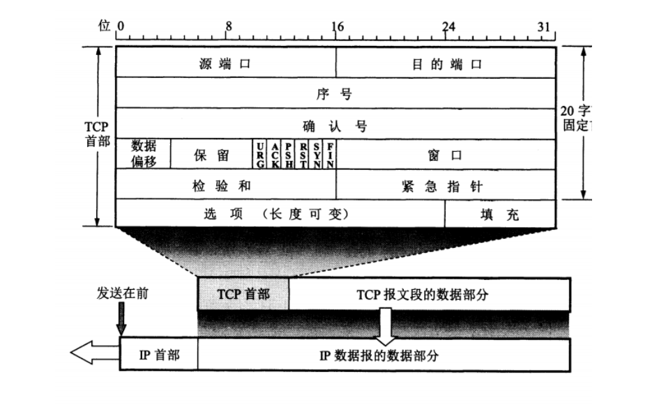

- **序号** ：用于对字节流进行编号，例如序号为 301，表示第一个字节的编号为 301，如果携带的数据长度为 100 字节，那么下一个报文段的序号应为 401。
- **确认号** ：期望收到的下一个报文段的序号。例如 B 正确收到 A 发送来的一个报文段，序号为 501，携带的数据长度为 200 字节，因此 B 期望下一个报文段的序号为 701，B 发送给 A 的确认报文段中确认号就为 701。
- **数据偏移** ：指的是数据部分距离报文段起始处的偏移量，实际上指的是首部的长度。
- **确认 ACK** ：当 ACK=1 时确认号字段有效，否则无效。TCP 规定，在连接建立后所有传送的报文段都必须把 ACK 置 1。
- **同步 SYN** ：在连接建立时用来同步序号。当 SYN=1，ACK=0 时表示这是一个连接请求报文段。若对方同意建立连接，则响应报文中 SYN=1，ACK=1。
- **终止 FIN** ：用来释放一个连接，当 FIN=1 时，表示此报文段的发送方的数据已发送完毕，并要求释放连接。
- **窗口** ：窗口值作为接收方让发送方设置其发送窗口的依据。之所以要有这个限制，是因为接收方的数据缓存空间是有限的。

## 5.4 TCP三次握手

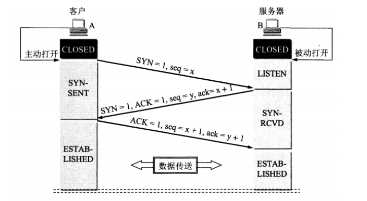

假设 A 为客户端，B 为服务器端。

- 首先 B 处于 LISTEN（监听）状态，等待客户的连接请求。
- A 向 B 发送连接请求报文，SYN=1，ACK=0，选择一个初始的序号 x。客户端进入SYN_SEND状态,等待服务器确认
- B 收到连接请求报文，如果同意建立连接，则向 A 发送连接确认报文，SYN=1，ACK=1，确认号为 x+1，同时也选择一个初始的序号 y,服务器端进入SYN_RECV状态
- A 收到 B 的连接确认报文后，还要向 B 发出确认，确认号为 y+1，序号为 x+1。
- B 收到 A 的确认后，连接建立。客户端和服务器端进入ESTABLISHED状态

**三次握手的原因**

第三次握手是为了防止失效的连接请求到达服务器，让服务器错误打开连接。

客户端发送的连接请求如果在网络中滞留，那么就会隔很长一段时间才能收到服务器端发回的连接确认。客户端等待一个超时重传时间之后，就会重新请求连接。但是这个滞留的连接请求最后还是会到达服务器，如果不进行三次握手，那么服务器就会打开两个连接。如果有第三次握手，客户端会忽略服务器之后发送的对滞留连接请求的连接确认，不进行第三次握手，因此就不会再次打开连接。

## 5.5 TCP四次挥手

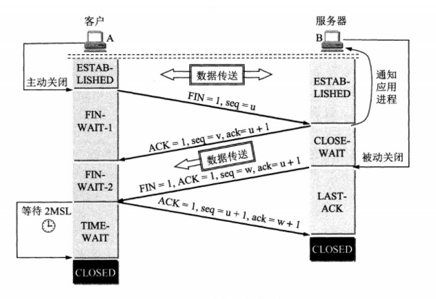

以下描述不讨论序号和确认号，因为序号和确认号的规则比较简单。并且不讨论 ACK，**因为 ACK 在连接建立之后都为 1。**

- A 发送连接释放报文，FIN=1。
- B 收到之后发出确认，此时 TCP 属于半关闭状态，B 能向 A 发送数据但是 A 不能向 B 发送数据。
- 当 B 不再需要连接时，发送连接释放报文，FIN=1。
- A 收到后发出确认，进入 TIME-WAIT 状态，等待 2 MSL（最大报文存活时间）后释放连接。
- B 收到 A 的确认后释放连接。

**四次挥手的原因**

客户端发送了 FIN 连接释放报文之后，服务器收到了这个报文，就进入了 CLOSE-WAIT 状态。这个状态是为了让服务器端发送还未传送完毕的数据，传送完毕之后，服务器会发送 FIN 连接释放报文。

**TIME_WAIT**

客户端接收到服务器端的 FIN 报文后进入此状态，此时并不是直接进入 CLOSED 状态，还需要等待一个时间计时器设置的时间 2MSL（Maximum Segment Lifetime）。这么做有两个理由：

- **确保最后一个确认报文能够到达**。如果 B 没收到 A 发送来的确认报文，那么就会重新发送连接释放请求报文，A 等待一段时间就是为了处理这种情况的发生。
- 等待一段时间是为了让本连接持续时间内所产生的所有报文都从网络中消失，使得下一个新的连接不会出现旧的连接请求报文。

**服务器也存在TIME_WAIT，TIME_WAIT出现在主动释放连接的一方**

## 5.6 TCP可靠传输

TCP 使用超时重传来实现可靠传输：如果一个已经发送的报文段在超时时间内没有收到确认，那么就重传这个报文段。

那这个特定的时间间隔如何确定呢？ TCP为了保证在任何网络下都能够提供比较高的传输性能，并且在任何网络下都能够保持住这一特性，它在每次发包时都会计算往返时间及其偏差，将这个“往返时间+偏差”，重发超时就是比这个总和值要稍大一点的值。

## 5.7 TCP滑动窗口

窗口是缓存的一部分，用来暂时存放字节流。发送方和接收方各有一个窗口，接收方通过 TCP 报文段中的窗口字段告诉发送方自己的窗口大小，发送方根据这个值和其它信息设置自己的窗口大小。

发送窗口内的字节都允许被发送，接收窗口内的字节都允许被接收。如果发送窗口左部的字节已经发送并且收到了确认，那么就将发送窗口向右滑动一定距离，直到左部第一个字节不是已发送并且已确认的状态；接收窗口的滑动类似，接收窗口左部字节已经发送确认并交付主机，就向右滑动接收窗口。

接收窗口只会对窗口内最后一个按序到达的字节进行确认，例如接收窗口已经收到的字节为 {31, 34, 35}，其中 {31} 按序到达，而 {34, 35} 就不是，因此只对字节 31 进行确认。发送方得到一个字节的确认之后，就知道这个字节之前的所有字节都已经被接收。

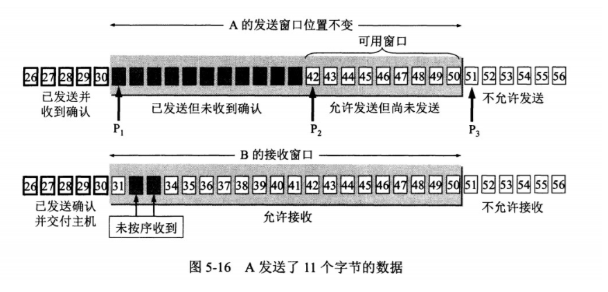

## 5.8 TCP流量控制

流量控制是为了控制发送方发送速率，保证接收方来得及接收。

接收方发送的确认报文中的窗口字段可以用来控制发送方窗口大小，从而影响发送方的发送速率。将窗口字段设置为 0，则发送方不能发送数据。

## 5.9 TCP拥塞控制

如果网络出现拥塞，分组将会丢失，此时发送方会继续重传，从而导致网络拥塞程度更高。因此当出现拥塞时，应当控制发送方的速率。这一点和流量控制很像，但是出发点不同。流量控制是为了让接收方能来得及接收，而拥塞控制是为了降低整个网络的拥塞程度。

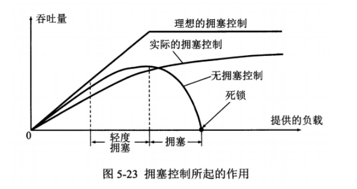

TCP 主要通过四个算法来进行拥塞控制：**慢开始、拥塞避免、快重传、快恢复。**

发送方需要维护一个叫做拥塞窗口（cwnd）的状态变量，注意拥塞窗口与发送方窗口的区别：**拥塞窗口只是一个状态变量**，实际决定发送方能发送多少数据的是发送方窗口。

为了便于讨论，做如下假设：

- 接收方有足够大的接收缓存，因此不会发生流量控制；
- 虽然 TCP 的窗口基于字节，但是这里设窗口的大小单位为报文段。

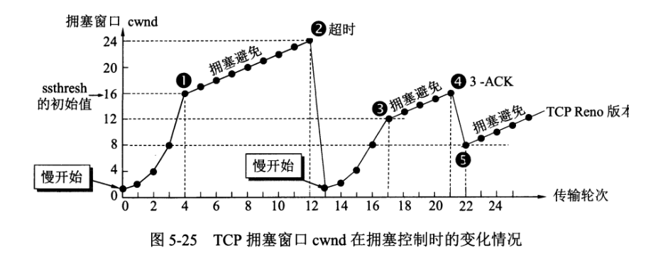

### 1. 慢开始与拥塞避免

发送的最初执行慢开始，令 cwnd = 1，发送方只能发送 1 个报文段；当收到确认后，将 cwnd 加倍，因此之后发送方能够发送的报文段数量为：2、4、8 ...

注意到慢开始每个轮次都将 cwnd 加倍，这样会让 cwnd 增长速度非常快，从而使得发送方发送的速度增长速度过快，网络拥塞的可能性也就更高。设置一个慢开始门限 ssthresh，当 cwnd >= ssthresh 时，进入拥塞避免，每个轮次只将 cwnd 加 1。

如果出现了超时，则令 ssthresh = cwnd / 2，然后重新执行慢开始。

**为什么门限值要减半？**

这样做的目的就是要迅速减少主机发送到网络中的分组数，使得发生 拥塞的路由器有足够时间把队列中积压的分组处理完毕。

### 2. 快重传与快恢复

在接收方，要求每次接收到报文段都应该对最后一个已收到的有序报文段进行确认。例如已经接收到 M1 和 M2，此时收到 M4，应当发送对 M2 的确认。

在发送方，如果收到三个重复确认，那么可以知道下一个报文段丢失，此时执行快重传，立即重传下一个报文段。例如收到三个 M2，则 M3 丢失，立即重传 M3。

**在这种情况下，只是丢失个别报文段，而不是网络拥塞。因此执行快恢复，令 ssthresh = cwnd / 2 ，cwnd = ssthresh，注意到此时直接进入拥塞避免。**

慢开始和快恢复的快慢指的是 cwnd 的设定值，而不是 cwnd 的增长速率。慢开始 cwnd 设定为 1，而快恢复 cwnd 设定为 ssthresh。

①当发送方连续收到三个重复确认时，就执行“乘法减小”算法，把ssthresh门限减半。但是接下去并不执行慢开始算法。

②考虑到如果网络出现拥塞的话就不会收到好几个重复的确认，所以发送方现在认为网络可能没有出现拥塞。所以此时不执行慢开始算法，而是将cwnd设置为ssthresh的大小，然后执行拥塞避免算法。如下图：

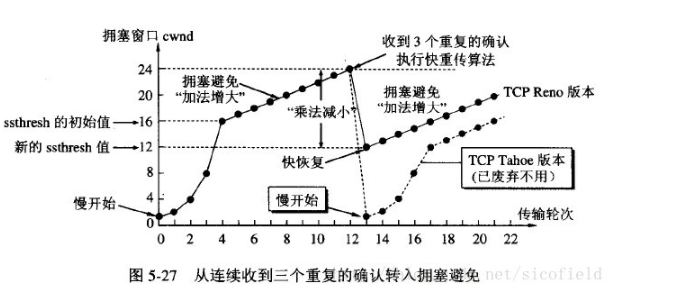

## 5.10 TCP和UDP的区别

- TCP是面向连接的，UDP是无连接的
- TCP提供可靠的传输服务（超时重传），UDP尽最大努力交付，不保证可靠交付
- TCP面向字节流，UDP面向报文
- UDP没有拥塞控制
- 每一个TCP连接都是点到点的；UDP支持一对一、一对多、多对一和多对多的交互通信
- TCP首部开销20字节；UDP首部开销小，只有8个字节
- TCP的逻辑通信信道是全双工的可靠信道，UDP则是不可靠信道

# 六、应用层

## 6.1 域名系统

DNS 是一个分布式数据库，提供了主机名和 IP 地址之间相互转换的服务。这里的分布式数据库是指，每个站点只保留它自己的那部分数据。

假设运行在用户主机上的某些应用程序（如Webl浏览器或者邮件阅读器）需要将主机名转换为IP地址。这些应用程序将调用DNS的客户机端，并指明需要被转换的主机名。（在很多基于UNIX的机器上，应用程序为了执行这种转换需要调用函数gethostbyname（））。用户主机的DNS客户端接收到后，向网络中发送一个DNS查询报文。所有DNS请求和回答报文使用的UDP数据报经过端口53发送，经过若干ms到若干s的延时后，用户主机上的DNS客户端接收到一个提供所希望映射的DNS回答报文。这个查询结果则被传递到调用DNS的应用程序。因此，从用户主机上调用应用程序的角度看，DNS是一个提供简单、直接的转换服务的黑盒子。**但事实上，实现这个服务的黑盒子非常复杂，它由分布于全球的大量DNS服务器以及定义了DNS服务器与查询主机通信方式的应用层协议组成。**


DNS是**计算机域名系统 (Domain Name System 或Domain Name Service)** **域名必须对应一个IP地址，一个域名只能对应一个IP地址（比如访问一个域名不可能向两个ip地址请求），而IP地址不一定有域名且可以对应多个域名**主服务器和转发服务器域名解析

①DNS是应用层协议，client端（一般指浏览器）构建DNS查询请求，依次被传输层，网络层，数据链路层等封装传送到达DNS服务器端，最终client端接收到DNS响应消息

②DNS主要基于UDP运输层协议，这里解释下为什么使用UDP（User Datagram Protocol）这样的无连接的，尽最大能力交付的不可靠数据连接，而不是使用TCP(Transmission Control Protocol 传输控制协议)这样的面向连接的可靠数据连接。

一次UDP名字服务器交换可以短到两个包：一个查询包、一个响应包。一次TCP交换则至少包含9个包：三次握手初始化TCP会话、一个查询包、一个响应包以及四次分手的包交换。

考虑到效率原因，TCP连接的开销大得，故采用UDP作为DNS的运输层协议，这也将导致只有13个根域名服务器的结果。

只会在UDP报文中表明有截断的时候使用TCP查询。


## 6.2 文件传送协议

FTP 使用 TCP 进行连接，它需要两个连接来传送一个文件：

- 控制连接：服务器打开端口号 21 等待客户端的连接，客户端主动建立连接后，使用这个连接将客户端的命令传送给服务器，并传回服务器的应答。
- 数据连接：用来传送一个文件数据。

## 6.3 动态主机配置协议

DHCP (Dynamic Host Configuration Protocol) 提供了即插即用的连网方式，用户不再需要去手动配置 IP 地址等信息。

DHCP 配置的内容不仅是 IP 地址，还包括子网掩码、网关 IP 地址。

DHCP 工作过程如下：

1. 客户端发送 Discover 报文，该报文的目的地址为 255.255.255.255:67，源地址为 0.0.0.0:68，被放入 UDP 中，该报文被广播到同一个子网的所有主机上。如果客户端和 DHCP 服务器不在同一个子网，就需要使用中继代理。
2. DHCP 服务器收到 Discover 报文之后，发送 Offer 报文给客户端，该报文包含了客户端所需要的信息。因为客户端可能收到多个 DHCP 服务器提供的信息，因此客户端需要进行选择。
3. 如果客户端选择了某个 DHCP 服务器提供的信息，那么就发送 Request 报文给该 DHCP 服务器。
4. DHCP 服务器发送 Ack 报文，表示客户端此时可以使用提供给它的信息。

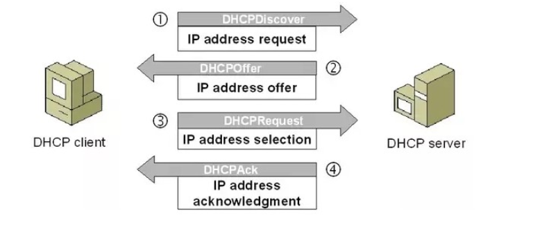

## 6.4 常用端口

|                  |            |         |            |                             |
| ---------------- | ---------- | ------- | ---------- | --------------------------- |
| 应用             | 应用层协议 | 端口号  | 传输层协议 | 备注                        |
| 域名解析         | DNS        | 53      | UDP/TCP    | 长度超过 512 字节时使用 TCP |
| 动态主机配置协议 | DHCP       | 67/68   | UDP        |                             |
| 简单网络管理协议 | SNMP       | 161/162 | UDP        |                             |
| 文件传送协议     | FTP        | 20/21   | TCP        | 控制连接 21，数据连接 20    |
| 远程终端协议     | TELNET     | 23      | TCP        |                             |
| 超文本传送协议   | HTTP       | 80      | TCP        |                             |
| 简单邮件传送协议 | SMTP       | 25      | TCP        |                             |
| 邮件读取协议     | POP3       | 110     | TCP        |                             |
| 网际报文存取协议 | IMAP       | 143     | TCP        |                             |

# 七：Web页面请求过程

### 7.1 DHCP 配置主机信息

- 假设主机最开始没有 IP 地址以及其它信息，那么就需要先使用 DHCP 来获取。
- 主机生成一个 DHCP 请求报文，并将这个报文放入具有目的端口 67 和源端口 68 的 UDP 报文段中。
- 该报文段则被放入在一个具有广播 IP 目的地址(255.255.255.255) 和源 IP 地址（0.0.0.0）的 IP 数据报中。
- 该数据报则被放置在 MAC 帧中，该帧具有目的地址 FF:FF:FF:FF:FF:FF，将广播到与交换机连接的所有设备。
- 连接在交换机的 DHCP 服务器收到广播帧之后，不断地向上分解得到 IP 数据报、UDP 报文段、DHCP 请求报文，之后生成 DHCP ACK 报文，该报文包含以下信息：IP 地址、DNS 服务器的 IP 地址、默认网关路由器的 IP 地址和子网掩码。该报文被放入 UDP 报文段中，UDP 报文段有被放入 IP 数据报中，最后放入 MAC 帧中。
- 该帧的目的地址是请求主机的 MAC 地址，因为交换机具有自学习能力，之前主机发送了广播帧之后就记录了 MAC 地址到其转发接口的交换表项，因此现在交换机就可以直接知道应该向哪个接口发送该帧。
- 主机收到该帧后，不断分解得到 DHCP 报文。之后就配置它的 IP 地址、子网掩码和 DNS 服务器的 IP 地址，并在其 IP 转发表中安装默认网关。

### 7.2 ARP 解析 MAC 地址

- 主机通过浏览器生成一个 TCP 套接字，套接字向 HTTP 服务器发送 HTTP 请求。为了生成该套接字，主机需要知道网站的域名对应的 IP 地址。
- 主机生成一个 DNS 查询报文，该报文具有 53 号端口，因为 DNS 服务器的端口号是 53。
- 该 DNS 查询报文被放入目的地址为 DNS 服务器 IP 地址的 IP 数据报中。
- 该 IP 数据报被放入一个以太网帧中，该帧将发送到网关路由器。
- DHCP 过程只知道网关路由器的 IP 地址，为了获取网关路由器的 MAC 地址，需要使用 ARP 协议。
- 主机生成一个包含目的地址为网关路由器 IP 地址的 ARP 查询报文，将该 ARP 查询报文放入一个具有广播目的地址（FF:FF:FF:FF:FF:FF）的以太网帧中，并向交换机发送该以太网帧，交换机将该帧转发给所有的连接设备，包括网关路由器。
- 网关路由器接收到该帧后，不断向上分解得到 ARP 报文，发现其中的 IP 地址与其接口的 IP 地址匹配，因此就发送一个 ARP 回答报文，包含了它的 MAC 地址，发回给主机。

### 7.3 DNS 解析域名

- 知道了网关路由器的 MAC 地址之后，就可以继续 DNS 的解析过程了。
- 网关路由器接收到包含 DNS 查询报文的以太网帧后，抽取出 IP 数据报，并根据转发表决定该 IP 数据报应该转发的路由器。
- 因为路由器具有内部网关协议（RIP、OSPF）和外部网关协议（BGP）这两种路由选择协议，因此路由表中已经配置了网关路由器到达 DNS 服务器的路由表项。
- 到达 DNS 服务器之后，DNS 服务器抽取出 DNS 查询报文，并在 DNS 数据库中查找待解析的域名。
- 找到 DNS 记录之后，发送 DNS 回答报文，将该回答报文放入 UDP 报文段中，然后放入 IP 数据报中，通过路由器反向转发回网关路由器，并经过以太网交换机到达主机。

### 7.4 HTTP 请求页面

- 有了 HTTP 服务器的 IP 地址之后，主机就能够生成 TCP 套接字，该套接字将用于向 Web 服务器发送 HTTP GET 报文。
- 在生成 TCP 套接字之前，必须先与 HTTP 服务器进行三次握手来建立连接。生成一个具有目的端口 80 的 TCP SYN 报文段，并向 HTTP 服务器发送该报文段。
- HTTP 服务器收到该报文段之后，生成 TCP SYN ACK 报文段，发回给主机。
- 连接建立之后，浏览器生成 HTTP GET 报文，并交付给 HTTP 服务器。
- HTTP 服务器从 TCP 套接字读取 HTTP GET 报文，生成一个 HTTP 响应报文，将 Web 页面内容放入报文主体中，发回给主机。
- 浏览器收到 HTTP 响应报文后，抽取出 Web 页面内容，之后进行渲染，显示 Web 页面。

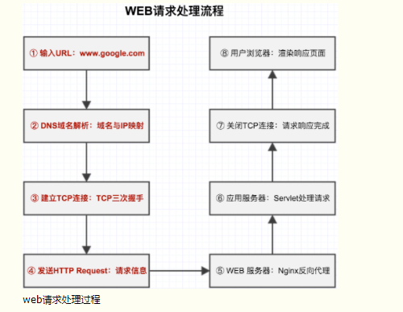

# 八、Cookie和Session

## 8.1 Cookie

HTTP 协议是无状态的，主要是为了让 HTTP 协议尽可能简单，使得它能够处理大量事务。HTTP/1.1 引入 Cookie 来保存状态信息。

Cookie 是服务器发送到用户浏览器并保存在本地的一小块数据，它会在浏览器之后向同一服务器再次发起请求时被携带上，用于告知服务端两个请求是否来自同一浏览器。由于之后每次请求都会需要携带 Cookie 数据，因此会带来额外的性能开销（尤其是在移动环境下）。

Cookie 曾一度用于客户端数据的存储，因为当时并没有其它合适的存储办法而作为唯一的存储手段，但现在随着现代浏览器开始支持各种各样的存储方式，Cookie 渐渐被淘汰。新的浏览器 API 已经允许开发者直接将数据存储到本地，如使用 Web storage API（本地存储和会话存储）或 IndexedDB。

### 8.1.1 用途

- 会话状态管理（如用户登录状态、购物车、游戏分数或其它需要记录的信息）
- 个性化设置（如用户自定义设置、主题等）
- 浏览器行为跟踪（如跟踪分析用户行为等

### 8.1.2 创建过程

服务器发送的响应报文包含 Set-Cookie 首部字段，客户端得到响应报文后把 Cookie 内容保存到浏览器中。

```html
HTTP/1.0 200 OK
Content-type: text/html
Set-Cookie: yummy_cookie=choco
Set-Cookie: tasty_cookie=strawberry

[page content]
```

客户端之后对同一个服务器发送请求时，会从浏览器中取出 Cookie 信息并通过 Cookie 请求首部字段发送给服务器。

```html
GET /sample_page.html HTTP/1.1
Host: www.example.org
Cookie: yummy_cookie=choco; tasty_cookie=strawberry
```

### 8.1.3 作用域

Domain 标识指定了哪些主机可以接受 Cookie。如果不指定，默认为当前文档的主机（不包含子域名）。如果指定了 Domain，则一般包含子域名。例如，如果设置 Domain=mozilla.org，则 Cookie 也包含在子域名中（如 developer.mozilla.org）。

Path 标识指定了主机下的哪些路径可以接受 Cookie（该 URL 路径必须存在于请求 URL 中）。以字符 %x2F ("/") 作为路径分隔符，子路径也会被匹配。例如，设置 Path=/docs，则以下地址都会匹配：

- /docs
- /docs/Web/
- /docs/Web/HTTP

## 8.2 Session

在WEB开发中，**服务器可以为每个用户浏览器创建一个会话对象**（session对象），注意：一个浏览器独占一个session对象(默认情况下)。因此，在需要保存用户数据时，服务器程序可以把用户数据写到用户浏览器独占的session中，当用户使用浏览器访问其它程序时，其它程序可以从用户的session中取出该用户的数据，为用户服务。

### 8.2.1 原理

服务器创建session出来后，会把session的id号，以cookie的形式回写给客户机，这样，只要客户机的浏览器不关，再去访问服务器时，都会带着session的id号去，服务器发现客户机浏览器带session id过来了，就会使用内存中与之对应的session为之服务。

### 8.2.2 生命周期

1、什么时候创建？

- Sessinon在用户访问第一次访问服务器时创建

2、什么时候过期？

- 服务器会把长时间没有活动的Session从服务器内存中清除，此时Session便失效。Tomcat中Session的默认失效时间为30分钟。
- 调用Session的invalidate方法。

## 8.3 区别

1、cookie数据存放在客户的浏览器上，session数据放在服务器上。

2、cookie不是很安全，别人可以分析存放在本地的COOKIE并进行COOKIE欺骗考虑到安全应当使用session。

3、session会在一定时间内保存在服务器上。当访问增多，会比较占用你服务器的性能，考虑到减轻服务器性能方面，应当使用COOKIE。

4、单个cookie保存的数据不能超过4K，很多浏览器都限制一个站点最多保存20个cookie。

5、所以个人建议：
   将登陆信息等重要信息存放为SESSION
   其他信息如果需要保留，可以放在COOKIE中

# 九、HTTP状态码

```java
HttpStatus = {  
        //Informational 1xx  信息
        '100' : 'Continue',  //继续
        '101' : 'Switching Protocols',  //交换协议
 
        //Successful 2xx  成功
        '200' : 'OK',  //OK
        '201' : 'Created',  //创建
        '202' : 'Accepted',  //已接受
        '203' : 'Non-Authoritative Information',  //非权威信息
        '204' : 'No Content',  //没有内容
        '205' : 'Reset Content',  //重置内容
        '206' : 'Partial Content',  //部分内容
 
        //Redirection 3xx  重定向
        '300' : 'Multiple Choices',  //多种选择
        '301' : 'Moved Permanently',  //永久移动
        '302' : 'Found',  //找到
        '303' : 'See Other',  //参见其他
        '304' : 'Not Modified',  //未修改
        '305' : 'Use Proxy',  //使用代理
        '306' : 'Unused',  //未使用
        '307' : 'Temporary Redirect',  //暂时重定向
 
        //Client Error 4xx  客户端错误
        '400' : 'Bad Request',  //错误的请求
        '401' : 'Unauthorized',  //未经授权
        '402' : 'Payment Required',  //付费请求
        '403' : 'Forbidden',  //禁止
        '404' : 'Not Found',  //没有找到
        '405' : 'Method Not Allowed',  //方法不允许
        '406' : 'Not Acceptable',  //不可接受
        '407' : 'Proxy Authentication Required',  //需要代理身份验证
        '408' : 'Request Timeout',  //请求超时
        '409' : 'Conflict',  //指令冲突
        '410' : 'Gone',  //文档永久地离开了指定的位置
        '411' : 'Length Required',  //需要Content-Length头请求
        '412' : 'Precondition Failed',  //前提条件失败
        '413' : 'Request Entity Too Large',  //请求实体太大
        '414' : 'Request-URI Too Long',  //请求URI太长
        '415' : 'Unsupported Media Type',  //不支持的媒体类型
        '416' : 'Requested Range Not Satisfiable',  //请求的范围不可满足
        '417' : 'Expectation Failed',  //期望失败
 
        //Server Error 5xx  服务器错误
        '500' : 'Internal Server Error',  //内部服务器错误
        '501' : 'Not Implemented',  //未实现
        '502' : 'Bad Gateway',  //错误的网关
        '503' : 'Service Unavailable',  //服务不可用
        '504' : 'Gateway Timeout',  //网关超时
        '505' : 'HTTP Version Not Supported'  //HTTP版本不支持
};
```

# 十、路由器和交换机的区别

两者都是连接互联网的设备，它们之间主要区别就是：

交换机发生在网络的第二层数据链路层，而路由器发生在第三层网络层。这个区别是两者各自工作方式的根本区别。路由器可以根据IP地址寻找下一个设备，可以处理TCP/IP协议。

交换机是分配网络数据，路由器可以给网络分配IP地址，分配给你地址而且可以随时通过地址过来找到你。

路由器可以在不同时间内把一个IP分配给多台主机使用。交换机是通过MAC地址和识别各个不同的主机。

# 十一、POST和GET的区别

GET 用于获取信息，是无副作用的，是幂等的，且可缓存 POST 用于修改服务器上的数据，有副作用，非幂等，不可缓存

什么 get参数通过url传递，post放在request body中。

get请求在url中传递的参数是有长度限制的，而post没有。

get比post更不安全，因为参数直接暴露在url中，所以不能用来传递敏感信息。

get请求只能进行url编码，而post支持多种编码方式

get请求会浏览器主动cache，而post支持多种编码方式。

get请求参数会被完整保留在浏览历史记录里，而post中的参数不会被保留。

GET产生一个TCP数据包；POST产生两个TCP数据包

对于GET方式的请求，浏览器会把http header和data一并发送出去，服务器响应200（返回数据）；
而对于POST，浏览器先发送header，服务器响应100 continue，浏览器再发送data，服务器响应200 ok（返回数据）。
也就是说，GET只需要汽车跑一趟就把货送到了，而POST得跑两趟，第一趟，先去和服务器打个招呼“嗨，我等下要送一批货来，你们打开门迎接我”，然后再回头把货送过去。
因为POST需要两步，时间上消耗的要多一点，看起来GET比POST更有效。因此Yahoo团队有推荐用GET替换POST来优化网站性能。

# 十二、HTTP协议上可以建立多少个TCP连接

# 十三、HTTP是有状态的还是无状态的

http是无状态的

**无状态服务器**是指一种把每个请求作为与之前任何请求都无关的独立的[事务](http://zh.wikipedia.org/w/index.php?title=事务&action=edit&redlink=1)的[服务器](http://zh.wikipedia.org/wiki/服务器)。

# 十四、HTTPS

## 14.1 基本概念

HTTP 有以下安全性问题：

- 使用明文进行通信，内容可能会被窃听；
- 不验证通信方的身份，通信方的身份有可能遭遇伪装；
- 无法证明报文的完整性，报文有可能遭篡改。

HTTPS 并不是新协议，而是让 HTTP 先和 SSL（Secure Sockets Layer）通信，再由 SSL 和 TCP 通信，也就是说 HTTPS 使用了隧道进行通信。

通过使用 SSL，HTTPS 具有了加密（防窃听）、认证（防伪装）和完整性保护（防篡改）。


- 对称加密，如AES
  - 基本原理：将明文分成N个组，然后使用密钥对各个组进行加密，形成各自的密文，最后把所有的分组密文进行合并，形成最终的密文。
  - 优势：算法公开、计算量小、加密速度快、加密效率高
  - 缺陷：双方都使用同样密钥，安全性得不到保证 
- 非对称加密，如RSA
  - 基本原理：同时生成两把密钥：私钥和公钥，私钥隐秘保存，公钥可以下发给信任客户端
    - 私钥加密，持有私钥或公钥才可以解密
    - 公钥加密，持有私钥才可解密
  - 优点：安全，难以破解
  - 缺点：算法比较耗时
- 不可逆加密，如MD5，SHA
  - 基本原理：加密过程中不需要使用[密钥](https://baike.baidu.com/item/%E5%AF%86%E9%92%A5)，输入明文后由系统直接经过加密算法处理成密文，这种加密后的数据是无法被解密的，无法根据密文推算出明文。

HTTPS 采用混合的加密机制，使用非对称密钥加密用于传输对称密钥来保证传输过程的安全性，之后使用对称密钥加密进行通信来保证通信过程的效率。

## 14.2 认证

通过使用 **证书** 来对通信方进行认证。

数字证书认证机构（CA，Certificate Authority）是客户端与服务器双方都可信赖的第三方机构。

服务器的运营人员向 CA 提出公开密钥的申请，CA 在判明提出申请者的身份之后，会对已申请的公开密钥做数字签名，然后分配这个已签名的公开密钥，并将该公开密钥放入公开密钥证书后绑定在一起。

进行 HTTPS 通信时，服务器会把证书发送给客户端。客户端取得其中的公开密钥之后，先使用数字签名进行验证，如果验证通过，就可以开始通信了。

