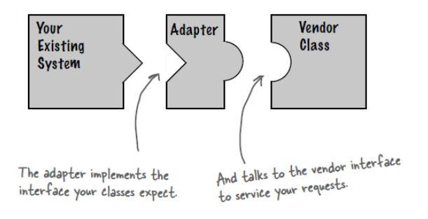
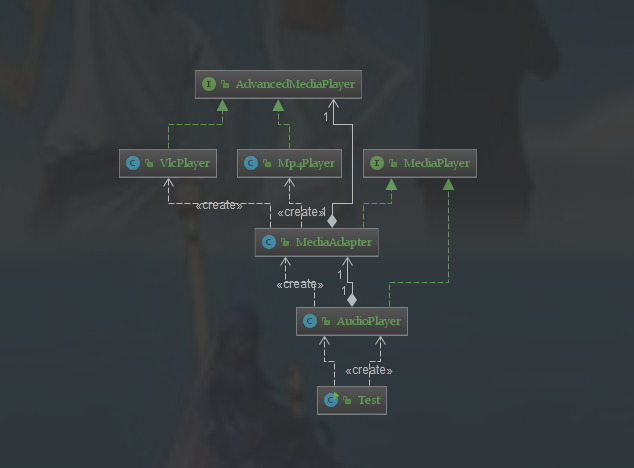
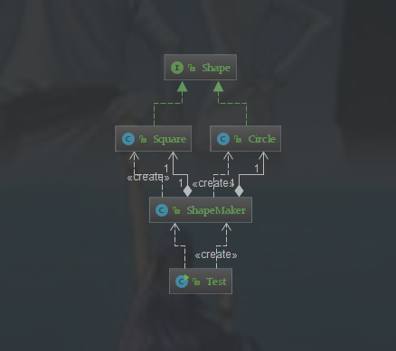
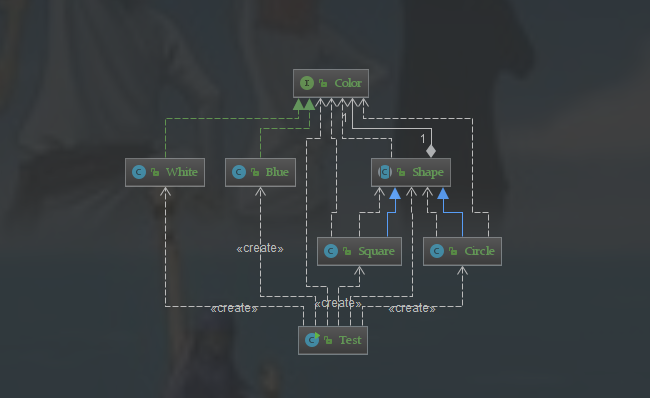

[TOC]

# 设计模式六大原则

**1、开闭原则（Open Close Principle）**

开闭原则的意思是：**对扩展开放，对修改关闭**。**在程序需要进行拓展的时候，不能去修改原有的代码**，实现一个热插拔的效果。简言之，是为了使程序的扩展性好，易于维护和升级。想要达到这样的效果，我们需要使用接口和抽象类，后面的具体设计中我们会提到这点。

**2、里氏代换原则（Liskov Substitution Principle）**

里氏代换原则是面向对象设计的基本原则之一。 里氏代换原则中说，任何基类可以出现的地方，子类一定可以出现。LSP 是继承复用的基石，只有当派生类可以替换掉基类，且软件单位的功能不受到影响时，基类才能真正被复用，而派生类也能够在基类的基础上增加新的行为。里氏代换原则是对开闭原则的补充。实现开闭原则的关键步骤就是抽象化，而基类与子类的继承关系就是抽象化的具体实现，所以里氏代换原则是对实现抽象化的具体步骤的规范。

**3、依赖倒转原则（Dependence Inversion Principle）**

这个原则是开闭原则的基础，具体内容：针对接口编程，依赖于抽象而不依赖于具体。

**4、接口隔离原则（Interface Segregation Principle）**

这个原则的意思是：使用多个隔离的接口，比使用单个接口要好。它还有另外一个意思是：降低类之间的耦合度。由此可见，其实设计模式就是从大型软件架构出发、便于升级和维护的软件设计思想，它强调降低依赖，降低耦合。

**5、迪米特法则，又称最少知道原则（Demeter Principle）**

最少知道原则是指：一个实体应当尽量少地与其他实体之间发生相互作用，使得系统功能模块相对独立。

**6、合成复用原则（Composite Reuse Principle）**

合成复用原则是指：尽量使用合成/聚合的方式，而不是使用继承。

# 一、创建型

## 1.1 单例模式（Singleton）

### 1.1.1 介绍

**意图：** 保证一个类仅有一个实例，并提供一个访问它的全局访问点。

**主要解决：** 一个全局使用的类频繁地创建与销毁。

**何时使用：** 当想控制实例数目，节省系统资源的时候。

**如何解决：** 判断系统是否已经有这个单例，如果有则返回，如果没有则创建。

**关键代码：** 构造函数是私有的。

**应用实例：**

1、Windows 是多进程多线程的，在操作一个文件的时候，就不可避免地出现多个进程或线程同时操作一个文件的现象，所以所有文件的处理必须通过唯一的实例来进行。 

2、一些设备管理器常常设计为单例模式，比如一个电脑有两台打印机，在输出的时候就要处理不能两台打印机打印同一个文件。

**优点：** 

1、在内存里只有一个实例，减少了内存的开销，尤其是频繁的创建和销毁实例（比如管理学院首页页面缓存）。 

2、避免对资源的多重占用（比如写文件操作）。

**缺点：** **没有接口，不能继承，与单一职责原则冲突，一个类应该只关心内部逻辑，而不关心外面怎么样来实例化。**

**使用场景：** 

1、要求生产唯一序列号。 

2、WEB 中的计数器，不用每次刷新都在数据库里加一次，用单例先缓存起来。

3、创建的一个对象需要消耗的资源过多，比如 I/O 与数据库的连接等，**数据库连接池**。

**注意事项：**getInstance() 方法中需要使用同步锁 synchronized (Singleton.class) 防止多线程同时进入造成 instance 被多次实例化。

### 1.1.2 实现方式

使用一个私有构造函数、一个私有静态变量以及一个公有静态函数来实现。

私有构造函数保证了不能通过构造函数来创建对象实例，只能通过公有静态函数返回唯一的私有静态变量。


**懒汉式-线程不安全**

以下实现中，私有静态变量 uniqueInstance 被延迟实例化（把对象的创建延迟到使用的时候创建，而不是对象实例化的时候创建 ），这样做的好处是，如果没有用到该类，那么就不会实例化 uniqueInstance，从而节约资源。

这个实现在多线程环境下是不安全的，如果多个线程能够同时进入 `if (uniqueInstance == null)` ，并且此时 uniqueInstance 为 null，那么会有多个线程执行 `uniqueInstance = new Singleton();` 语句，这将导致实例化多次 uniqueInstance。

```java
package com.design.pattern.singleton;

/**
 * @Author: 98050
 * @Time: 2019-01-09 22:39
 * @Feature:
 */
public class Singleton {

    private static Singleton uniqueInstance;

    private Singleton(){
         System.out.println("运行");
    }

    public static Singleton getUniqueInstance() {
        if (uniqueInstance == null){
            uniqueInstance = new Singleton();
        }
        return uniqueInstance;
    }
}

```

**饿汉式-线程安全**

线程不安全问题主要是由于 uniqueInstance 被实例化多次，采取直接实例化 uniqueInstance 的方式就不会产生线程不安全问题。但是直接实例化的方式也丢失了延迟实例化带来的节约资源的好处。

```java
package com.design.pattern.singleton;

/**
 * @Author: 98050
 * @Time: 2019-01-09 23:03
 * @Feature: 饿汉式-线程安全
 */
public class Singleton2 {

    private static Singleton2 uniqueInstance = new Singleton2();

    private Singleton2(){
        System.out.println("运行");
    }

    public static Singleton2 getUniqueInstance() {
        return uniqueInstance;
    }
}

```

**懒汉式-线程安全**

只需要对 getUniqueInstance() 方法加锁，那么在一个时间点只能有一个线程能够进入该方法，从而避免了实例化多次 uniqueInstance。但是当一个线程进入该方法之后，其它试图进入该方法的线程都必须等待，即使 uniqueInstance 已经被实例化了。这会让线程阻塞时间过长，因此该方法有性能问题，不推荐使用。

```java
package com.design.pattern.singleton;

/**
 * @Author: 98050
 * @Time: 2019-01-09 23:03
 * @Feature: 懒汉式-线程安全
 */
public class Singleton3 {

    private static Singleton3 uniqueInstance;

    private Singleton3(){
        System.out.println("运行");
    }

    public static synchronized Singleton3 getUniqueInstance() {
        if (uniqueInstance == null){
            uniqueInstance = new Singleton3();
        }
        return uniqueInstance;
    }
}

```

**双重校验锁-线程安全**

uniqueInstance 只需要被实例化一次，之后就可以直接使用了。加锁操作只需要对实例化那部分的代码进行，只有当 uniqueInstance 没有被实例化时，才需要进行加锁。双重校验锁先判断 uniqueInstance 是否已经被实例化，如果没有被实例化，那么才对实例化语句进行加锁。

```java
package com.design.pattern.singleton;

/**
 * @Author: 98050
 * @Time: 2019-01-09 23:03
 * @Feature: 双重校验锁-线程安全
 */
public class Singleton4 {
    private static volatile Singleton4 uniqueInstance;

    private Singleton4(){
       
    }

    public static Singleton4 getUniqueInstance() {
        if (uniqueInstance == null){
            synchronized (Singleton4.class) {
                if (uniqueInstance == null) {
                    uniqueInstance = new Singleton4();
                }
            }
        }
        return uniqueInstance;
    }
}

```

如果上述代码中只使用外部一个if语句话，那么就有可能两个线程都进入到if语句内部，这样的话uniqueInstance就会被实例化两次了，因此必须使用双重校验锁。

> ==uniqueInstance 采用 volatile 关键字修饰也是很有必要的， `uniqueInstance = new Singleton();` 这段代码其实是分为三步执行：==
>
> 1. ==为 uniqueInstance 分配内存空间==
> 2. ==初始化 uniqueInstance==
> 3. ==将 uniqueInstance 指向分配的内存地址==
>
> ==但是由于 JVM 具有指令重排的特性，执行顺序有可能变成 1>3>2。指令重排在单线程环境下不会出现问题，但是在多线程环境下会导致一个线程获得还没有初始化的实例。例如，线程 T1 执行了 1 和 3，此时 T2 调用 getUniqueInstance() 后发现 uniqueInstance 不为空，因此返回 uniqueInstance，但此时 uniqueInstance 还未被初始化。==
>
> ==使用 volatile 可以禁止 JVM 的指令重排，保证在多线程环境下也能正常运行。==

**静态内部类实现**

当 Singleton5 类加载时，**静态内部类 Singleton5Holder 没有被加载进内存**。只有当调用 `getUniqueInstance()` 方法从而触发 `SingletonHolder5.uniqueInstance` 时 Singleton5Holder 才会被加载，此时初始化uniqueInstance 实例，并且 JVM 能确保 uniqueInstance 只被实例化一次。

这种方式不仅具有延迟初始化的好处，而且由 JVM 提供了对线程安全的支持。

```java
package com.design.pattern.singleton;

/**
 * @Author: 98050
 * @Time: 2019-01-09 23:04
 * @Feature: 静态内部类实现
 */
public class Singleton5 {

    private Singleton5(){
        System.out.println("运行");
    }
    private static class Singleton5Holder{
        private static final Singleton5 uniqueInstance = new Singleton5();
    }

    public static Singleton5 getUniqueInstance() {
        return Singleton5Holder.uniqueInstance;
    }
}

```

### 1.1.3 JDK

- [java.lang.Runtime#getRuntime()](http://docs.oracle.com/javase/8/docs/api/java/lang/Runtime.html#getRuntime%28%29)
- [java.awt.Desktop#getDesktop()](http://docs.oracle.com/javase/8/docs/api/java/awt/Desktop.html#getDesktop--)
- [java.lang.System#getSecurityManager()](http://docs.oracle.com/javase/8/docs/api/java/lang/System.html#getSecurityManager--)

### *1.1.4 破坏单例模式

**1、反射**

通过反射获得单例类的构造函数，由于该构造函数是private的，通过setAccessible(true)指示反射的对象在使用时应该取消 Java 语言访问检查,使得私有的构造函数能够被访问，这样使得单例模式失效。

**如果要抵御这种攻击，要防止构造函数被成功调用两次。需要在构造函数中对实例化次数进行统计，大于一次就抛出异常。**

**2、序列化**

一是可以实现数据的持久化；二是可以对象数据的远程传输。 如果过该类implements Serializable，那么就会在反序列化的过程中再创一个对象。这个问题的解决办法就是在反序列化时，指定反序化的对象实例。添加如下方法：

```java
 private static final long serialVersionUID = -3979059770681747301L;
 
    private volatile static Singleton singleton;
 
    private Object readResolve() {
        return singleton;
    }

```

**3、克隆**

由克隆我们可以想到原型模式，原型模式就是通过clone方法实现对象的创建的，clone方式是Object方法，每个对象都有，那我使用一个单例模式类的对象，调用clone方法，再创建一个新的对象了，那岂不是上面说的单例模式失效了。

当然答案是否定，某一个对象直接调用clone方法，会抛出异常，即并不能成功克隆一个对象。调用该方法时，必须实现一个Cloneable 接口。这也就是原型模式的实现方式。还有即如果该类实现了Cloneable接口，尽管构造函数是私有的，他也可以创建一个对象。

即clone方法是不会调用构造函数的，他是直接从内存中copy内存区域的。

**所以单例模式的类是不可以实现cloneable接口的。**

## 1.2 简单工厂（Simple Factory）

当你需要什么，只需要传入一个正确的参数，就可以获取你所需要的对象，而无需知道其创建的细节。

### 1.2.1 介绍

在创建一个对象时不向客户暴露内部细节，并提供一个创建对象的通用接口。 

### 1.2.2 实现方式

简单工厂把实例化的操作单独放到一个类中，这个类就成为简单工厂类，让简单工厂类来决定应该用哪个具体子类来实例化。


这样做能把客户类和具体子类的实现解耦，客户类不再需要知道有哪些子类以及应当实例化哪个子类。客户类往往有多个，如果不使用简单工厂，那么所有的客户类都要知道所有子类的细节。而且一旦子类发生改变，例如增加子类，那么所有的客户类都要进行修改。

```java
package com.design.pattern.simplefactory;

/**
 * @Author: 98050
 * @Time: 2019-01-10 11:55
 * @Feature: 产品接口
 */
public interface Product {
}
```

```java
package com.design.pattern.simplefactory;

/**
 * @Author: 98050
 * @Time: 2019-01-10 11:56
 * @Feature:
 */
public class ConcreteProduct implements Product {
}
```

```java
package com.design.pattern.simplefactory;

/**
 * @Author: 98050
 * @Time: 2019-01-10 11:56
 * @Feature:
 */
public class ConcreteProduct2 implements Product {
}
```

```java
package com.design.pattern.simplefactory;

/**
 * @Author: 98050
 * @Time: 2019-01-10 11:56
 * @Feature:
 */
public class ConcreteProduct3 implements Product {
}
```

以下的 Client 类包含了实例化的代码，这是一种错误的实现。如果在客户类中存在这种实例化代码，就需要考虑将代码放到简单工厂中。 

```java
package com.design.pattern.simplefactory;

/**
 * @Author: 98050
 * @Time: 2019-01-10 11:56
 * @Feature:
 */
public class Client {

    public static void main(String[] args) {
        Product product;
        int type = 1;
        switch (type){
            case 1:
                product = new ConcreteProduct();
                break;
            case 2:
                product = new ConcreteProduct();
                break;
            case 3:
                product = new ConcreteProduct();
                default:
        }
    }
}

```

以下的 SimpleFactory 是简单工厂实现，它被所有需要进行实例化的客户类调用。 

```java
package com.design.pattern.simplefactory;

/**
 * @Author: 98050
 * @Time: 2019-01-10 12:00
 * @Feature: 简单工厂
 */
public class SimpleFactory {

    public Product createProduct(int type){
        if (type == 1){
            return new ConcreteProduct();
        }else if (type == 2){
            return new ConcreteProduct2();
        }else {
            return new ConcreteProduct3();
        }
    }
}
```

Client类调用：

```java
package com.design.pattern.factorymethod;

/**
 * @Author: 98050
 * @Time: 2019-01-10 13:08
 * @Feature: 客户
 */
public class Client {
    public static void main(String[] args) {

        ConcreteFactory concreteFactory = new ConcreteFactory();
        concreteFactory.doSomething();
    }
}

```

## 1.3 工厂模式（Factory Method）

### 1.3.1 介绍

定义了一个创建对象的接口，但由子类决定要实例化哪个类。工厂方法把实例化操作推迟到子类。 

**意图：** 定义一个创建对象的接口，让其子类自己决定实例化哪一个工厂类，工厂模式使其创建过程延迟到子类进行。

**主要解决：** 主要解决接口选择的问题。

**何时使用：** 明确地计划不同条件下创建不同实例时。

**如何解决：** 让其子类实现工厂接口，返回的也是一个抽象的产品。

**关键代码：** 创建过程在其子类执行。

**应用实例：** 

1、您需要一辆汽车，可以直接从工厂里面提货，而不用去管这辆汽车是怎么做出来的，以及这个汽车里面的具体实现。 

2、Hibernate 换数据库只需换方言和驱动就可以。

**优点：** 

1、一个调用者想创建一个对象，只要知道其名称就可以了。 

2、扩展性高，如果想增加一个产品，只要扩展一个工厂类就可以。 

3、屏蔽产品的具体实现，调用者只关心产品的接口。

**缺点：**每次增加一个产品时，都需要增加一个具体类和对象实现工厂，使得系统中类的个数成倍增加，在一定程度上增加了系统的复杂度，同时也增加了系统具体类的依赖。这并不是什么好事。 

**使用场景：** 

1、日志记录器：记录可能记录到本地硬盘、系统事件、远程服务器等，用户可以选择记录日志到什么地方。 2、数据库访问，当用户不知道最后系统采用哪一类数据库，以及数据库可能有变化时。 

3、设计一个连接服务器的框架，需要三个协议，"POP3"、"IMAP"、"HTTP"，可以把这三个作为产品类，共同实现一个接口。

**注意事项：** 作为一种创建类模式，在任何需要生成复杂对象的地方，都可以使用工厂方法模式。有一点需要注意的地方就是复杂对象适合使用工厂模式，而简单对象，特别是只需要通过 new 就可以完成创建的对象，无需使用工厂模式。如果使用工厂模式，就需要引入一个工厂类，会增加系统的复杂度。

**主要作用：** 将类的实例化（具体产品的创建）延迟到工厂类的子类（具体工厂）中完成，即由子类来决定应该实例化（创建）哪一个类。 

**解决问题：** 之所以可以解决简单工厂的问题，是因为工厂方法模式把具体产品的创建推迟到工厂类的子类（具体工厂）中，此时工厂类不再负责所有产品的创建，而只是给出具体工厂必须实现的接口，这样工厂方法模式在添加新产品的时候就不修改工厂类逻辑而是添加新的工厂子类，符合开放封闭原则，克服了简单工厂模式中缺点

### 1.3.2 实现方式

> **UML类图**


**模式组成**

| 组成（角色）                 | 关系                             | 作用                                                  |
| ---------------------------- | -------------------------------- | ----------------------------------------------------- |
| 产品接口（Product）          | 具体产品的父类                   | 描述具体产品的公共接口                                |
| 具体产品（Concrete Product） | 实现产品接口；工厂类创建的目标类 | 描述生产的具体产品                                    |
| 抽象工厂（Factory）          | 具体工厂的父类                   | 描述具体工厂类的公共接口                              |
| 具体工厂（Concrete Factory） | 抽象工厂的子类；被外界调用       | 描述具体工厂；实现factoryMethod工厂方法创建产品的实例 |

**实现步骤**

**步骤1**：创建产品接口

```java
package com.design.pattern.factorymethod;

/**
 * @Author: 98050
 * @Time: 2019-01-10 12:45
 * @Feature:
 */
public interface Product {

    /**
     * 产品描述
     */
    void show();
}
```

**步骤2**：创建具体产品，实现产品接口

```java
package com.design.pattern.factorymethod;

/**
 * @Author: 98050
 * @Time: 2019-01-10 12:46
 * @Feature:
 */
public class ConcreteProduct implements Product {
    public void show() {
        System.out.println("产品A");
    }
}
```

```java
package com.design.pattern.factorymethod;

/**
 * @Author: 98050
 * @Time: 2019-01-10 12:46
 * @Feature:
 */
public class ConcreteProduct2 implements Product {
    public void show() {
        System.out.println("产品B");
    }
}
```

```java
package com.design.pattern.factorymethod;

/**
 * @Author: 98050
 * @Time: 2019-01-10 12:46
 * @Feature:
 */
public class ConcreteProduct3 implements Product {
    public void show() {
        System.out.println("产品C");
    }
}
```

**步骤3**：创建抽象工厂

```Java
package com.design.pattern.factorymethod;

/**
 * @Author: 98050
 * @Time: 2019-01-10 12:48
 * @Feature:
 */
public abstract class Factory {
    /**
     * 创建产品对象
     * @return
     */
    abstract public Product factoryMethod();

    public void doSomething(){
    }
}
```

**步骤4**：创建具体工厂类，继承抽象工厂，重写factoryMethod方法创建具体的产品实例

```java
package com.design.pattern.factorymethod;

/**
 * @Author: 98050
 * @Time: 2019-01-10 12:52
 * @Feature:
 */
public class ConcreteFactory extends Factory {

    @Override
    public Product factoryMethod() {
        return new ConcreteProduct();
    }

    @Override
    public void doSomething() {
        factoryMethod().show();
    }
}
```

```java
package com.design.pattern.factorymethod;

/**
 * @Author: 98050
 * @Time: 2019-01-10 12:52
 * @Feature:
 */
public class ConcreteFactory2 extends Factory {

    @Override
    public Product factoryMethod() {
        return new ConcreteProduct2();
    }

    @Override
    public void doSomething() {
        factoryMethod().show();
    }
}
```

```java
package com.design.pattern.factorymethod;

/**
 * @Author: 98050
 * @Time: 2019-01-10 12:52
 * @Feature:
 */
public class ConcreteFactory3 extends Factory {

    @Override
    public Product factoryMethod() {
        return new ConcreteProduct2();
    }

    @Override
    public void doSomething() {
        factoryMethod().show();
    }
}
```

**步骤5**：外界调用

```java
package com.design.pattern.factorymethod;

/**
 * @Author: 98050
 * @Time: 2019-01-10 13:08
 * @Feature: 客户
 */
public class Client {
    public static void main(String[] args) {
        ConcreteFactory concreteFactory = new ConcreteFactory();
        concreteFactory.doSomething();
    }
}
```

### 1.3.3 JDK

- [java.util.Calendar](http://docs.oracle.com/javase/8/docs/api/java/util/Calendar.html#getInstance--)

  ```java
  Calendar calendar = Calendar.getInstance(); //不是单例模式
  ```

- [java.util.ResourceBundle](http://docs.oracle.com/javase/8/docs/api/java/util/ResourceBundle.html#getBundle-java.lang.String-)

- [java.text.NumberFormat](http://docs.oracle.com/javase/8/docs/api/java/text/NumberFormat.html#getInstance--)

- [java.nio.charset.Charset](http://docs.oracle.com/javase/8/docs/api/java/nio/charset/Charset.html#forName-java.lang.String-)

- [java.net.URLStreamHandlerFactory](http://docs.oracle.com/javase/8/docs/api/java/net/URLStreamHandlerFactory.html#createURLStreamHandler-java.lang.String-)

- [java.util.EnumSet](https://docs.oracle.com/javase/8/docs/api/java/util/EnumSet.html#of-E-)

- [javax.xml.bind.JAXBContext](https://docs.oracle.com/javase/8/docs/api/javax/xml/bind/JAXBContext.html#createMarshaller--)

## 1.4 抽象工厂（Abstract Factory）

抽象工厂模式（Abstract Factory Pattern）是围绕一个超级工厂创建其他工厂。该超级工厂又称为其他工厂的工厂。这种类型的设计模式属于创建型模式，它提供了一种创建对象的最佳方式。

在抽象工厂模式中，接口是负责创建一个相关对象的工厂，不需要显式指定它们的类。每个生成的工厂都能按照工厂模式提供对象。

### 1.4.1 介绍

**意图：**提供一个创建一系列相关或相互依赖对象的接口，而无需指定它们具体的类。

**主要解决：**主要解决接口选择的问题。

**何时使用：**系统的产品有多于一个的产品族，而系统只消费其中某一族的产品。

**如何解决：**在一个产品族里面，定义多个产品。

**关键代码：**在一个工厂里聚合多个同类产品。

**应用实例：**工作了，为了参加一些聚会，肯定有两套或多套衣服吧，比如说有商务装（成套，一系列具体产品）、时尚装（成套，一系列具体产品），甚至对于一个家庭来说，可能有商务女装、商务男装、时尚女装、时尚男装，这些也都是成套的，即一系列具体产品。假设一种情况，在您的家中，某一个衣柜（具体工厂）只能存放某一种这样的衣服（成套，一系列具体产品），每次拿这种成套的衣服时也自然要从这个衣柜中取出了。用 OO 的思想去理解，所有的衣柜（具体工厂）都是衣柜类的（抽象工厂）某一个，而每一件成套的衣服又包括具体的上衣（某一具体产品），裤子（某一具体产品），这些具体的上衣其实也都是上衣（抽象产品），具体的裤子也都是裤子（另一个抽象产品）。

**优点：**当一个产品族中的多个对象被设计成一起工作时，它能保证客户端始终只使用同一个产品族中的对象。

**缺点：**产品族扩展非常困难，要增加一个系列的某一产品，既要在抽象的 Creator 里加代码，又要在具体的里面加代码。

**使用场景：** 1、QQ 换皮肤，一整套一起换。 2、生成不同操作系统的程序。

**注意事项：**产品族难扩展，产品等级易扩展。

### 1.4.2 实现方式

**UML类图**


**实现步骤**

**步骤1：**创建材料A接口

```java
package com.design.pattern.abstractfactory;

/**
 * @Author: 98050
 * @Time: 2019-01-10 14:51
 * @Feature: 材料A
 */
public interface IngredientA {
    /**
     * 显示材料
     */
    void show();
}
```

**步骤2：**创建实现材料A接口的实体类

```java
package com.design.pattern.abstractfactory;

/**
 * @Author: 98050
 * @Time: 2019-01-10 14:55
 * @Feature: 具体材料A1
 */
public class IngredientA1Impl implements IngredientA {
    public void show() {
        System.out.println("材料A1");
    }
}
```

```java
package com.design.pattern.abstractfactory;

/**
 * @Author: 98050
 * @Time: 2019-01-10 14:55
 * @Feature: 具体材料A2
 */
public class IngredientA2Impl implements IngredientA {
    public void show() {
        System.out.println("材料A2");
    }
}
```

**步骤3：**创建材料B接口

```java
package com.design.pattern.abstractfactory;

/**
 * @Author: 98050
 * @Time: 2019-01-10 14:51
 * @Feature: 材料B
 */
public interface IngredientB {
    /**
     * 显示材料
     */
    void show();
}
```

**步骤4：**创建实现材料B的实体类

```java
package com.design.pattern.abstractfactory;

/**
 * @Author: 98050
 * @Time: 2019-01-10 14:55
 * @Feature: 具体材料B1
 */
public class IngredientB1Impl implements IngredientB {

    public void show() {
        System.out.println("材料B1");
    }
}
```

```java
package com.design.pattern.abstractfactory;

/**
 * @Author: 98050
 * @Time: 2019-01-10 14:55
 * @Feature: 具体材料B2
 */
public class IngredientB2Impl implements IngredientB {

    public void show() {
        System.out.println("材料B2");
    }
}
```

**步骤5：**为材料A和材料B创建抽象工厂类

```java
package com.design.pattern.abstractfactory;

/**
 * @Author: 98050
 * @Time: 2019-01-10 14:50
 * @Feature: 原材料工厂，需要材料A,B
 */
public abstract class AbstractIngredientFactory {
    /**
     * 创建材料A
     * @return
     */
    abstract IngredientA createIngredientA();

    /**
     * 创建材料B
     * @return
     */
    abstract IngredientB createIngredientB();
}
```

**步骤6：**创建继承了抽象工厂类的子类

用于获得材料A1和材料B1：

```java
package com.design.pattern.abstractfactory;

/**
 * @Author: 98050
 * @Time: 2019-01-10 14:57
 * @Feature: 具体工厂1
 */
public class AbstractIngredientFactory1Impl extends AbstractIngredientFactory {

    @Override
    public IngredientA createIngredientA() {
        return new IngredientA1Impl();
    }

    @Override
    public IngredientB createIngredientB() {
        return new IngredientB1Impl();
    }
}

```

用于获得材料A2和材料B2：

```java
package com.design.pattern.abstractfactory;

/**
 * @Author: 98050
 * @Time: 2019-01-10 14:57
 * @Feature: 具体工厂2
 */
public class AbstractIngredientFactory2Impl extends AbstractIngredientFactory {

    @Override
    public IngredientA createIngredientA() {
        return new IngredientA2Impl();
    }

    @Override
    public IngredientB createIngredientB() {
        return new IngredientB2Impl();
    }
}

```

**步骤7：**创建一个工厂创造器/生成器类，通过传递信息来获取工厂。 

```java
package com.design.pattern.abstractfactory;

/**
 * @Author: 98050
 * @Time: 2019-01-10 15:35
 * @Feature: 获取工厂
 */
public class FactoryProducer {

    public static AbstractIngredientFactory getFactory(int type){
        if (type == 1){
            return new AbstractIngredientFactory1Impl();
        }else {
            return new AbstractIngredientFactory2Impl();
        }
    }
}

```

**步骤8：**使用 FactoryProducer 来获取 AbstractIngredientFactory，通过传递类型信息来获取实体类的对象。 

```java
package com.design.pattern.abstractfactory;

/**
 * @Author: 98050
 * @Time: 2019-01-10 14:59
 * @Feature: 获取材料
 */
public class Client {

    public static void main(String[] args) {
        AbstractIngredientFactory abstractIngredientFactory = FactoryProducer.getFactory(1);
        abstractIngredientFactory.createIngredientA().show();
        abstractIngredientFactory.createIngredientB().show();

        AbstractIngredientFactory abstractIngredientFactory2 = FactoryProducer.getFactory(2);
        abstractIngredientFactory2.createIngredientA().show();
        abstractIngredientFactory2.createIngredientB().show();

    }
}

```

### 1.4.3 JDK

- [javax.xml.parsers.DocumentBuilderFactory](http://docs.oracle.com/javase/8/docs/api/javax/xml/parsers/DocumentBuilderFactory.html)
- [javax.xml.transform.TransformerFactory](http://docs.oracle.com/javase/8/docs/api/javax/xml/transform/TransformerFactory.html#newInstance--)
- [javax.xml.xpath.XPathFactory](http://docs.oracle.com/javase/8/docs/api/javax/xml/xpath/XPathFactory.html#newInstance--)

## 1.5 小结

总结一下简单工厂、工厂方法（工厂模式）、抽象工厂。

**简单工厂模式不是23种设计模式里的一种，其主要作用就是专门生产某一类产品。比如说鼠标工厂，传入参数1生产惠普鼠标，传入参数2生产联想鼠标。**

**工厂方法就是生产鼠标的工厂是一个父类，它的下边有生产惠普鼠标的子类和生产联想鼠标的子类，然后通过具体的子类生产对应品牌的鼠标。**

**抽象工厂就是不仅仅要生产鼠标，还要生产键盘。这样就会有一个PC生产厂，它是一个父类，有两个接口，一个用来生产鼠标，一个用来生产键盘。那么惠普工厂就继承这个父类，生产自己的鼠标和键盘；同理联想工厂也继承这个父类，生产自己的鼠标和键盘。所以抽象工厂模式就是提供一个创建一系列相关或者互相依赖对象的接口，而无需指定具体的对象类。**

**==当产品只有一个的时候，抽象工厂就变成了工厂方法了；当工厂方法中生产的产品不止一个的时候，那么工厂方法就变成了抽象工厂。==**

> 如果在抽象工厂中增加一个工厂戴尔，那么需要做的就是戴尔工厂继承PC生产厂，然后分别创建戴尔鼠标和戴尔键盘类分别继承鼠标父类和键盘父类。
>
> 如果在抽象工厂中增加一个产品，那么此时PC生产厂就有三个接口了：鼠标、键盘、耳麦。那么我们就要创建耳麦父类，以及联想耳麦和惠普耳麦两个子类。然后在PC生产厂增加耳麦接口，惠普工厂和联想工厂分别实现耳麦接口，生产耳麦。

## 1.6 建造者（Builder）

### 1.6.1 介绍

封装一个对象的构造过程，并允许按步骤构造。它的主要作用就是将复杂事物创建的过程抽象出来，该抽象的不同实现方式不同，创建出的对象也不同。

**意图：**将一个复杂的构建与其表示相分离，使得同样的构建过程可以创建不同的表示。

**主要解决：**主要解决在软件系统中，有时候面临着"一个复杂对象"的创建工作，其通常由各个部分的子对象用一定的算法构成；由于需求的变化，这个复杂对象的各个部分经常面临着剧烈的变化，但是将它们组合在一起的算法却相对稳定。

**何时使用：**一些基本部件不会变，而其组合经常变化的时候。

**如何解决：**将变与不变分离开。

**关键代码：**建造者：创建和提供实例，导演：管理建造出来的实例的依赖关系。

**应用实例：** 1、去肯德基，汉堡、可乐、薯条、炸鸡翅等是不变的，而其组合是经常变化的，生成出所谓的"套餐"。 2、JAVA 中的 StringBuilder。

**优点：** 1、建造者独立，易扩展。 2、便于控制细节风险。

**缺点：** 1、产品必须有共同点，范围有限制。 2、如内部变化复杂，会有很多的建造类。

**使用场景：** 1、需要生成的对象具有复杂的内部结构。 2、需要生成的对象内部属性本身相互依赖。

**注意事项：**与工厂模式的区别是：建造者模式更加关注与零件装配的顺序。

### 1.6.2 实现

user对象包含四个属性：名字、年龄、邮箱、地址

```java
package com.design.pattern.builder;

/**
 * @Author: 98050
 * @Time: 2019-01-11 15:11
 * @Feature:
 */
public class User {

    private String name;
    private Integer age;
    private String email;
    private String address;


    public User(String name, String email) {
        this.name = name;
        this.email = email;
    }

    public User(String name, Integer age) {
        this.name = name;
        this.age = age;
    }

    public String getName() {
        return name;
    }

    public void setName(String name) {
        this.name = name;
    }

    public Integer getAge() {
        return age;
    }

    public void setAge(Integer age) {
        this.age = age;
    }

    public String getEmail() {
        return email;
    }

    public void setEmail(String email) {
        this.email = email;
    }

    public String getAddress() {
        return address;
    }

    public void setAddress(String address) {
        this.address = address;
    }
}

```

在创建对象的时候，如果只需要某几个字段的话，要么使用事先定义好的构造器来创建，要么写一大堆set方法。如果使用Builder模式来编写，就可以很好的解决问题了。

```java
package com.design.pattern.builder;

/**
 * @Author: 98050
 * @Time: 2019-01-11 15:16
 * @Feature:
 */
public class User2 {

    private String name;
    private Integer age;
    private String email;
    private String address;

    public static class Builder{
        private String name;
        private Integer age;
        private String email;
        private String address;


        public Builder setName(String name) {
            this.name = name;
            return this;
        }

        public Builder setAge(Integer age) {
            this.age = age;
            return this;
        }

        public Builder setEmail(String email) {
            this.email = email;
            return this;
        }

        public Builder setAddress(String address) {
            this.address = address;
            return this;
        }

        public User2 build(){
           User2 user2 = new User2();
           user2.name = name;
           user2.age = age;
           user2.address = address;
           user2.email = email;
           return user2;
        }
    }

    @Override
    public String toString() {
        return "User2{" +
                "name='" + name + '\'' +
                ", age=" + age +
                ", email='" + email + '\'' +
                ", address='" + address + '\'' +
                '}';
    }
}

```

测试：

```java
package com.design.pattern.builder;

/**
 * @Author: 98050
 * @Time: 2019-01-11 15:21
 * @Feature:
 */
public class Test {

    public static void main(String[] args) {
        User2 user2 = new User2.Builder().setName("1").setAge(2).build();
    }
}

```

这样创建对象的方式就很优雅。

### 1.6.3 StringBuilder解析

StringBuilder的父类AbstractStringBuilder就是采用Builder模式的实现append方法的：


重写一个简单的StringBuilder

**父类：MyAbstractStringBuilder**

```java
package com.design.pattern.builder.stringbuilder;

import java.util.Arrays;

/**
 * @Author: 98050
 * @Time: 2019-01-11 15:35
 * @Feature:
 */
public class MyAbstractStringBuilder {

    char[] value;
    int count;

    public MyAbstractStringBuilder(int capacity){
        count = 0;
        value = new char[capacity];
    }

    public MyAbstractStringBuilder append(char c){
        ensureCapacityInternal(count + 1);
        value[count ++] = c;
        return this;
    }

    private void ensureCapacityInternal(int minimumCapacity) {
        // overflow-conscious code
        if (minimumCapacity - value.length > 0) {
            //扩容
            expandCapacity(minimumCapacity);
        }
    }

    private void expandCapacity(int minimumCapacity) {
        int newCapacity = (value.length << 1) + 2;
        if (newCapacity - minimumCapacity < 0) {
            newCapacity = minimumCapacity;
        }
        if (newCapacity < 0){
            if (minimumCapacity < 0){
                throw new OutOfMemoryError();
            }
            newCapacity = Integer.MAX_VALUE;
        }
        value = Arrays.copyOf(value, newCapacity);
    }
}

```

**子类：MyStringBuilder**

```java
package com.design.pattern.builder.stringbuilder;

/**
 * @Author: 98050
 * @Time: 2019-01-11 16:04
 * @Feature:
 */
public class MyStringBuilder extends MyAbstractStringBuilder {

    public MyStringBuilder(){
        super(16);
    }

    @Override
    public String toString() {
        return new String(value, 0, count);
    }
}

```

**测试：**

```java
package com.design.pattern.builder.stringbuilder;

import java.util.Arrays;

/**
 * @Author: 98050
 * @Time: 2019-01-11 15:58
 * @Feature:
 */
public class Test {


    public static void main(String[] args) {
        MyStringBuilder stringBuilder = new MyStringBuilder();
        for (int i = 0; i < 10; i++) {
            stringBuilder.append((char)('0' + i));
        }
        System.out.println(stringBuilder.toString());

    }
}

```

**结果：**


### 1.6.4 JDK

- [java.lang.StringBuilder](http://docs.oracle.com/javase/8/docs/api/java/lang/StringBuilder.html)
- [java.nio.ByteBuffer](http://docs.oracle.com/javase/8/docs/api/java/nio/ByteBuffer.html#put-byte-)
- [java.lang.StringBuffer](http://docs.oracle.com/javase/8/docs/api/java/lang/StringBuffer.html#append-boolean-)
- [java.lang.Appendable](http://docs.oracle.com/javase/8/docs/api/java/lang/Appendable.html)

> **知识点：**

字符串拼接的四种方法：

> 加号拼接。

打开编译后的字节码我们可以发现加号拼接字符串jvm底层其实是调用StringBuilder来实现的，也就是说”a” + “b”等效于下面的代码片。 

```java
String a = "a";
StringBuilder sb = new StringBuilder();
sb.append(a).append("b");
String str = sb.toString();
```

但并不是说直接用“+”号拼接就可以达到StringBuilder的效率了，因为用“+”号每拼接一次都会新建一个StringBuilder对象，并且最后toString()方法还会生成一个String对象。在循环拼接十万次的时候，就会生成十万个StringBuilder对象，十万个String对象，这简直就是噩梦。

> concat拼接  


concat其实就是申请一个char类型的buf数组，将需要拼接的字符串都放在这个数组里，最后再转换成String对象。 
> StringBuilder/StringBuffer  

这两个类实现append的方法都是调用父类AbstractStringBuilder的append方法，只不过StringBuffer的append方法加了sychronized关键字，因此是线程安全的。利用char数组实现。

## 1.7 原型模式（Prototype）

原型模式（Prototype Pattern）是用于创建重复的对象，同时又能保证性能。这种类型的设计模式属于创建型模式，它提供了一种创建对象的最佳方式。

这种模式是实现了一个原型接口，该接口用于创建当前对象的克隆。当直接创建对象的代价比较大时，则采用这种模式。例如，一个对象需要在一个高代价的数据库操作之后被创建。我们可以缓存该对象，在下一个请求时返回它的克隆，在需要的时候更新数据库，以此来减少数据库调用。

### 1.7.1 介绍

**意图：** 用原型实例指定创建对象的种类，并且通过拷贝这些原型创建新的对象。

**主要解决：** 在运行期建立和删除原型。

**何时使用：** 

1、当一个系统应该独立于它的产品创建，构成和表示时。 

2、当要实例化的类是在运行时刻指定时，例如，通过动态装载。 

3、为了避免创建一个与产品类层次平行的工厂类层次时。 

4、当一个类的实例只能有几个不同状态组合中的一种时。建立相应数目的原型并克隆它们可能比每次用合适的状态手工实例化该类更方便一些。

**如何解决：** 利用已有的一个原型对象，快速地生成和原型对象一样的实例。

**关键代码：**  

1、实现克隆操作，在 JAVA 继承 Cloneable，重写 clone()

2、原型模式同样用于隔离类对象的使用者和具体类型（易变类）之间的耦合关系，它同样要求这些"易变类"拥有稳定的接口。

**应用实例：**  1、细胞分裂。 2、JAVA 中的 Object clone() 方法。

**优点：**  1、性能提高。 2、逃避构造函数的约束。

**缺点：**  1、配备克隆方法需要对类的功能进行通盘考虑，这对于全新的类不是很难，但对于已有的类不一定很容易，特别当一个类引用不支持串行化的间接对象，或者引用含有循环结构的时候。 2、必须实现 Cloneable 接口。

**使用场景：**  1、资源优化场景。 2、类初始化需要消化非常多的资源，这个资源包括数据、硬件资源等。 3、性能和安全要求的场景。 4、通过 new 产生一个对象需要非常繁琐的数据准备或访问权限，则可以使用原型模式。 5、一个对象多个修改者的场景。 6、一个对象需要提供给其他对象访问，而且各个调用者可能都需要修改其值时，可以考虑使用原型模式拷贝多个对象供调用者使用。 7、 **在实际项目中，原型模式很少单独出现，一般是和工厂方法模式一起出现，通过 clone 的方法创建一个对象，然后由工厂方法提供给调用者。** 原型模式已经与 Java 融为浑然一体，大家可以随手拿来使用。

**注意事项： ** 与通过对一个类进行实例化来构造新对象不同的是，原型模式是通过拷贝一个现有对象生成新对象的。浅拷贝实现 Cloneable，重写，深拷贝是通过实现 Serializable 读取二进制流。

### 1.7.2 实现

```java
package com.design.pattern.prototype;

/**
 * @Author: 98050
 * @Time: 2019-01-11 16:52
 * @Feature:
 */
public abstract class Prototype {

    abstract Prototype myclone();
}
```

```java
package com.design.pattern.prototype;

/**
 * @Author: 98050
 * @Time: 2019-01-11 16:53
 * @Feature:
 */
public class ConcretePrototype extends Prototype{

    private String filed;

    public ConcretePrototype(String filed) {
        this.filed = filed;
    }

    @Override
    Prototype myclone() {
        return new ConcretePrototype(filed);
    }

    @Override
    public String toString() {
        return "ConcretePrototype{" +
                "filed='" + filed + '\'' +
                '}';
    }
}

```

```java
package com.design.pattern.prototype;

/**
 * @Author: 98050
 * @Time: 2019-01-11 16:54
 * @Feature:
 */
public class Test {

    public static void main(String[] args) {
        Prototype prototype = new ConcretePrototype("123");
        Prototype prototype1 = prototype.myclone();
        System.out.println(prototype1);
    }
}

```

### 1.7.3 JDK

- [java.lang.Object#clone()](http://docs.oracle.com/javase/8/docs/api/java/lang/Object.html#clone%28%29)

> **知识点**

当自定义类的字段的类型不是基本数据类型时 ，会出现浅复制，非基本数据类型必须继承Cloneable接口。

# 二、行为型

## 2.1 责任链（Chain Of Responsibility）

顾名思义，责任链模式（Chain of Responsibility Pattern）为请求创建了一个接收者对象的链。这种模式给予请求的类型，对请求的发送者和接收者进行解耦。这种类型的设计模式属于行为型模式。

在这种模式中，通常每个接收者都包含对另一个接收者的引用。如果一个对象不能处理该请求，那么它会把相同的请求传给下一个接收者，依此类推。

### 2.1.1 介绍

**意图：**避免请求发送者与接收者耦合在一起，让多个对象都有可能接收请求，将这些对象连接成一条链，并且沿着这条链传递请求，直到有对象处理它为止。

**主要解决：**职责链上的处理者负责处理请求，客户只需要将请求发送到职责链上即可，无须关心请求的处理细节和请求的传递，所以职责链将请求的发送者和请求的处理者解耦了。

**何时使用：**在处理消息的时候以过滤很多道。

**如何解决：**拦截的类都实现统一接口。

**关键代码：**Handler 里面聚合它自己，在 HandlerRequest 里判断是否合适，如果没达到条件则向下传递，向谁传递之前 set 进去。

**应用实例：** 1、红楼梦中的"击鼓传花"。 2、JS 中的事件冒泡。 3、JAVA WEB 中 Apache Tomcat 对 Encoding 的处理，Struts2 的拦截器，jsp servlet 的 Filter。

**优点：** 1、降低耦合度。它将请求的发送者和接收者解耦。 2、简化了对象。使得对象不需要知道链的结构。 3、增强给对象指派职责的灵活性。通过改变链内的成员或者调动它们的次序，允许动态地新增或者删除责任。 4、增加新的请求处理类很方便。

**缺点：** 1、不能保证请求一定被接收。 2、系统性能将受到一定影响，而且在进行代码调试时不太方便，可能会造成循环调用。 3、可能不容易观察运行时的特征，有碍于除错。

**使用场景：** 1、有多个对象可以处理同一个请求，具体哪个对象处理该请求由运行时刻自动确定。 2、在不明确指定接收者的情况下，向多个对象中的一个提交一个请求。 3、可动态指定一组对象处理请求。

**注意事项：**在 JAVA WEB 中遇到很多应用。

### 2.1.2 实现方式

创建抽象类 *AbstractLogger*，带有详细的日志记录级别。然后创建三种类型的记录器，都扩展了 *AbstractLogger*。每个记录器消息判断消息的级别是否属于自己的级别，如果是则相应地打印出来，否则将不打印并把消息传给下一个记录器。 


**抽象Logger类**

```java
package com.design.pattern.chainofresponsibility;

/**
 * @Author: 98050
 * @Time: 2019-01-11 19:19
 * @Feature:
 */
public abstract class AbstractLogger {

    public static int INFO = 1;
    public static int DEBUG = 2;
    public static int ERROR = 3;
    protected int level;

    protected AbstractLogger next;

    public void setNext(AbstractLogger next) {
        this.next = next;
    }

    public void logMessage(int level,String message){
        if (this.level == level){
            write(message);
        }else {
            String string = "";
            switch (this.level){
                case 1:string="INFO";break;
                case 2:string="DEBUG";break;
                case 3:string="ERROR";break;
                default:
            }
            System.out.println(string + "无法处理消息：" + message);
            //无法处理的消息就向下转发
            if (next != null){
            	next.logMessage(level, message);
        	}
        }
    }

    /**
     * 输出
     * @param message
     */
    abstract protected void write(String message);
}
```

**Logger类的三个子类**

```java
package com.design.pattern.chainofresponsibility;

/**
 * @Author: 98050
 * @Time: 2019-01-11 19:24
 * @Feature:
 */
public class DEBUGLogger extends AbstractLogger {

    public DEBUGLogger(int level){
        this.level = level;
    }

    @Override
    protected void write(String message) {
        System.out.println("DEBUG log:" + message);
    }
}
```
```java
package com.design.pattern.chainofresponsibility;

/**
 * @Author: 98050
 * @Time: 2019-01-11 19:24
 * @Feature:
 */
public class ERRORLogger extends AbstractLogger {

    public ERRORLogger(int level){
        this.level = level;
    }

    @Override
    protected void write(String message) {
        System.out.println("ERROR log:" + message);
    }
}
```

```java
package com.design.pattern.chainofresponsibility;

/**
 * @Author: 98050
 * @Time: 2019-01-11 19:24
 * @Feature:
 */
public class INFOLogger extends AbstractLogger {
    public INFOLogger(int level){
        this.level = level;
    }

    @Override
    protected void write(String message) {
        System.out.println("INFO log:" + message);
    }
}
```

**调用**

构造责任链

```java
package com.design.pattern.chainofresponsibility;

/**
 * @Author: 98050
 * @Time: 2019-01-11 19:26
 * @Feature:
 */
public class Test {

    private static AbstractLogger getChainOfLoggers(){
        AbstractLogger errorLogger = new ERRORLogger(AbstractLogger.ERROR);
        AbstractLogger fileLogger = new DEBUGLogger(AbstractLogger.DEBUG);
        AbstractLogger consoleLogger = new INFOLogger(AbstractLogger.INFO);
        errorLogger.setNext(fileLogger);
        fileLogger.setNext(consoleLogger);
        return errorLogger;
    }

    public static void main(String[] args) {
        AbstractLogger loggerChain = getChainOfLoggers();
        loggerChain.logMessage(AbstractLogger.INFO, "INFO");
        System.out.println("---------------------------------------");
        loggerChain.logMessage(AbstractLogger.DEBUG, "DEBUG");
        System.out.println("---------------------------------------");
        loggerChain.logMessage(AbstractLogger.ERROR, "ERROR");
    }
}
```

结果：


### 2.1.3 JDK

- [java.util.logging.Logger#log()](http://docs.oracle.com/javase/8/docs/api/java/util/logging/Logger.html#log%28java.util.logging.Level,%20java.lang.String%29)
- [Apache Commons Chain](https://commons.apache.org/proper/commons-chain/index.html)
- [javax.servlet.Filter#doFilter()](http://docs.oracle.com/javaee/7/api/javax/servlet/Filter.html#doFilter-javax.servlet.ServletRequest-javax.servlet.ServletResponse-javax.servlet.FilterChain-)

## 2.2 命令（Command）

命令模式（Command Pattern）是一种数据驱动的设计模式，它属于行为型模式。请求以命令的形式包裹在对象中，并传给调用对象。调用对象寻找可以处理该命令的合适的对象，并把该命令传给相应的对象，该对象执行命令。 

### 2.2.1 介绍

**意图： **将一个请求封装成一个对象，从而使您可以用不同的请求对客户进行参数化。

**主要解决：**在软件系统中，行为请求者与行为实现者通常是一种紧耦合的关系，但某些场合，比如需要对行为进行记录、撤销或重做、事务等处理时，这种无法抵御变化的紧耦合的设计就不太合适。

**何时使用：**在某些场合，比如要对行为进行"记录、撤销/重做、事务"等处理，这种无法抵御变化的紧耦合是不合适的。在这种情况下，如何将"行为请求者"与"行为实现者"解耦？将一组行为抽象为对象，可以实现二者之间的松耦合。

**如何解决：**通过调用者调用接受者执行命令，顺序：调用者→接受者→命令。

**关键代码：**定义三个角色：1、received 真正的命令执行对象 2、Command 3、invoker 使用命令对象的入口

**应用实例：**struts 1 中的 action 核心控制器 ActionServlet 只有一个，相当于 Invoker，而模型层的类会随着不同的应用有不同的模型类，相当于具体的 Command。

**优点：** 1、降低了系统耦合度。 2、新的命令可以很容易添加到系统中去。

**缺点：**使用命令模式可能会导致某些系统有过多的具体命令类。

**使用场景：**认为是命令的地方都可以使用命令模式，比如： 1、GUI 中每一个按钮都是一条命令。 2、模拟 CMD。

**注意事项：**系统需要支持命令的撤销(Undo)操作和恢复(Redo)操作，也可以考虑使用命令模式，见命令模式的扩展。

> **将命令封装成对象中，具有以下作用：**

- 使用命令来参数化其它对象
- 将命令放入队列中进行排队
- 将命令的操作记录到日志中
- 支持可撤销的操作

### 2.2.2 实现方式

首先创建作为命令的接口 *Order*，然后创建作为请求的 *Stock* 类。实体命令类 *BuyStock* 和 *SellStock*，实现了 *Order* 接口，将执行实际的命令处理。创建作为调用对象的类 *Broker*，它接受订单并能下订单。

*Broker* 对象使用命令模式，基于命令的类型确定哪个对象执行哪个命令。


<1>创建命令接口——Command
```java
package com.design.pattern.command;

/**
 * @Author: 98050
 * @Time: 2019-01-14 13:25
 * @Feature: 命令接口————Command
 */
public interface Order {
    /**
     * 执行命令
     */
    void execute();
}
```

<2>命令接口实现类
```java
package com.design.pattern.command;

/**
 * @Author: 98050
 * @Time: 2019-01-14 13:27
 * @Feature: 实体命令类————Command
 */
public class BuyStock implements Order {

    private Stock abcStock;
    public BuyStock(Stock stock){
        this.abcStock = stock;
    }

    @Override
    public void execute() {
        abcStock.buy();
    }
}
```
```java
package com.design.pattern.command;

/**
 * @Author: 98050
 * @Time: 2019-01-14 13:29
 * @Feature: 实体命令类————Command
 */
public class SellStock implements Order {

    private Stock abcStock;
    public SellStock(Stock abcStock){
        this.abcStock = abcStock;
    }

    @Override
    public void execute() {
        abcStock.sell();
    }
}
```
<3>创建命令接收者——Receiver
```java
package com.design.pattern.command;

/**
 * @Author: 98050
 * @Time: 2019-01-14 13:26
 * @Feature: 请求类，命令接收者————Receiver
 */
public class Stock {
    private String name = "ABC";
    private int quantity = 10;
    public void buy(){
        System.out.println("Stock [ Name: "+name+", Quantity: " + quantity +" ] bought");
    }
    public void sell(){
        System.out.println("Stock [ Name: "+name+", Quantity: " + quantity +" ] sold");
    }
}
```
<4>创建Invoker，调用命令
```java
package com.design.pattern.command;

import java.util.ArrayList;
import java.util.List;

/**
 * @Author: 98050
 * @Time: 2019-01-14 13:30
 * @Feature: 命令调用类，接收命令并执行————Invoker
 */
public class Broker {
    private List<Order> orders = new ArrayList<Order>();

    public void takeOrder(Order order){
        orders.add(order);
    }

    public void placeOrders(){
        for (Order order : orders){
            order.execute();
        }
        orders.clear();
    }
}
```
<5>设置命令与命令的接收者
```java
package com.design.pattern.command;

/**
 * @Author: 98050
 * @Time: 2019-01-14 13:32
 * @Feature:
 */
public class Test {

    public static void main(String[] args) {
        Stock abcStock = new Stock();
        BuyStock buyStockOrder = new BuyStock(abcStock);
        SellStock sellStockOrder = new SellStock(abcStock);
        Broker broker = new Broker();
        broker.takeOrder(buyStockOrder);
        broker.takeOrder(sellStockOrder);
        broker.placeOrders();
    }
}
```


- Receiver（Stock）：命令接收者，也就是命令真正的执行者
- Command（Order）：命令，对Receiver类进行命令处理 
- Invoker（Broker）：通过它来调用命令
- Client(Test)：可以设置命令与命令的接收者

### 2.2.3 JDK

- [java.lang.Runnable](http://docs.oracle.com/javase/8/docs/api/java/lang/Runnable.html)
- [Netflix Hystrix](https://github.com/Netflix/Hystrix/wiki)
- [javax.swing.Action](http://docs.oracle.com/javase/8/docs/api/javax/swing/Action.html)

## 2.3 解释器（Interpreter）

解释器模式（Interpreter Pattern）提供了评估语言的语法或表达式的方式，它属于行为型模式。这种模式实现了一个表达式接口，该接口解释一个特定的上下文。这种模式被用在 SQL 解析、符号处理引擎等。 

### 2.3.1 介绍

**意图：** 给定一个语言，定义它的文法表示，并定义一个解释器，这个解释器使用该标识来解释语言中的句子。

**主要解决：** 对于一些固定文法构建一个解释句子的解释器。

**何时使用：** 如果一种特定类型的问题发生的频率足够高，那么可能就值得将该问题的各个实例表述为一个简单语言中的句子。这样就可以构建一个解释器，该解释器通过解释这些句子来解决该问题。

**如何解决：** 构件语法树，定义终结符与非终结符。

**关键代码：** 构件环境类，包含解释器之外的一些全局信息，一般是 HashMap。

**应用实例：**编译器、运算表达式计算。

**优点：** 1、可扩展性比较好，灵活。 2、增加了新的解释表达式的方式。 3、易于实现简单文法。

**缺点：** 1、可利用场景比较少。 2、对于复杂的文法比较难维护。 3、解释器模式会引起类膨胀。 4、解释器模式采用递归调用方法。

**使用场景：** 1、可以将一个需要解释执行的语言中的句子表示为一个抽象语法树。 2、一些重复出现的问题可以用一种简单的语言来进行表达。 3、一个简单语法需要解释的场景。

**注意事项：**可利用场景比较少，JAVA 中如果碰到可以用 expression4J 代替。

### 2.3.2 实现方式

> <1>模式结构

解释器模式包含以下主要角色。

1. 抽象表达式（Abstract Expression）角色：定义解释器的接口，约定解释器的解释操作，主要包含解释方法 interpret()。
2. 终结符表达式（Terminal    Expression）角色：是抽象表达式的子类，用来实现文法中与终结符相关的操作，文法中的每一个终结符都有一个具体终结表达式与之相对应。
3. 非终结符表达式（Nonterminal Expression）角色：也是抽象表达式的子类，用来实现文法中与非终结符相关的操作，文法中的每条规则都对应于一个非终结符表达式。
4. 环境（Context）角色：通常包含各个解释器需要的数据或是公共的功能，一般用来传递被所有解释器共享的数据，后面的解释器可以从这里获取这些值。
5. 客户端（Client）：主要任务是将需要分析的句子或表达式转换成使用解释器对象描述的抽象语法树，然后调用解释器的解释方法，当然也可以通过环境角色间接访问解释器的解释方法。

> <2>模式实现

```java
//抽象表达式类
interface AbstractExpression
{
    public Object interpret(String info);    //解释方法
}
//终结符表达式类
class TerminalExpression implements AbstractExpression
{
    public Object interpret(String info)
    {
        //对终结符表达式的处理
    }
}
//非终结符表达式类
class NonterminalExpression implements AbstractExpression
{
    private AbstractExpression exp1;
    private AbstractExpression exp2;
    public Object interpret(String info)
    {
        //非对终结符表达式的处理
    }
}
//环境类
class Context
{
    private AbstractExpression exp;
    public Context()
    {
        //数据初始化
    }
    public void operation(String info)
    {
        //调用相关表达式类的解释方法
    }
}
```

> <3>场景模拟

说明：模拟公交读卡器的身份识别功能。假如“长安通”公交车读卡器可以判断乘客的身份，如果是“西安”的“老人” “妇女”“儿童”就可以免费乘车，其他人员乘车一次扣 2 元。

分析：本实例用“解释器模式”设计比较适合，首先设计其文法规则如下。  

```xml
<expression> ::= <city>的<person>
<city> ::= 西安
<person> ::= 老人|妇女|儿童
```

然后，根据文法规则按以下步骤设计公交车卡的读卡器程序的类图。

- 定义一个抽象表达式（Expression）接口，它包含了解释方法 interpret(String   info)。
- 定义一个终结符表达式（Terminal Expression）类，**城市和人就是终结符**。用集合（Set）类来保存满足条件的城市或人，并实现抽象表达式接口中的解释方法 interpret(Stringinfo)，用来判断被分析的字符串是否是集合中的终结符。
- 定义一个非终结符表达式（AndExpressicm）类，它也是抽象表达式的子类，非终结符表达式一般是文法中的运算符或者其他关键字，这里面就是关键词“**的**”，非终结符它包含满足条件的城市的终结符表达式对象和满足条件的人员的终结符表达式对象，并实现 interpret(String info) 方法，用来判断被分析的字符串是否是满足条件的城市中的满足条件的人员。
- 最后，定义一个环境（Context）类，它包含**解释器需要的数据，完成对终结符表达式的初始化**，并定义一个方法 freeRide(String info) **调用表达式对象的解释方法来对被分析的字符串进行解释**。其结构图如下图所示。


代码：

```java
package com.design.pattern.interpreter;

/**
 * @Author: 98050
 * @Time: 2019-01-14 16:53
 * @Feature: 抽象表达式
 */
public interface Expression {

    boolean interpret(String info);
}
```
```java
package com.design.pattern.interpreter;

import java.util.Arrays;
import java.util.HashSet;
import java.util.Set;

/**
 * @Author: 98050
 * @Time: 2019-01-14 16:56
 * @Feature: 终结符表达式类
 */
public class TerminalExpression implements Expression{

    private Set<String> set = new HashSet<String>();

    public TerminalExpression(String[] data)
    {
        set.addAll(Arrays.asList(data));
    }

    @Override
    public boolean interpret(String info) {
        if(set.contains(info))
        {
            return true;
        }
        return false;
    }
}
```
```java
package com.design.pattern.interpreter;

/**
 * @Author: 98050
 * @Time: 2019-01-14 17:04
 * @Feature: 非终结符表达式类
 */
public class AndExpression implements Expression {

    private Expression city=null;
    private Expression person=null;
    public AndExpression(Expression city,Expression person)
    {
        this.city=city;
        this.person=person;
    }

    @Override
    public boolean interpret(String info) {
        String[] s = info.split("的");
        return city.interpret(s[0]) && person.interpret(s[1]);
    }
}
```
```java
package com.design.pattern.interpreter;

/**
 * @Author: 98050
 * @Time: 2019-01-14 17:06
 * @Feature: 上下文环境
 */
public class Context {

    private String[] citys={"西安"};
    private String[] persons={"老人","妇女","儿童"};
    private Expression cityPerson;
    public Context()
    {
        Expression city=new TerminalExpression(citys);
        Expression person=new TerminalExpression(persons);
        cityPerson=new AndExpression(city,person);
    }
    public void freeRide(String info)
    {
        boolean ok=cityPerson.interpret(info);
        if(ok) {
            System.out.println("您是"+info+"，您本次乘车免费！");
        }
        else {
            System.out.println(info+"，您不是免费人员，本次乘车扣费2元！");
        }
    }
}
```
```java
package com.design.pattern.interpreter;

/**
 * @Author: 98050
 * @Time: 2019-01-14 17:07
 * @Feature:
 */
public class Test {

    public static void main(String[] args) {
        Context context = new Context();
        context.freeRide("西安的老人");
        context.freeRide("西安的年轻人");
        context.freeRide("西安的妇女");
        context.freeRide("西安的儿童");
        context.freeRide("宝鸡的老人");
        context.freeRide("宝鸡的儿童");
    }
}
```

结果：


### 2.3.3 JDK

- [java.util.Pattern](http://docs.oracle.com/javase/8/docs/api/java/util/regex/Pattern.html)
- [java.text.Normalizer](http://docs.oracle.com/javase/8/docs/api/java/text/Normalizer.html)
- All subclasses of [java.text.Format](http://docs.oracle.com/javase/8/docs/api/java/text/Format.html)
- [javax.el.ELResolver](http://docs.oracle.com/javaee/7/api/javax/el/ELResolver.html)

## 2.4 迭代器（Iterator）

### 2.4.1 介绍

**意图： ** 提供一种方法顺序访问一个聚合对象中各个元素, 而又无须暴露该对象的内部表示。

**主要解决：** 不同的方式来遍历整个整合对象。

**何时使用：** 遍历一个聚合对象。

**如何解决：** 把在元素之间游走的责任交给迭代器，而不是聚合对象。

**关键代码：** 定义接口：hasNext, next。

**应用实例：** JAVA 中的 iterator。

**优点：**  1、它支持以不同的方式遍历一个聚合对象。 2、迭代器简化了聚合类。 3、在同一个聚合上可以有多个遍历。 4、在迭代器模式中，增加新的聚合类和迭代器类都很方便，无须修改原有代码。

**缺点：** 由于迭代器模式将存储数据和遍历数据的职责分离，增加新的聚合类需要对应增加新的迭代器类，类的个数成对增加，这在一定程度上增加了系统的复杂性。

**使用场景：**  1、访问一个聚合对象的内容而无须暴露它的内部表示。 2、需要为聚合对象提供多种遍历方式。 3、为遍历不同的聚合结构提供一个统一的接口。

**注意事项：** 迭代器模式就是分离了集合对象的遍历行为，抽象出一个迭代器类来负责，这样既可以做到不暴露集合的内部结构，又可让外部代码透明地访问集合内部的数据。

### 2.4.2 实现方式

```java
package com.design.pattern.iterator;

/**
 * @Author: 98050
 * @Time: 2019-01-14 17:36
 * @Feature: 迭代器接口
 */
public interface Iterator {

    /**
     * 是否存在下一个元素
     * @return
     */
    boolean hasNext();

    /**
     * 获取下一个元素
     * @return
     */
    Object next();
}
```
```java
package com.design.pattern.iterator;

/**
 * @Author: 98050
 * @Time: 2019-01-14 17:37
 * @Feature: 容器类接口
 */
public interface Container {

    /**
     * 获取迭代器
     * @return
     */
    Iterator getIterator();
}
```
创建实现了 Container 接口的实体类。该类有实现了 Iterator 接口的内部类 MyIterator。
```java
package com.design.pattern.iterator;

/**
 * @Author: 98050
 * @Time: 2019-01-14 17:40
 * @Feature:
 */
public class MyContainer implements Container {

    public String[] strings = new String[]{"123","456","789"};

    @Override
    public Iterator getIterator() {
        return new MyIterator();
    }

    private class MyIterator implements Iterator{

        int index;

        @Override
        public boolean hasNext() {
            return index < strings.length;
        }

        @Override
        public Object next() {
            return this.hasNext() ? strings[index ++] : null;
        }
    }
}
```
```java
package com.design.pattern.iterator;

/**
 * @Author: 98050
 * @Time: 2019-01-14 17:43
 * @Feature:
 */
public class Test {

    public static void main(String[] args) {
        MyContainer container = new MyContainer();
        Iterator iterator = container.getIterator();
        while (iterator.hasNext()){
            System.out.println(iterator.next());
        }
    }
}
```

结果：


### 2.4.3 JDK

- [java.util.Iterator](http://docs.oracle.com/javase/8/docs/api/java/util/Iterator.html)
- [java.util.Enumeration](http://docs.oracle.com/javase/8/docs/api/java/util/Enumeration.html)

## 2.5 中介者（Mediator）

中介者模式（Mediator Pattern）是用来降低多个对象和类之间的通信复杂性。这种模式提供了一个中介类，该类通常处理不同类之间的通信，并支持松耦合，使代码易于维护。中介者模式属于行为型模式。

### 2.5.1 介绍

**意图：**用一个中介对象来封装一系列的对象交互，中介者使各对象不需要显式地相互引用，从而使其耦合松散，而且可以独立地改变它们之间的交互。

**主要解决：**对象与对象之间存在大量的关联关系，这样势必会导致系统的结构变得很复杂，同时若一个对象发生改变，我们也需要跟踪与之相关联的对象，同时做出相应的处理。

**何时使用：**多个类相互耦合，形成了网状结构。

**如何解决：**将上述网状结构分离为星型结构。

**关键代码：**对象 Colleague 之间的通信封装到一个类中单独处理。

**应用实例：** 1、中国加入 WTO 之前是各个国家相互贸易，结构复杂，现在是各个国家通过 WTO 来互相贸易。 2、机场调度系统。 3、MVC 框架，其中C（控制器）就是 M（模型）和 V（视图）的中介者。

**优点：** 1、降低了类的复杂度，将一对多转化成了一对一。 2、各个类之间的解耦。 3、符合迪米特原则。

**缺点：**中介者会庞大，变得复杂难以维护。

**使用场景：** 1、系统中对象之间存在比较复杂的引用关系，导致它们之间的依赖关系结构混乱而且难以复用该对象。 2、想通过一个中间类来封装多个类中的行为，而又不想生成太多的子类。

**注意事项：**不应当在职责混乱的时候使用。

### 2.5.2 实现方式

以现实生活中打牌的例子来实现下中介者模式。打牌总有输赢，对应的则是货币的变化。

如果不用中介者模式的话，实现如下：

> 抽象牌友类
```java
package com.design.pattern.mediator;

/**
 * @Author: 98050
 * @Time: 2019-01-17 17:43
 * @Feature: 抽象牌友类
 */
public abstract class AbstractCardPartner {
    public int ownMoney;

    /**
     * 改变money
     * @param money
     * @param other
     */
    public abstract void changeMoney(int money, AbstractCardPartner other);
}
```
> 牌友类的实现
```java
package com.design.pattern.mediator;

/**
 * @Author: 98050
 * @Time: 2019-01-17 17:45
 * @Feature:
 */
public class PartnerA extends AbstractCardPartner {

    @Override
    public void changeMoney(int money, AbstractCardPartner other) {
        ownMoney += money;
        other.ownMoney -= money;
    }
}
```
```java
package com.design.pattern.mediator;

/**
 * @Author: 98050
 * @Time: 2019-01-17 17:48
 * @Feature:
 */
public class PartnerB extends AbstractCardPartner {

    @Override
    public void changeMoney(int money, AbstractCardPartner other) {
        ownMoney += money;
        other.ownMoney -= money;
    }
}
```
> 调用
```java
package com.design.pattern.mediator;

import java.io.Console;

/**
 * @Author: 98050
 * @Time: 2019-01-17 17:48
 * @Feature:
 */
public class Test {

    public static void main(String[] args) {
        AbstractCardPartner A = new PartnerA();
        A.ownMoney = 20;
        AbstractCardPartner B = new PartnerB();
        B.ownMoney = 20;

        //A赢了B的钱
        A.changeMoney(5, B);
        System.out.println("A的钱：" + A.ownMoney);
        System.out.println("B的钱：" + B.ownMoney);

        //B赢了A的钱
        B.changeMoney(10, A);
        System.out.println("A的钱：" + A.ownMoney);
        System.out.println("B的钱：" + B.ownMoney);
    }
}
```
结果：


这样的实现确实解决了上面场景中的问题，并且使用了抽象类使具体牌友A和牌友B都依赖于抽象类，从而降低了同事类之间的耦合度。但是如果其中牌友A发生变化时，此时就会影响到牌友B的状态，如果涉及的对象变多的话，这时候某一个牌友的变化将会影响到其他所有相关联的牌友状态。例如牌友A算错了钱，这时候牌友A和牌友B的钱数都不正确了，如果是多个人打牌的话，影响的对象就会更多。

加入一个中介者对象来协调各个对象之间的关联：

> 抽象牌友类

```java
package com.design.pattern.mediator;

/**
 * @Author: 98050
 * @Time: 2019-01-17 17:43
 * @Feature: 抽象牌友类
 */
public abstract class AbstractCardPartner {
    public String name;
    public int ownMoney;

    /**
     * 改变money
     * @param money
     * @param mediator
     */
    public abstract void changeMoney(int money, AbstractMediator mediator);
}
```
> 抽象牌友类实现
```java
package com.design.pattern.mediator;

/**
 * @Author: 98050
 * @Time: 2019-01-17 17:45
 * @Feature:
 */
public class PartnerA extends AbstractCardPartner {
    public PartnerA(String name) {
        this.name = name;
    }

    @Override
    public void changeMoney(int money, AbstractMediator mediator) {
        mediator.win(this,money);
    }
}
```
```java
package com.design.pattern.mediator;

/**
 * @Author: 98050
 * @Time: 2019-01-17 17:45
 * @Feature:
 */
public class PartnerB extends AbstractCardPartner {
    public PartnerB(String name) {
        this.name = name;
    }

    @Override
    public void changeMoney(int money, AbstractMediator mediator) {
        mediator.win(this,money);
    }
}
```

> 抽象中介者
```java
package com.design.pattern.mediator;

/**
 * @Author: 98050
 * @Time: 2019-01-17 17:59
 * @Feature:
 */
public abstract class AbstractMediator {

    /**
     * 赢钱
     * @param winner
     * @param money
     */
    public abstract void win(AbstractCardPartner winner,int money);

}
```
> 中介者实现
```java
package com.design.pattern.mediator;

import java.util.ArrayList;
import java.util.List;

/**
 * @Author: 98050
 * @Time: 2019-01-17 18:03
 * @Feature:
 */
public class ConcreteMediator extends AbstractMediator {

    private List<AbstractCardPartner> partners;

    public ConcreteMediator(List<AbstractCardPartner> partners) {
        this.partners = partners;
    }

    @Override
    public void win(AbstractCardPartner winner, int money) {
        for (AbstractCardPartner temp : this.partners){
            if (temp.name.equals(winner.name)){
                temp.ownMoney += money;
            }else {
                temp.ownMoney -= money;
            }
        }
    }

}
```
> 调用
```java
package com.design.pattern.mediator;

import java.io.Console;
import java.util.Arrays;
import java.util.List;

/**
 * @Author: 98050
 * @Time: 2019-01-17 17:48
 * @Feature:
 */
public class Test {

    public static void main(String[] args) {
        AbstractCardPartner A = new PartnerA("玩家A");
        A.ownMoney = 20;
        AbstractCardPartner B = new PartnerB("玩家B");
        B.ownMoney = 20;

        List<AbstractCardPartner> partners = Arrays.asList(A,B);

        //中介者
        AbstractMediator mediator = new ConcreteMediator(partners);

        System.out.println("----------------A赢了----------------------");
        //A赢了钱
        A.changeMoney(5,mediator);
        for (AbstractCardPartner partner : partners){
            System.out.println(partner.name + "的钱：" + partner.ownMoney);
        }
        System.out.println("----------------B赢了----------------------");
        //B赢了钱
        B.changeMoney(10,mediator);
        for (AbstractCardPartner partner : partners){
            System.out.println(partner.name + "的钱：" + partner.ownMoney);
        }
    }
}
```

结果：


改变的地方：

- 每个玩家加上了姓名
- 通过中介者进行结算，而不是由自己结算
- 结算时扫描玩家列表，只有赢的一方加钱，其余都减钱

### 2.5.3 JDK

- All scheduleXXX() methods of [java.util.Timer](http://docs.oracle.com/javase/8/docs/api/java/util/Timer.html)
- [java.util.concurrent.Executor#execute()](http://docs.oracle.com/javase/8/docs/api/java/util/concurrent/Executor.html#execute-java.lang.Runnable-)
- submit() and invokeXXX() methods of [java.util.concurrent.ExecutorService](http://docs.oracle.com/javase/8/docs/api/java/util/concurrent/ExecutorService.html)
- scheduleXXX() methods of [java.util.concurrent.ScheduledExecutorService](http://docs.oracle.com/javase/8/docs/api/java/util/concurrent/ScheduledExecutorService.html)
- [java.lang.reflect.Method#invoke()](http://docs.oracle.com/javase/8/docs/api/java/lang/reflect/Method.html#invoke-java.lang.Object-java.lang.Object...-)

## 2.6 备忘录（Memento）

备忘录模式（Memento Pattern）保存一个对象的某个状态，以便在适当的时候恢复对象。备忘录模式属于行为型模式。

### 2.6.1 介绍

**意图：**在不破坏封装性的前提下，捕获一个对象的内部状态，并在该对象之外保存这个状态。

**主要解决：**所谓备忘录模式就是在不破坏封装的前提下，捕获一个对象的内部状态，并在该对象之外保存这个状态，这样可以在以后将对象恢复到原先保存的状态。

**何时使用：**很多时候我们总是需要记录一个对象的内部状态，这样做的目的就是为了允许用户取消不确定或者错误的操作，能够恢复到他原先的状态，使得他有"后悔药"可吃。

**如何解决：**通过一个备忘录类专门存储对象状态。

**关键代码：**客户不与备忘录类耦合，与备忘录管理类耦合。

**应用实例：** 1、后悔药。 2、打游戏时的存档。 3、Windows 里的 ctr + z。 4、IE 中的后退。 4、数据库的事务管理。

**优点：** 1、给用户提供了一种可以恢复状态的机制，可以使用户能够比较方便地回到某个历史的状态。 2、实现了信息的封装，使得用户不需要关心状态的保存细节。

**缺点：**消耗资源。如果类的成员变量过多，势必会占用比较大的资源，而且每一次保存都会消耗一定的内存。

**使用场景：** 1、需要保存/恢复数据的相关状态场景。 2、提供一个可回滚的操作。

**注意事项：** 1、为了符合迪米特原则，还要增加一个管理备忘录的类。 2、为了节约内存，可使用原型模式+备忘录模式。

### 2.6.2 实现方式

备忘录模式使用三个类 *Memento*、*Originator* 和 *CareTaker*。Memento 包含了要被恢复的对象的状态。Originator 创建并在 Memento 对象中存储状态。Caretaker 对象负责从 Memento 中恢复对象的状态。


> 创建 Memento 类

```java
package com.design.pattern.memento;

/**
 * @Author: 98050
 * @Time: 2019-01-17 20:30
 * @Feature:
 */
public class Memento {
    private String state;
    public Memento(String state){
        this.state = state;
    }
    public String getState(){
        return state;
    }
}
```

> 创建 Originator 类

```java
package com.design.pattern.memento;

/**
 * @Author: 98050
 * @Time: 2019-01-17 20:31
 * @Feature:
 */
public class Originator {
    private String state;
    public void setState(String state){
        this.state = state;
    }
    public String getState(){
        return state;
    }
    public Memento saveStateToMemento(){
        return new Memento(state);
    }
    public void getStateFromMemento(Memento Memento){
        state = Memento.getState();
    }
}
```

> 创建 CareTaker 类

```java
package com.design.pattern.memento;

import java.util.ArrayList;
import java.util.List;

/**
 * @Author: 98050
 * @Time: 2019-01-17 20:32
 * @Feature:
 */
public class CareTaker {
    private List<Memento> mementos = new ArrayList<Memento>();
    public void add(Memento state){
        mementos.add(state);
    }

    public Memento get(int index){
        return mementos.get(index);
    }
}
```

> 调用

```java
package com.design.pattern.memento;

/**
 * @Author: 98050
 * @Time: 2019-01-17 20:36
 * @Feature:
 */
public class Test {

    public static void main(String[] args) {
        Originator originator = new Originator();
        CareTaker careTaker = new CareTaker();
        originator.setState("State #1");
        originator.setState("State #2");
        careTaker.add(originator.saveStateToMemento());
        originator.setState("State #3");
        careTaker.add(originator.saveStateToMemento());
        originator.setState("State #4");
        System.out.println("Current State: " + originator.getState());
        originator.getStateFromMemento(careTaker.get(0));
        System.out.println("First saved State: " + originator.getState());
        originator.getStateFromMemento(careTaker.get(1));
        System.out.println("Second saved State: " + originator.getState());
    }
}
```

结果：


### 2.6.3 JDK

- java.io.Serializable

## 2.7 观察者（Observer）

当对象间存在一对多关系时，则使用观察者模式（Observer Pattern）。比如，当一个对象被修改时，则会自动通知它的依赖对象。观察者模式属于行为型模式。

### 2.7.1 介绍

**意图：**定义对象间的一种一对多的依赖关系，当一个对象的状态发生改变时，所有依赖于它的对象都得到通知并被自动更新。

**主要解决：**一个对象状态改变给其他对象通知的问题，而且要考虑到易用和低耦合，保证高度的协作。

**何时使用：**一个对象（目标对象）的状态发生改变，所有的依赖对象（观察者对象）都将得到通知，进行广播通知。

**如何解决：**使用面向对象技术，可以将这种依赖关系弱化。

**关键代码：**在抽象类里有一个 ArrayList 存放观察者们。

**应用实例：** 1、拍卖的时候，拍卖师观察最高标价，然后通知给其他竞价者竞价。 

**优点：** 1、观察者和被观察者是抽象耦合的。 2、建立一套触发机制。

**缺点：** 1、如果一个被观察者对象有很多的直接和间接的观察者的话，将所有的观察者都通知到会花费很多时间。 2、如果在观察者和观察目标之间有循环依赖的话，观察目标会触发它们之间进行循环调用，可能导致系统崩溃。 3、观察者模式没有相应的机制让观察者知道所观察的目标对象是怎么发生变化的，而仅仅只是知道观察目标发生了变化。

**使用场景：**

- 一个抽象模型有两个方面，其中一个方面依赖于另一个方面。将这些方面封装在独立的对象中使它们可以各自独立地改变和复用。
- 一个对象的改变将导致其他一个或多个对象也发生改变，而不知道具体有多少对象将发生改变，可以降低对象之间的耦合度。
- 一个对象必须通知其他对象，而并不知道这些对象是谁。
- 需要在系统中创建一个触发链，A对象的行为将影响B对象，B对象的行为将影响C对象……，可以使用观察者模式创建一种链式触发机制。

**注意事项：** 1、JAVA 中已经有了对观察者模式的支持类。 2、避免循环引用。 3、如果顺序执行，某一观察者错误会导致系统卡壳，一般采用异步方式。

### 2.7.2 实现方式

观察者模式使用三个类 Subject、Observer 和 Client。Subject 对象带有绑定观察者到 Client 对象和从 Client 对象解绑观察者的方法。创建 *Subject* 类、*Observer* 抽象类和扩展了抽象类 *Observer* 的实体类。

只要Subject一改变，就会通知其所有观察者！！！！！


> 创建Subject

```java
package com.design.pattern.observer;

import java.util.ArrayList;
import java.util.List;

/**
 * @Author: 98050
 * @Time: 2019-01-18 20:41
 * @Feature:
 */
public class Subject {
    private List<Observer> observers = new ArrayList<Observer>();
    private int state;
    public int getState() {
        return state;
    }
    public void setState(int state) {
        this.state = state;
        notifyAllObservers();
    }
    public void attach(Observer observer){
        observers.add(observer);
    }
    public void notifyAllObservers(){
        for (Observer observer : observers) {
            observer.update();
        }
    }
}
```

> 创建Observer

```java
package com.design.pattern.observer;

/**
 * @Author: 98050
 * @Time: 2019-01-18 21:23
 * @Feature:
 */
public abstract class Observer {
    protected Subject subject;
    public abstract void update();
}
```

> Observer的实现类

```java
package com.design.pattern.observer;

/**
 * @Author: 98050
 * @Time: 2019-01-18 21:28
 * @Feature:
 */
public class BinaryObserver extends Observer {

    public BinaryObserver(Subject subject){
        this.subject = subject;
        this.subject.attach(this);
    }
    @Override
    public void update() {
        System.out.println( "Binary String: "
                + Integer.toBinaryString( subject.getState() ) );
    }
}
```
```java
package com.design.pattern.observer;

/**
 * @Author: 98050
 * @Time: 2019-01-18 21:28
 * @Feature:
 */
public class OctalObserver extends Observer {

    public OctalObserver(Subject subject){
        this.subject = subject;
        this.subject.attach(this);
    }
    @Override
    public void update() {
        System.out.println( "Octal String: "
                + Integer.toOctalString( subject.getState() ) );
    }
}
```
```java
package com.design.pattern.observer;

/**
 * @Author: 98050
 * @Time: 2019-01-18 21:28
 * @Feature:
 */
public class HexObserver extends Observer {

    public HexObserver(Subject subject){
        this.subject = subject;
        this.subject.attach(this);
    }
    @Override
    public void update() {
        System.out.println( "Hex String: "
                + Integer.toHexString( subject.getState() ).toUpperCase() );
    }
}
```

> 调用

```java
package com.design.pattern.observer;

/**
 * @Author: 98050
 * @Time: 2019-01-18 21:30
 * @Feature:
 */
public class Test {
    public static void main(String[] args) {
        Subject subject = new Subject();
        new HexObserver(subject);
        new OctalObserver(subject);
        new BinaryObserver(subject);
        System.out.println("First state change: 15");
        subject.setState(15);
        System.out.println("Second state change: 10");
        subject.setState(10);
    }

}
```

结果：


### 2.7.3 JDK

- [java.util.Observer](http://docs.oracle.com/javase/8/docs/api/java/util/Observer.html)
- [java.util.EventListener](http://docs.oracle.com/javase/8/docs/api/java/util/EventListener.html)
- [javax.servlet.http.HttpSessionBindingListener](http://docs.oracle.com/javaee/7/api/javax/servlet/http/HttpSessionBindingListener.html)
- [RxJava](https://github.com/ReactiveX/RxJava)

## 2.8 状态（State）

在状态模式（State Pattern）中，类的行为是基于它的状态改变的。这种类型的设计模式属于行为型模式。

在状态模式中，我们创建表示各种状态的对象和一个**行为随着状态对象改变而改变的 context 对象**。

### 2.8.1 介绍

**意图：**允许对象在内部状态发生改变时改变它的行为，对象看起来好像修改了它的类。

**主要解决：**对象的行为依赖于它的状态（属性），并且可以根据它的状态改变而改变它的相关行为。

**何时使用：**代码中包含大量与对象状态有关的条件语句。

**如何解决：**将各种具体的状态类抽象出来。

**关键代码：**通常命令模式的接口中只有一个方法。而状态模式的接口中有一个或者多个方法。而且，状态模式的实现类的方法，一般返回值，或者是改变实例变量的值。也就是说，状态模式一般和对象的状态有关。实现类的方法有不同的功能，覆盖接口中的方法。状态模式和命令模式一样，也可以用于消除 if...else 等条件选择语句。

**应用实例：** 1、打篮球的时候运动员可以有正常状态、不正常状态和超常状态。

**优点：** 1、封装了转换规则。 2、枚举可能的状态，在枚举状态之前需要确定状态种类。 3、将所有与某个状态有关的行为放到一个类中，并且可以方便地增加新的状态，只需要改变对象状态即可改变对象的行为。 4、允许状态转换逻辑与状态对象合成一体，而不是某一个巨大的条件语句块。 5、可以让多个环境对象共享一个状态对象，从而减少系统中对象的个数。

**缺点：** 1、状态模式的使用必然会增加系统类和对象的个数。 2、状态模式的结构与实现都较为复杂，如果使用不当将导致程序结构和代码的混乱。 3、状态模式对"开闭原则"的支持并不太好，对于可以切换状态的状态模式，增加新的状态类需要修改那些负责状态转换的源代码，否则无法切换到新增状态，而且修改某个状态类的行为也需修改对应类的源代码。

**使用场景：** 1、行为随状态改变而改变的场景。 2、条件、分支语句的代替者。

**注意事项：**在行为受状态约束的时候使用状态模式，而且状态不超过 5 个。

### 2.8.2 实现

创建一个 *State* 接口和实现了 *State* 接口的实体状态类。*Context* 是一个带有某个状态的类。


> 创建状态接口

```java
package com.design.pattern.state;

/**
 * @Author: 98050
 * @Time: 2019-01-18 22:09
 * @Feature:
 */
public interface State {
    void doAction(Context context);
}
```

> 创建Context

```java
package com.design.pattern.state;

/**
 * @Author: 98050
 * @Time: 2019-01-18 22:10
 * @Feature:
 */
public class Context {
    private State state;

    public Context(){
        state = null;
    }

    public State getState() {
        return state;
    }

    public void setState(State state) {
        this.state = state;
    }
}
```

当State状态改变时，查看其行为变化。

> 创建实现状态接口的实体类

```java
package com.design.pattern.state;

/**
 * @Author: 98050
 * @Time: 2019-01-18 22:11
 * @Feature:
 */
public class StartState implements State {

    @Override
    public void doAction(Context context) {
        System.out.println("Player is in start state");
        context.setState(this);
    }

    @Override
    public String toString() {
        return "Start State";
    }
}
```

```java
package com.design.pattern.state;

/**
 * @Author: 98050
 * @Time: 2019-01-18 22:11
 * @Feature:
 */
public class StartState implements State {

    @Override
    public void doAction(Context context) {
        System.out.println("Player is in start state");
        context.setState(this);
    }

    @Override
    public String toString() {
        return "Start State";
    }
}
```

> 调用

```java
package com.design.pattern.state;

/**
 * @Author: 98050
 * @Time: 2019-01-18 22:16
 * @Feature:
 */
public class Test {

    public static void main(String[] args) {
        Context context = new Context();
        StartState startState = new StartState();
        startState.doAction(context);
        System.out.println(context.getState());

        StopState stopState = new StopState();
        stopState.doAction(context);
        System.out.println(context.getState());
    }
}
```

结果：


## 2.9 策略（Strategy）

在策略模式（Strategy Pattern）中，一个类的行为或其算法可以在运行时更改。这种类型的设计模式属于行为型模式。

在策略模式中，创建表示各种策略的对象和一个行为随着策略对象改变而改变的 context 对象。策略对象改变 context 对象的执行算法。

### 2.9.1 介绍

**意图：**定义一系列的算法,把它们一个个封装起来, 并且使它们可相互替换。

**主要解决：**在有多种算法相似的情况下，使用 if...else 所带来的复杂和难以维护。

**何时使用：**一个系统有许多许多类，而区分它们的只是他们直接的行为。

**如何解决：**将这些算法封装成一个一个的类，任意地替换。

**关键代码：**实现同一个接口。

**应用实例：** 1、诸葛亮的锦囊妙计，每一个锦囊就是一个策略。 2、旅行的出游方式，选择骑自行车、坐汽车，每一种旅行方式都是一个策略。 3、JAVA AWT 中的 LayoutManager。

**优点：** 1、算法可以自由切换。 2、避免使用多重条件判断。 3、扩展性良好。

**缺点：** 1、策略类会增多。 2、所有策略类都需要对外暴露。

**使用场景：** 1、如果在一个系统里面有许多类，它们之间的区别仅在于它们的行为，那么使用策略模式可以动态地让一个对象在许多行为中选择一种行为。 2、一个系统需要动态地在几种算法中选择一种。 3、如果一个对象有很多的行为，如果不用恰当的模式，这些行为就只好使用多重的条件选择语句来实现。

**注意事项：**如果一个系统的策略多于四个，就需要考虑使用混合模式，解决策略类膨胀的问题。

### 2.9.2 实现

创建一个定义活动的 *Strategy* 接口和实现了 *Strategy* 接口的实体策略类。*Context* 是一个使用了某种策略的类。

使用 *Context* 和策略对象来演示 Context 在它所配置或使用的策略改变时的行为变化。

> 策略接口
```java
package com.design.pattern.strategy;

/**
 * @Author: 98050
 * @Time: 2019-01-19 22:59
 * @Feature:
 */
public interface Strategy {
    int doOperation(int a,int b);
}
```
> 策略实现类
```java
package com.design.pattern.strategy;

/**
 * @Author: 98050
 * @Time: 2019-01-19 23:00
 * @Feature:
 */
public class AddStrategy implements Strategy {
    @Override
    public int doOperation(int a, int b) {
        return a+b;
    }
}
```
```java
package com.design.pattern.strategy;

/**
 * @Author: 98050
 * @Time: 2019-01-19 23:00
 * @Feature:
 */
public class SubStrategy implements Strategy {
    @Override
    public int doOperation(int a, int b) {
        return a-b;
    }
}
```
>Context
```java
package com.design.pattern.strategy;

/**
 * @Author: 98050
 * @Time: 2019-01-19 23:00
 * @Feature:
 */
public class Context {

    private Strategy strategy;

    public Context(Strategy strategy) {
        this.strategy = strategy;
    }

    public int executeStrategy(int a,int b){
        return strategy.doOperation(a, b);
    }
}
```
>调用
```java
package com.design.pattern.strategy;

/**
 * @Author: 98050
 * @Time: 2019-01-19 23:02
 * @Feature:
 */
public class Test {
    public static void main(String[] args) {
        Context context = new Context(new AddStrategy());
        System.out.println("1 + 2 =" + context.executeStrategy(1, 2));

        Context context2 = new Context(new SubStrategy());
        System.out.println("1 - 2 =" + context2.executeStrategy(1, 2));
    }
}
```
结果：


### 2.9.3 JDK

- java.util.Comparator#compare()
- javax.servlet.http.HttpServlet
- javax.servlet.Filter#doFilter()

## 2.10 模板方法（Template Method）

在模板模式（Template Pattern）中，一个抽象类公开定义了执行它的方法的方式/模板。它的子类可以按需要重写方法实现，但调用将以抽象类中定义的方式进行。这种类型的设计模式属于行为型模式。

### 2.10.1 介绍

**意图：**定义一个操作中的算法的骨架，而将一些步骤延迟到子类中。模板方法使得子类可以不改变一个算法的结构即可重定义该算法的某些特定步骤。

**主要解决：**一些方法通用，却在每一个子类都重新写了这一方法。

**何时使用：**有一些通用的方法。

**如何解决：**将这些通用算法抽象出来。

**关键代码：**在抽象类实现，其他步骤在子类实现。

**应用实例：** 1、在造房子的时候，地基、走线、水管都一样，只有在建筑的后期才有加壁橱加栅栏等差异。  2、spring 中对 Hibernate 的支持，将一些已经定好的方法封装起来，比如开启事务、获取 Session、关闭 Session 等，程序员不重复写那些已经规范好的代码，直接丢一个实体就可以保存。

**优点：** 1、**封装不变部分，扩展可变部分**。 2、提取公共代码，便于维护。 3、行为由父类控制，子类实现。

**缺点：**每一个不同的实现都需要一个子类来实现，导致类的个数增加，使得系统更加庞大。

**使用场景：** 1、有多个子类共有的方法，且逻辑相同。 2、重要的、复杂的方法，可以考虑作为模板方法。

**注意事项：**为防止恶意操作，一般模板方法都加上 final 关键词。

### 2.10.2 实现

创建一个定义操作的 *Game* 抽象类，其中，模板方法设置为 final，这样它就不会被重写。*Cricket* 和 *Football* 是扩展了 *Game* 的实体类，它们重写了抽象类的方法。


> 创建一个抽象类

模板方法play被设置为 final，不可修改。

```java
package com.design.pattern.templatemethod;

/**
 * @Author: 98050
 * @Time: 2019-01-20 18:09
 * @Feature:
 */
public abstract class Game {

    /**
     * 初始化游戏
     */
    abstract void initialize();

    /**
     * 开始游戏
     */
    abstract void startPlay();

    /**
     * 结束游戏
     */
    abstract void endPlay();

    /**
     * 模板
     */
    public final void play(){

        //初始化游戏
        initialize();

        //开始游戏
        startPlay();

        //结束游戏
        endPlay();
    }
}
```

> 游戏实体类

```java
package com.design.pattern.templatemethod;

/**
 * @Author: 98050
 * @Time: 2019-01-20 18:11
 * @Feature:
 */
public class Cricket extends Game {

    @Override
    void initialize() {
        System.out.println("Cricket Game Initialize Success !");
    }

    @Override
    void startPlay() {
        System.out.println("Cricket Game Start !");
    }

    @Override
    void endPlay() {
        System.out.println("Cricket Game End !");
    }
}
```

```java
package com.design.pattern.templatemethod;

/**
 * @Author: 98050
 * @Time: 2019-01-20 18:11
 * @Feature:
 */
public class Football extends Game {

    @Override
    void initialize() {
        System.out.println("Football Game Initialize Success !");
    }

    @Override
    void startPlay() {
        System.out.println("Football Game Start !");
    }

    @Override
    void endPlay() {
        System.out.println("Football Game End !");
    }
}
```

> 测试

```java
package com.design.pattern.templatemethod;

/**
 * @Author: 98050
 * @Time: 2019-01-20 18:13
 * @Feature:
 */
public class Test {
    public static void main(String[] args) {
        Game game1 = new Cricket();
        game1.play();
        System.out.println("----------------------------");
        Game game2 = new Football();
        game2.play();
    }
}
```

结果：


### 2.10.3 JDK

- java.util.Collections#sort()
- java.io.InputStream#skip()
- java.io.InputStream#read()
- java.util.AbstractList#indexOf()

## 2.11 访问者模式（Visitor）

在访问者模式（Visitor Pattern）中，使用了一个访问者类，它改变了元素类的执行算法。通过这种方式，元素的执行算法可以随着访问者改变而改变。这种类型的设计模式属于行为型模式。根据模式，元素对象已接受访问者对象，这样访问者对象就可以处理元素对象上的操作。

### 2.11.1 介绍

**意图：**主要将数据结构与数据操作分离。

**主要解决：**稳定的数据结构和易变的操作耦合问题。

**何时使用：**需要对一个对象结构中的对象进行很多不同的并且不相关的操作，而需要避免让这些操作"污染"这些对象的类，使用访问者模式将这些封装到类中。

**如何解决：**在被访问的类里面加一个对外提供接待访问者的接口。

**关键代码：**在数据基础类里面有一个方法接受访问者，将自身引用传入访问者。

**应用实例：**您在朋友家做客，您是访问者，朋友接受您的访问，您通过朋友的描述，然后对朋友的描述做出一个判断，这就是访问者模式。

**优点：** 1、符合单一职责原则。 2、优秀的扩展性。 3、灵活性。

**缺点：** 1、具体元素对访问者公布细节，违反了迪米特原则。 2、具体元素变更比较困难。 3、违反了依赖倒置原则，依赖了具体类，没有依赖抽象。

**使用场景：** 1、对象结构中对象对应的类很少改变，但经常需要在此对象结构上定义新的操作。 2、需要对一个对象结构中的对象进行很多不同的并且不相关的操作，而需要避免让这些操作"污染"这些对象的类，也不希望在增加新操作时修改这些类。

**注意事项：**访问者可以对功能进行统一，可以做报表、UI、拦截器与过滤器。

### 2.11.2 实现

创建一个定义接受操作的 *ComputerPart* 接口。*Keyboard*、*Mouse*、*Monitor* 和 *Computer* 是实现了 *ComputerPart* 接口的实体类。定义另一个接口 *ComputerPartVisitor*，它定义了访问者类的操作。*Computer* 使用实体访问者来执行相应的动作。


> 定义ComputerPart接口

```java
package com.design.pattern.visitor;

/**
 * @Author: 98050
 * @Time: 2019-01-21 22:05
 * @Feature:
 */
public interface ComputerPart {

    void accept(ComputerPartVisitor computerPartVisitor);
}
```
> 创建ComputerPart的实体类
```java
package com.design.pattern.visitor;

/**
 * @Author: 98050
 * @Time: 2019-01-21 22:08
 * @Feature:
 */
public class Keyboard implements ComputerPart {

    @Override
    public void accept(ComputerPartVisitor computerPartVisitor) {
        computerPartVisitor.visit(this);
    }
}
```
```java
package com.design.pattern.visitor;

/**
 * @Author: 98050
 * @Time: 2019-01-21 22:08
 * @Feature:
 */
public class Monitor implements ComputerPart {

    @Override
    public void accept(ComputerPartVisitor computerPartVisitor) {
       computerPartVisitor.visit(this);
    }
}
```
```java
package com.design.pattern.visitor;

/**
 * @Author: 98050
 * @Time: 2019-01-21 22:08
 * @Feature:
 */
public class Mouse implements ComputerPart {

    @Override
    public void accept(ComputerPartVisitor computerPartVisitor) {
        computerPartVisitor.visit(this);
    }
}
```
```java
package com.design.pattern.visitor;

/**
 * @Author: 98050
 * @Time: 2019-01-21 22:08
 * @Feature:
 */
public class Computer implements ComputerPart {

    @Override
    public void accept(ComputerPartVisitor computerPartVisitor) {
        computerPartVisitor.visit(this);
    }
}
```
> 定义一个访问者接口

```java
package com.design.pattern.visitor;
/**
 * @Author: 98050
 * @Time: 2019-01-21 22:06
 * @Feature:
 */
public interface ComputerPartVisitor {

    void visit(Computer computer);
    void visit(Mouse mouse);
    void visit(Keyboard keyboard);
    void visit(Monitor monitor);

}
```

> 访问者接口实现

```java
package com.design.pattern.visitor;
/**
 * @Author: 98050
 * @Time: 2019-01-21 22:06
 * @Feature:
 */
public class ComputerPartVisitorImpl implements ComputerPartVisitor {


    @Override
    public void visit(Computer computer) {
        System.out.println("Computer................");
    }

    @Override
    public void visit(Mouse mouse) {
        System.out.println("Mouse................");
    }

    @Override
    public void visit(Keyboard keyboard) {
        System.out.println("Keyboard................");
    }

    @Override
    public void visit(Monitor monitor) {
        System.out.println("Monitor................");
    }
}
```

> 测试

```java
package com.design.pattern.visitor;

/**
 * @Author: 98050
 * @Time: 2019-01-21 22:12
 * @Feature:
 */
public class Test {

    public static void main(String[] args) {
        ComputerPart computer = new Computer();
        computer.accept(new ComputerPartVisitorImpl());

        ComputerPart keyboard = new Keyboard();
        keyboard.accept(new ComputerPartVisitorImpl());

        ComputerPart mouse = new Mouse();
        mouse.accept(new ComputerPartVisitorImpl());

        ComputerPart monitor = new Monitor();
        monitor.accept(new ComputerPartVisitorImpl());
    }
}
```

结果：


### 2.11.3 JDK

- javax.lang.model.element.Element and javax.lang.model.element.ElementVisitor
- javax.lang.model.type.TypeMirror and javax.lang.model.type.TypeVisitor

## 2.12 空对象（Null）

使用什么都不做的空对象来代替 NULL。

一个方法返回 NULL，意味着方法的调用端需要去检查返回值是否是 NULL，这么做会导致非常多的冗余的检查代码。并且如果某一个调用端忘记了做这个检查返回值，而直接使用返回的对象，那么就有可能抛出空指针异常。

```java
public abstract class AbstractOperation {
    abstract void request();
}
public class RealOperation extends AbstractOperation {
    @Override
    void request() {
        System.out.println("do something");
    }
}
public class NullOperation extends AbstractOperation{
    @Override
    void request() {
        // do nothing
    }
}
public class Client {
    public static void main(String[] args) {
        AbstractOperation abstractOperation = func(-1);
        abstractOperation.request();
    }

    public static AbstractOperation func(int para) {
        if (para < 0) {
            return new NullOperation();
        }
        return new RealOperation();
    }
}
```

# 三、结构型

## 3.1 适配器（Adapter）

### 3.1.1 介绍

把一个类接口转换成另一个用户需要的接口，适配器模式使得原本由于接口不兼容而不能一起工作的那些类可以一起工作。



### 3.1.2 实现

我们有一个 *MediaPlayer* 接口和一个实现了 *MediaPlayer* 接口的实体类 *AudioPlayer*。默认情况下，*AudioPlayer* 可以播放 mp3 格式的音频文件。

我们还有另一个接口 *AdvancedMediaPlayer* 和实现了 *AdvancedMediaPlayer* 接口的实体类。该类可以播放 vlc 和 mp4 格式的文件。

我们想要让 *AudioPlayer* 播放其他格式的音频文件。为了实现这个功能，我们需要创建一个实现了 *MediaPlayer* 接口的适配器类 *MediaAdapter*，并使用 *AdvancedMediaPlayer* 对象来播放所需的格式。

*AudioPlayer* 使用适配器类 *MediaAdapter* 传递所需的音频类型，不需要知道能播放所需格式音频的实际类。*AdapterPatternDemo*，我们的演示类使用 *AudioPlayer* 类来播放各种格式。



步骤1：为媒体播放器和更高级的媒体播放器创建接口。

```java
package com.design.pattern.adapter;

/**
 * @Author: 98050
 * @Time: 2019-02-24 17:17
 * @Feature:
 */
public interface MediaPlayer {

    /**
     * 播放mp3
     * @param type
     * @param name
     */
    void play(String type,String name);
}
```

```java
package com.design.pattern.adapter;

/**
 * @Author: 98050
 * @Time: 2019-02-24 17:17
 * @Feature:
 */
public interface AdvancedMediaPlayer {
    /**
     * 播放mp4
     * @param name
     */
    void playMp4(String name);

    /**
     * 播放vlc
     * @param name
     */
    void playVlc(String name);
}
```

步骤2：创建实现了 *AdvancedMediaPlayer* 接口的实体类。

```java
package com.design.pattern.adapter;

/**
 * @Author: 98050
 * @Time: 2019-02-24 17:19
 * @Feature:
 */
public class Mp4Player implements AdvancedMediaPlayer {
    @Override
    public void playMp4(String name) {
        System.out.println("play mp4：" + name);
    }

    @Override
    public void playVlc(String name) {

    }
}
```

```java
package com.design.pattern.adapter;

/**
 * @Author: 98050
 * @Time: 2019-02-24 17:19
 * @Feature:
 */
public class VlcPlayer implements AdvancedMediaPlayer {
    @Override
    public void playMp4(String name) {

    }

    @Override
    public void playVlc(String name) {
        System.out.println("play vlc：" + name);
    }
}
```

步骤3：创建实现了 *MediaPlayer* 接口的适配器类。

```Java
package com.design.pattern.adapter;

/**
 * @Author: 98050
 * @Time: 2019-02-24 17:22
 * @Feature:
 */
public class MediaAdapter implements MediaPlayer {

    private AdvancedMediaPlayer advancedMediaPlayer;

    public MediaAdapter(String type) {
        if (type.equalsIgnoreCase("vlc")){
            advancedMediaPlayer = new VlcPlayer();
        }else if (type.equalsIgnoreCase("mp4")){
            advancedMediaPlayer = new Mp4Player();
        }
    }

    @Override
    public void play(String type, String name) {
        if (type.equalsIgnoreCase("vlc")){
            advancedMediaPlayer.playVlc(name);
        }else if (type.equalsIgnoreCase("mp4")){
            advancedMediaPlayer.playMp4("mp4");
        }
    }
}
```

步骤4：创建实现了 *MediaPlayer* 接口的实体类。

```java
package com.design.pattern.adapter;

/**
 * @Author: 98050
 * @Time: 2019-02-24 17:27
 * @Feature:
 */
public class AudioPlayer implements MediaPlayer {

    private MediaAdapter mediaAdapter;

    @Override
    public void play(String type, String name) {
        //播放mp3，内置支持
        if (type.equalsIgnoreCase("mp3")){
            System.out.println("play mp3：" + name);
        }else if (type.equalsIgnoreCase("vlc") || type.equalsIgnoreCase("mp4")){
            mediaAdapter = new MediaAdapter(type);
            mediaAdapter.play(type, name);
        }else {
            System.out.println("invalid media type");
        }
    }
}
```

步骤5：测试

```java
package com.design.pattern.adapter;

/**
 * @Author: 98050
 * @Time: 2019-02-24 17:30
 * @Feature:
 */
public class Test {

    public static void main(String[] args) {
        AudioPlayer audioPlayer = new AudioPlayer();
        audioPlayer.play("mp3", "123");
        audioPlayer.play("mp4", "321");
        audioPlayer.play("vlc", "456");
        audioPlayer.play("mp5", "654");
    }
}
```

### 3.1.3 JDK

- [java.util.Arrays#asList()](http://docs.oracle.com/javase/8/docs/api/java/util/Arrays.html#asList%28T...%29)
- [java.util.Collections#list()](https://docs.oracle.com/javase/8/docs/api/java/util/Collections.html#list-java.util.Enumeration-)
- [java.util.Collections#enumeration()](https://docs.oracle.com/javase/8/docs/api/java/util/Collections.html#enumeration-java.util.Collection-)
- [javax.xml.bind.annotation.adapters.XMLAdapter](http://docs.oracle.com/javase/8/docs/api/javax/xml/bind/annotation/adapters/XmlAdapter.html#marshal-BoundType-)

## 3.2 外观（Facade）

### 3.2.1 介绍

提供了一个统一的接口，用来访问子系统中的一群接口，从而让子系统更容易使用。

### 3.2.2 实现

我们将创建一个 *Shape* 接口和实现了 *Shape* 接口的实体类。下一步是定义一个外观类 *ShapeMaker*。

*ShapeMaker* 类使用实体类来代表用户对这些类的调用。*FacadePatternDemo*，我们的演示类使用 *ShapeMaker* 类来显示结果。



步骤1：创建一个图形接口

```java
package com.design.pattern.facade;

/**
 * @Author: 98050
 * @Time: 2019-02-24 17:55
 * @Feature:
 */
public interface Shape {
    void draw();
}
```

步骤2：实现图形接口

```java
package com.design.pattern.facade;

/**
 * @Author: 98050
 * @Time: 2019-02-24 17:56
 * @Feature:
 */
public class Circle implements Shape {

    @Override
    public void draw() {
        System.out.println("draw circle");
    }
}
```

```java
package com.design.pattern.facade;

/**
 * @Author: 98050
 * @Time: 2019-02-24 17:56
 * @Feature:
 */
public class Square implements Shape {

    @Override
    public void draw() {
        System.out.println("draw square");
    }
}
```

步骤3：创建外观类

```java
package com.design.pattern.facade;

/**
 * @Author: 98050
 * @Time: 2019-02-24 17:57
 * @Feature:
 */
public class ShapeMaker {

    private Circle circle;

    private Square square;

    public ShapeMaker() {
        circle = new Circle();

        square = new Square();
    }

    public void drawCircle(){
        circle.draw();
    }

    public void drawSquare(){
        square.draw();
    }
}
```

步骤4：测试

```java
package com.design.pattern.facade;

/**
 * @Author: 98050
 * @Time: 2019-02-24 18:00
 * @Feature:
 */
public class Test {

    public static void main(String[] args) {
        ShapeMaker shapeMaker = new ShapeMaker();
        shapeMaker.drawCircle();
        shapeMaker.drawSquare();
    }
}
```

### 3.2.3 设计原则

最少知识原则：只和你的密友谈话。也就是说客户对象所需要交互的对象应当尽可能少。

## 3.3 桥接模式（Bridge）

### 3.3.1 介绍

将抽象与实现分离开来，使它们可以独立变化。

### 3.3.2 实现

不同颜色要和不同形状进行搭配，创建一个颜色接口Color，两个实现类White和Blue，内部的paint方法通过传入形状类型画出对应颜色的形状；创建一个作为桥接实现的 Shape抽象类，内部有Color成员变量，通过draw方法进行画图，Square和Circle继承了Shape类。



步骤1：创建颜色接口

```java
package com.design.pattern.bridge;

/**
 * @Author: 98050
 * @Time: 2019-02-25 22:10
 * @Feature:
 */
public interface Color {
    void paint(String shape);
}
```

步骤2：实现颜色接口

```java
package com.design.pattern.bridge;

/**
 * @Author: 98050
 * @Time: 2019-02-25 22:10
 * @Feature:
 */
public class Blue implements Color {
    @Override
    public void paint(String shape) {
        System.out.println("蓝色的" + shape);
    }
}
```

```java
package com.design.pattern.bridge;

/**
 * @Author: 98050
 * @Time: 2019-02-25 22:10
 * @Feature:
 */
public class White implements Color {
    @Override
    public void paint(String shape) {
        System.out.println("白色的" + shape);
    }
}
```

步骤3：创建桥接抽象类

```java
package com.design.pattern.bridge;

/**
 * @Author: 98050
 * @Time: 2019-02-25 22:09
 * @Feature:
 */
public abstract class Shape {
    protected Color color;

    public Shape(Color color) {
        this.color = color;
    }

    public abstract void draw();
}
```

步骤4：继承Shape类

```java
package com.design.pattern.bridge;

/**
 * @Author: 98050
 * @Time: 2019-02-25 22:14
 * @Feature:
 */
public class Circle extends Shape {
    public Circle(Color color) {
        super(color);
    }

    @Override
    public void draw() {
        color.paint("圆形");
    }
}
```

```java
package com.design.pattern.bridge;

/**
 * @Author: 98050
 * @Time: 2019-02-25 22:14
 * @Feature:
 */
public class Square extends Shape {
    public Square(Color color) {
        super(color);
    }

    @Override
    public void draw() {
        color.paint("正方形");
    }
}
```

步骤5：组装

```java
package com.design.pattern.bridge;

/**
 * @Author: 98050
 * @Time: 2019-02-25 22:15
 * @Feature:
 */
public class Test {

    public static void main(String[] args) {
        Color white = new White();
        Shape circle = new Circle(white);
        circle.draw();

        Color blue = new Blue();
        Shape square = new Square(blue);
        square.draw();
    }
}
```

### 3.3.3 JDK

- AWT (It provides an abstraction layer which maps onto the native OS the windowing support.)
- JDBC

## 3.4 享元模式（Flyweight ）

享元模式（Flyweight Pattern）主要用于减少创建对象的数量，以减少内存占用和提高性能。这种类型的设计模式属于结构型模式，它提供了减少对象数量从而改善应用所需的对象结构的方式。

### 3.4.1 介绍

**意图：**运用共享技术有效地支持大量细粒度的对象。

**主要解决：**在有大量对象时，有可能会造成内存溢出，我们把其中共同的部分抽象出来，如果有相同的业务请求，直接返回在内存中已有的对象，避免重新创建。

**何时使用：** 1、系统中有大量对象。 2、这些对象消耗大量内存。 3、这些对象的状态大部分可以外部化。 4、这些对象可以按照内蕴状态分为很多组，当把外蕴对象从对象中剔除出来时，每一组对象都可以用一个对象来代替。 5、系统不依赖于这些对象身份，这些对象是不可分辨的。

**如何解决：**用唯一标识码判断，如果在内存中有，则返回这个唯一标识码所标识的对象。

**关键代码：**用 HashMap 存储这些对象。

**应用实例：** 1、JAVA 中的 String，如果有则返回，如果没有则创建一个字符串保存在字符串缓存池里面。 2、数据库的数据池。

**优点：**大大减少对象的创建，降低系统的内存，使效率提高。

**缺点：**提高了系统的复杂度，需要分离出外部状态和内部状态，而且外部状态具有固有化的性质，不应该随着内部状态的变化而变化，否则会造成系统的混乱。

**使用场景：** 1、系统有大量相似对象。 2、需要缓冲池的场景。

**注意事项：** 1、注意划分外部状态和内部状态，否则可能会引起线程安全问题。 2、这些类必须有一个工厂对象加以控制。

### 3.4.2 实现

享元模式尝试重用现有的同类对象，如果未找到匹配的对象，则创建新对象。我们将通过创建 5 个对象来画出 20 个分布于不同位置的圆来演示这种模式。由于只有 5 种可用的颜色，所以 color 属性被用来检查现有的 *Circle* 对象。


步骤1：创建一个接口

```java
package com.design.pattern.flyweight;

/**
 * @Author: 98050
 * @Time: 2019-08-23 15:32
 * @Feature:
 */
public interface Shape {
    void draw();
}
```

步骤2：实现

```java
package com.design.pattern.flyweight;

/**
 * @Author: 98050
 * @Time: 2019-08-23 15:32
 * @Feature:
 */
public class Circle implements Shape {

    private String color;
    private int x;
    private int y;
    private int radius;

    public Circle(String color) {
        this.color = color;
    }

    public void setX(int x) {
        this.x = x;
    }

    public void setY(int y) {
        this.y = y;
    }

    public void setRadius(int radius) {
        this.radius = radius;
    }

    @Override
    public void draw() {
        System.out.println(this.toString());
    }

    @Override
    public String toString() {
        return "Circle{" +
                "color='" + color + '\'' +
                ", x=" + x +
                ", y=" + y +
                ", radius=" + radius +
                '}';
    }
}
```

步骤3：创建一个工厂，创建对象

```java
package com.design.pattern.flyweight;

import java.util.HashMap;

/**
 * @Author: 98050
 * @Time: 2019-08-23 15:43
 * @Feature:
 */
public class ShapeFactory {

    private static final HashMap<String,Shape> map = new HashMap<String, Shape>();

    public static Shape getCircle(String color){
        Circle circle = (Circle) map.get(color);
        if (circle == null){
            circle = new Circle(color);
            map.put(color, circle);
            System.out.println("create circle of color:" + color);
        }
        return circle;
    }
}
```

步骤4：使用工厂，获取实体类

```java
package com.design.pattern.flyweight;

/**
 * @Author: 98050
 * @Time: 2019-08-23 15:51
 * @Feature:
 */
public class FlyweightPatternDemo {

    private static final String colors[] = {"Red","Green","Blue","White","Black"};

    public static void main(String[] args) {
        for (int i = 0; i < 20; i++) {
            Circle circle = (Circle) ShapeFactory.getCircle(getRandomColor());
            circle.setRadius(100);
            circle.setX(getRandom());
            circle.setX(getRandom());
            circle.draw();
        }
    }

    private static int getRandom() {
        return (int) (Math.random() * 100);
    }

    private static String getRandomColor() {
        return colors[(int) (Math.random() * colors.length)];
    }
}
```

